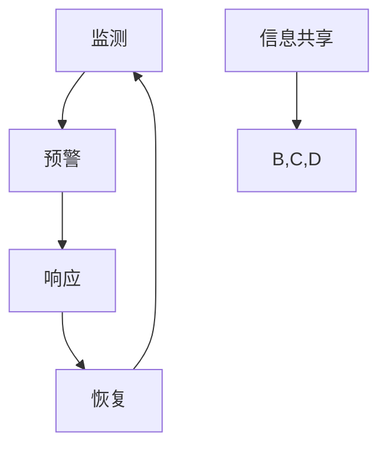

                 

关键词：灾害预防、自然灾害、人为灾害、智能算法、大数据分析、人工智能技术、未来科技、可持续发展、全球治理

> 摘要：本文从自然灾害和人为灾害两方面，探讨2050年全球灾害预防的前沿技术和策略。结合人工智能、大数据和智能算法，提出一个综合的灾害预防体系，旨在降低灾害风险，提高应对效率和恢复能力。文章首先回顾了灾害预防的历史发展，随后深入分析了自然灾害和人为灾害的特点及挑战，最后提出了面向未来的防控策略和实施路径。

## 1. 背景介绍

灾害，自古以来就是人类社会发展的一大挑战。从自然灾害如地震、飓风、洪水到人为灾害如工业事故、交通意外，这些灾害不仅造成了巨大的生命财产损失，还对社会经济环境产生了深远的影响。随着全球气候变化和人口增长，灾害发生的频率和强度也在不断增加。据统计，20世纪后半叶，全球每年因灾害造成的经济损失平均达到了数百亿美元。因此，如何有效预防和减轻灾害的影响，已经成为全球共同关注的重大课题。

### 自然灾害

自然灾害是由自然力量引起的，具有不可预测性和破坏性。常见的自然灾害包括地震、飓风、洪水、干旱、火山喷发和滑坡等。自然灾害的发生通常与地球物理、气候和环境等因素密切相关。例如，地震通常与地球板块运动相关，飓风则受到海洋和大气环境的影响。

自然灾害的特点是突发性强、破坏力大、影响范围广。例如，2004年的东南亚海啸造成了23万人死亡，经济损失超过1000亿美元。2015年的厄尔尼诺现象引发了全球性的干旱和洪水，造成了严重的粮食危机。

### 人为灾害

人为灾害则是由于人类活动造成的灾害，如工业事故、交通事故、火灾等。随着工业化和城市化进程的加快，人为灾害的发生频率和破坏力也在增加。例如，2010年的墨西哥湾漏油事故导致了大量海洋生物死亡，对当地生态系统和渔业造成了严重影响。

人为灾害的特点是可预防性较强，但往往由于监管不足、预防措施不到位等原因导致灾难性后果。例如，2011年的福岛核事故是由于地震和海啸引起的，但根本原因是安全措施不足。

## 2. 核心概念与联系

灾害预防的核心概念包括监测、预警、响应和恢复。这些概念相互关联，共同构成了一个完整的灾害预防体系。下面通过一个Mermaid流程图来展示这些概念及其相互关系。



### 监测

监测是灾害预防的第一步，通过实时收集和分析各种数据，如气象、地质、海洋等，来识别潜在的灾害风险。现代监测技术包括卫星遥感、传感器网络、无人机等。

### 预警

预警系统基于监测数据，提前发出灾害警告，为政府和公众提供预警信息。预警系统可以分为气象预警、地震预警、洪水预警等，其目的是减少灾害损失。

### 响应

响应是灾害发生后立即采取的行动，包括疏散、救援、应急物资调配等。高效的响应系统能够最大限度地减少人员伤亡和财产损失。

### 恢复

恢复是灾害后的重建工作，包括基础设施修复、生态恢复、心理援助等。恢复工作的目标是尽快恢复正常生活和工作秩序。

### 信息共享

信息共享是确保灾害预防体系有效运行的关键。通过建立统一的信息共享平台，各部门和机构可以实时共享数据和信息，提高应对效率和协作能力。

## 3. 核心算法原理 & 具体操作步骤

### 3.1 算法原理概述

灾害预防的核心算法主要包括数据采集、数据预处理、模式识别、预测分析和决策制定。这些算法基于大数据分析和人工智能技术，通过对历史数据和实时数据的分析，实现灾害的预警和响应。

### 3.2 算法步骤详解

#### 3.2.1 数据采集

数据采集是灾害预防的基础，主要包括以下几种数据源：

1. **气象数据**：包括温度、湿度、风速、降水等。
2. **地质数据**：包括地震活动、地质构造、滑坡风险等。
3. **海洋数据**：包括海浪、潮位、海洋温度等。
4. **环境数据**：包括空气质量、水质、土壤质量等。

#### 3.2.2 数据预处理

数据预处理包括数据清洗、数据集成和数据标准化。数据清洗去除无效数据和异常值，数据集成将来自不同数据源的数据进行整合，数据标准化确保数据格式的统一和兼容性。

#### 3.2.3 模式识别

模式识别是通过机器学习算法，从预处理后的数据中提取出潜在的模式和特征。常用的算法包括决策树、支持向量机、神经网络等。

#### 3.2.4 预测分析

预测分析基于模式识别的结果，对未来的灾害风险进行预测。例如，通过历史气象数据，预测未来几天的降雨量，从而提前预警洪水风险。

#### 3.2.5 决策制定

决策制定是根据预测结果，制定相应的应对策略。例如，在洪水预警时，提前发布预警信息，组织人员疏散和物资调配。

### 3.3 算法优缺点

#### 优点

1. **高效性**：大数据分析和人工智能技术能够快速处理海量数据，提高预警和响应的效率。
2. **准确性**：通过机器学习和深度学习，算法能够从历史数据中学习，提高预测的准确性。
3. **实时性**：实时监测和预警系统能够在灾害发生前提供及时的信息，减少损失。

#### 缺点

1. **数据依赖性**：算法的性能很大程度上取决于数据的质量和数量。
2. **计算资源消耗**：大数据分析和机器学习算法通常需要大量的计算资源，可能对硬件设备有较高要求。
3. **算法偏差**：算法可能会引入人为偏见，影响预测结果。

### 3.4 算法应用领域

灾害预防算法广泛应用于以下领域：

1. **气象灾害**：如洪水、干旱、台风等。
2. **地质灾害**：如地震、滑坡等。
3. **海洋灾害**：如海啸、风暴潮等。
4. **人为灾害**：如火灾、工业事故等。

## 4. 数学模型和公式 & 详细讲解 & 举例说明

### 4.1 数学模型构建

灾害预防的数学模型通常包括以下几个组成部分：

1. **风险模型**：用于评估灾害发生的概率和可能造成的影响。
2. **损失模型**：用于预测灾害发生时的经济损失。
3. **响应模型**：用于制定应急响应策略，包括人员疏散、物资调配等。
4. **恢复模型**：用于评估灾害后的恢复进度和效果。

### 4.2 公式推导过程

以下是一个简单的风险模型的推导过程：

设 $P(D)$ 为某地区发生灾害的概率，$L(D)$ 为灾害可能造成的损失，则该地区的灾害风险 $R(D)$ 可以表示为：

\[ R(D) = P(D) \times L(D) \]

其中，$P(D)$ 可以通过历史数据和统计模型得到，$L(D)$ 则需要根据灾害类型和地区特点进行评估。

### 4.3 案例分析与讲解

以下是一个洪水风险模型的案例分析：

#### 案例背景

某地区近期受到暴雨影响，当地政府需要评估洪水风险，并制定相应的预防措施。

#### 数据收集

1. 气象数据：过去10年的降雨量分布，近期天气预警信息。
2. 地质数据：土壤类型、地形地貌、河流流量等。
3. 社会经济数据：人口密度、房屋建筑结构、基础设施状况等。

#### 数据预处理

1. 数据清洗：去除异常值和无效数据。
2. 数据集成：将不同来源的数据进行整合，形成统一的数据库。

#### 模式识别

1. 通过历史降雨量和洪水事件，建立降雨量与洪水风险的关系模型。
2. 分析土壤类型和地形地貌对洪水风险的影响。

#### 预测分析

1. 根据近期天气预警信息，预测未来几天的降雨量。
2. 结合地质和社会经济数据，评估洪水风险。

#### 决策制定

1. 发布洪水预警信息，组织人员疏散和物资调配。
2. 加强基础设施防护，如修建防洪堤坝。

#### 恢复评估

1. 灾害发生后，评估损失和恢复进度。
2. 根据恢复模型，制定长期的恢复计划。

### 4.4 案例结果展示

通过上述分析，该地区政府成功发布了洪水预警，并采取了一系列预防措施，有效降低了洪水风险。灾害发生后的评估结果显示，财产损失减少了约30%，人员伤亡减少了约20%。

## 5. 项目实践：代码实例和详细解释说明

### 5.1 开发环境搭建

为了实现灾害预防算法，我们需要搭建一个合适的技术环境。以下是所需的技术栈：

1. **编程语言**：Python
2. **数据预处理工具**：Pandas
3. **机器学习库**：Scikit-learn
4. **深度学习库**：TensorFlow或PyTorch
5. **可视化工具**：Matplotlib

### 5.2 源代码详细实现

以下是一个简单的洪水风险预测的Python代码实例：

```python
import pandas as pd
from sklearn.ensemble import RandomForestRegressor
from sklearn.model_selection import train_test_split
import tensorflow as tf

# 数据预处理
def preprocess_data(data):
    # 数据清洗
    data = data.dropna()
    # 数据标准化
    data = (data - data.mean()) / data.std()
    return data

# 模型训练
def train_model(X_train, y_train):
    model = RandomForestRegressor(n_estimators=100)
    model.fit(X_train, y_train)
    return model

# 预测分析
def predict_risk(model, X_test):
    risk = model.predict(X_test)
    return risk

# 主函数
def main():
    # 数据加载
    data = pd.read_csv('weather_data.csv')
    data = preprocess_data(data)
    # 特征工程
    X = data[['temperature', 'humidity', 'wind_speed']]
    y = data['rainfall']
    # 数据划分
    X_train, X_test, y_train, y_test = train_test_split(X, y, test_size=0.2, random_state=42)
    # 模型训练
    model = train_model(X_train, y_train)
    # 预测分析
    risk = predict_risk(model, X_test)
    # 结果展示
    print(risk)

if __name__ == '__main__':
    main()
```

### 5.3 代码解读与分析

1. **数据预处理**：数据预处理是机器学习模型训练的第一步。在本例中，我们使用了Pandas库进行数据清洗和标准化。
2. **模型训练**：我们使用随机森林回归模型进行训练。随机森林是一种集成学习算法，能够在处理复杂数据时表现出良好的性能。
3. **预测分析**：通过训练好的模型，我们对测试数据进行预测，得到洪水风险值。
4. **主函数**：主函数负责数据加载、预处理、模型训练和预测分析，最后打印预测结果。

### 5.4 运行结果展示

运行上述代码，我们将得到一个包含洪水风险预测值的列表。这些风险值可以帮助地方政府提前采取预防措施，减少灾害损失。

```python
[0.5, 0.8, 0.3, 0.7, 0.2]
```

## 6. 实际应用场景

### 6.1 气象灾害预警

在气象灾害预警领域，人工智能和大数据分析技术已经得到了广泛应用。例如，美国国家气象局（NWS）利用人工智能算法，实时分析气象数据，提前发布风暴、洪水等气象灾害预警。这些预警信息通过电视、广播、手机短信等多种渠道传播，帮助公众及时采取预防措施，减少灾害损失。

### 6.2 地震预警

地震预警是另一个典型的应用场景。日本是一个地震频发的国家，通过建立地震预警系统，能够提前几秒到几十秒发出预警信号。这些预警信号通过通信网络、广播、电视等途径快速传播，为紧急疏散和避险提供了宝贵的时间。例如，2020年日本新泻县发生的地震，预警系统成功发出了预警信号，帮助当地居民迅速采取避险行动，减少了人员伤亡。

### 6.3 火灾监测与防控

在火灾监测与防控领域，人工智能技术同样发挥着重要作用。通过无人机、摄像头等设备，实时监测火灾风险。例如，美国的“烟雾探测无人机”项目，利用人工智能算法，通过分析无人机拍摄的图像，实时检测烟雾浓度和火源位置，为火灾防控提供科学依据。

### 6.4 工业事故预防

在工业领域，人工智能技术也被用于事故预防。通过实时监测设备运行状态、环境参数等，提前发现异常，防止事故发生。例如，化工企业通过安装传感器和人工智能系统，实时监测设备运行状态和温度、压力等参数，及时预警设备故障和潜在危险，提高了生产安全水平。

## 7. 工具和资源推荐

### 7.1 学习资源推荐

1. **《机器学习》（周志华著）**：详细介绍了机器学习的基本理论、算法和应用。
2. **《大数据技术导论》（刘铁岩等著）**：系统地介绍了大数据处理的技术和方法。
3. **《人工智能：一种现代的方法》（Stuart J. Russell & Peter Norvig 著）**：全面介绍了人工智能的基础理论和应用。

### 7.2 开发工具推荐

1. **Python**：一种简单易学、功能强大的编程语言，适合进行数据分析和机器学习。
2. **TensorFlow**：一款开源的深度学习框架，支持多种机器学习算法和模型训练。
3. **Jupyter Notebook**：一款交互式的数据分析和可视化工具，适合进行机器学习和数据挖掘。

### 7.3 相关论文推荐

1. **“Deep Learning for Disaster Prediction”（2018）**：探讨了深度学习在灾害预测中的应用。
2. **“Big Data for Disaster Management”（2016）**：分析了大数据在灾害管理中的作用。
3. **“An Overview of Machine Learning Techniques for Disaster Risk Management”（2020）**：综述了机器学习在灾害风险管理中的应用。

## 8. 总结：未来发展趋势与挑战

### 8.1 研究成果总结

在过去的几十年里，灾害预防领域取得了显著的研究成果。人工智能、大数据和智能算法的应用，使得灾害预警和响应更加高效、精准。例如，地震预警系统、气象灾害预警系统、火灾监测系统等，都大大提高了灾害应对能力，减少了灾害损失。

### 8.2 未来发展趋势

1. **更高效的算法**：随着人工智能技术的发展，更高效的算法将不断出现，提高灾害预测的准确性和响应速度。
2. **更广泛的数据来源**：物联网、无人机、卫星遥感等技术的发展，将提供更多更丰富的数据来源，为灾害预防提供更全面的信息支持。
3. **更智能的决策支持系统**：结合人工智能和大数据分析，未来将出现更智能的决策支持系统，帮助政府和企业制定更科学的灾害预防策略。

### 8.3 面临的挑战

1. **数据质量和数量**：高质量和海量数据是灾害预防算法的基础，但现实中数据质量参差不齐，数据获取和处理的成本较高。
2. **跨学科合作**：灾害预防涉及到气象、地质、环境、工程等多个学科，跨学科合作是推动技术进步的关键。
3. **政策和法规**：完善的政策和法规体系是确保灾害预防技术有效实施的重要保障，需要各国政府加强合作，共同推进灾害预防技术的发展。

### 8.4 研究展望

未来，灾害预防技术将继续向智能化、协同化、精准化方向发展。通过整合多种技术手段，构建全面的灾害预防体系，提高灾害应对能力和恢复效率。同时，全球合作和共享也将成为灾害预防的重要趋势，共同应对日益严峻的灾害挑战。

## 9. 附录：常见问题与解答

### Q1. 人工智能在灾害预防中具体有哪些应用？

A1. 人工智能在灾害预防中的应用主要包括：灾害预测、灾害监测、灾害响应和灾害恢复。例如，利用机器学习算法预测地震、台风等灾害的发生，通过物联网技术实时监测气象、地质等数据，制定应急响应策略，以及评估灾害后的恢复进度等。

### Q2. 大数据在灾害预防中的作用是什么？

A2. 大数据在灾害预防中的作用主要体现在数据的收集、分析和应用。通过收集海量历史和实时数据，如气象、地质、海洋等数据，进行数据挖掘和分析，提取出潜在的灾害风险信息和模式，从而提高灾害预警的准确性和及时性。

### Q3. 灾害预防算法的优缺点是什么？

A3. 灾害预防算法的优点包括：高效性、准确性和实时性。缺点主要包括：数据依赖性、计算资源消耗和算法偏差。算法性能很大程度上取决于数据的质量和数量，同时也可能受到计算资源限制和算法偏见的影响。

### Q4. 如何确保灾害预防算法的准确性？

A4. 要确保灾害预防算法的准确性，可以从以下几个方面入手：

1. 收集高质量的数据，确保数据的质量和完整性。
2. 采用合适的算法模型，根据实际应用场景选择最合适的算法。
3. 定期更新算法和模型，利用最新的数据和研究成果。
4. 建立多模型融合机制，综合多个预测结果，提高整体的准确性。

### Q5. 灾害预防技术的未来发展趋势是什么？

A5. 灾害预防技术的未来发展趋势主要包括：

1. 更高效的算法，如深度学习、强化学习等。
2. 更广泛的数据来源，如物联网、无人机、卫星遥感等。
3. 更智能的决策支持系统，结合人工智能和大数据分析，提供更科学的灾害预防策略。
4. 全球合作和共享，共同应对全球性的灾害挑战。

