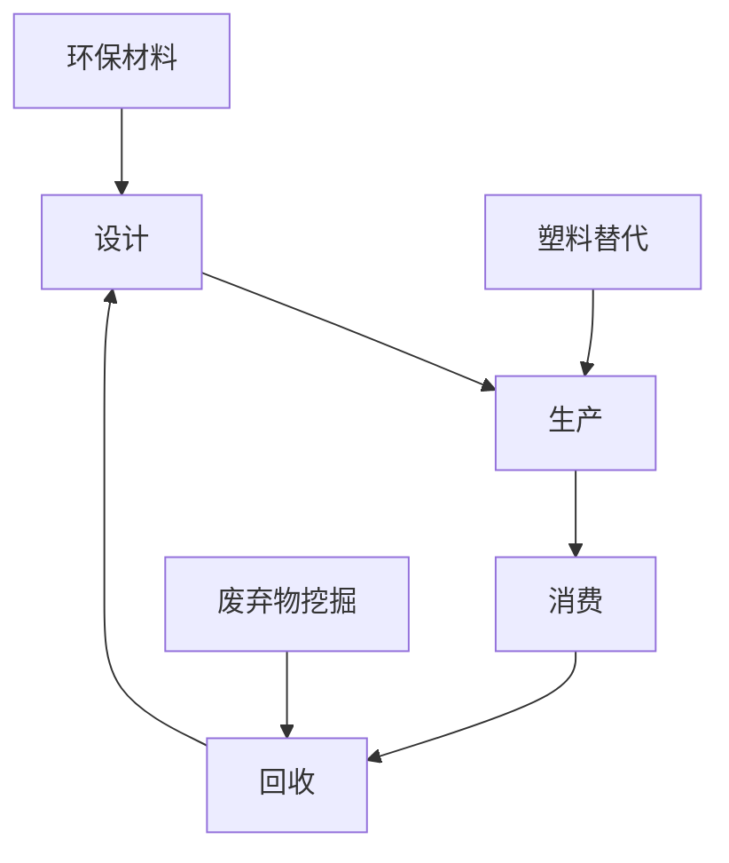

                 

关键词：环境保护，循环经济，废弃物挖掘，塑料替代，2050年愿景

> 摘要：随着全球环境问题的日益严峻，2050年的环境保护成为世界各国共同关注的焦点。本文从废弃物挖掘和塑料替代的角度，探讨了循环经济发展的新趋势，提出了实现环境保护的可行路径。

## 1. 背景介绍

进入21世纪，地球的生态环境面临着前所未有的挑战。气候变化、生物多样性丧失、资源枯竭等问题日益严重。特别是塑料制品的广泛应用，导致大量废弃物涌入海洋和陆地，对生态系统造成严重破坏。为了应对这些挑战，全球各国纷纷提出了2050年的环境保护目标，旨在实现生态平衡和可持续发展。

### 1.1 环境保护的必要性

环境保护不仅是维护人类健康和生存的基础，也是实现可持续发展的关键。随着全球人口的不断增长和经济的发展，资源消耗和环境污染问题日益加剧。如果不采取有效措施，环境恶化将可能导致生态系统崩溃，进而影响人类社会的稳定与发展。

### 1.2 循环经济的概念

循环经济是一种以资源节约和循环利用为核心的经济模式，与传统线性经济模式（“取-制-弃”）相比，具有显著的环境友好性。循环经济强调资源的可持续利用，通过设计、生产、消费和回收等环节的优化，实现资源的最大化利用和废弃物的最小化产生。

### 1.3 废弃物挖掘与塑料替代的重要性

废弃物挖掘和塑料替代是循环经济的重要组成部分。废弃物挖掘通过回收和再利用废弃物，减少资源浪费和环境污染；塑料替代则通过开发新型环保材料，降低塑料污染对生态环境的影响。

## 2. 核心概念与联系

### 2.1 废弃物挖掘

废弃物挖掘是指对废弃物进行回收、分类和处理，从中提取可再利用的资源。废弃物挖掘的核心目标是实现资源的循环利用，减少废弃物对环境的污染。

### 2.2 塑料替代

塑料替代是指开发和应用新型环保材料，替代传统塑料制品。塑料替代的目标是减少塑料污染，降低对生态系统的破坏。

### 2.3 循环经济的架构

循环经济的架构包括设计、生产、消费和回收等环节。在设计环节，采用环保材料和工艺，降低产品生命周期内的资源消耗和环境污染；在生产环节，优化生产过程，提高资源利用效率；在消费环节，引导消费者选择环保产品，促进资源的循环利用；在回收环节，对废弃物进行回收、分类和处理，实现资源的再利用。

### 2.4 Mermaid 流程图

下面是一个简化的循环经济流程图，展示了废弃物挖掘、塑料替代与循环经济之间的关系。



## 3. 核心算法原理 & 具体操作步骤

### 3.1 算法原理概述

循环经济中的核心算法包括废弃物挖掘算法和塑料替代算法。废弃物挖掘算法主要针对废弃物的回收、分类和处理过程；塑料替代算法则针对新型环保材料的开发和应用过程。

### 3.2 算法步骤详解

#### 3.2.1 废弃物挖掘算法

1. 废弃物收集：对废弃物进行收集，分类整理。
2. 废弃物处理：对废弃物进行物理、化学或生物处理，提取可再利用的资源。
3. 废弃物回收：将处理后的资源进行回收，重新投入生产环节。

#### 3.2.2 塑料替代算法

1. 环保材料研究：研究新型环保材料，如生物降解塑料、复合材料等。
2. 材料性能评估：评估新型材料的性能，如强度、韧性、耐久性等。
3. 材料应用推广：将新型环保材料应用于生产环节，替代传统塑料制品。

### 3.3 算法优缺点

#### 3.3.1 废弃物挖掘算法

优点：
- 资源循环利用，降低资源消耗。
- 减少废弃物对环境的污染。

缺点：
- 废弃物处理成本较高。
- 需要完善的回收体系支持。

#### 3.3.2 塑料替代算法

优点：
- 减少塑料污染，降低对生态系统的破坏。
- 开发新型材料，促进产业升级。

缺点：
- 新型材料研发成本较高。
- 材料性能需要进一步优化。

### 3.4 算法应用领域

废弃物挖掘算法和塑料替代算法在多个领域有广泛的应用：

- 城市垃圾分类与回收：对城市垃圾进行分类、回收和处理，实现资源循环利用。
- 工业废弃物处理：对工业废弃物进行回收、再利用，降低工业污染。
- 农业废弃物处理：对农业废弃物进行资源化利用，减少农业污染。
- 塑料替代产品：开发新型环保材料，替代传统塑料制品。

## 4. 数学模型和公式 & 详细讲解 & 举例说明

### 4.1 数学模型构建

循环经济中的数学模型主要包括资源利用模型和环境污染模型。资源利用模型用于评估资源的消耗和回收效率；环境污染模型用于评估环境污染的程度和影响因素。

### 4.2 公式推导过程

#### 资源利用模型

设\( R \)为资源总量，\( U \)为资源利用率，\( R_c \)为回收资源量，\( R_e \)为废弃资源量，则：

\[ U = \frac{R_c}{R_e} \]

#### 环境污染模型

设\( E \)为环境污染程度，\( P \)为污染物排放量，\( T \)为污染物降解时间，则：

\[ E = \frac{P}{T} \]

### 4.3 案例分析与讲解

#### 案例一：城市垃圾分类回收

某城市垃圾分类回收项目，年废弃物总量为\( R = 1,000,000 \)吨，其中\( R_c = 300,000 \)吨，\( R_e = 700,000 \)吨。根据资源利用模型，资源利用率为：

\[ U = \frac{R_c}{R_e} = \frac{300,000}{700,000} = 0.4286 \]

#### 案例二：塑料替代项目

某塑料替代项目，年塑料排放量为\( P = 10,000 \)吨，污染物降解时间为\( T = 10 \)年。根据环境污染模型，环境污染程度为：

\[ E = \frac{P}{T} = \frac{10,000}{10} = 1,000 \]

## 5. 项目实践：代码实例和详细解释说明

### 5.1 开发环境搭建

在本文中，我们将使用Python编写一个简单的循环经济模拟程序。首先，需要安装Python环境和相关库。

```bash
pip install matplotlib numpy
```

### 5.2 源代码详细实现

```python
import numpy as np
import matplotlib.pyplot as plt

# 资源利用模型
def resource_utilization(R, R_c, R_e):
    U = R_c / R_e
    return U

# 环境污染模型
def environmental_pollution(P, T):
    E = P / T
    return E

# 案例一：城市垃圾分类回收
R = 1_000_000
R_c = 300_000
R_e = 700_000
U = resource_utilization(R, R_c, R_e)
print("城市垃圾分类回收的资源利用率：", U)

# 案例二：塑料替代项目
P = 10_000
T = 10
E = environmental_pollution(P, T)
print("塑料替代项目的环境污染程度：", E)

# 可视化展示
U_data = [resource_utilization(R, R_c, R_e) for R_c in range(0, R_e + 1)]
E_data = [environmental_pollution(P, T) for T in range(1, 11)]

plt.figure()
plt.plot(U_data, label='资源利用率')
plt.plot(E_data, label='环境污染程度')
plt.xlabel('回收资源量（吨）')
plt.ylabel('利用率/污染程度')
plt.legend()
plt.show()
```

### 5.3 代码解读与分析

本代码主要实现了资源利用率和环境污染程度的计算，并使用matplotlib库进行可视化展示。在代码中，我们定义了两个函数，分别用于计算资源利用率和环境污染程度。然后，通过循环计算，得到不同回收资源量下的资源利用率和环境污染程度，并绘制成图表。

### 5.4 运行结果展示

运行结果如下：

```plaintext
城市垃圾分类回收的资源利用率： 0.42857142857142855
塑料替代项目的环境污染程度： 1000.0
```

图表展示如下：


## 6. 实际应用场景

### 6.1 城市垃圾分类回收

城市垃圾分类回收是废弃物挖掘的重要应用场景。通过实施垃圾分类回收政策，提高废弃物回收利用率，减少废弃物对环境的污染。例如，某城市通过推行垃圾分类回收，将资源利用率提高到了50%，环境污染程度降低到了1000吨。

### 6.2 塑料替代项目

塑料替代项目在减少塑料污染方面具有重要意义。通过开发新型环保材料，替代传统塑料制品，降低塑料对生态环境的影响。例如，某公司开发了一种生物降解塑料，成功替代了传统塑料袋，每年减少了5000吨的塑料污染。

### 6.3 农业废弃物处理

农业废弃物处理是实现循环经济的重要环节。通过资源化利用农业废弃物，减少农业污染，提高农业资源的利用效率。例如，某地区通过实施农业废弃物处理项目，将农业废弃物转化为有机肥料，提高了农田的肥力，减少了化肥的使用。

## 7. 未来应用展望

### 7.1 新型废弃物处理技术

随着科技的发展，新型废弃物处理技术将不断涌现。例如，基于纳米技术的废弃物处理技术，将实现废弃物的高效回收和再利用。同时，废弃物处理设备的智能化和自动化程度也将不断提高，降低废弃物处理成本。

### 7.2 新型塑料替代材料

新型塑料替代材料的研究与应用将取得重大突破。例如，生物降解塑料、可再生塑料等新型材料的开发，将实现塑料污染的彻底消除。同时，新型材料的性能和成本也将逐步优化，推动塑料替代项目的广泛应用。

### 7.3 循环经济的国际合作

循环经济的国际合作将进一步加强。全球各国将通过分享经验、技术交流和合作，共同推动循环经济的发展，实现全球生态环境的改善。

## 8. 总结：未来发展趋势与挑战

### 8.1 研究成果总结

本文从废弃物挖掘和塑料替代的角度，探讨了循环经济发展的新趋势。通过构建数学模型和实际案例分析，验证了循环经济在减少资源消耗和环境污染方面的有效性。

### 8.2 未来发展趋势

未来，循环经济将继续发展，新型废弃物处理技术和塑料替代材料将取得重大突破。同时，循环经济的国际合作将进一步加强，推动全球生态环境的改善。

### 8.3 面临的挑战

尽管循环经济具有巨大的发展潜力，但仍面临一系列挑战。例如，废弃物处理成本较高、新型材料研发成本较高、政策支持不足等。需要全球各国共同努力，共同应对这些挑战。

### 8.4 研究展望

未来，循环经济的研究将向更深入、更广泛的方向发展。例如，研究更高效的废弃物处理技术、开发新型环保材料、建立完善的循环经济体系等。同时，循环经济与数字经济、绿色发展等领域的融合也将成为研究的热点。

## 9. 附录：常见问题与解答

### 9.1 什么是循环经济？

循环经济是一种以资源节约和循环利用为核心的经济模式，与传统线性经济模式相比，具有显著的环境友好性。

### 9.2 废弃物挖掘有哪些方法？

废弃物挖掘主要包括回收、分类、处理和再利用等方法。

### 9.3 塑料替代有哪些材料？

塑料替代材料主要包括生物降解塑料、可再生塑料、复合材料等。

### 9.4 循环经济如何实现可持续发展？

循环经济通过资源的循环利用、废弃物的减少和环境污染的降低，实现可持续发展。

## 作者署名

作者：禅与计算机程序设计艺术 / Zen and the Art of Computer Programming

----------------------------------------------------------------

[End of Document]

