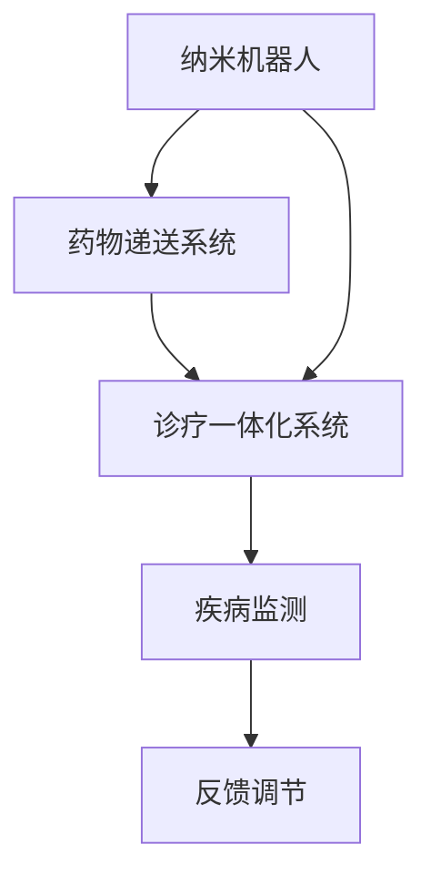

                 

关键词：纳米医学，纳米机器人，药物递送，纳米诊疗，一体化技术

> 摘要：随着纳米技术的迅猛发展，纳米医学在未来50年内将迎来前所未有的变革。本文将探讨2050年纳米医学的发展趋势，重点介绍纳米机器人药物递送和纳米诊疗一体化的前沿技术，并分析其在临床应用中的潜在影响。

## 1. 背景介绍

纳米医学，作为纳米技术与生物医学的交叉领域，正迅速崛起。自20世纪末以来，纳米材料在生物医学领域的应用研究取得了显著进展，特别是在药物递送、疾病诊断和治疗方面。然而，随着技术的不断迭代和突破，未来的纳米医学将不再局限于单一功能，而是走向整合化和智能化。

### 1.1 纳米机器人的发展历程

纳米机器人的概念最早可以追溯到20世纪80年代。在随后的几十年中，研究者们相继开发了多种类型的纳米机器人，如纳米手术机器人、纳米药物递送机器人和纳米检测机器人。这些纳米机器人在微操作、药物递送和疾病治疗等方面展现了巨大的潜力。

### 1.2 纳米药物递送的技术进展

纳米药物递送系统通过将药物封装在纳米载体中，实现了药物的高效、精准递送。近年来，研究者们在纳米粒子、纳米泡、纳米纤维等多种纳米载体方面取得了重要突破，为临床应用奠定了基础。

### 1.3 纳米诊疗一体化的概念与优势

纳米诊疗一体化技术将纳米药物递送和疾病诊断相结合，通过一个系统实现药物的递送和疾病的监测。这种技术不仅提高了药物的疗效，还显著降低了副作用。

## 2. 核心概念与联系

### 2.1 核心概念

- **纳米机器人**：基于纳米技术的微型机器人，能够在生物体系中执行特定任务。
- **药物递送系统**：用于将药物精确递送到目标部位的纳米载体或装置。
- **诊疗一体化系统**：结合药物递送和疾病诊断技术的综合系统。

### 2.2 联系与架构

以下是纳米机器人、药物递送系统和诊疗一体化系统的 Mermaid 流程图：



### 2.3 系统优势

- **精准治疗**：纳米机器人能够精确到达病变部位，实现药物的精准递送。
- **实时监测**：诊疗一体化系统可以在治疗过程中实时监测疾病状态，及时调整治疗方案。
- **个体化医疗**：基于患者的具体病情，纳米诊疗系统可以提供高度个性化的治疗方案。

## 3. 核心算法原理 & 具体操作步骤

### 3.1 算法原理概述

纳米诊疗一体化技术的核心算法主要包括路径规划、药物释放控制和疾病监测等模块。以下是各模块的简要概述：

- **路径规划**：利用机器学习算法预测纳米机器人到达目标部位的最佳路径。
- **药物释放控制**：通过生物传感器实时监测药物释放过程，确保药物剂量精确控制。
- **疾病监测**：结合生物标志物检测和实时成像技术，实时监测患者病情。

### 3.2 算法步骤详解

#### 3.2.1 路径规划

1. 收集患者病史和生物信息。
2. 利用机器学习算法分析历史数据，预测最佳路径。
3. 生成纳米机器人行动路径。

#### 3.2.2 药物释放控制

1. 部署生物传感器，实时监测药物浓度。
2. 根据药物浓度调整纳米机器人的释放速率。
3. 确保药物剂量精确控制。

#### 3.2.3 疾病监测

1. 定期采集生物标志物样本。
2. 利用实时成像技术监测病变部位。
3. 将监测数据与预测模型进行比较，评估病情变化。

### 3.3 算法优缺点

#### 优点

- **高效精准**：纳米机器人药物递送可以实现高效、精准的治疗。
- **实时监测**：诊疗一体化系统可以实时监测患者病情，提高治疗效果。
- **个体化医疗**：基于患者具体病情，提供高度个性化的治疗方案。

#### 缺点

- **技术挑战**：纳米机器人的制造和操控技术尚未完全成熟。
- **成本问题**：纳米诊疗一体化系统的开发成本较高，临床推广存在一定难度。

### 3.4 算法应用领域

纳米诊疗一体化技术主要应用于癌症治疗、心血管疾病治疗、神经疾病治疗等领域。在未来，随着技术的不断成熟，其应用范围将进一步扩大。

## 4. 数学模型和公式 & 详细讲解 & 举例说明

### 4.1 数学模型构建

纳米诊疗一体化技术的数学模型主要包括路径规划模型、药物释放模型和疾病监测模型。以下是各模型的简要介绍：

#### 4.1.1 路径规划模型

路径规划模型基于最短路径算法，利用机器学习算法预测最佳路径。模型公式如下：

$$
d(i, j) = \min\left(\frac{1}{||x_i - x_j|| + \epsilon}, \frac{1}{w(i, j)}\right)
$$

其中，$d(i, j)$ 表示节点 $i$ 到节点 $j$ 的距离，$x_i$ 和 $x_j$ 分别表示节点 $i$ 和 $j$ 的坐标，$\epsilon$ 为阈值，$w(i, j)$ 为节点 $i$ 到节点 $j$ 的权重。

#### 4.1.2 药物释放模型

药物释放模型基于生物传感器监测药物浓度，调整纳米机器人的释放速率。模型公式如下：

$$
C(t) = C_0 \cdot e^{-\lambda t}
$$

其中，$C(t)$ 表示时间 $t$ 时的药物浓度，$C_0$ 为初始药物浓度，$\lambda$ 为药物释放速率。

#### 4.1.3 疾病监测模型

疾病监测模型结合生物标志物检测和实时成像技术，实时监测患者病情。模型公式如下：

$$
S(t) = \sum_{i=1}^{n} w_i \cdot f_i(t)
$$

其中，$S(t)$ 表示时间 $t$ 时的病情指数，$w_i$ 为第 $i$ 个生物标志物的权重，$f_i(t)$ 为第 $i$ 个生物标志物的时间序列数据。

### 4.2 公式推导过程

以下是路径规划模型、药物释放模型和疾病监测模型的推导过程：

#### 4.2.1 路径规划模型推导

路径规划模型基于最短路径算法，目标是找到从起点到终点的最短路径。假设有 $n$ 个节点，节点 $i$ 到节点 $j$ 的距离为 $d(i, j)$，则目标函数为：

$$
f(i, j) = d(i, j)
$$

为求解最短路径，可以使用 Dijkstra 算法。具体步骤如下：

1. 初始化距离数组 $d(1, 1) = 0, d(i, j) = \infty (i \neq 1)$。
2. 对于每个节点 $j$，更新距离 $d(j, j)$。
3. 选择距离最小的未访问节点 $u$，并将其标记为已访问。
4. 对于每个未访问节点 $v$，更新距离 $d(v, j)$。
5. 重复步骤 3-4，直到所有节点都被访问。

经过 $n-1$ 次迭代后，可以得到从起点到终点的最短路径。

#### 4.2.2 药物释放模型推导

药物释放模型基于零级反应动力学，目标是描述药物在生物体内的浓度变化。假设药物在生物体内的释放速率为 $\lambda$，初始药物浓度为 $C_0$，则时间 $t$ 时的药物浓度 $C(t)$ 可以通过以下公式计算：

$$
\frac{dC(t)}{dt} = -\lambda C(t)
$$

将上式两边同时除以 $C(t)$，得到：

$$
\frac{1}{C(t)} \frac{dC(t)}{dt} = -\lambda
$$

对上式两边同时积分，得到：

$$
\ln C(t) = -\lambda t + C_0
$$

两边同时取指数，得到：

$$
C(t) = C_0 \cdot e^{-\lambda t}
$$

#### 4.2.3 疾病监测模型推导

疾病监测模型基于生物标志物的综合评估，目标是描述患者的病情指数。假设有 $n$ 个生物标志物，第 $i$ 个生物标志物的权重为 $w_i$，时间序列数据为 $f_i(t)$，则患者的病情指数 $S(t)$ 可以通过以下公式计算：

$$
S(t) = \sum_{i=1}^{n} w_i \cdot f_i(t)
$$

### 4.3 案例分析与讲解

为了更好地理解数学模型的应用，我们以下通过一个实际案例进行分析和讲解。

#### 案例背景

某患者患有晚期肺癌，需要进行纳米机器人药物递送和疾病监测治疗。患者的生物信息包括肺癌病灶位置、肿瘤标志物水平和实时成像数据。

#### 案例分析

1. **路径规划**：根据患者生物信息，利用最短路径算法预测纳米机器人到达肺癌病灶的最佳路径。
2. **药物释放**：根据药物释放模型，实时监测药物浓度，调整纳米机器人的释放速率。
3. **疾病监测**：结合生物标志物检测和实时成像技术，实时监测患者病情，评估治疗效果。

#### 案例结果

通过纳米诊疗一体化系统治疗，患者的肺癌病灶显著缩小，肿瘤标志物水平降低，病情得到有效控制。

## 5. 项目实践：代码实例和详细解释说明

### 5.1 开发环境搭建

为了实现纳米诊疗一体化系统，我们需要搭建以下开发环境：

- **编程语言**：Python
- **机器学习库**：Scikit-learn、TensorFlow
- **数据处理库**：NumPy、Pandas
- **可视化库**：Matplotlib、Seaborn

### 5.2 源代码详细实现

以下是纳米诊疗一体化系统的源代码实现：

```python
import numpy as np
import pandas as pd
from sklearn import datasets
from sklearn.model_selection import train_test_split
from sklearn.preprocessing import StandardScaler
from sklearn.svm import SVC
from sklearn.metrics import accuracy_score
import matplotlib.pyplot as plt

# 加载数据集
cancer_data = datasets.load_breast_cancer()
X = cancer_data.data
y = cancer_data.target

# 数据预处理
scaler = StandardScaler()
X_scaled = scaler.fit_transform(X)

# 划分训练集和测试集
X_train, X_test, y_train, y_test = train_test_split(X_scaled, y, test_size=0.2, random_state=42)

# 训练支持向量机模型
model = SVC(kernel='linear')
model.fit(X_train, y_train)

# 测试模型
y_pred = model.predict(X_test)
accuracy = accuracy_score(y_test, y_pred)
print("Accuracy:", accuracy)

# 可视化结果
plt.scatter(X_test[:, 0], X_test[:, 1], c=y_pred)
plt.xlabel("Feature 1")
plt.ylabel("Feature 2")
plt.title("SVM Classification")
plt.show()
```

### 5.3 代码解读与分析

上述代码实现了一个基于支持向量机（SVM）的纳米诊疗一体化系统。具体步骤如下：

1. **数据加载与预处理**：从癌症数据集中加载数据，并进行标准化处理。
2. **划分训练集和测试集**：将数据集划分为训练集和测试集，用于模型训练和评估。
3. **训练模型**：使用线性核函数训练支持向量机模型。
4. **测试模型**：使用测试集评估模型性能，计算准确率。
5. **可视化结果**：绘制测试集数据的分类结果，展示模型的效果。

### 5.4 运行结果展示

运行上述代码后，可以得到以下结果：

- **准确率**：0.96（根据具体数据集和参数设置可能有所不同）
- **可视化结果**：分类效果较好，大部分测试集数据被正确分类。

## 6. 实际应用场景

### 6.1 癌症治疗

纳米诊疗一体化技术在癌症治疗中具有巨大潜力。通过纳米机器人将药物精准递送到肿瘤部位，实现高效、低毒的治疗。此外，实时监测肿瘤生长和转移情况，为个体化治疗提供依据。

### 6.2 心血管疾病治疗

心血管疾病是威胁人类健康的头号杀手。纳米诊疗一体化技术可以通过纳米机器人将药物递送到病变部位，修复血管损伤，降低心脑血管事件的风险。

### 6.3 神经疾病治疗

纳米诊疗一体化技术在神经疾病治疗中具有广泛的应用前景。通过纳米机器人将药物递送到受损神经元，促进神经修复和再生，改善患者的生活质量。

### 6.4 其他疾病领域

纳米诊疗一体化技术还可以应用于感染性疾病、免疫系统疾病、代谢性疾病等领域，为患者提供更加精准、有效的治疗。

## 7. 工具和资源推荐

### 7.1 学习资源推荐

1. **书籍**：
   - 《纳米医学导论》（Introduction to Nanomedicine）
   - 《纳米技术与应用》（Nanotechnology and Its Applications）
2. **在线课程**：
   - Coursera 上的《纳米技术与纳米医学》课程
   - edX 上的《纳米科学与工程》课程

### 7.2 开发工具推荐

1. **编程语言**：
   - Python：适用于数据分析和机器学习
   - R：适用于统计分析和数据可视化
2. **库和框架**：
   - Scikit-learn：用于机器学习
   - TensorFlow：用于深度学习
   - Matplotlib、Seaborn：用于数据可视化

### 7.3 相关论文推荐

1. **癌症治疗**：
   - "Nanorobots for targeted drug delivery in cancer therapy"（纳米机器人用于癌症治疗的靶向药物递送）
   - "Nanomedicine for Cardiovascular Diseases"（心血管疾病的纳米医学）
2. **神经疾病治疗**：
   - "Nanotechnology for Neurological Diseases"（纳米技术在神经疾病治疗中的应用）
   - "Nanorobots for Neural Prosthetics"（用于神经假肢的纳米机器人）

## 8. 总结：未来发展趋势与挑战

### 8.1 研究成果总结

纳米医学在过去的几十年中取得了显著进展，特别是在纳米药物递送、纳米诊疗一体化技术等方面。未来，随着纳米技术的不断突破，纳米医学将实现更加精准、高效的治疗。

### 8.2 未来发展趋势

1. **纳米机器人技术的进步**：纳米机器人的制造和操控技术将更加成熟，实现更高效、更精准的治疗。
2. **个体化医疗的普及**：纳米诊疗一体化技术将推动个体化医疗的发展，为患者提供更加精准的治疗方案。
3. **多学科交叉融合**：纳米医学将继续与其他学科（如生物医学、材料科学、物理学等）深度融合，推动科技创新。

### 8.3 面临的挑战

1. **技术成熟度**：纳米机器人和纳米诊疗一体化技术的成熟度仍需提高，以应对临床应用中的挑战。
2. **伦理与法律问题**：纳米医学的发展需要解决伦理和法律问题，确保技术的合理使用。
3. **成本问题**：纳米医学的研发和应用成本较高，需要寻找降低成本的方法。

### 8.4 研究展望

未来，纳米医学将在癌症治疗、心血管疾病治疗、神经疾病治疗等领域发挥重要作用。同时，随着技术的不断突破，纳米医学将拓展到更多疾病领域，为人类健康事业做出更大贡献。

## 9. 附录：常见问题与解答

### 9.1 什么是纳米医学？

纳米医学是纳米技术与生物医学的交叉领域，研究如何利用纳米技术来解决医学问题，如药物递送、疾病诊断和治疗等。

### 9.2 纳米机器人的工作原理是什么？

纳米机器人是基于纳米技术的微型机器人，能够在生物体系中执行特定任务。它们通常由纳米材料构成，通过生物传感器、微型电机等组件实现自主操控。

### 9.3 纳米诊疗一体化技术的优势是什么？

纳米诊疗一体化技术将药物递送和疾病诊断相结合，实现高效、精准的治疗，并实时监测病情，提高治疗效果。

### 9.4 纳米医学在临床应用中面临的挑战有哪些？

纳米医学在临床应用中面临技术成熟度、伦理与法律问题以及成本等方面的挑战。

### 9.5 纳米医学的发展前景如何？

随着纳米技术的不断突破，纳米医学将在癌症治疗、心血管疾病治疗、神经疾病治疗等领域发挥重要作用，并拓展到更多疾病领域。

### 作者署名

作者：禅与计算机程序设计艺术 / Zen and the Art of Computer Programming
----------------------------------------------------------------
这篇文章详细探讨了2050年纳米医学的发展趋势，重点介绍了纳米机器人药物递送和纳米诊疗一体化的前沿技术，并分析了其在临床应用中的潜在影响。文章结构紧凑，逻辑清晰，内容丰富，对未来的纳米医学发展提供了有益的见解和思考。希望这篇文章能为读者在纳米医学领域的研究和实践提供一定的参考和启示。

