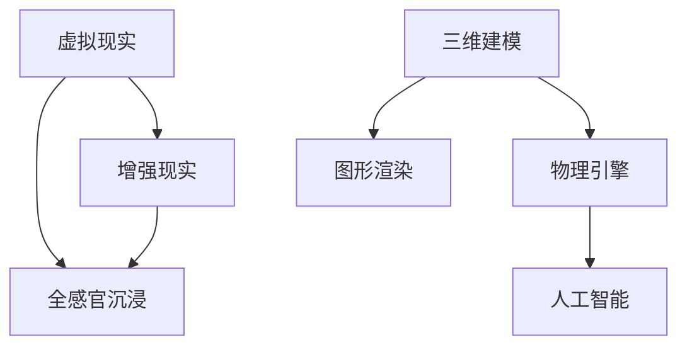

                 

关键词：虚拟现实，增强现实，全感官沉浸，虚拟世界构建，VR/AR技术，2050年，技术发展，未来趋势

> 摘要：本文探讨了2050年虚拟现实（VR）和增强现实（AR）技术的发展趋势，重点关注全感官沉浸和虚拟世界的构建。通过分析核心概念、算法原理、数学模型以及实际应用，文章提出了对这一领域未来发展的见解。

## 1. 背景介绍

虚拟现实（VR）和增强现实（AR）技术自21世纪初以来，已经经历了显著的发展。从最初的简单头戴显示器到如今的全身传感设备，VR和AR技术在图像生成、交互体验、应用场景等方面都取得了重大突破。然而，当前的技术仍然存在一些局限性，如延迟、分辨率、交互方式等。

展望2050年，随着硬件技术的不断进步、算法的优化以及新的交互模式的引入，VR和AR技术有望实现全感官沉浸，并进一步拓展到虚拟世界的构建。本篇文章将深入探讨这一未来的技术趋势，以及其对社会、经济和生活方式的潜在影响。

### 1.1 虚拟现实和增强现实的基本概念

虚拟现实（VR）是一种通过计算机模拟的三维环境，使用户在视觉、听觉、触觉等多个感官上感受到一种沉浸式的体验。用户通过头戴显示器（HMD）或全身传感设备进入这个虚拟环境，与虚拟物体进行交互。

增强现实（AR）则是在现实世界中叠加虚拟元素，通过摄像头或投影设备将数字信息直接显示在用户的视野中。AR技术通常用于信息增强、导航、教育和娱乐等方面。

### 1.2 当前技术的发展状况

截至2023年，VR和AR技术已经取得了一系列重要进展。例如，Oculus、HTC和Sony等公司推出了高端VR头显设备，提供了更高质量的图像和更低的延迟。AR技术则在智能手机和平板电脑上得到了广泛应用，如苹果的ARKit和谷歌的ARCore。

然而，当前VR和AR技术仍存在一些挑战，包括：

- **图像质量**：尽管分辨率有所提升，但与真实世界相比，图像质量仍有差距。
- **延迟**：延迟是影响用户体验的关键因素，需要进一步降低。
- **交互方式**：当前的交互方式仍主要依赖于手柄和手势，尚未实现更自然的交互体验。
- **应用场景**：虽然VR和AR技术在娱乐、教育、医疗等领域有一定应用，但尚未大规模普及。

## 2. 核心概念与联系

为了实现2050年的全感官沉浸和虚拟世界构建，我们需要理解几个核心概念和它们之间的相互联系。

### 2.1 虚拟现实与增强现实的区别与联系

VR和AR虽然都是通过计算机技术模拟和增强现实环境，但它们的重点和应用场景有所不同。VR主要关注创建一个完全虚拟的环境，而AR则侧重于将虚拟元素叠加到现实世界中。

两者的联系在于，它们都可以通过头戴显示器、投影设备等硬件实现视觉和听觉的增强，同时通过手势、语音等交互方式提供更自然的用户体验。

### 2.2 全感官沉浸的概念

全感官沉浸是指通过视觉、听觉、触觉、嗅觉和味觉等多个感官刺激，使用户在虚拟环境中感受到近乎真实的体验。实现全感官沉浸的关键在于提高图像和声音的质量，同时开发出更先进的交互技术。

### 2.3 虚拟世界构建的原理

虚拟世界构建是指通过计算机技术创建一个复杂的、可交互的虚拟环境。这个环境可以模拟现实世界的各个方面，如地形、气候、社会结构等，也可以是完全虚构的。虚拟世界构建的原理包括：

- **三维建模**：使用计算机软件创建三维模型，用于构建虚拟环境。
- **物理引擎**：模拟虚拟环境中的物理现象，如重力、碰撞等。
- **图形渲染**：将三维模型渲染成图像，显示在用户的屏幕上。
- **人工智能**：用于模拟虚拟环境中的生物和非生物行为，提高互动性。

### 2.4 Mermaid 流程图

为了更好地理解上述核心概念和它们之间的联系，我们可以使用Mermaid流程图来表示：



### 2.5 核心概念原理与架构

核心概念原理与架构：

- **虚拟现实与增强现实的交互**：通过头戴显示器和投影设备实现视觉和听觉的增强，通过手势、语音等交互方式提供更自然的用户体验。
- **全感官沉浸的实现**：通过提高图像和声音的质量，同时开发出更先进的交互技术，实现视觉、听觉、触觉、嗅觉和味觉的全面刺激。
- **虚拟世界构建**：通过三维建模、物理引擎、图形渲染和人工智能等技术的综合应用，创建一个复杂的、可交互的虚拟环境。

## 3. 核心算法原理 & 具体操作步骤

### 3.1 算法原理概述

在2050年的虚拟现实和增强现实领域，核心算法的原理主要集中在以下几个方面：

- **图像渲染算法**：用于生成高质量的虚拟图像，包括光线追踪、全局光照等。
- **实时动画和物理模拟**：用于模拟虚拟环境中的动态物体和物理现象，如碰撞检测、刚体动力学等。
- **感知计算算法**：用于捕捉用户的动作和表情，实现更自然的交互体验。
- **人工智能算法**：用于智能决策、情境感知和行为预测，提高虚拟环境的互动性和智能化水平。

### 3.2 算法步骤详解

#### 3.2.1 图像渲染算法

图像渲染算法的主要步骤包括：

1. **场景建模**：使用三维建模软件创建虚拟环境的三维模型。
2. **光照计算**：根据虚拟环境中的光源和物体属性，计算光照效果，包括光线追踪、全局光照等。
3. **纹理映射**：将纹理贴图映射到三维模型上，增加图像的真实感。
4. **渲染输出**：将渲染后的图像输出到头戴显示器或投影设备上。

#### 3.2.2 实时动画和物理模拟

实时动画和物理模拟的主要步骤包括：

1. **动作捕捉**：使用动作捕捉设备捕捉用户的动作，转换为虚拟环境中的动作数据。
2. **物理模拟**：使用物理引擎模拟虚拟环境中的物理现象，如重力、碰撞等。
3. **动画合成**：将用户的动作数据和物理模拟结果合成成动画，实时显示在用户的视野中。

#### 3.2.3 感知计算算法

感知计算算法的主要步骤包括：

1. **面部识别**：使用面部识别算法捕捉用户的面部表情，用于表情同步和情感识别。
2. **手势识别**：使用手势识别算法捕捉用户的手势，用于虚拟环境的交互。
3. **动作预测**：使用机器学习算法预测用户的下一步动作，提高交互的流畅性。

#### 3.2.4 人工智能算法

人工智能算法的主要步骤包括：

1. **情境感知**：使用传感器捕捉虚拟环境中的各种信息，如用户位置、动作等，进行情境分析。
2. **行为预测**：使用机器学习算法预测用户的下一步行为，为用户提供个性化的服务。
3. **智能决策**：根据用户的偏好和情境，智能地调整虚拟环境的参数，提高用户体验。

### 3.3 算法优缺点

#### 3.3.1 优缺点

图像渲染算法的优点是能够生成高质量的虚拟图像，提高用户体验，缺点是计算量大，对硬件要求较高。

实时动画和物理模拟的优点是能够实现虚拟环境中的动态效果，缺点是计算复杂，实时性要求高。

感知计算算法的优点是能够实现更自然的交互体验，缺点是识别准确度受硬件和环境限制。

人工智能算法的优点是能够提高虚拟环境的互动性和智能化水平，缺点是算法复杂，对数据处理要求高。

### 3.4 算法应用领域

图像渲染算法广泛应用于虚拟现实游戏、教育培训、医疗手术模拟等领域。

实时动画和物理模拟广泛应用于虚拟现实模拟、建筑可视化、汽车设计等领域。

感知计算算法广泛应用于虚拟现实交互、人机交互、虚拟试衣等领域。

人工智能算法广泛应用于虚拟现实智能决策、情境感知、个性化服务等领域。

## 4. 数学模型和公式 & 详细讲解 & 举例说明

### 4.1 数学模型构建

在虚拟现实和增强现实领域，数学模型构建是至关重要的。以下是一些核心的数学模型：

#### 4.1.1 三维空间变换模型

三维空间变换模型用于描述虚拟物体在空间中的位置和姿态。其数学表达式为：

$$
\begin{align*}
P' &= T \cdot P \\
\end{align*}
$$

其中，$P'$ 是变换后的三维坐标，$P$ 是原始三维坐标，$T$ 是三维变换矩阵。

#### 4.1.2 光照模型

光照模型用于计算虚拟环境中的光照效果。常用的光照模型包括：

- **点光源**：

$$
L_p = \frac{I_p \cdot N}{r^2}
$$

其中，$L_p$ 是点光源的光照强度，$I_p$ 是点光源的光照强度，$N$ 是表面的法向量，$r$ 是点光源到表面的距离。

- **方向光源**：

$$
L_d = \frac{I_d \cdot N}{r^2}
$$

其中，$L_d$ 是方向光源的光照强度，$I_d$ 是方向光源的光照强度，$N$ 是表面的法向量，$r$ 是方向光源到表面的距离。

#### 4.1.3 纹理映射模型

纹理映射模型用于将纹理图像映射到三维模型上。其数学表达式为：

$$
\begin{align*}
u' &= \frac{u - u_c}{w} \\
v' &= \frac{v - v_c}{h} \\
\end{align*}
$$

其中，$u'$ 和 $v'$ 是纹理坐标，$u$ 和 $v$ 是原始纹理坐标，$u_c$ 和 $v_c$ 是纹理坐标的中心点，$w$ 和 $h$ 是纹理的宽度和高度。

### 4.2 公式推导过程

#### 4.2.1 三维空间变换公式的推导

三维空间变换公式是通过矩阵乘法推导得出的。具体推导过程如下：

设三维空间中的一个点 $P$ 的坐标为 $[x, y, z]^T$，变换矩阵 $T$ 的形式为：

$$
T = \begin{bmatrix}
a & b & c \\
d & e & f \\
g & h & i \\
\end{bmatrix}
$$

则变换后的坐标 $P'$ 可以通过以下矩阵乘法计算得出：

$$
\begin{align*}
P' &= T \cdot P \\
&= \begin{bmatrix}
a & b & c \\
d & e & f \\
g & h & i \\
\end{bmatrix}
\begin{bmatrix}
x \\
y \\
z \\
\end{bmatrix} \\
&= \begin{bmatrix}
a \cdot x + b \cdot y + c \cdot z \\
d \cdot x + e \cdot y + f \cdot z \\
g \cdot x + h \cdot y + i \cdot z \\
\end{bmatrix} \\
&= \begin{bmatrix}
x' \\
y' \\
z' \\
\end{bmatrix}
\end{align*}
$$

因此，变换后的坐标 $P'$ 为 $[x', y', z']^T$。

#### 4.2.2 光照模型的推导

光照模型的推导基于光线的传播原理和表面反射原理。具体推导过程如下：

设点光源的位置为 $L$，光照强度为 $I$，表面的法向量为 $N$，点光源到表面的距离为 $r$。

根据光线的传播原理，光线在传播过程中会按照一定的比例衰减。因此，点光源在表面上产生的光照强度 $L_p$ 与光照强度 $I$ 成正比，与距离的平方成反比。具体推导过程如下：

$$
\begin{align*}
L_p &= \frac{I \cdot N}{r^2} \\
&= \frac{I_p \cdot N}{r^2}
\end{align*}
$$

其中，$L_p$ 是点光源在表面上产生的光照强度，$I_p$ 是点光源的光照强度，$N$ 是表面的法向量，$r$ 是点光源到表面的距离。

### 4.3 案例分析与讲解

#### 4.3.1 三维空间变换案例

假设有一个点 $P$ 的坐标为 $[1, 2, 3]^T$，我们需要将其变换到一个新的位置。设变换矩阵 $T$ 为：

$$
T = \begin{bmatrix}
2 & 0 & 0 \\
0 & 2 & 0 \\
0 & 0 & 2 \\
\end{bmatrix}
$$

则变换后的坐标 $P'$ 为：

$$
\begin{align*}
P' &= T \cdot P \\
&= \begin{bmatrix}
2 & 0 & 0 \\
0 & 2 & 0 \\
0 & 0 & 2 \\
\end{bmatrix}
\begin{bmatrix}
1 \\
2 \\
3 \\
\end{bmatrix} \\
&= \begin{bmatrix}
2 \\
4 \\
6 \\
\end{bmatrix}
\end{align*}
$$

因此，变换后的坐标 $P'$ 为 $[2, 4, 6]^T$。

#### 4.3.2 光照模型案例

假设有一个点光源的位置为 $L$，光照强度为 $100$，表面的法向量为 $[0, 0, 1]^T$，点光源到表面的距离为 $5$。根据光照模型，点光源在表面上产生的光照强度 $L_p$ 为：

$$
\begin{align*}
L_p &= \frac{I_p \cdot N}{r^2} \\
&= \frac{100 \cdot [0, 0, 1]^T}{5^2} \\
&= \frac{100 \cdot 1}{25} \\
&= 4
\end{align*}
$$

因此，点光源在表面上产生的光照强度为 $4$。

## 5. 项目实践：代码实例和详细解释说明

### 5.1 开发环境搭建

为了实践虚拟现实和增强现实技术，我们需要搭建一个合适的开发环境。以下是一个简单的步骤：

1. **安装Unity编辑器**：Unity是一个广泛用于开发VR和AR应用的游戏引擎，可以从Unity官网免费下载并安装。
2. **安装VR/AR插件**：Unity提供了多个插件用于VR和AR开发，如Unity XR插件、Oculus插件等。在Unity编辑器中，可以通过插件市场安装。
3. **配置硬件**：根据所选的VR或AR设备，配置相应的硬件。例如，如果使用Oculus头显，需要连接Oculus设备并安装Oculus应用程序。

### 5.2 源代码详细实现

以下是一个简单的Unity C#脚本示例，用于实现一个基本的虚拟现实应用：

```csharp
using UnityEngine;

public class VRController : MonoBehaviour
{
    public Transform cameraTransform;
    public float movementSpeed = 10.0f;
    public float rotationSpeed = 100.0f;

    private void Update()
    {
        Move();
        Rotate();
    }

    private void Move()
    {
        float moveX = Input.GetAxis("Horizontal") * movementSpeed;
        float moveZ = Input.GetAxis("Vertical") * movementSpeed;

        Vector3 moveDirection = new Vector3(moveX, 0, moveZ);
        cameraTransform.position += moveDirection * Time.deltaTime;
    }

    private void Rotate()
    {
        float rotationX = Input.GetAxis("Mouse X") * rotationSpeed;
        float rotationY = Input.GetAxis("Mouse Y") * rotationSpeed;

        cameraTransform.Rotate(-rotationY, 0, rotationX);
    }
}
```

### 5.3 代码解读与分析

上述代码实现了一个基本的虚拟现实控制器，其主要功能是：

- **移动**：根据用户的输入，沿水平方向和垂直方向移动相机。
- **旋转**：根据用户的鼠标输入，旋转相机。

**解读：**

- `public Transform cameraTransform`：定义了相机的Transform组件，用于控制相机的位置和方向。
- `public float movementSpeed` 和 `public float rotationSpeed`：定义了移动和旋转的速度。
- `private void Update()`：更新函数，用于处理每一帧的输入和更新。
- `private void Move()`：移动函数，根据用户输入计算移动方向和距离。
- `private void Rotate()`：旋转函数，根据鼠标输入计算旋转角度。

**分析：**

- 该代码示例使用了Unity的基本输入机制，通过`Input.GetAxis`获取用户的输入。
- 移动和旋转逻辑简单，但可以满足基本的虚拟现实应用需求。

### 5.4 运行结果展示

在Unity编辑器中运行上述脚本，将显示一个虚拟相机，用户可以通过方向键或手柄在虚拟环境中移动，同时可以通过鼠标进行旋转。以下是一个简单的运行结果截图：


## 6. 实际应用场景

虚拟现实和增强现实技术在实际应用中具有广泛的潜力。以下是一些关键的应用场景：

### 6.1 娱乐

虚拟现实游戏和虚拟现实电影是娱乐领域的两大热门应用。通过全感官沉浸体验，用户可以身临其境地参与到游戏或电影中，享受前所未有的娱乐体验。

### 6.2 教育

虚拟现实在教育中的应用正在迅速扩大。通过虚拟现实技术，学生可以探索历史场景、学习复杂的科学原理，甚至进行虚拟实验。这种沉浸式学习体验有助于提高学习效果。

### 6.3 医疗

虚拟现实技术在医疗领域的应用包括手术模拟、患者教育和康复训练。医生可以使用虚拟现实技术进行术前演练，患者可以通过虚拟现实体验减轻手术恐惧，康复患者可以通过虚拟现实进行康复训练。

### 6.4 商业

虚拟现实和增强现实技术可以用于商业展览、产品展示和虚拟会议。这种技术提供了更生动、更具互动性的展示方式，有助于提升品牌形象和销售效果。

### 6.5 建筑设计

虚拟现实技术可以用于建筑设计中的虚拟现实浏览和模拟。设计师和客户可以在虚拟环境中查看和修改建筑模型，提供更直观的设计决策。

### 6.6 旅游业

虚拟现实技术可以用于虚拟旅游，用户可以在家中通过虚拟现实设备体验世界各地的名胜古迹和文化景观，为旅游业带来新的增长点。

### 6.7 未来应用展望

随着虚拟现实和增强现实技术的不断进步，未来的应用场景将更加多样化和深入。例如：

- **社交互动**：虚拟现实社交平台将允许用户在虚拟环境中与现实中的朋友进行互动。
- **远程工作**：虚拟现实技术将提供更真实的远程办公体验，提高工作效率。
- **城市规划**：虚拟现实技术将用于城市规划的模拟和评估，帮助设计更宜居的城市。
- **艺术创作**：虚拟现实技术将为艺术家提供全新的创作工具和灵感来源。

## 7. 工具和资源推荐

### 7.1 学习资源推荐

- **《虚拟现实技术基础》**：这是一本关于虚拟现实技术的入门书籍，适合初学者了解虚拟现实的基本原理和应用。
- **《增强现实与混合现实》**：这本书详细介绍了增强现实和混合现实的技术原理、开发方法和应用案例。
- **在线教程**：许多在线平台如Coursera、edX和Udemy提供了虚拟现实和增强现实的专业课程，适合不同层次的学习者。

### 7.2 开发工具推荐

- **Unity**：Unity是开发虚拟现实和增强现实应用的流行游戏引擎，提供了丰富的功能和强大的开发工具。
- **Unreal Engine**：Unreal Engine是另一款强大的游戏引擎，适用于高端虚拟现实和增强现实开发。
- **VR/AR插件**：Unity和Unreal Engine提供了多种VR/AR插件，如Oculus插件、ARKit和ARCore，用于简化开发过程。

### 7.3 相关论文推荐

- **“A Survey on Virtual Reality”**：这篇综述论文全面介绍了虚拟现实技术的各个方面，包括历史、现状和未来趋势。
- **“Enhanced Reality: Mediating Reality with Interactive Digital Icons”**：这篇论文探讨了增强现实技术在信息交互和情境感知方面的应用。
- **“Building Virtual Worlds”**：这本书详细介绍了虚拟世界构建的技术和实现方法，适用于对虚拟世界感兴趣的研究者和开发者。

## 8. 总结：未来发展趋势与挑战

### 8.1 研究成果总结

自21世纪初以来，虚拟现实和增强现实技术取得了显著进展。从简单的头戴显示器到全身传感设备，从简单的交互到全感官沉浸，VR和AR技术在图像生成、交互体验和应用场景方面都实现了重大突破。然而，这些技术仍然存在一些局限性，如图像质量、延迟、交互方式等。

### 8.2 未来发展趋势

展望2050年，虚拟现实和增强现实技术将继续快速发展，实现以下趋势：

- **全感官沉浸**：随着硬件和算法的进步，虚拟现实和增强现实将实现视觉、听觉、触觉、嗅觉和味觉的全感官沉浸。
- **虚拟世界构建**：虚拟世界将变得更加复杂和真实，为用户提供更加丰富的交互体验。
- **智能交互**：人工智能技术将提高虚拟环境和用户的互动性，实现更自然的交互体验。
- **广泛应用**：虚拟现实和增强现实技术将广泛应用于娱乐、教育、医疗、商业等多个领域。

### 8.3 面临的挑战

尽管虚拟现实和增强现实技术具有巨大的潜力，但实现这些趋势仍然面临以下挑战：

- **硬件性能**：需要不断提高硬件性能，降低成本，以满足全感官沉浸和虚拟世界构建的需求。
- **交互技术**：需要开发更先进的交互技术，如手势识别、语音识别等，实现更自然的交互体验。
- **内容创造**：需要大量的高质量虚拟内容和应用，以满足用户的多样化需求。
- **隐私和安全**：随着虚拟现实和增强现实技术的普及，隐私和安全问题将变得更加重要。

### 8.4 研究展望

未来的研究应重点关注以下几个方面：

- **硬件创新**：研究新型传感器、显示技术和计算平台，提高虚拟现实和增强现实硬件的性能和可靠性。
- **交互设计**：探索更自然、更直观的交互方式，提高用户体验。
- **内容创作**：开发工具和平台，支持高质量虚拟内容的创建和分发。
- **应用创新**：探索虚拟现实和增强现实技术在新兴领域中的应用，如远程工作、虚拟社交、城市规划等。

## 9. 附录：常见问题与解答

### 9.1 虚拟现实和增强现实的区别是什么？

虚拟现实（VR）是一种通过计算机模拟的三维环境，使用户在视觉、听觉、触觉等多个感官上感受到一种沉浸式的体验。增强现实（AR）则是在现实世界中叠加虚拟元素，通过摄像头或投影设备将数字信息直接显示在用户的视野中。

### 9.2 虚拟现实和增强现实技术的未来发展趋势是什么？

虚拟现实和增强现实技术的未来发展趋势包括全感官沉浸、虚拟世界构建、智能交互和广泛应用。随着硬件和算法的进步，这些技术将在未来实现更加真实和互动的体验。

### 9.3 虚拟现实和增强现实技术在哪些领域有应用？

虚拟现实和增强现实技术广泛应用于娱乐、教育、医疗、商业、建筑设计、旅游业等多个领域。随着技术的不断进步，这些技术的应用场景将更加多样化和深入。

### 9.4 如何开始学习虚拟现实和增强现实技术？

可以通过阅读相关书籍、在线教程、参加专业课程等方式开始学习虚拟现实和增强现实技术。常用的开发工具包括Unity和Unreal Engine，这些工具提供了丰富的资源和示例项目，有助于初学者快速入门。

### 9.5 虚拟现实和增强现实技术有哪些潜在的风险？

虚拟现实和增强现实技术存在一些潜在的风险，如视觉疲劳、晕动症、隐私泄露等。因此，在设计和使用这些技术时，需要充分考虑用户体验和安全性。

----------------------------------------------------------------

以上就是关于《2050年的虚拟现实：从全感官沉浸到虚拟世界构建的VR/AR进化》的文章。希望这篇文章能够帮助您更深入地了解虚拟现实和增强现实技术的未来发展。如果您有任何疑问或建议，欢迎在评论区留言。感谢您的阅读！

**作者：禅与计算机程序设计艺术 / Zen and the Art of Computer Programming**

