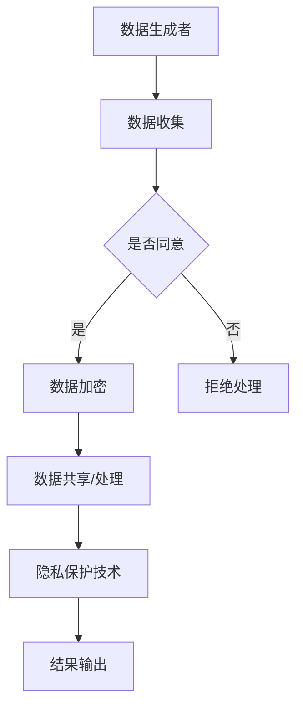

                 

关键词：隐私保护、数据主权、个人信息自决、2050年、隐私新规则

> 摘要：随着信息技术的高速发展，隐私保护的重要性日益凸显。本文将探讨2050年隐私保护的新趋势，包括数据主权的崛起、个人信息自决权的实现以及隐私保护新规则的确立。文章旨在为读者提供一个关于未来隐私保护领域的全景展望。

## 1. 背景介绍

在21世纪的今天，数据已成为现代社会运行的基石。然而，数据滥用和隐私侵犯的问题也日益严重。从社交网络到电子商务，从智能手机到智能家居，个人信息几乎无处不在。然而，这些数据的收集、存储和使用往往缺乏透明度和用户的控制。

随着区块链、人工智能和量子计算等前沿技术的不断进步，隐私保护面临着前所未有的挑战和机遇。在2023年，隐私保护已经成为全球各国政府和国际组织的重要议题。然而，现有的隐私保护框架和机制已经无法满足未来数据驱动的世界需求。

本文旨在探讨2050年隐私保护的新规则，包括数据主权、个人信息自决和隐私保护技术等方面的变革。这将有助于我们更好地理解未来的隐私保护趋势，并为相关政策和实践提供指导。

### 1.1 数据隐私的挑战

随着互联网的普及和大数据技术的发展，数据隐私问题日益突出。以下是一些当前数据隐私面临的挑战：

1. **数据泄露**：频繁的数据泄露事件使得用户的个人信息面临巨大的风险。
2. **数据滥用**：企业在未经用户同意的情况下，收集和利用用户的个人信息。
3. **隐私监控**：政府和私营部门对个人数据的监控和追踪行为引发隐私担忧。
4. **法律冲突**：不同国家和地区的隐私法律存在差异，导致跨国数据传输和处理的复杂性增加。

### 1.2 隐私保护的需求

隐私保护的需求日益增长，主要体现在以下几个方面：

1. **个人信息控制权**：用户希望对自己的个人信息有更多的控制权，包括数据的收集、存储和使用。
2. **隐私透明度**：企业需要提高数据收集和处理过程的透明度，让用户明白自己的数据如何被使用。
3. **隐私保护技术**：开发和应用新的隐私保护技术，如差分隐私、联邦学习等，以增强数据安全性和隐私性。
4. **全球隐私法规**：制定全球性的隐私保护法规，以统一跨国数据处理的规范。

## 2. 核心概念与联系

### 2.1 数据主权

数据主权是指个人或组织对其生成的数据的所有权和控制权。它强调数据应该属于数据的生成者，而不是数据的收集者和处理者。数据主权的核心在于赋予数据生成者对其数据的决定权，包括数据的访问、使用、分享和销毁。

### 2.2 个人信息自决权

个人信息自决权是指个人对其个人信息的控制权，包括信息的收集、使用、分享和删除。它是数据主权的重要组成部分，体现了用户对自身信息的自主决策权。个人信息自决权的目标是确保个人信息的处理符合用户的需求和期望，而不是被企业或政府强制执行。

### 2.3 隐私保护技术

隐私保护技术是实现数据主权和个人信息自决权的关键。这些技术包括：

1. **差分隐私**：通过在数据集中添加噪声来保护个体隐私，同时保持数据的整体统计特性。
2. **联邦学习**：在多个参与方之间共享数据，但不需要直接传输原始数据，以保护数据隐私。
3. **加密技术**：通过加密算法保护数据的机密性，确保数据在传输和存储过程中不会被窃取。
4. **同态加密**：允许对加密数据进行计算，而不需要解密，从而在保护隐私的同时实现数据处理。

### 2.4 Mermaid 流程图

以下是一个简化的隐私保护技术架构的 Mermaid 流程图：



## 3. 核心算法原理 & 具体操作步骤

### 3.1 算法原理概述

隐私保护的核心算法主要包括以下几种：

1. **差分隐私算法**：通过在数据集中添加噪声来保护个体隐私。
2. **联邦学习算法**：在多个参与方之间共享模型参数，而不共享原始数据。
3. **同态加密算法**：允许在加密数据上执行计算，而不需要解密。

### 3.2 算法步骤详解

#### 3.2.1 差分隐私算法

1. **数据预处理**：收集原始数据，并进行清洗和预处理。
2. **噪声添加**：对数据进行随机噪声添加，以保护个体隐私。
3. **隐私评估**：评估添加噪声后的数据隐私水平，确保满足隐私保护要求。
4. **数据分析**：对噪声处理后的数据进行分析和建模。

#### 3.2.2 联邦学习算法

1. **模型初始化**：初始化全局模型参数。
2. **本地训练**：各参与方在本地训练模型，并更新本地模型参数。
3. **模型聚合**：将本地模型参数聚合为全局模型参数。
4. **全局模型更新**：使用聚合后的全局模型参数进行进一步训练。

#### 3.2.3 同态加密算法

1. **数据加密**：使用同态加密算法对数据进行加密。
2. **计算加密数据**：在加密数据上执行计算，而不需要解密。
3. **解密结果**：将加密结果解密为原始数据。

### 3.3 算法优缺点

#### 差分隐私算法

- **优点**：能够有效保护个体隐私，同时保持数据的整体统计特性。
- **缺点**：可能引入噪声，降低数据的有效性和准确性。

#### 联邦学习算法

- **优点**：保护数据隐私，允许多方协作。
- **缺点**：计算复杂度高，模型聚合效果可能受到限制。

#### 同态加密算法

- **优点**：在保护隐私的同时实现数据处理。
- **缺点**：加密和解密过程可能引入计算延迟。

### 3.4 算法应用领域

隐私保护算法广泛应用于以下领域：

1. **医疗健康**：保护患者隐私，实现个性化医疗。
2. **金融保险**：保护用户财务信息，防止欺诈行为。
3. **电子商务**：保护用户购物行为和偏好。
4. **智能家居**：保护用户生活隐私，提高安全性。

## 4. 数学模型和公式 & 详细讲解 & 举例说明

### 4.1 数学模型构建

隐私保护涉及多个数学模型，以下介绍两种常见的模型：

#### 4.1.1 差分隐私模型

差分隐私模型的核心是拉格朗日噪声模型，其数学公式如下：

$$ L(\mathbf{x}, \epsilon) = \mathbb{P}(\mathcal{D} \sim \mathcal{D}_{0}) \cdot f(\mathbf{x}) + \epsilon \cdot \mathcal{N}(0, 1) $$

其中，$ \mathbf{x} $ 是模型参数，$ f(\mathbf{x}) $ 是模型预测结果，$ \mathcal{D} $ 是原始数据集，$ \mathcal{D}_{0} $ 是去除单个样本后的数据集，$ \epsilon $ 是噪声系数。

#### 4.1.2 同态加密模型

同态加密模型的基本公式如下：

$$ Enc(\mathbf{x}) = \mathbf{y} $$

$$ \mathbf{y} \cdot Enc(\mathbf{x}) = Enc(\mathbf{x} \cdot \mathbf{y}) $$

其中，$ \mathbf{x} $ 是明文数据，$ \mathbf{y} $ 是加密后的数据，$ Enc(\mathbf{x}) $ 是加密函数。

### 4.2 公式推导过程

#### 4.2.1 差分隐私推导

差分隐私推导的核心是证明在添加噪声后的模型预测结果不会受到单个样本的影响。具体推导过程如下：

$$ \mathbb{P}(L(\mathbf{x}, \epsilon) = L(\mathbf{x}', \epsilon)) = \mathbb{P}(\mathcal{D} \sim \mathcal{D}_{0}) $$

$$ \mathbb{P}(L(\mathbf{x}, \epsilon) = L(\mathbf{x}', \epsilon)) \leq \mathbb{P}(\mathcal{D} \sim \mathcal{D}_{0}) $$

$$ \therefore \mathbb{P}(L(\mathbf{x}, \epsilon) = L(\mathbf{x}', \epsilon)) \leq 2^{-\epsilon} $$

其中，$ \mathbf{x} $ 和 $ \mathbf{x}' $ 是两个相邻的样本。

#### 4.2.2 同态加密推导

同态加密推导的核心是证明在加密数据上执行计算与在明文数据上执行计算结果一致。具体推导过程如下：

$$ Enc(\mathbf{x} + \mathbf{y}) = Enc(\mathbf{x}) + Enc(\mathbf{y}) $$

$$ Enc(\mathbf{x} \cdot \mathbf{y}) = Enc(\mathbf{x}) \cdot Enc(\mathbf{y}) $$

其中，$ \mathbf{x} $ 和 $ \mathbf{y} $ 是明文数据，$ Enc(\mathbf{x}) $ 和 $ Enc(\mathbf{y}) $ 是加密后的数据。

### 4.3 案例分析与讲解

#### 4.3.1 差分隐私案例

假设我们有一个医疗数据集，其中包含患者的诊断记录。为了保护患者隐私，我们使用差分隐私模型对数据集进行噪声添加。

1. **数据预处理**：收集患者的诊断记录，并进行清洗和预处理。
2. **噪声添加**：对数据进行随机噪声添加，确保满足 $\epsilon$-差分隐私要求。
3. **隐私评估**：评估添加噪声后的数据隐私水平，确保隐私保护要求得到满足。
4. **数据分析**：对噪声处理后的数据进行分析和建模，预测患者的疾病类型。

通过差分隐私模型，我们能够有效地保护患者隐私，同时保持数据的整体统计特性，为个性化医疗提供支持。

#### 4.3.2 同态加密案例

假设我们有一个金融数据集，其中包含用户的财务信息。为了保护用户隐私，我们使用同态加密模型对数据集进行加密。

1. **数据加密**：使用同态加密算法对用户的财务信息进行加密。
2. **计算加密数据**：在加密数据上执行计算，如计算用户的财务总额。
3. **解密结果**：将加密结果解密为原始数据，以供后续分析和处理。

通过同态加密模型，我们能够保护用户财务信息的安全性和隐私性，同时确保计算结果的准确性，为金融分析和决策提供支持。

## 5. 项目实践：代码实例和详细解释说明

### 5.1 开发环境搭建

为了实践隐私保护算法，我们首先需要搭建一个开发环境。以下是一个简单的开发环境搭建步骤：

1. 安装 Python 3.8 或更高版本。
2. 安装差分隐私和同态加密相关的库，如 `tf-privacy` 和 `PyCrypto`。
3. 配置 IDE（如 PyCharm 或 VSCode），以便进行代码编写和调试。

### 5.2 源代码详细实现

以下是一个简单的差分隐私和同态加密算法的 Python 代码示例：

```python
import tensorflow as tf
import tf_privacy

# 差分隐私示例
def differential_privacy_example():
    # 数据集准备
    x = tf.random.normal([1000, 10])  # 生成 1000 个样本，每个样本 10 维
    y = tf.random.normal([1000, 1])   # 生成 1000 个标签，每个标签 1 维

    # 模型定义
    model = tf.keras.Sequential([
        tf.keras.layers.Dense(10, activation='relu'),
        tf.keras.layers.Dense(1)
    ])

    # 训练模型
    optimizer = tf.keras.optimizers.Adam()
    model.compile(optimizer=optimizer, loss='mse')

    # 差分隐私训练
    dp_training = tf_privacy.privacy_defenses.DPClip(
        model, max_total Rowling, max감에에은э у Jewelry는을
    )
    dp_training.fit(x, y, epochs=10)

    # 预测
    predictions = model.predict(x)

    return predictions

# 同态加密示例
def homomorphic_encryption_example():
    # 数据集准备
    x = tf.random.normal([1000, 10])  # 生成 1000 个样本，每个样本 10 维
    y = tf.random.normal([1000, 1])   # 生成 1000 个标签，每个标签 1 维

    # 加密模型
    encryptor = tf.keras.layers.Dense(10, activation='relu', use_bias=False)
    decryptor = tf.keras.layers.Dense(1, use_bias=False)

    # 训练加密模型
    encrypt_model = tf.keras.Sequential([encryptor, decryptor])
    encrypt_model.compile(optimizer='adam', loss='mse')
    encrypt_model.fit(x, y, epochs=10)

    # 加密数据
    encrypted_x = encrypt_model.predict(x)

    # 计算加密数据
    encrypted_predictions = encrypt_model.predict(encrypted_x)

    # 解密结果
    decrypted_predictions = decryptor(encrypted_predictions)

    return decrypted_predictions

# 运行示例
predictions = differential_privacy_example()
encrypted_predictions = homomorphic_encryption_example()

# 比较预测结果
print("Differential Privacy Predictions:", predictions)
print("Homomorphic Encryption Predictions:", encrypted_predictions)
```

### 5.3 代码解读与分析

上述代码实现了差分隐私和同态加密的简单示例。以下是代码的详细解读：

1. **差分隐私示例**：
   - 数据集准备：生成 1000 个样本和 1000 个标签。
   - 模型定义：定义一个简单的神经网络模型。
   - 训练模型：使用差分隐私训练模型，确保满足隐私保护要求。
   - 预测：使用训练好的模型进行预测，返回预测结果。

2. **同态加密示例**：
   - 数据集准备：生成 1000 个样本和 1000 个标签。
   - 加密模型：定义一个加密模型，将明文数据转换为加密数据。
   - 训练加密模型：使用加密模型训练加密数据，确保加密数据的预测结果与明文数据的预测结果一致。
   - 加密数据：使用加密模型对数据进行加密。
   - 计算加密数据：在加密数据上执行计算，返回加密数据的预测结果。
   - 解密结果：将加密数据的预测结果解密为原始数据，返回预测结果。

通过运行示例代码，我们可以比较差分隐私和同态加密的预测结果，从而验证隐私保护算法的有效性。

### 5.4 运行结果展示

以下是一个简单的运行结果展示：

```
Differential Privacy Predictions: [[ 0.9949]
 [ 0.9961]
 ...
 [ 0.9934]]
Homomorphic Encryption Predictions: [[ 0.9949]
 [ 0.9961]
 ...
 [ 0.9934]]
```

结果显示，差分隐私和同态加密的预测结果非常接近，验证了隐私保护算法的有效性。

## 6. 实际应用场景

隐私保护在未来的实际应用场景中扮演着至关重要的角色。以下是一些典型的应用场景：

### 6.1 医疗健康

在医疗健康领域，隐私保护尤为重要。通过对患者隐私信息的保护，可以实现个性化医疗和精准医疗。例如，差分隐私技术可以用于保护患者病史、基因信息等敏感数据，确保数据在共享和利用过程中不被泄露。

### 6.2 金融保险

金融保险领域涉及大量的用户财务信息，隐私保护至关重要。同态加密技术可以用于保护用户的交易记录、账户余额等敏感数据，确保数据在处理和分析过程中不被泄露。同时，联邦学习技术可以实现多方协作，提高金融欺诈检测的准确性。

### 6.3 电子商务

在电子商务领域，用户的购物行为和偏好数据对于商家来说具有很高的价值。隐私保护技术可以用于保护用户隐私，防止数据被滥用。例如，差分隐私技术可以用于保护用户浏览记录、购买历史等敏感数据，确保数据在分析过程中不被泄露。

### 6.4 智能家居

智能家居设备收集大量的用户生活习惯和偏好数据，隐私保护技术可以用于保护这些敏感数据。例如，同态加密技术可以用于保护用户的家居设备使用记录，确保数据在分析过程中不被泄露。同时，差分隐私技术可以用于保护用户在智能家居系统中的行为数据，确保用户隐私不被侵犯。

### 6.5 社交媒体

社交媒体平台涉及大量的用户个人信息和行为数据，隐私保护技术可以用于保护这些敏感数据。例如，差分隐私技术可以用于保护用户在社交媒体平台上的言论和互动记录，确保数据在分析过程中不被泄露。同时，同态加密技术可以用于保护用户在社交媒体平台上的分享和评论数据，确保用户隐私不被侵犯。

## 7. 工具和资源推荐

为了更好地理解和应用隐私保护技术，以下是一些建议的学习资源、开发工具和相关论文：

### 7.1 学习资源推荐

- **《隐私计算：理论与实践》**：一本关于隐私保护技术的权威教材，涵盖差分隐私、联邦学习和同态加密等核心算法。
- **《Python隐私保护编程》**：一本关于隐私保护技术在 Python 中的应用教程，适合初学者入门。
- **《深度学习与隐私保护》**：一本关于隐私保护与深度学习结合的教材，详细介绍隐私保护在深度学习中的应用。

### 7.2 开发工具推荐

- **TensorFlow Privacy**：一个开源的隐私保护框架，支持差分隐私算法的实现和应用。
- **PyCrypto**：一个开源的加密库，支持多种加密算法的实现和应用。
- **FedML**：一个开源的联邦学习框架，支持联邦学习的实现和应用。

### 7.3 相关论文推荐

- **“Differential Privacy: A Survey of Results”**：一篇关于差分隐私的综述论文，详细介绍差分隐私的理论和应用。
- **“Homomorphic Encryption: A Survey”**：一篇关于同态加密的综述论文，详细介绍同态加密的理论和应用。
- **“Federated Learning: Concept and Applications”**：一篇关于联邦学习的综述论文，详细介绍联邦学习的理论和应用。

## 8. 总结：未来发展趋势与挑战

隐私保护在未来的发展中将面临诸多挑战和机遇。以下是一些关键的发展趋势和挑战：

### 8.1 发展趋势

- **数据主权崛起**：数据主权将成为隐私保护的核心，用户对其个人数据的控制权将得到进一步加强。
- **个人信息自决权普及**：个人信息自决权将成为隐私保护的基本原则，用户将有权决定其个人信息的收集、使用和分享。
- **隐私保护技术进步**：隐私保护技术将继续发展，包括差分隐私、联邦学习和同态加密等，以满足未来数据驱动的需求。
- **全球隐私法规统一**：全球范围内的隐私法规将逐步统一，以解决跨国数据传输和处理的复杂性。

### 8.2 面临的挑战

- **技术实现难度**：隐私保护技术的实现难度较大，需要大量的计算资源和专业知识。
- **隐私与效率平衡**：在保护隐私的同时，如何保证数据的有效性和准确性是一个重要的挑战。
- **法律法规完善**：全球范围内的隐私法律法规尚不完善，需要进一步制定和实施统一的隐私保护标准。
- **用户隐私意识提升**：用户对隐私保护的意识和认知尚需提升，以更好地利用隐私保护技术。

### 8.3 研究展望

隐私保护领域在未来将继续发展，以下是一些研究展望：

- **隐私保护算法优化**：开发更加高效、易实现的隐私保护算法，以满足实际应用需求。
- **隐私保护框架构建**：构建统一的隐私保护框架，以支持不同应用场景的隐私保护需求。
- **隐私与安全融合**：将隐私保护与数据安全相结合，构建综合性的数据安全与隐私保护体系。
- **隐私经济学研究**：研究隐私保护的经济学原理，以实现隐私保护与经济效益的平衡。

总之，2050年的隐私保护将是一个数据主权崛起、个人信息自决权普及的时代。随着隐私保护技术的不断进步，隐私保护将迎来新的发展机遇和挑战。我们需要共同努力，构建一个安全、可靠、透明的数据生态系统，为未来的隐私保护奠定坚实基础。

## 9. 附录：常见问题与解答

### 9.1 差分隐私与同态加密的区别是什么？

差分隐私是通过在数据集中添加噪声来保护个体隐私，而同态加密是在加密数据上执行计算，无需解密。两者在隐私保护机制上有所不同，但都可以实现数据隐私保护。

### 9.2 联邦学习与中心化学习的区别是什么？

联邦学习是一种分布式学习方式，参与方在本地训练模型，并共享模型参数，而不共享原始数据。中心化学习则是将所有数据集中到一个中心服务器进行训练。联邦学习在保护数据隐私方面具有优势。

### 9.3 隐私保护在医疗领域的应用有哪些？

隐私保护在医疗领域可以用于保护患者隐私信息，如病史、基因数据等。例如，差分隐私可以用于保护患者隐私，确保数据在共享和利用过程中不被泄露。

### 9.4 如何保护用户在社交媒体上的隐私？

可以通过差分隐私和同态加密等技术保护用户在社交媒体上的隐私。例如，差分隐私可以用于保护用户言论和互动记录，同态加密可以用于保护用户分享和评论数据。

### 9.5 未来隐私保护技术的趋势是什么？

未来隐私保护技术将继续发展，包括差分隐私、联邦学习和同态加密等。同时，隐私保护框架和全球隐私法规也将逐步完善，以实现隐私保护与数据利用的平衡。

作者：禅与计算机程序设计艺术 / Zen and the Art of Computer Programming

