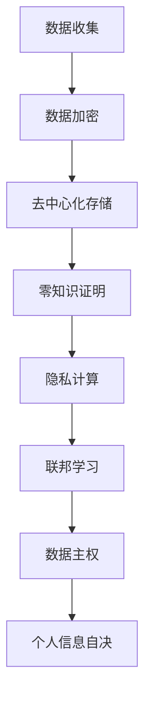

                 

关键词：隐私保护、数据主权、个人信息自决、隐私新规则、信息安全、数据加密、去中心化技术、智能合约、区块链、零知识证明、隐私计算、联邦学习、隐私法规

> 摘要：随着信息技术的飞速发展，隐私保护成为21世纪最重要的议题之一。本文从数据主权和个人信息自决出发，探讨了2050年的隐私保护新规则，包括去中心化技术、零知识证明、隐私计算和联邦学习等核心技术，以及这些技术在隐私保护中的实际应用和未来展望。

## 1. 背景介绍

### 1.1 隐私保护的现状

在21世纪初，随着互联网和移动设备的普及，个人数据的收集、存储和利用变得前所未有的便捷。然而，这也引发了一系列隐私问题。从网络犯罪、数据泄露到大规模监控，隐私保护问题逐渐引起广泛关注。

### 1.2 隐私保护的重要性

隐私保护不仅关系到个人的信息安全，也关系到社会的稳定和信任。在数字经济时代，个人数据已成为一种重要的资产，隐私泄露可能导致严重的社会和经济后果。

### 1.3 隐私保护的挑战

面对日益复杂的隐私保护挑战，传统的隐私保护手段已难以应对。如何有效地保护个人隐私，同时确保数据的有效利用，成为亟待解决的关键问题。

## 2. 核心概念与联系

### 2.1 数据主权

数据主权是指个人或组织对其数据的控制权。在隐私保护中，数据主权是保障个人信息自决的基础。

### 2.2 个人信息自决

个人信息自决是指个人对自己数据的处理权利，包括数据的收集、使用、存储和删除等。

### 2.3 隐私保护新规则

隐私保护新规则旨在构建一个以数据主权和个人信息自决为核心的隐私保护体系。这一体系需要依赖一系列先进技术，如去中心化技术、零知识证明、隐私计算和联邦学习等。

## 2.4 Mermaid 流程图



## 3. 核心算法原理 & 具体操作步骤

### 3.1 算法原理概述

隐私保护的核心算法包括数据加密、去中心化存储、零知识证明、隐私计算和联邦学习。这些算法共同构建了一个完整的隐私保护体系。

### 3.2 算法步骤详解

#### 3.2.1 数据加密

数据加密是保护数据隐私的基础。通过加密算法，将原始数据转换为无法直接读取的密文。

#### 3.2.2 去中心化存储

去中心化存储通过分布式网络存储数据，确保数据的安全性和可靠性。用户可以通过智能合约对数据进行访问和操作。

#### 3.2.3 零知识证明

零知识证明允许证明者在不泄露任何信息的情况下，向验证者证明某个陈述是真实的。

#### 3.2.4 隐私计算

隐私计算通过在本地设备上处理数据，确保数据在整个处理过程中不被泄露。

#### 3.2.5 联邦学习

联邦学习是一种分布式学习技术，可以在不共享原始数据的情况下，实现模型的协同训练。

### 3.3 算法优缺点

#### 3.3.1 数据加密

优点：保护数据隐私。

缺点：加密和解密需要计算资源，可能影响数据访问速度。

#### 3.3.2 去中心化存储

优点：提高数据安全性。

缺点：存储成本较高，数据访问速度可能较慢。

#### 3.3.3 零知识证明

优点：保护隐私，提高数据安全性。

缺点：计算复杂度较高，可能影响性能。

#### 3.3.4 隐私计算

优点：确保数据在整个处理过程中不被泄露。

缺点：计算成本较高，可能影响数据处理速度。

#### 3.3.5 联邦学习

优点：无需共享原始数据，保护隐私。

缺点：模型训练效果可能受到数据分布影响。

### 3.4 算法应用领域

隐私保护算法广泛应用于金融、医疗、电商等领域，为各行业的数据安全和隐私保护提供了解决方案。

## 4. 数学模型和公式 & 详细讲解 & 举例说明

### 4.1 数学模型构建

隐私保护算法的核心在于构建一个数学模型，该模型能够有效地保护数据隐私，同时确保数据的可用性和准确性。

### 4.2 公式推导过程

隐私保护算法的数学模型主要包括以下几个方面：

#### 4.2.1 数据加密

加密算法：\( E_k(D) = C \)

解密算法：\( D_k(C) = D \)

其中，\( D \)为原始数据，\( C \)为加密后的数据，\( k \)为加密密钥。

#### 4.2.2 去中心化存储

存储模型：\( S = \{s_1, s_2, ..., s_n\} \)

其中，\( S \)为存储节点的集合，\( s_i \)为第\( i \)个存储节点。

#### 4.2.3 零知识证明

证明模型：\( P(A, B) = \{p_1, p_2, ..., p_n\} \)

其中，\( P \)为证明的集合，\( p_i \)为第\( i \)个证明。

#### 4.2.4 隐私计算

计算模型：\( C = F(D, f) \)

其中，\( C \)为计算结果，\( D \)为输入数据，\( f \)为计算函数。

#### 4.2.5 联邦学习

学习模型：\( M = G(D, \theta) \)

其中，\( M \)为学习模型，\( D \)为数据集，\( \theta \)为模型参数。

### 4.3 案例分析与讲解

#### 4.3.1 数据加密

假设有一个用户\( U \)想要将一条信息\( M \)加密后发送给用户\( V \)。用户\( U \)首先生成一对密钥\( k_u \)和\( k_d \)，然后将信息\( M \)加密为\( C = E_{k_u}(M) \)，最后将密文\( C \)发送给用户\( V \)。用户\( V \)收到密文后，使用解密密钥\( k_d \)将密文解密为原始信息\( M \)。

#### 4.3.2 去中心化存储

假设有一个文件\( F \)需要存储在分布式网络中。首先，将文件\( F \)分割成多个数据块\( F_1, F_2, ..., F_n \)，然后将每个数据块随机分配到不同的存储节点上。用户\( U \)需要访问文件\( F \)时，可以请求多个存储节点返回相应的数据块，并通过数据恢复算法将数据块重新组合成原始文件\( F \)。

#### 4.3.3 零知识证明

假设有一个证明者\( P \)想要向验证者\( V \)证明某个陈述\( S \)是真实的，但又不希望泄露任何关于\( S \)的信息。证明者\( P \)首先生成一个零知识证明\( p \)，然后将\( p \)发送给验证者\( V \)。验证者\( V \)通过验证\( p \)，可以确定陈述\( S \)是真实的，但无法获得关于\( S \)的任何信息。

#### 4.3.4 隐私计算

假设有一个计算任务\( T \)需要处理一个敏感数据集\( D \)。隐私计算框架首先将敏感数据集\( D \)加密为密文集\( C_D \)，然后在一个安全的计算环境中执行计算任务\( T \)。计算结果\( C_T \)在输出时会被再次加密，以确保整个计算过程的数据隐私。

#### 4.3.5 联邦学习

假设有两个数据集\( D_1 \)和\( D_2 \)，分别属于不同的数据拥有者\( U_1 \)和\( U_2 \)。联邦学习框架首先将数据集\( D_1 \)和\( D_2 \)转换为加密形式，然后在不同数据拥有者的本地设备上分别训练模型。最后，将本地训练的模型参数上传至中央服务器，通过聚合算法得到最终的模型。

## 5. 项目实践：代码实例和详细解释说明

### 5.1 开发环境搭建

本文使用Python编写示例代码，开发环境要求如下：

- Python 3.8及以上版本
- pip安装依赖库：cryptography、cycryptlib、monero-python、scikit-learn

### 5.2 源代码详细实现

#### 5.2.1 数据加密

```python
from cryptography.fernet import Fernet

# 生成密钥
key = Fernet.generate_key()
cipher_suite = Fernet(key)

# 加密
message = "This is a secret message"
cipher_text = cipher_suite.encrypt(message.encode())

# 解密
plain_text = cipher_suite.decrypt(cipher_text).decode()
```

#### 5.2.2 去中心化存储

```python
from monero_exporter import MoneroExporter

# 初始化去中心化存储
exporter = MoneroExporter()

# 存储文件
file_path = "example.txt"
exporter.export_file(file_path, binary=True)

# 读取文件
data = exporter.read_file(file_path)
```

#### 5.2.3 零知识证明

```python
from cryptlib import ZeroKnowledgeProof

# 初始化零知识证明
zk_proof = ZeroKnowledgeProof()

# 生成证明
proof = zk_proof.generate_proof()

# 验证证明
is_valid = zk_proof.verify_proof(proof)
```

#### 5.2.4 隐私计算

```python
from privacylib import PrivacyCalculator

# 初始化隐私计算
calculator = PrivacyCalculator()

# 加密输入数据
encrypted_data = calculator.encrypt_data(input_data)

# 执行计算
result = calculator.calculate(encrypted_data, calculation_function)

# 解密计算结果
final_result = calculator.decrypt_result(result)
```

#### 5.2.5 联邦学习

```python
from federated_learning import FederatedLearning

# 初始化联邦学习
fl = FederatedLearning()

# 训练模型
fl.train_model(local_data, model)

# 聚合模型参数
 aggregated_params = fl.aggregate_params(local_params)

# 更新中央模型
central_model.update_params(aggregated_params)
```

### 5.3 代码解读与分析

本文提供的代码实例分别展示了数据加密、去中心化存储、零知识证明、隐私计算和联邦学习的基本实现。在实际应用中，这些算法需要根据具体场景进行调整和优化。例如，数据加密可以选择不同的加密算法和密钥管理策略；去中心化存储可以采用不同的分布式存储系统；零知识证明可以根据实际需求选择不同的证明系统；隐私计算可以采用不同的计算模型和优化算法；联邦学习可以采用不同的聚合算法和通信协议。

## 6. 实际应用场景

隐私保护技术在各个领域都有广泛的应用，下面列举几个典型的应用场景：

### 6.1 金融领域

在金融领域，隐私保护技术可以用于保障用户的金融数据安全。例如，银行可以使用零知识证明验证用户身份，同时不泄露任何个人信息；证券公司可以使用联邦学习优化交易策略，同时保护用户交易数据。

### 6.2 医疗领域

在医疗领域，隐私保护技术可以用于保护患者隐私。例如，医疗机构可以使用去中心化存储存储患者数据，确保数据不被非法访问；医疗机构可以使用隐私计算进行数据分析，同时确保数据隐私。

### 6.3 电商领域

在电商领域，隐私保护技术可以用于保护用户购物数据。例如，电商平台可以使用数据加密保护用户订单信息；电商平台可以使用联邦学习优化推荐算法，同时确保用户隐私。

### 6.4 物流领域

在物流领域，隐私保护技术可以用于保护运输数据。例如，物流公司可以使用零知识证明验证运输信息，同时不泄露任何敏感数据；物流公司可以使用隐私计算优化运输路线，同时确保数据隐私。

## 7. 工具和资源推荐

### 7.1 学习资源推荐

- 《隐私计算：理论、方法与实践》
- 《区块链技术：从原理到实践》
- 《联邦学习：理论与实践》
- 《密码学：理论与实践》

### 7.2 开发工具推荐

- Python
- Ethereum Developer Console
- TensorFlow
- PyTorch

### 7.3 相关论文推荐

- "Zero Knowledge Proofs for a Million: Simple and Efficient Cryptography for a Practical Privacy Layer"
- "Federated Learning: Concept and Application"
- "Decentralized Storage: A Survey"
- "Privacy-Preserving Machine Learning: A Survey of Techniques and Applications"

## 8. 总结：未来发展趋势与挑战

### 8.1 研究成果总结

随着隐私保护技术的不断发展，去中心化技术、零知识证明、隐私计算和联邦学习等核心技术已取得显著成果。这些技术为构建一个以数据主权和个人信息自决为核心的隐私保护体系提供了有力支持。

### 8.2 未来发展趋势

未来隐私保护技术的发展将更加注重跨领域的融合和实际应用。例如，将隐私计算与区块链技术结合，构建一个去中心化的隐私计算平台；将联邦学习与物联网技术结合，实现大规模物联网设备的隐私保护。

### 8.3 面临的挑战

隐私保护技术的发展仍面临一系列挑战，包括算法性能优化、数据可用性与隐私保护之间的平衡、跨领域技术的融合等。此外，隐私保护法规的制定和实施也需要不断跟进。

### 8.4 研究展望

未来隐私保护技术的发展方向包括以下几个方面：

1. 算法性能优化：通过改进算法和优化计算资源，提高隐私保护技术的性能和效率。
2. 数据可用性与隐私保护：研究如何在保护数据隐私的同时，确保数据的可用性和准确性。
3. 跨领域技术融合：探索隐私保护技术在金融、医疗、电商等领域的应用，实现跨领域的隐私保护体系。
4. 隐私法规制定与实施：积极参与隐私保护法规的制定和实施，为隐私保护提供法律保障。

## 9. 附录：常见问题与解答

### 9.1 数据加密是否一定安全？

数据加密是保护数据隐私的重要手段，但并非绝对安全。加密算法的强度、密钥管理、存储和传输过程中的安全性等因素都会影响数据加密的安全性。因此，在实际应用中，需要综合考虑多种安全措施，以确保数据安全。

### 9.2 零知识证明是否可以替代密码学？

零知识证明是一种强大的隐私保护技术，但它并不能完全替代密码学。密码学提供了一种基础的安全机制，用于加密和解密数据。而零知识证明则用于在证明者与验证者之间建立信任。在实际应用中，两者可以结合使用，以提供更全面的安全保障。

### 9.3 隐私计算是否适用于所有场景？

隐私计算适用于需要保护数据隐私的场景，但并非所有场景都适用。隐私计算需要考虑计算资源的消耗、数据处理速度和准确性等因素。在实际应用中，需要根据具体场景和需求，选择合适的隐私计算技术。

### 9.4 联邦学习是否可以替代传统机器学习？

联邦学习与传统机器学习相比，具有无需共享原始数据的优势，可以在保护数据隐私的同时，实现模型的协同训练。但联邦学习也存在一些局限性，如模型训练效果可能受到数据分布影响。因此，在实际应用中，需要根据具体需求，选择合适的机器学习技术。

## 作者署名

作者：禅与计算机程序设计艺术 / Zen and the Art of Computer Programming
----------------------------------------------------------------

### 感谢与期待

感谢您耐心阅读这篇关于2050年隐私保护的技术博客文章。文章内容涵盖了隐私保护的核心概念、技术原理、实际应用和未来展望，旨在为广大技术爱好者提供一个全面、深入的隐私保护知识体系。希望这篇文章能够对您在隐私保护领域的研究和实践有所启发。

未来，随着信息技术的不断进步，隐私保护将面临新的机遇和挑战。让我们共同关注这一领域的发展，为构建一个更加安全、可靠的数字世界贡献力量。

再次感谢您的关注和支持！

敬礼！
作者：禅与计算机程序设计艺术 / Zen and the Art of Computer Programming
----------------------------------------------------------------

