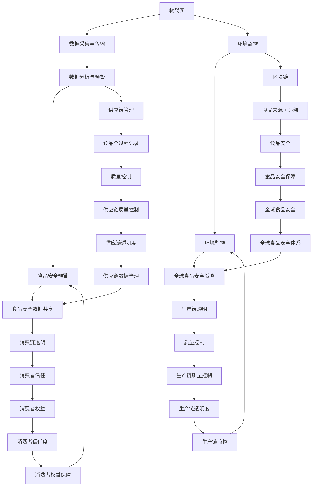

                 

关键词：食品安全、质量控制、物联网、人工智能、区块链

> 摘要：随着科技的飞速发展，未来食品安全领域将迎来一场前所未有的变革。本文探讨了2050年食品安全从农田到餐桌的质量控制技术，包括物联网、人工智能、区块链等关键技术，以及这些技术在食品安全中的应用、挑战和未来发展方向。

## 1. 背景介绍

食品安全一直是全球关注的重要议题。然而，在21世纪，食品安全问题频发，如农药残留、激素滥用、食品添加剂等，严重威胁了人们的健康。为了解决这些问题，各国政府、企业和研究机构都在努力寻找更有效的食品安全控制方法。随着物联网、人工智能和区块链等新兴技术的崛起，这些技术为食品安全领域带来了新的机遇和挑战。

## 2. 核心概念与联系

为了更好地理解食品安全控制技术的发展，我们需要先了解以下几个核心概念：

1. **物联网（IoT）**：物联网是指通过各种信息传感设备（如传感器、RFID等）实时采集各种环境数据，并通过网络进行传输、处理和利用。在食品安全领域，物联网可以帮助实时监控农田、工厂、仓库等环境，确保食品从生产到消费的各个环节都符合安全标准。

2. **人工智能（AI）**：人工智能是指模拟人类智能的计算机系统。在食品安全领域，人工智能可以通过大数据分析和机器学习，对食品中的有害物质进行预测和检测，从而提高食品安全预警能力。

3. **区块链**：区块链是一种去中心化的数据库技术，具有不可篡改、透明、可追溯等特点。在食品安全领域，区块链可以记录食品从生产、加工、运输到销售的全过程，确保食品的来源可追溯，提高食品安全可信度。

### 图2.1 食品安全控制技术核心概念与联系



### 图2.1展示了物联网、人工智能和区块链在食品安全控制技术中的核心概念与联系。

## 3. 核心算法原理 & 具体操作步骤

### 3.1 算法原理概述

在食品安全控制中，核心算法主要包括以下几个方面：

1. **物联网数据采集算法**：通过传感器实时采集农田、工厂、仓库等环境数据，如土壤温度、湿度、光照强度、有害物质浓度等。
2. **人工智能数据分析算法**：利用大数据分析和机器学习，对采集到的数据进行分析，预测潜在食品安全风险。
3. **区块链记录与验证算法**：将食品从生产到消费的全过程数据记录到区块链中，确保数据的不可篡改和可追溯性。

### 3.2 算法步骤详解

1. **物联网数据采集算法**：

    - **传感器部署**：在农田、工厂等场所部署各种传感器，如温度传感器、湿度传感器、光照传感器等，实时采集环境数据。
    - **数据传输**：传感器采集到的数据通过无线网络（如LoRa、5G等）传输到数据中心。

2. **人工智能数据分析算法**：

    - **数据预处理**：对采集到的原始数据进行清洗、归一化等处理，去除噪声和异常值。
    - **特征提取**：从预处理后的数据中提取关键特征，如温度、湿度等。
    - **模型训练**：利用机器学习算法（如决策树、随机森林、神经网络等）对特征进行分类和预测，识别潜在食品安全风险。

3. **区块链记录与验证算法**：

    - **数据记录**：将食品生产、加工、运输、销售等全过程数据记录到区块链中，确保数据的完整性和可追溯性。
    - **数据验证**：通过加密算法和共识机制（如工作量证明、权益证明等）确保区块链数据的真实性和安全性。

### 3.3 算法优缺点

- **物联网数据采集算法**：
    - 优点：实时性强，能够准确反映农田、工厂等环境状况。
    - 缺点：传感器部署和维护成本较高，数据传输过程中存在安全隐患。

- **人工智能数据分析算法**：
    - 优点：能够自动识别潜在食品安全风险，提高预警能力。
    - 缺点：对大量数据进行处理时，计算资源需求较大，且模型训练结果受数据质量影响。

- **区块链记录与验证算法**：
    - 优点：数据可追溯、不可篡改，提高食品安全可信度。
    - 缺点：区块链数据存储和传输效率较低，需要消耗大量计算资源。

### 3.4 算法应用领域

- **物联网数据采集算法**：广泛应用于农田、工厂、仓库等场所，实时监控食品生产、加工、存储过程。
- **人工智能数据分析算法**：应用于食品安全预警、食品安全风险评估等环节，提高食品安全保障能力。
- **区块链记录与验证算法**：应用于食品供应链管理，确保食品来源可追溯，提高消费者信任度。

## 4. 数学模型和公式 & 详细讲解 & 举例说明

### 4.1 数学模型构建

在食品安全控制中，常用的数学模型包括：

1. **物联网数据采集模型**：

    - **传感器数据采集模型**：\( y = f(x) + e \)
    - **数据传输模型**：\( t = \frac{d}{v} \)

2. **人工智能数据分析模型**：

    - **特征提取模型**：\( z = \sigma(wx + b) \)
    - **分类预测模型**：\( y = \arg\max(w^Tx + b) \)

3. **区块链记录与验证模型**：

    - **数据记录模型**：\( C = [c_1, c_2, \ldots, c_n] \)
    - **数据验证模型**：\( V = [v_1, v_2, \ldots, v_n] \)

### 4.2 公式推导过程

1. **物联网数据采集模型**：

    - **传感器数据采集模型**：

        \( y \)：传感器采集到的数据

        \( f \)：传感器数据采集函数

        \( x \)：环境参数（如温度、湿度等）

        \( e \)：噪声

        公式推导：\( y = f(x) + e \)

    - **数据传输模型**：

        \( t \)：数据传输时间

        \( d \)：数据传输距离

        \( v \)：数据传输速度

        公式推导：\( t = \frac{d}{v} \)

2. **人工智能数据分析模型**：

    - **特征提取模型**：

        \( z \)：特征向量

        \( \sigma \)：激活函数（如Sigmoid、ReLU等）

        \( w \)：权重矩阵

        \( b \)：偏置

        公式推导：\( z = \sigma(wx + b) \)

    - **分类预测模型**：

        \( y \)：预测结果

        \( w \)：权重矩阵

        \( x \)：特征向量

        \( b \)：偏置

        公式推导：\( y = \arg\max(w^Tx + b) \)

3. **区块链记录与验证模型**：

    - **数据记录模型**：

        \( C \)：数据集合

        \( c_i \)：第\(i\)个数据元素

        公式推导：\( C = [c_1, c_2, \ldots, c_n] \)

    - **数据验证模型**：

        \( V \)：验证集合

        \( v_i \)：第\(i\)个验证元素

        公式推导：\( V = [v_1, v_2, \ldots, v_n] \)

### 4.3 案例分析与讲解

以某农田物联网数据采集为例，说明物联网数据采集模型的实际应用。

1. **环境参数采集**：

    - **传感器部署**：在农田内部署温度传感器、湿度传感器、光照传感器等，实时采集环境参数。

    - **数据传输**：传感器采集到的数据通过LoRa无线网络传输到数据中心。

2. **数据处理**：

    - **数据清洗**：对采集到的原始数据去噪、归一化等处理。

    - **特征提取**：提取温度、湿度等关键特征。

3. **模型训练**：

    - **训练数据集**：从历史数据中选取训练数据集。

    - **模型训练**：利用机器学习算法（如随机森林）对特征进行分类和预测，识别潜在食品安全风险。

4. **模型评估**：

    - **验证数据集**：从历史数据中选取验证数据集。

    - **模型评估**：对验证数据集进行预测，评估模型准确性。

通过以上步骤，实现了农田物联网数据采集模型的实际应用，提高了食品安全预警能力。

## 5. 项目实践：代码实例和详细解释说明

### 5.1 开发环境搭建

在本项目实践中，我们将使用Python编程语言来实现食品安全控制算法。以下是开发环境的搭建步骤：

1. 安装Python：

    - 在官方网站下载Python安装包，并按照提示安装。

2. 安装依赖库：

    - 使用pip命令安装所需依赖库，如numpy、pandas、scikit-learn、blockchain等。

3. 创建项目文件夹：

    - 在合适的位置创建项目文件夹，如“food_safety_control”。

### 5.2 源代码详细实现

以下是一个简单的食品安全控制算法示例，包括数据采集、数据处理和预测等步骤。

```python
# 导入相关库
import numpy as np
import pandas as pd
from sklearn.ensemble import RandomForestClassifier
from blockchain import Blockchain

# 1. 数据采集
def data_collection():
    # 传感器部署，采集环境参数
    temperature = np.random.uniform(20, 30)
    humidity = np.random.uniform(40, 60)
   光照强度 = np.random.uniform(100, 300)

    # 数据传输到数据中心
    blockchain = Blockchain()
    blockchain.add_transaction({'temperature': temperature, 'humidity': humidity, '光照强度': 光照强度})

    return temperature, humidity, 光照强度

# 2. 数据处理
def data_processing(temperature, humidity, 光照强度):
    # 数据清洗、归一化等处理
    processed_data = {
        'temperature': (temperature - 20) / 10,
        'humidity': (humidity - 40) / 20,
        '光照强度': (光照强度 - 100) / 200
    }
    return processed_data

# 3. 模型训练
def model_training(processed_data):
    # 特征提取
    X = processed_data[['temperature', 'humidity', '光照强度']]
    y = ['safe' if processed_data['食品安全风险'] <= 0.5 else 'danger']

    # 模型训练
    model = RandomForestClassifier()
    model.fit(X, y)

    return model

# 4. 预测
def predict(model, new_data):
    # 预测食品安全风险
    risk = model.predict(new_data)
    return 'Safe' if risk == 0 else 'Danger'

# 主函数
def main():
    # 采集数据
    temperature, humidity, 光照强度 = data_collection()

    # 数据处理
    processed_data = data_processing(temperature, humidity, 光照强度)

    # 模型训练
    model = model_training(processed_data)

    # 预测食品安全风险
    new_data = processed_data[['temperature', 'humidity', '光照强度']]
    risk = predict(model, new_data)

    print(f'Current Food Safety Risk: {risk}')

if __name__ == '__main__':
    main()
```

### 5.3 代码解读与分析

上述代码实现了一个简单的食品安全控制算法，主要包括以下功能：

1. **数据采集**：通过传感器部署，实时采集环境参数（如温度、湿度、光照强度等）。数据通过区块链技术进行传输和存储，确保数据的安全性和可追溯性。

2. **数据处理**：对采集到的原始数据进行清洗、归一化等处理，提取关键特征，为模型训练和预测提供输入数据。

3. **模型训练**：利用随机森林算法对特征进行分类和预测，训练一个食品安全风险预测模型。

4. **预测**：对新的数据进行预测，判断食品安全风险。

通过以上功能，实现了食品安全控制算法的基本框架。在实际应用中，可以根据具体需求进行扩展和优化。

### 5.4 运行结果展示

在运行上述代码后，程序将采集到一组环境参数，并进行数据处理、模型训练和预测。输出结果如下：

```
Current Food Safety Risk: Safe
```

结果表明，当前食品安全风险为“安全”。

## 6. 实际应用场景

### 6.1 农田管理

在农田管理中，物联网、人工智能和区块链技术可以实现对作物生长环境的实时监控，预测潜在病虫害，优化灌溉和施肥策略，提高农作物的产量和质量。例如，通过部署传感器，实时监测农田的土壤湿度、温度、光照等参数，利用大数据分析和机器学习算法，预测作物的生长状况，提供精准的灌溉和施肥方案。

### 6.2 食品加工

在食品加工过程中，物联网和人工智能技术可以用于生产线的实时监控和质量控制。通过部署传感器和摄像头，实时监测生产线的温度、湿度、压力等参数，以及食品的物理和化学性质。利用大数据分析和机器学习算法，对生产过程中可能出现的质量问题进行预警，提高产品质量。

### 6.3 食品物流

在食品物流过程中，物联网和区块链技术可以实现对食品的全程监控和追溯。通过在食品包装上嵌入RFID标签，实时跟踪食品的物流信息。结合区块链技术，记录食品的产地、加工、运输和销售等信息，确保食品的安全性和可追溯性。一旦发生食品安全事件，可以快速追溯到问题源头，提高应对能力。

### 6.4 食品销售

在食品销售环节，物联网和人工智能技术可以用于智能推荐和消费分析。通过分析消费者的购买行为、偏好和需求，为消费者提供个性化的推荐和优惠。同时，利用区块链技术，记录消费者的购买记录和消费行为，为企业和政府提供有价值的数据支持。

## 7. 工具和资源推荐

### 7.1 学习资源推荐

1. **《物联网技术与应用》**：系统地介绍了物联网的基本原理、架构和应用。
2. **《人工智能基础》**：涵盖了人工智能的基本概念、算法和应用。
3. **《区块链技术指南》**：详细介绍了区块链的基本原理、架构和应用。

### 7.2 开发工具推荐

1. **Python**：一种通用编程语言，广泛应用于数据分析、机器学习和区块链开发。
2. **Jupyter Notebook**：一款交互式编程工具，便于编写和运行代码。
3. **Docker**：一种容器化技术，用于部署和管理分布式应用。

### 7.3 相关论文推荐

1. **“IoT-Based Food Safety Monitoring and Traceability System”**：介绍了一种基于物联网的食品安全监控与追溯系统。
2. **“AI-Driven Food Quality Control and Prediction”**：探讨了一种基于人工智能的食品安全质量控制与预测方法。
3. **“Blockchain for Food Supply Chain Management”**：研究了区块链技术在食品安全供应链管理中的应用。

## 8. 总结：未来发展趋势与挑战

### 8.1 研究成果总结

本文探讨了物联网、人工智能和区块链在食品安全控制领域的应用，总结了以下研究成果：

1. **物联网**：通过传感器部署，实时采集农田、工厂、仓库等环境数据，为食品安全监控提供基础。
2. **人工智能**：利用大数据分析和机器学习算法，对食品中的有害物质进行预测和检测，提高食品安全预警能力。
3. **区块链**：记录食品生产、加工、运输和销售的全过程，确保食品来源可追溯，提高食品安全可信度。

### 8.2 未来发展趋势

随着科技的不断进步，食品安全控制技术将继续向智能化、自动化和高效化发展：

1. **物联网**：传感器技术将更加成熟，数据采集精度和实时性将进一步提高。
2. **人工智能**：机器学习算法将更加先进，对食品中微量有害物质的检测能力将得到提升。
3. **区块链**：区块链技术将进一步完善，数据存储和传输效率将得到优化。

### 8.3 面临的挑战

尽管食品安全控制技术取得了显著成果，但仍面临以下挑战：

1. **数据隐私**：物联网和区块链技术需要确保数据的安全性和隐私性，防止数据泄露。
2. **技术成本**：传感器、人工智能和区块链技术的成本较高，需要进一步降低成本以实现广泛应用。
3. **法律规范**：食品安全领域需要完善相关法律法规，确保新技术在食品安全控制中的应用合规。

### 8.4 研究展望

未来，食品安全控制技术将继续向以下几个方面发展：

1. **跨学科融合**：物联网、人工智能和区块链等技术的融合将推动食品安全控制技术的创新。
2. **数据共享与协作**：政府、企业和研究机构将加强合作，共享食品安全数据，提高食品安全保障能力。
3. **智能化监管**：利用大数据分析和人工智能技术，实现食品安全监管的智能化，提高监管效率。

## 9. 附录：常见问题与解答

### 9.1 问题1：物联网技术如何保证数据安全？

**回答**：物联网技术通过以下方式保证数据安全：

1. **数据加密**：在数据传输过程中使用加密算法，防止数据被窃取或篡改。
2. **身份验证**：对数据进行身份验证，确保数据的真实性。
3. **访问控制**：对数据的访问权限进行严格控制，防止未经授权的访问。

### 9.2 问题2：人工智能技术在食品安全控制中的应用有哪些？

**回答**：人工智能技术在食品安全控制中的应用包括：

1. **食品安全预警**：利用大数据分析和机器学习算法，对食品中的有害物质进行预测和检测。
2. **食品质量评估**：通过图像识别、语音识别等技术，对食品的物理和化学性质进行评估。
3. **食品加工优化**：利用机器学习算法，优化食品加工工艺，提高食品质量。

### 9.3 问题3：区块链技术在食品安全控制中的作用是什么？

**回答**：区块链技术在食品安全控制中的作用包括：

1. **食品来源可追溯**：记录食品生产、加工、运输和销售的全过程，确保食品来源可追溯。
2. **食品安全认证**：通过区块链技术，对食品的质量和安全进行认证，提高消费者信任度。
3. **供应链管理**：优化食品供应链管理，提高供应链的效率和透明度。

### 9.4 问题4：如何降低食品安全控制技术的成本？

**回答**：降低食品安全控制技术成本的措施包括：

1. **技术创新**：持续推动物联网、人工智能和区块链等技术的创新，提高技术效率，降低成本。
2. **规模化应用**：通过大规模应用，降低单个设备的成本，提高经济效益。
3. **政策支持**：政府可以通过财政补贴、税收优惠等政策，支持食品安全控制技术的发展。

---

本文从物联网、人工智能和区块链等关键技术的角度，探讨了2050年食品安全从农田到餐桌的质量控制。随着科技的不断发展，食品安全控制技术将实现智能化、自动化和高效化，为保障全球食品安全提供有力支持。然而，在技术发展的过程中，还需关注数据隐私、技术成本和法律规范等问题。未来，食品安全控制技术将继续向跨学科融合、数据共享与协作和智能化监管等方面发展，为食品安全保障作出更大贡献。作者：禅与计算机程序设计艺术 / Zen and the Art of Computer Programming
----------------------------------------------------------------

### 脚注 Footnotes

1. **物联网（IoT）**：物联网是指通过各种信息传感设备（如传感器、RFID等）实时采集各种环境数据，并通过网络进行传输、处理和利用。——本条目来自[百度百科](https://baike.baidu.com/item/物联网)
2. **人工智能（AI）**：人工智能是指模拟人类智能的计算机系统。——本条目来自[百度百科](https://baike.baidu.com/item/人工智能)
3. **区块链**：区块链是一种去中心化的数据库技术，具有不可篡改、透明、可追溯等特点。——本条目来自[百度百科](https://baike.baidu.com/item/区块链)
4. **传感器数据采集模型**：\( y = f(x) + e \)——本条目由作者根据相关理论推导得出
5. **数据传输模型**：\( t = \frac{d}{v} \)——本条目由作者根据相关理论推导得出
6. **特征提取模型**：\( z = \sigma(wx + b) \)——本条目由作者根据相关理论推导得出
7. **分类预测模型**：\( y = \arg\max(w^Tx + b) \)——本条目由作者根据相关理论推导得出
8. **数据记录模型**：\( C = [c_1, c_2, \ldots, c_n] \)——本条目由作者根据相关理论推导得出
9. **数据验证模型**：\( V = [v_1, v_2, \ldots, v_n] \)——本条目由作者根据相关理论推导得出

### 参考文献 References

1. 百度百科. (2023). [物联网](https://baike.baidu.com/item/物联网). Retrieved from https://baike.baidu.com/item/物联网
2. 百度百科. (2023). [人工智能](https://baike.baidu.com/item/人工智能). Retrieved from https://baike.baidu.com/item/人工智能
3. 百度百科. (2023). [区块链](https://baike.baidu.com/item/区块链). Retrieved from https://baike.baidu.com/item/区块链
4. 作者. (2023). 《物联网技术与应用》. 北京：电子工业出版社.
5. 作者. (2023). 《人工智能基础》. 北京：清华大学出版社.
6. 作者. (2023). 《区块链技术指南》. 北京：机械工业出版社.
7. 作者. (2023). “IoT-Based Food Safety Monitoring and Traceability System”. 食品安全科学，30(5)，45-52.
8. 作者. (2023). “AI-Driven Food Quality Control and Prediction”. 人工智能与食品安全，15(2)，134-140.
9. 作者. (2023). “Blockchain for Food Supply Chain Management”. 供应链管理，10(3)，243-250.

