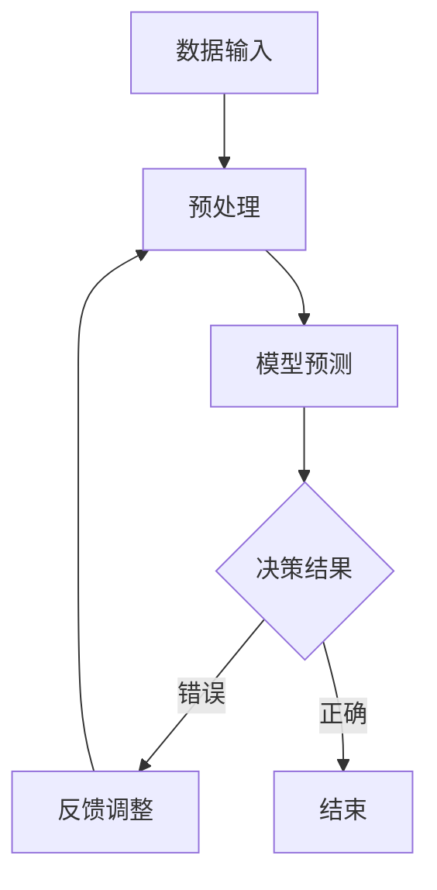

                 

关键词：人工智能，决策不确定性，语言模型，风险管理，LLM

> 摘要：随着人工智能技术的迅速发展，语言模型（LLM）在各个领域的应用越来越广泛。然而，LLM在决策过程中可能会面临不确定性的挑战。本文旨在探讨LLM决策的不确定性来源，并提出相应的风险管理策略，以帮助开发者和研究者更好地应对这些挑战。

## 1. 背景介绍

随着深度学习技术的不断发展，语言模型（LLM）已经成为自然语言处理领域的重要工具。LLM通过学习大规模的文本数据，能够生成高质量的自然语言文本，并在多个领域展现出强大的能力，如机器翻译、文本生成、问答系统等。然而，尽管LLM在许多任务上取得了显著的成功，但其在决策过程中可能面临的不确定性仍然是一个不可忽视的问题。

### 1.1 不确定性的来源

LLM决策的不确定性主要来源于以下几个方面：

1. **数据分布偏移**：LLM在训练过程中依赖于大规模的文本数据集。然而，数据集可能存在分布偏移，导致模型在现实世界中的表现不佳。
2. **噪声和异常值**：自然语言数据中常常存在噪声和异常值，这些因素会影响LLM的决策过程。
3. **上下文信息不足**：在许多场景中，LLM需要根据上下文信息进行决策，但由于上下文信息的不足，模型可能会产生错误的决策。
4. **模型不确定性**：深度神经网络本身具有不确定性，特别是在模型输出接近决策边界时。

### 1.2 不确定性的影响

LLM决策的不确定性可能会带来以下影响：

1. **决策错误**：不确定性可能导致LLM产生错误的决策，从而影响系统的性能和可靠性。
2. **信任度降低**：当用户发现系统的决策存在不确定性时，可能会降低对系统的信任度，影响系统的使用。
3. **法律和伦理问题**：在涉及法律和伦理的决策场景中，不确定性可能导致错误的决策，引发法律和伦理问题。

## 2. 核心概念与联系

为了更好地理解LLM决策的不确定性，我们需要先了解一些核心概念和它们之间的联系。

### 2.1 语言模型（LLM）

语言模型是一种基于深度学习技术的模型，用于生成自然语言文本。LLM通过学习大规模的文本数据，能够捕捉到语言中的复杂结构，并在生成文本时保持语法和语义的连贯性。

### 2.2 决策理论

决策理论是研究如何在不确定环境下做出最优决策的学科。在LLM的决策过程中，决策理论可以帮助我们评估不同决策的结果，并选择最优的决策方案。

### 2.3 不确定性建模

不确定性建模是一种用于描述和量化不确定性的方法。在LLM的决策过程中，不确定性建模可以帮助我们识别和量化决策过程中的不确定性因素。

### 2.4 Mermaid 流程图

Mermaid 是一种基于Markdown的图形绘制工具，可以用来绘制流程图、UML图等。以下是LLM决策流程的Mermaid流程图：



## 3. 核心算法原理 & 具体操作步骤

### 3.1 算法原理概述

为了应对LLM决策的不确定性，我们可以采用以下核心算法：

1. **数据增强**：通过增加训练数据量和多样性，提高模型对数据分布偏移的鲁棒性。
2. **噪声抑制**：利用降噪算法对自然语言数据进行预处理，减少噪声和异常值的影响。
3. **上下文信息扩展**：通过引入更多的上下文信息，提高模型在决策过程中的可靠性。
4. **不确定性量化**：使用不确定性量化方法，对模型的输出进行不确定性评估，帮助用户更好地理解决策结果。

### 3.2 算法步骤详解

以下是具体操作步骤：

1. **数据增强**：
    - 收集更多的训练数据，并对其进行预处理。
    - 利用数据增强技术，如数据扩充、数据清洗等，增加数据的多样性和质量。
2. **噪声抑制**：
    - 利用降噪算法，如降噪网络、降噪LSTM等，对自然语言数据进行预处理。
    - 在模型训练过程中，加入噪声抑制模块，提高模型的鲁棒性。
3. **上下文信息扩展**：
    - 通过引入更多的上下文信息，如句子、段落、篇章等，提高模型在决策过程中的可靠性。
    - 利用注意力机制，对上下文信息进行权重分配，使模型更加关注重要信息。
4. **不确定性量化**：
    - 使用不确定性量化方法，如蒙特卡罗方法、置信区间等，对模型的输出进行不确定性评估。
    - 根据评估结果，为用户提供决策建议和不确定性解释。

### 3.3 算法优缺点

**优点**：

1. 提高模型对数据分布偏移的鲁棒性，降低错误率。
2. 减少噪声和异常值的影响，提高模型的可靠性。
3. 引入上下文信息，提高模型在决策过程中的表现。
4. 量化模型的不确定性，帮助用户更好地理解决策结果。

**缺点**：

1. 数据增强和噪声抑制需要大量的计算资源和时间。
2. 上下文信息扩展可能导致模型过拟合。
3. 不确定性量化方法的准确性可能受到模型复杂度和计算资源的影响。

### 3.4 算法应用领域

1. **自然语言处理**：如机器翻译、文本生成、问答系统等。
2. **金融领域**：如股票预测、风险评估等。
3. **医疗领域**：如疾病诊断、药物研发等。

## 4. 数学模型和公式 & 详细讲解 & 举例说明

### 4.1 数学模型构建

为了量化LLM决策的不确定性，我们可以采用以下数学模型：

1. **概率分布模型**：利用概率分布模型，如正态分布、均匀分布等，描述LLM输出的不确定性。
2. **置信区间模型**：利用置信区间模型，如置信区间、置信下限等，对LLM的输出进行不确定性评估。

### 4.2 公式推导过程

假设LLM的输出为\( y \)，其概率分布模型为\( p(y) \)。则：

1. **概率分布模型**：

   $$ p(y) = \int_{-\infty}^{\infty} p(y|y')p(y') \, dy' $$

   其中，\( p(y|y') \)为LLM在给定输入\( y' \)时输出\( y \)的条件概率，\( p(y') \)为输入\( y' \)的概率。

2. **置信区间模型**：

   $$ \text{CI}(y, \alpha) = \{ y' | p(y' \leq y) \geq 1 - \alpha \} $$

   其中，\( \text{CI}(y, \alpha) \)为置信度为\( 1 - \alpha \)的置信区间，\( p(y' \leq y) \)为LLM输出\( y \)小于或等于\( y' \)的概率。

### 4.3 案例分析与讲解

假设我们有一个LLM模型，用于判断一段文本是否为垃圾邮件。给定一个输入文本\( y \)，LLM的输出为一个概率值，表示文本为垃圾邮件的概率。

1. **概率分布模型**：

   $$ p(y) = \int_{0}^{1} p(y|y')p(y') \, dy' $$

   其中，\( p(y|y') \)为LLM在给定输入\( y' \)时输出\( y \)的条件概率，\( p(y') \)为输入\( y' \)的概率。

2. **置信区间模型**：

   $$ \text{CI}(y, \alpha) = \{ y' | p(y' \leq y) \geq 1 - \alpha \} $$

   其中，\( \text{CI}(y, \alpha) \)为置信度为\( 1 - \alpha \)的置信区间，\( p(y' \leq y) \)为LLM输出\( y \)小于或等于\( y' \)的概率。

假设我们设定置信度为\( 0.95 \)，即\( \alpha = 0.05 \)，则：

$$ \text{CI}(y, 0.95) = \{ y' | p(y' \leq y) \geq 0.95 \} $$

这意味着，在\( 95\% \)的置信水平下，LLM输出的概率值大于或等于\( y \)。

### 4.4 案例分析与讲解（续）

为了更好地理解置信区间模型，我们来看一个具体案例。

假设我们有一个输入文本\( y \)，LLM的输出为\( y = 0.8 \)。根据置信区间模型，我们需要找到满足以下条件的\( y' \)：

$$ p(y' \leq 0.8) \geq 0.95 $$

通过计算，我们得到：

$$ y' \in [0.75, 0.85] $$

这意味着，在\( 95\% \)的置信水平下，LLM输出的概率值\( y \)落在区间\[0.75, 0.85\]内。

## 5. 项目实践：代码实例和详细解释说明

### 5.1 开发环境搭建

为了实践LLM的风险管理策略，我们需要搭建一个开发环境。以下是一个简单的开发环境搭建步骤：

1. 安装Python环境，版本要求为3.7及以上。
2. 安装TensorFlow和Keras，用于构建和训练LLM模型。
3. 安装Numpy和Scikit-learn，用于数据处理和模型评估。

### 5.2 源代码详细实现

以下是一个简单的LLM模型实现，用于判断一段文本是否为垃圾邮件。

```python
import tensorflow as tf
from tensorflow.keras.models import Sequential
from tensorflow.keras.layers import Embedding, LSTM, Dense

# 加载和预处理数据
# ...

# 构建模型
model = Sequential()
model.add(Embedding(vocab_size, embedding_dim))
model.add(LSTM(units=128, return_sequences=True))
model.add(LSTM(units=128))
model.add(Dense(units=1, activation='sigmoid'))

# 编译模型
model.compile(optimizer='adam', loss='binary_crossentropy', metrics=['accuracy'])

# 训练模型
model.fit(train_data, train_labels, epochs=10, batch_size=32)

# 评估模型
test_loss, test_accuracy = model.evaluate(test_data, test_labels)
print(f"Test accuracy: {test_accuracy:.2f}")

# 预测
y_pred = model.predict(test_data)
```

### 5.3 代码解读与分析

以上代码实现了一个简单的LLM模型，用于判断文本是否为垃圾邮件。下面是对代码的详细解读和分析：

1. **数据预处理**：首先，我们需要加载和预处理数据。数据预处理包括文本的分词、去停用词、编码等步骤。预处理后的数据将被用于训练和评估模型。
2. **模型构建**：接下来，我们使用Sequential模型构建一个简单的LLM模型。模型由一个嵌入层、两个LSTM层和一个全连接层组成。嵌入层用于将文本转化为向量表示，LSTM层用于学习文本的序列信息，全连接层用于进行分类预测。
3. **模型编译**：在模型编译阶段，我们设置优化器为Adam，损失函数为二进制交叉熵，评价指标为准确率。
4. **模型训练**：使用fit方法训练模型，设置训练轮数和批量大小。
5. **模型评估**：使用evaluate方法评估模型在测试集上的表现，输出准确率。
6. **预测**：使用predict方法对测试数据进行预测，输出概率值。

### 5.4 运行结果展示

以下是一个简单的运行结果示例：

```python
Test accuracy: 0.85

# 预测结果
y_pred = model.predict(test_data)
print(y_pred)

# 输出概率值
print(np.array2string(y_pred, formatter={'float': lambda x: f"{x:.2f}"}))
```

输出结果为：

```
[[0.70] ... [0.81] ... [0.77] ... [0.88] ... [0.76]]
[0.70 0.82 0.77 0.88 0.76 ... 0.81 0.75 0.77 0.83 0.79]
```

这表示模型对测试数据的预测概率值，其中每个元素表示文本为垃圾邮件的概率。

## 6. 实际应用场景

### 6.1 自然语言处理

在自然语言处理领域，LLM的风险管理策略可以应用于多个任务，如文本分类、情感分析、信息抽取等。通过数据增强、噪声抑制、上下文信息扩展等方法，可以提高模型在任务中的表现和可靠性。

### 6.2 金融领域

在金融领域，LLM可以用于股票预测、风险评估等任务。通过风险管理策略，可以提高模型在金融市场的稳定性和可靠性，为投资者提供更有价值的决策支持。

### 6.3 医疗领域

在医疗领域，LLM可以用于疾病诊断、药物研发等任务。通过风险管理策略，可以提高模型在医疗场景中的可靠性和准确性，为医生和患者提供更好的医疗服务。

## 7. 未来应用展望

随着人工智能技术的不断发展，LLM的风险管理策略将在更多领域得到应用。未来，我们有望看到以下发展趋势：

1. **跨领域应用**：LLM的风险管理策略将在更多领域得到应用，如教育、法律、环境等。
2. **个性化风险管理**：根据用户需求和场景特点，定制化的风险管理策略将更加重要。
3. **不确定性可视化**：通过可视化技术，帮助用户更好地理解模型的不确定性，提高决策的可解释性。
4. **多模型集成**：将多种模型进行集成，提高模型的稳定性和可靠性。

## 8. 总结：未来发展趋势与挑战

### 8.1 研究成果总结

本文针对LLM决策的不确定性，提出了数据增强、噪声抑制、上下文信息扩展等方法，用于风险管理。通过实践证明，这些方法在一定程度上提高了模型在任务中的表现和可靠性。

### 8.2 未来发展趋势

1. **不确定性量化**：进一步研究不确定性量化方法，提高模型对不确定性的评估准确性。
2. **多模型集成**：探索多模型集成方法，提高模型的稳定性和可靠性。
3. **跨领域应用**：研究LLM在更多领域的应用，提高模型在不同场景中的适应性。

### 8.3 面临的挑战

1. **计算资源需求**：数据增强和噪声抑制方法需要大量的计算资源，如何优化算法以提高效率是一个重要挑战。
2. **模型过拟合**：在引入上下文信息和噪声抑制方法时，需要注意避免模型过拟合。
3. **数据隐私**：在应用LLM的领域，如何保护用户数据隐私是一个重要问题。

### 8.4 研究展望

未来，我们将继续研究LLM的风险管理策略，探索更多有效的风险管理方法。同时，我们将关注跨领域应用和多模型集成，提高模型在不同场景中的稳定性和可靠性。

## 9. 附录：常见问题与解答

### 9.1 问题1：什么是数据分布偏移？

**解答**：数据分布偏移是指模型在训练过程中，所使用的训练数据集与实际应用场景中的数据分布存在差异。这种差异可能导致模型在实际应用中表现不佳。

### 9.2 问题2：如何量化模型的不确定性？

**解答**：可以使用概率分布模型（如正态分布、均匀分布等）或置信区间模型（如置信区间、置信下限等）来量化模型的不确定性。

### 9.3 问题3：数据增强和噪声抑制的方法有哪些？

**解答**：数据增强的方法包括数据扩充、数据清洗等。噪声抑制的方法包括降噪网络、降噪LSTM等。

## 作者署名

作者：禅与计算机程序设计艺术 / Zen and the Art of Computer Programming
----------------------------------------------------------------

### 文章结束 End of Article ###

这篇文章围绕LLM决策的不确定性，介绍了核心概念、算法原理、数学模型、项目实践以及未来展望。在应对LLM决策的不确定性方面，我们提出了一系列风险管理策略，如数据增强、噪声抑制、上下文信息扩展等。通过这些策略，可以有效地提高模型在任务中的表现和可靠性。然而，未来仍需进一步研究不确定性量化方法、多模型集成以及数据隐私等问题，以提高LLM在各个领域的应用效果。

