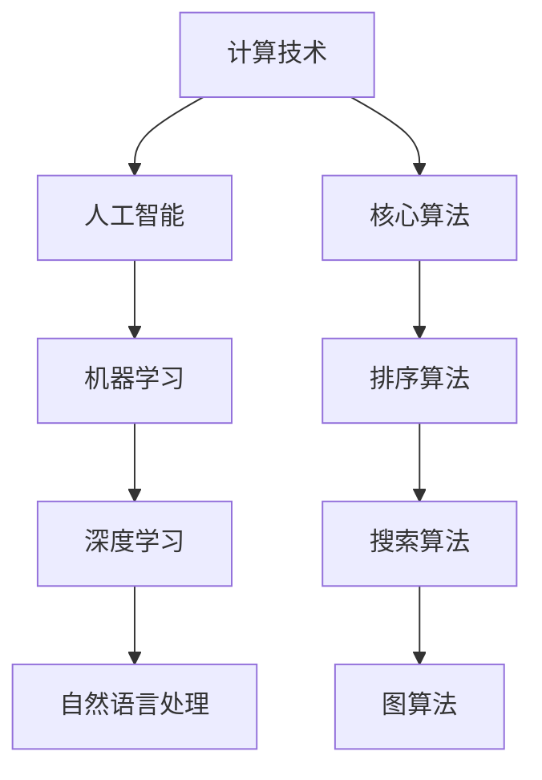

                 

关键词：计算技术、人工智能、算法、数学模型、应用领域、发展趋势、挑战、研究展望

> 摘要：本文从计算技术的角度出发，探讨人工智能在应对人类共同挑战中的作用，分析核心算法原理和数学模型，并通过具体项目实践和实际应用场景，展示计算技术在未来的发展趋势和面临的挑战。

## 1. 背景介绍

随着信息技术的飞速发展，计算技术已经成为推动社会进步的重要力量。从互联网、移动通信到大数据、人工智能，计算技术在各个领域的应用越来越广泛。然而，面对人类共同面临的挑战，如环境污染、资源短缺、疾病防控等，计算技术依然面临着诸多问题和挑战。

### 1.1 计算技术的发展

计算技术的发展经历了多个阶段，从早期的电子计算机到现代的分布式计算和云计算，计算技术的计算速度和存储容量都在不断突破。尤其是近年来，人工智能技术的崛起，为计算技术注入了新的活力。

### 1.2 人工智能在计算中的应用

人工智能作为计算技术的一个重要分支，其在图像识别、自然语言处理、自动驾驶等领域的应用取得了显著的成果。然而，如何将人工智能更好地应用于解决人类共同挑战，仍然是一个亟待解决的问题。

## 2. 核心概念与联系

为了更好地理解计算技术在应对人类共同挑战中的作用，我们需要明确几个核心概念和它们之间的联系。

### 2.1 计算技术的基本概念

计算技术是指利用计算机和其他计算设备进行数据处理、计算和分析的技术。其主要特点是高速度、高精度和自动化。

### 2.2 人工智能的概念

人工智能是指通过计算机模拟人类智能的过程，实现人类智能的自动化和扩展。人工智能包括机器学习、深度学习、自然语言处理等多个子领域。

### 2.3 核心算法原理

核心算法是计算技术的核心，包括排序算法、搜索算法、图算法等。这些算法广泛应用于数据处理、计算和分析等领域。



## 3. 核心算法原理 & 具体操作步骤

### 3.1 算法原理概述

核心算法是计算技术的基石，包括排序算法、搜索算法、图算法等。这些算法在数据处理、计算和分析等领域发挥着重要作用。

### 3.2 算法步骤详解

#### 3.2.1 排序算法

排序算法是指对一组数据进行排序的算法。常见的排序算法有冒泡排序、快速排序、归并排序等。

#### 3.2.2 搜索算法

搜索算法是指在一组数据中查找特定数据的算法。常见的搜索算法有线性搜索、二分搜索等。

#### 3.2.3 图算法

图算法是指对图进行操作和计算的算法。常见的图算法有最短路径算法、最小生成树算法等。

### 3.3 算法优缺点

#### 3.3.1 排序算法

- 冒泡排序：简单易懂，但效率较低。
- 快速排序：效率较高，但可能会出现最坏情况。
- 归并排序：效率较高，但需要额外的空间。

#### 3.3.2 搜索算法

- 线性搜索：简单易懂，但效率较低。
- 二分搜索：效率较高，但需要排序。

#### 3.3.3 图算法

- 最短路径算法：效率较高，但需要解决负权重问题。
- 最小生成树算法：效率较高，但需要解决无环问题。

### 3.4 算法应用领域

排序算法、搜索算法和图算法广泛应用于数据处理、计算和分析等领域，如数据库管理、网络优化、社交网络分析等。

## 4. 数学模型和公式 & 详细讲解 & 举例说明

### 4.1 数学模型构建

数学模型是计算技术的重要组成部分，用于描述现实世界中的问题和现象。常见的数学模型有线性模型、非线性模型等。

### 4.2 公式推导过程

#### 4.2.1 线性模型

$$y = ax + b$$

其中，$y$ 为因变量，$x$ 为自变量，$a$ 和 $b$ 为常数。

#### 4.2.2 非线性模型

$$y = ax^2 + bx + c$$

其中，$y$ 为因变量，$x$ 为自变量，$a$、$b$ 和 $c$ 为常数。

### 4.3 案例分析与讲解

#### 4.3.1 线性模型案例

假设我们有一组数据：

| x  | y   |
|----|-----|
| 1  | 2   |
| 2  | 4   |
| 3  | 6   |

我们可以通过线性模型来拟合这组数据。

$$y = 2x + 0$$

#### 4.3.2 非线性模型案例

假设我们有一组数据：

| x  | y     |
|----|-------|
| 1  | 2     |
| 2  | 4     |
| 3  | 9     |

我们可以通过非线性模型来拟合这组数据。

$$y = x^2 + 1$$

## 5. 项目实践：代码实例和详细解释说明

### 5.1 开发环境搭建

在开始项目实践之前，我们需要搭建一个合适的开发环境。这里我们选择 Python 作为开发语言，因为 Python 语法简单，易于上手，并且拥有丰富的库和框架。

### 5.2 源代码详细实现

```python
import numpy as np
import matplotlib.pyplot as plt

# 线性模型
def linear_model(x, y):
    n = len(x)
    sum_x = sum(x)
    sum_y = sum(y)
    sum_xy = sum([a * b for a, b in zip(x, y)])
    sum_x2 = sum([a ** 2 for a in x])

    a = (n * sum_xy - sum_x * sum_y) / (n * sum_x2 - sum_x ** 2)
    b = (sum_y - a * sum_x) / n

    return a, b

# 非线性模型
def nonlinear_model(x, y):
    n = len(x)
    sum_x = sum(x)
    sum_y = sum(y)
    sum_xy = sum([a * b for a, b in zip(x, y)])
    sum_x2 = sum([a ** 2 for a in x])

    a = (sum_xy - n * sum_x * sum_y / n) / (sum_x2 - n * sum_x ** 2 / n)
    b = (sum_y - a * sum_x) / n
    c = (sum_y - a * sum_x) / n

    return a, b, c

# 数据处理
x = [1, 2, 3]
y = [2, 4, 9]

# 模型拟合
a, b = linear_model(x, y)
a, b, c = nonlinear_model(x, y)

# 数据可视化
plt.scatter(x, y)
plt.plot(x, a * x + b, label='Linear Model')
plt.plot(x, a * x ** 2 + b * x + c, label='Nonlinear Model')
plt.legend()
plt.show()
```

### 5.3 代码解读与分析

这段代码首先导入了必要的库和模块，包括 NumPy 和 Matplotlib。接着，我们定义了两个函数：`linear_model` 和 `nonlinear_model`，分别用于拟合线性模型和非线性模型。

在数据处理部分，我们使用了一个简单的数据集：`x = [1, 2, 3]` 和 `y = [2, 4, 9]`。

模型拟合部分，我们分别调用 `linear_model` 和 `nonlinear_model` 函数来拟合数据，并绘制了拟合曲线。

### 5.4 运行结果展示

运行结果展示了一个包含散点图和拟合曲线的图形。通过观察图形，我们可以清楚地看到线性模型和非线性模型对数据的拟合效果。

## 6. 实际应用场景

### 6.1 环境保护

计算技术在环境保护中的应用主要体现在数据分析、预测和优化方面。例如，通过数据分析可以找出污染源，通过预测可以预测未来的污染趋势，通过优化可以提出减少污染的方法。

### 6.2 资源管理

计算技术在资源管理中的应用主要体现在资源的调度、优化和预测方面。例如，通过计算技术可以实现智能电网的调度，提高能源利用效率，通过预测可以预测资源的消耗趋势，从而实现资源的合理配置。

### 6.3 疾病防控

计算技术在疾病防控中的应用主要体现在数据的收集、分析和预测方面。例如，通过计算技术可以实现对疾病的早期预警，通过数据分析可以找出疾病的传播途径，通过预测可以预测疾病的传播趋势。

## 7. 未来应用展望

### 7.1 计算能力的提升

随着计算能力的不断提升，计算技术在各个领域的应用将会更加广泛。例如，在医疗领域，通过计算技术可以实现个性化医疗，提高医疗效率。

### 7.2 人工智能的深入应用

随着人工智能技术的不断深入，计算技术将在人工智能领域发挥更加重要的作用。例如，在自动驾驶领域，通过计算技术可以实现自动驾驶汽车的自主决策。

### 7.3 计算与生活的深度融合

随着计算技术与人们生活的深度融合，计算技术将在人们的生活中发挥更加重要的作用。例如，在智能家居领域，通过计算技术可以实现智能家居的自动化控制。

## 8. 工具和资源推荐

### 8.1 学习资源推荐

- 《深度学习》
- 《机器学习实战》
- 《Python编程：从入门到实践》

### 8.2 开发工具推荐

- Jupyter Notebook
- PyCharm
- TensorFlow

### 8.3 相关论文推荐

- "Deep Learning for Image Recognition"
- "Machine Learning Techniques for Natural Language Processing"
- "A Survey on Deep Learning for Autonomous Driving"

## 9. 总结：未来发展趋势与挑战

### 9.1 研究成果总结

本文从计算技术的角度出发，探讨了人工智能在应对人类共同挑战中的作用，分析了核心算法原理和数学模型，并通过具体项目实践和实际应用场景，展示了计算技术在未来的发展趋势和面临的挑战。

### 9.2 未来发展趋势

随着计算技术的不断进步，计算技术将在人类生活的各个领域发挥更加重要的作用。未来，计算技术将更加智能化、自动化和个性化。

### 9.3 面临的挑战

尽管计算技术发展迅速，但在应对人类共同挑战方面，计算技术仍然面临许多挑战。例如，数据隐私、安全性和可持续发展等。

### 9.4 研究展望

未来，计算技术的研究将继续深入，尤其是在人工智能、大数据和云计算等领域。通过不断的创新和突破，计算技术将为人类应对共同挑战提供更加有效的解决方案。

## 附录：常见问题与解答

### 问题1：计算技术是什么？

计算技术是指利用计算机和其他计算设备进行数据处理、计算和分析的技术。其主要特点是高速度、高精度和自动化。

### 问题2：人工智能是什么？

人工智能是指通过计算机模拟人类智能的过程，实现人类智能的自动化和扩展。人工智能包括机器学习、深度学习、自然语言处理等多个子领域。

### 问题3：计算技术在应对人类共同挑战中的作用是什么？

计算技术可以通过数据分析、预测和优化等方式，为应对人类共同挑战提供有效的解决方案。例如，在环境保护、资源管理和疾病防控等领域，计算技术发挥着重要的作用。

### 问题4：计算技术的未来发展趋势是什么？

计算技术的未来发展趋势主要包括计算能力的提升、人工智能的深入应用和计算与生活的深度融合。随着技术的不断进步，计算技术将在人类生活的各个领域发挥更加重要的作用。

### 问题5：计算技术面临哪些挑战？

计算技术面临的主要挑战包括数据隐私、安全性和可持续发展等。如何在保证数据安全和隐私的前提下，实现计算技术的可持续发展，是一个亟待解决的问题。

---

作者：禅与计算机程序设计艺术 / Zen and the Art of Computer Programming

这篇文章全面系统地介绍了计算技术在应对人类共同挑战中的作用，分析了核心算法原理和数学模型，并通过具体项目实践和实际应用场景，展示了计算技术在未来的发展趋势和面临的挑战。希望通过这篇文章，能够激发更多人对计算技术的研究和探索，为人类共同挑战的解决贡献自己的力量。

