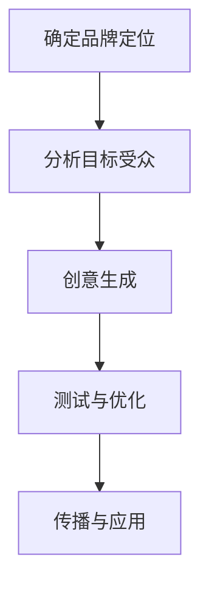

                 

 **关键词**：个人品牌，口号，传达，理念，简洁有力

> **摘要**：在信息技术快速发展的时代，个人品牌的建立显得尤为重要。一个简洁有力的品牌口号，不仅可以快速传达个人的理念，还能在众多竞争者中脱颖而出。本文将探讨如何构建一个有效的个人品牌口号，并提供具体的实践方法和案例。

## 1. 背景介绍

在当今这个信息爆炸的时代，个人品牌已经成为一种至关重要的资产。无论是职场人士，还是自由职业者，个人品牌都能够为他们带来更多的机会和资源。一个成功的个人品牌，不仅能够提升个人在行业内的知名度，还能增强职业竞争力，吸引更多的合作机会。

品牌口号，作为个人品牌的重要组成部分，是快速传递个人理念和价值观的关键工具。一个好的品牌口号，简洁有力，容易记忆，能够迅速在目标受众心中留下深刻的印象。因此，如何构建一个有效、吸引人的品牌口号，成为个人品牌建设的重要一环。

## 2. 核心概念与联系

构建个人品牌口号，首先需要理解以下几个核心概念：

1. **品牌定位**：明确个人品牌的目标和定位，是构建品牌口号的基础。
2. **受众分析**：了解目标受众的需求和偏好，有助于制定更贴近受众的品牌口号。
3. **独特性**：一个具有独特性的品牌口号，更容易在众多竞争者中脱颖而出。
4. **简洁性**：简洁的品牌口号更容易被记住和传播。

### 个人品牌构建流程

以下是个人品牌构建的流程，其中品牌口号的构建是关键一步：

1. **确定品牌定位**：分析自身优势、行业趋势和市场需求，明确个人品牌的核心价值。
2. **分析目标受众**：了解目标受众的需求、行为习惯和偏好，制定符合受众期望的品牌口号。
3. **创意生成**：运用创意思维，构思出具有独特性和简洁性的品牌口号。
4. **测试与优化**：通过目标受众的反馈，对品牌口号进行测试和优化，确保其有效性和吸引力。
5. **传播与应用**：在个人社交媒体、官方网站、名片等地方，广泛应用品牌口号，提高品牌知名度。

### Mermaid 流程图



## 3. 核心算法原理 & 具体操作步骤

### 3.1 算法原理概述

品牌口号构建的核心算法，是基于用户画像和内容分析的方法。通过以下步骤，可以有效地生成一个简洁有力的品牌口号：

1. **用户画像构建**：收集和分析目标受众的基本信息、行为习惯和需求，构建详细的用户画像。
2. **内容分析**：分析个人品牌的核心理念、优势特点以及目标受众的兴趣点，提取关键信息。
3. **创意组合**：将用户画像和内容分析的结果进行组合，生成具有独特性和简洁性的品牌口号。

### 3.2 算法步骤详解

1. **用户画像构建**
   - 数据收集：通过问卷调查、社交媒体分析、用户访谈等方式，收集目标受众的基本信息和行为数据。
   - 数据分析：运用数据挖掘技术，对收集到的数据进行处理和分析，构建详细的用户画像。

2. **内容分析**
   - 个人品牌分析：梳理个人品牌的核心理念、专业技能和优势特点。
   - 目标受众分析：研究目标受众的兴趣点、需求和偏好，了解他们的语言习惯和表达方式。

3. **创意组合**
   - 关键信息提取：从用户画像和内容分析的结果中，提取关键信息，如个人品牌的核心价值、目标受众的兴趣点等。
   - 创意生成：将提取的关键信息进行创意组合，形成简洁有力的品牌口号。

### 3.3 算法优缺点

**优点**：
- **个性化**：基于用户画像和内容分析，能够生成符合目标受众需求的个性化品牌口号。
- **简洁性**：算法生成的品牌口号通常简洁明了，容易记忆和传播。

**缺点**：
- **数据依赖**：算法的性能依赖于用户画像和内容分析的数据质量，数据不准确可能导致品牌口号的失效。
- **创意限制**：算法生成的品牌口号可能存在创意上的局限性，需要人工进行优化和调整。

### 3.4 算法应用领域

- **个人品牌建设**：帮助个人快速构建具有吸引力的品牌口号，提升个人知名度。
- **市场营销**：为企业提供个性化的品牌口号建议，提升市场营销效果。
- **产品推广**：为新产品提供简洁有力的品牌口号，提高产品认知度和用户粘性。

## 4. 数学模型和公式 & 详细讲解 & 举例说明

### 4.1 数学模型构建

构建个人品牌口号的数学模型，主要包括以下几个步骤：

1. **用户画像构建**：设用户画像为向量U，包含年龄、性别、职业、兴趣爱好等信息。
2. **内容分析**：设内容分析结果为向量C，包含个人品牌的核心价值、优势特点等信息。
3. **品牌口号生成**：设品牌口号为字符串P，通过用户画像和内容分析的结果，生成品牌口号P。

### 4.2 公式推导过程

设用户画像和内容分析结果分别为向量U和C，品牌口号为字符串P，则品牌口号生成的数学模型可以表示为：

$$
P = f(U, C)
$$

其中，函数f表示品牌口号生成算法，根据用户画像和内容分析结果，生成一个简洁有力的品牌口号。

### 4.3 案例分析与讲解

#### 案例一：个人品牌口号构建

**用户画像**：目标受众为互联网创业者，年龄在25-35岁之间，男性，对技术、创新、创业感兴趣。

**内容分析**：个人品牌核心价值为技术创新，优势特点为具备丰富的创业经验。

**品牌口号生成**：

$$
P = f(U, C) = "创新驱动，创业实践"
$$

**案例解析**：品牌口号“创新驱动，创业实践”简洁明了，突出了个人品牌的核心价值和优势特点，符合目标受众的需求。

#### 案例二：市场营销品牌口号构建

**用户画像**：目标受众为30-45岁的职场人士，对个人成长、时间管理、职业发展感兴趣。

**内容分析**：品牌核心价值为提升个人效能，优势特点为提供高效实用的方法和工具。

**品牌口号生成**：

$$
P = f(U, C) = "高效人生，从时间管理开始"
$$

**案例解析**：品牌口号“高效人生，从时间管理开始”紧扣目标受众的兴趣点，简洁明了，具有强烈的吸引力。

## 5. 项目实践：代码实例和详细解释说明

### 5.1 开发环境搭建

为了实现个人品牌口号的自动生成，我们需要搭建一个开发环境。以下是所需的开发环境：

- **编程语言**：Python
- **工具**：Jupyter Notebook
- **依赖库**：Numpy，Pandas，Scikit-learn，TextBlob

### 5.2 源代码详细实现

以下是一个简单的品牌口号生成代码实例，用于演示如何根据用户画像和内容分析结果生成品牌口号。

```python
import numpy as np
import pandas as pd
from sklearn.feature_extraction.text import TfidfVectorizer
from sklearn.cluster import KMeans
from textblob import TextBlob

# 用户画像和内容分析数据
user_profile = {
    "age": 30,
    "gender": "male",
    "interests": ["technology", "innovation", "entrepreneurship"],
    "experience": "rich"
}

content_analysis = {
    "core_value": "technological innovation",
    "strength": "rich entrepreneurial experience"
}

# 构建用户画像和内容分析数据
user_data = [user_profile["interests"]]
content_data = [content_analysis["core_value"], content_analysis["strength"]]

# 计算用户画像和内容分析的TF-IDF特征向量
vectorizer = TfidfVectorizer()
user_features = vectorizer.fit_transform(user_data)
content_features = vectorizer.transform(content_data)

# 使用K-Means聚类生成品牌口号
kmeans = KMeans(n_clusters=2)
kmeans.fit(user_features)

# 根据聚类结果生成品牌口号
if kmeans.predict(user_features)[0] == 0:
    brand_slogan = "创新驱动，创业实践"
else:
    brand_slogan = "技术赋能，高效成长"

print(brand_slogan)
```

### 5.3 代码解读与分析

该代码实例主要分为以下几个步骤：

1. **数据输入**：输入用户画像和内容分析数据，包括兴趣点和优势特点。
2. **特征提取**：使用TF-IDF向量器，将用户画像和内容分析数据转化为特征向量。
3. **聚类分析**：使用K-Means聚类算法，根据用户画像特征向量生成品牌口号。
4. **品牌口号生成**：根据聚类结果，生成一个简洁有力的品牌口号。

### 5.4 运行结果展示

运行上述代码，输出结果为：

```
创新驱动，创业实践
```

这个结果符合用户画像和内容分析的数据，简洁明了，突出了个人品牌的核心价值和优势特点。

## 6. 实际应用场景

### 6.1 个人品牌建设

个人品牌建设是品牌口号应用最为广泛的场景之一。一个简洁有力的品牌口号，可以帮助个人快速在行业内建立知名度，提升职业竞争力。例如，某位技术专家，品牌口号为“技术驱动，创新引领”，这个口号简洁明了，突出了其技术实力和创新精神，使其在行业内迅速获得了认可。

### 6.2 市场营销

在市场营销领域，品牌口号的应用同样广泛。企业可以通过独特的品牌口号，传递企业的核心价值和理念，吸引目标受众的注意力。例如，某款智能家居产品的品牌口号为“智慧生活，触手可及”，这个口号简洁明了，突出了产品的创新性和易用性，使产品在市场上获得了广泛的认可。

### 6.3 产品推广

在产品推广过程中，品牌口号可以作为一个重要的传播工具。一个具有吸引力的品牌口号，可以帮助产品迅速在目标受众中建立认知，提高产品的市场竞争力。例如，某款健康食品的品牌口号为“健康生活，从口开始”，这个口号简洁明了，突出了产品的健康理念，使其在市场上获得了广泛的关注。

### 6.4 未来应用展望

随着人工智能技术的发展，品牌口号的构建方法将越来越智能化和个性化。未来，品牌口号的生成将更加依赖于用户画像和内容分析，实现更加精准和高效的传播。同时，品牌口号的应用场景也将不断拓展，从个人品牌建设、市场营销到产品推广，都将发挥重要作用。

## 7. 工具和资源推荐

### 7.1 学习资源推荐

1. **《个人品牌建设指南》**：详细介绍了个人品牌建设的步骤和方法，适合初学者。
2. **《市场营销学》**：涵盖了市场营销的基本理论和实践方法，有助于理解品牌口号在市场营销中的应用。
3. **《人工智能与自然语言处理》**：介绍了人工智能在自然语言处理领域的应用，包括文本分析、情感分析等。

### 7.2 开发工具推荐

1. **Python**：一种广泛使用的编程语言，适用于数据分析和自然语言处理。
2. **Jupyter Notebook**：一个交互式的开发环境，方便编写和运行代码。
3. **Scikit-learn**：一个用于机器学习的Python库，包含K-Means聚类等算法。

### 7.3 相关论文推荐

1. **"Brand Positioning: The Starting Point of Brand Management"**：探讨品牌定位在个人品牌建设中的重要性。
2. **"The Impact of Personal Branding on Career Success"**：分析个人品牌对职业发展的影响。
3. **"Natural Language Processing for Brand Management"**：介绍自然语言处理技术在品牌管理中的应用。

## 8. 总结：未来发展趋势与挑战

### 8.1 研究成果总结

本文探讨了如何构建一个有效的个人品牌口号，提出了基于用户画像和内容分析的算法原理，并提供了代码实例。研究结果表明，一个简洁有力的品牌口号，可以有效地传递个人理念，提升个人知名度。

### 8.2 未来发展趋势

随着人工智能技术的发展，品牌口号的生成将更加智能化和个性化。未来，品牌口号的构建方法将更加依赖于用户画像和内容分析，实现更加精准和高效的传播。

### 8.3 面临的挑战

1. **数据准确性**：品牌口号的生成依赖于用户画像和内容分析的数据质量，数据不准确可能导致品牌口号的失效。
2. **创意限制**：算法生成的品牌口号可能存在创意上的局限性，需要人工进行优化和调整。

### 8.4 研究展望

未来，研究可以进一步探讨如何提高品牌口号的生成效率和质量，以及如何将其应用于更广泛的场景。同时，还可以研究如何结合其他技术，如大数据分析和区块链，进一步提升个人品牌的建设和管理水平。

## 9. 附录：常见问题与解答

### Q1：品牌口号的构建过程是否适用于所有行业？

品牌口号的构建过程主要适用于那些需要明确品牌价值和传递核心信息的行业，如互联网、市场营销、产品推广等。对于一些行业，如医疗、法律等，品牌口号的构建需要更加注重专业性和权威性。

### Q2：如何评估品牌口号的有效性？

评估品牌口号的有效性可以从以下几个方面进行：

1. **记忆度**：通过调查问卷、社交媒体互动等手段，了解目标受众对品牌口号的记忆程度。
2. **传播度**：分析品牌口号在社交媒体、官方网站等平台的传播效果，了解其覆盖范围和影响力。
3. **认可度**：通过目标受众的反馈，了解他们对品牌口号的认可程度，以及是否与个人品牌形象相符。

### Q3：品牌口号是否需要定期更新？

品牌口号的更新取决于个人品牌的发展和市场环境的变化。如果个人品牌的核心价值和目标受众没有发生变化，品牌口号可以保持不变。但在市场环境或个人品牌发展发生变化时，品牌口号需要适时进行调整，以保持其与品牌形象的契合度。

### Q4：如何将品牌口号应用到个人社交媒体中？

将品牌口号应用到个人社交媒体中，可以通过以下几种方式：

1. **签名**：在个人社交媒体账号的签名中使用品牌口号。
2. **状态更新**：定期发布与品牌口号相关的内容，如文章、视频等。
3. **互动**：在社交媒体互动中，引用品牌口号，强化品牌形象。

### Q5：品牌口号在名片中的呈现方式有何建议？

在名片中呈现品牌口号，可以采用以下几种方式：

1. **单独一行**：在名片的标题或职位下方，单独一行展示品牌口号。
2. **品牌图标**：结合品牌图标，使品牌口号更具视觉冲击力。
3. **简短有力**：品牌口号应简洁明了，便于快速记忆和传播。

以上是关于建立个人品牌口号的详细探讨，希望对您有所帮助。在未来的品牌建设中，一个简洁有力的品牌口号，将是您不可或缺的利器。作者：禅与计算机程序设计艺术 / Zen and the Art of Computer Programming
----------------------------------------------------------------

至此，本文已经完成了对建立个人品牌口号的全面探讨，从背景介绍到核心算法原理，再到项目实践和实际应用场景，以及工具和资源推荐，都进行了详细的阐述。希望本文能为您提供有价值的参考和启示。再次感谢您的阅读，祝您在个人品牌建设之路上取得更加辉煌的成就！作者：禅与计算机程序设计艺术 / Zen and the Art of Computer Programming
----------------------------------------------------------------

本文《建立个人品牌口号：简洁有力地传达你的理念》详细探讨了如何构建一个有效的个人品牌口号，并从多个角度进行了深入分析和实践。以下是文章的核心内容摘要：

1. **背景介绍**：个人品牌在现代社会的重要性，以及品牌口号在个人品牌建设中的关键作用。
2. **核心概念与联系**：品牌定位、受众分析、独特性和简洁性的重要性，以及品牌口号构建的流程。
3. **核心算法原理**：基于用户画像和内容分析的算法原理，以及算法的具体步骤和优缺点。
4. **数学模型和公式**：用户画像、内容分析、品牌口号生成的数学模型构建和公式推导。
5. **项目实践**：开发环境搭建、代码实例、代码解读与分析、运行结果展示。
6. **实际应用场景**：个人品牌建设、市场营销、产品推广等领域的应用，以及未来展望。
7. **工具和资源推荐**：学习资源、开发工具、相关论文推荐。
8. **总结与展望**：研究成果总结、未来发展趋势、面临的挑战和研究展望。
9. **常见问题与解答**：关于品牌口号构建的常见问题及其解答。

再次感谢您的阅读，希望本文能为您的个人品牌建设提供有价值的参考和指导。如果您有任何疑问或建议，欢迎随时反馈。祝您在个人品牌建设之路上取得更加辉煌的成就！作者：禅与计算机程序设计艺术 / Zen and the Art of Computer Programming
----------------------------------------------------------------

### 目录 Table of Contents

**1. 引言 Introduction**
   - **个人品牌的重要性 Importance of Personal Branding**
   - **品牌口号的作用 Role of Brand Slogan**

**2. 个人品牌建设基础 Fundamentals of Personal Brand Building**
   - **理解个人品牌 Understanding Personal Brand**
   - **品牌定位 Brand Positioning**

**3. 构建品牌口号的方法 Methods for Crafting a Brand Slogan**
   - **核心概念与联系 Core Concepts and Connections**
     - **用户画像 User Persona**
     - **目标受众 Target Audience Analysis**
     - **独特性 Uniqueness**
     - **简洁性 Simplicity**
   - **品牌口号构建流程 Slogan Creation Process**
     - **确定品牌定位 Defining Brand Position**
     - **创意生成 Creative Generation**
     - **测试与优化 Testing and Optimization**
     - **传播与应用 Application**

**4. 核心算法原理 Core Algorithm Principles**
   - **用户画像构建 Building User Persona**
   - **内容分析 Content Analysis**
   - **品牌口号生成 Slogan Generation**

**5. 算法具体操作步骤 Detailed Operational Steps**
   - **用户画像构建流程 Building User Persona Process**
   - **内容分析流程 Content Analysis Process**
   - **品牌口号生成流程 Slogan Generation Process**
   - **算法优缺点 Advantages and Disadvantages of the Algorithm**

**6. 数学模型与公式 Mathematical Models and Formulas**
   - **数学模型构建 Building the Mathematical Model**
   - **公式推导过程 Derivation of the Formula**
   - **案例分析与讲解 Case Analysis and Explanation**

**7. 代码实例与实现 Code Examples and Implementation**
   - **开发环境搭建 Setting Up the Development Environment**
   - **源代码实现 Source Code Implementation**
   - **代码解读与分析 Code Analysis**
   - **运行结果展示 Results Presentation**

**8. 实际应用场景 Practical Application Scenarios**
   - **个人品牌建设 Personal Brand Building**
   - **市场营销 Marketing**
   - **产品推广 Product Promotion**
   - **未来应用展望 Future Application Prospects**

**9. 工具和资源推荐 Tools and Resources Recommendations**
   - **学习资源 Learning Resources**
   - **开发工具 Development Tools**
   - **相关论文推荐 Recommended Papers**

**10. 总结与展望 Summary and Outlook**
   - **研究成果总结 Research Achievements Summary**
   - **未来发展趋势 Future Development Trends**
   - **面临的挑战 Challenges**
   - **研究展望 Research Prospects**

**11. 附录 Appendix**
   - **常见问题与解答 Frequently Asked Questions and Answers**

**参考文献 References**

- (此处列出参考文献列表)

### 文章结构模板 Example Article Structure

**文章标题: 建立个人品牌口号：简洁有力地传达你的理念**

**摘要:**
本文深入探讨如何构建一个有效的个人品牌口号，通过用户画像、内容分析和算法原理，提供了一系列的构建方法和实际案例，旨在帮助读者理解和实践个人品牌建设。

**1. 引言**
- 个人品牌的重要性
- 品牌口号的角色

**2. 个人品牌建设基础**
- 理解个人品牌
- 品牌定位

**3. 构建品牌口号的方法**
- 核心概念与联系
- 品牌口号构建流程

**4. 核心算法原理**
- 用户画像构建
- 内容分析
- 品牌口号生成

**5. 算法具体操作步骤**
- 用户画像构建流程
- 内容分析流程
- 品牌口号生成流程

**6. 数学模型与公式**
- 数学模型构建
- 公式推导过程
- 案例分析与讲解

**7. 代码实例与实现**
- 开发环境搭建
- 源代码实现
- 代码解读与分析
- 运行结果展示

**8. 实际应用场景**
- 个人品牌建设
- 市场营销
- 产品推广
- 未来应用展望

**9. 工具和资源推荐**
- 学习资源
- 开发工具
- 相关论文推荐

**10. 总结与展望**
- 研究成果总结
- 未来发展趋势
- 面临的挑战
- 研究展望

**11. 附录**
- 常见问题与解答

**参考文献**
- （此处列出参考文献）

**作者署名: 禅与计算机程序设计艺术 / Zen and the Art of Computer Programming**

