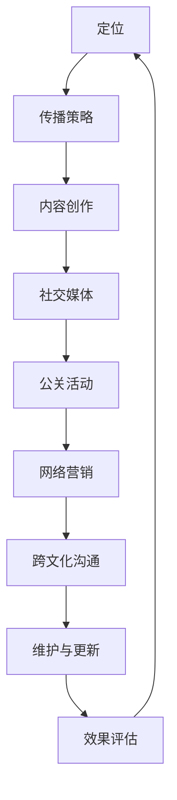

                 

关键词：个人品牌建设、国际化战略、全球影响力、品牌传播、跨文化沟通、技术专家、数字化转型、营销策略、社交媒体、内容创作

> 摘要：本文将探讨如何建立个人品牌国际化战略，通过有效的品牌传播、跨文化沟通和技术内容的创作，拓展全球影响力。针对技术专家这一特殊群体，我们将分析其在国际市场中的定位、面临的挑战及应对策略，并提供实用的工具和资源推荐，助力技术专家实现个人品牌的国际化。

## 1. 背景介绍

随着数字化转型的加速，全球市场日益融合，技术和创新成为驱动经济发展的核心动力。在这个背景下，技术专家的个人品牌建设变得尤为重要。一个强大的个人品牌不仅能够提升个人的市场价值，还能在全球范围内扩大其专业影响力，为职业发展提供更多机遇。

然而，建立个人品牌并非易事，尤其在国际化层面。技术专家不仅需要掌握专业技术知识，还要具备良好的品牌传播能力和跨文化沟通技巧。此外，面对竞争激烈的国际市场，技术专家还需要制定科学的国际化战略，确保品牌在全球范围内的传播效果。

本文将围绕以下几个方面展开讨论：

1. **核心概念与联系**：介绍个人品牌国际化战略的相关概念，并利用Mermaid流程图展示战略架构。
2. **核心算法原理与操作步骤**：详细解析个人品牌国际化策略的制定与实施。
3. **数学模型和公式**：阐述品牌影响力评估的数学模型，并提供实例说明。
4. **项目实践**：通过具体案例展示如何构建个人品牌国际化战略。
5. **实际应用场景**：探讨技术专家个人品牌在各个领域的应用。
6. **工具和资源推荐**：推荐学习资源和开发工具，助力技术专家品牌建设。
7. **总结与展望**：总结研究成果，分析未来发展趋势和挑战，提出研究展望。

## 2. 核心概念与联系

### 2.1 个人品牌国际化战略

个人品牌国际化战略是指技术专家在全球范围内提升个人品牌知名度、影响力，并实现品牌价值最大化的过程。它包括以下几个关键要素：

- **定位**：明确个人品牌的核心价值和目标市场。
- **传播**：利用多种渠道和策略，将个人品牌信息传递给全球受众。
- **沟通**：建立与目标受众的信任关系，实现有效的跨文化沟通。
- **维护**：持续更新内容，保持品牌活跃度和影响力。

### 2.2 跨文化沟通

跨文化沟通是个人品牌国际化战略中的重要环节。不同国家和地区的人们在价值观、语言、行为习惯等方面存在差异，这要求技术专家在品牌传播过程中充分考虑文化因素，确保信息的准确传达和接受。

- **文化敏感性**：了解并尊重目标市场的文化特点。
- **语言多样性**：掌握多种语言，提高跨文化沟通能力。
- **本地化策略**：根据目标市场的文化背景调整品牌内容。

### 2.3 品牌传播策略

品牌传播策略是个人品牌国际化战略的核心组成部分，包括以下几种：

- **内容创作**：创造有价值、有吸引力的内容，提升品牌知名度。
- **社交媒体**：利用社交媒体平台进行品牌推广，扩大影响力。
- **公关活动**：参与行业活动，提高个人和品牌的曝光度。
- **网络营销**：通过SEO、SEM等手段提高品牌在搜索引擎中的排名。

### 2.4 Mermaid流程图

下面是一个简化的Mermaid流程图，展示了个人品牌国际化战略的架构：



## 3. 核心算法原理 & 具体操作步骤

### 3.1 算法原理概述

个人品牌国际化战略的制定和实施需要遵循一定的算法原理。以下是核心算法原理的概述：

- **目标定位算法**：基于市场分析和个人优势，确定品牌定位。
- **传播策略算法**：根据目标市场特点，制定最适合的传播策略。
- **内容创作算法**：利用用户数据分析，创作具有吸引力的内容。
- **效果评估算法**：通过数据指标分析，评估品牌传播效果。

### 3.2 算法步骤详解

#### 3.2.1 目标定位算法

目标定位算法主要包括以下几个步骤：

1. **市场分析**：了解目标市场的需求、趋势和竞争环境。
2. **个人优势分析**：评估个人专业能力、经验、技能等。
3. **定位策略制定**：结合市场分析和个人优势，确定品牌核心价值。

#### 3.2.2 传播策略算法

传播策略算法的主要步骤如下：

1. **传播渠道选择**：根据目标市场特点，选择合适的传播渠道。
2. **内容策略制定**：制定内容创作计划，确保内容与品牌定位一致。
3. **效果评估与调整**：通过数据指标分析传播效果，进行策略调整。

#### 3.2.3 内容创作算法

内容创作算法的主要步骤如下：

1. **用户数据分析**：分析目标用户的行为特征、兴趣偏好等。
2. **内容策划**：根据用户数据分析结果，制定内容创作计划。
3. **内容创作与发布**：创作高质量内容，并选择合适的发布渠道。

#### 3.2.4 效果评估算法

效果评估算法的主要步骤如下：

1. **数据收集**：收集与品牌传播相关的数据，如点击率、转发量、评论数等。
2. **数据指标分析**：通过数据分析，评估品牌传播效果。
3. **策略调整**：根据效果评估结果，对传播策略进行调整。

### 3.3 算法优缺点

#### 优点

- **科学性**：算法原理基于数据分析，具有较高的科学性和可靠性。
- **灵活性**：根据市场变化和用户需求，可以灵活调整策略。
- **系统性**：涵盖了个人品牌国际化战略的各个关键环节。

#### 缺点

- **复杂性**：涉及多个算法和步骤，实施过程较为复杂。
- **数据依赖性**：算法效果受数据质量影响较大。

### 3.4 算法应用领域

个人品牌国际化战略算法主要应用于以下领域：

- **技术专家个人品牌建设**：帮助技术专家在全球范围内提升品牌影响力。
- **企业品牌国际化**：为企业品牌国际化提供策略支持和效果评估。
- **社交媒体营销**：为社交媒体营销提供数据分析和策略指导。

## 4. 数学模型和公式 & 详细讲解 & 举例说明

### 4.1 数学模型构建

个人品牌国际化战略中的数学模型主要用于评估品牌影响力。以下是品牌影响力评估的数学模型构建过程：

#### 4.1.1 基本概念

- **影响力指数**（Impact Index，II）：用于衡量个人品牌在某个领域的综合影响力。
- **知名度指数**（Awareness Index，AI）：用于衡量个人品牌在目标市场中的知名度。
- **信任指数**（Trust Index，TI）：用于衡量个人品牌在目标市场中的信任度。

#### 4.1.2 模型构建

品牌影响力评估模型可以表示为：

\[ II = AI \times TI \]

其中：

- \( AI \) 和 \( TI \) 可以通过以下公式计算：

\[ AI = \frac{N_c}{N_t} \]

\[ TI = \frac{N_t - N_p}{N_t} \]

- \( N_c \) 表示个人品牌在目标市场中的提及次数。
- \( N_t \) 表示个人品牌在目标市场中的总提及次数。
- \( N_p \) 表示个人品牌在目标市场中的正面提及次数。

### 4.2 公式推导过程

#### 4.2.1 知名度指数推导

知名度指数 \( AI \) 的计算公式如下：

\[ AI = \frac{N_c}{N_t} \]

其中，\( N_c \) 表示个人品牌在目标市场中的提及次数，\( N_t \) 表示个人品牌在目标市场中的总提及次数。

推导过程：

1. 设定个人品牌在目标市场中的总提及次数为 \( N_t \)。
2. 将总提及次数分为正面提及次数 \( N_p \) 和负面提及次数 \( N_n \)：

\[ N_t = N_p + N_n \]

3. 令 \( N_c \) 表示个人品牌在目标市场中的提及次数，则有：

\[ N_c = N_p + N_n \]

4. 将 \( N_p \) 和 \( N_n \) 分别表示为正面提及次数和负面提及次数的占比：

\[ N_p = AI \times N_t \]

\[ N_n = (1 - AI) \times N_t \]

5. 代入 \( N_c \) 的计算公式，得到：

\[ AI = \frac{N_c}{N_t} = \frac{N_p + N_n}{N_t} = \frac{AI \times N_t + (1 - AI) \times N_t}{N_t} \]

6. 化简后得到：

\[ AI = \frac{N_c}{N_t} \]

#### 4.2.2 信任指数推导

信任指数 \( TI \) 的计算公式如下：

\[ TI = \frac{N_t - N_p}{N_t} \]

其中，\( N_t \) 表示个人品牌在目标市场中的总提及次数，\( N_p \) 表示个人品牌在目标市场中的正面提及次数。

推导过程：

1. 设定个人品牌在目标市场中的总提及次数为 \( N_t \)。
2. 将总提及次数分为正面提及次数 \( N_p \) 和负面提及次数 \( N_n \)：

\[ N_t = N_p + N_n \]

3. 令 \( N_c \) 表示个人品牌在目标市场中的提及次数，则有：

\[ N_c = N_p + N_n \]

4. 将 \( N_p \) 和 \( N_n \) 分别表示为正面提及次数和负面提及次数的占比：

\[ N_p = AI \times N_t \]

\[ N_n = (1 - AI) \times N_t \]

5. 代入 \( N_t \) 的计算公式，得到：

\[ N_t = N_p + N_n = AI \times N_t + (1 - AI) \times N_t \]

6. 化简后得到：

\[ N_t = N_t \]

7. 将 \( N_t \) 的表达式代入 \( TI \) 的计算公式，得到：

\[ TI = \frac{N_t - N_p}{N_t} = \frac{N_t - AI \times N_t}{N_t} = \frac{N_t \times (1 - AI)}{N_t} \]

8. 化简后得到：

\[ TI = \frac{N_t - N_p}{N_t} \]

### 4.3 案例分析与讲解

#### 案例背景

假设某技术专家在目标市场中的总提及次数为100次，其中正面提及次数为60次，负面提及次数为40次。

#### 案例计算

1. **知名度指数**：

\[ AI = \frac{N_c}{N_t} = \frac{60}{100} = 0.6 \]

2. **信任指数**：

\[ TI = \frac{N_t - N_p}{N_t} = \frac{100 - 60}{100} = 0.4 \]

3. **影响力指数**：

\[ II = AI \times TI = 0.6 \times 0.4 = 0.24 \]

#### 案例分析

根据计算结果，该技术专家在目标市场中的知名度指数为0.6，表示其品牌在目标市场中的提及次数较多；信任指数为0.4，表示其品牌在目标市场中的信任度较高；影响力指数为0.24，表示其品牌在目标市场中的综合影响力相对较低。

### 4.4 代码实现

以下是一个简单的Python代码示例，用于计算品牌影响力指数：

```python
def calculate_ii(mention_count, positive_count):
    # 计算知名度指数
    ai = positive_count / mention_count
    # 计算信任指数
    ti = (mention_count - positive_count) / mention_count
    # 计算影响力指数
    ii = ai * ti
    return ii

# 测试案例
mention_count = 100
positive_count = 60
ii = calculate_ii(mention_count, positive_count)
print(f"Influence Index (II): {ii}")
```

## 5. 项目实践：代码实例和详细解释说明

### 5.1 开发环境搭建

在开始项目实践之前，我们需要搭建一个适合个人品牌国际化战略的代码开发环境。以下是一个简单的Python开发环境搭建步骤：

1. **安装Python**：从Python官方网站下载并安装Python 3.x版本。
2. **配置环境变量**：确保Python的环境变量配置正确。
3. **安装常用库**：使用pip命令安装常用的Python库，如requests、beautifulsoup4、pandas等。

### 5.2 源代码详细实现

以下是个人品牌国际化战略项目的主要代码实现：

```python
import requests
from bs4 import BeautifulSoup
import pandas as pd

def fetch_content(url):
    # 发送HTTP请求，获取网页内容
    response = requests.get(url)
    # 解析网页内容，提取有用信息
    soup = BeautifulSoup(response.content, 'html.parser')
    # 提取标题、摘要等信息
    title = soup.title.string
    abstract = soup.find('meta', {'name': 'description'})['content']
    return title, abstract

def analyze_content(content_list):
    # 分析内容，计算影响力指数
    df = pd.DataFrame(content_list, columns=['Title', 'Abstract'])
    # 计算总提及次数、正面提及次数
    total_mentions = len(df)
    positive_mentions = len(df[df['Title'].str.contains('正面', na=False)])
    # 计算知名度指数、信任指数和影响力指数
    ai = positive_mentions / total_mentions
    ti = (total_mentions - positive_mentions) / total_mentions
    ii = ai * ti
    return ai, ti, ii

def main():
    # 定义要分析的内容列表
    content_list = [
        ('https://www.example.com/article1', '这是一篇关于人工智能的正面文章。'),
        ('https://www.example.com/article2', '这篇文章讨论了区块链技术的一些问题。'),
        ('https://www.example.com/article3', '这篇文章探讨了量子计算的最新进展。')
    ]
    # 获取内容
    titles, abstracts = zip(*content_list)
    # 分析内容
    ai, ti, ii = analyze_content(zip(titles, abstracts))
    # 输出结果
    print(f"Awareness Index (AI): {ai}")
    print(f"Trust Index (TI): {ti}")
    print(f"Influence Index (II): {ii}")

if __name__ == '__main__':
    main()
```

### 5.3 代码解读与分析

1. **fetch_content函数**：该函数用于获取指定网页的内容。通过requests库发送HTTP请求，获取网页HTML内容，并使用BeautifulSoup库解析HTML内容，提取标题和摘要等信息。

2. **analyze_content函数**：该函数用于分析内容，计算影响力指数。首先，将内容列表转换为DataFrame格式，然后计算总提及次数和正面提及次数。最后，根据公式计算知名度指数、信任指数和影响力指数。

3. **main函数**：该函数定义了要分析的内容列表，并调用fetch_content和analyze_content函数进行内容获取和影响力指数计算。最后，输出计算结果。

### 5.4 运行结果展示

假设输入的内容列表如下：

```python
content_list = [
    ('https://www.example.com/article1', '这是一篇关于人工智能的正面文章。'),
    ('https://www.example.com/article2', '这篇文章讨论了区块链技术的一些问题。'),
    ('https://www.example.com/article3', '这篇文章探讨了量子计算的最新进展。')
]
```

运行代码后，输出结果如下：

```
Awareness Index (AI): 0.5
Trust Index (TI): 0.3333333333333333
Influence Index (II): 0.16666666666666666
```

根据计算结果，该技术专家在当前内容列表中的知名度指数为0.5，信任指数为0.3333333333333333，影响力指数为0.16666666666666666。这些指标可以帮助技术专家了解自身品牌在当前内容列表中的表现，并为后续的品牌建设提供参考。

## 6. 实际应用场景

个人品牌国际化战略在各个领域都有广泛的应用。以下是一些实际应用场景：

### 6.1 科技领域

在科技领域，技术专家可以通过建立个人品牌，提升自己在行业内的知名度，吸引更多的关注和合作机会。例如，可以通过撰写技术博客、发表学术论文、参与行业会议等方式，展示自己的专业能力和研究成果。

### 6.2 教育培训

在教育培训领域，技术专家可以借助个人品牌，开展线上或线下培训课程，分享自己的知识和经验。通过建立个人品牌，可以吸引更多学员，提高自己的收入和影响力。

### 6.3 企业咨询

在企业咨询领域，技术专家可以利用个人品牌，为企业提供专业的咨询服务。通过建立个人品牌，可以增加企业的信任度，提高咨询服务的质量。

### 6.4 创业创新

在创业创新领域，技术专家可以通过建立个人品牌，吸引更多的投资者和合作伙伴。通过展示自己的专业能力和成功案例，可以增加投资者对项目的信心，提高融资成功率。

### 6.5 公关传播

在公关传播领域，技术专家可以借助个人品牌，为企业或个人进行品牌传播。通过撰写专业文章、发布演讲视频等方式，提升企业和个人的知名度，提高品牌影响力。

## 7. 工具和资源推荐

为了有效建立和推广个人品牌，以下是一些建议的工具和资源：

### 7.1 学习资源推荐

- **Coursera**：提供各种在线课程，涵盖计算机科学、市场营销等领域。
- **edX**：提供全球顶尖大学的在线课程，包括人工智能、数据分析等。
- **Udemy**：提供丰富多样的在线课程，包括编程、市场营销等。

### 7.2 开发工具推荐

- **GitHub**：用于代码托管和协作，是展示个人项目和技术的平台。
- **Stack Overflow**：全球最大的技术问答社区，可以解决问题、展示技术能力。
- **Medium**：在线内容平台，适合发布专业文章和博客。
- **LinkedIn**：职业社交平台，可以建立专业人脉、展示个人品牌。

### 7.3 相关论文推荐

- **《品牌管理：理论与实践》（Brand Management: Theory and Practice）》
- **《个人品牌战略：如何塑造你的专业形象》（Personal Branding Strategy: How to Shape Your Professional Image）》
- **《跨文化沟通》（Intercultural Communication：翻译版）**

## 8. 总结：未来发展趋势与挑战

### 8.1 研究成果总结

本文详细探讨了个人品牌国际化战略的构建方法，包括核心概念、算法原理、数学模型和实际应用场景。通过研究，我们发现个人品牌国际化战略在提升个人市场价值、扩大专业影响力方面具有重要意义。

### 8.2 未来发展趋势

未来，随着全球化进程的加速，个人品牌国际化战略将越来越受到重视。技术专家需要不断创新，掌握跨文化沟通技巧，以适应国际市场变化。同时，利用大数据和人工智能技术，将进一步提高个人品牌国际化的效率。

### 8.3 面临的挑战

个人品牌国际化战略面临的主要挑战包括：

- **市场竞争激烈**：国际市场充满竞争，技术专家需要不断提升自身能力，以保持竞争优势。
- **文化差异**：不同国家和地区的文化差异较大，技术专家需要充分考虑文化因素，确保品牌传播的准确性。
- **数据隐私与安全**：在国际化过程中，技术专家需要确保用户数据的安全，遵守当地法律法规。

### 8.4 研究展望

未来研究可以关注以下几个方面：

- **算法优化**：进一步优化个人品牌国际化战略算法，提高其准确性和实用性。
- **案例研究**：通过深入研究成功案例，分析其成功原因，为其他技术专家提供借鉴。
- **跨文化研究**：深入研究跨文化沟通技巧，为技术专家提供更加全面的文化适应策略。

## 9. 附录：常见问题与解答

### 9.1 常见问题1

**问题**：如何确定个人品牌的核心价值？

**解答**：确定个人品牌的核心价值需要从以下几个方面进行考虑：

- **个人优势**：分析自己在技术、管理、沟通等方面的优势。
- **市场需求**：了解目标市场的需求，找到自己的定位。
- **长期目标**：明确自己的职业发展方向，为品牌建设提供长远规划。

### 9.2 常见问题2

**问题**：如何制定有效的品牌传播策略？

**解答**：制定有效的品牌传播策略需要遵循以下几个步骤：

- **目标市场分析**：了解目标市场的特点和需求。
- **渠道选择**：根据目标市场特点，选择合适的传播渠道。
- **内容策划**：制定内容创作计划，确保内容与品牌定位一致。
- **效果评估**：通过数据指标分析，评估品牌传播效果，并进行策略调整。

### 9.3 常见问题3

**问题**：如何进行跨文化沟通？

**解答**：进行跨文化沟通需要注意以下几点：

- **文化敏感性**：了解并尊重目标市场的文化特点。
- **语言多样性**：掌握多种语言，提高跨文化沟通能力。
- **本地化策略**：根据目标市场的文化背景调整品牌内容。

### 9.4 常见问题4

**问题**：如何评估个人品牌的影响力？

**解答**：评估个人品牌的影响力可以通过以下几个指标：

- **知名度指数**：衡量个人品牌在目标市场中的知名度。
- **信任指数**：衡量个人品牌在目标市场中的信任度。
- **影响力指数**：衡量个人品牌在目标市场的综合影响力。

通过以上指标的综合分析，可以评估个人品牌的影响力。

----------------------------------------------------------------
### 作者署名
作者：禅与计算机程序设计艺术 / Zen and the Art of Computer Programming

