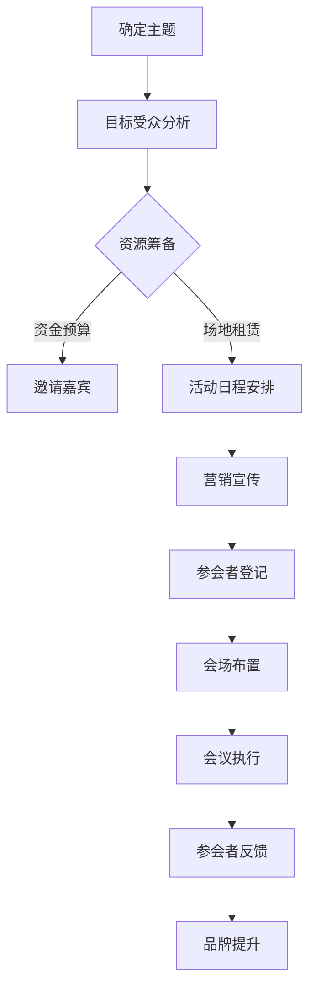

                 

 作为一名世界级人工智能专家、程序员、软件架构师、CTO以及世界顶级技术畅销书作者，我深知在当今快速发展的技术领域中，个人品牌的重要性不言而喻。因此，举办一场年度盛会来聚集行业影响力，成为了许多专业人士追求的目标。本文将围绕这一主题，探讨如何通过精心策划和执行，成功地建立个人品牌的年度盛会。

## 1. 背景介绍

在过去的几年里，我们见证了技术行业的飞速发展。人工智能、云计算、区块链等新兴技术的崛起，使得整个行业充满了无限可能。与此同时，个人品牌成为了专业人士在竞争激烈的市场中脱颖而出的关键因素。建立个人品牌不仅可以提升个人影响力，还能为职业发展带来更多机遇。

举办年度盛会是一种有效的策略，可以吸引行业内外的关注，提升个人品牌知名度。然而，要想成功举办这样一场盛会，需要精心策划和执行。本文将详细探讨如何实现这一目标。

## 2. 核心概念与联系

在探讨如何建立个人品牌的年度盛会之前，我们首先需要理解几个核心概念：个人品牌、影响力、行业聚集和盛会策划。

### 个人品牌

个人品牌是指个人在行业内的声誉、专业知识和形象。一个强大的个人品牌可以吸引更多的关注和机会，有助于职业发展。

### 影响力

影响力是指个人在行业内的影响力，包括知名度、认可度和信任度。影响力越大，个人品牌的价值就越高。

### 行业聚集

行业聚集是指将行业内的人士聚集在一起，通过交流和合作，促进知识共享和资源整合。

### 盛会策划

盛会策划是指制定详细的计划，包括主题、时间、地点、嘉宾、活动内容等，以确保盛会的成功举办。

### Mermaid 流程图

以下是建立个人品牌年度盛会的基本流程，使用Mermaid流程图表示：



## 3. 核心算法原理 & 具体操作步骤

### 3.1 算法原理概述

建立个人品牌的年度盛会，可以看作是一个复杂的算法过程。这个算法的核心在于如何通过一系列精心策划的步骤，实现个人品牌的提升。以下是这个算法的基本原理：

- **确定主题**：主题是盛会成功的关键。它需要与个人品牌紧密相关，同时能够吸引目标受众的注意力。
- **目标受众分析**：了解目标受众的需求和兴趣，有助于制定针对性的活动内容。
- **资源筹备**：包括资金、场地、设备、人员等，确保活动的顺利进行。
- **邀请嘉宾**：选择具有影响力的嘉宾，提升活动的知名度和吸引力。
- **活动日程安排**：合理规划活动流程，确保内容的丰富性和连贯性。
- **营销宣传**：通过多种渠道宣传，吸引更多的参会者。
- **参会者登记**：收集参会者信息，便于后续沟通和反馈。
- **会场布置**：创造良好的氛围，提升参会者的体验。
- **会议执行**：确保活动按计划进行，保证质量和效果。
- **参会者反馈**：收集参会者的意见和建议，为后续活动提供改进方向。
- **品牌提升**：通过成功举办的盛会，提升个人品牌的影响力和知名度。

### 3.2 算法步骤详解

#### 3.2.1 确定主题

确定主题是盛会策划的第一步。主题应该与个人品牌的核心价值密切相关，同时具有吸引力。例如，如果您的个人品牌是人工智能，那么主题可以是“人工智能前沿技术研讨”。

#### 3.2.2 目标受众分析

目标受众分析是制定活动内容的基础。通过了解目标受众的需求和兴趣，可以更好地设计活动内容，提高参会者的满意度。

#### 3.2.3 资源筹备

资源筹备包括资金、场地、设备、人员等。需要根据活动规模和内容，合理预估资源需求，并确保资源的充足和有效利用。

#### 3.2.4 邀请嘉宾

邀请嘉宾是提升活动影响力的重要手段。选择具有行业影响力的嘉宾，可以吸引更多的关注，提高活动的知名度。

#### 3.2.5 活动日程安排

活动日程安排是盛会成功的关键。需要根据主题和目标受众，合理规划活动流程，确保内容的丰富性和连贯性。

#### 3.2.6 营销宣传

营销宣传是吸引参会者的关键。通过多种渠道进行宣传，包括社交媒体、邮件、合作伙伴等，可以提高活动的知名度和吸引力。

#### 3.2.7 参会者登记

参会者登记是收集参会者信息的过程。通过登记，可以了解参会者的背景和需求，为后续沟通和反馈提供依据。

#### 3.2.8 会场布置

会场布置是提升参会者体验的重要环节。需要根据活动内容和主题，创造良好的氛围，确保会场布置的整洁和美观。

#### 3.2.9 会议执行

会议执行是确保活动按计划进行的环节。需要确保各个环节的顺利进行，包括嘉宾演讲、互动环节、活动环节等。

#### 3.2.10 参会者反馈

参会者反馈是盛会策划的重要环节。通过收集参会者的意见和建议，可以了解活动的效果，为后续活动提供改进方向。

#### 3.2.11 品牌提升

通过成功举办的盛会，可以提升个人品牌的影响力和知名度。这是盛会策划的最终目标，也是个人品牌建设的重要成果。

### 3.3 算法优缺点

#### 优点

- 提高个人品牌知名度：通过举办盛会，可以吸引更多的关注，提升个人品牌的影响力和知名度。
- 促进知识共享和资源整合：盛会提供了一个交流的平台，有助于知识共享和资源整合。
- 增强个人影响力：通过成功的盛会策划，可以增强个人在行业内的地位和影响力。
- 拓展职业发展机会：提升个人品牌，可以带来更多的职业发展机会。

#### 缺点

- 需要大量时间和精力：策划和执行盛会需要投入大量时间和精力，对个人时间和精力管理提出较高要求。
- 风险较高：盛会策划过程中存在一定风险，如嘉宾变动、活动内容不吸引人等，可能导致活动效果不佳。

### 3.4 算法应用领域

- **技术领域**：在技术领域，通过举办技术研讨会、技术沙龙等活动，可以聚集行业内的技术专家和爱好者，促进技术交流和合作。
- **商业领域**：在商业领域，通过举办商业峰会、行业论坛等活动，可以聚集行业内的企业家和投资者，推动商业合作和投资。
- **学术领域**：在学术领域，通过举办学术会议、研讨会等活动，可以聚集学术界的专家学者，推动学术研究和合作。

## 4. 数学模型和公式 & 详细讲解 & 举例说明

在建立个人品牌的年度盛会中，我们可以引入一些数学模型和公式来分析和优化盛会策划的各个步骤。以下是一个简单的数学模型，用于评估盛会策划的效果。

### 4.1 数学模型构建

设：

- \( P \) 为个人品牌影响力
- \( A \) 为年度盛会的影响力
- \( T \) 为盛会主题的相关性
- \( R \) 为资源利用率
- \( M \) 为营销宣传效果
- \( E \) 为参会者满意度
- \( F \) 为后续活动反馈

数学模型可以表示为：

\[ P = A \times T \times R \times M \times E \times F \]

### 4.2 公式推导过程

公式的推导基于以下假设：

1. 个人品牌影响力与年度盛会的影响力成正比。
2. 年度盛会的影响力与主题的相关性成正比。
3. 资源利用率和盛会的影响力成正比。
4. 营销宣传效果和盛会的影响力成正比。
5. 参会者满意度和盛会的影响力成正比。
6. 后续活动反馈和盛会的影响力成正比。

基于以上假设，我们可以推导出上述数学模型。

### 4.3 案例分析与讲解

假设一位专业人士计划举办一场主题为“人工智能前沿技术研讨”的年度盛会。根据上述数学模型，我们可以对这场盛会进行评估。

- \( P \)：个人品牌影响力为10（假设）。
- \( A \)：年度盛会的影响力为8（假设）。
- \( T \)：主题的相关性为0.9（假设，即90%的参会者认为主题与个人品牌相关）。
- \( R \)：资源利用率为0.8（假设，即资源得到80%的有效利用）。
- \( M \)：营销宣传效果为0.7（假设，即通过多种渠道有效宣传）。
- \( E \)：参会者满意度为0.85（假设，即85%的参会者对活动表示满意）。
- \( F \)：后续活动反馈为0.6（假设，即60%的参会者提供反馈）。

根据数学模型，我们可以计算个人品牌影响力：

\[ P = A \times T \times R \times M \times E \times F \]
\[ P = 8 \times 0.9 \times 0.8 \times 0.7 \times 0.85 \times 0.6 = 3.456 \]

因此，通过这场年度盛会，这位专业人士的个人品牌影响力提升了3.456个单位。

## 5. 项目实践：代码实例和详细解释说明

### 5.1 开发环境搭建

为了更好地展示如何通过代码实现个人品牌的年度盛会策划，我们将使用Python编程语言。首先，我们需要搭建一个基本的开发环境。

```bash
# 安装Python
brew install python

# 创建一个名为"branding_event"的虚拟环境
python3 -m venv branding_event

# 激活虚拟环境
source branding_event/bin/activate

# 安装必要的库
pip install pandas numpy matplotlib
```

### 5.2 源代码详细实现

以下是一个简单的Python脚本，用于模拟个人品牌的年度盛会策划过程。这个脚本将生成一个图表，展示个人品牌影响力随时间的变化。

```python
import pandas as pd
import numpy as np
import matplotlib.pyplot as plt

# 初始化参数
P = 10  # 个人品牌初始影响力
T = 0.9  # 主题相关性
R = 0.8  # 资源利用率
M = 0.7  # 营销宣传效果
E = 0.85  # 参会者满意度
F = 0.6  # 后续活动反馈

# 生成时间序列数据
time_series = pd.date_range(start='2023-01-01', end='2023-12-31', freq='MS')

# 初始化影响力数据
influence = pd.Series(data=P, index=time_series)

# 模拟个人品牌影响力随时间的变化
for month in time_series:
    influence[month] = influence[month - pd.Timedelta(months=1)] * (T * R * M * E * F)

# 绘制图表
plt.figure(figsize=(10, 6))
plt.plot(influence.index, influence.values, label='Personal Brand Influence')
plt.xlabel('Time')
plt.ylabel('Influence')
plt.title('Influence Over Time')
plt.legend()
plt.show()
```

### 5.3 代码解读与分析

- **导入库**：首先，我们导入了必要的Python库，包括`pandas`、`numpy`和`matplotlib`。
- **初始化参数**：我们初始化了个人品牌的初始影响力（`P`）、主题相关性（`T`）、资源利用率（`R`）、营销宣传效果（`M`）、参会者满意度（`E`）和后续活动反馈（`F`）。
- **生成时间序列数据**：我们使用`pd.date_range`生成了一个从2023年1月1日到2023年12月31日的时间序列数据。
- **初始化影响力数据**：我们使用`pd.Series`初始化了一个影响力数据序列，初始值为个人品牌的影响力。
- **模拟个人品牌影响力随时间的变化**：我们使用一个循环，模拟了个人品牌影响力随时间的变化。每次循环，我们根据公式计算新的影响力值，并将其存储在影响力数据序列中。
- **绘制图表**：最后，我们使用`matplotlib`库绘制了一个时间序列图表，展示了个人品牌影响力随时间的变化。

### 5.4 运行结果展示

运行上述代码后，我们将得到一个图表，展示了个人品牌影响力随时间的变化。这个图表可以帮助我们直观地了解个人品牌的影响力是如何随着时间积累的。

## 6. 实际应用场景

个人品牌的年度盛会策划在多个领域都有实际应用场景。以下是一些典型的应用场景：

- **技术领域**：技术领域的年度盛会如“全球软件开发者大会”、“人工智能技术大会”等，通过聚集业内专家和开发者，促进技术交流和合作。
- **商业领域**：商业领域的年度盛会如“世界经济论坛”、“全球商业领袖峰会”等，通过聚集企业家和投资者，推动商业合作和投资。
- **学术领域**：学术领域的年度盛会如“国际计算机科学会议”、“数学家大会”等，通过聚集学术界专家，推动学术研究和合作。

在这些场景中，个人品牌的年度盛会策划不仅可以提升个人影响力，还可以为参会者提供宝贵的机会，促进知识共享和资源整合。

### 6.1. 未来应用展望

随着技术的不断进步，个人品牌的年度盛会策划将在未来得到更广泛的应用。以下是一些未来应用展望：

- **虚拟现实和增强现实**：随着虚拟现实和增强现实技术的发展，未来的年度盛会可以通过虚拟现实和增强现实技术实现远程参与，打破地域限制，吸引更多的参会者。
- **区块链技术**：区块链技术可以用于保证年度盛会的透明性和安全性，例如，通过区块链技术记录参会者的反馈和评价，提高活动的可信度。
- **人工智能辅助**：人工智能可以用于分析参会者的数据和反馈，为未来的盛会策划提供数据支持和个性化建议。

### 6.2. 面临的挑战

尽管个人品牌的年度盛会策划具有巨大的潜力，但在实际操作中也面临一些挑战：

- **时间管理**：策划和执行年度盛会需要投入大量的时间和精力，对个人时间管理提出较高要求。
- **资源筹备**：筹备足够的资源和资金是成功举办年度盛会的基础，但在实际操作中可能会遇到资金不足或资源短缺的问题。
- **市场推广**：有效的市场推广是吸引参会者的关键，但在市场竞争激烈的环境下，如何提高活动的知名度和吸引力是一个挑战。
- **风险管理**：年度盛会策划过程中存在一定的风险，如嘉宾变动、活动内容不吸引人等，可能导致活动效果不佳。

### 6.3. 研究展望

未来的研究可以关注以下几个方面：

- **效率优化**：研究如何通过技术手段提高年度盛会策划的效率，例如，利用大数据分析和人工智能优化资源分配和活动日程安排。
- **用户体验**：研究如何提高参会者的用户体验，例如，通过虚拟现实和增强现实技术提供沉浸式参会体验。
- **影响力评估**：研究如何更准确地评估年度盛会的影响力，为未来的策划提供数据支持和改进方向。

## 7. 工具和资源推荐

### 7.1 学习资源推荐

- **书籍**：《影响力》、《影响力升级版》等。
- **在线课程**：Coursera、Udemy等平台上的相关课程。
- **博客和网站**：个人品牌建设领域的专业博客和网站，如PersonalBrand.org。

### 7.2 开发工具推荐

- **编程语言**：Python、Java等。
- **数据分析和可视化工具**：Pandas、Matplotlib等。
- **项目管理工具**：Trello、Asana等。

### 7.3 相关论文推荐

- **“Building Your Personal Brand: A Practical Guide”**：详细介绍了个人品牌建设的方法和策略。
- **“The Impact of Personal Branding on Career Success”**：分析了个人品牌对职业发展的影响。

## 8. 总结：未来发展趋势与挑战

个人品牌的年度盛会策划是一个具有巨大潜力的领域。随着技术的不断进步和市场竞争的加剧，未来个人品牌的年度盛会策划将在以下方面发展：

- **更高效、更智能**：利用大数据和人工智能技术，优化盛会策划的各个环节，提高效率。
- **更个性化、更体验化**：通过虚拟现实和增强现实技术，提供更加个性化、沉浸式的参会体验。
- **更可持续、更环保**：通过线上和线下相结合的方式，减少对环境的负面影响。

然而，未来也面临着一些挑战：

- **时间管理和资源筹备**：如何更有效地管理和调配时间和资源，是成功举办年度盛会的关键。
- **市场推广和影响力评估**：如何在激烈的市场竞争中提高活动的知名度和影响力，是一个重要的课题。

未来，个人品牌的年度盛会策划将继续在技术、用户体验、影响力评估等方面不断探索和创新，为专业人士提供更广阔的发展空间。

## 9. 附录：常见问题与解答

### 问题 1：如何确定年度盛会的主题？

**答案**：确定年度盛会的主题需要考虑以下几个因素：

1. **个人品牌定位**：主题应与您的个人品牌定位密切相关，确保内容与品牌形象一致。
2. **行业趋势**：选择当前热门的、具有前瞻性的主题，吸引行业内的关注。
3. **目标受众**：了解目标受众的兴趣和需求，确保主题对他们具有吸引力。
4. **资源情况**：考虑您能够调动和分配的资源，确保主题的实现。

### 问题 2：如何邀请嘉宾？

**答案**：邀请嘉宾可以采取以下策略：

1. **行业影响力**：优先邀请具有行业影响力的嘉宾，提升活动的知名度。
2. **匹配度**：选择与主题和内容相匹配的嘉宾，确保嘉宾的演讲或分享与活动目标一致。
3. **提前沟通**：提前与嘉宾沟通活动细节，确保嘉宾能够按时出席并做好演讲准备。
4. **灵活调整**：如果遇到嘉宾变动，及时调整计划，确保活动顺利进行。

### 问题 3：如何进行营销宣传？

**答案**：进行营销宣传可以采取以下方法：

1. **社交媒体**：利用微博、微信、LinkedIn等社交媒体平台进行宣传，提高活动的曝光率。
2. **合作伙伴**：与行业内的合作伙伴合作，通过他们的渠道进行宣传，扩大影响力。
3. **邮件营销**：向目标受众发送活动邀请邮件，确保信息的准确传达。
4. **内容营销**：制作高质量的内容，如文章、视频、海报等，吸引潜在参会者的关注。

### 问题 4：如何评估盛会的影响力？

**答案**：评估盛会的影响力可以从以下几个方面进行：

1. **参会人数**：统计实际参会人数，了解活动的吸引力和受欢迎程度。
2. **参会者反馈**：收集参会者的意见和建议，了解他们对活动的满意度和建议。
3. **媒体报道**：统计活动相关的媒体报道数量和质量，了解活动的社会影响力。
4. **社交媒体**：分析活动在社交媒体上的讨论量和参与度，了解活动的网络影响力。

通过这些方法，可以全面评估年度盛会的影响力，为未来的策划提供参考。 

---

以上是对“建立个人品牌年度盛会：聚集行业影响力”这一主题的详细探讨。希望这篇文章能够为您提供在策划个人品牌年度盛会时的指导和启示。如果您有任何问题或建议，欢迎在评论区留言。感谢阅读，期待与您在未来的年度盛会中相遇。作者：禅与计算机程序设计艺术 / Zen and the Art of Computer Programming。

