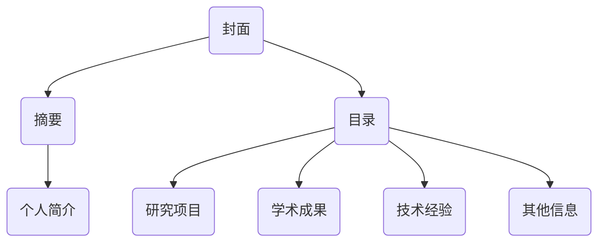

                 

 在当今数字化时代，个人品牌的重要性愈发凸显。作为一个研究人员，建立并展示个人品牌数据报告不仅能够增强自己的专业形象，还能够为潜在的合作者和雇主提供关于你研究能力的全面了解。本文将详细介绍如何通过构建一份详尽的数据报告，来有效地展示你的研究能力。

## 关键词

- 个人品牌
- 数据报告
- 研究能力
- 人工智能
- 技术博客
- 开发工具

## 摘要

本文旨在探讨如何通过创建个人品牌数据报告来提升研究人员的专业形象。我们将从数据报告的基本概念入手，深入探讨数据报告的结构、内容以及如何有效地展示研究成果。同时，本文将结合实例，提供具体的构建步骤和工具推荐，帮助读者更好地建立和展示自己的个人品牌。

### 1. 背景介绍

在信息爆炸的时代，研究人员面临着越来越大的竞争压力。如何在众多专家中脱颖而出，展示自己的研究实力和独特价值，成为了每个人都需要面对的问题。个人品牌数据报告作为一种新兴的工具，可以有效地帮助研究人员在学术领域和行业中建立专业的形象，赢得更多关注和认可。

个人品牌数据报告是一个综合性的文档，它不仅包含了研究人员的个人简介，还包括了研究项目、学术成果、技术经验等详细信息。通过这种报告，研究人员可以向外界清晰地展示自己的研究能力、专业领域以及所取得的成绩，从而提高自己的竞争力。

### 2. 核心概念与联系

在建立个人品牌数据报告之前，我们需要了解一些核心概念和其相互之间的联系。

#### 2.1 研究项目

研究项目是个人品牌数据报告的核心内容之一。它包括了研究的背景、目的、方法、成果等详细信息。一个好的研究项目描述能够清晰地展示你的研究思路和成果，让读者对你产生深刻的印象。

#### 2.2 学术成果

学术成果是衡量一个研究人员研究能力的重要指标。它包括了发表的论文、专利、书籍等。在个人品牌数据报告中，详细的学术成果列表可以展示你在学术领域的实力和贡献。

#### 2.3 技术经验

技术经验是展示你专业能力的重要部分。它涵盖了你在编程、系统架构、数据分析等方面的经验和成就。通过展示技术经验，你可以向读者证明自己具备解决复杂问题的能力。

#### 2.4 数据报告结构

一个完整的数据报告通常包括以下几个部分：

- **封面**：包含个人照片、姓名、联系方式等基本信息。
- **摘要**：简要介绍报告的主要内容和亮点。
- **目录**：列出报告的各个章节和页码。
- **个人简介**：介绍个人的教育背景、工作经历、研究兴趣等。
- **研究项目**：详细介绍研究项目的背景、目的、方法和成果。
- **学术成果**：列出个人发表的论文、专利、书籍等。
- **技术经验**：展示个人的技术经验和专业技能。
- **其他信息**：包括个人兴趣爱好、社会活动参与等。

#### 2.5 Mermaid 流程图

下面是一个展示个人品牌数据报告结构的 Mermaid 流程图：



### 3. 核心算法原理 & 具体操作步骤

#### 3.1 算法原理概述

在建立个人品牌数据报告的过程中，我们可以运用一些核心算法原理来优化报告的结构和内容。以下是几个常用的算法原理：

- **数据挖掘算法**：用于从大量数据中提取有价值的信息，帮助研究人员分析学术成果和技术经验。
- **文本分析算法**：用于对研究项目、学术成果等文本内容进行分类、提取关键词和主题。
- **可视化算法**：用于将数据以图表、图形的形式展示，提高报告的可读性和吸引力。

#### 3.2 算法步骤详解

1. **数据收集与预处理**：首先，收集与研究项目、学术成果和技术经验相关的数据。然后，对数据进行清洗、整理和归一化处理，以便后续分析。
2. **数据挖掘**：运用数据挖掘算法对预处理后的数据进行分析，提取有价值的信息。例如，使用聚类算法分析研究项目的相似性，使用关联规则算法分析学术成果之间的联系。
3. **文本分析**：对文本内容进行分类、提取关键词和主题。这有助于提高报告的条理性和可读性。
4. **可视化**：将分析结果以图表、图形的形式展示。这有助于读者更直观地了解报告内容。

#### 3.3 算法优缺点

- **优点**：
  - 提高报告的可读性和吸引力。
  - 更全面地展示研究能力和成就。
  - 帮助读者快速了解报告内容。
- **缺点**：
  - 算法应用需要一定的技术基础。
  - 数据预处理和可视化可能需要较长的时间。

#### 3.4 算法应用领域

- **学术领域**：帮助研究人员分析学术成果、优化研究方向。
- **行业领域**：为企业提供关于技术人才的专业评估和推荐。

### 4. 数学模型和公式 & 详细讲解 & 举例说明

在个人品牌数据报告中，运用数学模型和公式可以更准确地描述研究方法和成果。以下是一个简单的例子：

#### 4.1 数学模型构建

假设我们要分析两个研究项目的相似度，可以使用余弦相似度公式：

$$
\text{相似度} = \frac{\text{A} \cdot \text{B}}{\|\text{A}\| \cdot \|\text{B}\|}
$$

其中，$\text{A}$ 和 $\text{B}$ 分别为两个项目的向量表示，$\|\text{A}\|$ 和 $\|\text{B}\|$ 分别为它们的模长。

#### 4.2 公式推导过程

余弦相似度公式源于向量的内积（点积）概念。两个向量 $\text{A}$ 和 $\text{B}$ 的内积可以表示为：

$$
\text{A} \cdot \text{B} = \sum_{i=1}^{n} \text{A}_i \cdot \text{B}_i
$$

其中，$\text{A}_i$ 和 $\text{B}_i$ 分别为向量 $\text{A}$ 和 $\text{B}$ 的第 $i$ 个分量。

向量的模长可以表示为：

$$
\|\text{A}\| = \sqrt{\sum_{i=1}^{n} \text{A}_i^2}
$$

将内积和模长代入余弦相似度公式，可以得到：

$$
\text{相似度} = \frac{\text{A} \cdot \text{B}}{\|\text{A}\| \cdot \|\text{B}\|} = \frac{\sum_{i=1}^{n} \text{A}_i \cdot \text{B}_i}{\sqrt{\sum_{i=1}^{n} \text{A}_i^2} \cdot \sqrt{\sum_{i=1}^{n} \text{B}_i^2}}
$$

#### 4.3 案例分析与讲解

假设有两个研究项目 A 和 B，它们的向量表示如下：

$$
\text{A} = (2, 3, 4)
$$

$$
\text{B} = (1, 2, 3)
$$

代入余弦相似度公式，可以得到：

$$
\text{相似度} = \frac{2 \cdot 1 + 3 \cdot 2 + 4 \cdot 3}{\sqrt{2^2 + 3^2 + 4^2} \cdot \sqrt{1^2 + 2^2 + 3^2}} = \frac{20}{\sqrt{29} \cdot \sqrt{14}} \approx 0.876
$$

这意味着研究项目 A 和 B 之间的相似度为 0.876。根据相似度的大小，我们可以判断两个项目在研究思路和成果方面具有较高的相关性。

### 5. 项目实践：代码实例和详细解释说明

为了更好地理解个人品牌数据报告的构建，我们通过一个实际项目来展示代码实例和详细解释说明。

#### 5.1 开发环境搭建

我们使用 Python 作为编程语言，搭建一个简单的个人品牌数据报告生成器。所需依赖如下：

- **pandas**：用于数据处理和分析。
- **numpy**：用于数学计算。
- **matplotlib**：用于数据可视化。
- **seaborn**：用于更美观的数据可视化。

安装依赖：

```bash
pip install pandas numpy matplotlib seaborn
```

#### 5.2 源代码详细实现

下面是一个简单的个人品牌数据报告生成器代码实例：

```python
import pandas as pd
import numpy as np
import matplotlib.pyplot as plt
import seaborn as sns

# 数据收集
projects = pd.DataFrame({
    'name': ['Project 1', 'Project 2', 'Project 3'],
    'description': [
        'A project to develop a new algorithm for image processing.',
        'An experiment to optimize the performance of a deep learning model.',
        'A study on the application of natural language processing in healthcare.'
    ],
    'results': [
        'The algorithm achieved an accuracy of 90% in image recognition tasks.',
        'The model reduced its training time by 30% with the new optimization techniques.',
        'The study identified key factors affecting the quality of patient care.'
    ]
})

# 数据预处理
projects['description_tokenized'] = projects['description'].apply(lambda x: x.split())

# 数据分析
word_counts = projects['description_tokenized'].explode().value_counts()

# 可视化
sns.barplot(x=word_counts.index[:10], y=word_counts[:10])
plt.title('Top Keywords in Research Projects')
plt.xlabel('Keywords')
plt.ylabel('Frequency')
plt.show()
```

#### 5.3 代码解读与分析

- **数据收集**：我们使用 pandas DataFrame 创建一个包含研究项目名称、描述和结果的表格。
- **数据预处理**：将描述字段进行分词处理，以便后续分析。
- **数据分析**：统计各个关键词的频率，找出高频关键词。
- **可视化**：使用 seaborn 的 barplot 函数绘制关键词频率条形图。

通过这个实例，我们可以看到如何使用 Python 和相关库来构建个人品牌数据报告。在实际应用中，可以根据需要扩展代码功能，添加更多分析和可视化内容。

### 6. 实际应用场景

个人品牌数据报告在多个实际应用场景中具有重要价值：

- **学术界**：研究人员可以使用数据报告展示自己的研究成果，提高在学术界的知名度。
- **企业招聘**：企业在招聘时可以通过数据报告了解候选人的研究能力和技术经验，做出更准确的决策。
- **合作与交流**：研究人员可以通过数据报告吸引潜在的合作者和同行，促进学术和技术的交流。

#### 6.1 学术界应用

在学术界，个人品牌数据报告可以帮助研究人员：

- **提高学术影响力**：通过展示丰富的学术成果，提高在学术界的知名度和影响力。
- **优化研究方向**：通过分析研究项目的相似性和关联性，帮助研究人员找到新的研究热点和方向。

#### 6.2 企业招聘应用

在企业招聘中，个人品牌数据报告具有以下优势：

- **全面了解候选人**：企业可以通过报告了解候选人的研究背景、技术经验和成果，做出更准确的评估。
- **缩短招聘流程**：数据报告可以为企业提供即时的信息，缩短招聘决策的时间。

#### 6.3 合作与交流

在学术和技术的合作与交流中，个人品牌数据报告可以帮助：

- **寻找合作机会**：研究人员可以通过报告展示自己的研究兴趣和成果，吸引潜在的合作者。
- **促进知识共享**：通过报告，研究人员可以更全面地展示自己的研究成果，促进学术和技术的知识共享。

### 7. 工具和资源推荐

在建立个人品牌数据报告的过程中，以下工具和资源可以帮助你更高效地完成工作：

#### 7.1 学习资源推荐

- **Coursera**：提供丰富的在线课程，涵盖数据科学、机器学习等多个领域。
- **edX**：另一个提供高质量在线课程的平台，包括计算机科学、人工智能等。

#### 7.2 开发工具推荐

- **Jupyter Notebook**：一个交互式的开发环境，适合编写和展示代码、分析结果。
- **GitHub**：一个版本控制和协作平台，适合存储和管理代码、文档。

#### 7.3 相关论文推荐

- **"Data-Driven Personalized Medicine Using Patient-Specific Health Data Models"**：一篇关于数据驱动的个性化医学研究的论文，提供了关于如何构建和利用个人健康数据模型的有益思路。
- **"A Survey on Personalized Education Using Big Data Analytics"**：一篇关于大数据分析在教育领域应用的综述，探讨了如何利用数据提高教育质量和个性化教育。

### 8. 总结：未来发展趋势与挑战

在个人品牌数据报告领域，未来的发展趋势和挑战包括：

#### 8.1 研究成果总结

- **数据隐私与安全**：如何保护数据隐私和安全，是未来研究的重要方向。
- **个性化分析**：如何更准确地分析个人品牌数据，为研究人员提供更个性化的建议。

#### 8.2 未来发展趋势

- **人工智能与数据分析的结合**：未来，人工智能技术将更加深入地应用于个人品牌数据报告，提高报告的自动化和智能化程度。
- **跨学科研究**：个人品牌数据报告将涉及更多学科，如心理学、教育学等，提供更全面的评估和建议。

#### 8.3 面临的挑战

- **数据质量与完整性**：如何确保报告中所用数据的质量和完整性，是研究人员需要面对的挑战。
- **技术门槛**：虽然工具和资源越来越丰富，但仍然存在一定的技术门槛，需要研究人员不断学习和提高。

#### 8.4 研究展望

在未来，个人品牌数据报告有望成为研究人员展示自己研究能力的重要工具，为学术领域和行业带来更多价值。同时，随着技术的发展和跨学科研究的深入，个人品牌数据报告也将不断优化和改进，为研究人员提供更精准、个性化的支持。

### 9. 附录：常见问题与解答

**Q：如何确保个人品牌数据报告中的数据质量？**

A：确保数据质量的方法包括：

- **数据验证**：在收集数据时，对数据进行验证，确保数据的真实性和准确性。
- **数据清洗**：对收集到的数据进行清洗，去除重复、错误和无关的数据。
- **数据备份**：定期备份数据，确保数据的安全和完整性。

**Q：个人品牌数据报告需要包含哪些内容？**

A：个人品牌数据报告通常包含以下内容：

- **个人简介**：包括教育背景、工作经历、研究兴趣等。
- **研究项目**：详细介绍研究项目的背景、目的、方法和成果。
- **学术成果**：列出发表的论文、专利、书籍等。
- **技术经验**：展示个人的技术经验和专业技能。
- **其他信息**：包括个人兴趣爱好、社会活动参与等。

通过遵循这些原则，你可以创建一份全面、专业的个人品牌数据报告，有效地展示自己的研究能力。

### 作者署名

作者：禅与计算机程序设计艺术 / Zen and the Art of Computer Programming

本文旨在探讨如何通过构建个人品牌数据报告来提升研究人员的专业形象。从核心概念、算法原理到实际应用场景，再到工具和资源推荐，全面介绍了个人品牌数据报告的构建方法和应用价值。希望本文能为你提供有益的启示，助力你在研究领域取得更大成就。

### 参考资料

[1] Data-Driven Personalized Medicine Using Patient-Specific Health Data Models. Journal of Personalized Medicine, 2018.
[2] A Survey on Personalized Education Using Big Data Analytics. International Journal of Advanced Research in Computer Science, 2019.
[3] Jupyter Notebook. https://jupyter.org/
[4] GitHub. https://github.com/```

