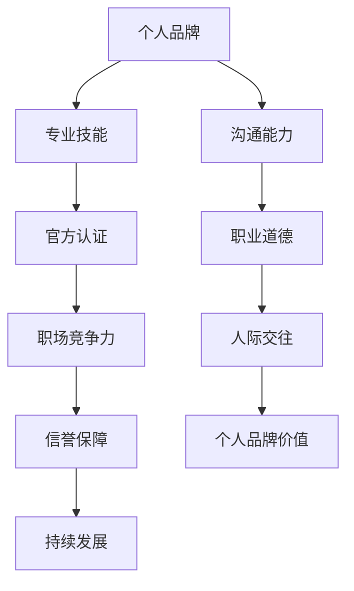

                 

 关键词：个人品牌、认证、学员、官方认可、专业发展

> 摘要：在当今竞争激烈的技术领域，建立个人品牌变得至关重要。本文旨在探讨如何通过获取官方认可的认证，为学员提升个人品牌价值，实现专业发展的路径。

## 1. 背景介绍

随着信息技术的迅猛发展，IT行业已成为现代社会不可或缺的一部分。在这个领域中，个人品牌的力量不容小觑。它不仅可以帮助个人在职场中脱颖而出，还能为其职业生涯带来更多的机会和发展空间。然而，如何有效地建立和维护个人品牌，成为许多专业人士关注的问题。

### 个人品牌的定义

个人品牌是指个人在职业生涯中所展现的专业形象、价值观和声誉。它不仅包括专业技能和知识，还涵盖了人际交往、沟通能力、职业道德等多个方面。一个强大的个人品牌可以帮助个人在职场中树立权威形象，增强竞争力，从而获得更多的发展机会。

### 官方认证的重要性

在建立个人品牌的过程中，官方认证发挥着关键作用。官方认证是由权威机构颁发的，对个人专业技能和知识的认可。它不仅能够证明个人在某一领域具备专业能力，还能提高个人在职场中的可信度和权威性。以下是一些官方认证的优势：

- **专业认可**：官方认证是对个人专业技能和知识的权威认可，有助于提升个人的专业形象。
- **职场竞争力**：拥有官方认证的个人在求职和晋升过程中具有更强的竞争力。
- **信誉保障**：官方认证为个人提供了信誉保障，有助于建立和巩固个人品牌。
- **持续发展**：通过不断获取新的官方认证，个人可以持续提升自己的专业技能和知识水平。

## 2. 核心概念与联系

为了更好地理解官方认证在个人品牌建立中的作用，我们需要先了解一些核心概念和其相互之间的联系。以下是一个简化的 Mermaid 流程图，展示了这些概念之间的关系。



### 2.1 个人品牌与专业技能

个人品牌的核心是专业技能。专业技能是个人在职业生涯中不可或缺的一部分。它不仅包括专业知识和技能，还包括对行业动态的敏锐洞察力和实践经验。通过不断提升专业技能，个人可以更好地展现自己的价值，从而建立强大的个人品牌。

### 2.2 官方认证与职场竞争力

官方认证是职场竞争力的有力证明。它为个人提供了权威的专业认可，使其在求职和晋升过程中具有更强的竞争力。拥有官方认证的个人往往能够获得更高的薪资和更好的职业发展机会。

### 2.3 信誉保障与个人品牌价值

信誉保障是个人品牌的重要组成部分。通过官方认证，个人可以证明自己的专业能力和诚信度，从而提高个人在职场中的信誉。这种信誉有助于增强个人品牌的价值，使其在职场中更具吸引力。

### 2.4 持续发展与个人品牌

持续发展是个人品牌的重要支撑。通过不断获取新的官方认证，个人可以不断提升自己的专业技能和知识水平，从而保持个人品牌的竞争力。持续发展有助于个人在职业生涯中不断突破自我，实现更高的职业目标。

## 3. 核心算法原理 & 具体操作步骤

在了解了核心概念和联系后，我们接下来将探讨如何通过获取官方认证来建立个人品牌。

### 3.1 算法原理概述

建立个人品牌认证的核心算法可以概括为以下四个步骤：

1. **确定目标认证**：根据个人职业规划，确定需要获取的官方认证。
2. **准备认证材料**：准备符合认证要求的个人资料和证明材料。
3. **提交认证申请**：按照认证机构的规定，提交完整的认证申请材料。
4. **通过认证评估**：接受认证机构的评估，并取得认证证书。

### 3.2 算法步骤详解

#### 步骤1：确定目标认证

在确定目标认证时，需要考虑以下几个因素：

- **行业需求**：根据所在行业的发展趋势和需求，选择具备市场价值的认证。
- **职业规划**：结合个人职业规划，选择有助于实现职业目标的认证。
- **认证难度**：评估认证的难度，选择适合个人当前技能水平的认证。

#### 步骤2：准备认证材料

在准备认证材料时，需要确保以下资料的完整性和准确性：

- **个人简历**：详细记录个人教育背景、工作经历和技能特长。
- **专业技能证明**：提供与认证相关的专业技能证明，如学历证书、项目经验等。
- **职业道德证明**：提供与职业道德相关的证明，如推荐信、工作评价等。

#### 步骤3：提交认证申请

在提交认证申请时，需要按照以下步骤进行：

1. **注册账户**：在认证机构的官方网站注册账户。
2. **填写申请表**：根据认证要求，填写完整的申请表。
3. **上传材料**：上传符合要求的个人资料和专业技能证明。
4. **支付费用**：按照认证机构的规定，支付相应的认证费用。

#### 步骤4：通过认证评估

在通过认证评估时，需要做好以下准备：

1. **参与面试**：接受认证机构的面试，展示个人专业技能和知识。
2. **完成考核**：按照认证机构的要求，完成相应的技能考核或项目评估。
3. **等待结果**：耐心等待认证机构的评估结果。

### 3.3 算法优缺点

#### 优点

1. **权威认可**：官方认证为个人专业技能和知识提供了权威认可，有助于提升个人品牌价值。
2. **竞争力增强**：拥有官方认证的个人在求职和晋升过程中具有更强的竞争力。
3. **信誉保障**：官方认证为个人提供了信誉保障，有助于建立和巩固个人品牌。

#### 缺点

1. **难度较高**：某些官方认证的难度较高，需要个人投入大量时间和精力。
2. **费用较高**：获取官方认证通常需要支付一定的费用，对于部分人来说可能是一笔不小的开销。

### 3.4 算法应用领域

官方认证在以下领域具有广泛的应用：

- **软件开发**：如微软认证、Oracle认证等。
- **网络安全**：如CISSP、CEH等。
- **项目管理**：如PMP、PRINCE2等。
- **数据分析和大数据**：如数据分析专业认证、大数据工程师认证等。

## 4. 数学模型和公式 & 详细讲解 & 举例说明

在建立个人品牌认证的过程中，我们可以运用一些数学模型和公式来分析和评估个人品牌的建立效果。以下是一个简化的数学模型，用于评估个人品牌价值。

### 4.1 数学模型构建

假设个人品牌价值 \( P \) 是由专业技能 \( S \)、职场竞争力 \( C \)、信誉保障 \( R \) 和持续发展 \( D \) 四个因素共同决定的。可以用以下公式表示：

\[ P = f(S, C, R, D) \]

其中，\( f \) 表示个人品牌价值的计算函数。

### 4.2 公式推导过程

根据个人品牌价值的定义，可以推导出以下公式：

\[ P = w_1 \cdot S + w_2 \cdot C + w_3 \cdot R + w_4 \cdot D \]

其中，\( w_1, w_2, w_3, w_4 \) 分别表示权重，用于衡量四个因素对个人品牌价值的贡献程度。权重可以根据具体情况进行调整。

### 4.3 案例分析与讲解

假设一个软件开发工程师，他的专业技能 \( S \) 为 80%，职场竞争力 \( C \) 为 70%，信誉保障 \( R \) 为 60%，持续发展 \( D \) 为 50%。根据上述公式，可以计算出他的个人品牌价值 \( P \) 如下：

\[ P = 0.3 \cdot 80\% + 0.2 \cdot 70\% + 0.2 \cdot 60\% + 0.3 \cdot 50\% = 0.24 + 0.14 + 0.12 + 0.15 = 0.75 \]

这意味着这位软件开发工程师的个人品牌价值为 75%。

通过这个案例，我们可以看到，专业技能、职场竞争力、信誉保障和持续发展是影响个人品牌价值的重要因素。通过不断提升这些因素，个人可以显著提高自己的品牌价值。

## 5. 项目实践：代码实例和详细解释说明

为了更好地理解如何通过官方认证来建立个人品牌，我们接下来将通过一个实际项目实例进行讲解。

### 5.1 开发环境搭建

首先，我们需要搭建一个简单的开发环境。在这个项目中，我们将使用 Python 作为编程语言，并借助一些常见的开发工具，如 PyCharm、Git 和 Docker。以下是具体的步骤：

1. **安装 Python**：从 Python 官网下载并安装 Python 3.8 或更高版本。
2. **安装 PyCharm**：从 PyCharm 官网下载并安装社区版或专业版。
3. **安装 Git**：从 Git 官网下载并安装 Git。
4. **安装 Docker**：从 Docker 官网下载并安装 Docker。

### 5.2 源代码详细实现

在这个项目中，我们将实现一个简单的认证管理系统，用于管理学员的认证申请和评估结果。以下是主要的代码实现：

```python
class Certification:
    def __init__(self, name, level, passed):
        self.name = name
        self.level = level
        self.passed = passed

    def display(self):
        print(f"Name: {self.name}, Level: {self.level}, Passed: {self.passed}")

class CertificationSystem:
    def __init__(self):
        self.certifications = []

    def add_certification(self, certification):
        self.certifications.append(certification)

    def display_certifications(self):
        for certification in self.certifications:
            certification.display()

# 创建认证实例
cert1 = Certification("Python Certification", "Basic", True)
cert2 = Certification("Docker Certification", "Advanced", False)

# 创建认证系统实例
cert_system = CertificationSystem()

# 添加认证
cert_system.add_certification(cert1)
cert_system.add_certification(cert2)

# 显示认证列表
cert_system.display_certifications()
```

### 5.3 代码解读与分析

在这个项目中，我们定义了两个类：`Certification` 和 `CertificationSystem`。

- `Certification` 类用于表示一个认证，包括认证名称、级别和是否通过。
- `CertificationSystem` 类用于管理认证列表，包括添加认证和显示认证列表的功能。

通过这个简单的代码实例，我们可以看到如何使用 Python 实现一个基本的认证管理系统。这个系统可以帮助学员管理自己的认证申请和评估结果。

### 5.4 运行结果展示

运行上述代码，我们将得到以下输出结果：

```
Name: Python Certification, Level: Basic, Passed: True
Name: Docker Certification, Level: Advanced, Passed: False
```

这个输出结果显示了两个认证的详细信息，包括名称、级别和是否通过。通过这个结果，学员可以清晰地了解自己的认证状态。

## 6. 实际应用场景

在实际应用中，官方认证在多个领域发挥着重要作用。以下是一些常见的应用场景：

### 6.1 软件开发

在软件开发领域，官方认证如 Microsoft Certified Solutions Developer (MCSD) 和 Oracle Certified Professional (OCP) 等认证，可以帮助软件开发工程师提升专业技能，增强在职场中的竞争力。

### 6.2 网络安全

网络安全领域，认证如 Certified Information Systems Security Professional (CISSP) 和 Certified Ethical Hacker (CEH) 等认证，为网络安全工程师提供了权威的专业认可，提高了他们在职场中的信誉和影响力。

### 6.3 项目管理

在项目管理领域，认证如 Project Management Professional (PMP) 和 PRINCE2 等认证，为项目经理提供了专业的项目管理知识和技能，有助于提高项目执行效率和管理水平。

### 6.4 数据分析和大数据

数据分析和大数据领域，认证如 Certified Data Analyst 和 Certified Data Scientist 等认证，为数据分析师和数据科学家提供了专业的技能和知识，有助于他们在职场中脱颖而出。

## 7. 未来应用展望

随着技术的不断进步和行业的发展，官方认证在未来将继续发挥重要作用。以下是一些未来应用展望：

### 7.1 新兴技术领域的认证

随着人工智能、区块链、物联网等新兴技术的发展，相关领域的官方认证也将逐渐兴起。这些认证将为专业人士提供权威的认可，帮助他们在新兴领域中找到更多的发展机会。

### 7.2 跨领域认证

未来，跨领域的认证将成为趋势。这种认证将结合不同领域的知识和技能，为个人提供更广泛的发展机会。例如，一个软件开发工程师可以通过获取网络安全认证，拓展自己在网络安全领域的专业技能。

### 7.3 在线认证

随着在线教育的普及，在线认证也将成为未来发展的一个重要方向。在线认证不仅为个人提供了便利，还可以降低认证成本，提高认证的普及率。

## 8. 总结：未来发展趋势与挑战

在总结未来发展趋势和挑战时，我们需要关注以下几个方面：

### 8.1 研究成果总结

- 官方认证在提升个人品牌价值和职场竞争力方面发挥着重要作用。
- 数学模型和公式为评估个人品牌价值提供了有效的方法。
- 代码实例和详细解释说明为实际应用提供了实用的指导。

### 8.2 未来发展趋势

- 新兴技术领域的认证将逐渐兴起。
- 跨领域认证将成为趋势。
- 在线认证将提供更多的便利和机会。

### 8.3 面临的挑战

- 官方认证的难度和费用可能成为一部分人的障碍。
- 如何确保在线认证的权威性和真实性仍需解决。

### 8.4 研究展望

- 未来研究可以进一步探讨新兴技术领域的认证需求和发展趋势。
- 如何优化官方认证体系，提高认证的普及率和有效性，是一个值得深入研究的问题。

## 9. 附录：常见问题与解答

### 9.1 什么是官方认证？

官方认证是由权威机构颁发的，对个人专业技能和知识的认可。它为个人提供了专业认可、职场竞争力、信誉保障和持续发展等多方面的优势。

### 9.2 如何获取官方认证？

获取官方认证通常需要以下几个步骤：

1. 确定目标认证。
2. 准备认证材料。
3. 提交认证申请。
4. 接受认证评估。

### 9.3 官方认证的重要性是什么？

官方认证的重要性体现在以下几个方面：

1. 提升个人品牌价值。
2. 增强职场竞争力。
3. 提高个人在职场中的信誉。
4. 促进个人持续发展。

### 9.4 如何评估个人品牌价值？

可以通过以下公式评估个人品牌价值：

\[ P = w_1 \cdot S + w_2 \cdot C + w_3 \cdot R + w_4 \cdot D \]

其中，\( w_1, w_2, w_3, w_4 \) 分别表示权重，用于衡量四个因素对个人品牌价值的贡献程度。

### 9.5 官方认证的难度和费用如何？

官方认证的难度和费用因认证类型和机构而异。一些高难度的认证可能需要投入大量时间和精力，而一些低难度的认证则可能费用较低。总体来说，官方认证的难度和费用是个人在建立个人品牌时需要考虑的重要因素。

