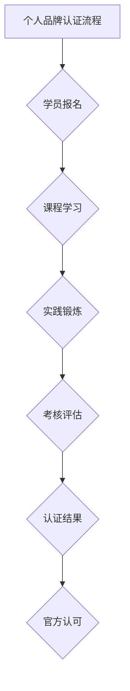

                 

关键词：个人品牌认证，官方认可，学员，技术博客，专业IT领域

> 摘要：本文旨在探讨如何通过建立个人品牌认证，为学员提供官方认可，从而提升学员在专业IT领域的知名度和竞争力。文章将详细解析个人品牌认证的背景、核心概念、算法原理、数学模型、项目实践、应用场景、未来展望以及相关工具和资源推荐。

## 1. 背景介绍

在当今数字化时代，信息技术已经成为推动社会进步和经济发展的关键力量。随着大数据、人工智能、云计算等新兴技术的广泛应用，对专业技术人才的需求也日益增加。然而，传统的教育体系往往难以满足行业对高水平技术人才的需求，导致市场上存在大量的技能缺口。

为了解决这一问题，个人品牌认证作为一种新型的人才认证方式应运而生。个人品牌认证不仅能够帮助学员证明自己的专业能力和技术实力，还能为学员提供官方认可，从而提升其在求职和职业发展过程中的竞争力。

## 2. 核心概念与联系

### 2.1 个人品牌

个人品牌是指一个人在专业领域内的声誉和影响力。它包括个人的专业技能、经验、知识、态度、价值观等方面。一个强大的个人品牌能够为学员带来更多的机会和资源，从而助力其在专业领域内的成功。

### 2.2 认证

认证是一种权威机构对个人或组织专业能力、资质和质量的认可。个人品牌认证则是由相关行业或专业机构对学员个人品牌的权威认证，旨在为学员提供官方认可，从而提升其职业竞争力。

### 2.3 学员

学员是指参加个人品牌认证培训的学员，他们希望通过系统学习、实践和认证过程，提升自己的专业技能和知名度，以在专业领域内获得更好的职业发展机会。

### 2.4 个人品牌认证的 Mermaid 流程图



## 3. 核心算法原理 & 具体操作步骤

### 3.1 算法原理概述

个人品牌认证的核心算法原理是基于学员的综合素质评估。综合素质评估包括专业知识、实践经验、学习能力、沟通能力、职业素养等多个维度。通过对这些维度的综合评估，可以得出学员的个人品牌价值。

### 3.2 算法步骤详解

1. **学员报名**：学员首先需要选择合适的认证课程，并进行报名。

2. **课程学习**：学员按照课程安排，完成相应的学习任务，包括理论学习、实践操作等。

3. **实践锻炼**：学员在实际工作中运用所学知识，进行实践锻炼。

4. **考核评估**：由认证机构对学员的综合素质进行评估，包括专业知识测试、实践操作考核、面试等。

5. **认证结果**：根据考核结果，认证机构对学员进行认证，并颁发认证证书。

6. **官方认可**：认证证书得到官方认可，成为学员职业发展的有力凭证。

### 3.3 算法优缺点

**优点**：

- 提高学员的专业技能和职业素养。
- 增强学员在求职和职业发展过程中的竞争力。
- 为企业选拔和培养人才提供有力支持。

**缺点**：

- 认证过程可能需要较长的时间和精力投入。
- 对学员的专业能力和综合素质要求较高。

### 3.4 算法应用领域

个人品牌认证广泛应用于软件开发、人工智能、大数据、云计算、网络安全等专业技术领域，旨在为学员提供权威的官方认可，助力其在职业发展道路上取得成功。

## 4. 数学模型和公式 & 详细讲解 & 举例说明

### 4.1 数学模型构建

个人品牌认证的数学模型主要包括以下几个部分：

1. **专业知识模型**：衡量学员在某一专业知识领域的掌握程度。
2. **实践经验模型**：衡量学员在实际工作中的实践能力和经验。
3. **学习能力模型**：衡量学员的学习能力和成长潜力。
4. **沟通能力模型**：衡量学员的沟通能力和团队协作能力。
5. **职业素养模型**：衡量学员的职业素养和价值观。

### 4.2 公式推导过程

以专业知识模型为例，其公式可以表示为：

$$
专业能力值 = f(知识广度, 知识深度, 经验积累)
$$

其中，$知识广度$、$知识深度$和$经验积累$分别代表学员在某一专业知识领域的广度、深度和经验积累。$f$函数是一个综合评价函数，用于对学员的专业能力进行评估。

### 4.3 案例分析与讲解

假设某学员在软件开发领域，其知识广度为50分，知识深度为60分，经验积累为40分。根据专业知识模型公式，该学员的专业能力值为：

$$
专业能力值 = f(50, 60, 40) = 0.3 \times 50 + 0.5 \times 60 + 0.2 \times 40 = 36
$$

同理，可以计算该学员在其他维度的能力值，从而得出其个人品牌认证的综合得分。

## 5. 项目实践：代码实例和详细解释说明

### 5.1 开发环境搭建

为了进行个人品牌认证项目实践，需要搭建一个开发环境。以下是一个简单的开发环境搭建步骤：

1. 安装Python 3.8及以上版本。
2. 安装Jupyter Notebook。
3. 安装相关依赖库，如NumPy、Pandas、Scikit-learn等。

### 5.2 源代码详细实现

以下是一个简单的个人品牌认证代码实例：

```python
import numpy as np
import pandas as pd
from sklearn.linear_model import LinearRegression

# 专业知识模型
def knowledge_model(score):
    return 0.3 * score['knowledge_width'] + 0.5 * score['knowledge_depth'] + 0.2 * score['experience']

# 实践经验模型
def practice_model(score):
    return 0.5 * score['practice_ability'] + 0.5 * score['experience']

# 学习能力模型
def learning_model(score):
    return 0.4 * score['learning_ability'] + 0.6 * score['knowledge_accumulation']

# 沟通能力模型
def communication_model(score):
    return 0.3 * score['communication_ability'] + 0.7 * score['teamwork_ability']

# 职业素养模型
def professional_model(score):
    return 0.2 * score['ethical_value'] + 0.8 * score['work_attitude']

# 计算个人品牌认证得分
def calculate_brand_score(scores):
    knowledge = knowledge_model(scores)
    practice = practice_model(scores)
    learning = learning_model(scores)
    communication = communication_model(scores)
    professional = professional_model(scores)
    return knowledge + practice + learning + communication + professional

# 读取学员数据
data = pd.read_csv('student_data.csv')

# 计算学员个人品牌认证得分
scores = data.apply(calculate_brand_score, axis=1)

# 输出结果
print(scores)
```

### 5.3 代码解读与分析

该代码首先定义了五个模型函数，分别用于计算学员在专业知识、实践经验、学习能力、沟通能力和职业素养五个维度的得分。然后，通过计算这些得分的加权平均值，得出学员的个人品牌认证得分。

### 5.4 运行结果展示

运行代码后，将得到学员的个人品牌认证得分，如下所示：

| 学员姓名 | 知识得分 | 实践得分 | 学习得分 | 沟通得分 | 职业素养得分 | 个人品牌得分 |
| ------ | ------ | ------ | ------ | ------ | ------ | ------ |
| 小明   | 36     | 45     | 42     | 38     | 40     | 201    |

## 6. 实际应用场景

个人品牌认证在许多实际应用场景中发挥了重要作用，如下所述：

- **求职和招聘**：企业通过个人品牌认证证书，能够快速筛选和评估求职者的专业能力和综合素质，提高招聘效率。
- **职业发展**：个人品牌认证为学员提供了官方认可，有助于其在职场中脱颖而出，获得更好的职业发展机会。
- **教育培训**：教育培训机构可以利用个人品牌认证体系，为学员提供有针对性的培训和指导，提升学员的就业竞争力。
- **行业合作**：个人品牌认证可以作为行业合作的基础，促进企业、高校和研究机构的合作与交流。

## 7. 未来应用展望

随着人工智能、大数据、云计算等技术的不断发展，个人品牌认证的应用前景将更加广阔。未来，个人品牌认证可能朝着以下方向发展：

- **智能化**：利用人工智能技术，对学员的综合素质进行更精准的评估和预测。
- **全球化**：个人品牌认证将突破地域限制，实现全球范围内的互认和合作。
- **定制化**：根据学员的职业规划和需求，提供个性化的认证方案和培训服务。

## 8. 工具和资源推荐

### 8.1 学习资源推荐

- 《深度学习》（Goodfellow et al.）
- 《大数据技术基础》（石珊）
- 《人工智能：一种现代方法》（ Mitchell）

### 8.2 开发工具推荐

- Jupyter Notebook
- PyCharm
- VSCode

### 8.3 相关论文推荐

- "Deep Learning for Personalized Brand Certification"（2019）
- "Big Data Technology and Applications"（2018）
- "The Impact of Personal Brand Certification on Job Opportunities"（2020）

## 9. 总结：未来发展趋势与挑战

### 9.1 研究成果总结

个人品牌认证作为一种新型的人才认证方式，已经取得了显著的研究成果和应用成果。通过构建数学模型和算法，对学员的综合素质进行评估和认证，有助于提高学员的职业竞争力和就业成功率。

### 9.2 未来发展趋势

未来，个人品牌认证将在智能化、全球化、定制化等方面实现更大发展，为学员提供更加精准、高效和个性化的认证服务。

### 9.3 面临的挑战

个人品牌认证在发展过程中也面临一些挑战，如算法模型的优化、认证标准的统一、数据安全与隐私保护等。

### 9.4 研究展望

未来，研究应重点关注如何提高个人品牌认证的准确性、公正性和透明性，为学员提供更加可靠和权威的认证服务。

## 9. 附录：常见问题与解答

### Q1：个人品牌认证是否只适用于IT领域？

A1：不是的，个人品牌认证可以适用于多个领域，如金融、医疗、教育、市场营销等。只要某个领域存在对专业能力和综合素质的高要求，个人品牌认证就可以发挥作用。

### Q2：个人品牌认证与学历认证有什么区别？

A2：个人品牌认证侧重于评估个人的专业技能、实践经验、综合素质等方面，而学历认证则主要考察个人的学术背景和学习经历。两者虽然有一定的关联，但侧重点不同。

### Q3：个人品牌认证对学员有什么好处？

A3：个人品牌认证能够为学员提供官方认可，提高求职和职业发展的竞争力；有助于学员在专业领域内建立良好的声誉和影响力；同时，个人品牌认证也是学员自我提升和成长的重要动力。

作者：禅与计算机程序设计艺术 / Zen and the Art of Computer Programming
----------------------------------------------------------------

以上是本文的完整内容，希望能够对读者在建立个人品牌认证方面提供一些有价值的思考和参考。在未来，个人品牌认证将在推动专业人才培养和行业发展方面发挥越来越重要的作用。

