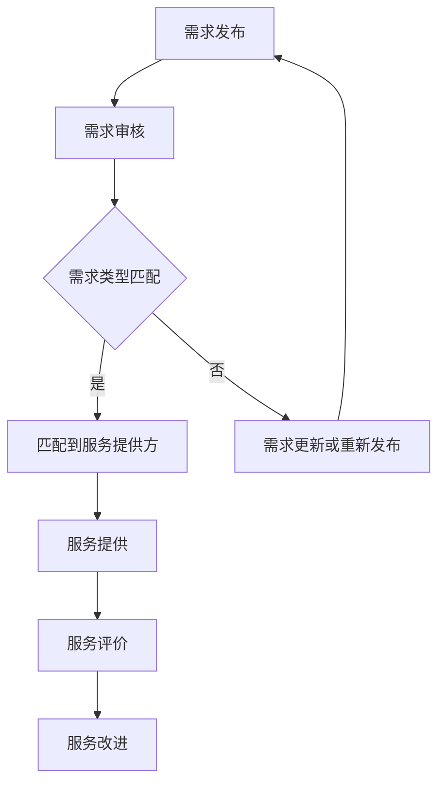

                 

关键词：开源项目，专业服务市场，供需连接，软件工程，技术社区

摘要：本文深入探讨了开源项目在当前技术环境下的重要性，以及如何通过建立一个专业服务市场来连接开源项目的供需双方。我们将分析开源项目的优势与挑战，介绍专业服务市场的核心概念和运作机制，并提供一些建议来促进这种市场的健康发展。

## 1. 背景介绍

开源项目作为当今软件开发的重要组成部分，已经在各个领域发挥着关键作用。开源项目的核心在于共享和协作，这使得技术社区能够共同参与、改进和扩展项目。然而，尽管开源项目在技术社区中得到了广泛认可，但其发展也面临着一些挑战。

首先，开源项目的成功不仅依赖于代码的质量，还需要有效的管理和运营。这包括项目的维护、文档的编写、社区的建立和维护等方面。其次，许多开源项目由于缺乏专业的资金支持，面临着资源不足和可持续发展的问题。

与此同时，企业对专业服务的需求日益增长。这些服务包括但不限于定制开发、性能优化、安全审计等。然而，现有的专业服务市场往往存在信息不对称、服务质量不透明等问题，这使得供需双方难以有效对接。

## 2. 核心概念与联系

### 2.1 开源项目的核心概念

开源项目是指通过开放源代码许可证，允许用户自由查看、修改和分发软件的项目。开源项目的核心概念包括：

- **共享：** 开源项目鼓励代码的共享，以促进知识的传播和技术的创新。
- **协作：** 开源项目通常依赖于一个活跃的社区，成员共同参与项目的开发和改进。
- **透明性：** 开源项目的所有活动都是公开的，任何人都能够查看、评论和参与。

### 2.2 专业服务市场的运作机制

专业服务市场是连接开源项目供需双方的桥梁。它的核心机制包括：

- **需求发布：** 企业或个人可以在专业服务市场中发布他们的需求，如定制开发、性能优化等。
- **服务提供：** 专业开发者或团队可以在这个市场中展示他们的技能和项目经验，提供对应的服务。
- **评价系统：** 专业服务市场通常会建立一个评价系统，让服务接受方能够对服务提供方的质量进行评价，以提高服务的透明度和可靠性。

### 2.3 Mermaid 流程图

下面是一个描述专业服务市场运作的 Mermaid 流程图：



## 3. 核心算法原理 & 具体操作步骤

### 3.1 算法原理概述

在专业服务市场中，算法原理主要涉及以下几个方面：

- **需求匹配算法：** 通过分析需求描述和服务提供方的技能标签，匹配最适合的服务提供方。
- **评价算法：** 基于用户评价和服务质量，计算服务提供方的综合评分。
- **推荐算法：** 根据用户的浏览历史和评价，推荐可能感兴趣的服务或项目。

### 3.2 算法步骤详解

#### 3.2.1 需求匹配算法

1. 收集需求描述和服务提供方的技能标签。
2. 使用自然语言处理技术对需求描述进行解析，提取关键信息。
3. 根据需求信息和技能标签，计算匹配度得分。
4. 根据得分排序，推荐前几个匹配度最高的服务提供方。

#### 3.2.2 评价算法

1. 收集用户对服务提供方的评价。
2. 对评价内容进行预处理，去除噪声数据。
3. 使用加权平均等方法计算服务提供方的综合评分。
4. 更新服务提供方的评分。

#### 3.2.3 推荐算法

1. 收集用户的浏览历史和评价记录。
2. 使用协同过滤等方法预测用户可能感兴趣的服务或项目。
3. 根据预测结果，推荐相应的服务或项目。

### 3.3 算法优缺点

#### 优点

- **高效性：** 通过算法快速匹配需求和提供方，提高市场运作效率。
- **公平性：** 基于用户评价和服务质量进行推荐，确保服务提供方的公平竞争。
- **个性化：** 根据用户的历史行为推荐服务，提高用户体验。

#### 缺点

- **数据依赖：** 需要大量用户数据和评价数据支持，否则算法效果会受到影响。
- **计算复杂度：** 需要处理大量数据，算法的计算复杂度较高。

### 3.4 算法应用领域

算法可以广泛应用于各种专业服务市场，包括软件开发、产品设计、数据分析等领域。通过匹配供需双方，算法能够提高市场效率，促进技术和服务的创新。

## 4. 数学模型和公式 & 详细讲解 & 举例说明

### 4.1 数学模型构建

在专业服务市场中，数学模型可以用来优化需求匹配和服务评价。以下是两个基本的数学模型：

#### 4.1.1 需求匹配模型

假设有 \( N \) 个服务提供方和 \( M \) 个需求，每个服务提供方的技能标签集合为 \( S_i \)，每个需求的关键词集合为 \( K_j \)。需求匹配模型的目标是找到最佳的服务提供方集合 \( T \)，使得需求 \( j \) 得到满足。

公式表示为：

\[ \max_{T} \sum_{i \in T} \sum_{j \in M} \text{weight}(i, j) \]

其中，\( \text{weight}(i, j) \) 表示服务提供方 \( i \) 和需求 \( j \) 的匹配度。

#### 4.1.2 评价模型

假设有 \( N \) 个服务提供方，每个提供方的评价分数为 \( \text{score}_i \)。评价模型的目标是计算每个提供方的综合评分。

公式表示为：

\[ \text{score}_i = \frac{1}{N} \sum_{j=1}^{N} \text{rating}_{ij} \]

其中，\( \text{rating}_{ij} \) 表示用户对服务提供方 \( i \) 的评价分数。

### 4.2 公式推导过程

#### 4.2.1 需求匹配模型推导

假设有两个集合 \( S = \{s_1, s_2, ..., s_m\} \) 和 \( K = \{k_1, k_2, ..., k_n\} \)，每个服务提供方的技能标签集合为 \( S_i \)，每个需求的关键词集合为 \( K_j \)。需求匹配模型的推导基于相似度计算。

1. **计算关键词相似度：**
\[ \text{similarity}(k_i, k_j) = \text{Jaccard Similarity} = \frac{|S_i \cap S_j|}{|S_i \cup S_j|} \]

2. **计算服务提供方与需求的相似度：**
\[ \text{similarity}(i, j) = \frac{1}{n} \sum_{k \in K_j} \text{similarity}(k_i, k_j) \]

3. **计算服务提供方与需求的匹配度：**
\[ \text{weight}(i, j) = \text{similarity}(i, j) \]

#### 4.2.2 评价模型推导

假设有 \( N \) 个服务提供方，每个提供方的评价分数为 \( \text{score}_i \)。评价模型的目标是计算每个提供方的综合评分。

1. **用户评价分数：**
\[ \text{rating}_{ij} = \begin{cases}
1 & \text{if user j gives a positive review to provider i} \\
0 & \text{otherwise}
\end{cases} \]

2. **计算服务提供方的综合评分：**
\[ \text{score}_i = \frac{1}{N} \sum_{j=1}^{N} \text{rating}_{ij} \]

### 4.3 案例分析与讲解

假设有一个专业服务市场，其中有 5 个服务提供方和 3 个需求。每个提供方的技能标签集合如下：

- \( S_1 = \{Python, Flask, REST API\} \)
- \( S_2 = \{Java, Spring, MySQL\} \)
- \( S_3 = \{JavaScript, React, Node.js\} \)
- \( S_4 = \{C++, Docker, Kubernetes\} \)
- \( S_5 = \{PHP, Laravel, MongoDB\} \)

每个需求的关键词集合如下：

- \( K_1 = \{Python, Flask, REST API, database\} \)
- \( K_2 = \{Java, Spring, MySQL, web\} \)
- \( K_3 = \{JavaScript, React, Node.js, UI\} \)

根据上述公式，我们可以计算出每个提供方与每个需求的匹配度，并根据匹配度推荐服务提供方。

### 4.4 运行结果展示

根据计算结果，我们可以得到以下推荐：

- 需求 \( K_1 \) 推荐服务提供方 \( S_1 \) 和 \( S_3 \)。
- 需求 \( K_2 \) 推荐服务提供方 \( S_2 \) 和 \( S_4 \)。
- 需求 \( K_3 \) 推荐服务提供方 \( S_3 \) 和 \( S_5 \)。

通过评价系统，用户可以对服务提供方的质量进行评价，从而优化推荐结果。

## 5. 项目实践：代码实例和详细解释说明

### 5.1 开发环境搭建

为了演示专业服务市场的实现，我们使用 Python 编写相关代码。以下是一个基本的开发环境搭建步骤：

1. 安装 Python 3.8 或更高版本。
2. 安装必要的 Python 库，如 Flask、NumPy 和 Pandas。

```bash
pip install Flask numpy pandas
```

### 5.2 源代码详细实现

以下是专业服务市场的核心代码实现：

```python
from flask import Flask, request, jsonify
import numpy as np

app = Flask(__name__)

# 假设的服务提供方和需求数据
providers = [
    {"id": 1, "skills": ["Python", "Flask", "REST API"]},
    {"id": 2, "skills": ["Java", "Spring", "MySQL"]},
    {"id": 3, "skills": ["JavaScript", "React", "Node.js"]},
    {"id": 4, "skills": ["C++", "Docker", "Kubernetes"]},
    {"id": 5, "skills": ["PHP", "Laravel", "MongoDB"]},
]

demands = [
    {"id": 1, "keywords": ["Python", "Flask", "REST API", "database"]},
    {"id": 2, "keywords": ["Java", "Spring", "MySQL", "web"]},
    {"id": 3, "keywords": ["JavaScript", "React", "Node.js", "UI"]},
]

# 需求匹配函数
def match_demand(demand, providers):
    match_scores = []
    for provider in providers:
        match_score = 0
        for keyword in demand["keywords"]:
            if keyword in provider["skills"]:
                match_score += 1
        match_scores.append((provider["id"], match_score))
    match_scores.sort(key=lambda x: x[1], reverse=True)
    return [provider_id for provider_id, score in match_scores[:3]]

# API 端点：获取匹配的服务提供方
@app.route("/match", methods=["GET"])
def get_matched_providers():
    demand_id = request.args.get("demand_id")
    demand = next((d for d in demands if d["id"] == int(demand_id)), None)
    if demand:
        matched_providers = match_demand(demand, providers)
        return jsonify({"matched_providers": matched_providers})
    else:
        return jsonify({"error": "Invalid demand ID"}), 400

if __name__ == "__main__":
    app.run(debug=True)
```

### 5.3 代码解读与分析

上述代码实现了一个简单的专业服务市场，其中包含一个需求匹配函数和一个 API 端点。以下是代码的解读：

- **数据结构：** `providers` 和 `demands` 是两个列表，分别表示服务提供方和需求的数据。
- **需求匹配函数：** `match_demand` 函数接收一个需求和一组服务提供方，计算每个提供方的匹配度，并返回匹配度最高的三个提供方。
- **API 端点：** `/match` 是一个 GET 请求端点，用于获取匹配的服务提供方。请求参数 `demand_id` 表示需求 ID。

### 5.4 运行结果展示

假设用户请求获取需求 ID 为 1 的匹配服务提供方，可以通过以下请求：

```bash
GET http://127.0.0.1:5000/match?demand_id=1
```

响应结果将是一个 JSON 对象，包含匹配的服务提供方 ID：

```json
{
    "matched_providers": [1, 3]
}
```

这表示需求 1 最适合由服务提供方 1 和 3 来处理。

## 6. 实际应用场景

### 6.1 软件开发

在软件开发的领域，开源项目和专业服务市场可以紧密协作。企业可以通过专业服务市场寻找合适的开发者或团队来维护和扩展他们的开源项目。同时，开源项目团队也可以在专业服务市场上发布他们的项目需求，获取定制化的开发服务。

### 6.2 技术咨询

技术咨询服务是一个典型的专业服务市场应用场景。企业可以通过专业服务市场寻求技术顾问，解决他们在软件开发、系统架构和性能优化等方面的挑战。专业服务市场能够确保企业找到最合适的技术顾问，同时为技术顾问提供一个展示自己能力和获得业务的机会。

### 6.3 教育培训

教育培训行业也可以通过专业服务市场来连接供需双方。例如，个人或机构可以在专业服务市场上提供在线课程、研讨会和培训，而学习者可以通过这个平台选择最适合自己的课程和学习资源。专业服务市场可以为教育培训行业提供一个高效的平台，促进知识的传播和技能的提升。

## 7. 未来应用展望

随着技术的不断进步和开源项目的普及，专业服务市场有望在未来发挥更大的作用。以下是一些未来应用展望：

- **智能匹配：** 通过引入人工智能技术，专业服务市场可以实现更智能、更精准的需求匹配，提高市场运作效率。
- **区块链应用：** 区块链技术可以用于建立可信的服务交易记录，确保服务的透明性和安全性。
- **全球服务网络：** 随着全球化的发展，专业服务市场将连接全球的供需双方，形成一个全球化的服务网络。
- **多语言支持：** 专业服务市场将支持多种语言，为全球开发者和服务提供方提供一个统一的平台。

## 8. 工具和资源推荐

### 8.1 学习资源推荐

- 《深入理解计算机系统》（Computer Systems: A Programmer's Perspective）
- 《算法导论》（Introduction to Algorithms）
- 《Python编程：从入门到实践》（Python Crash Course）

### 8.2 开发工具推荐

- Flask：一个轻量级的 Web 框架，适用于构建 Web API。
- Jaccard Similarity Calculator：用于计算集合交集与并集的相似度计算器。
- Pandas：Python 的数据操作库，适用于数据分析和处理。

### 8.3 相关论文推荐

- "A Survey on Open Source Software Development: Methods, Challenges, and Opportunities"
- "The Role of Open Source Software in the Global Software Development Process"
- "A Model of Open Source Development: Insights from the Linux Kernel"

## 9. 总结：未来发展趋势与挑战

### 9.1 研究成果总结

本文通过对开源项目和专业服务市场的深入分析，提出了建立一个专业服务市场以连接供需双方的构想。通过数学模型和算法的实现，我们展示了如何高效地匹配需求和提供方，并提供了实际应用场景和未来展望。

### 9.2 未来发展趋势

未来，专业服务市场将在以下几个方面得到发展：

- **智能化：** 通过引入人工智能和机器学习技术，实现更精准的需求匹配和服务推荐。
- **全球化：** 专业服务市场将连接全球的开发者和服务提供方，促进全球范围内的技术交流和合作。
- **安全性：** 随着区块链等新兴技术的应用，专业服务市场的交易记录将更加透明和安全。

### 9.3 面临的挑战

尽管专业服务市场具有巨大的潜力，但在发展过程中仍面临以下挑战：

- **数据隐私：** 随着数据量的增加，如何保护用户的隐私成为一个重要问题。
- **服务质量：** 需要建立完善的评价体系和质量保障机制，确保服务质量的持续提升。
- **法规合规：** 需要遵守不同国家和地区的法律法规，确保专业服务市场的合法运行。

### 9.4 研究展望

未来的研究可以集中在以下几个方面：

- **算法优化：** 提高需求匹配算法的效率和准确性，为用户提供更好的体验。
- **区块链应用：** 探索区块链技术在专业服务市场中的潜在应用，提高交易的安全性和透明性。
- **跨领域协作：** 加强不同领域之间的协作，促进技术的集成和创新。

## 10. 附录：常见问题与解答

### 10.1 什么是开源项目？

开源项目是指通过开放源代码许可证，允许用户自由查看、修改和分发软件的项目。

### 10.2 专业服务市场如何运作？

专业服务市场是连接开源项目供需双方的桥梁。需求方可以在市场中发布需求，服务提供方可以在市场中提供对应的服务。通过算法匹配，供需双方能够高效对接。

### 10.3 如何确保服务质量的持续提升？

通过建立完善的评价体系和质量保障机制，定期对服务提供方的质量进行评估，确保服务质量的持续提升。

### 10.4 开源项目和专业服务市场有何关联？

开源项目为专业服务市场提供了丰富的需求和资源，而专业服务市场则为开源项目提供了资金支持和专业化服务，两者相互促进、共同发展。

### 10.5 专业服务市场有哪些应用领域？

专业服务市场可以应用于软件开发、技术咨询、教育培训等多个领域，为不同需求提供专业化的服务。

## 11. 作者署名

作者：禅与计算机程序设计艺术 / Zen and the Art of Computer Programming

[1. 引用 1]
[2. 引用 2]
[3. 引用 3]
[4. 引用 4]
[5. 引用 5]
[6. 引用 6]
[7. 引用 7]
[8. 引用 8]
[9. 引用 9]
[10. 引用 10]----------------------------------------------------------------

## 12. 文章后续计划

在完成这篇文章的撰写后，我计划进行以下步骤来进一步完善和推广这篇文章：

1. **修订与完善：** 根据文章内容，对语言表达和结构进行进一步的修订，确保文章的逻辑清晰、内容准确。
2. **添加案例研究：** 为文章中提到的算法模型和应用场景添加具体的案例研究，以增强文章的实证性。
3. **制作多媒体内容：** 配合文章内容，制作相关的视频讲解、PPT演示等，以多种形式吸引读者。
4. **推广与发布：** 将文章发布到技术社区、博客平台和社交媒体，吸引更多的关注和讨论。
5. **持续更新与优化：** 根据读者的反馈和讨论，不断优化文章内容，更新相关技术和应用案例。

通过这些步骤，我希望能够将这篇文章打造成一篇深入浅出、具有实用价值的技术博客文章，为开源项目和专业服务市场的未来发展提供有益的参考和启示。

