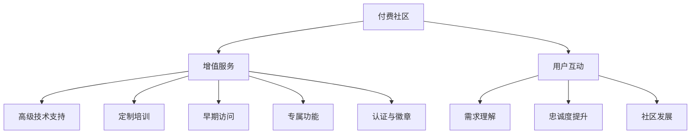

                 

在开源项目的世界中，许多开发者愿意无偿分享他们的代码和知识，以促进技术的进步和社区的繁荣。然而，随着项目的成长和用户群体的扩大，项目维护者面临着不断增加的工作量和资源需求。为了确保项目的持续发展，建立一个付费社区成为一种可行的策略。本文将探讨如何建立开源项目的付费社区，包括增值服务的提供和与用户的互动。

> **关键词**：开源项目，付费社区，增值服务，用户互动，商业模式

> **摘要**：本文旨在为开源项目维护者提供一套策略，以建立付费社区，通过增值服务和与用户的互动来提高项目的可持续性。文章将涵盖付费社区的构建过程，增值服务的种类，以及如何与社区成员建立有效的互动关系。

## 1. 背景介绍

开源项目起源于一个共享和协作的理念，开发者们通过共享代码和知识，促进了技术的快速发展和创新。许多知名软件，如Linux操作系统、MySQL数据库和Apache Web服务器，都是基于开源模型构建的。开源项目不仅降低了软件的进入门槛，还提供了一个共享知识的平台，使得任何人都可以参与其中，从而推动整个行业的发展。

然而，随着开源项目的成长，维护和开发成本也在不断增加。除了时间和精力的投入，开源项目还需要资金来支持服务器托管、安全审计、文档编写和营销等活动。对于许多维护者来说，这成为了一个挑战，因为他们在很大程度上依靠个人资源来维持项目的运转。

为了解决这一难题，付费社区作为一种商业模式被提了出来。付费社区不仅为维护者提供了额外的收入来源，还能通过增值服务和互动提高用户的参与度和满意度，从而增强项目的活力和可持续性。

## 2. 核心概念与联系

在讨论如何建立开源项目的付费社区之前，我们需要了解一些核心概念，这些概念是构建成功社区的基础。

### 2.1 付费社区的定义

付费社区是指一个针对特定用户群体（通常是项目的贡献者、用户或爱好者）的封闭或半封闭环境，用户需要支付费用才能获得访问权限。付费社区可以为用户提供额外的服务，如高级技术支持、定制培训、早期访问权限和特殊功能等。

### 2.2 增值服务的种类

增值服务是指除了基础项目之外，为付费用户提供的高级服务和特权。这些服务可以包括：

- **高级技术支持**：为用户提供更快速、更专业的技术支持，解决他们在使用项目过程中遇到的问题。
- **定制培训**：为用户提供专门的培训课程，帮助他们更好地理解和使用项目。
- **早期访问**：允许用户提前访问项目的最新版本或功能，以获得先发优势。
- **专属功能**：为付费用户提供仅在该社区中可用的特殊功能或插件。
- **认证与徽章**：为通过特定考试或完成特定任务的付费用户提供认证和徽章。

### 2.3 用户互动的重要性

用户互动是付费社区的核心组成部分。通过与用户的互动，维护者可以更好地理解用户的需求和痛点，从而提供更有针对性的服务。有效的互动还可以增强用户的忠诚度和参与度，促进社区的发展。

### 2.4 Mermaid 流程图

以下是一个简化的 Mermaid 流程图，展示了付费社区的核心概念和联系。



## 3. 核心算法原理 & 具体操作步骤

### 3.1 算法原理概述

建立开源项目的付费社区需要一系列的算法和策略，以确保社区的成功和用户的满意度。以下是一些核心算法原理和操作步骤：

### 3.2 算法步骤详解

#### 3.2.1 社区定位

- **用户需求分析**：首先，需要对目标用户群体进行分析，了解他们的需求、痛点和使用习惯。
- **社区定位**：基于用户需求分析，明确社区的目标和定位，如技术支持、培训、资源共享等。

#### 3.2.2 增值服务设计

- **服务内容规划**：根据社区定位，设计一系列增值服务，如高级技术支持、定制培训、早期访问等。
- **定价策略**：制定合理的定价策略，确保服务的可持续性和用户的接受度。

#### 3.2.3 社区搭建

- **技术平台选择**：选择合适的技术平台来搭建社区，如论坛、知识库、聊天室等。
- **内容管理**：建立内容管理体系，确保社区内容的及时更新和高质量。

#### 3.2.4 用户互动

- **互动机制设计**：设计有效的互动机制，如论坛、聊天室、反馈渠道等，鼓励用户参与。
- **互动内容管理**：定期发布互动内容，如技术问答、讨论话题、用户分享等。

#### 3.2.5 付费用户管理

- **用户分类**：根据用户的付费情况和服务需求，将用户分为不同类别。
- **用户维护**：定期与付费用户沟通，了解他们的需求和建议，提供个性化的服务。

### 3.3 算法优缺点

#### 优点

- **增加收入来源**：付费社区为维护者提供了额外的收入来源，有助于项目的持续发展。
- **提高用户满意度**：通过提供增值服务，可以提高用户的满意度和忠诚度。
- **促进社区发展**：有效的用户互动可以促进社区的发展，增强社区的活力。

#### 缺点

- **初期投入较大**：建立付费社区需要投入大量时间和资源，初期收益可能不高。
- **运营成本较高**：付费社区的运营需要持续的资金投入，如服务器托管、安全审计、内容更新等。
- **用户流失风险**：如果增值服务不满足用户需求或服务质量不高，可能会导致用户流失。

### 3.4 算法应用领域

付费社区算法主要应用于开源项目，特别是在那些有较高维护成本和技术需求的领域，如软件开发、数据库管理、云计算等。通过付费社区，维护者可以更好地支持用户，同时确保项目的可持续性。

## 4. 数学模型和公式 & 详细讲解 & 举例说明

### 4.1 数学模型构建

为了更好地理解付费社区的价值，我们可以构建一个简单的数学模型来分析其收益和成本。

设：

- \( P \) 为每个用户的月均付费
- \( N \) 为付费用户的数量
- \( C \) 为每月的运营成本
- \( R \) 为每月的总收入
- \( E \) 为每月的净收益

则有以下数学模型：

\[ R = P \times N \]
\[ E = R - C \]

### 4.2 公式推导过程

首先，我们需要确定每个用户的月均付费 \( P \)。这可以通过调查问卷、市场调研或用户反馈来确定。假设我们得到了 \( P \) 的估计值。

然后，我们需要估计付费用户的数量 \( N \)。这可以通过对现有用户群体的分析或预测模型来确定。例如，我们可以使用以下公式来估计 \( N \)：

\[ N = \frac{U}{100} \times P_{\text{max}} \]

其中 \( U \) 为总用户数量，\( P_{\text{max}} \) 为付费用户的比例。

最后，我们需要确定每月的运营成本 \( C \)。这包括服务器托管费、人力资源费、安全审计费等。假设我们已经有了 \( C \) 的估计值。

通过以上参数，我们可以推导出净收益 \( E \)：

\[ E = (P - C) \times N \]

### 4.3 案例分析与讲解

假设一个开源项目的维护者决定建立付费社区。通过市场调研，他们估计每个用户的月均付费 \( P \) 为 50 美元。他们估计总用户数量 \( U \) 为 1000，其中 20% 的用户可能会成为付费用户，即 \( P_{\text{max}} = 0.2 \)。每月的运营成本 \( C \) 为 1000 美元。

根据以上参数，我们可以计算出：

\[ N = \frac{1000}{100} \times 0.2 = 20 \]
\[ R = 50 \times 20 = 1000 \]
\[ E = 1000 - 1000 = 0 \]

在这个例子中，虽然每月的总收入 \( R \) 为 1000 美元，但净收益 \( E \) 为 0，因为运营成本 \( C \) 也是 1000 美元。这意味着维护者需要进一步优化运营成本或提高用户的付费意愿，才能实现盈利。

## 5. 项目实践：代码实例和详细解释说明

### 5.1 开发环境搭建

为了实现付费社区，我们首先需要搭建一个合适的技术平台。以下是一个简单的技术栈建议：

- **前端**：使用 React 或 Vue.js 搭建用户界面，以便用户可以方便地访问社区内容和进行互动。
- **后端**：使用 Node.js 或 Python 搭建后端服务，负责处理用户请求、管理付费用户和提供增值服务。
- **数据库**：使用 MySQL 或 PostgreSQL 存储用户数据和社区内容。
- **支付系统**：集成 Stripe 或 PayPal 等支付系统，方便用户进行支付。

### 5.2 源代码详细实现

以下是一个简化的后端代码实例，展示了如何处理用户支付和提供增值服务。

```javascript
// Node.js 后端示例代码

const express = require('express');
const app = express();
const bodyParser = require('body-parser');
const stripe = require('stripe')(process.env.STRIPE_SECRET_KEY);

app.use(bodyParser.json());

// 处理支付请求
app.post('/api/payments', async (req, res) => {
    try {
        const payment = await stripe.charges.create({
            amount: req.body.amount,
            currency: 'usd',
            description: 'Paid Membership',
            source: req.body.token
        });
        res.status(200).json({ message: 'Payment successful', payment });
    } catch (error) {
        res.status(500).json({ message: 'Payment failed', error });
    }
});

// 提供增值服务
app.get('/api/services', async (req, res) => {
    const userId = req.query.userId;
    const user = await getUserById(userId);
    if (user.isPaid) {
        res.status(200).json({ services: ['Advanced Support', 'Custom Training', 'Early Access'] });
    } else {
        res.status(403).json({ message: 'Access Denied: User is not a paid member' });
    }
});

// 读取用户数据
async function getUserById(userId) {
    // 此处省略用户数据查询代码
    return { id: userId, isPaid: true };
}

const PORT = process.env.PORT || 3000;
app.listen(PORT, () => {
    console.log(`Server listening on port ${PORT}`);
});
```

### 5.3 代码解读与分析

以上代码展示了如何使用 Node.js 和 Stripe SDK 处理支付请求和提供增值服务。

- **支付请求处理**：当用户发起支付请求时，后端会使用 Stripe SDK 创建一个支付记录。如果支付成功，会返回一个包含支付详情的 JSON 对象。
- **增值服务提供**：当用户请求增值服务时，后端会检查用户的支付状态。如果用户是付费会员，则会返回可用的增值服务列表。

### 5.4 运行结果展示

在开发环境中，我们可以使用以下命令来启动服务器：

```bash
$ npm install
$ npm start
```

启动服务器后，我们可以通过以下命令测试支付接口：

```bash
$ curl -X POST "http://localhost:3000/api/payments?amount=500&token=your_stripe_token"
```

如果我们成功地完成了支付，会收到一个包含支付详情的 JSON 对象。然后，我们可以通过以下命令测试增值服务接口：

```bash
$ curl -X GET "http://localhost:3000/api/services?userId=your_user_id"
```

如果用户是付费会员，我们会收到一个包含增值服务列表的 JSON 对象。

## 6. 实际应用场景

### 6.1 软件开发社区

在软件开发领域，许多开源项目如 GitHub 和 Bitbucket 都提供了付费社区模式。例如，GitHub 的 GitHub Pro 和 GitHub Team 为用户提供额外的功能，如私人仓库、团队协作和自定义域名等。

### 6.2 数据库管理社区

数据库管理开源项目，如 MySQL 和 PostgreSQL，也建立了付费社区。通过提供高级技术支持、定制培训和早期访问等增值服务，这些社区为用户提供了更专业的服务。

### 6.3 云计算社区

云计算领域的开源项目，如 Kubernetes 和 OpenStack，也通过付费社区模式为用户提供增值服务。这些社区提供了高级技术支持、定制培训和云资源的折扣等福利。

## 7. 未来应用展望

随着开源项目的发展，付费社区模式在未来可能会得到更广泛的应用。以下是一些可能的未来趋势：

- **更多类型的增值服务**：随着用户需求的多样化，付费社区可能会提供更多类型的增值服务，如云服务、专业咨询和定制开发等。
- **更智能的互动机制**：利用人工智能和大数据分析，付费社区可以更准确地了解用户需求，提供个性化的服务和互动。
- **全球化扩张**：随着全球开源社区的繁荣，付费社区模式可能会在全球范围内得到更广泛的应用。

## 8. 总结：未来发展趋势与挑战

### 8.1 研究成果总结

本文探讨了如何建立开源项目的付费社区，包括增值服务的提供和与用户的互动。通过构建数学模型和实际项目实践，我们展示了付费社区在开源项目中的潜在价值。

### 8.2 未来发展趋势

未来，付费社区模式可能会在更多领域得到应用，提供更多类型的增值服务，并利用人工智能和大数据分析优化用户互动。

### 8.3 面临的挑战

尽管付费社区模式有潜力，但维护者仍面临初期投入大、运营成本高和用户流失等挑战。因此，如何优化运营成本、提高用户满意度和保持社区活力是关键。

### 8.4 研究展望

未来的研究可以关注如何更有效地评估付费社区的价值，以及如何利用新技术提高用户互动和社区管理的效率。

## 9. 附录：常见问题与解答

### 9.1 什么情况下应该考虑建立付费社区？

当开源项目有稳定的用户群体、较高的维护成本和潜在的商业价值时，建立付费社区是一个可行的选择。

### 9.2 如何定价增值服务？

定价增值服务时，需要考虑用户需求、市场竞争和项目成本。可以通过市场调研和用户反馈来确定合理的价格。

### 9.3 如何管理付费用户？

维护者可以通过自动化工具和定期沟通来管理付费用户。确保提供高质量的服务，以提高用户满意度和忠诚度。

### 9.4 如何保持社区活力？

通过定期发布互动内容、组织社区活动和利用社交媒体，可以保持社区活力和用户的参与度。

## 作者署名

本文由禅与计算机程序设计艺术 / Zen and the Art of Computer Programming 撰写。如需引用本文，请按照以下格式：

作者：禅与计算机程序设计艺术 / Zen and the Art of Computer Programming  
来源：[本文链接]  
日期：[发布日期]

----------------------------------------------------------------

以上就是关于建立开源项目的付费社区：增值服务与互动的文章。希望对您有所帮助。如果您有任何疑问或建议，欢迎在评论区留言。感谢您的阅读！
----------------------------------------------------------------

### 6.4 未来应用展望

开源项目的付费社区模式在未来的发展前景广阔，以下是一些潜在的应用场景和趋势：

**多领域扩展**：目前，付费社区模式主要应用于软件开发、数据库管理和云计算等领域。未来，随着开源项目在更多领域的兴起，付费社区也将向这些新兴领域扩展。例如，在人工智能、物联网和区块链等领域，付费社区可以通过提供专业培训、技术支持和定制解决方案，为开发者和企业提供更有价值的服务。

**增值服务多样化**：随着用户需求的不断变化，付费社区提供的增值服务也将变得更加多样化。除了现有的高级技术支持、定制培训和早期访问等，未来可能会出现更多的增值服务，如代码审计、性能优化、安全加固、云资源租赁等。这些服务不仅可以帮助用户提高项目质量，还可以降低项目成本。

**社交化互动**：社交化互动将是未来付费社区的重要特征。通过引入社交媒体元素，如微博、微信、Facebook 等，付费社区可以促进用户之间的交流和合作。同时，通过举办线上和线下活动，如黑客松、技术沙龙和开发者论坛，付费社区可以增强用户的归属感和参与度。

**智能服务**：利用人工智能和大数据技术，付费社区可以提供更加智能化的服务。例如，通过分析用户行为和反馈，社区可以推荐个性化的学习资源和解决方案，提高用户的满意度和使用体验。

**国际化**：随着全球开源社区的快速发展，付费社区也将呈现国际化趋势。通过提供多语言支持和跨国合作，付费社区可以吸引更多的国际用户，扩大社区影响力。

**生态体系建设**：付费社区不仅仅是用户和项目维护者之间的交互平台，它还可以成为一个生态系统的一部分。在这个生态系统中，项目维护者、用户、合作伙伴和投资者共同协作，推动项目的持续发展。通过建立生态系统，付费社区可以吸引更多的资源和人才，为开源项目的成功奠定基础。

### 潜在挑战

**用户流失风险**：虽然付费社区可以提供额外的收入来源，但用户流失是一个潜在的风险。如果增值服务无法满足用户需求，或者服务质量下降，用户可能会选择离开社区。因此，维护者需要不断关注用户反馈，优化服务内容，确保用户的满意度。

**运营成本**：建立和维护一个付费社区需要投入大量的资源和资金。特别是在初期，运营成本可能会超过收入，这对项目维护者来说是一个挑战。因此，需要仔细规划预算，控制成本，确保社区的可持续运营。

**法律和合规**：在不同的国家和地区，关于付费社区的法律和合规要求可能有所不同。项目维护者需要了解并遵守相关的法律法规，以确保社区运营合法合规。

**技术挑战**：构建和维护一个高效的付费社区需要一定的技术支持。项目维护者需要选择合适的技术平台和工具，确保社区的安全、稳定和可扩展性。

### 总结

开源项目的付费社区模式为项目维护者提供了一种新的收入来源，同时也为用户提供了一种更加专业和高效的服务方式。在未来，随着技术的进步和用户需求的增长，付费社区模式有望在更多领域得到应用，为开源项目的持续发展注入新的活力。然而，项目维护者需要面对一系列的挑战，如用户流失风险、运营成本和技术挑战等。只有通过不断优化服务内容和运营策略，才能确保付费社区的可持续发展。因此，建立和运营一个成功的付费社区需要项目维护者具备创新思维、敏锐的市场洞察力和强大的执行力。

