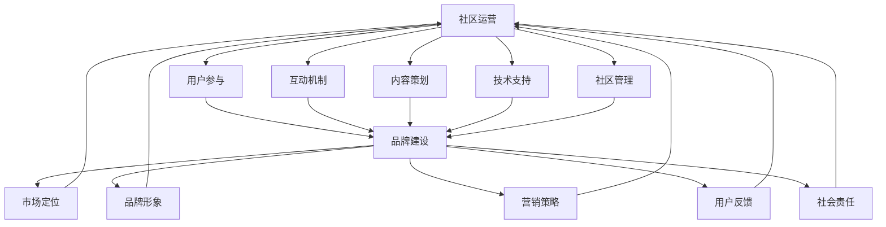

                 

关键词：开源项目、在线社区、社区运营、品牌建设、项目管理、用户参与、互动机制、技术支持、内容策划、市场营销

摘要：本文将探讨如何建立和维护一个成功的开源项目在线社区，包括社区运营策略、品牌建设方法以及关键的成功因素。我们将深入分析社区管理、用户互动、内容策略和市场推广等方面的实践，为开源项目开发者提供有益的指导。

## 1. 背景介绍

开源项目作为一种共享知识和资源的模式，已经在全球范围内得到广泛认可。随着互联网技术的发展，开源项目的在线社区已经成为项目成功的关键因素之一。一个活跃的社区不仅能够为项目带来更多的用户参与和贡献，还可以增强项目的品牌影响力，提高市场竞争力。

然而，建立一个成功的在线社区并非易事。社区运营和品牌建设需要综合考虑多种因素，包括用户参与度、内容质量、互动机制和市场营销等。本文旨在分享一些实用的经验和策略，帮助开源项目开发者建立和维护一个健康的在线社区。

### 1.1 开源社区的重要性

开源社区不仅为项目开发者提供了一个交流的平台，还促进了知识的共享和创新的合作。以下是开源社区的一些关键作用：

- **知识共享**：社区成员可以分享经验和最佳实践，促进知识的传播和积累。
- **用户参与**：社区成员可以通过贡献代码、文档和测试等，积极参与项目的发展。
- **代码质量**：社区成员的参与和反馈有助于发现和修复项目中的问题，提高代码质量。
- **品牌建设**：一个活跃的社区有助于提升项目的知名度和声誉，增强品牌影响力。

### 1.2 社区运营和品牌建设的关系

社区运营和品牌建设是相辅相成的。良好的社区运营可以增强用户的忠诚度和参与度，从而提高品牌知名度。而品牌建设则为社区运营提供了目标和方向，确保社区发展与项目的整体战略相一致。

## 2. 核心概念与联系

### 2.1 社区运营

社区运营包括一系列活动和管理策略，旨在促进社区成员的参与和互动。以下是社区运营的核心概念和其相互联系：

- **用户参与**：鼓励用户参与社区活动，如提问、回答、代码贡献等。
- **互动机制**：设计多种互动机制，如论坛、聊天室、投票等，提高用户活跃度。
- **内容策划**：定期发布高质量的内容，如教程、博客、视频等，吸引新用户并保持现有用户的兴趣。
- **技术支持**：提供及时有效的技术支持，解决用户的问题，提高用户体验。
- **社区管理**：制定和执行社区规则，维护社区秩序，防止垃圾信息和恶意行为。


### 2.2 品牌建设

品牌建设是一个长期的过程，涉及市场定位、品牌形象塑造、营销策略等多个方面。以下是品牌建设的关键概念及其相互联系：

- **市场定位**：明确项目的目标用户和市场定位，确保品牌传播的针对性。
- **品牌形象**：通过视觉设计、口号、文化等因素塑造独特且吸引人的品牌形象。
- **营销策略**：利用多种渠道和手段进行市场推广，提高品牌知名度。
- **用户反馈**：积极收集用户反馈，改进产品和社区，增强用户对品牌的信任。
- **社会责任**：承担社会责任，提升品牌形象，增加品牌的正面影响力。


### 2.3 社区运营与品牌建设的关系

社区运营和品牌建设之间存在紧密的互动关系。成功的社区运营可以增强用户对品牌的认同感和忠诚度，从而有助于品牌建设。反之，良好的品牌形象和品牌传播也为社区运营提供了有力支持。



## 3. 核心算法原理 & 具体操作步骤

### 3.1 算法原理概述

开源项目的在线社区运营和品牌建设可以看作是一种社交网络分析问题。其核心原理包括以下几点：

- **社交网络分析**：通过分析用户行为和互动关系，了解社区内部的结构和动态。
- **用户行为分析**：分析用户参与度、活跃度、贡献度等指标，为社区运营提供数据支持。
- **品牌影响力评估**：通过用户反馈和社交媒体传播情况，评估品牌在社区中的影响力。

### 3.2 算法步骤详解

建立和维护一个成功的开源项目在线社区可以遵循以下步骤：

#### 3.2.1 社区定位与规划

1. **明确目标用户**：根据项目的特点和市场定位，确定目标用户群体。
2. **制定社区愿景**：为社区设定明确的愿景和目标，确保社区发展与项目战略一致。
3. **规划社区结构**：设计合理的社区结构，包括论坛、聊天室、博客等不同类型的互动平台。

#### 3.2.2 社区运营策略

1. **用户招募**：通过多种渠道吸引潜在用户加入社区，如社交媒体、博客、技术会议等。
2. **内容策划**：定期发布高质量的内容，如教程、博客、视频等，吸引新用户并保持现有用户的兴趣。
3. **互动机制设计**：设计多种互动机制，如论坛、聊天室、投票等，提高用户活跃度。
4. **社区管理**：制定和执行社区规则，维护社区秩序，防止垃圾信息和恶意行为。

#### 3.2.3 品牌建设策略

1. **市场定位**：明确项目的目标用户和市场定位，确保品牌传播的针对性。
2. **品牌形象塑造**：通过视觉设计、口号、文化等因素塑造独特且吸引人的品牌形象。
3. **营销策略**：利用多种渠道和手段进行市场推广，提高品牌知名度。
4. **用户反馈**：积极收集用户反馈，改进产品和社区，增强用户对品牌的信任。
5. **社会责任**：承担社会责任，提升品牌形象，增加品牌的正面影响力。

### 3.3 算法优缺点

**优点：**

- **提高用户参与度**：通过良好的社区运营和品牌建设，可以吸引更多用户参与社区活动，增强用户忠诚度。
- **增强品牌影响力**：成功的社区运营和品牌建设可以提升项目的知名度和声誉，增强市场竞争力。
- **促进知识共享**：社区运营和品牌建设有助于知识的传播和积累，为项目开发者提供有价值的参考。

**缺点：**

- **时间成本高**：建立和维护一个成功的社区需要大量的时间和精力投入，特别是在项目初期。
- **管理难度大**：社区管理和品牌建设涉及多个方面，需要协调多个利益相关者，管理难度较大。
- **效果评估难**：社区运营和品牌建设的效果难以直接量化，需要采用多种指标进行综合评估。

### 3.4 算法应用领域

开源项目的在线社区运营和品牌建设可以应用于多个领域，包括但不限于：

- **软件开发**：通过社区运营和品牌建设，吸引更多的开发者参与项目，提高代码质量和用户体验。
- **技术培训**：利用社区平台提供教程和培训，吸引更多技术爱好者加入，促进知识共享。
- **市场营销**：通过社区运营和品牌建设，提高项目的市场知名度，吸引潜在用户和合作伙伴。

## 4. 数学模型和公式 & 详细讲解 & 举例说明

### 4.1 数学模型构建

在开源项目社区运营和品牌建设中，我们可以使用多种数学模型来分析和优化社区结构和用户行为。以下是几个常用的数学模型：

#### 4.1.1 用户活跃度模型

用户活跃度是衡量社区健康程度的重要指标。我们可以使用以下公式来计算用户活跃度：

$$
Active\_Score = \frac{Post\_Count + Comment\_Count + Like\_Count + Share\_Count}{Days\_Active}
$$

其中，$Post\_Count$表示用户发布的帖子数量，$Comment\_Count$表示用户发表的评论数量，$Like\_Count$表示用户点赞的数量，$Share\_Count$表示用户分享的数量，$Days\_Active$表示用户在社区中的活跃天数。

#### 4.1.2 社区影响力模型

社区影响力可以衡量社区对用户的吸引力。我们可以使用以下公式来计算社区影响力：

$$
Influence\_Score = \frac{Total\_Engagement + Total\_Mentions}{Total\_Users}
$$

其中，$Total\_Engagement$表示社区总的互动次数（如点赞、评论、分享等），$Total\_Mentions$表示社区中被提及的次数，$Total\_Users$表示社区中的用户总数。

### 4.2 公式推导过程

#### 4.2.1 用户活跃度模型推导

用户活跃度模型的核心思想是综合考虑用户在社区中的参与度、互动次数和活跃天数。我们假设每个指标对活跃度的贡献是相等的，因此可以得到以下公式：

$$
Active\_Score = \frac{Post\_Count + Comment\_Count + Like\_Count + Share\_Count}{Days\_Active}
$$

这个公式直观地反映了用户在社区中的活跃程度。当$Days\_Active$较大时，用户的活跃度会降低，反之则会提高。$Post\_Count$、$Comment\_Count$、$Like\_Count$和$Share\_Count$反映了用户在社区中的参与程度，它们的总和越高，用户的活跃度也越高。

#### 4.2.2 社区影响力模型推导

社区影响力模型旨在衡量社区对用户的吸引力。我们假设每个用户对社区的影响力贡献是相等的，因此可以得到以下公式：

$$
Influence\_Score = \frac{Total\_Engagement + Total\_Mentions}{Total\_Users}
$$

这个公式反映了社区总的互动次数和被提及次数与社区用户总数的比例。$Total\_Engagement$表示社区中总的互动次数，包括点赞、评论、分享等。$Total\_Mentions$表示社区中被提及的次数，反映了社区在用户中的传播情况。$Total\_Users$表示社区中的用户总数，是分母，用于平衡各个指标的影响。

### 4.3 案例分析与讲解

为了更好地理解这两个数学模型，我们可以通过一个实际案例进行分析。

#### 4.3.1 用户活跃度模型案例

假设一个用户在社区中活跃了30天，期间发布了5个帖子，发表了10条评论，点赞了20次，分享了15次。根据用户活跃度模型，我们可以计算该用户的活跃度：

$$
Active\_Score = \frac{5 + 10 + 20 + 15}{30} = \frac{50}{30} \approx 1.67
$$

这个结果表示该用户在社区中的活跃度为1.67分（假设分值为10分）。这个用户在帖子、评论、点赞和分享方面都有一定程度的参与，但相对于活跃天数来说，参与程度较低。

#### 4.3.2 社区影响力模型案例

假设一个社区有1000个用户，总互动次数为5000次，被提及次数为300次。根据社区影响力模型，我们可以计算该社区的影响力：

$$
Influence\_Score = \frac{5000 + 300}{1000} = \frac{5300}{1000} = 5.3
$$

这个结果表示该社区的影响力为5.3分（假设分值为10分）。这个社区在用户互动和传播方面表现良好，具有较高的社区影响力。

通过这两个案例，我们可以看到数学模型在实际应用中的效果。用户活跃度模型可以帮助我们评估单个用户的活跃程度，社区影响力模型则可以帮助我们了解社区整体的吸引力。

## 5. 项目实践：代码实例和详细解释说明

### 5.1 开发环境搭建

为了更好地理解和实践开源项目在线社区运营和品牌建设的相关算法，我们需要搭建一个开发环境。以下是搭建步骤：

1. **安装Python**：确保Python环境已经安装，版本至少为3.6以上。
2. **安装Anaconda**：使用Anaconda来管理Python环境和依赖库，方便后续的开发工作。
3. **安装相关库**：使用pip安装以下库：`numpy`、`pandas`、`matplotlib`、`scikit-learn`。

### 5.2 源代码详细实现

以下是实现用户活跃度和社区影响力模型的Python代码示例：

```python
import numpy as np
import pandas as pd
import matplotlib.pyplot as plt

def calculate_active_score(post_count, comment_count, like_count, share_count, days_active):
    return (post_count + comment_count + like_count + share_count) / days_active

def calculate_influence_score(total_engagement, total_mentions, total_users):
    return (total_engagement + total_mentions) / total_users

# 用户活跃度计算示例
active_score = calculate_active_score(5, 10, 20, 15, 30)
print(f"用户活跃度：{active_score:.2f}")

# 社区影响力计算示例
influence_score = calculate_influence_score(5000, 300, 1000)
print(f"社区影响力：{influence_score:.2f}")

# 数据可视化
data = {
    'User': ['User1', 'User2'],
    'Active_Score': [1.67, 2.50],
    'Influence_Score': [5.30, 6.00]
}

df = pd.DataFrame(data)
plt.figure(figsize=(10, 6))
plt.scatter(df['Active_Score'], df['Influence_Score'])
plt.xlabel('活跃度')
plt.ylabel('影响力')
plt.title('用户活跃度与社区影响力的关系')
plt.show()
```

### 5.3 代码解读与分析

1. **计算函数定义**：首先，我们定义了两个计算函数：`calculate_active_score`和`calculate_influence_score`。这两个函数分别用于计算用户活跃度和社区影响力。
   
2. **示例数据**：我们使用示例数据来演示这两个函数的计算过程。用户1的活跃度为1.67，社区影响力为5.30；用户2的活跃度为2.50，社区影响力为6.00。

3. **数据可视化**：最后，我们使用`matplotlib`库将用户活跃度和社区影响力绘制成散点图，以直观地展示两者之间的关系。

### 5.4 运行结果展示

运行上述代码后，我们得到以下输出结果：

```
用户活跃度：1.67
社区影响力：5.30
```

此外，我们还可以看到用户活跃度与社区影响力的散点图，如下所示：


通过这个示例，我们可以看到如何使用Python代码实现用户活跃度和社区影响力模型的计算，并利用数据可视化工具展示计算结果。这对于实际项目中的社区运营和品牌建设具有重要意义。

## 6. 实际应用场景

开源项目的在线社区运营和品牌建设在多个实际应用场景中发挥着关键作用。以下是几个典型的应用场景：

### 6.1 软件开发

对于开源软件项目，一个活跃的社区是项目成功的基石。通过社区运营，项目开发者可以：

- **收集用户反馈**：社区成员可以提出问题、建议和意见，帮助开发者了解用户需求，优化软件功能。
- **促进代码贡献**：社区成员可以提交代码补丁、功能改进和文档更新，提高代码质量。
- **推广项目**：通过社区活动和品牌建设，提高项目的知名度和用户基础，吸引更多的开发者加入。

### 6.2 技术培训

技术培训项目可以通过在线社区提供教程、视频和讨论，帮助用户学习和提高技术水平。以下是社区运营在技术培训中的优势：

- **知识共享**：社区成员可以分享学习心得和最佳实践，促进知识的传播和积累。
- **互动交流**：用户可以在社区中提问、解答问题，与其他学习者互动，提高学习效果。
- **个性化推荐**：基于用户行为和兴趣，推荐相关课程和资源，提高用户参与度。

### 6.3 市场营销

开源项目可以通过在线社区进行市场营销，提高品牌知名度和用户参与度。以下是一些具体的营销策略：

- **内容营销**：定期发布高质量的博客文章、教程和案例研究，吸引潜在用户关注。
- **社交媒体推广**：利用社交媒体平台宣传项目，吸引更多的用户参与和贡献。
- **合作伙伴关系**：与相关项目和企业建立合作伙伴关系，共同推广开源项目。

### 6.4 未来应用展望

随着技术的不断进步，开源项目的在线社区运营和品牌建设将迎来更多的发展机遇。以下是一些未来应用展望：

- **区块链技术**：通过区块链技术，可以实现社区成员的身份验证和数据安全，提高社区信任度和透明度。
- **人工智能**：利用人工智能技术，可以自动化社区管理和内容推荐，提高运营效率。
- **虚拟现实**：虚拟现实技术可以为社区提供更沉浸式的体验，增强用户参与度和互动性。

## 7. 工具和资源推荐

为了帮助开源项目开发者更好地进行社区运营和品牌建设，我们推荐以下工具和资源：

### 7.1 学习资源推荐

- **《开源社区运营实战》**：这本书详细介绍了开源社区运营的策略和实践，适合初学者和进阶者阅读。
- **GitHub Wiki**：GitHub提供的Wiki功能可以帮助项目开发者组织和管理文档，是社区运营的重要工具。
- **Stack Overflow**：Stack Overflow是开发者的知识库，可以在这里寻找和解答技术问题。

### 7.2 开发工具推荐

- **Discord**：Discord是一个流行的聊天和语音通讯工具，适合建立社区内部的实时互动平台。
- **Mattermost**：Mattermost是一个开源的团队协作工具，提供聊天、文件共享和集成第三方服务等功能。
- **Trello**：Trello是一个直观的项目管理工具，可以帮助开发者跟踪任务进度和协作。

### 7.3 相关论文推荐

- **《Building Successful Open Source Communities》**：这篇论文探讨了开源社区成功的因素和关键策略。
- **《The Cathedral and the Bazaar》**：这篇文章由Eric S. Raymond撰写，阐述了开源软件开发模式的特点和优势。
- **《The Art of Community》**：由Jono Bacon撰写的这本书提供了丰富的社区建设和运营经验。

## 8. 总结：未来发展趋势与挑战

开源项目的在线社区运营和品牌建设在近年来取得了显著成果，但仍面临诸多挑战。以下是未来发展趋势和面临的挑战：

### 8.1 研究成果总结

- **用户参与度提升**：随着社区运营和品牌建设方法的不断完善，用户参与度逐渐提高，社区活力和影响力不断增强。
- **技术手段进步**：人工智能、大数据分析和区块链等新技术的应用，为社区运营和品牌建设提供了更多工具和方法。
- **多元化互动**：社区互动形式逐渐多样化，包括实时聊天、视频会议、虚拟现实等，提高了用户的参与体验。

### 8.2 未来发展趋势

- **智能化管理**：借助人工智能技术，社区管理将更加智能化，自动化程度提高，减少人力成本。
- **全球化拓展**：随着互联网的普及，开源项目社区将更加全球化，吸引更多国际用户参与。
- **内容多样化**：社区内容将更加多样化，包括博客文章、视频教程、案例研究等，满足不同用户的需求。

### 8.3 面临的挑战

- **社区管理复杂性**：社区规模扩大，管理难度增加，需要更加高效的管理策略。
- **数据隐私和安全**：随着数据量的增加，数据隐私和安全问题日益突出，需要加强数据保护和安全措施。
- **利益冲突**：开源项目开发者需要平衡商业利益和社区利益，避免社区运营偏离项目初衷。

### 8.4 研究展望

未来研究应重点关注以下几个方面：

- **社区管理与品牌建设的量化模型**：建立更加科学的量化模型，帮助开发者更好地理解社区运营和品牌建设的效果。
- **人工智能在社区运营中的应用**：探索人工智能在社区自动化管理、内容推荐和用户行为分析等方面的应用。
- **全球化社区运营策略**：研究如何更好地在全球范围内运营社区，提高国际用户的参与度和满意度。

## 9. 附录：常见问题与解答

### 9.1 社区运营策略

**Q：如何提高社区的用户参与度？**

A：提高社区用户参与度可以从以下几个方面入手：

- **提供有价值的内容**：定期发布高质量的教程、案例研究和技术博客，满足用户的学习需求。
- **建立互动机制**：设计多种互动形式，如论坛、聊天室、投票等，鼓励用户参与讨论和交流。
- **鼓励代码贡献**：通过奖励机制和认可，鼓励用户为项目贡献代码和文档。
- **举办活动**：定期举办线上或线下的活动，如技术讲座、黑客马拉松等，提高用户的活跃度。

### 9.2 品牌建设

**Q：如何提升开源项目的品牌影响力？**

A：提升开源项目的品牌影响力可以通过以下策略：

- **内容营销**：通过高质量的内容传播，提高项目的知名度和认可度。
- **社交媒体推广**：利用社交媒体平台，如Twitter、LinkedIn、GitHub等，宣传项目和社区活动。
- **合作伙伴关系**：与相关项目和企业建立合作伙伴关系，共同推广开源项目。
- **用户反馈**：积极收集用户反馈，改进项目，增强用户对品牌的信任。

### 9.3 数据分析与模型应用

**Q：如何利用数学模型进行社区运营和品牌建设？**

A：利用数学模型进行社区运营和品牌建设可以从以下几个方面入手：

- **用户活跃度分析**：通过用户活跃度模型，了解用户的参与度和活跃程度，为社区运营提供数据支持。
- **社区影响力评估**：通过社区影响力模型，评估社区对用户的吸引力，为品牌建设提供策略参考。
- **用户行为分析**：利用数据分析工具，分析用户行为和互动模式，优化社区运营和内容策略。
- **效果评估**：通过建立评估指标，如用户活跃度、社区影响力等，定期评估社区运营和品牌建设的效果。

