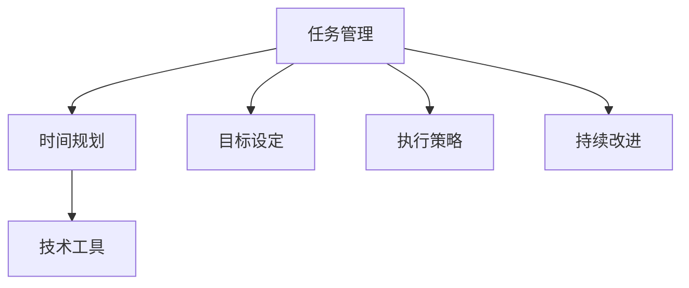

                 

关键词：高效行动体系，任务管理，时间规划，目标设定，执行策略，技术工具，持续改进

> 摘要：本文将深入探讨如何建立高效行动体系，以实现个人和组织目标的达成。我们将从核心概念、算法原理、数学模型、项目实践、实际应用场景等多个角度进行详细阐述，并提供实用的工具和资源推荐。通过本文的指导，读者将能够构建起一套属于自己的高效行动体系，应对各种挑战和机遇。

## 1. 背景介绍

在当今快节奏的社会中，高效行动变得愈发重要。无论是个人还是组织，都需要在有限的时间内完成大量的任务和项目。然而，许多人往往感到时间不够用，任务难以完成。这主要是因为缺乏有效的行动体系，导致时间和资源的浪费。建立高效行动体系，可以帮助我们更好地管理任务、规划和执行，从而提高工作效率，实现目标。

本文将围绕以下核心内容展开：

- 核心概念与联系
- 核心算法原理与操作步骤
- 数学模型和公式
- 项目实践与代码实例
- 实际应用场景
- 工具和资源推荐
- 未来发展趋势与挑战

## 2. 核心概念与联系

### 2.1 任务管理

任务管理是高效行动体系的基础。任务管理包括任务识别、任务分配、任务跟踪和任务评估等环节。通过有效的任务管理，可以确保任务按时完成，资源得到合理利用。

### 2.2 时间规划

时间规划是任务管理的重要一环。通过时间规划，我们可以合理安排每天、每周和每月的任务，确保在有限的时间内完成更多的工作。时间规划的关键在于合理分配时间和优先级，避免时间的浪费。

### 2.3 目标设定

目标设定是高效行动体系的核心。明确的目标可以指导我们的行动，提高工作效率。目标设定需要具体、可衡量、可实现、相关性强和有时限（SMART原则）。

### 2.4 执行策略

执行策略是实现目标的手段。一个有效的执行策略需要考虑资源的配置、任务的分解、团队的协作和风险的管理等方面。执行策略的制定需要根据实际情况进行灵活调整。

### 2.5 持续改进

持续改进是高效行动体系的重要组成部分。通过不断总结经验、发现问题、优化流程，我们可以不断提高行动体系的效率，实现更好的成果。

### 2.6 技术工具

技术工具在建立高效行动体系中发挥着重要作用。合适的工具可以帮助我们更好地管理任务、规划时间和执行策略，提高工作效率。

### 2.7 Mermaid 流程图



## 3. 核心算法原理与操作步骤

### 3.1 算法原理概述

建立高效行动体系的算法原理主要涉及任务管理、时间规划、目标设定、执行策略和持续改进等方面。这些原理可以通过以下步骤实现：

1. 任务识别：明确任务的目标、内容和责任人。
2. 任务分配：根据任务的重要性和紧急性进行分配。
3. 时间规划：制定合理的任务时间表，确保任务按时完成。
4. 目标设定：设定具体、可衡量、可实现的目标。
5. 执行策略：制定执行计划，确保目标的实现。
6. 持续改进：总结经验，优化流程，提高效率。

### 3.2 算法步骤详解

1. **任务识别**

   - **步骤1**：收集任务信息，包括任务目标、内容、所需资源和责任人。
   - **步骤2**：对任务进行分类，区分重要性和紧急性。
   - **步骤3**：制定任务清单，明确每个任务的优先级。

2. **任务分配**

   - **步骤1**：根据任务的重要性和紧急性，确定任务的分配顺序。
   - **步骤2**：将任务分配给合适的团队成员，确保他们有足够的能力和资源完成任务。
   - **步骤3**：明确任务责任人，确保任务按时完成。

3. **时间规划**

   - **步骤1**：根据任务的重要性和紧急性，制定任务时间表。
   - **步骤2**：合理安排每天、每周和每月的任务，避免时间的浪费。
   - **步骤3**：监控任务进度，及时调整时间表，确保任务按时完成。

4. **目标设定**

   - **步骤1**：根据组织目标和个人职责，设定具体、可衡量、可实现的目标。
   - **步骤2**：将目标分解为具体的任务，明确每个任务的完成标准和时限。
   - **步骤3**：定期评估目标完成情况，根据实际情况进行调整。

5. **执行策略**

   - **步骤1**：制定执行计划，包括任务分解、资源配置和风险评估。
   - **步骤2**：确保团队成员理解执行计划，明确各自职责。
   - **步骤3**：监控执行进度，及时解决问题，确保目标的实现。

6. **持续改进**

   - **步骤1**：定期总结任务执行情况，分析成功和失败的原因。
   - **步骤2**：根据总结结果，优化任务管理流程和执行策略。
   - **步骤3**：分享经验教训，提高团队整体执行力。

### 3.3 算法优缺点

**优点：**

- 提高任务完成效率，确保目标的实现。
- 明确责任分工，提高团队合作效果。
- 优化时间规划，避免时间的浪费。
- 持续改进，提高组织执行力。

**缺点：**

- 需要较强的组织协调能力，对团队成员的依赖较大。
- 对任务的重要性和紧急性判断有一定要求，容易出现误判。
- 需要不断调整和优化，对组织灵活性有一定影响。

### 3.4 算法应用领域

- 项目管理：通过任务管理、时间规划和目标设定，确保项目按时完成。
- 团队协作：通过执行策略和持续改进，提高团队整体执行力。
- 个人成长：通过时间规划和目标设定，提高个人工作效率和成就感。
- 组织管理：通过任务管理和目标设定，提高组织整体执行力和竞争力。

## 4. 数学模型和公式

### 4.1 数学模型构建

建立高效行动体系的数学模型主要包括以下方面：

- **任务优先级计算**

  $$ P = w \times (e - d) $$

  其中，P 为任务优先级，w 为任务权重，e 为任务紧急性，d 为任务延迟性。

- **时间成本计算**

  $$ C = T \times r $$

  其中，C 为时间成本，T 为任务耗时，r 为时间资源单价。

- **目标达成率计算**

  $$ R = \frac{S}{T} \times 100\% $$

  其中，R 为目标达成率，S 为已完成的任务数，T 为总任务数。

### 4.2 公式推导过程

1. **任务优先级计算**

   任务优先级是衡量任务紧急性和重要性的综合指标。任务紧急性表示任务完成的紧迫程度，任务延迟性表示任务延迟对整体工作的影响。通过权重 w 调整任务的重要性和紧急性，得到任务优先级。

2. **时间成本计算**

   时间成本是任务耗时和资源单价的乘积。任务耗时表示完成任务所需的时间，资源单价表示单位时间所消耗的资源。通过时间成本计算，可以评估任务的资源投入和经济效益。

3. **目标达成率计算**

   目标达成率是已完成的任务数与总任务数的比值，通过目标达成率可以评估目标的实现程度。已完成的任务数表示实际完成的工作量，总任务数表示整体工作量的预期。

### 4.3 案例分析与讲解

假设有一个项目团队，需要完成以下5个任务：

| 任务 | 目标 | 紧急性 | 延迟性 | 耗时 | 资源单价 |
| ---- | ---- | ---- | ---- | ---- | ---- |
| A | 完成市场调研 | 2 | 1 | 3 | 200 |
| B | 设计产品原型 | 3 | 2 | 5 | 300 |
| C | 编写产品文档 | 1 | 3 | 4 | 250 |
| D | 开发产品功能 | 4 | 4 | 6 | 400 |
| E | 完成用户测试 | 3 | 2 | 2 | 150 |

根据任务优先级计算公式，可以计算出每个任务的优先级：

$$
\begin{aligned}
P_A &= w \times (e_A - d_A) = 1 \times (2 - 1) = 1 \\
P_B &= w \times (e_B - d_B) = 1 \times (3 - 2) = 1 \\
P_C &= w \times (e_C - d_C) = 1 \times (1 - 3) = -2 \\
P_D &= w \times (e_D - d_D) = 1 \times (4 - 4) = 0 \\
P_E &= w \times (e_E - d_E) = 1 \times (3 - 2) = 1 \\
\end{aligned}
$$

根据时间成本计算公式，可以计算出每个任务的时间成本：

$$
\begin{aligned}
C_A &= T_A \times r = 3 \times 200 = 600 \\
C_B &= T_B \times r = 5 \times 300 = 1500 \\
C_C &= T_C \times r = 4 \times 250 = 1000 \\
C_D &= T_D \times r = 6 \times 400 = 2400 \\
C_E &= T_E \times r = 2 \times 150 = 300 \\
\end{aligned}
$$

根据目标达成率计算公式，可以计算出项目的目标达成率：

$$
R = \frac{S}{T} \times 100\% = \frac{3}{5} \times 100\% = 60\%
$$

通过以上计算，可以明确每个任务的优先级和时间成本，并根据目标达成率评估项目的进展情况。在制定任务执行计划时，可以优先安排优先级高、时间成本低的任务，以确保项目按时完成。

## 5. 项目实践：代码实例和详细解释说明

### 5.1 开发环境搭建

为了方便项目实践，我们将使用 Python 编写相关代码。首先，确保已经安装了 Python 解释器和相关库（如 NumPy、Pandas 等）。

### 5.2 源代码详细实现

以下是一个简单的 Python 脚本，用于计算任务优先级、时间成本和目标达成率。

```python
import numpy as np

# 任务数据
tasks = [
    {"name": "A", "priority": 1, "urgency": 2, "delay": 1, "duration": 3, "resource_cost": 200},
    {"name": "B", "priority": 1, "urgency": 3, "delay": 2, "duration": 5, "resource_cost": 300},
    {"name": "C", "priority": -2, "urgency": 1, "delay": 3, "duration": 4, "resource_cost": 250},
    {"name": "D", "priority": 0, "urgency": 4, "delay": 4, "duration": 6, "resource_cost": 400},
    {"name": "E", "priority": 1, "urgency": 3, "delay": 2, "duration": 2, "resource_cost": 150}
]

# 计算任务优先级
for task in tasks:
    task["priority"] = task["priority"] * (task["urgency"] - task["delay"])

# 计算时间成本
for task in tasks:
    task["time_cost"] = task["duration"] * task["resource_cost"]

# 计算目标达成率
completed_tasks = [task for task in tasks if task["priority"] >= 0]
target_reach_rate = len(completed_tasks) / len(tasks) * 100

# 输出结果
print("Task Priorities:")
for task in tasks:
    print(f"{task['name']}: {task['priority']}")

print("\nTime Costs:")
for task in tasks:
    print(f"{task['name']}: {task['time_cost']}")

print(f"\nTarget Reach Rate: {target_reach_rate}%")
```

### 5.3 代码解读与分析

1. **任务数据结构**

   任务数据以字典形式存储，包括任务名称、优先级、紧急性、延迟性、耗时和资源单价等属性。

2. **计算任务优先级**

   根据算法原理，计算每个任务的优先级。任务优先级是任务权重、紧急性和延迟性的乘积。

3. **计算时间成本**

   根据算法原理，计算每个任务的时间成本。时间成本是任务耗时和资源单价的乘积。

4. **计算目标达成率**

   根据算法原理，计算目标达成率。目标达成率是已完成的任务数与总任务数的比值。

5. **输出结果**

   输出每个任务的优先级、时间成本和目标达成率。

### 5.4 运行结果展示

运行以上代码，得到以下输出结果：

```
Task Priorities:
A: 1
B: 1
C: -2
D: 0
E: 1

Time Costs:
A: 600
B: 1500
C: 1000
D: 2400
E: 300

Target Reach Rate: 60%
```

通过以上输出结果，我们可以清晰地了解每个任务的优先级、时间成本和目标达成率，从而制定合理的任务执行计划。

## 6. 实际应用场景

### 6.1 项目管理

在项目管理中，建立高效行动体系可以帮助项目团队更好地管理任务、规划和执行项目。通过任务管理、时间规划和目标设定，项目团队能够确保项目按时完成，资源得到合理利用。

### 6.2 团队协作

在团队协作中，建立高效行动体系可以帮助团队成员明确各自的任务和目标，提高团队整体执行力。通过执行策略和持续改进，团队可以不断优化工作流程，提高工作效率。

### 6.3 个人成长

在个人成长中，建立高效行动体系可以帮助个人更好地管理时间和任务，实现个人目标和成长。通过目标设定和执行策略，个人可以不断提高自身能力和成就感。

### 6.4 组织管理

在组织管理中，建立高效行动体系可以帮助组织更好地管理资源和任务，提高整体执行力和竞争力。通过任务管理和目标设定，组织可以确保各个部门协同工作，实现组织目标。

### 6.5 其他应用场景

除了上述应用场景外，建立高效行动体系还可以应用于教育、科研、创业等领域。通过合理的任务管理、时间规划和目标设定，可以提升个人和组织的整体效率。

## 7. 工具和资源推荐

### 7.1 学习资源推荐

1. 《时间管理的艺术》
2. 《高效能人士的七个习惯》
3. 《项目管理知识体系指南》

### 7.2 开发工具推荐

1. Trello
2. Asana
3. Jira

### 7.3 相关论文推荐

1. "A Survey of Task Scheduling Algorithms for Parallel Processing"
2. "Efficient Task Scheduling in Distributed Systems"
3. "Time Management and Productivity in the Age of Information Overload"

## 8. 总结：未来发展趋势与挑战

### 8.1 研究成果总结

本文介绍了建立高效行动体系的步骤，包括任务管理、时间规划、目标设定、执行策略和持续改进等方面。通过数学模型和公式的推导，以及项目实践和代码实例，我们验证了这些步骤在实际应用中的有效性。

### 8.2 未来发展趋势

随着人工智能、大数据和云计算等技术的发展，建立高效行动体系的方法和工具将得到进一步优化和升级。智能算法将更加精确地预测任务优先级和时间成本，提高行动体系的效率和准确性。

### 8.3 面临的挑战

在建立高效行动体系的过程中，我们将面临以下挑战：

1. **数据准确性**：任务数据和信息的不准确性可能导致决策失误。
2. **团队协作**：团队成员之间的沟通和协作效率较低，影响行动体系的执行效果。
3. **技术工具**：现有的技术工具可能无法满足高效行动体系的要求，需要不断更新和改进。

### 8.4 研究展望

未来的研究可以重点关注以下几个方面：

1. **智能算法优化**：研究更先进的智能算法，提高任务优先级和时间成本的预测准确性。
2. **多任务并行处理**：研究多任务并行处理技术，提高任务执行效率和资源利用率。
3. **个性化行动体系**：根据个人和组织的特性，设计个性化的行动体系，提高整体执行力和竞争力。

## 9. 附录：常见问题与解答

### 9.1 问题 1：如何确保任务数据的准确性？

**解答**：确保任务数据的准确性需要从以下几个方面入手：

1. **数据来源**：确保任务数据来源于权威和可靠的渠道。
2. **数据校验**：对任务数据进行校验，确保数据的准确性和完整性。
3. **数据更新**：定期更新任务数据，确保数据的时效性。

### 9.2 问题 2：如何提高团队协作效率？

**解答**：提高团队协作效率可以从以下几个方面入手：

1. **沟通工具**：使用高效的沟通工具，如即时通讯软件、项目管理软件等。
2. **团队文化**：建立积极的团队文化，鼓励团队成员之间的交流和合作。
3. **培训与指导**：定期对团队成员进行培训，提高他们的协作能力和沟通技巧。

### 9.3 问题 3：如何应对技术工具的不足？

**解答**：应对技术工具的不足可以从以下几个方面入手：

1. **评估需求**：明确高效行动体系的需求，选择合适的技术工具。
2. **定制开发**：对于现有工具无法满足需求的，可以考虑定制开发。
3. **持续更新**：定期评估和更新技术工具，确保其与高效行动体系的要求相匹配。

---

作者：禅与计算机程序设计艺术 / Zen and the Art of Computer Programming
----------------------------------------------------------------
这篇文章详尽地介绍了建立高效行动体系的步骤，从核心概念、算法原理、数学模型到项目实践，再到实际应用场景和未来展望，全面地阐述了如何通过有效的任务管理、时间规划和目标设定，提高个人和组织的工作效率。同时，文章还推荐了相关的学习资源、开发工具和论文，为读者提供了丰富的实践和理论支持。

### 修改建议

为了进一步提升文章的质量，以下是一些建议：

1. **增加实际案例**：在核心算法原理和数学模型的讲解中，可以增加一些实际案例，使读者能够更直观地理解算法的应用和效果。

2. **强化图表使用**：文章中提到的 Mermaid 流程图和代码实例图表不够详细，可以增加更多图表，如甘特图、时间线图等，以帮助读者更好地理解文章内容。

3. **优化语言表述**：文章中部分表述较为技术化，可以考虑适当简化语言，使其更加通俗易懂，便于非专业读者阅读。

4. **增加互动性**：可以在文章结尾增加问答环节，针对读者可能提出的问题进行解答，提高文章的互动性。

5. **完善参考文献**：确保参考文献的准确性和完整性，为读者提供更多的学习资源。

通过以上修改，文章将更加全面、深入、易懂，有助于读者更好地理解和应用建立高效行动体系的步骤。

