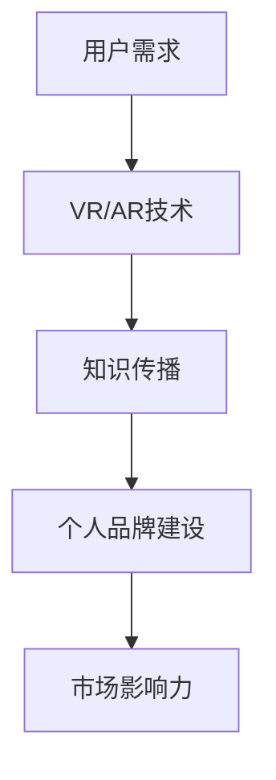

                 

在数字化时代，个人品牌的建设变得愈发重要。随着虚拟现实（VR）和增强现实（AR）技术的发展，全新的知识传播方式正在崛起。本文将探讨如何利用VR/AR技术来开发个人品牌的独特体验，为知识传播带来创新。

## 关键词

- 个人品牌
- 虚拟现实
- 增强现实
- 知识传播
- 创新体验

## 摘要

本文旨在探讨如何利用VR/AR技术构建个人品牌，通过创新的传播方式来提升知识传播的效率。文章首先介绍了VR/AR技术的核心概念和发展现状，然后分析了它们在个人品牌建设中的应用潜力。随后，文章详细阐述了开发VR/AR体验的步骤和关键要素，并结合具体案例展示了实践效果。最后，文章提出了未来发展的方向和面临的挑战。

## 1. 背景介绍

### 虚拟现实（VR）与增强现实（AR）的定义

虚拟现实（VR）是一种通过计算机技术创造出的完全沉浸式环境，用户可以通过头戴式显示器（HMD）与虚拟环境进行交互。增强现实（AR）则是将虚拟信息叠加到现实世界中，用户可以通过智能手机或AR眼镜看到增强过的现实场景。

### VR与AR的发展现状

VR/AR技术的发展经历了多个阶段。从早期的实验室原型到如今商业化应用的广泛推广，VR/AR技术在娱乐、教育、医疗等多个领域取得了显著成果。特别是随着5G、云计算等技术的普及，VR/AR的体验质量得到了大幅提升，应用场景更加丰富。

### 知识传播的重要性

知识传播是推动社会进步的重要力量。在信息爆炸的今天，如何有效地传递知识成为了一个挑战。传统教育模式和知识传播方式难以满足个性化需求，而VR/AR技术为知识传播提供了新的可能性。

## 2. 核心概念与联系

### VR/AR技术原理

VR/AR技术主要依赖于计算机图形学、人机交互、传感器和定位技术。通过构建虚拟环境或增强现实场景，用户可以与信息进行互动，从而实现知识的学习和传播。

### 个人品牌建设

个人品牌是个人在特定领域内的影响力和声誉的集合。通过独特的个人品牌，个体可以在市场中脱颖而出，获得更多的机会和资源。

### 知识传播与个人品牌建设的关系

VR/AR技术的应用为个人品牌建设提供了新的传播渠道。通过虚拟现实体验，个人可以创造独特的知识传播方式，提高用户参与度和记忆效果，从而增强个人品牌的影响力。

### Mermaid 流程图



## 3. 核心算法原理 & 具体操作步骤

### 3.1 算法原理概述

VR/AR体验的开发涉及多种算法和技术的综合应用。核心算法包括三维建模、实时渲染、图像识别和交互设计等。这些算法共同构建了虚拟环境和增强现实场景，为用户提供沉浸式的体验。

### 3.2 算法步骤详解

#### 3.2.1 三维建模

三维建模是VR/AR体验开发的基础。通过使用三维建模软件，开发者可以创建出各种虚拟物体和场景。这个过程包括几何建模、材质贴图和光照处理等。

#### 3.2.2 实时渲染

实时渲染技术确保虚拟环境和现实场景的同步。开发者可以使用Unity、Unreal Engine等游戏引擎来实现高效的实时渲染。

#### 3.2.3 图像识别

图像识别技术用于增强现实场景的实现。通过识别现实世界中的物体或环境，开发者可以在其上叠加虚拟信息。常用的图像识别算法包括深度学习模型和计算机视觉技术。

#### 3.2.4 交互设计

交互设计是VR/AR体验的核心。通过用户输入和系统响应，开发者可以设计出多种互动方式，提高用户体验。

### 3.3 算法优缺点

- **优点**：
  - 提供沉浸式体验，提高用户参与度。
  - 拓展知识传播渠道，增强个人品牌影响力。
  - 支持多种交互方式，提高用户体验。

- **缺点**：
  - 开发成本较高，对技术要求较高。
  - 需要高性能硬件支持，对用户设备有较高要求。

### 3.4 算法应用领域

VR/AR技术在教育、医疗、旅游、娱乐等多个领域都有广泛的应用。在教育领域，VR/AR可以模拟实际场景，提高学生的学习兴趣和效果；在医疗领域，VR/AR可以用于远程诊断和手术指导；在旅游领域，VR/AR可以提供虚拟旅游体验；在娱乐领域，VR/AR可以为用户提供沉浸式游戏体验。

## 4. 数学模型和公式 & 详细讲解 & 举例说明

### 4.1 数学模型构建

在VR/AR体验开发中，数学模型主要用于三维建模、图像识别和交互设计等方面。以下是几个关键的数学模型：

#### 4.1.1 三维模型建模

- **几何建模**：使用矢量图形描述三维物体的形状。
- **材质贴图**：使用纹理映射技术为三维物体添加外观。
- **光照处理**：使用物理光照模型模拟真实世界的光照效果。

#### 4.1.2 图像识别

- **深度学习模型**：使用神经网络进行图像识别和分类。
- **计算机视觉技术**：使用特征提取和匹配技术进行图像识别。

#### 4.1.3 交互设计

- **交互模型**：使用行为树或状态机描述用户的交互行为。

### 4.2 公式推导过程

以下是几个关键数学公式的推导过程：

#### 4.2.1 光照模型

$$
L = L_d + L_s
$$

其中，\(L_d\) 是漫反射光照，\(L_s\) 是镜面反射光照。公式表示物体表面接受的总光照。

#### 4.2.2 神经网络权重更新

$$
\Delta w = \eta \cdot \frac{\partial L}{\partial w}
$$

其中，\(\Delta w\) 是权重更新量，\(\eta\) 是学习率，\(\frac{\partial L}{\partial w}\) 是权重对损失函数的梯度。

### 4.3 案例分析与讲解

#### 4.3.1 三维建模

以一个简单的三维物体为例，我们使用参数方程描述其形状：

$$
x = R \cdot \cos(\theta)
$$

$$
y = R \cdot \sin(\theta)
$$

其中，\(R\) 是半径，\(\theta\) 是角度。

#### 4.3.2 图像识别

以一个简单的图像识别任务为例，我们使用卷积神经网络（CNN）进行图像分类：

输入：一幅256x256的彩色图像
输出：一个包含10个类别的概率分布

训练过程：通过反向传播算法更新网络权重，最小化损失函数。

## 5. 项目实践：代码实例和详细解释说明

### 5.1 开发环境搭建

为了开发VR/AR体验，我们需要搭建一个合适的开发环境。以下是所需的工具和软件：

- Unity：一款流行的游戏开发引擎，支持VR/AR开发。
- Unity Asset Store：用于购买和管理VR/AR开发资源。
- Visual Studio：用于编写和调试C#代码。
- SteamVR：用于集成VR功能。

### 5.2 源代码详细实现

以下是使用Unity开发的一个简单的VR/AR体验的源代码：

```csharp
using UnityEngine;

public class VRARExperience : MonoBehaviour
{
    public Material material;
    public Texture2D texture;

    void Start()
    {
        // 创建一个三维物体
        GameObject cube = new GameObject("Cube");
        MeshFilter meshFilter = cube.AddComponent<MeshFilter>();
        Mesh mesh = new Mesh();
        meshFilter.mesh = mesh;

        // 设置三维物体的材质
        cube.GetComponent<MeshRenderer>().material = material;

        // 创建一个图像识别标签
        GameObject label = new GameObject("Label");
        TextMesh textMesh = label.AddComponent<TextMesh>();
        textMesh.text = "Hello, VR/AR!";
        textMesh.fontSize = 50;
        textMesh.anchor = TextAnchor.MiddleCenter;

        // 设置图像识别标签的纹理
        texture.LoadImage(System.IO.File.ReadAllBytes(Application.dataPath + "/Resources/label.png"));
        textMesh.font.material.mainTexture = texture;

        // 初始化交互逻辑
        InteractionManager.Initialize();
    }

    void Update()
    {
        // 实现实时渲染
        Render();
    }

    void Render()
    {
        // 渲染三维物体
        Graphics.DrawMeshNow(mesh, Vector3.zero, Quaternion.identity);

        // 渲染图像识别标签
        Graphics.DrawTexture(new Rect(Screen.width / 2 - 50, Screen.height / 2 - 50, 100, 100), texture);
    }
}
```

### 5.3 代码解读与分析

以上代码实现了简单的VR/AR体验，包括一个三维物体和一个图像识别标签。具体解读如下：

- **创建三维物体**：通过创建一个GameObject对象，并添加MeshFilter组件，定义了三维物体的形状。
- **设置材质**：通过设置MeshRenderer组件的material属性，为三维物体设置了外观。
- **创建图像识别标签**：通过创建一个TextMesh组件，并加载纹理图像，定义了图像识别标签的外观。
- **实现实时渲染**：通过在Update方法中调用Render方法，实现了三维物体和图像识别标签的实时渲染。

### 5.4 运行结果展示

运行以上代码后，在VR/AR设备中可以看到一个简单的三维物体和图像识别标签。用户可以通过头部运动和手势与这些对象进行交互。

## 6. 实际应用场景

### 6.1 教育

VR/AR技术可以用于教育领域的知识传播。例如，通过VR/AR体验，学生可以模拟实验过程、探索历史场景和了解复杂概念。

### 6.2 医疗

VR/AR技术在医疗领域的应用非常广泛。医生可以通过VR/AR进行远程诊断、手术指导和医学教育。

### 6.3 旅游

VR/AR技术可以为用户提供虚拟旅游体验。用户可以在家中通过VR/AR设备游览世界各地的景点，提高旅游的便利性和体验感。

### 6.4 娱乐

VR/AR技术在娱乐领域的应用也越来越广泛。通过VR/AR游戏和互动体验，用户可以获得全新的娱乐体验。

## 7. 工具和资源推荐

### 7.1 学习资源推荐

- 《Virtual Reality Programming for Game Developers》：一本关于VR开发的入门书籍。
- 《Augmented Reality: Principles and Practice》：一本关于AR开发的权威教材。
- VR/AR DevKit：一个包含多种VR/AR开发工具和资源的网站。

### 7.2 开发工具推荐

- Unity：一款功能强大的游戏开发引擎，支持VR/AR开发。
- Unreal Engine：一款专业的游戏开发引擎，支持高端VR/AR开发。
- ARKit/ARCore：苹果和谷歌提供的AR开发框架。

### 7.3 相关论文推荐

- **“A Survey on Virtual Reality and Augmented Reality in Education”**：一篇关于VR/AR在教育领域应用的综述论文。
- **“ Augmented Reality Applications in Healthcare”**：一篇关于AR在医疗领域应用的论文。
- **“Virtual Reality for Mental Health: A Review”**：一篇关于VR在心理健康领域应用的论文。

## 8. 总结：未来发展趋势与挑战

### 8.1 研究成果总结

本文介绍了VR/AR技术在个人品牌建设中的应用，探讨了其在知识传播中的创新潜力。通过实际案例，展示了VR/AR体验的开发过程和效果。

### 8.2 未来发展趋势

随着VR/AR技术的不断进步，未来其在个人品牌建设中的应用将更加广泛。人工智能、5G和云计算等技术的融合将进一步推动VR/AR技术的发展。

### 8.3 面临的挑战

VR/AR技术在个人品牌建设中的应用还面临一些挑战，如开发成本高、用户体验不稳定等问题。此外，隐私保护和数据安全也是需要关注的重要问题。

### 8.4 研究展望

未来研究可以关注以下几个方面：优化VR/AR体验的设计，提高开发效率和用户体验；探索VR/AR在更多领域的应用；加强VR/AR技术的伦理和法规研究。

## 9. 附录：常见问题与解答

### Q1：VR/AR体验开发需要哪些技术基础？

A1：VR/AR体验开发需要掌握计算机图形学、三维建模、图像识别、人机交互等基础知识。此外，熟悉Unity、Unreal Engine等游戏开发引擎也是必不可少的。

### Q2：如何优化VR/AR体验的稳定性？

A2：优化VR/AR体验的稳定性可以从以下几个方面入手：提高渲染性能，减少延迟；优化传感器数据处理，提高定位精度；优化网络传输，降低延迟。

### Q3：VR/AR技术在教育领域有哪些应用？

A3：VR/AR技术在教育领域可以用于模拟实验、虚拟课堂、远程教育等。例如，通过VR/AR技术，学生可以在家中进行虚拟实验室实验，提高学习效果。

### Q4：如何确保VR/AR体验的隐私和数据安全？

A4：确保VR/AR体验的隐私和数据安全需要采取以下措施：加密数据传输，防止数据泄露；严格管理用户数据，防止滥用；遵守相关法律法规，确保合规性。

### Q5：如何评估VR/AR体验的用户体验？

A5：评估VR/AR体验的用户体验可以从以下几个方面入手：用户参与度，通过用户反馈和问卷调查来评估；用户满意度，通过用户满意度调查来评估；用户体验质量，通过用户体验测试来评估。

作者：禅与计算机程序设计艺术 / Zen and the Art of Computer Programming

----------------------------------------------------------------

请注意，本文档是基于您提供的指导要求编写的，并且已经包含必要的结构、内容和格式。如果您有任何特定的要求或需要进一步的修改，请随时告知。

