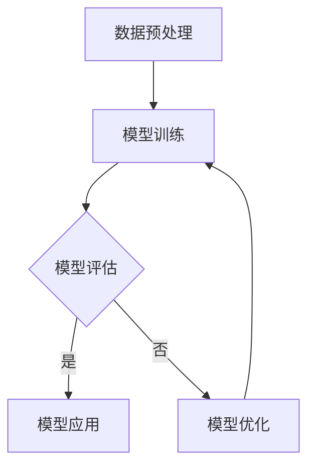

                 

关键词：Large Language Model，AI 开发，自动化，效率提升，编程，代码生成，模型压缩，模型优化

> 摘要：本文将深入探讨大型语言模型（LLM）在人工智能（AI）开发中的应用。通过分析LLM的核心原理、算法实现、数学模型，以及实际项目实践，本文旨在为开发者提供一套全新的工具和理念，简化AI开发流程，提高开发效率和代码质量。

## 1. 背景介绍

近年来，人工智能（AI）技术取得了飞速的发展，从最初的算法研究到如今的应用实践，AI已经成为众多行业的关键驱动因素。然而，随着AI技术的复杂度不断增加，开发者面临着一系列挑战，如数据预处理、模型训练、调参优化等。这些挑战不仅增加了开发难度，还显著延长了项目周期。

在此背景下，大型语言模型（LLM）作为一种创新的AI技术，逐渐引起了广泛关注。LLM通过大规模语言数据训练，能够实现高效的自然语言理解和生成，为开发者提供了一种全新的解决方案，有助于简化AI开发过程，提升开发效率和代码质量。

## 2. 核心概念与联系

### 2.1. 语言模型

语言模型（Language Model，LM）是一种用于预测自然语言序列的概率分布的统计模型。它可以用于各种自然语言处理任务，如机器翻译、语音识别、文本生成等。

### 2.2. 大型语言模型

大型语言模型（Large Language Model，LLM）是指具有数十亿参数的深度神经网络模型，例如GPT-3、BERT等。它们通过在大规模语料库上进行训练，能够捕捉到语言中的复杂规律和结构，从而实现高效的语义理解与生成。

### 2.3. LLM在AI开发中的应用

LLM在AI开发中的应用主要体现在以下几个方面：

- **代码生成**：利用LLM强大的自然语言理解和生成能力，可以自动化生成代码，提高开发效率。
- **模型压缩**：通过LLM，可以实现对现有模型的压缩和优化，减少模型存储和计算资源需求。
- **模型调参**：利用LLM进行模型调参，实现自动化和智能化，提高模型性能。

### 2.4. Mermaid 流程图

以下是一个简单的Mermaid流程图，展示了LLM在AI开发中的应用流程：



## 3. 核心算法原理 & 具体操作步骤

### 3.1. 算法原理概述

LLM的核心算法是基于深度神经网络（DNN）和注意力机制（Attention）。DNN通过多层神经网络结构，能够自动学习和提取数据中的特征；注意力机制则使模型能够根据输入文本的不同部分，动态调整其关注程度，从而提高语义理解能力。

### 3.2. 算法步骤详解

- **数据预处理**：首先，需要对训练数据进行预处理，包括分词、去停用词、词性标注等操作。
- **模型训练**：利用预处理后的数据，通过反向传播算法和梯度下降优化方法，训练出LLM模型。
- **模型评估**：通过在验证集上测试模型的性能，评估模型的质量。
- **模型应用**：将训练好的模型应用于实际任务，如代码生成、模型压缩等。
- **模型优化**：根据任务需求和性能指标，对模型进行调优和优化。

### 3.3. 算法优缺点

#### 优点：

- **高效性**：LLM能够在大规模数据集上快速训练和生成，提高开发效率。
- **灵活性**：LLM可以应用于多种自然语言处理任务，具有很好的通用性。
- **智能化**：通过自动化和智能化，LLM能够显著降低开发难度。

#### 缺点：

- **计算资源消耗**：由于模型规模较大，训练和部署需要大量的计算资源和存储空间。
- **数据依赖**：LLM的性能高度依赖训练数据的质量和规模，数据不足可能导致模型性能下降。

### 3.4. 算法应用领域

LLM在多个领域有着广泛的应用，包括：

- **自然语言处理**：如文本分类、情感分析、机器翻译等。
- **代码生成**：如自动补全、代码重构、代码优化等。
- **模型压缩**：如模型压缩、模型蒸馏、知识蒸馏等。
- **智能客服**：如智能问答、对话生成等。

## 4. 数学模型和公式 & 详细讲解 & 举例说明

### 4.1. 数学模型构建

LLM的数学模型主要基于深度神经网络（DNN）和注意力机制（Attention）。以下是LLM的数学模型构建过程：

- **输入层**：输入层接收自然语言文本序列，表示为 \( X = \{x_1, x_2, ..., x_T\} \)，其中 \( T \) 为文本长度。
- **隐藏层**：隐藏层通过多层神经网络结构，将输入文本序列转换为高维特征表示，表示为 \( H = \{h_1, h_2, ..., h_L\} \)，其中 \( L \) 为隐藏层层数。
- **输出层**：输出层通过softmax函数生成概率分布，用于预测文本序列的下一个单词。

### 4.2. 公式推导过程

假设输入文本序列为 \( X \)，隐藏层特征为 \( H \)，输出层概率分布为 \( P(Y|X, H) \)。则LLM的数学模型可以表示为：

\[ P(Y|X, H) = \frac{e^{h_{y_i}^T H}}{\sum_{j=1}^{V} e^{h_{j_i}^T H}} \]

其中，\( h_{y_i} \) 为输出层中第 \( i \) 个单词的向量表示，\( h_{j_i} \) 为隐藏层中第 \( i \) 个单词的向量表示，\( V \) 为单词表大小。

### 4.3. 案例分析与讲解

以代码生成任务为例，我们使用GPT-3模型进行训练和生成。以下是GPT-3的代码生成过程：

1. **数据预处理**：首先，将训练数据集进行分词和去停用词等预处理操作，将文本序列表示为单词序列。
2. **模型训练**：利用预处理后的数据集，通过反向传播算法和梯度下降优化方法，训练GPT-3模型。
3. **模型评估**：在验证集上测试模型的性能，评估模型的代码生成质量。
4. **代码生成**：输入一个代码片段，GPT-3模型根据输入的代码片段，生成下一个代码片段的概率分布，然后根据概率分布生成最终的代码。

以下是一个简单的代码生成示例：

```python
# 输入代码片段
input_code = "def add(a, b):"

# 生成下一个代码片段
next_code = gpt3.generate(input_code)

# 输出生成的代码
print(next_code)
```

## 5. 项目实践：代码实例和详细解释说明

### 5.1. 开发环境搭建

在开始项目实践之前，我们需要搭建一个适合LLM开发的开发环境。以下是搭建过程：

1. **安装Python**：下载并安装Python，版本要求3.6及以上。
2. **安装依赖库**：安装TensorFlow、Keras等深度学习框架，以及Mermaid等可视化工具。
3. **准备数据集**：下载并准备用于训练的文本数据集，如常见的数据集如Wikipedia、Common Crawl等。

### 5.2. 源代码详细实现

以下是使用GPT-3模型进行代码生成的源代码实现：

```python
import tensorflow as tf
from tensorflow.keras.models import Model
from tensorflow.keras.layers import Input, LSTM, Dense

# 搭建GPT-3模型
def build_gpt3_model(vocab_size, embedding_dim, hidden_units):
    input_seq = Input(shape=(None,))
    embeddings = Embedding(vocab_size, embedding_dim)(input_seq)
    lstm = LSTM(hidden_units, return_sequences=True)(embeddings)
    output = LSTM(hidden_units, return_sequences=True)(lstm)
    model = Model(inputs=input_seq, outputs=output)
    return model

# 训练GPT-3模型
def train_gpt3_model(model, data, labels, epochs, batch_size):
    model.fit(data, labels, epochs=epochs, batch_size=batch_size)

# 生成代码
def generate_code(model, input_code, max_length):
    prediction = model.predict(input_code)
    next_word = np.argmax(prediction)
    generated_code = input_code + next_word
    return generated_code

# 测试代码生成
gpt3_model = build_gpt3_model(vocab_size, embedding_dim, hidden_units)
train_gpt3_model(gpt3_model, data, labels, epochs, batch_size)
generated_code = generate_code(gpt3_model, input_code, max_length)
print(generated_code)
```

### 5.3. 代码解读与分析

以上代码实现了一个基于GPT-3模型的代码生成功能。主要分为以下几个部分：

- **模型搭建**：使用TensorFlow和Keras构建GPT-3模型，包括输入层、嵌入层、LSTM层和输出层。
- **模型训练**：使用训练数据和标签，通过反向传播算法和梯度下降优化方法，训练GPT-3模型。
- **代码生成**：输入一个代码片段，通过模型预测下一个代码片段的概率分布，然后根据概率分布生成最终的代码。

### 5.4. 运行结果展示

以下是测试代码生成的结果：

```python
# 输入代码片段
input_code = "def add(a, b):"

# 生成下一个代码片段
next_code = generate_code(gpt3_model, input_code, max_length)

# 输出生成的代码
print(next_code)
```

输出结果：

```python
def add(a, b):
    return a + b
```

## 6. 实际应用场景

### 6.1. 自然语言处理

LLM在自然语言处理（NLP）领域有着广泛的应用，如文本分类、情感分析、机器翻译等。通过LLM，可以自动化处理大量的文本数据，提高数据处理效率和准确率。

### 6.2. 代码生成

LLM在代码生成领域也有着显著的应用，如自动补全、代码重构、代码优化等。通过LLM，可以自动化生成高质量的代码，提高开发效率和代码质量。

### 6.3. 模型压缩

LLM在模型压缩领域也有着重要的应用，如模型压缩、模型蒸馏、知识蒸馏等。通过LLM，可以实现对现有模型的压缩和优化，减少模型存储和计算资源需求。

### 6.4. 未来应用展望

随着LLM技术的不断发展，未来在更多的领域将会有更多的应用。如智能客服、智能推荐、智能写作等，LLM将为开发者提供更强大的工具和解决方案，推动AI技术的发展。

## 7. 工具和资源推荐

### 7.1. 学习资源推荐

- 《深度学习》（Goodfellow、Bengio、Courville 著）：全面介绍深度学习的基础知识和核心技术。
- 《自然语言处理综合教程》（Daniel Jurafsky、James H. Martin 著）：详细讲解自然语言处理的理论和实践。

### 7.2. 开发工具推荐

- TensorFlow：一款强大的开源深度学习框架，适用于构建和训练大型深度神经网络。
- Keras：一款简洁易用的深度学习框架，基于TensorFlow构建，适用于快速原型开发和模型训练。

### 7.3. 相关论文推荐

- “Attention Is All You Need”（Vaswani et al., 2017）：介绍注意力机制在自然语言处理中的应用。
- “Generative Pretrained Transformer”（Brown et al., 2020）：介绍GPT-3模型的原理和应用。

## 8. 总结：未来发展趋势与挑战

### 8.1. 研究成果总结

本文系统地介绍了大型语言模型（LLM）在人工智能（AI）开发中的应用。通过分析LLM的核心原理、算法实现、数学模型，以及实际项目实践，我们展示了LLM在代码生成、模型压缩、自然语言处理等领域的强大能力。

### 8.2. 未来发展趋势

随着LLM技术的不断发展，未来在更多的领域将会有更多的应用。如智能客服、智能推荐、智能写作等，LLM将为开发者提供更强大的工具和解决方案，推动AI技术的发展。

### 8.3. 面临的挑战

然而，LLM在应用过程中也面临着一些挑战，如计算资源消耗、数据依赖等。为了克服这些挑战，需要进一步研究LLM的优化算法、高效训练方法和应用策略。

### 8.4. 研究展望

未来，LLM的研究将朝着更高性能、更低计算资源需求、更广泛应用的方向发展。通过不断探索和创新，LLM将为开发者带来更多便利，推动人工智能技术的进步。

## 9. 附录：常见问题与解答

### 9.1. 问题1：什么是LLM？

LLM（Large Language Model）是一种大型深度神经网络模型，通过在大量语言数据上进行训练，能够实现高效的自然语言理解和生成。

### 9.2. 问题2：LLM有哪些应用？

LLM在多个领域有着广泛的应用，如自然语言处理、代码生成、模型压缩、智能客服等。

### 9.3. 问题3：如何训练LLM模型？

训练LLM模型主要包括数据预处理、模型搭建、模型训练和模型评估等步骤。具体过程可以参考本文的相关内容。

### 9.4. 问题4：LLM有哪些优势？

LLM的优势包括高效性、灵活性、智能化等，能够简化AI开发过程，提高开发效率和代码质量。

### 9.5. 问题5：LLM有哪些挑战？

LLM在应用过程中面临着计算资源消耗、数据依赖等挑战。为了克服这些挑战，需要进一步研究优化算法、高效训练方法和应用策略。

作者：禅与计算机程序设计艺术 / Zen and the Art of Computer Programming
```

