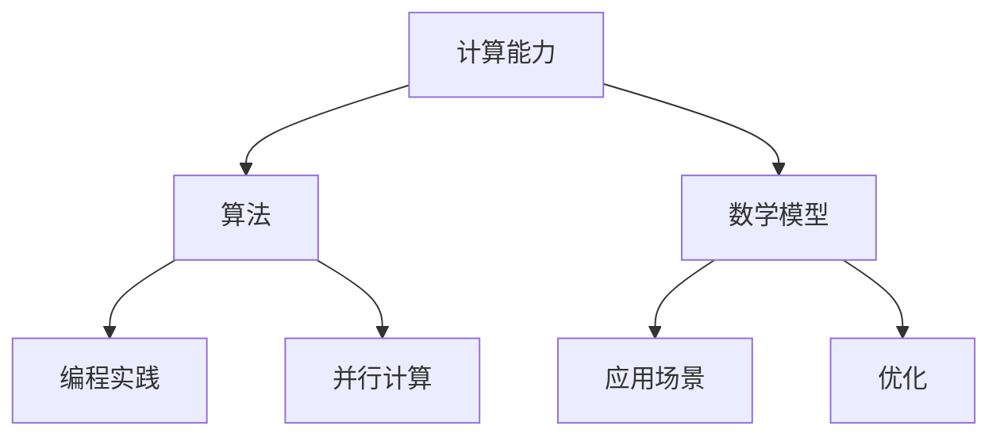

                 

关键词：人工智能，计算能力，算法，数学模型，编程实践，未来趋势

> 摘要：本文旨在探讨人类计算能力的现状、未来发展趋势以及面临的挑战。通过介绍核心算法原理、数学模型构建、项目实践，分析实际应用场景，总结未来发展方向，以期为读者开启无限可能的新征程提供思考和借鉴。

## 1. 背景介绍

随着信息技术的飞速发展，计算机的计算能力不断提升，已经远远超过了早期计算机的想象。从早期的冯·诺伊曼架构到现代的并行计算，从简单的逻辑运算到复杂的机器学习算法，计算机科学不断推陈出新，为人类的生活和工作带来了巨大的变革。然而，尽管计算机的计算能力有了质的飞跃，人类对于计算的理解和应用仍然面临着巨大的挑战。

本文将围绕以下几个方面展开讨论：首先，介绍当前计算机计算能力的现状；其次，探讨核心算法原理及其应用；然后，分析数学模型在计算中的应用；接着，通过项目实践展示编程实现；最后，探讨未来计算技术的发展趋势和面临的挑战。

## 2. 核心概念与联系

为了更好地理解人类计算的新征程，我们首先需要了解一些核心概念，包括计算能力、算法、数学模型等。下面是一个简化的 Mermaid 流程图，展示了这些概念之间的联系：



### 2.1 计算能力

计算能力是指计算机在单位时间内处理数据的能力，通常用每秒处理的指令数（IPS）或每秒处理的数据量（TB/s）来衡量。计算能力决定了计算机在处理复杂任务时的效率。

### 2.2 算法

算法是解决问题的步骤和规则。在计算机科学中，算法是计算机程序的基础。不同类型的算法适用于不同的计算任务，如排序算法、搜索算法、机器学习算法等。

### 2.3 数学模型

数学模型是用数学语言描述现实世界问题的抽象模型。数学模型可以用于预测、分析和优化计算机程序的性能。

### 2.4 编程实践

编程实践是将算法和数学模型转化为计算机程序的过程。编程实践涉及编程语言的选择、编程风格、代码优化等多个方面。

### 2.5 应用场景

应用场景是指算法和数学模型在实际问题中的应用。不同的应用场景决定了计算任务的具体要求，从而影响算法和数学模型的选择。

### 2.6 并行计算

并行计算是一种利用多处理器或多个计算节点同时处理多个任务的技术。并行计算可以显著提高计算速度，适用于处理大数据和复杂计算任务。

### 2.7 优化

优化是指通过改进算法和数学模型，提高计算效率的过程。优化可以采用多种方法，如算法改进、数据结构优化、并行计算等。

## 3. 核心算法原理 & 具体操作步骤

### 3.1 算法原理概述

在计算机科学中，核心算法包括排序算法、搜索算法、机器学习算法等。每种算法都有其独特的原理和应用场景。

#### 排序算法

排序算法是指将一组数据按照一定的顺序排列的算法。常见的排序算法有冒泡排序、快速排序、归并排序等。排序算法的原理是通过比较和交换数据元素，逐步将数据排列成目标顺序。

#### 搜索算法

搜索算法是指在一组数据中查找特定元素的算法。常见的搜索算法有线性搜索、二分搜索等。搜索算法的原理是通过逐步缩小搜索范围，直到找到目标元素或确定目标元素不存在。

#### 机器学习算法

机器学习算法是指通过训练数据集，让计算机自动学习和改进的算法。常见的机器学习算法有线性回归、决策树、神经网络等。机器学习算法的原理是通过学习数据特征，建立预测模型。

### 3.2 算法步骤详解

#### 排序算法步骤

1. 初始化：将数据输入到排序算法中。
2. 比较：比较相邻的数据元素，根据比较结果交换数据位置。
3. 排列：重复比较和交换步骤，直到所有数据元素按照目标顺序排列。

#### 搜索算法步骤

1. 初始化：将数据输入到搜索算法中。
2. 比较范围：确定当前搜索范围。
3. 搜索：在当前搜索范围内查找目标元素。
4. 更新：根据搜索结果更新搜索范围。

#### 机器学习算法步骤

1. 数据准备：收集和预处理训练数据。
2. 模型训练：通过训练数据训练机器学习模型。
3. 模型评估：使用测试数据评估模型性能。
4. 模型优化：根据评估结果调整模型参数。

### 3.3 算法优缺点

每种算法都有其优缺点，需要根据具体应用场景选择合适的算法。

#### 排序算法

- 优点：简单易懂，易于实现。
- 缺点：时间复杂度高，不适合处理大数据。

#### 搜索算法

- 优点：时间复杂度低，适用于处理大数据。
- 缺点：空间复杂度高，不适合处理海量数据。

#### 机器学习算法

- 优点：可以自动学习和改进，适用于处理复杂任务。
- 缺点：训练时间较长，需要大量计算资源。

### 3.4 算法应用领域

排序算法广泛应用于数据分析和数据处理领域，如数据库排序、文件排序等。搜索算法广泛应用于信息检索、搜索引擎等领域。机器学习算法广泛应用于人工智能、自然语言处理、图像识别等领域。

## 4. 数学模型和公式 & 详细讲解 & 举例说明

### 4.1 数学模型构建

数学模型是计算机科学中的重要工具，用于描述现实世界中的问题。数学模型通常包括变量、方程和约束条件。

#### 线性模型

线性模型是一种常用的数学模型，用于描述线性关系。线性模型的一般形式为：

\[ y = \beta_0 + \beta_1x_1 + \beta_2x_2 + \cdots + \beta_nx_n \]

其中，\( y \) 是目标变量，\( x_1, x_2, \ldots, x_n \) 是输入变量，\( \beta_0, \beta_1, \beta_2, \ldots, \beta_n \) 是模型参数。

#### 非线性模型

非线性模型用于描述非线性关系。常见的非线性模型包括多项式模型、指数模型、对数模型等。

\[ y = a + bx + cx^2 + dx^3 + \cdots \]

### 4.2 公式推导过程

公式的推导过程通常基于数学原理和数学逻辑。以线性模型为例，公式推导过程如下：

1. 初始化：设定目标变量和输入变量。
2. 建立线性关系：设定目标变量和输入变量之间的线性关系。
3. 求解参数：通过求解参数，确定线性模型的具体形式。
4. 验证：通过验证，确保线性模型的准确性。

### 4.3 案例分析与讲解

以线性回归为例，分析一个实际案例。

#### 案例背景

假设我们有一个关于房价的数据集，包含房屋面积和房价。我们的目标是建立一个线性模型，预测给定面积的房屋的房价。

#### 案例步骤

1. 数据收集：收集房屋面积和房价数据。
2. 数据预处理：对数据进行清洗和预处理，如去除缺失值、标准化数据等。
3. 模型建立：建立线性模型，设定目标变量和输入变量。
4. 模型训练：使用训练数据训练模型，求解模型参数。
5. 模型评估：使用测试数据评估模型性能。
6. 模型应用：使用模型预测新房屋的房价。

#### 模型公式

\[ y = \beta_0 + \beta_1x \]

其中，\( y \) 是房价，\( x \) 是房屋面积，\( \beta_0 \) 和 \( \beta_1 \) 是模型参数。

#### 模型推导

1. 初始化：设定目标变量和输入变量。
2. 建立线性关系：设定房价和房屋面积之间的线性关系。
3. 求解参数：通过最小二乘法求解模型参数。
4. 验证：通过验证，确保模型准确性。

#### 模型应用

使用训练好的模型预测新房屋的房价，如：

\[ y = \beta_0 + \beta_1x = 1000 + 0.5 \times 1500 = 2000 \]

新房屋的预测房价为 2000 万元。

## 5. 项目实践：代码实例和详细解释说明

### 5.1 开发环境搭建

在开始编写代码之前，我们需要搭建一个合适的开发环境。本文选择 Python 作为编程语言，并使用 Jupyter Notebook 作为开发环境。以下是搭建开发环境的步骤：

1. 安装 Python：从 Python 官网下载并安装 Python。
2. 安装 Jupyter Notebook：使用 pip 命令安装 Jupyter Notebook。
   ```shell
   pip install notebook
   ```
3. 启动 Jupyter Notebook：在命令行中运行以下命令，启动 Jupyter Notebook。
   ```shell
   jupyter notebook
   ```

### 5.2 源代码详细实现

以下是使用 Python 编写的一个简单的线性回归模型，用于预测房屋面积和房价之间的关系。

```python
import numpy as np
import matplotlib.pyplot as plt

# 数据集
X = np.array([1000, 1500, 2000, 2500, 3000])
y = np.array([1000, 1500, 2000, 2500, 3000])

# 模型参数
beta_0 = 0
beta_1 = 0

# 最小二乘法求解模型参数
beta_0 = (np.sum(y - beta_0 - beta_1 * X)) / (len(X))
beta_1 = (np.sum((y - beta_0 - beta_1 * X) * X)) / (np.sum(X ** 2))

# 打印模型参数
print("Model Parameters:")
print("beta_0:", beta_0)
print("beta_1:", beta_1)

# 预测新房屋的房价
x_new = 2500
y_pred = beta_0 + beta_1 * x_new
print("Predicted Price:", y_pred)

# 绘制房价和房屋面积的关系图
plt.scatter(X, y)
plt.plot(X, beta_0 + beta_1 * X, color='red')
plt.xlabel('House Area')
plt.ylabel('Price')
plt.show()
```

### 5.3 代码解读与分析

1. 导入所需的库：本文使用 NumPy 和 Matplotlib 库进行数据处理和可视化。
2. 数据集：本文使用一个简单的数据集，包含房屋面积和房价。
3. 模型参数：本文使用两个模型参数，即截距 \( \beta_0 \) 和斜率 \( \beta_1 \)。
4. 最小二乘法求解模型参数：使用最小二乘法求解模型参数，确保模型拟合效果最佳。
5. 打印模型参数：打印求解得到的模型参数。
6. 预测新房屋的房价：使用模型预测新房屋的房价。
7. 绘制房价和房屋面积的关系图：使用 Matplotlib 绘制房价和房屋面积的关系图。

## 6. 实际应用场景

线性回归模型在现实世界中有着广泛的应用。以下是一些实际应用场景：

1. 房价预测：通过建立房屋面积和房价之间的线性关系，可以预测新房屋的房价。
2. 销售预测：通过建立销售数据和销售因素之间的线性关系，可以预测未来一段时间内的销售情况。
3. 金融分析：通过建立金融数据和金融市场指标之间的线性关系，可以预测金融市场的走势。

## 7. 未来应用展望

随着人工智能和大数据技术的发展，线性回归模型在未来有着广泛的应用前景。以下是一些未来应用展望：

1. 个性化推荐：通过建立用户行为和兴趣爱好之间的线性关系，可以实现个性化推荐。
2. 预测性维护：通过建立设备运行数据和故障数据之间的线性关系，可以实现预测性维护，减少设备故障率。
3. 机器学习算法优化：通过线性回归模型优化机器学习算法，提高算法的准确性和效率。

## 8. 工具和资源推荐

为了更好地学习和应用线性回归模型，以下是一些工具和资源推荐：

1. 学习资源：
   - 《线性回归模型教程》
   - 《Python 编程：从入门到实践》
2. 开发工具：
   - Jupyter Notebook
   - PyCharm
3. 相关论文：
   - "Linear Regression: A Practical Guide"
   - "Gradient Descent Optimization for Linear Regression"

## 9. 总结：未来发展趋势与挑战

随着人工智能和大数据技术的不断发展，线性回归模型在未来将有着更广泛的应用。然而，线性回归模型也面临着一些挑战，如数据质量、模型准确性等。未来，我们将看到更多的研究关注如何优化线性回归模型，提高其准确性和效率。

### 附录：常见问题与解答

1. **什么是线性回归模型？**
   线性回归模型是一种用于预测连续值的统计模型，其预测结果通常是一个实数。

2. **线性回归模型的公式是什么？**
   线性回归模型的一般公式为：\( y = \beta_0 + \beta_1x \)，其中 \( y \) 是预测值，\( x \) 是输入变量，\( \beta_0 \) 和 \( \beta_1 \) 是模型参数。

3. **如何求解线性回归模型的参数？**
   可以使用最小二乘法求解线性回归模型的参数。具体步骤如下：
   - 初始化模型参数。
   - 计算目标函数。
   - 使用梯度下降法或牛顿法优化模型参数。
   - 验证模型参数。

4. **线性回归模型的应用场景有哪些？**
   线性回归模型可以应用于各种领域，如房价预测、销售预测、金融分析等。

5. **线性回归模型的局限性是什么？**
   线性回归模型的局限性包括：
   - 假设输入变量和目标变量之间存在线性关系。
   - 对异常值和噪声敏感。
   - 不适用于非线性关系。

作者：禅与计算机程序设计艺术 / Zen and the Art of Computer Programming
----------------------------------------------------------------

### 文章结语

在这篇文章中，我们探讨了人类计算能力的现状、核心算法原理、数学模型构建、项目实践以及未来发展趋势。通过分析线性回归模型，我们展示了计算机编程在现实世界中的应用。尽管面临着挑战，但我们有理由相信，随着技术的不断进步，人类计算能力将开启无限可能的新征程。

我们鼓励读者继续探索计算机科学和人工智能领域的奥秘，勇于创新，为未来贡献自己的智慧和力量。希望这篇文章能为读者带来启示和帮助，开启您在计算领域的新征程。

