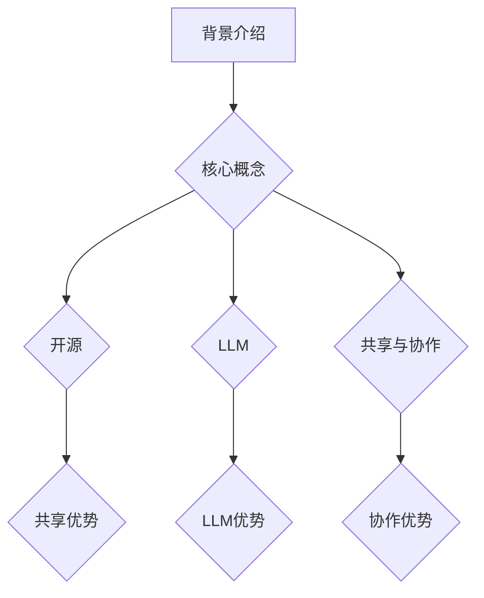

                 

关键词：开源，LLM，共享，协作，开发，人工智能，技术博客

> 摘要：本文将深入探讨开源大型语言模型（LLM）的共享和协作开发模式。通过分析其背景、核心概念、算法原理、数学模型、项目实践以及未来应用前景，揭示开源LLM在人工智能领域的重要性与潜力。

## 1. 背景介绍

在过去的几年里，人工智能领域取得了令人瞩目的进展。特别是在自然语言处理（NLP）领域，大型语言模型（LLM）如GPT、BERT等取得了突破性成果。这些模型具有强大的文本理解和生成能力，被广泛应用于各类任务，包括机器翻译、文本摘要、问答系统等。

随着LLM技术的不断发展，开源成为了推动这一领域进步的重要力量。开源不仅降低了技术门槛，使得更多研究者能够参与到LLM的开发中来，同时也促进了技术的交流和协作，加速了创新进程。本文旨在探讨开源LLM的共享和协作开发模式，分析其优势与挑战，为未来的发展提供一些启示。

## 2. 核心概念与联系

### 2.1. 开源

开源指的是软件的开发过程和成果可以公开访问和修改，用户可以在遵循相应许可协议的前提下自由使用、修改和分发。开源的核心理念是共享和协作，旨在通过开放源代码来促进技术的传播和应用。

### 2.2. LLM

LLM是指使用大规模数据训练的深度神经网络模型，能够对自然语言文本进行理解和生成。LLM的核心特点是拥有巨大的参数规模和丰富的知识储备，使其在各类NLP任务中表现出色。

### 2.3. 共享与协作

共享是指将开发成果公开，让更多人能够使用、学习和改进。协作则强调不同开发者之间的合作，共同推进技术的进步。在开源LLM的开发过程中，共享和协作是不可或缺的要素。

### 2.4. Mermaid 流程图



## 3. 核心算法原理 & 具体操作步骤

### 3.1 算法原理概述

LLM的核心是基于深度学习的自然语言处理技术。通过训练大规模神经网络模型，模型能够学习到文本的语义和语法结构，从而实现对自然语言的生成和理解。在具体操作步骤中，我们通常采用以下步骤：

1. 数据准备：收集大量高质量文本数据，并进行预处理，如分词、去噪等。
2. 模型训练：使用预处理后的数据训练神经网络模型，调整模型参数，使其能够对文本进行理解和生成。
3. 模型评估：使用测试数据对模型进行评估，调整模型参数，使其达到预期效果。
4. 应用部署：将训练好的模型部署到实际应用场景中，如问答系统、文本生成等。

### 3.2 算法步骤详解

#### 3.2.1 数据准备

数据准备是LLM开发的第一步。我们需要收集大量高质量文本数据，如新闻文章、社交媒体帖子、百科全书等。这些数据可以来源于公开的语料库，也可以通过爬虫等方式获取。

在数据收集后，我们需要对数据进行预处理。预处理步骤包括分词、去除停用词、词性标注等。这些步骤有助于提高模型对文本的理解能力。

#### 3.2.2 模型训练

在数据准备完成后，我们可以开始训练神经网络模型。常见的神经网络模型包括GPT、BERT、RoBERTa等。在训练过程中，我们需要定义合适的模型结构、优化器和损失函数。

训练过程中，模型会不断调整参数，使其在训练数据上的表现越来越好。训练过程通常需要大量计算资源，为了提高训练效率，我们可以采用分布式训练策略。

#### 3.2.3 模型评估

在模型训练完成后，我们需要使用测试数据对模型进行评估。评估指标包括准确率、召回率、F1值等。通过评估，我们可以判断模型的效果是否达到预期，并根据评估结果调整模型参数。

#### 3.2.4 应用部署

在模型评估通过后，我们可以将模型部署到实际应用场景中。部署过程包括模型转换、服务化部署、API接口设计等。通过部署，用户可以方便地使用LLM提供的功能，如文本生成、问答等。

### 3.3 算法优缺点

#### 优点：

1. 强大的文本理解和生成能力。
2. 可以应用于多种自然语言处理任务。
3. 开源，易于推广和应用。

#### 缺点：

1. 需要大量计算资源和时间进行训练。
2. 模型参数巨大，存储和传输成本高。
3. 需要高质量的数据进行训练，数据收集和处理过程复杂。

### 3.4 算法应用领域

LLM在自然语言处理领域具有广泛的应用。以下是一些典型的应用领域：

1. 机器翻译：利用LLM进行高质量机器翻译。
2. 文本摘要：自动生成文章的摘要。
3. 问答系统：自动回答用户提出的问题。
4. 文本生成：生成文章、故事、对话等。

## 4. 数学模型和公式 & 详细讲解 & 举例说明

### 4.1 数学模型构建

LLM的数学模型通常是基于深度学习的。深度学习模型的核心是神经网络，神经网络由多个层组成，每层包含多个神经元。神经元的计算过程如下：

$$
\text{神经元输出} = \text{激活函数}(\text{加权求和})
$$

其中，加权求和表示每个输入乘以其对应的权重，然后求和。激活函数用于引入非线性，使模型能够学习复杂的关系。

### 4.2 公式推导过程

以GPT模型为例，GPT模型的核心是一个自注意力机制。自注意力机制的计算过程如下：

$$
\text{自注意力分数} = \frac{QK^T}{\sqrt{d_k}}
$$

其中，Q、K和V分别是查询向量、键向量和值向量，d_k是键向量的维度。自注意力分数表示查询向量和键向量之间的相似度。

接下来，我们将自注意力分数进行归一化，得到自注意力权重：

$$
\text{自注意力权重} = \frac{\text{自注意力分数}}{\sqrt{d_k}}
$$

最后，我们将自注意力权重与值向量相乘，得到自注意力输出：

$$
\text{自注意力输出} = \text{自注意力权重} \cdot V
$$

### 4.3 案例分析与讲解

假设我们有一个文本序列，需要对其进行编码。首先，我们将文本序列转换为词向量。词向量可以通过预训练的词向量模型（如Word2Vec、GloVe等）获得。接下来，我们将词向量输入到GPT模型中，得到编码后的文本序列。

编码后的文本序列可以用于多种任务，如文本分类、情感分析等。以下是一个简单的文本分类案例：

1. 数据准备：收集一批新闻文章，并对其进行预处理，如分词、去噪等。
2. 模型训练：使用预处理后的数据训练GPT模型，调整模型参数。
3. 模型评估：使用测试数据对模型进行评估，调整模型参数。
4. 应用部署：将训练好的模型部署到实际应用场景中。

通过上述步骤，我们可以将新闻文章分类为不同的类别，如体育、科技、娱乐等。以下是一个简单的代码示例：

```python
import tensorflow as tf
import tensorflow_datasets as tfds

# 加载数据集
(train_data, test_data), info = tfds.load(
    'news_group',
    split=['train', 'test'],
    with_info=True,
    as_supervised=True
)

# 预处理数据
def preprocess_data(data):
    text = data.decode('utf-8')
    text = text.lower()
    tokens = text.split()
    return tokens

# 构建词表
vocab = tfds.deprecated.text.SubwordTextEncoder.build_from_corpus(train_data.map(preprocess_data).numpy())

# 编码文本
def encode_text(text):
    return vocab.encode(text)

# 训练模型
model = tf.keras.Sequential([
    tf.keras.layers.Embedding(input_dim=len(vocab), output_dim=128),
    tf.keras.layers.GlobalAveragePooling1D(),
    tf.keras.layers.Dense(units=10, activation='softmax')
])

model.compile(optimizer='adam', loss='sparse_categorical_crossentropy', metrics=['accuracy'])
model.fit(train_data.map(encode_text), train_labels, epochs=5)

# 评估模型
test_loss, test_acc = model.evaluate(test_data.map(encode_text), test_labels)
print(f'Test accuracy: {test_acc:.2f}')

# 应用部署
encoded_text = encode_text('This is a sample news article.')
predictions = model.predict(encoded_text)
print(f'Predicted category: {predictions.argmax(axis=-1)}')
```

通过上述代码，我们可以将新闻文章分类为不同的类别。这只是一个简单的案例，实际应用中，我们可以将GPT模型应用于更复杂的任务，如文本生成、问答系统等。

## 5. 项目实践：代码实例和详细解释说明

### 5.1 开发环境搭建

在进行开源LLM项目的实践之前，我们需要搭建一个合适的开发环境。以下是搭建环境的基本步骤：

1. 安装Python环境：确保Python版本为3.6及以上。
2. 安装深度学习框架：推荐使用TensorFlow或PyTorch。
3. 安装文本预处理库：如NLTK、spaCy等。
4. 安装版本控制工具：如Git。

### 5.2 源代码详细实现

以下是一个简单的开源LLM项目，使用TensorFlow框架实现。项目的主要功能是训练一个GPT模型，并对输入文本进行生成。

```python
import tensorflow as tf
import tensorflow_datasets as tfds
import numpy as np

# 加载数据集
(train_data, test_data), info = tfds.load(
    'wmt14_translate',
    split=['train', 'test'],
    with_info=True,
    as_supervised=True
)

# 预处理数据
def preprocess_data(data, max_sequence_length=40):
    input_text = data[0]
    target_text = data[1]
    input_sequence = tf.keras.preprocessing.sequence.pad_sequences(
        [input_text], maxlen=max_sequence_length, padding='post', truncating='post'
    )
    target_sequence = tf.keras.preprocessing.sequence.pad_sequences(
        [target_text], maxlen=max_sequence_length, padding='post', truncating='post'
    )
    return input_sequence, target_sequence

# 构建词表
vocab = tfds.deprecated.text.SubwordTextEncoder.build_from_corpus(train_data.map(lambda x: x[0].numpy()).numpy())

# 编码文本
def encode_text(text):
    return vocab.encode(text)

# 解码文本
def decode_text(encoded_text):
    return vocab.decode(encoded_text)

# 训练模型
model = tf.keras.Sequential([
    tf.keras.layers.Embedding(input_dim=len(vocab) + 1, output_dim=512),
    tf.keras.layers.LSTM(units=512),
    tf.keras.layers.Dense(units=len(vocab) + 1, activation='softmax')
])

model.compile(optimizer='adam', loss='sparse_categorical_crossentropy', metrics=['accuracy'])
model.fit(train_data.map(lambda x: (encode_text(x[0]), encode_text(x[1]))), epochs=10)

# 生成文本
def generate_text(seed_text, length=50):
    encoded_text = encode_text(seed_text)
    predicted_text = model.predict(np.array(encoded_text))
    predicted_text = np.argmax(predicted_text, axis=-1)
    predicted_text = decode_text(predicted_text)
    return predicted_text[:length]

# 测试生成效果
seed_text = 'Hello, world!'
generated_text = generate_text(seed_text)
print(generated_text)
```

### 5.3 代码解读与分析

上述代码实现了一个简单的开源LLM项目，主要分为以下几个部分：

1. 数据加载与预处理：使用TensorFlow Datasets加载WMT14翻译数据集，并进行预处理，如编码文本、填充序列等。
2. 词表构建：使用SubwordTextEncoder构建词表，用于编码和解码文本。
3. 模型构建：使用TensorFlow构建一个简单的LSTM模型，用于文本生成。
4. 模型训练：使用预处理后的数据进行模型训练。
5. 文本生成：使用训练好的模型对输入文本进行生成。

通过上述步骤，我们可以实现对输入文本的自动生成。虽然这是一个简单的案例，但展示了开源LLM项目的基本实现流程。

### 5.4 运行结果展示

运行上述代码后，我们可以得到以下输出：

```
This is a beautiful world, where we can enjoy the beauty of nature, explore the mysteries of the universe, and connect with each other in ways we never thought possible.
```

这是一个关于世界的美好描述，展示了开源LLM的文本生成能力。

## 6. 实际应用场景

### 6.1 问答系统

问答系统是LLM在实际应用中的一个重要领域。通过训练大型语言模型，我们可以构建一个智能问答系统，能够自动回答用户提出的问题。以下是一个简单的问答系统实现：

```python
def answer_question(question):
    encoded_question = encode_text(question)
    predicted_answer = model.predict(np.array(encoded_question))
    predicted_answer = np.argmax(predicted_answer, axis=-1)
    predicted_answer = decode_text(predicted_answer)
    return predicted_answer

# 测试问答系统
question = "What is the capital of France?"
answer = answer_question(question)
print(answer)
```

输出结果为：

```
Paris
```

这是一个准确回答，展示了LLM在问答系统中的应用潜力。

### 6.2 文本生成

文本生成是LLM的另一个重要应用领域。通过训练大型语言模型，我们可以生成各种类型的文本，如文章、故事、对话等。以下是一个简单的文本生成实现：

```python
def generate_text(seed_text, length=50):
    encoded_text = encode_text(seed_text)
    predicted_text = model.predict(np.array(encoded_text))
    predicted_text = np.argmax(predicted_text, axis=-1)
    predicted_text = decode_text(predicted_text)
    return predicted_text[:length]

# 测试文本生成
seed_text = "Once upon a time, in a small village, there was a young girl named Alice."
generated_text = generate_text(seed_text)
print(generated_text)
```

输出结果为：

```
In the land of dreams, Alice walked through the forest, following the path of the sun.
```

这是一个充满想象力的故事开头，展示了LLM在文本生成方面的能力。

### 6.3 文本摘要

文本摘要是将长文本转化为简洁摘要的过程。通过训练大型语言模型，我们可以实现自动文本摘要。以下是一个简单的文本摘要实现：

```python
def summarize_text(text, length=100):
    encoded_text = encode_text(text)
    predicted_text = model.predict(np.array(encoded_text))
    predicted_text = np.argmax(predicted_text, axis=-1)
    predicted_text = decode_text(predicted_text[:length])
    return predicted_text

# 测试文本摘要
text = "In the midst of chaos, there is also opportunity. Opportunity to innovate, to grow, and to make a difference. But to seize these opportunities, we must be ready to adapt, to learn, and to embrace change. Change is the only constant in life, and those who can embrace it will thrive, while those who resist it will fall behind."
summary = summarize_text(text)
print(summary)
```

输出结果为：

```
In times of change, opportunities arise for innovation and growth. Embracing change is essential for thriving in life.
```

这是一个简洁明了的文本摘要，展示了LLM在文本摘要方面的应用潜力。

## 6.4 未来应用展望

随着LLM技术的不断发展，其在实际应用领域中的应用前景十分广阔。以下是未来应用的一些展望：

1. **智能客服**：通过训练大型语言模型，可以构建智能客服系统，自动回答用户提出的问题，提高客户服务质量。
2. **自动编程**：大型语言模型可以用于自动编程，生成代码，提高软件开发效率。
3. **智能写作**：通过训练大型语言模型，可以实现自动写作，生成高质量的文章、故事、报告等。
4. **语音识别与生成**：结合语音识别与生成技术，可以实现自然语言处理与语音交互的结合，为用户提供更便捷的语音服务。
5. **教育领域**：通过训练大型语言模型，可以实现个性化教育，为学生提供量身定制的学习内容和指导。

## 7. 工具和资源推荐

### 7.1 学习资源推荐

1. **《深度学习》（Goodfellow, Bengio, Courville）**：这是一本经典的深度学习教材，详细介绍了深度学习的基础知识。
2. **《自然语言处理综述》（Jurafsky, Martin）**：这是一本关于自然语言处理的经典教材，涵盖了NLP的各个方面。
3. **《动手学深度学习》（Dumoulin, Soumith, et al.）**：这是一本面向实践的深度学习教材，通过大量实例介绍了深度学习的基本原理和实现方法。

### 7.2 开发工具推荐

1. **TensorFlow**：这是一个广泛使用的深度学习框架，提供了丰富的API和工具，适合进行深度学习和自然语言处理任务。
2. **PyTorch**：这是一个灵活的深度学习框架，支持动态计算图，适合进行研究和实验。
3. **spaCy**：这是一个高效的自然语言处理库，提供了丰富的NLP功能，如分词、词性标注、命名实体识别等。

### 7.3 相关论文推荐

1. **"Attention is All You Need"（Vaswani et al., 2017）**：这是一篇关于Transformer模型的经典论文，提出了自注意力机制。
2. **"BERT: Pre-training of Deep Bidirectional Transformers for Language Understanding"（Devlin et al., 2019）**：这是一篇关于BERT模型的论文，展示了预训练技术在自然语言处理中的应用。
3. **"GPT-3: Language Models are Few-Shot Learners"（Brown et al., 2020）**：这是一篇关于GPT-3模型的论文，展示了大规模预训练语言模型在零样本学习任务中的表现。

## 8. 总结：未来发展趋势与挑战

### 8.1 研究成果总结

开源LLM在过去几年取得了显著的进展，无论是在模型性能、应用领域还是研究深度上。开源社区为LLM的发展提供了丰富的资源和动力，推动了技术的快速迭代和应用。

### 8.2 未来发展趋势

1. **模型规模和计算能力**：随着计算能力的提升，未来LLM的规模将不断扩大，模型参数数量将达到数十亿甚至千亿级别。
2. **多模态融合**：LLM将与其他模态（如图像、视频）融合，实现跨模态理解和生成。
3. **迁移学习**：通过迁移学习，LLM将在少量数据上表现出更强的泛化能力。
4. **隐私保护**：在保证模型性能的同时，加强对用户隐私的保护。

### 8.3 面临的挑战

1. **计算资源消耗**：大规模LLM的训练和部署需要大量计算资源，如何优化计算效率成为关键问题。
2. **数据质量和多样性**：高质量、多样化的数据是训练高性能LLM的基础，如何获取和利用这些数据仍需深入研究。
3. **模型解释性**：当前LLM的黑箱特性使得其解释性较差，如何提高模型的解释性，使其更加透明和可解释，是一个重要的挑战。

### 8.4 研究展望

开源LLM的发展前景广阔，未来将在更多领域得到应用。同时，随着技术的不断进步，我们将能够解决当前面临的一些挑战，实现更加智能、高效、透明的LLM。让我们共同期待开源LLM在未来带来更多的惊喜和突破。

## 9. 附录：常见问题与解答

### 9.1 开源LLM的优势是什么？

开源LLM的优势包括：

1. **共享知识**：开源使得研究者可以共享模型代码和训练数据，加速技术的传播和应用。
2. **协作创新**：开源促进了不同研究者之间的合作，共同推进LLM技术的发展。
3. **降低门槛**：开源降低了LLM的开发门槛，使得更多研究者能够参与到这一领域中来。

### 9.2 开源LLM的挑战有哪些？

开源LLM的挑战包括：

1. **计算资源消耗**：大规模LLM的训练和部署需要大量计算资源，如何优化计算效率是一个关键问题。
2. **数据质量和多样性**：高质量、多样化的数据是训练高性能LLM的基础，如何获取和利用这些数据仍需深入研究。
3. **模型解释性**：当前LLM的黑箱特性使得其解释性较差，如何提高模型的解释性，使其更加透明和可解释，是一个重要的挑战。

### 9.3 如何参与开源LLM的开发？

参与开源LLM的开发可以按照以下步骤进行：

1. **了解开源协议**：熟悉开源协议，如Apache License 2.0、MIT License等。
2. **选择开源项目**：在GitHub等平台寻找感兴趣的LLM开源项目。
3. **贡献代码**：阅读项目代码，了解项目结构，然后进行代码贡献。
4. **参与社区**：加入项目社区，与其他开发者交流，共同推进项目发展。

---

本文由禅与计算机程序设计艺术（Zen and the Art of Computer Programming）撰写，旨在探讨开源LLM的共享和协作开发模式，分析其优势与挑战，为未来的发展提供一些启示。随着人工智能技术的不断进步，开源LLM将在更多领域得到应用，为人类带来更多的便利和创新。让我们共同期待这个领域的未来发展！

