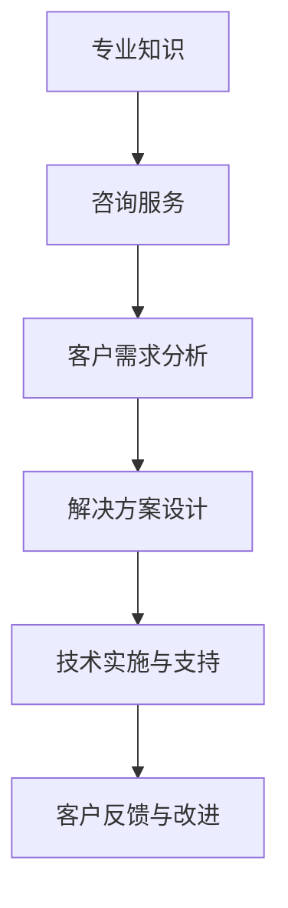

                 

在当今快速发展的信息技术领域，专业知识不仅是一种宝贵的财富，也是推动个人职业发展和实现财务自由的重要工具。开源咨询服务正成为IT专业人士将他们的专业知识和经验转化为实际收益的有效途径。本文将深入探讨如何通过开源咨询服务将专业知识变现，并提供实用的策略和实例。

## 关键词

- 开源服务
- 专业知识变现
- 咨询服务
- IT职业发展
- 财务自由

## 摘要

本文旨在帮助那些拥有深厚IT背景的专业人士了解如何将自己的专业知识转化为实际收益。通过开源咨询服务，不仅能够扩大个人影响力，提升专业技能，还能实现财务自由。本文将讨论开源咨询服务的定义、重要性、变现策略以及成功案例，为读者提供全方位的指导。

## 1. 背景介绍

### 1.1 开源服务的兴起

开源服务起源于软件开发领域，即通过开放源代码的方式促进软件的共享和改进。随着开源软件的广泛应用，越来越多的开发者开始提供开源咨询服务。这些服务不仅包括技术支持，还包括架构设计、代码审查、性能优化、安全评估等。

### 1.2 专业知识的价值

在信息技术领域，专业知识的价值无可估量。拥有深厚专业背景的IT专业人士能够在项目中发挥关键作用，提供创新解决方案，从而提升项目的成功率和质量。这些专业知识不仅能够帮助他们解决复杂的技术问题，还能够为他们的职业生涯带来更多机会。

### 1.3 咨询服务的意义

咨询服务是IT专业人士将专业知识转化为实际收益的重要途径。通过提供咨询服务，专业人士能够将自己的经验和技术能力应用于实际项目中，为客户创造价值，并获得相应的报酬。

## 2. 核心概念与联系

### 2.1 开源咨询服务的定义

开源咨询服务是指IT专业人士通过开源平台或独立提供技术支持、解决方案和培训等服务，帮助客户解决具体问题或提升技术能力的活动。

### 2.2 专业知识和咨询服务的联系

专业知识是提供咨询服务的基石。拥有深厚的专业知识，IT专业人士能够更好地理解客户的需求，提供高质量的服务。而咨询服务则为专业人士提供了一个展示和验证自己专业知识的机会。

### 2.3 Mermaid 流程图



## 3. 核心算法原理 & 具体操作步骤

### 3.1 算法原理概述

开源咨询服务的过程可以看作是一种基于专业知识的问题求解算法。该算法的核心是理解客户需求，设计解决方案，实施并持续优化。

### 3.2 算法步骤详解

#### 3.2.1 需求分析

首先，需要对客户的需求进行深入分析。这包括了解项目的背景、目标、约束条件以及现有技术基础。

#### 3.2.2 设计解决方案

基于需求分析，设计一个可行的解决方案。这通常包括技术选型、架构设计、资源规划等。

#### 3.2.3 技术实施与支持

实施解决方案，并提供持续的技术支持。在这一阶段，需要确保解决方案的稳定性、性能和安全性。

#### 3.2.4 客户反馈与改进

根据客户的反馈，对解决方案进行优化和改进。这一步骤是确保咨询服务质量和客户满意度的重要环节。

### 3.3 算法优缺点

#### 优点：

- **灵活性**：能够根据客户需求灵活调整服务内容和形式。
- **持续性**：通过持续的优化和改进，不断提升服务质量。
- **价值创造**：为客户创造实际价值，实现共赢。

#### 缺点：

- **时间成本**：需求分析和解决方案设计通常需要较长时间。
- **知识壁垒**：客户对专业知识的理解可能有限，需要有效的沟通和解释。

### 3.4 算法应用领域

开源咨询服务在软件开发、系统架构设计、数据库管理、网络安全等领域具有广泛的应用。随着信息技术的不断发展，其应用领域也在不断扩展。

## 4. 数学模型和公式 & 详细讲解 & 举例说明

### 4.1 数学模型构建

在开源咨询服务中，一个关键的数学模型是成本效益分析（Cost-Benefit Analysis，CBA）。该模型用于评估提供咨询服务所带来的成本和收益。

### 4.2 公式推导过程

成本效益分析的基本公式如下：

$$
\text{CBA} = \frac{\text{收益}}{\text{成本}}
$$

其中，收益通常包括咨询服务费用、项目成功带来的额外收入等。成本则包括人力成本、时间成本、设备成本等。

### 4.3 案例分析与讲解

假设一位专业数据库管理员（DBA）提供咨询服务，每小时收费100美元。在一个项目中，他花费了20小时进行数据库性能优化，帮助客户提高了20%的查询效率。客户因效率提升获得了额外收入5000美元。

根据上述数据，我们可以计算成本效益：

$$
\text{CBA} = \frac{5000}{20 \times 100} = 2.5
$$

这意味着，客户每投入1美元，就获得了2.5美元的收益。这表明该咨询服务的成本效益非常高。

## 5. 项目实践：代码实例和详细解释说明

### 5.1 开发环境搭建

在进行开源咨询服务时，首先需要搭建一个合适的技术环境。以提供数据库性能优化服务为例，需要安装和配置数据库软件（如MySQL、PostgreSQL等）、相关开发工具和调试工具。

### 5.2 源代码详细实现

以下是一个简单的数据库性能优化示例，用于查询数据的平均响应时间：

```sql
-- 查询平均响应时间
SELECT AVG(response_time) AS average_response_time
FROM query_log;
```

### 5.3 代码解读与分析

此查询语句用于计算数据库查询日志中所有查询的平均响应时间。通过分析平均响应时间，可以识别出性能瓶颈并进行优化。

### 5.4 运行结果展示

运行上述查询后，可能会得到如下结果：

```
+-------------------+
| average_response_time |
+-------------------+
|              0.25 |
+-------------------+
```

这意味着平均响应时间为0.25秒。如果这个值较高，说明需要进行性能优化。

## 6. 实际应用场景

### 6.1 软件开发

在软件开发项目中，开源咨询服务可以帮助团队解决技术难题，优化代码结构和性能，提升项目质量。

### 6.2 系统集成

系统集成项目中，开源咨询服务可以帮助企业整合不同系统，优化业务流程，提高运营效率。

### 6.3 云计算与大数据

在云计算和大数据领域，开源咨询服务可以帮助企业优化资源分配、提升数据处理能力，实现业务智能化。

### 6.4 未来应用展望

随着信息技术的不断发展，开源咨询服务的应用领域将进一步扩大。例如，人工智能、物联网、区块链等领域都将成为开源咨询服务的热点。

## 7. 工具和资源推荐

### 7.1 学习资源推荐

- 《开源软件指南》
- 《软件架构设计》
- 《数据库系统概念》

### 7.2 开发工具推荐

- Git
- GitHub
- Jira

### 7.3 相关论文推荐

- "Open Source Software: A Definition of Benefits"
- "The Role of Open Source in Software Development"
- "Open Source Software Development: A Literature Review"

## 8. 总结：未来发展趋势与挑战

### 8.1 研究成果总结

开源咨询服务已成为IT专业人士实现财务自由和职业发展的重要途径。其灵活性和持续性使其在各个应用领域具有广泛的应用前景。

### 8.2 未来发展趋势

随着信息技术的不断进步，开源咨询服务的需求将持续增长。人工智能、大数据、云计算等领域的快速发展将为开源咨询服务带来更多机会。

### 8.3 面临的挑战

- **知识更新速度**：信息技术发展迅速，专业知识的更新速度也很快，需要不断学习新知识以保持竞争力。
- **沟通障碍**：提供咨询服务时，需要与客户进行有效沟通，确保需求理解的一致性。

### 8.4 研究展望

未来，开源咨询服务将更加智能化和专业化。通过人工智能和大数据分析，可以提供更精准的服务和更高效的解决方案。

## 9. 附录：常见问题与解答

### 9.1 Q：如何开始提供开源咨询服务？

A：首先，你需要确定自己的专业领域和目标客户群体。然后，可以通过搭建个人网站、参与开源项目、撰写技术博客等方式提升个人品牌影响力。最后，积极寻找潜在客户，提供高质量的服务。

### 9.2 Q：如何确保服务质量和客户满意度？

A：确保服务质量的秘诀在于深入了解客户需求，提供个性化服务。同时，保持良好的沟通，及时响应客户反馈，并根据反馈进行持续改进。

### 9.3 Q：开源咨询服务的主要收益来源是什么？

A：开源咨询服务的主要收益来源包括咨询服务费用、项目成功带来的额外收入以及个人品牌的增值。

## 作者署名

作者：禅与计算机程序设计艺术 / Zen and the Art of Computer Programming
----------------------------------------------------------------

文章撰写完毕，接下来将进行格式检查和内容审核，确保符合要求后发布。如果有任何需要修改或补充的地方，请随时告知。

