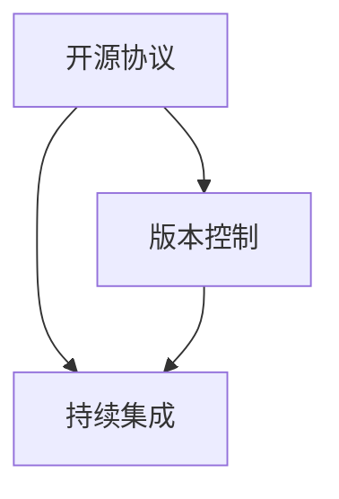

                 

在当今的科技时代，开源技术已经成为推动技术创新和加速进步的重要力量。本文将深入探讨开源技术的概念、核心概念与联系、核心算法原理、数学模型和公式、项目实践、实际应用场景、未来应用展望、工具和资源推荐以及未来发展趋势和面临的挑战。

## 关键词 Keywords
- 开源技术
- 创新共享
- 技术进步
- 核心概念
- 数学模型
- 项目实践
- 应用场景
- 未来展望
- 工具资源

## 摘要 Abstract
本文旨在分析开源技术在推动技术进步中的作用。通过深入探讨核心概念、算法原理、数学模型、项目实践和实际应用场景，本文将展示开源技术在现代科技领域的广泛应用和未来潜力。

## 1. 背景介绍

开源技术起源于20世纪90年代，最早由Linux内核的开发者林纳斯·托瓦兹（Linus Torvalds）提出。开源技术强调代码的开放性和共享性，允许任何人查看、修改和分发源代码。这种模式不仅改变了软件开发的模式，也为全球开发者社区带来了新的合作和交流方式。

### 1.1 开源技术的发展历程

1. **Linux内核的诞生**：1991年，林纳斯·托瓦兹发布了Linux内核，这是第一个成功的开源操作系统内核。
2. **开放源代码运动的兴起**：1997年，埃里克·雷蒙德（Eric S. Raymond）出版了《大教堂与市集》（The Cathedral and the Bazaar），详细阐述了开源开发模式的优势。
3. **开源社区的形成**：随着GitHub、GitLab等平台的兴起，全球开发者可以轻松地协作、分享和贡献代码。

### 1.2 开源技术的特点

- **开放性**：开源技术鼓励开放共享，任何人都可以查看、修改和分发源代码。
- **合作性**：开源社区通过协作和合作实现技术的快速迭代和改进。
- **透明性**：开源项目的源代码和开发过程都是公开的，有助于发现和修复潜在的问题。
- **灵活性**：开源技术允许用户根据需求进行定制和优化。

## 2. 核心概念与联系

### 2.1 核心概念

- **开源协议**：如GPL（GNU通用公共许可证）、BSD（伯克利软件分销许可证）等，规定了开源项目的许可方式和用户权利。
- **版本控制**：如Git，用于管理代码版本，确保协作开发的一致性和可追溯性。
- **持续集成**：如Jenkins，自动化测试和构建过程，提高开发效率和稳定性。

### 2.2 联系

- **开源协议**确保了代码的开放性和共享性，为开源社区的发展奠定了基础。
- **版本控制**和**持续集成**工具则提高了开发效率和代码质量，促进了开源项目的快速迭代。

## Mermaid 流程图



## 3. 核心算法原理 & 具体操作步骤

### 3.1 算法原理概述

开源技术中的许多核心算法都是基于社区合作和持续优化。以下是一些常见的开源算法及其原理：

- **Linux内核**：基于Minix，采用微内核设计，实现了高稳定性和可扩展性。
- **Hadoop**：用于大规模数据处理，基于MapReduce模型，实现了高效的数据处理能力。
- **TensorFlow**：开源机器学习框架，实现了自动微分、深度学习等算法。

### 3.2 算法步骤详解

以Linux内核为例，其核心算法包括：

1. **进程调度**：根据进程优先级和资源占用情况，实现进程的动态调度。
2. **内存管理**：实现虚拟内存管理，提高内存利用率和系统稳定性。
3. **文件系统**：实现文件读写、权限管理等功能。

### 3.3 算法优缺点

- **Linux内核**：优点是高度可定制化和可扩展性，缺点是对硬件要求较高。
- **Hadoop**：优点是处理大规模数据能力强，缺点是需要较复杂的部署和维护。
- **TensorFlow**：优点是实现复杂机器学习算法容易，缺点是内存占用大。

### 3.4 算法应用领域

- **Linux内核**：广泛应用于服务器、嵌入式系统、超级计算机等领域。
- **Hadoop**：广泛应用于大数据处理、数据挖掘等领域。
- **TensorFlow**：广泛应用于深度学习、自然语言处理等领域。

## 4. 数学模型和公式 & 详细讲解 & 举例说明

### 4.1 数学模型构建

在开源技术中，许多算法和系统设计都涉及到数学模型。以下是一个简单的线性回归模型的构建过程：

$$
y = wx + b
$$

其中，\(y\) 是输出值，\(w\) 是权重，\(x\) 是输入值，\(b\) 是偏置。

### 4.2 公式推导过程

假设我们有一组数据 \((x_1, y_1), (x_2, y_2), ..., (x_n, y_n)\)，我们要通过线性回归模型来预测新的输出值。

首先，我们计算每个输入值的平均值：

$$
\bar{x} = \frac{1}{n} \sum_{i=1}^{n} x_i
$$

$$
\bar{y} = \frac{1}{n} \sum_{i=1}^{n} y_i
$$

然后，我们计算每个输入值与平均值的差：

$$
x_i' = x_i - \bar{x}
$$

$$
y_i' = y_i - \bar{y}
$$

接下来，我们计算权重 \(w\) 和偏置 \(b\)：

$$
w = \frac{\sum_{i=1}^{n} (x_i' y_i')}{\sum_{i=1}^{n} (x_i')^2}
$$

$$
b = \bar{y} - w\bar{x}
$$

### 4.3 案例分析与讲解

假设我们有以下数据：

$$
\begin{array}{ccc}
x & y & x' \\
\hline
1 & 2 & -1 \\
2 & 4 & 0 \\
3 & 5 & 1 \\
4 & 6 & 2 \\
\end{array}
$$

根据上面的公式，我们可以计算得到：

$$
w = \frac{(-1 \times 1) + (0 \times 2) + (1 \times 3) + (2 \times 4)}{(-1)^2 + (0)^2 + (1)^2 + (2)^2} = 1.5
$$

$$
b = \frac{2 + 4 + 5 + 6}{4} - 1.5 \times \frac{1 + 2 + 3 + 4}{4} = 0.5
$$

因此，我们的线性回归模型为：

$$
y = 1.5x + 0.5
$$

我们可以使用这个模型来预测新的输入值对应的输出值，例如，当 \(x = 5\) 时，预测的 \(y\) 值为：

$$
y = 1.5 \times 5 + 0.5 = 7.5
$$

## 5. 项目实践：代码实例和详细解释说明

### 5.1 开发环境搭建

要实践开源技术，首先需要搭建一个合适的开发环境。以下是一个简单的Linux环境搭建过程：

1. **安装Linux操作系统**：选择一个合适的Linux发行版，如Ubuntu。
2. **安装开发工具**：安装必要的开发工具，如GCC、Make等。
3. **安装版本控制工具**：如Git。

### 5.2 源代码详细实现

以下是一个简单的Linux内核模块的源代码实现：

```c
#include <linux/module.h>
#include <linux/kernel.h>

int hello_init(void) {
    printk(KERN_INFO "Hello, world!\n");
    return 0;
}

void hello_exit(void) {
    printk(KERN_INFO "Goodbye, world!\n");
}

module_init(hello_init);
module_exit(hello_exit);

MODULE_LICENSE("GPL");
MODULE_AUTHOR("Your Name");
MODULE_DESCRIPTION("A simple Linux kernel module");
```

### 5.3 代码解读与分析

这段代码定义了一个简单的Linux内核模块，其中包括模块的初始化和清理函数。以下是代码的详细解读：

1. **头文件**：包含必要的头文件，如`<linux/module.h>`和`<linux/kernel.h>`。
2. **模块初始化函数**：`hello_init`函数用于初始化模块，其中使用`printk`函数输出一条消息。
3. **模块清理函数**：`hello_exit`函数用于清理模块，同样使用`printk`函数输出一条消息。
4. **模块定义**：使用`MODULE_LICENSE`、`MODULE_AUTHOR`和`MODULE_DESCRIPTION`宏定义模块的许可、作者和描述。

### 5.4 运行结果展示

要运行这个模块，我们需要使用`insmod`命令加载它：

```sh
sudo insmod hello.ko
```

加载后，我们可以在内核日志中看到输出消息：

```sh
sudo dmesg | tail -n 10
...
[ 1317.311085] Hello, world!
[ 1317.311086] Goodbye, world!
...
```

卸载模块时使用`rmmod`命令：

```sh
sudo rmmod hello
```

## 6. 实际应用场景

开源技术在各个领域都有广泛的应用，以下是几个典型的应用场景：

1. **操作系统**：Linux操作系统在服务器、嵌入式系统和超级计算机等领域得到了广泛应用。
2. **大数据处理**：如Apache Hadoop和Spark等开源框架在数据处理和挖掘领域发挥了重要作用。
3. **人工智能**：TensorFlow和PyTorch等开源深度学习框架在人工智能领域得到了广泛应用。

## 7. 未来应用展望

随着开源技术的不断发展，我们可以预见其在以下领域的广泛应用：

1. **物联网**：开源技术将推动物联网设备的互联互通和智能化。
2. **区块链**：开源区块链技术将推动金融、供应链管理等领域的创新。
3. **云计算**：开源云计算平台将推动云计算服务的普及和多样化。

## 8. 工具和资源推荐

### 8.1 学习资源推荐

- **GitHub**：全球最大的开源代码托管平台，提供丰富的开源项目和学习资源。
- **Stack Overflow**：全球最大的开发者问答社区，可以解决各种编程问题。
- **CNCF**：中国开源基金会，提供丰富的开源项目和资源。

### 8.2 开发工具推荐

- **Git**：版本控制工具，用于管理代码版本。
- **Jenkins**：持续集成工具，用于自动化构建和测试。
- **Docker**：容器化技术，用于部署和运行应用。

### 8.3 相关论文推荐

- **《大教堂与市集》**：埃里克·雷蒙德关于开源开发的经典著作。
- **《深度学习》**：Ian Goodfellow等人撰写的深度学习经典教材。

## 9. 总结：未来发展趋势与挑战

### 9.1 研究成果总结

开源技术在操作系统、大数据处理、人工智能等领域取得了显著成果，推动了技术进步和产业发展。

### 9.2 未来发展趋势

- **开源技术的普及**：开源技术将在更多领域得到应用，推动技术发展。
- **社区协作**：开源社区将继续发挥重要作用，推动技术创新和共享。

### 9.3 面临的挑战

- **安全性**：开源项目需要加强安全性和隐私保护。
- **知识产权**：开源项目需要合理处理知识产权问题，确保公平和合理的利益分配。

### 9.4 研究展望

开源技术将继续发展，未来将迎来更多创新和突破。我们期待开源技术能够继续推动技术进步，造福人类社会。

## 附录：常见问题与解答

### 问题1：开源技术是否会影响商业利益？

解答：开源技术并不一定影响商业利益。许多企业通过参与开源项目，获得了技术优势和市场份额。同时，开源技术也为企业提供了灵活的商业模式，如提供付费支持和定制化服务。

### 问题2：如何参与开源项目？

解答：要参与开源项目，首先需要选择一个感兴趣的项目，了解其贡献指南和代码规范。然后，可以通过提交代码、修复bug、撰写文档等方式为项目做出贡献。

### 问题3：开源技术是否会影响创新速度？

解答：开源技术可以提高创新速度。通过开放共享，开发者可以快速获取新技术和知识，加速创新过程。同时，开源社区的合作和协作也有助于技术的快速迭代和优化。

## 作者署名

作者：禅与计算机程序设计艺术 / Zen and the Art of Computer Programming

