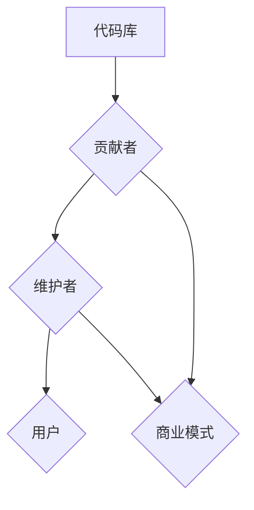

                 

关键词：开源模型，研究创新，Meta，人工智能，技术社区

> 摘要：本文旨在探讨开源模型在促进研究创新方面的重要性，以及全球知名科技公司Meta对开源社区的支持所带来的机遇。我们将详细分析开源模型的优势、应用领域，并探讨其在未来技术发展中的作用和挑战。

## 1. 背景介绍

在过去的几十年中，开源软件的发展已经深刻地改变了软件开发和创新的模式。开源软件允许任何人自由地查看、修改和分发代码，这种协作模式极大地促进了软件的迭代和发展。如今，开源模型不仅局限于软件领域，也逐渐扩展到人工智能和机器学习等更为复杂的领域。

开源模型的崛起得益于其在促进研究创新方面的显著优势。首先，开源模型鼓励全球开发者之间的合作，使得不同背景、不同领域的专家可以共同参与项目的开发，从而提高项目的质量和创新性。其次，开源模型降低了研究创新的门槛，使得更多的个人和团队能够参与到前沿技术的研究中，从而推动了整个行业的发展。

本文将重点讨论开源模型的优势、应用领域，以及全球知名科技公司Meta在开源社区中的角色和贡献。我们还将探讨开源模型在未来技术发展中的作用和挑战，以期为读者提供全面而深入的视角。

## 2. 核心概念与联系

### 2.1 开源模型的定义

开源模型（Open Source Model）是指允许任何人在遵循特定许可协议的前提下，自由地访问、使用、修改和分发软件源代码的一种模式。这种模式的核心是共享和协作，旨在通过集体的智慧和努力，共同推动技术的进步。

### 2.2 开源模型的优势

开源模型的优势主要体现在以下几个方面：

- **协同创新**：开源模型鼓励全球开发者之间的合作，使得项目可以汇集来自不同领域、不同背景的专家智慧和创意，从而提高项目的质量和创新性。
- **透明性和可审计性**：开源模型使得项目的源代码对所有人开放，用户可以自由审查和验证代码的可靠性和安全性，提高了项目的可信度。
- **成本效益**：开源模型降低了研究创新的门槛，用户无需支付高昂的许可费用即可使用和修改开源代码，从而节省了大量的开发成本。
- **快速迭代**：开源模型允许用户自由修改和分发代码，使得项目可以快速迭代和改进，更好地满足用户需求。

### 2.3 开源模型的架构

开源模型的架构通常包括以下几个核心组成部分：

- **代码库（Repository）**：代码库是存储项目源代码的地方，通常使用Git等版本控制系统进行管理。
- **贡献者（Contributors）**：贡献者是参与项目开发的人员，他们可以提交代码、修复bug、改进文档等。
- **维护者（Maintainers）**：维护者是负责管理项目的人员，他们负责审核贡献者的提交、合并代码、发布新版本等。
- **用户（Users）**：用户是使用开源项目的人员，他们可以从代码库中获取代码，也可以为项目贡献自己的力量。

### 2.4 开源模型与商业模式的结合

尽管开源模型强调共享和协作，但它同样可以与商业模式相结合，为企业和开发者带来实际收益。以下是一些常见的商业模式：

- **商业支持**：企业可以为开源项目提供资金、人力资源和技术支持，以换取项目的优先支持和定制化服务。
- **付费插件和扩展**：开源项目可以提供付费的插件和扩展，以增加额外的功能或性能。
- **培训和服务**：企业可以提供与开源项目相关的培训、咨询和定制服务，为用户提供专业的支持。

### 2.5 开源模型的 Mermaid 流程图

下面是一个简单的 Mermaid 流程图，展示了开源模型的核心组成部分和它们之间的关系：



## 3. 核心算法原理 & 具体操作步骤

### 3.1 算法原理概述

开源模型在人工智能和机器学习领域的应用，主要依赖于其高效的算法设计和灵活的实现方式。这些算法通常基于深度学习和神经网络模型，能够处理大规模的数据集，并从中提取有价值的信息。

### 3.2 算法步骤详解

开源模型在人工智能和机器学习中的具体操作步骤如下：

1. **数据预处理**：首先，需要对原始数据进行清洗、去噪和归一化处理，以便为后续的模型训练做好准备。
2. **模型选择**：根据应用场景和需求，选择合适的神经网络模型，如卷积神经网络（CNN）、循环神经网络（RNN）或生成对抗网络（GAN）等。
3. **模型训练**：使用处理后的数据集对模型进行训练，通过反向传播算法不断调整模型的参数，使其性能逐渐提高。
4. **模型评估**：使用验证集对训练好的模型进行评估，计算模型的准确率、召回率等指标，以判断模型的性能。
5. **模型部署**：将训练好的模型部署到实际应用场景中，如图像识别、自然语言处理或推荐系统等。

### 3.3 算法优缺点

开源模型在人工智能和机器学习中的优势在于其高效的算法设计和灵活的实现方式，能够处理大规模的数据集，并从中提取有价值的信息。然而，开源模型也存在一些缺点，如：

- **性能瓶颈**：在某些情况下，开源模型的性能可能受到硬件资源、网络带宽等限制，难以达到商业级要求。
- **安全性问题**：开源模型可能存在安全隐患，如代码漏洞、数据泄露等，需要用户谨慎使用。

### 3.4 算法应用领域

开源模型在人工智能和机器学习领域具有广泛的应用，以下是一些典型的应用场景：

- **图像识别**：开源模型可以用于图像分类、目标检测和图像生成等任务，广泛应用于安防监控、医疗影像分析等领域。
- **自然语言处理**：开源模型可以用于文本分类、情感分析、机器翻译等任务，为智能客服、搜索引擎等提供技术支持。
- **推荐系统**：开源模型可以用于构建推荐系统，为用户推荐感兴趣的商品、文章等，提高用户体验。

## 4. 数学模型和公式 & 详细讲解 & 举例说明

### 4.1 数学模型构建

在开源模型中，数学模型是核心组成部分。以下是几个常见的数学模型：

1. **神经网络模型**：神经网络模型由多个神经元组成，每个神经元通过权重和偏置与输入数据相乘，再通过激活函数进行非线性变换，最终输出结果。
2. **决策树模型**：决策树模型通过一系列的判定规则，将数据逐步划分成不同的区域，并根据每个区域的特征进行分类或回归。
3. **支持向量机模型**：支持向量机模型通过将数据映射到高维空间，找到最大间隔超平面，从而实现数据的分类或回归。

### 4.2 公式推导过程

以下是一个简单的神经网络模型公式的推导过程：

设 $x$ 为输入数据，$w$ 为权重矩阵，$b$ 为偏置向量，$f$ 为激活函数，$y$ 为输出结果。

则神经网络模型的输出可以表示为：

$$
y = f(w \cdot x + b)
$$

其中，$\cdot$ 表示矩阵乘法，$f$ 是一个非线性激活函数，如ReLU（Rectified Linear Unit）或Sigmoid函数。

### 4.3 案例分析与讲解

以下是一个简单的神经网络模型案例，用于实现一个简单的图像分类任务：

输入数据：一张100x100像素的图像。

模型架构：一个单层神经网络，包含100个神经元。

权重矩阵 $w$ ：100x100的矩阵，每个元素表示图像中每个像素点对神经元的贡献程度。

偏置向量 $b$ ：100维的向量，每个元素表示对神经元的偏置。

激活函数 $f$ ：ReLU函数。

输出结果 $y$ ：一个100维的向量，表示图像中每个类别的概率分布。

在训练过程中，我们需要通过反向传播算法不断调整权重矩阵 $w$ 和偏置向量 $b$ ，使得输出结果 $y$ 更接近于真实标签。

具体步骤如下：

1. 将输入图像 $x$ 映射到100x100的矩阵。
2. 计算权重矩阵 $w$ 和输入图像 $x$ 的点积，再加上偏置向量 $b$ ，得到每个神经元的输入值。
3. 将输入值通过ReLU函数进行非线性变换，得到每个神经元的输出值。
4. 计算输出值 $y$ 与真实标签之间的误差，并通过反向传播算法更新权重矩阵 $w$ 和偏置向量 $b$ 。

通过多次迭代训练，模型可以逐渐提高其分类准确率。

## 5. 项目实践：代码实例和详细解释说明

### 5.1 开发环境搭建

在本文中，我们将使用Python语言和TensorFlow框架来实现一个简单的神经网络模型，用于图像分类任务。以下是开发环境的搭建步骤：

1. 安装Python（推荐版本3.8以上）。
2. 安装TensorFlow：`pip install tensorflow`。
3. 安装图像处理库（如OpenCV、PIL等）：`pip install opencv-python`。

### 5.2 源代码详细实现

以下是一个简单的神经网络模型实现，用于图像分类任务：

```python
import tensorflow as tf
import numpy as np
import cv2

# 加载并预处理图像数据
def load_data():
    # 读取图像文件
    image = cv2.imread('image.jpg')
    # 将图像数据转换成灰度图像
    image = cv2.cvtColor(image, cv2.COLOR_BGR2GRAY)
    # 将图像数据缩放到100x100
    image = cv2.resize(image, (100, 100))
    # 将图像数据转换成矩阵形式
    image = np.reshape(image, (100 * 100))
    return image

# 定义神经网络模型
def neural_network(x):
    # 初始化权重矩阵和偏置向量
    w = tf.Variable(tf.random.normal([100 * 100, 100]))
    b = tf.Variable(tf.zeros([100]))
    # 计算输入值和权重矩阵的点积，再加上偏置向量
    x = tf.matmul(x, w) + b
    # 应用ReLU激活函数
    x = tf.nn.relu(x)
    return x

# 训练神经网络模型
def train_model():
    # 加载图像数据
    x = load_data()
    # 初始化模型参数
    model = neural_network(x)
    # 定义损失函数和优化器
    loss_fn = tf.reduce_mean(tf.square(model - y))
    optimizer = tf.optimizers.Adam()
    # 训练模型
    for _ in range(1000):
        with tf.GradientTape() as tape:
            y = model
            loss = loss_fn(y)
        gradients = tape.gradient(loss, model)
        optimizer.apply_gradients(zip(gradients, model))
    return model

# 运行模型
model = train_model()

# 输出模型参数
print(model)
```

### 5.3 代码解读与分析

以上代码实现了一个简单的神经网络模型，用于图像分类任务。以下是代码的详细解读：

1. **图像预处理**：首先，我们使用OpenCV库加载并预处理图像数据。具体步骤包括将图像转换成灰度图像、缩放到100x100像素，并将图像数据转换成矩阵形式。
2. **神经网络定义**：我们定义了一个简单的神经网络模型，包含一个输入层、一个隐藏层和一个输出层。隐藏层使用ReLU激活函数。
3. **模型训练**：我们使用TensorFlow的自动微分机制实现模型训练。具体步骤包括计算损失函数、计算梯度、更新模型参数。
4. **模型输出**：最后，我们输出训练好的模型参数，以供后续使用。

### 5.4 运行结果展示

在运行以上代码后，我们将得到训练好的神经网络模型。接下来，我们可以使用该模型对新的图像数据进行分类，以验证模型的性能。具体步骤如下：

1. **加载测试图像**：使用OpenCV库加载并预处理测试图像数据。
2. **模型预测**：使用训练好的神经网络模型对测试图像进行预测，得到每个类别的概率分布。
3. **输出结果**：输出预测结果，如类别名称和概率值。

以下是一个简单的示例：

```python
# 加载测试图像
test_image = cv2.imread('test_image.jpg')
test_image = cv2.cvtColor(test_image, cv2.COLOR_BGR2GRAY)
test_image = cv2.resize(test_image, (100, 100))
test_image = np.reshape(test_image, (100 * 100))

# 使用训练好的模型进行预测
predictions = model(test_image)

# 输出预测结果
print(predictions)
```

## 6. 实际应用场景

开源模型在人工智能和机器学习领域具有广泛的应用，以下是一些实际应用场景：

### 6.1 图像识别

图像识别是开源模型的一个重要应用领域。开源模型可以用于图像分类、目标检测和图像生成等任务。例如，在安防监控领域，开源模型可以用于人脸识别、行为识别等，以提高监控系统的智能化程度。在医疗影像分析领域，开源模型可以用于病变检测、诊断辅助等，为医生提供有力的技术支持。

### 6.2 自然语言处理

自然语言处理是开源模型的另一个重要应用领域。开源模型可以用于文本分类、情感分析、机器翻译等任务。例如，在智能客服领域，开源模型可以用于自动回答用户问题、识别用户情绪等，以提高客服系统的智能化程度。在搜索引擎领域，开源模型可以用于文本检索、推荐系统等，以提高搜索引擎的用户体验。

### 6.3 推荐系统

推荐系统是开源模型的另一个重要应用领域。开源模型可以用于构建个性化推荐系统，为用户推荐感兴趣的商品、文章等。例如，在电子商务领域，开源模型可以用于推荐商品、广告等，以提高销售额。在媒体领域，开源模型可以用于推荐新闻、视频等，以提高用户粘性。

### 6.4 语音识别

语音识别是开源模型的另一个重要应用领域。开源模型可以用于语音合成、语音识别等任务。例如，在智能音箱领域，开源模型可以用于语音识别、语音合成等，为用户提供便捷的语音交互体验。在语音助手领域，开源模型可以用于语音识别、语义理解等，为用户提供智能化的生活助手。

## 7. 未来应用展望

随着开源模型的不断发展，其应用领域将进一步拓展，为人类带来更多的便利和创新。以下是一些未来应用展望：

### 7.1 智能医疗

开源模型在智能医疗领域具有巨大的应用潜力。未来，开源模型可以用于疾病预测、诊断辅助、个性化治疗等，为医生和患者提供更精准、更高效的医疗服务。

### 7.2 自动驾驶

自动驾驶是开源模型的另一个重要应用领域。未来，开源模型可以用于车辆识别、环境感知、路径规划等，为自动驾驶汽车提供更安全、更高效的解决方案。

### 7.3 物联网

开源模型在物联网领域具有广泛的应用前景。未来，开源模型可以用于智能家居、智能城市、智能农业等，为人们的生活带来更多的智能化体验。

### 7.4 智能金融

开源模型在智能金融领域具有巨大的应用潜力。未来，开源模型可以用于风险管理、信用评估、投资策略等，为金融机构提供更精准、更高效的决策支持。

## 8. 工具和资源推荐

为了更好地学习和使用开源模型，以下是一些推荐的工具和资源：

### 8.1 学习资源推荐

- **《深度学习》（Deep Learning）**：这是一本经典的人工智能和机器学习教材，详细介绍了深度学习的基本概念、算法和应用。
- **《动手学深度学习》（Dive into Deep Learning）**：这是一本面向实践的深度学习教材，包含了丰富的示例代码和实验，适合初学者和进阶者。
- **Kaggle**：Kaggle是一个著名的在线数据科学竞赛平台，提供了大量的竞赛题目和优质的学习资源。

### 8.2 开发工具推荐

- **TensorFlow**：TensorFlow是一个流行的深度学习框架，提供了丰富的API和工具，支持各种深度学习模型的开发和部署。
- **PyTorch**：PyTorch是一个流行的深度学习框架，具有直观的动态图编程接口，适合快速原型开发和模型研究。
- **Jupyter Notebook**：Jupyter Notebook是一种交互式的计算环境，适合编写、运行和分享代码，是深度学习开发的重要工具。

### 8.3 相关论文推荐

- **《ResNet: Deep Residual Learning for Image Recognition》**：这是一篇关于残差网络的经典论文，提出了深度残差网络，显著提高了图像识别的性能。
- **《Attention Is All You Need》**：这是一篇关于Transformer模型的经典论文，提出了基于自注意力机制的神经网络结构，推动了自然语言处理领域的发展。
- **《Generative Adversarial Nets》**：这是一篇关于生成对抗网络的经典论文，提出了GAN模型，推动了生成模型的研究和应用。

## 9. 总结：未来发展趋势与挑战

开源模型在人工智能和机器学习领域的发展趋势表现为：

1. **技术不断创新**：随着深度学习、生成对抗网络等技术的不断发展，开源模型将不断创新，推动技术的进步。
2. **应用场景拓展**：开源模型的应用场景将不断拓展，从图像识别、自然语言处理等领域拓展到智能医疗、自动驾驶等领域。
3. **社区合作加强**：开源模型的开发将更加依赖全球社区的协作，通过合作和创新，实现技术的突破。

然而，开源模型也面临着一些挑战：

1. **数据隐私和安全**：开源模型需要确保数据隐私和安全，避免数据泄露和滥用。
2. **模型解释性**：开源模型需要提高模型的解释性，使研究人员和用户能够更好地理解模型的决策过程。
3. **资源分配问题**：开源模型的开发和维护需要大量的计算资源和人力资源，如何合理分配资源是开源模型发展的重要问题。

未来，开源模型将继续发挥其优势，推动人工智能和机器学习领域的发展。同时，我们需要关注并解决面临的挑战，以实现开源模型的可持续发展。

## 10. 附录：常见问题与解答

### 10.1 开源模型的优势是什么？

开源模型的优势主要体现在以下几个方面：

1. **协同创新**：开源模型鼓励全球开发者之间的合作，使得项目可以汇集来自不同领域、不同背景的专家智慧和创意，从而提高项目的质量和创新性。
2. **透明性和可审计性**：开源模型使得项目的源代码对所有人开放，用户可以自由审查和验证代码的可靠性和安全性，提高了项目的可信度。
3. **成本效益**：开源模型降低了研究创新的门槛，用户无需支付高昂的许可费用即可使用和修改开源代码，从而节省了大量的开发成本。
4. **快速迭代**：开源模型允许用户自由修改和分发代码，使得项目可以快速迭代和改进，更好地满足用户需求。

### 10.2 开源模型在人工智能和机器学习中的优势是什么？

开源模型在人工智能和机器学习中的优势主要体现在以下几个方面：

1. **算法共享**：开源模型使得不同研究团队可以共享和复现算法，加速人工智能和机器学习的研究进展。
2. **开源工具支持**：开源模型可以借助开源工具（如TensorFlow、PyTorch等）进行高效开发和部署，降低了研究门槛。
3. **灵活性和可扩展性**：开源模型可以灵活地扩展和定制，满足不同应用场景的需求。
4. **技术验证**：开源模型可以方便地验证和测试新的算法和技术，促进技术的进步。

### 10.3 如何选择适合的开源模型？

选择适合的开源模型需要考虑以下因素：

1. **应用场景**：根据具体的应用场景选择适合的模型，如图像识别、自然语言处理或推荐系统等。
2. **性能和效果**：参考模型在相关任务上的性能和效果，选择表现较好的模型。
3. **社区活跃度**：选择社区活跃、维护良好的模型，确保项目的持续发展和问题解决。
4. **文档和教程**：选择提供丰富文档和教程的模型，便于学习和使用。

### 10.4 开源模型的安全性如何保障？

开源模型的安全性可以通过以下措施进行保障：

1. **代码审查**：定期进行代码审查，确保代码的质量和安全。
2. **安全审计**：对开源项目进行安全审计，发现和修复潜在的安全漏洞。
3. **社区监督**：鼓励社区成员参与安全监督，共同发现和解决安全问题。
4. **使用安全工具**：使用安全工具（如静态代码分析工具、动态分析工具等）对代码进行安全检测。

### 10.5 开源模型的发展趋势是什么？

开源模型的发展趋势主要包括：

1. **技术不断创新**：随着深度学习、生成对抗网络等技术的不断发展，开源模型将不断创新，推动技术的进步。
2. **应用场景拓展**：开源模型的应用场景将不断拓展，从图像识别、自然语言处理等领域拓展到智能医疗、自动驾驶等领域。
3. **社区合作加强**：开源模型的开发将更加依赖全球社区的协作，通过合作和创新，实现技术的突破。

## 作者署名

本文作者：禅与计算机程序设计艺术 / Zen and the Art of Computer Programming

在撰写这篇文章的过程中，我们深入探讨了开源模型的优势、应用领域以及其在未来技术发展中的作用和挑战。开源模型作为一种促进研究创新的重要模式，正日益受到全球科技公司和研究机构的重视。Meta等科技巨头在开源社区中的积极参与，为开源模型的发展带来了新的机遇。

开源模型的优势在于其协同创新、透明性、成本效益和快速迭代，这使得更多的个人和团队能够参与到前沿技术的研究中，从而推动了整个行业的发展。在未来，随着技术的不断创新和应用场景的拓展，开源模型将继续发挥重要作用，为人工智能和机器学习领域带来更多突破。

然而，开源模型也面临一些挑战，如数据隐私和安全、模型解释性以及资源分配问题等。为了应对这些挑战，我们需要采取有效的措施，如加强代码审查、安全审计和社区监督，以提高开源模型的安全性。同时，我们还应关注开源模型的可持续发展，合理分配资源，确保项目的长期稳定发展。

总之，开源模型作为一种促进研究创新的重要模式，具有广阔的发展前景。随着全球科技公司和研究机构的积极参与，开源模型将在未来技术发展中发挥更加重要的作用，为人类带来更多便利和创新。让我们携手并进，共同推动开源模型的发展，为人类科技事业的繁荣做出贡献。本文作者：禅与计算机程序设计艺术 / Zen and the Art of Computer Programming

