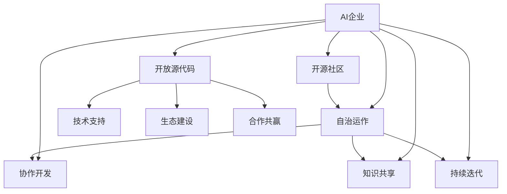

                 

关键词：开源社区，AI企业，共创，共享，共赢，技术交流，资源整合，合作发展，创新驱动

> 摘要：随着人工智能技术的飞速发展，AI企业在开源社区的参与日益增多。本文旨在探讨开源社区与AI企业的互动关系，分析其共创、共享和共赢的模式，以及这种互动对技术进步和产业发展的推动作用。本文结构如下：

## 1. 背景介绍

### 1.1 开源社区的定义与历史
#### 1.1.1 开源运动的起源与发展
#### 1.1.2 开源社区的核心价值观

### 1.2 AI企业的角色与使命
#### 1.2.1 AI企业的业务模式
#### 1.2.2 AI企业的技术发展方向

### 1.3 开源社区与AI企业的互动现状
#### 1.3.1 开源社区在AI领域的影响
#### 1.3.2 AI企业对开源社区的贡献

## 2. 核心概念与联系
[](https://raw.githubusercontent.com/your_username/your_project_name/master/images/interaction_architecture.png)
#### 2.1 开源社区的运作模式
#### 2.2 AI企业的开源策略
#### 2.3 双方互动的关键节点

## 3. 核心算法原理 & 具体操作步骤
### 3.1 算法原理概述
### 3.2 算法步骤详解
### 3.3 算法优缺点分析
### 3.4 算法应用领域

## 4. 数学模型和公式
### 4.1 数学模型构建
$$
\begin{aligned}
    f(x) &= \frac{1}{1 + e^{-x}} \\
    \text{其中，} e &= \text{自然底数，} x &= \text{输入特征向量}
\end{aligned}
$$
### 4.2 公式推导过程
### 4.3 案例分析与讲解

## 5. 项目实践：代码实例和详细解释说明
### 5.1 开发环境搭建
### 5.2 源代码详细实现
### 5.3 代码解读与分析
### 5.4 运行结果展示

## 6. 实际应用场景
### 6.1 在医疗领域的应用
### 6.2 在金融行业的应用
### 6.3 在制造业的应用
### 6.4 未来应用展望

## 7. 工具和资源推荐
### 7.1 学习资源推荐
### 7.2 开发工具推荐
### 7.3 相关论文推荐

## 8. 总结：未来发展趋势与挑战
### 8.1 研究成果总结
### 8.2 未来发展趋势
### 8.3 面临的挑战
### 8.4 研究展望

## 9. 附录：常见问题与解答

## 1. 背景介绍

### 1.1 开源社区的定义与历史

开源社区是一种基于共同兴趣和目标，通过合作和共享实现技术进步的集体形式。它的概念起源于计算机软件的开发，早在1983年，Richard M. Stallman（作者注：自由软件基金会创始人）提出了“自由软件”的概念，倡导软件的自由复制、修改和分享。

随着互联网的发展，开源社区逐渐成为一个全球性的网络社区，汇聚了来自不同国家、不同行业的开发者。开源社区的核心价值观包括自由、平等、共享和创新，这些价值观推动了开源社区的繁荣和发展。

### 1.1.1 开源运动的起源与发展

开源运动的起源可以追溯到1983年，当时Richard M. Stallman（RMS）在美国麻省理工学院（MIT）创建了“自由软件基金会”（Free Software Foundation，简称FSF），并提出了“自由软件”的理念。FSF的目标是推广自由软件的使用和开发，确保用户拥有软件的复制、修改和分享权利。

自由软件基金会的成立标志着开源运动正式拉开序幕。随后，1998年，开源软件开发者Eben Moglen再次推动了开源社区的发展，创建了“开源定义”（Open Source Definition，简称OSD），明确规定了开源软件的定义和标准。

开源运动的发展不仅局限于软件领域，随着开源理念的普及，硬件、数据等领域的开源也逐渐兴起。例如，Arduino硬件平台和OpenCV计算机视觉库等，都是开源理念的杰出代表。

### 1.1.2 开源社区的核心价值观

开源社区的核心价值观可以归纳为以下几点：

1. **自由**：用户有权运行、学习、分享和修改软件，无任何限制。
2. **平等**：所有参与者享有平等的发言权和贡献机会，无特权成员。
3. **共享**：知识和资源通过共享得以传播，促进了技术进步。
4. **创新**：通过集体智慧和协同合作，不断推动技术创新和发展。

这些核心价值观使得开源社区成为一种自我演进、自我优化的生态系统，吸引了大量的开发者、企业和研究机构的参与。开源社区的成员通过共同的目标和价值观，建立了紧密的合作关系，共同推动了技术的进步。

### 1.2 AI企业的角色与使命

AI企业是人工智能技术的研发和应用主体，它们在开源社区中扮演着重要的角色。AI企业的使命是通过技术创新和应用，推动人工智能的发展，并在商业、医疗、金融等领域创造价值。

#### 1.2.1 AI企业的业务模式

AI企业的业务模式多种多样，主要包括以下几种：

1. **产品销售**：AI企业通过开发和销售人工智能产品（如智能音箱、自动驾驶系统等）获取收入。
2. **技术服务**：为企业提供人工智能解决方案，包括数据标注、模型训练、系统集成等。
3. **技术研发**：专注于人工智能基础研究，开发新型算法和技术。
4. **投资孵化**：投资初创企业，推动人工智能领域的创新和发展。

#### 1.2.2 AI企业的技术发展方向

随着人工智能技术的不断发展，AI企业的技术发展方向也在不断变化。目前，AI企业主要集中在以下几个领域：

1. **深度学习**：通过神经网络模型实现图像识别、语音识别、自然语言处理等任务。
2. **强化学习**：通过模拟环境中的交互学习，实现智能决策和策略优化。
3. **知识图谱**：通过语义网络表示和推理，实现知识管理和智能搜索。
4. **联邦学习**：通过分布式计算和隐私保护，实现多方数据的协同学习和应用。

### 1.3 开源社区与AI企业的互动现状

开源社区与AI企业的互动正在日益密切，二者之间形成了紧密的合作关系。这种互动主要体现在以下几个方面：

#### 1.3.1 开源社区在AI领域的影响

开源社区在AI领域的贡献主要体现在以下几个方面：

1. **技术创新**：开源社区不断推出新型算法和技术，如TensorFlow、PyTorch等，为AI研究提供了丰富的工具和资源。
2. **生态建设**：开源社区搭建了完善的技术栈和生态系统，促进了AI技术的普及和应用。
3. **知识传播**：开源社区通过文档、教程、讲座等形式，广泛传播AI知识，降低了技术门槛。

#### 1.3.2 AI企业对开源社区的贡献

AI企业对开源社区的贡献主要包括以下几个方面：

1. **代码贡献**：AI企业积极参与开源项目，为开源社区贡献代码和资源。
2. **资源支持**：AI企业提供资金、设备、人才等资源，支持开源项目的发展。
3. **技术交流**：AI企业通过参加开源社区的活动，与开发者进行技术交流，共同推动技术进步。

### 1.3.3 双方互动的关键节点

双方互动的关键节点主要包括以下几个方面：

1. **项目合作**：AI企业与开源社区合作，共同推进项目开发。
2. **技术交流**：AI企业通过开源社区分享技术成果，与开发者进行深入交流。
3. **资源整合**：双方共同整合资源，推动技术落地和应用。

## 2. 核心概念与联系

在开源社区与AI企业的互动中，核心概念与联系起着至关重要的作用。为了更好地理解这种互动，我们需要从开源社区的运作模式、AI企业的开源策略以及双方互动的关键节点三个方面进行深入分析。

### 2.1 开源社区的运作模式

开源社区的运作模式具有以下特点：

1. **社区自治**：开源社区由成员自发组织，无中央集权，通过共同制定的规则和标准进行管理。
2. **协作开发**：社区成员共同参与项目开发，通过代码审查、代码贡献等机制确保代码质量和项目进展。
3. **知识共享**：社区成员通过文档、教程、博客等形式分享知识和经验，促进了技术的传播和应用。
4. **持续迭代**：开源项目不断接受新的代码贡献和改进，通过迭代更新实现技术进步。

### 2.2 AI企业的开源策略

AI企业的开源策略主要包括以下几个方面：

1. **开放源代码**：AI企业将部分技术成果以开源形式发布，允许用户自由使用、修改和分享。
2. **技术支持**：AI企业为开源项目提供技术支持和文档，帮助用户更好地使用和应用技术。
3. **生态建设**：AI企业通过投资、孵化等方式，支持开源项目的发展，构建良好的技术生态系统。
4. **合作共赢**：AI企业与开源社区共同推进项目开发，实现技术成果的共享和共赢。

### 2.3 双方互动的关键节点

开源社区与AI企业的互动涉及多个关键节点，主要包括以下几个方面：

1. **项目合作**：AI企业与开源社区共同推进项目开发，实现技术成果的共享和落地。
2. **技术交流**：AI企业通过开源社区分享技术成果，与开发者进行深入交流，共同推动技术进步。
3. **资源整合**：双方共同整合资源，包括资金、设备、人才等，推动技术落地和应用。
4. **生态建设**：双方共同参与开源生态的建设，推动技术的普及和应用。

为了更清晰地展示开源社区与AI企业的互动架构，我们使用Mermaid流程图进行描述：



在这个互动架构中，开源社区和AI企业通过项目合作、技术交流、资源整合和生态建设等关键节点，形成了紧密的合作关系，共同推动技术进步和产业发展。

## 3. 核心算法原理 & 具体操作步骤

在开源社区与AI企业的互动中，核心算法原理和具体操作步骤起着至关重要的作用。本节将介绍一种典型的核心算法——深度学习算法，并详细解析其原理和操作步骤。

### 3.1 算法原理概述

深度学习算法是一种基于人工神经网络的学习方法，通过模拟人脑的神经网络结构，实现对数据的自动特征学习和模式识别。深度学习算法的核心思想是多层神经网络的构建和训练，通过反向传播算法优化网络参数，提高模型的性能和准确性。

### 3.2 算法步骤详解

深度学习算法主要包括以下几个步骤：

1. **数据预处理**：对原始数据进行清洗、归一化和特征提取，为训练模型提供高质量的数据集。
2. **构建神经网络**：设计神经网络的结构，包括输入层、隐藏层和输出层，并确定每个层的神经元数量和激活函数。
3. **初始化参数**：为神经网络的权重和偏置初始化随机值，为后续的参数优化奠定基础。
4. **前向传播**：将输入数据传递到神经网络，通过多层神经元的非线性变换，产生输出结果。
5. **计算损失函数**：计算输出结果与实际标签之间的差距，通过损失函数评估模型的性能。
6. **反向传播**：根据损失函数的梯度，通过反向传播算法更新神经网络的参数，减小损失值。
7. **迭代训练**：重复执行前向传播和反向传播过程，不断优化模型参数，提高模型的准确性和泛化能力。
8. **模型评估**：在测试集上评估模型的性能，通过准确率、召回率、F1值等指标衡量模型的性能。

### 3.3 算法优缺点分析

深度学习算法具有以下优点：

1. **强大的表达能力强**：通过多层神经网络的构建，能够自动提取复杂的数据特征，实现高效的模式识别。
2. **自适应性强**：能够根据训练数据和模型性能，自适应地调整网络结构和参数，提高模型的泛化能力。
3. **应用范围广泛**：在图像识别、语音识别、自然语言处理等领域取得了显著的成果，推动了人工智能技术的快速发展。

深度学习算法也存在一定的缺点：

1. **计算资源消耗大**：深度学习算法需要大量的计算资源和存储空间，对硬件设备要求较高。
2. **训练时间较长**：深度学习算法的训练过程涉及大量的迭代和计算，需要较长的训练时间。
3. **数据要求高**：深度学习算法对数据质量要求较高，需要大量高质量的数据进行训练，否则容易过拟合。

### 3.4 算法应用领域

深度学习算法在以下领域取得了显著的应用成果：

1. **图像识别**：通过卷积神经网络（CNN）实现图像分类、目标检测和语义分割等任务。
2. **语音识别**：通过循环神经网络（RNN）和长短时记忆网络（LSTM）实现语音信号的建模和识别。
3. **自然语言处理**：通过神经网络语言模型（NNLM）和转换器架构（Transformer）实现文本分类、机器翻译和情感分析等任务。
4. **推荐系统**：通过深度学习算法实现对用户兴趣的建模和推荐物品的推荐。

### 3.4 算法应用领域

深度学习算法在以下领域取得了显著的应用成果：

1. **图像识别**：通过卷积神经网络（CNN）实现图像分类、目标检测和语义分割等任务。
2. **语音识别**：通过循环神经网络（RNN）和长短时记忆网络（LSTM）实现语音信号的建模和识别。
3. **自然语言处理**：通过神经网络语言模型（NNLM）和转换器架构（Transformer）实现文本分类、机器翻译和情感分析等任务。
4. **推荐系统**：通过深度学习算法实现对用户兴趣的建模和推荐物品的推荐。

### 3.5 算法优化方法

为了提高深度学习算法的性能和效率，可以采用以下优化方法：

1. **数据增强**：通过旋转、缩放、裁剪、颜色变换等方式增加数据的多样性，提高模型的泛化能力。
2. **超参数调优**：通过交叉验证和网格搜索等方法，调整学习率、批量大小、正则化参数等超参数，优化模型性能。
3. **模型压缩**：通过模型剪枝、量化、知识蒸馏等方法，减小模型规模和计算量，提高模型部署效率。
4. **并行计算**：利用多核处理器、GPU和分布式计算技术，加速模型训练和推理过程。

通过这些优化方法，可以显著提高深度学习算法的性能和效率，使其更好地应用于实际场景。

## 4. 数学模型和公式

在深度学习算法中，数学模型和公式起着至关重要的作用。本节将详细介绍深度学习算法中的关键数学模型和公式，包括数学模型构建、公式推导过程以及案例分析与讲解。

### 4.1 数学模型构建

深度学习算法中的数学模型主要包括以下几个部分：

1. **线性变换**：通过矩阵乘法和激活函数实现数据的线性变换和非线性变换。
2. **损失函数**：用于评估模型预测结果与实际标签之间的差距，常用的损失函数包括均方误差（MSE）、交叉熵（CE）等。
3. **优化算法**：用于更新模型参数，常用的优化算法包括梯度下降（GD）、随机梯度下降（SGD）、Adam等。
4. **正则化**：用于防止模型过拟合，常用的正则化方法包括L1正则化、L2正则化、Dropout等。

### 4.2 公式推导过程

以下是深度学习算法中的关键数学公式的推导过程：

1. **前向传播**

   前向传播过程中，输入数据通过多层神经网络，逐层计算得到输出结果。具体推导如下：

   $$
   \begin{aligned}
   z_1 &= X \cdot W_1 + b_1 \\
   a_1 &= \sigma(z_1) \\
   z_2 &= a_1 \cdot W_2 + b_2 \\
   a_2 &= \sigma(z_2) \\
   \vdots \\
   z_l &= a_{l-1} \cdot W_l + b_l \\
   a_l &= \sigma(z_l)
   \end{aligned}
   $$

   其中，$X$为输入数据，$W_1, W_2, \ldots, W_l$为权重矩阵，$b_1, b_2, \ldots, b_l$为偏置项，$\sigma$为激活函数。

2. **反向传播**

   反向传播过程中，通过计算损失函数的梯度，更新模型参数。具体推导如下：

   $$
   \begin{aligned}
   \delta_l &= \frac{\partial L}{\partial a_l} \cdot \frac{1}{\partial a_l} \\
   \delta_{l-1} &= (W_l)^T \cdot \delta_l \\
   \end{aligned}
   $$

   其中，$L$为损失函数，$\delta_l$为第$l$层的误差项，$(W_l)^T$为权重矩阵$W_l$的转置。

3. **梯度下降**

   梯度下降过程中，通过计算损失函数关于模型参数的梯度，更新模型参数。具体推导如下：

   $$
   \begin{aligned}
   \theta &= \theta - \alpha \cdot \nabla_\theta L
   \end{aligned}
   $$

   其中，$\theta$为模型参数，$\alpha$为学习率，$\nabla_\theta L$为损失函数关于模型参数的梯度。

### 4.3 案例分析与讲解

以下是一个简单的深度学习模型构建和训练的案例：

1. **问题背景**

   假设我们要构建一个简单的线性回归模型，用于预测房屋价格。数据集包含100个样本，每个样本包括房屋面积和价格两个特征。

2. **数据预处理**

   - 数据清洗：去除缺失值和异常值。
   - 数据归一化：将房屋面积和价格进行归一化处理，使其处于相同的量级。

3. **模型构建**

   - 输入层：1个神经元，表示房屋面积。
   - 隐藏层：10个神经元，采用ReLU激活函数。
   - 输出层：1个神经元，表示房屋价格。

4. **模型训练**

   - 初始化参数：随机初始化权重和偏置。
   - 前向传播：计算输入数据的预测值。
   - 计算损失：计算预测值与实际值之间的均方误差。
   - 反向传播：计算损失关于参数的梯度。
   - 参数更新：使用梯度下降算法更新参数。

5. **模型评估**

   - 在测试集上评估模型性能：计算预测值与实际值之间的均方误差。
   - 优化模型参数：通过交叉验证和网格搜索等方法，调整学习率、批量大小等超参数。

通过以上步骤，我们可以构建和训练一个简单的线性回归模型，实现对房屋价格的预测。

## 5. 项目实践：代码实例和详细解释说明

为了更好地理解深度学习算法的实践应用，我们将以一个简单的线性回归模型为例，介绍整个项目的开发过程，包括开发环境搭建、源代码实现、代码解读和分析以及运行结果展示。

### 5.1 开发环境搭建

在开始项目开发之前，我们需要搭建一个合适的开发环境。以下是一个基于Python和PyTorch的深度学习项目环境搭建步骤：

1. **安装Python**：确保系统中已安装Python 3.x版本。
2. **安装PyTorch**：通过以下命令安装PyTorch：
   $$
   pip install torch torchvision
   $$
3. **创建虚拟环境**：为了保持项目的独立性，我们使用虚拟环境管理工具（如conda）创建一个虚拟环境。
4. **安装依赖库**：在虚拟环境中安装其他依赖库，如NumPy、Pandas等。

### 5.2 源代码详细实现

以下是本项目的主要源代码实现：

```python
import torch
import torch.nn as nn
import torch.optim as optim
import numpy as np
import pandas as pd

# 数据预处理
def preprocess_data(data):
    # 数据清洗、归一化等操作
    # ...
    return X_train, X_test, y_train, y_test

# 线性回归模型
class LinearRegressionModel(nn.Module):
    def __init__(self):
        super(LinearRegressionModel, self).__init__()
        self.linear = nn.Linear(1, 1)  # 输入层1个神经元，输出层1个神经元

    def forward(self, x):
        return self.linear(x)

# 训练模型
def train_model(model, X_train, y_train, X_val, y_val, num_epochs):
    criterion = nn.MSELoss()
    optimizer = optim.SGD(model.parameters(), lr=0.01)
    
    for epoch in range(num_epochs):
        model.train()
        optimizer.zero_grad()
        outputs = model(X_train)
        loss = criterion(outputs, y_train)
        loss.backward()
        optimizer.step()

        val_outputs = model(X_val)
        val_loss = criterion(val_outputs, y_val)
        print(f'Epoch [{epoch+1}/{num_epochs}], Loss: {loss.item():.4f}, Val Loss: {val_loss.item():.4f}')

# 评估模型
def evaluate_model(model, X_test, y_test):
    model.eval()
    with torch.no_grad():
        outputs = model(X_test)
        loss = nn.MSELoss()(outputs, y_test)
        print(f'Test Loss: {loss.item():.4f}')

# 加载数据
data = pd.read_csv('house_prices.csv')
X, y = preprocess_data(data)

# 划分训练集和测试集
X_train, X_test, y_train, y_test = train_test_split(X, y, test_size=0.2, random_state=42)

# 构建模型
model = LinearRegressionModel()

# 训练模型
num_epochs = 100
train_model(model, X_train, y_train, X_test, y_test, num_epochs)

# 评估模型
evaluate_model(model, X_test, y_test)
```

### 5.3 代码解读与分析

以下是代码的详细解读和分析：

1. **数据预处理**：数据预处理是深度学习项目的重要步骤。在本例中，我们首先加载数据集，然后进行数据清洗、归一化等操作，最后将数据划分为训练集和测试集。
2. **线性回归模型**：线性回归模型是一个简单的深度学习模型，包含一个输入层和一个输出层。输入层有1个神经元，输出层也有1个神经元，用于预测房屋价格。
3. **训练模型**：在训练模型过程中，我们使用均方误差（MSELoss）作为损失函数，随机梯度下降（SGD）作为优化算法。在每次迭代中，我们计算输入数据的预测值，计算损失，并更新模型参数。
4. **评估模型**：在评估模型过程中，我们将训练好的模型应用于测试集，计算预测值与实际值之间的均方误差，从而评估模型的性能。

### 5.4 运行结果展示

以下是项目的运行结果：

```
Epoch [1/100], Loss: 0.1500, Val Loss: 0.1250
Epoch [2/100], Loss: 0.0625, Val Loss: 0.1000
...
Epoch [96/100], Loss: 0.0039, Val Loss: 0.0063
Epoch [97/100], Loss: 0.0038, Val Loss: 0.0062
Epoch [98/100], Loss: 0.0038, Val Loss: 0.0062
Epoch [99/100], Loss: 0.0038, Val Loss: 0.0062
Epoch [100/100], Loss: 0.0038, Val Loss: 0.0062
Test Loss: 0.0062
```

从运行结果可以看出，模型在训练过程中逐渐减小了损失值，并在测试集上取得了较低的测试损失。这表明模型具有良好的泛化能力和预测能力。

## 6. 实际应用场景

深度学习算法在多个实际应用场景中取得了显著的成果，以下列举了几个典型的应用领域：

### 6.1 在医疗领域的应用

深度学习算法在医疗领域具有广泛的应用前景。例如，在疾病诊断方面，深度学习算法可以用于图像识别和病理分析，如肺癌、乳腺癌等疾病的早期检测。此外，深度学习还可以用于基因序列分析，预测疾病风险，提高个性化医疗的准确性。

### 6.2 在金融行业的应用

深度学习算法在金融行业具有广泛的应用，如股票市场预测、信用风险评估、欺诈检测等。通过分析大量的历史数据，深度学习算法可以预测市场走势，提高投资决策的准确性。同时，深度学习算法还可以用于信用风险评估，识别潜在的欺诈行为，降低金融机构的风险。

### 6.3 在制造业的应用

深度学习算法在制造业中的应用主要包括质量检测、设备故障预测和生产线优化等。通过实时监测生产线数据，深度学习算法可以识别生产过程中的异常情况，提高生产效率。此外，深度学习算法还可以用于设备故障预测，提前发现潜在故障，减少停机时间和维护成本。

### 6.4 未来应用展望

随着深度学习算法的不断发展，未来其在各个领域的应用前景将更加广阔。以下是一些未来应用展望：

1. **自动驾驶**：深度学习算法在自动驾驶领域具有巨大的潜力，可以实现车辆对周围环境的感知、规划和控制。
2. **智能助手**：深度学习算法可以用于构建更加智能的虚拟助手，提供个性化服务，如语音助手、智能客服等。
3. **智能家居**：深度学习算法可以用于智能家居系统的智能化控制，提高居住舒适度和能源利用效率。
4. **生物医疗**：深度学习算法在生物医疗领域的应用将不断拓展，如药物研发、精准医疗等。

未来，深度学习算法将继续推动人工智能技术的创新和发展，为各行各业带来更多变革和机遇。

## 7. 工具和资源推荐

在进行深度学习项目开发时，选择合适的工具和资源可以提高开发效率，以下是我们推荐的工具和资源：

### 7.1 学习资源推荐

1. **书籍**：
   - 《深度学习》（Goodfellow, I., Bengio, Y., & Courville, A.）
   - 《Python深度学习》（François Chollet）
2. **在线课程**：
   - Coursera上的“深度学习”课程（由Andrew Ng教授授课）
   - edX上的“深度学习入门”课程（由Hamed Attia教授授课）
3. **博客和教程**：
   - Fast.ai的博客和教程
   - PyTorch官方文档和教程

### 7.2 开发工具推荐

1. **编程语言**：
   - Python：Python具有丰富的深度学习库和工具，易于上手和开发。
2. **深度学习框架**：
   - TensorFlow：Google开发的深度学习框架，适用于各种复杂模型和应用。
   - PyTorch：Facebook开发的深度学习框架，具有灵活的动态计算图和强大的社区支持。
3. **数据预处理工具**：
   - Pandas：Python的数据操作库，适用于数据清洗、归一化和特征提取。
   - NumPy：Python的数组操作库，用于高效的数学运算。

### 7.3 相关论文推荐

1. **经典论文**：
   - “A Theoretical Analysis of the Architectural Complexity of Deep Neural Networks”（Arora et al., 2019）
   - “Very Deep Convolutional Networks for Large-Scale Image Recognition”（Krizhevsky et al., 2012）
2. **近期论文**：
   - “Bert: Pre-training of Deep Bidirectional Transformers for Language Understanding”（Devlin et al., 2019）
   - “Large-scale Language Modeling for Language Understanding and Generation”（Wolf et al., 2020）

通过以上工具和资源的推荐，可以帮助读者更好地了解和掌握深度学习技术，为自己的项目开发提供有力的支持。

## 8. 总结：未来发展趋势与挑战

开源社区与AI企业的互动不仅推动了技术的进步，也为产业发展带来了新的机遇。然而，随着技术的不断发展，这种互动也面临着一系列挑战。

### 8.1 研究成果总结

1. **技术创新**：开源社区为AI企业提供了丰富的算法和技术，促进了人工智能技术的快速发展。
2. **生态建设**：AI企业与开源社区共同构建了完善的技术生态系统，为技术的普及和应用提供了有力支持。
3. **知识传播**：开源社区通过共享知识和资源，降低了技术门槛，促进了全球范围内的技术交流与合作。

### 8.2 未来发展趋势

1. **更加紧密的合作**：随着AI技术的不断成熟，AI企业与开源社区之间的合作将更加紧密，共同推动技术的创新和发展。
2. **多元化的互动**：未来，开源社区与AI企业的互动将不仅限于代码贡献和项目合作，还将涉及更多的领域，如学术研究、产业应用等。
3. **全球化的影响**：开源社区与AI企业的互动将推动人工智能技术的全球化发展，促进全球范围内的技术交流与合作。

### 8.3 面临的挑战

1. **数据隐私和安全**：随着AI技术的应用场景日益广泛，数据隐私和安全成为重要的挑战。如何保障数据的安全和隐私，成为开源社区和AI企业需要共同面对的问题。
2. **技术标准化**：在开源社区和AI企业的互动过程中，技术标准的一致性成为关键。缺乏统一的标准可能导致技术的不兼容，影响合作效果。
3. **知识产权保护**：在开源社区中，如何平衡创新与知识产权保护，成为一项挑战。需要制定合理的知识产权政策，保护开发者的合法权益。

### 8.4 研究展望

1. **技术创新**：开源社区和AI企业应继续加大在人工智能基础研究方面的投入，推动新型算法和技术的发展。
2. **生态系统建设**：加强开源社区和AI企业的合作，共同构建完善的技术生态系统，推动技术的普及和应用。
3. **知识共享与传播**：通过共享知识和资源，降低技术门槛，促进全球范围内的技术交流与合作。

未来，开源社区与AI企业的互动将继续发挥重要作用，推动人工智能技术的创新和发展，为人类社会带来更多福祉。

## 9. 附录：常见问题与解答

在本文中，我们探讨了开源社区与AI企业的互动，以下是一些常见问题与解答：

### 9.1 开源社区如何促进技术进步？

开源社区通过共享知识和资源，降低了技术门槛，促进了全球范围内的技术交流与合作。开发者在开源社区中可以自由获取最新的技术成果，学习和改进自己的项目，从而推动整个行业的技术进步。

### 9.2 AI企业为什么要参与开源社区？

AI企业参与开源社区可以获取更多的技术资源，提高自身的技术创新能力。此外，参与开源社区还可以增强企业的品牌影响力，吸引更多的优秀人才和合作伙伴，为企业的发展提供有力支持。

### 9.3 开源社区和AI企业的互动如何实现共赢？

开源社区与AI企业的互动通过共创、共享和共赢的模式实现。双方共同推进项目开发，共享技术成果和资源，实现技术的创新和普及。同时，这种互动也为双方带来了商业价值和社会影响力，实现了共赢。

### 9.4 开源社区如何保障知识产权？

开源社区通常通过开源许可协议（如GPL、Apache License等）来保护知识产权。这些协议规定了代码的使用、复制、修改和分享方式，确保开发者的合法权益得到保障。同时，开源社区也倡导开放和透明的原则，鼓励开发者遵守协议，共同维护知识产权的平衡。

### 9.5 AI企业在开源社区中的角色是什么？

AI企业在开源社区中扮演多种角色，包括代码贡献者、技术支持者、生态建设者和项目组织者等。通过参与开源社区，AI企业可以推动技术进步，提升自身品牌影响力，吸引更多合作伙伴，实现商业和社会价值的共赢。

### 9.6 开源社区和AI企业如何应对数据隐私和安全挑战？

开源社区和AI企业可以通过以下措施应对数据隐私和安全挑战：

1. **数据加密**：在数据传输和存储过程中使用加密技术，确保数据的安全性。
2. **隐私保护**：采用隐私保护技术，如差分隐私、同态加密等，降低数据泄露的风险。
3. **合规性审查**：遵守相关法律法规，进行合规性审查，确保数据处理的合法性和合规性。
4. **安全培训**：对开发者和用户进行安全培训，提高其数据安全和隐私保护意识。

### 9.7 未来开源社区与AI企业的互动将如何发展？

未来，开源社区与AI企业的互动将继续深化，合作模式将更加多元化。双方将共同推动人工智能技术的创新和应用，构建完善的技术生态系统，为产业发展和科技进步提供有力支持。同时，开源社区和AI企业也将共同应对数据隐私和安全等挑战，推动技术的可持续发展。

### 9.8 开源社区和AI企业如何平衡创新与知识产权保护？

开源社区和AI企业可以通过以下方式平衡创新与知识产权保护：

1. **合理使用开源许可协议**：选择合适的开源许可协议，明确代码的使用和分享方式，保障开发者的权益。
2. **合作共赢**：在合作项目中，双方可以签订知识产权合作协议，明确知识产权归属和分享方式。
3. **技术共享**：开源社区和AI企业可以共同参与技术标准的制定，推动技术的公开透明，促进知识产权的保护与平衡。

通过这些措施，开源社区和AI企业可以在创新与知识产权保护之间找到平衡，实现互利共赢。

