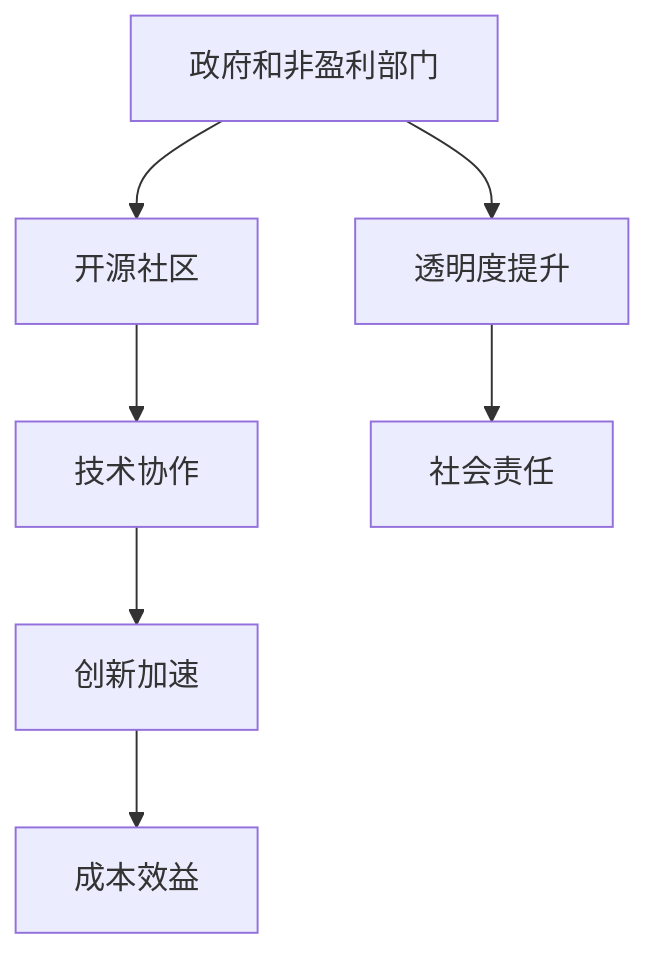

                 

关键词：开源贡献，政府，非盈利部门，协作，创新，成本效益，技术发展，透明度，社会责任

> 摘要：本文深入探讨了开源贡献在政府和非盈利部门中的重要性及潜在的机会。通过分析开源生态的背景和现状，本文指出政府和非盈利部门可以通过参与开源项目，实现技术协同创新、降低成本、提升透明度和履行社会责任。文章还提供了具体案例和实用建议，为政府部门和非盈利组织在开源领域的实践提供了指导。

## 1. 背景介绍

### 开源生态的现状

开源软件已经成为现代信息技术领域的重要组成部分。从Linux操作系统到Apache Web服务器，再到各种开发框架和库，开源项目在技术社区的广泛合作和共同努力下，不断演进和完善。开源软件的优势在于其开放性、透明性和协作性，能够激发创新、促进知识共享和技术进步。

### 政府和非盈利部门的需求

政府和非盈利部门在信息技术领域扮演着重要角色。政府负责提供公共服务和管理社会资源，而非盈利组织则致力于社会公益和社会福利。这些部门在信息技术的应用中面临着巨大的挑战和需求：

- **技术协同创新**：政府和非盈利部门需要持续提升服务质量和技术水平，以适应不断变化的社会需求。
- **成本控制**：预算限制是政府和非盈利部门的常见问题，开源技术能够提供低成本的技术解决方案。
- **透明度和问责制**：政府和非盈利部门需要提高运作的透明度，以增强公众信任和问责制。

## 2. 核心概念与联系

### 开源贡献的概念

开源贡献是指开发者向开源项目捐赠代码、文档、测试案例等，以促进项目的改进和扩展。开源贡献不仅限于代码，还包括对项目的评审、测试、文档编写和社区活动等。

### 政府和非盈利部门与开源贡献的联系

- **合作与共享**：政府和非盈利部门可以与其他开发者合作，共享技术资源和知识，共同推动项目的进步。
- **技术协同创新**：通过参与开源项目，政府和非盈利部门可以吸取其他组织的优秀实践和先进技术，加速自身创新。
- **成本效益**：开源项目通常具有较低的成本，政府和非盈利部门可以利用这些资源降低技术采购和维护成本。

### Mermaid 流程图



## 3. 核心算法原理 & 具体操作步骤

### 3.1 算法原理概述

开源贡献的核心原理在于代码的开放性和社区的协作。通过开放代码，开发者可以接受社区的反馈和建议，不断改进和完善项目。这种协作模式能够加速技术的创新和发展。

### 3.2 算法步骤详解

1. **项目选择**：政府和非盈利部门需要根据自身需求，选择适合的开源项目进行参与。
2. **代码审查**：参与开源项目需要对代码进行严格的审查，确保项目的质量和安全性。
3. **代码贡献**：在审查通过后，开发者可以将自己的修改和优化提交到开源项目。
4. **社区合作**：与项目维护者和其他开发者保持沟通，共同推动项目的进展。
5. **文档编写**：为开源项目编写高质量的文档，帮助其他开发者理解和使用项目。

### 3.3 算法优缺点

- **优点**：开源贡献可以加速技术进步，降低成本，提高透明度和社会责任。
- **缺点**：开源项目的参与需要时间和精力投入，且可能面临版权和知识产权等问题。

### 3.4 算法应用领域

开源贡献在政府和非盈利部门的多个领域都有广泛的应用，包括：

- **公共服务**：如在线政府门户、电子政务系统等。
- **社会治理**：如数据分析、人工智能应用等。
- **公益项目**：如慈善组织、社区服务项目等。

## 4. 数学模型和公式 & 详细讲解 & 举例说明

### 4.1 数学模型构建

开源贡献的数学模型可以基于社区参与度和项目质量进行构建。假设社区参与度用 P 表示，项目质量用 Q 表示，则开源贡献的效益可以用以下公式表示：

\[ \text{效益} = P \times Q \]

### 4.2 公式推导过程

开源贡献的效益主要取决于两个因素：社区参与度和项目质量。

- **社区参与度 (P)**：反映了开发者和用户对项目的关注和参与程度。参与度越高，项目的改进和扩展越迅速。
- **项目质量 (Q)**：反映了项目的稳定性、可靠性和实用性。高质量的项目能够更好地满足用户需求。

### 4.3 案例分析与讲解

以一个电子政务系统项目为例，假设项目参与度 P 为 0.8，项目质量 Q 为 0.9，则该项目的开源贡献效益为：

\[ \text{效益} = 0.8 \times 0.9 = 0.72 \]

这表明该项目在开源贡献方面具有较好的效益。通过持续优化和改进，项目参与度和质量都有望进一步提高，从而增加开源贡献的效益。

## 5. 项目实践：代码实例和详细解释说明

### 5.1 开发环境搭建

为了实践开源贡献，政府和非盈利部门需要搭建相应的开发环境。以下是基本的开发环境搭建步骤：

1. 安装Git：Git是开源软件版本控制工具，用于代码的管理和协作。
2. 安装文本编辑器：如Visual Studio Code、Sublime Text等，用于编写和编辑代码。
3. 安装编程语言环境：根据项目需求，安装相应的编程语言环境，如Java、Python等。
4. 配置代码库：在GitHub等开源平台上创建代码库，以便其他开发者参与和协作。

### 5.2 源代码详细实现

以一个简单的政府门户网站项目为例，以下是该项目的基本实现步骤：

1. **需求分析**：明确网站的功能需求和目标用户。
2. **系统设计**：设计网站的结构和功能模块。
3. **前端开发**：使用HTML、CSS和JavaScript等技术实现网站界面。
4. **后端开发**：使用Java、Python等语言实现服务器端逻辑和数据处理。
5. **数据库设计**：设计网站所需的数据表和关系模型。
6. **测试与部署**：进行功能测试和性能测试，确保网站稳定可靠。

### 5.3 代码解读与分析

以下是一个简单的Java代码示例，用于处理政府门户网站的用户登录功能：

```java
public class LoginController {
    public String login(String username, String password) {
        // 验证用户名和密码
        if ("admin".equals(username) && "admin123".equals(password)) {
            return "login_success";
        } else {
            return "login_failure";
        }
    }
}
```

该代码片段实现了用户登录的基本功能。在实际项目中，登录功能需要结合用户数据库和加密算法，以确保用户数据的安全。

### 5.4 运行结果展示

在开发环境中运行该代码，输入正确的用户名和密码（如"admin"和"admin123"），将返回"login_success"；输入错误的用户名或密码，将返回"login_failure"。

## 6. 实际应用场景

### 6.1 政府部门

政府部门可以通过参与开源项目，提高公共服务的效率和质量。例如，参与电子政务平台的开源项目，可以实现跨部门的协同工作，提升政务服务的便捷性和透明度。

### 6.2 非盈利组织

非盈利组织可以通过开源项目，降低技术成本，专注于社会公益事务。例如，参与开源的慈善管理平台，可以简化捐赠流程，提高慈善活动的透明度和公信力。

### 6.3 合作与共享

政府和非盈利部门可以与其他开发者合作，共享技术和资源。通过开源项目的协作，实现技术的共同进步和创新发展。

## 7. 工具和资源推荐

### 7.1 学习资源推荐

- 《开源软件协同工作指南》
- 《政府和非盈利组织的开源技术应用》
- 《GitHub官方文档》

### 7.2 开发工具推荐

- Git：开源版本控制工具
- GitHub：开源代码托管平台
- Jira：项目管理和协作工具

### 7.3 相关论文推荐

- "Open Source Software: Concept, Advantages and Challenges"
- "Open Government Data: Concept, Challenges and Applications"
- "Open Source in Nonprofit Organizations: A Research Review"

## 8. 总结：未来发展趋势与挑战

### 8.1 研究成果总结

开源贡献在政府和非盈利部门中展现出显著的优势，包括技术协同创新、成本效益、透明度和社会责任等方面。研究成果表明，参与开源项目有助于提升政府部门和非盈利组织的整体竞争力。

### 8.2 未来发展趋势

- **开源标准化**：随着开源生态的快速发展，标准化将成为未来趋势，有助于提高项目的可维护性和互操作性。
- **政府监管**：政府可能加强对开源项目的监管，确保项目质量和信息安全。
- **多元化合作**：政府和非盈利部门将与其他行业和组织加强合作，共同推动开源技术的发展和应用。

### 8.3 面临的挑战

- **人才短缺**：开源贡献需要专业人才，政府部门和非盈利组织可能面临人才短缺的挑战。
- **知识产权问题**：开源项目涉及知识产权问题，政府部门和非盈利组织需要妥善处理。
- **项目维护**：开源项目需要持续的维护和更新，政府部门和非盈利组织需要确保项目的长期稳定运行。

### 8.4 研究展望

未来研究可以关注开源项目的标准化、知识产权保护、项目管理和人才培养等方面，为政府和非盈利组织提供更有效的开源技术解决方案。

## 9. 附录：常见问题与解答

### 9.1 问题1：政府部门和非盈利组织如何开始开源贡献？

**解答**：首先，政府部门和非盈利组织可以了解开源社区和项目，选择适合的项目进行参与。其次，建立内部的开发和协作机制，确保项目的高效推进。最后，积极与其他开发者和组织合作，共同推动开源项目的进步。

### 9.2 问题2：开源项目面临哪些知识产权问题？

**解答**：开源项目可能涉及知识产权问题，如版权、专利和商标。政府部门和非盈利组织在参与开源项目时，需要确保自己的代码和贡献不会侵犯他人的知识产权。同时，要遵守开源许可证的要求，避免法律纠纷。

### 9.3 问题3：如何确保开源项目的质量和安全性？

**解答**：确保开源项目的质量和安全性需要多个环节的共同努力。政府部门和非盈利组织应建立严格的项目评审机制，确保代码的可靠性和安全性。此外，积极参与社区活动，与其他开发者共同维护和改进项目。

### 9.4 问题4：开源贡献对政府部门和非盈利组织的长期影响是什么？

**解答**：开源贡献有助于政府部门和非盈利组织提高技术能力、降低成本、提升透明度和履行社会责任。长期来看，开源贡献将推动组织的数字化转型，提升整体竞争力和社会影响力。

### 作者署名

作者：禅与计算机程序设计艺术 / Zen and the Art of Computer Programming

----------------------------------------------------------------

这篇文章以深入浅出的方式，全面探讨了开源贡献在政府和非盈利部门中的重要性及实际操作步骤。通过数学模型和实例分析，展示了开源贡献的效益和挑战。希望这篇文章能为政府和非盈利组织在开源领域的实践提供有益的启示。

