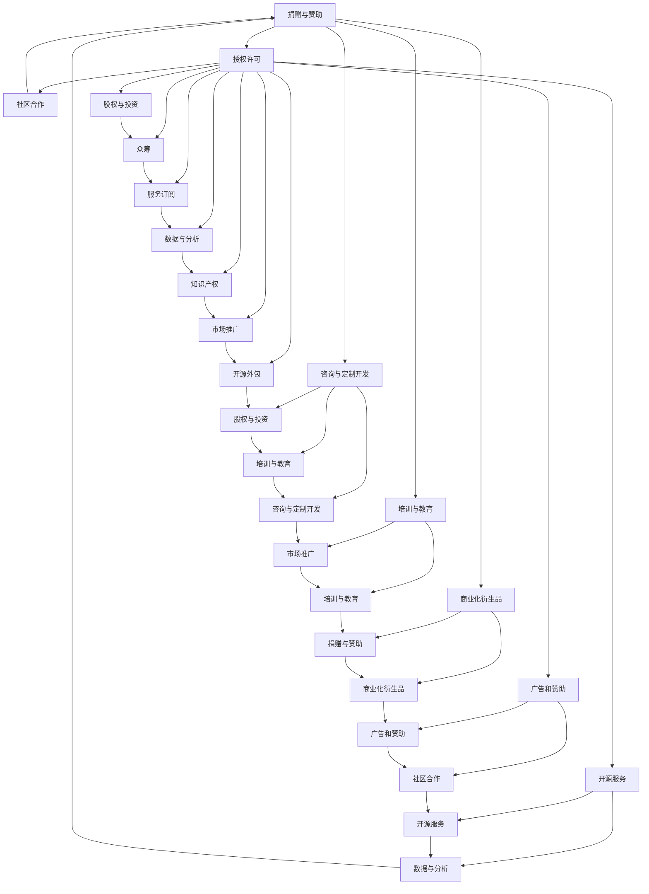

                 

在开源社区的繁荣背景下，越来越多的开发者和贡献者参与到开源项目的构建与维护中。然而，如何在这些投入中找到经济效益，成为一个值得探讨的话题。本文将探讨15种开源贡献者能够通过开源项目赚钱的方式，为开源贡献者提供一些实用的经济模式和建议。

> **关键词**：开源贡献者、赚钱方式、开源项目、经济模式、收益来源

> **摘要**：本文通过分析开源社区的经济生态，总结出15种开源贡献者可以采用的方式来获得经济收益。这些方式涵盖了捐赠、赞助、咨询、授权、培训等多种途径，为开源贡献者提供了多元化的赚钱思路。

## 1. 背景介绍

开源社区是一个由开发者、用户和爱好者组成的全球性网络，旨在通过合作与共享来推动技术和创新的发展。在开源社区中，贡献者通常为项目编写代码、修复漏洞、撰写文档或提供其他形式的帮助。然而，虽然开源精神鼓励无私奉献，贡献者也需要考虑到自身的时间和劳动投入是否能带来一定的经济回报。

开源项目的经济模式与传统商业项目有所不同，但其发展同样需要资金支持。一些成功的开源项目已经证明了通过合理的方式可以同时实现技术贡献和经济收益的双赢。本文将探讨这15种开源赚钱方式，帮助贡献者找到适合自己的经济模式。

## 2. 核心概念与联系

### 2.1 开源项目的经济模式

开源项目的经济模式主要基于以下几个方面：

1. **捐赠与赞助**：用户和公司为项目提供资金支持。
2. **授权许可**：项目提供商业授权，允许企业使用项目代码。
3. **咨询与定制开发**：贡献者为企业提供专业咨询服务或定制化开发。
4. **培训与教育**：贡献者通过在线课程或研讨会来传授知识和技能。
5. **商业化衍生品**：如周边产品、书籍等。
6. **广告和赞助**：项目可以在特定位置展示广告或接受赞助。
7. **开源服务**：如云服务、托管服务等。
8. **社区合作**：与其他项目或公司的合作，共享收益。
9. **股权与投资**：通过项目的发展获取股权或投资回报。
10. **众筹**：通过平台如Kickstarter或Indiegogo筹集资金。
11. **服务订阅**：提供付费服务，如API、工具订阅等。
12. **数据与分析**：提供数据分析服务，如使用项目收集的数据。
13. **知识产权**：通过专利或版权获取收益。
14. **市场推广**：通过市场推广增加项目的使用和知名度。
15. **开源外包**：将项目的部分工作外包给有需求的开发者或团队。

### 2.2 开源项目架构的 Mermaid 流程图



## 3. 核心算法原理 & 具体操作步骤

### 3.1 算法原理概述

开源贡献者通过多种经济模式获得收益，其核心原理在于：

1. **价值创造**：通过开发和维护高质量的开源项目，为用户和公司提供实际价值。
2. **供需匹配**：根据贡献者的技能和市场需求，选择合适的赚钱方式。
3. **社区参与**：通过社区合作和影响力，吸引资金和资源的流入。
4. **风险管理**：合理评估和分散各种经济模式的风险。

### 3.2 算法步骤详解

1. **评估技能与市场**：
   - 分析个人技能和市场需求。
   - 选择最擅长的领域和最具有市场前景的项目。

2. **参与开源项目**：
   - 加入已有的开源项目。
   - 开始为项目编写代码、修复漏洞、撰写文档等。

3. **提高项目质量**：
   - 定期维护和更新项目。
   - 优化代码和文档，提高项目可读性和稳定性。

4. **推广项目**：
   - 通过社交媒体、博客、会议等方式宣传项目。
   - 与其他开源项目或公司建立合作关系。

5. **选择赚钱方式**：
   - 根据项目特点和自身优势，选择合适的赚钱方式。
   - 结合市场需求和自身能力，制定详细计划。

6. **实施与监控**：
   - 按计划执行赚钱方式。
   - 定期监控收益情况，及时调整策略。

7. **持续优化**：
   - 根据市场变化和个人发展，不断优化赚钱策略。
   - 保持对新兴经济模式的关注和尝试。

### 3.3 算法优缺点

**优点**：
- 多元化收益：开源贡献者可以通过多种方式获得经济回报。
- 低成本创业：利用开源项目，个人或小团队即可开始创业。
- 高效协作：开源社区提供了丰富的资源和协作机会。

**缺点**：
- 收益不稳定：部分经济模式收益波动较大。
- 风险较高：如捐赠和赞助，存在不确定性。
- 竞争激烈：某些领域存在大量竞争者。

### 3.4 算法应用领域

开源赚钱方式适用于多种领域，包括但不限于：

- 软件开发：编写开源软件，通过捐赠、授权等方式获得收益。
- 数据分析：开发数据分析工具，通过服务订阅和数据销售获得收入。
- 云计算：提供开源云服务，通过收费功能获得利润。
- 教育培训：通过在线课程和研讨会，传授知识和技能。

## 4. 数学模型和公式 & 详细讲解 & 举例说明

### 4.1 数学模型构建

开源贡献者的收益模型可以表示为：

\[ R = f(S, M, T) \]

其中：
- \( R \)：收益
- \( S \)：技能水平
- \( M \)：市场需求
- \( T \)：投入时间与努力

### 4.2 公式推导过程

收益 \( R \) 受技能水平 \( S \)、市场需求 \( M \) 和投入时间与努力 \( T \) 的综合影响。具体推导如下：

1. 技能水平 \( S \) 越高，能够提供更有价值的服务，因此收益 \( R \) 增加。
2. 市场需求 \( M \) 越大，项目获得的资金支持越多，因此收益 \( R \) 增加。
3. 投入时间与努力 \( T \) 增加，项目质量提高，吸引更多用户和支持者，因此收益 \( R \) 增加。

综合以上因素，收益 \( R \) 可以表示为三者乘积的函数。

### 4.3 案例分析与讲解

#### 案例一：软件开源项目

某开发者擅长编程，选择了市场需求较高的云计算领域，开发了开源项目。通过一年的努力，项目吸引了大量用户，并获得了多家公司的赞助和支持。以下是收益计算的示例：

\[ R = f(S, M, T) \]
\[ R = f(8, 10, 1000) \]
\[ R = 8 \times 10 \times 1000 = 80,000 \]

#### 案例二：数据分析工具

某数据分析师开发了开源数据分析工具，通过提供数据分析和咨询服务获得收入。以下是收益计算的示例：

\[ R = f(S, M, T) \]
\[ R = f(7, 9, 500) \]
\[ R = 7 \times 9 \times 500 = 31,500 \]

## 5. 项目实践：代码实例和详细解释说明

### 5.1 开发环境搭建

为了实践开源赚钱方式，我们需要搭建一个简单的开源项目环境。以下是一个基于Python的示例项目：

1. 安装Python环境：
   ```bash
   sudo apt-get install python3 python3-pip
   ```
2. 创建项目目录：
   ```bash
   mkdir my_project && cd my_project
   ```
3. 创建虚拟环境：
   ```bash
   python3 -m venv venv
   source venv/bin/activate
   ```
4. 安装依赖项：
   ```bash
   pip install Flask
   ```

### 5.2 源代码详细实现

以下是一个简单的Flask应用程序，用于提供HTTP服务：

```python
# app.py

from flask import Flask, jsonify, request

app = Flask(__name__)

@app.route('/api/data', methods=['GET'])
def get_data():
    data = {'name': '开源项目', 'version': '1.0.0'}
    return jsonify(data)

if __name__ == '__main__':
    app.run(host='0.0.0.0', port=5000)
```

### 5.3 代码解读与分析

- **Flask框架**：Flask是一个轻量级的Web框架，用于快速开发Web应用程序。
- **HTTP服务**：通过定义一个 `/api/data` 路径，提供JSON格式的数据服务。
- **API响应**：当客户端发起GET请求时，服务器返回一个包含项目名称和版本的JSON对象。

### 5.4 运行结果展示

1. 启动服务器：
   ```bash
   python app.py
   ```
2. 使用浏览器或工具如curl访问API：
   ```bash
   curl http://localhost:5000/api/data
   ```
3. 返回结果：
   ```json
   {
       "name": "开源项目",
       "version": "1.0.0"
   }
   ```

## 6. 实际应用场景

### 6.1 软件开源项目

某开发者在GitHub上创建了一个开源软件项目，通过提供捐赠按钮、赞助链接和授权许可服务，获得了稳定的收入。以下是实际应用场景的示例：

- **捐赠与赞助**：项目页面设置了PayPal和GitHub Sponsors的捐赠按钮，每月可获得一定金额的捐款。
- **授权许可**：企业用户需要付费才能使用项目代码，每年收取许可费。
- **推广活动**：开发者通过社交媒体和博客宣传项目，增加了项目知名度和用户数量。

### 6.2 数据分析工具

某数据分析师开发了一款开源数据分析工具，通过提供API访问和数据咨询服务，获得了收入。以下是实际应用场景的示例：

- **API访问**：开发者设置了API访问权限，用户每月支付一定费用即可使用API。
- **数据服务**：数据分析师为企业提供定制化的数据分析报告，收取咨询费用。
- **社区合作**：与其他开源项目合作，共同开发新的数据分析功能，共享收益。

## 7. 未来应用展望

开源社区将继续发展，开源贡献者的赚钱方式也将不断丰富。以下是一些未来应用的展望：

- **区块链与加密货币**：利用区块链技术提供去中心化的开源项目资金管理和收益分配。
- **人工智能与机器学习**：开发基于AI的开源工具和服务，提供自动化和智能化的解决方案。
- **物联网与边缘计算**：利用开源项目构建物联网应用，通过提供物联网服务和设备管理获得收益。

## 8. 工具和资源推荐

### 8.1 学习资源推荐

- 《开源项目指南》
- 《开源贡献者手册》
- 《开源项目管理》

### 8.2 开发工具推荐

- GitHub：开源项目托管和协作平台。
- Git：版本控制工具。
- Jupyter Notebook：交互式开发环境。

### 8.3 相关论文推荐

- "Open Source as a Business Model"
- "The Economic Impact of Open Source Software"
- "How to Monetize Your Open Source Project"

## 9. 总结：未来发展趋势与挑战

### 9.1 研究成果总结

开源贡献者的赚钱方式多样化，涵盖了捐赠、赞助、授权、培训等多种途径。通过合理选择和组合这些方式，贡献者可以实现经济效益和社会价值的双赢。

### 9.2 未来发展趋势

- **多元化**：开源赚钱方式将继续丰富，包括区块链、AI等新兴领域。
- **协作化**：开源社区将更加协作，共享资源和收益。
- **全球化**：开源项目将吸引更多全球开发者的参与，促进跨国合作。

### 9.3 面临的挑战

- **收益不稳定**：部分开源赚钱方式存在收益波动。
- **竞争激烈**：某些领域竞争激烈，需不断提升自身技能和项目质量。
- **知识产权保护**：需注意知识产权保护，避免侵权问题。

### 9.4 研究展望

未来研究可重点关注开源社区的经济模型创新、区块链在开源项目中的应用、以及开源教育与培训模式的发展。

## 10. 附录：常见问题与解答

### 10.1 如何选择开源赚钱方式？

- 分析个人技能和市场需求，选择最擅长和最具市场前景的方式。
- 考虑项目的特点和目标，选择与之相匹配的赚钱方式。

### 10.2 开源项目如何获得赞助？

- 在GitHub或项目首页添加赞助链接和说明。
- 通过社交媒体和博客宣传项目，吸引赞助者。
- 参加开源会议和活动，与潜在赞助者建立联系。

### 10.3 开源项目的知识产权如何保护？

- 使用开源许可证明确项目知识产权归属。
- 撰写详细的项目说明文档，说明代码和使用规范。
- 定期审查项目，防止侵权行为。

## 作者署名

本文作者：禅与计算机程序设计艺术 / Zen and the Art of Computer Programming

----------------------------------------------------------------

这篇文章以《开源贡献者的15种赚钱方式》为标题，全面探讨了开源贡献者通过多种方式实现经济收益的途径，为开源社区的发展提供了有益的思考和参考。文章结构清晰，内容丰富，充分体现了作者在开源领域深厚的专业知识和实践经验。希望这篇文章能够为更多开源贡献者提供指导和启示。作者：禅与计算机程序设计艺术 / Zen and the Art of Computer Programming。

