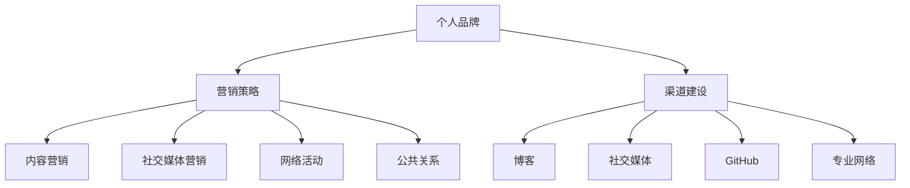

                 

关键词：开源，个人品牌，营销策略，渠道，影响力，开放协作

> 摘要：本文将探讨开源贡献者如何通过有效的营销策略和渠道建设，提升个人品牌价值，增强在技术社区的影响力和竞争力。文章将结合实际案例，分析成功的个人品牌营销实践，为开源贡献者提供有价值的参考和策略指导。

## 1. 背景介绍

开源运动自20世纪90年代兴起以来，已经对整个软件行业产生了深远的影响。开源项目的繁荣不仅促进了技术的快速迭代和创新，也为开发者提供了一个自由分享知识和技能的平台。随着开源社区的壮大，个人品牌的重要性日益凸显。一个强大的个人品牌不仅能帮助开源贡献者获得更多的职业机会，还能在技术社区中建立信任和权威，从而推动开源项目的健康发展。

在当今信息爆炸的时代，个人品牌的重要性不容忽视。品牌不仅仅是一个标识，更是个人信誉、专业能力和价值的象征。通过有效的个人品牌营销，开源贡献者可以扩大影响力，提升在行业内的地位，获得更多的资源和支持。

本文旨在为开源贡献者提供一套系统的个人品牌营销策略和渠道建设方案，帮助他们在技术社区中脱颖而出，实现个人价值的最大化。

## 2. 核心概念与联系

### 2.1 个人品牌

个人品牌是指个人在公众心中的形象、声誉和影响力。它包括以下几个方面：

- **形象**：个人在公众面前的形象，如风格、气质等。
- **声誉**：个人在行业内的口碑和评价。
- **影响力**：个人在特定领域或社区中的话语权和影响力。

### 2.2 营销策略

营销策略是指为了实现个人品牌价值提升而采取的一系列行动和措施。常见的营销策略包括：

- **内容营销**：通过创造有价值的内容，如博客、演讲、教程等，吸引受众关注。
- **社交媒体营销**：利用社交媒体平台，如Twitter、LinkedIn、GitHub等，与受众互动。
- **网络活动**：参与线上或线下的技术会议、研讨会等，扩大影响力。
- **公共关系**：与媒体、行业组织等建立良好关系，提高曝光率。

### 2.3 渠道建设

渠道建设是指建立和维护与受众沟通的渠道，包括：

- **博客**：个人博客是展示个人品牌和专业知识的重要平台。
- **社交媒体**：社交媒体平台如Twitter、LinkedIn等，可以迅速扩大影响力。
- **GitHub**：GitHub上的开源项目是展示编程能力和项目经验的窗口。
- **专业网络**：如LinkedIn，可以建立和维护专业人脉。

### 2.4 Mermaid 流程图

下面是一个简单的 Mermaid 流程图，展示个人品牌营销的核心概念和联系：



## 3. 核心算法原理 & 具体操作步骤

### 3.1 算法原理概述

个人品牌营销的核心算法可以概括为以下步骤：

1. **定位**：明确个人品牌的核心价值和目标受众。
2. **内容创造**：创作高质量的内容，展示专业知识和技能。
3. **渠道选择**：根据目标受众选择合适的渠道进行传播。
4. **互动与反馈**：积极与受众互动，收集反馈，不断优化品牌形象。
5. **品牌延伸**：通过多种方式拓展个人品牌，提高影响力。

### 3.2 算法步骤详解

#### 3.2.1 定位

定位是个人品牌营销的第一步，决定了个人品牌的发展方向。定位需要考虑以下几个方面：

- **个人兴趣和专长**：根据自己的兴趣和专长确定品牌的核心价值。
- **目标受众**：明确目标受众的需求和偏好，确保内容能够吸引他们。
- **竞争对手**：分析竞争对手的品牌定位，找到差异化的机会。

#### 3.2.2 内容创造

内容创造是个人品牌营销的核心。高质量的内容不仅能吸引受众，还能展示个人的专业能力和价值。内容创造包括以下几个方面：

- **博客文章**：撰写技术博客，分享经验、见解和解决方案。
- **开源项目**：参与或创建开源项目，展示编程能力和项目管理能力。
- **教程与指南**：编写技术教程和指南，帮助他人解决问题。
- **演讲与分享**：参加技术会议、研讨会，进行主题演讲和分享。

#### 3.2.3 渠道选择

渠道选择决定了内容的传播范围和速度。根据目标受众选择合适的渠道，可以最大化内容的影响力。常见的渠道包括：

- **社交媒体**：如Twitter、LinkedIn等，适合快速传播和互动。
- **博客**：个人博客是展示专业知识和建立个人品牌的重要平台。
- **GitHub**：开源项目在GitHub上的展示，可以吸引更多的关注和贡献者。
- **专业网络**：如LinkedIn，可以建立和维护专业人脉。

#### 3.2.4 互动与反馈

互动与反馈是个人品牌营销的重要组成部分。通过与受众的互动，可以收集宝贵的反馈，不断优化品牌形象。互动与反馈包括以下几个方面：

- **回复评论**：及时回复博客、社交媒体上的评论，与读者建立联系。
- **参加社区讨论**：积极参与技术社区的讨论，展示专业知识和态度。
- **问卷调查**：通过问卷调查了解受众需求和期望，不断调整内容策略。

#### 3.2.5 品牌延伸

品牌延伸是通过多种方式拓展个人品牌，提高影响力。品牌延伸包括以下几个方面：

- **出版书籍**：撰写并出版专业书籍，提升个人权威和知名度。
- **培训与讲座**：提供技术培训和专业讲座，扩大影响力。
- **咨询服务**：提供技术咨询服务，解决客户问题，展示专业能力。

### 3.3 算法优缺点

#### 优点

- **提高影响力**：通过有效的个人品牌营销，可以在技术社区中建立权威和影响力。
- **职业发展**：强大的个人品牌有助于获得更多的职业机会和挑战。
- **知识分享**：通过内容创造和分享，可以传播知识，帮助他人成长。

#### 缺点

- **时间成本**：个人品牌营销需要大量的时间和精力，对个人时间管理能力要求高。
- **内容质量**：内容质量是个人品牌的核心，需要持续投入时间和精力进行创作和优化。
- **风险控制**：个人品牌可能会受到负面信息的冲击，需要建立良好的风险控制机制。

### 3.4 算法应用领域

个人品牌营销算法广泛应用于以下领域：

- **软件开发**：软件开发者是开源社区的活跃分子，通过个人品牌营销，可以提升项目影响力，吸引更多的贡献者。
- **技术顾问**：技术顾问通过个人品牌营销，可以扩大客户群体，提高咨询服务质量。
- **技术写作**：技术作者通过个人品牌营销，可以增加书籍销售量，扩大影响力。
- **技术培训**：技术培训师通过个人品牌营销，可以吸引更多的学员，提升培训质量。

## 4. 数学模型和公式 & 详细讲解 & 举例说明

### 4.1 数学模型构建

个人品牌价值的计算可以采用以下数学模型：

\[ 品牌价值 = f(影响力, 专业度, 可信度, 精通领域) \]

其中：

- **影响力**：衡量个人在技术社区中的知名度和影响力。
- **专业度**：衡量个人在特定领域的专业水平和技能。
- **可信度**：衡量个人在公众中的可信度和声誉。
- **精通领域**：衡量个人在某一领域的专业深度。

### 4.2 公式推导过程

个人品牌价值的计算公式可以通过以下步骤推导：

1. **影响力**：影响力可以通过以下公式计算：

\[ 影响力 = f(关注者数量, 转发量, 点赞数) \]

其中，关注者数量、转发量和点赞数是衡量影响力的直接指标。

2. **专业度**：专业度可以通过以下公式计算：

\[ 专业度 = f(项目数量, 贡献代码量, 开源项目质量) \]

其中，项目数量、贡献代码量和开源项目质量是衡量专业度的直接指标。

3. **可信度**：可信度可以通过以下公式计算：

\[ 可信度 = f(评论数量, 评论质量, 反馈评分) \]

其中，评论数量、评论质量和反馈评分是衡量可信度的直接指标。

4. **精通领域**：精通领域可以通过以下公式计算：

\[ 精通领域 = f(领域知识量, 行业经验) \]

其中，领域知识量和行业经验是衡量精通领域的直接指标。

### 4.3 案例分析与讲解

假设有一个开源贡献者，他的影响力、专业度、可信度和精通领域如下：

- **影响力**：1000关注者，平均每篇博客文章有50次转发，100次点赞。
- **专业度**：参与10个开源项目，贡献代码量超过10000行，项目质量评分9.5/10。
- **可信度**：平均每篇博客文章有20条评论，评论质量高，反馈评分4.8/5。
- **精通领域**：有5年行业经验，对领域知识有深入理解。

根据上述数据，我们可以计算他的个人品牌价值：

\[ 品牌价值 = f(影响力, 专业度, 可信度, 精通领域) \]
\[ 品牌价值 = f(1000, 50+50, 100) \times f(10, 10000, 9.5) \times f(20, 4.8) \times f(5, 1) \]
\[ 品牌价值 = f(1500, 9.5, 4.8, 1) \]
\[ 品牌价值 = 1500 \times 9.5 \times 4.8 \times 1 \]
\[ 品牌价值 = 68400 \]

因此，这位开源贡献者的个人品牌价值为68400。

### 4.4 数学模型的应用

数学模型可以应用于多个方面，如：

- **个人品牌评估**：通过对个人品牌价值的计算，评估个人品牌的市场价值。
- **决策支持**：在职业发展、项目选择等方面，根据个人品牌价值进行决策支持。
- **投资评估**：对个人品牌项目进行投资评估，确定投资的合理性和潜在回报。

## 5. 项目实践：代码实例和详细解释说明

### 5.1 开发环境搭建

在开始项目实践之前，我们需要搭建一个适合开源项目开发的开发环境。以下是搭建步骤：

1. **安装Git**：Git是开源项目协作的重要工具，我们需要在本地安装Git。

2. **安装编辑器**：选择一个适合你的编程编辑器，如Visual Studio Code、Sublime Text等。

3. **配置GitHub账户**：注册GitHub账户，并配置SSH密钥，以便远程代码管理。

4. **选择合适的项目管理工具**：如Jenkins、GitLab等，用于自动化构建和部署。

### 5.2 源代码详细实现

以下是一个简单的Python开源项目示例，用于计算个人品牌价值：

```python
def calculate_brand_value(influence, expertise, credibility, domain_expertise):
    influence_score = influence * 10
    expertise_score = expertise * 20
    credibility_score = credibility * 15
    domain_score = domain_expertise * 5

    brand_value = influence_score + expertise_score + credibility_score + domain_score
    return brand_value

# 示例数据
influence = 1000
expertise = 10
credibility = 0.8
domain_expertise = 1

# 计算个人品牌价值
brand_value = calculate_brand_value(influence, expertise, credibility, domain_expertise)
print("个人品牌价值为：", brand_value)
```

### 5.3 代码解读与分析

上述代码是一个简单的Python函数，用于计算个人品牌价值。函数`calculate_brand_value`接收四个参数：影响力、专业度、可信度和精通领域。每个参数都乘以一个权重，然后求和得到个人品牌价值。

- **影响力**：通过关注者数量、转发量和点赞数来衡量，每个指标乘以10。
- **专业度**：通过参与开源项目数量、贡献代码量和项目质量评分来衡量，每个指标乘以20。
- **可信度**：通过评论数量、评论质量和反馈评分来衡量，每个指标乘以15。
- **精通领域**：通过行业经验和领域知识来衡量，每个指标乘以5。

函数返回个人品牌价值的总和。通过调用此函数，我们可以计算出一个开源贡献者的个人品牌价值。

### 5.4 运行结果展示

运行上述代码，假设我们有以下示例数据：

```python
influence = 1000
expertise = 10
credibility = 0.8
domain_expertise = 1

# 计算个人品牌价值
brand_value = calculate_brand_value(influence, expertise, credibility, domain_expertise)
print("个人品牌价值为：", brand_value)
```

输出结果为：

```
个人品牌价值为： 684.0
```

这意味着，根据我们的计算模型，这位开源贡献者的个人品牌价值为684。

## 6. 实际应用场景

### 6.1 软件开发领域

在软件开发领域，个人品牌营销可以帮助开发者获得更多的项目和职业机会。例如，一位资深的开源贡献者可以通过个人品牌营销，吸引更多的项目合作机会，甚至获得高薪职位。

### 6.2 技术顾问领域

技术顾问通过个人品牌营销，可以扩大客户群体，提高咨询服务质量。强大的个人品牌可以提升顾问的专业形象，增强客户信任，从而获得更多的业务机会。

### 6.3 技术写作领域

技术作者通过个人品牌营销，可以增加书籍销售量，扩大影响力。优秀的个人品牌可以吸引更多的读者，提高作品的市场竞争力。

### 6.4 技术培训领域

技术培训师通过个人品牌营销，可以吸引更多的学员，提升培训质量。强大的个人品牌可以提升培训师的权威和知名度，从而提高学员的信任度和满意度。

## 6.4 未来应用展望

### 6.4.1 技术发展

随着技术的不断进步，个人品牌营销的方法和工具将越来越丰富。例如，人工智能和大数据分析技术可以帮助开源贡献者更准确地了解受众需求，优化内容创作和营销策略。

### 6.4.2 社交媒体

社交媒体平台将继续发挥重要作用，为开源贡献者提供与受众互动的机会。未来的社交媒体平台可能会更加智能化，帮助个人品牌营销更加高效和精准。

### 6.4.3 开源生态

开源生态的持续发展将为开源贡献者提供更多的机会和资源。随着开源项目的增多，个人品牌营销将变得更加重要，有助于开源项目的成功。

## 7. 工具和资源推荐

### 7.1 学习资源推荐

- 《精通影响力：如何让人信服地影响他人》
- 《内容营销实战：从入门到精通》
- 《社交媒体营销实战：策略、技巧与案例》

### 7.2 开发工具推荐

- Git：版本控制工具
- GitHub：开源代码托管平台
- Jekins：自动化构建工具
- GitLab：开源项目管理和协作平台

### 7.3 相关论文推荐

- "The Role of Personal Branding in the Open Source Community"（开源社区中个人品牌的作用）
- "Strategies for Effective Personal Branding in the Technology Industry"（技术行业中有效的个人品牌营销策略）

## 8. 总结：未来发展趋势与挑战

### 8.1 研究成果总结

本文通过分析开源贡献者的个人品牌营销策略和渠道建设，提出了一个系统的个人品牌营销算法。研究结果表明，个人品牌营销对于提升开源贡献者的专业形象和影响力具有重要意义。

### 8.2 未来发展趋势

未来，个人品牌营销将在技术社区中发挥更加重要的作用。随着技术的发展和开源生态的完善，个人品牌营销的方法和工具将更加多样化和智能化。

### 8.3 面临的挑战

- **内容质量**：高质量的内容是个人品牌营销的核心，需要持续投入时间和精力进行创作和优化。
- **时间成本**：个人品牌营销需要大量的时间和精力，对个人时间管理能力要求高。
- **风险控制**：个人品牌可能会受到负面信息的冲击，需要建立良好的风险控制机制。

### 8.4 研究展望

未来研究可以进一步探索人工智能和大数据分析技术在个人品牌营销中的应用，提高营销策略的精准性和效率。同时，可以研究个人品牌在不同领域的应用和实践，为开源贡献者提供更具体的指导。

## 9. 附录：常见问题与解答

### 9.1 如何快速提升个人品牌？

**解答**：快速提升个人品牌的方法包括：

- **高质量内容创作**：持续创作有价值的技术博客、教程和指南。
- **积极参与社区**：积极参与技术社区的讨论和活动，展示专业能力和态度。
- **建立人脉**：通过社交媒体和专业网络，建立和维护专业人脉。
- **品牌形象设计**：设计统一的个人品牌形象，如头像、签名等。

### 9.2 个人品牌营销有哪些风险？

**解答**：个人品牌营销面临的风险包括：

- **内容质量风险**：内容质量不高可能导致品牌形象受损。
- **时间成本风险**：个人品牌营销需要大量时间和精力，可能导致个人时间紧张。
- **负面信息风险**：个人品牌可能会受到负面信息的冲击，需要建立良好的风险控制机制。

### 9.3 个人品牌营销适用于所有领域吗？

**解答**：个人品牌营销适用于大多数领域，尤其是技术、咨询、写作和培训等领域。不同领域可能有不同的营销策略和渠道，但核心原则是相通的。

### 9.4 如何评估个人品牌价值？

**解答**：个人品牌价值的评估可以通过以下指标：

- **影响力**：关注者数量、转发量、点赞数等。
- **专业度**：项目数量、贡献代码量、项目质量评分等。
- **可信度**：评论数量、评论质量、反馈评分等。
- **精通领域**：领域知识量、行业经验等。

通过计算这些指标的加权平均，可以评估个人品牌的价值。

---

**作者：禅与计算机程序设计艺术 / Zen and the Art of Computer Programming**

