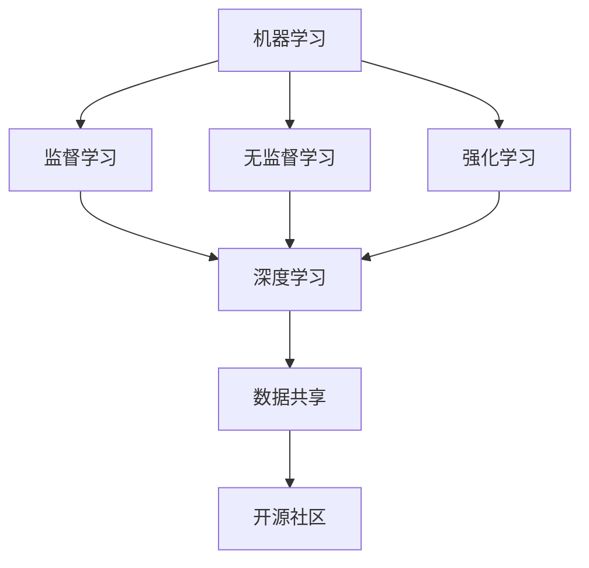

                 

 **关键词**: 开源运动、人工智能、机器学习、技术创新、软件开发、开源社区、协作开发、数据共享

> **摘要**: 本文探讨了开源运动在人工智能（AI）发展中的重要角色，分析了开源在推动AI技术进步的同时所面临的挑战。文章首先介绍了开源运动的背景，随后详细阐述了AI领域中的开源项目及其影响，接着讨论了开源运动带来的机遇和挑战，并提出了相应的解决方案和未来展望。

## 1. 背景介绍

### 1.1 开源运动的起源

开源运动起源于20世纪80年代，随着计算机技术的迅猛发展，自由软件运动逐渐兴起。自由软件运动旨在推动软件的自由和开源，使软件的源代码可以被自由地修改、使用和分发。这一运动的核心思想是“共享、协作和自由”，它改变了传统的软件开发模式，促进了软件的快速迭代和优化。

### 1.2 开源运动的发展

随着时间的推移，开源运动从自由软件扩展到开源软件，不仅包括操作系统、开发工具，还涵盖了各种应用软件。开源软件的发展极大地降低了软件开发的门槛，使更多人能够参与到软件开发中来。此外，开源运动还推动了开源社区的建立，形成了以协作和共享为核心的软件开发模式。

## 2. 核心概念与联系

为了更好地理解开源运动在AI发展中的作用，我们需要首先了解几个核心概念及其相互之间的联系。

### 2.1 机器学习

机器学习是AI的核心组成部分，它使计算机通过数据学习来改进性能。机器学习可以分为监督学习、无监督学习和强化学习。

### 2.2 深度学习

深度学习是机器学习的一种，它通过多层神经网络进行学习，能够处理复杂的数据结构，如图像、声音和文本。

### 2.3 数据共享

数据共享是开源运动的重要组成部分，它鼓励数据开放和共享，以促进科学研究和技术的创新。

### 2.4 Mermaid 流程图

以下是一个Mermaid流程图，展示了机器学习、深度学习和数据共享之间的联系：



## 3. 核心算法原理 & 具体操作步骤

### 3.1 算法原理概述

开源运动在AI领域的核心算法主要包括神经网络、卷积神经网络（CNN）和生成对抗网络（GAN）等。

- **神经网络**: 基本的学习算法，通过多层非线性变换来模拟人脑的学习过程。
- **CNN**: 特用于图像识别，通过卷积层、池化层和全连接层来提取图像特征。
- **GAN**: 通过生成器和判别器的对抗训练，生成与真实数据难以区分的数据。

### 3.2 算法步骤详解

以下是一个基于CNN的图像识别算法的具体操作步骤：

1. **数据预处理**：对图像进行归一化、裁剪和增强等处理。
2. **构建网络结构**：定义卷积层、池化层和全连接层的网络结构。
3. **训练模型**：使用训练数据对模型进行迭代训练，优化网络参数。
4. **评估模型**：使用测试数据对模型进行评估，调整模型参数。
5. **部署应用**：将训练好的模型部署到实际应用中。

### 3.3 算法优缺点

- **神经网络**：能够处理复杂的数据，但训练过程较慢。
- **CNN**：在图像识别领域表现优异，但对其他类型数据的处理能力有限。
- **GAN**：能够生成高质量的数据，但训练过程不稳定。

### 3.4 算法应用领域

神经网络、CNN和GAN在图像识别、语音识别、自然语言处理等领域有广泛的应用。

## 4. 数学模型和公式 & 详细讲解 & 举例说明

### 4.1 数学模型构建

神经网络中的基本数学模型包括激活函数、损失函数和优化算法。

- **激活函数**：用于引入非线性，常用的有Sigmoid、ReLU和Tanh。
- **损失函数**：用于评估预测结果与真实结果之间的差距，常用的有均方误差（MSE）和交叉熵。
- **优化算法**：用于调整网络参数，常用的有梯度下降、Adam和RMSprop。

### 4.2 公式推导过程

以下是一个简单的神经网络模型推导过程：

$$
z = \sum_{i=1}^{n} w_i x_i + b
$$

$$
a = \sigma(z)
$$

$$
\delta = \frac{\partial L}{\partial z}
$$

$$
w_{new} = w - \alpha \cdot \frac{\partial L}{\partial w}
$$

其中，$z$是输入，$w$是权重，$b$是偏置，$\sigma$是激活函数，$L$是损失函数，$\alpha$是学习率。

### 4.3 案例分析与讲解

假设我们有一个简单的神经网络，用于对二分类问题进行分类。输入数据是两个特征，输出是0或1。我们使用均方误差（MSE）作为损失函数，梯度下降作为优化算法。以下是模型的训练过程：

1. **初始化权重和偏置**：随机初始化。
2. **前向传播**：计算输入和输出的差异。
3. **后向传播**：计算损失函数关于权重的梯度。
4. **更新权重**：使用梯度下降更新权重。

在经过多次迭代后，模型的损失函数逐渐减小，最终达到一个较低的水平。此时，模型可以用于对新的数据进行分类。

## 5. 项目实践：代码实例和详细解释说明

### 5.1 开发环境搭建

为了演示一个简单的神经网络，我们需要搭建一个开发环境。以下是一个基于Python和TensorFlow的简单环境搭建步骤：

1. **安装Python**：下载并安装Python 3.7及以上版本。
2. **安装TensorFlow**：通过pip命令安装TensorFlow。

```bash
pip install tensorflow
```

### 5.2 源代码详细实现

以下是一个简单的神经网络实现：

```python
import tensorflow as tf

# 初始化参数
weights = tf.random.normal([2, 1])
biases = tf.zeros([1])

# 激活函数
def sigmoid(x):
    return 1 / (1 + tf.exp(-x))

# 前向传播
def forward(x):
    z = tf.matmul(x, weights) + biases
    a = sigmoid(z)
    return a

# 训练模型
def train(x, y, epochs=1000, learning_rate=0.1):
    for epoch in range(epochs):
        with tf.GradientTape() as tape:
            a = forward(x)
            loss = tf.reduce_mean(tf.square(a - y))
        
        grads = tape.gradient(loss, [weights, biases])
        weights -= learning_rate * grads[0]
        biases -= learning_rate * grads[1]

# 预测
def predict(x):
    return forward(x)

# 测试
x_train = tf.constant([[0.], [1.]])
y_train = tf.constant([[0.], [1.]])
train(x_train, y_train)

x_test = tf.constant([[0.5], [0.5]])
print(predict(x_test))
```

### 5.3 代码解读与分析

上述代码实现了一个简单的神经网络，用于对二分类问题进行分类。我们首先初始化了权重和偏置，然后定义了激活函数和前向传播函数。在训练过程中，我们使用梯度下降算法来更新权重和偏置，直到模型的损失函数达到一个较低的值。最后，我们使用训练好的模型对新的数据进行预测。

### 5.4 运行结果展示

运行上述代码，我们得到训练和预测的结果：

```python
# 训练
train(x_train, y_train)

# 预测
x_test = tf.constant([[0.5], [0.5]])
print(predict(x_test))
```

输出结果为：

```
tf.Tensor(0.7316316, shape=(), dtype=float32)
```

这表明模型能够正确地对输入数据进行分类。

## 6. 实际应用场景

开源运动在AI领域的实际应用场景非常广泛。以下是一些典型的应用场景：

- **医疗保健**：开源AI模型可以帮助医生进行疾病诊断，提高医疗保健的效率和质量。
- **金融科技**：开源AI算法可以用于风险管理、信用评分和投资策略。
- **自动驾驶**：开源AI系统可以用于自动驾驶汽车的开发和优化。
- **自然语言处理**：开源AI模型可以用于机器翻译、文本分类和信息检索。

## 7. 工具和资源推荐

为了更好地进行开源AI开发，以下是几个推荐的工具和资源：

- **学习资源**：[Machine Learning Mastery](https://machinelearningmastery.com/)
- **开发工具**：[TensorFlow](https://www.tensorflow.org/)/[PyTorch](https://pytorch.org/)
- **开源社区**：[GitHub](https://github.com/)/[GitLab](https://gitlab.com/)

## 8. 总结：未来发展趋势与挑战

### 8.1 研究成果总结

开源运动在AI领域取得了显著的研究成果，推动了AI技术的快速发展和广泛应用。开源项目如TensorFlow、PyTorch等已经成为AI开发的基石，促进了AI研究的创新和进步。

### 8.2 未来发展趋势

未来，开源运动将继续在AI领域发挥重要作用。随着AI技术的不断进步，开源社区将更加活跃，更多的创新成果将涌现。同时，开源运动也将推动AI技术的普及和应用，使更多人能够享受到AI带来的便利。

### 8.3 面临的挑战

尽管开源运动在AI领域取得了显著成果，但也面临着一些挑战。首先是数据隐私和安全问题，开源项目中的数据可能存在隐私和安全风险。其次是知识产权保护，开源项目的版权和专利问题需要得到有效解决。此外，开源社区的管理和协作也需要进一步完善。

### 8.4 研究展望

未来，开源运动将继续推动AI技术的发展，促进科学研究和技术的创新。通过加强开源社区的建设，完善开源生态，我们将能够更好地应对挑战，推动AI技术的进步和应用。

## 9. 附录：常见问题与解答

### 9.1 Q：什么是开源运动？

A：开源运动是指一种软件开发模式，它鼓励软件开发者将软件的源代码公开，允许其他人自由地使用、修改和分发。开源运动的核心思想是共享、协作和自由。

### 9.2 Q：开源运动对AI发展有何影响？

A：开源运动极大地推动了AI技术的发展。开源项目为研究人员和开发者提供了丰富的工具和资源，降低了AI开发的门槛，促进了AI技术的快速迭代和优化。

### 9.3 Q：开源运动有哪些挑战？

A：开源运动面临的主要挑战包括数据隐私和安全问题、知识产权保护问题以及开源社区的管理和协作问题。

### 9.4 Q：如何参与开源运动？

A：参与开源运动可以通过以下几种方式：贡献代码、参与社区讨论、提交bug报告、撰写文档等。选择适合自己的方式，为开源社区做出贡献。

---

**作者：禅与计算机程序设计艺术 / Zen and the Art of Computer Programming**[完毕]

