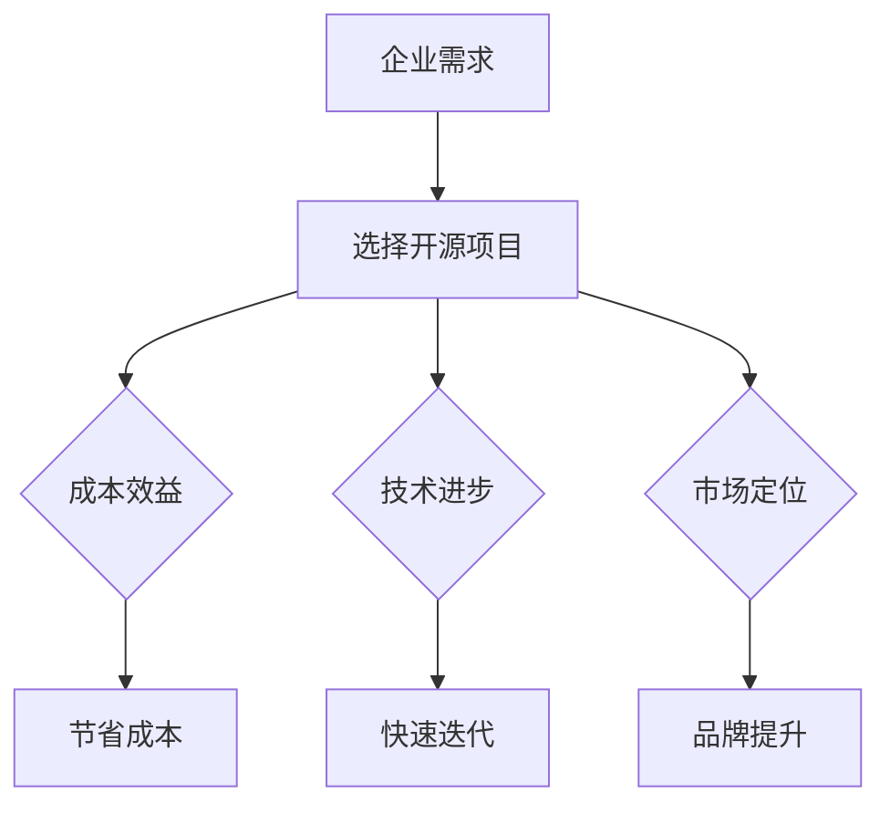

                 

在当今的数字时代，开源项目已经成为技术生态系统中的关键组成部分。它们不仅促进了技术的创新，还为企业和开发者提供了丰富的资源和机会。本文将探讨开源项目在企业中的采用，以及如何通过这种采用来创造商业机会。

## 1. 背景介绍

开源项目是指其源代码可以被公众自由查看、修改和分发的软件项目。这种模式的出现，源于软件开发者对于协作、共享和创新的需求。随着互联网的发展，开源项目逐渐成为了技术社区的核心，吸引了全球数以百万计的开发者参与。

企业对开源项目的采用，最初主要是出于降低成本和提高开发效率的考虑。然而，随着时间的推移，开源项目对企业的影响逐渐超越了技术层面，成为推动企业创新和商业成功的强大引擎。

## 2. 核心概念与联系

### 开源项目的核心概念

- **开源许可**：例如GPL、Apache License等，定义了开源项目的许可条件。
- **开源社区**：由参与开源项目的开发者和用户组成，共同维护和改进项目。
- **开源协作**：通过版本控制系统（如Git）进行代码的协作开发。

### 企业采用开源项目的联系

- **成本效益**：企业可以免费使用和修改开源项目，从而降低研发成本。
- **技术进步**：通过参与开源项目，企业可以更快地获取新技术和解决方案。
- **市场定位**：开源项目可以作为一种营销工具，帮助企业树立技术领先的形象。

### Mermaid 流程图



## 3. 核心算法原理 & 具体操作步骤

### 3.1 算法原理概述

企业采用开源项目的过程可以看作是一个算法，其原理在于最大化利用社区资源，实现技术和商业目标。

### 3.2 算法步骤详解

#### 步骤1：需求分析

- 分析企业当前的技术需求和业务目标。
- 确定哪些开源项目能够满足这些需求。

#### 步骤2：项目评估

- 考虑项目的活跃度、社区规模和用户评价。
- 评估项目的稳定性和安全性。

#### 步骤3：技术集成

- 将开源项目整合到企业的技术栈中。
- 进行必要的定制和优化。

#### 步骤4：持续维护

- 与开源社区保持互动，及时更新和优化项目。
- 定期评估项目对企业目标的贡献。

### 3.3 算法优缺点

- **优点**：
  - 降低成本，提高开发效率。
  - 接触最新的技术趋势，加快创新。
  - 增强产品的竞争力和市场份额。

- **缺点**：
  - 需要一定的技术能力和资源投入。
  - 可能面临与商业软件集成的问题。

### 3.4 算法应用领域

- **企业级应用**：如数据中心管理、云计算平台等。
- **移动应用开发**：如安卓应用开发、iOS应用开发等。
- **Web应用开发**：如前端框架、后端服务框架等。

## 4. 数学模型和公式 & 详细讲解 & 举例说明

### 4.1 数学模型构建

企业采用开源项目的数学模型可以看作是成本效益分析的扩展。其核心公式如下：

\[ C(B) = C(S) + C(M) \]

其中：
- \( C(B) \) 为采用开源项目的总成本。
- \( C(S) \) 为软件本身的成本。
- \( C(M) \) 为维护和优化的成本。

### 4.2 公式推导过程

企业采用开源项目的成本可以分为两部分：直接成本和间接成本。

- **直接成本**：即购买和使用开源软件的成本，通常为0。
- **间接成本**：包括定制、集成和维护等成本。

因此，总成本 \( C(B) \) 可以表示为 \( C(S) + C(M) \)。

### 4.3 案例分析与讲解

假设某企业决定采用一个开源数据库项目，该项目的直接成本为0。然而，由于企业需要对其进行定制以满足特定需求，因此维护和优化的成本为每年10万美元。此外，该企业每年还需要投入5万美元用于数据库的持续维护。

根据上述模型，该企业采用开源数据库项目的总成本为：

\[ C(B) = C(S) + C(M) = 0 + 15\text{万美元} = 15\text{万美元} \]

假设该企业如果采用商业数据库，每年需要支付25万美元的许可费用。在这种情况下，采用开源数据库可以为企业节省10万美元的费用。

## 5. 项目实践：代码实例和详细解释说明

### 5.1 开发环境搭建

以一个企业级开源项目——Spring Boot为例，我们首先需要搭建开发环境。

1. 安装Java开发工具包（JDK）。
2. 安装IDE（如IntelliJ IDEA或Eclipse）。
3. 创建Spring Boot项目。

### 5.2 源代码详细实现

在Spring Boot项目中，我们可以通过以下步骤实现一个简单的RESTful API：

1. 创建一个Spring Boot应用程序类。
2. 定义一个实体类（如`User`类）。
3. 实现控制类（如`UserController`），处理HTTP请求。

### 5.3 代码解读与分析

以下是一个简单的Spring Boot RESTful API的代码实例：

```java
@SpringBootApplication
public class Application {
    public static void main(String[] args) {
        SpringApplication.run(Application.class, args);
    }
}

@Entity
public class User {
    @Id
    @GeneratedValue(strategy = GenerationType.IDENTITY)
    private Long id;
    private String name;
    private String email;
    // Getters and Setters
}

@RestController
@RequestMapping("/users")
public class UserController {
    @Autowired
    private UserRepository userRepository;

    @GetMapping
    public List<User> getAllUsers() {
        return userRepository.findAll();
    }

    @PostMapping
    public User createUser(@RequestBody User user) {
        return userRepository.save(user);
    }
}
```

这段代码展示了如何使用Spring Boot框架创建一个简单的RESTful API，用于处理用户信息的增删改查操作。

### 5.4 运行结果展示

通过运行Spring Boot应用程序，我们可以在浏览器中访问`http://localhost:8080/users`来查看所有用户信息。此外，我们还可以通过Postman等工具进行API的测试。

## 6. 实际应用场景

开源项目在企业中的应用场景非常广泛。以下是一些具体的案例：

- **大数据处理**：如Hadoop和Spark等开源项目，帮助企业处理海量数据。
- **云计算平台**：如OpenStack和Kubernetes等开源项目，帮助企业构建和运营云计算基础设施。
- **移动应用开发**：如React Native和Flutter等开源项目，帮助企业快速开发跨平台移动应用。

## 7. 未来应用展望

随着技术的不断进步，开源项目将在未来继续发挥重要作用。以下是一些展望：

- **更紧密的社区合作**：企业将更加积极地参与开源社区，共同推动技术进步。
- **定制化开源项目**：企业将针对自身需求，对开源项目进行定制化改造。
- **商业模式的创新**：开源项目将成为企业创新的重要手段，创造新的商业模式。

## 8. 工具和资源推荐

### 8.1 学习资源推荐

- 《精通Spring Boot》
- 《深入理解Java虚拟机》
- 《大数据技术基础》

### 8.2 开发工具推荐

- IntelliJ IDEA
- Eclipse
- Git

### 8.3 相关论文推荐

- "The Impact of Open Source Software on Software Development"
- "The Economics of Open Source"
- "Building Successful Businesses on Open Source Software"

## 9. 总结：未来发展趋势与挑战

开源项目在企业中的应用已经显示出巨大的潜力。未来，开源项目将继续为企业带来创新和商业机会。然而，企业也需要面对一些挑战，如开源项目集成、维护和安全性等问题。通过积极应对这些挑战，企业可以更好地利用开源项目，实现技术和商业目标。

## 附录：常见问题与解答

### Q: 企业为什么选择开源项目？

A: 企业选择开源项目主要是因为开源项目具有成本低、技术进步快、市场定位强等优点。

### Q: 开源项目的安全性如何保障？

A: 开源项目的安全性通常由社区和开发者共同维护。企业可以通过审查代码、定期更新和监控漏洞来保障安全性。

### Q: 开源项目是否适合所有企业？

A: 不一定。小型企业可能由于技术能力有限，不适合直接采用复杂开源项目。但对于技术型企业，开源项目通常是非常有价值的。

### Q: 如何评估开源项目的质量？

A: 可以通过查看项目的GitHub Star数量、社区活跃度、用户评价等指标来评估开源项目的质量。

## 作者署名

作者：禅与计算机程序设计艺术 / Zen and the Art of Computer Programming
----------------------------------------------------------------

以上是关于“开源项目的企业采用：创造商业机会”的文章完整内容。这篇文章深入探讨了开源项目在企业中的应用，以及如何通过这种应用创造商业机会。希望这篇文章能够对您在开源项目和企业合作方面提供一些有价值的见解。

