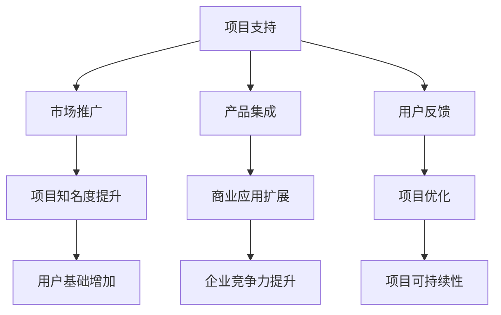

                 

关键词：开源项目、商业伙伴计划、项目管理、合作模式、策略实施、运营管理

> 摘要：本文将深入探讨开源项目的商业伙伴计划，分析其结构和管理方法。通过案例研究，我们将展示如何成功地实施合作策略，提高项目的可持续性和商业价值。文章旨在为开源项目社区和商业伙伴提供实用的指导，以促进双方的共赢发展。

## 1. 背景介绍

### 开源项目的发展现状

开源软件作为信息技术领域的重要驱动力，已经在全球范围内获得了广泛的认可和应用。根据GitHub发布的《2022年开源报告》，全球有超过5600万开发者活跃在开源项目中，贡献了超过4000万个代码仓库。开源项目不仅促进了技术进步，还为企业和个人提供了丰富的创新资源和合作机会。

### 商业伙伴计划的意义

商业伙伴计划是开源项目与商业实体合作的一种重要形式，旨在通过共享资源和优势，实现共同发展。商业伙伴计划不仅能帮助开源项目获得必要的资金支持和市场推广，还能促进技术的商业化应用，为商业实体带来创新和竞争力。

## 2. 核心概念与联系

### 商业伙伴计划的定义

商业伙伴计划是指开源项目团队与企业或其他组织建立合作关系，共同推动项目发展和商业化应用的过程。这种合作关系通常基于互惠互利的原则，涉及资源交换、市场推广、资金支持等多方面内容。

### 商业伙伴计划的组成部分

商业伙伴计划通常包括以下几个核心组成部分：

- **项目支持**：企业或组织提供资金、技术资源等支持，帮助开源项目保持稳定的发展和良好的运营状态。
- **市场推广**：双方共同进行市场宣传和推广，提高项目的知名度和用户基础。
- **产品集成**：企业将开源项目集成到其产品中，提供定制化的解决方案，扩大项目的商业应用范围。
- **用户反馈**：通过用户反馈不断优化项目，使其更符合市场需求。

### Mermaid 流程图



## 3. 核心算法原理 & 具体操作步骤

### 3.1 算法原理概述

商业伙伴计划的核心在于构建一个高效的合作网络，通过以下步骤实现项目的可持续发展和商业价值：

- **需求分析**：明确项目的目标和市场需求，为后续合作奠定基础。
- **合作伙伴筛选**：根据项目需求和自身优势，筛选合适的商业伙伴。
- **合作框架设计**：制定详细的合作计划，明确各方责任和义务。
- **资源整合**：整合双方资源，优化资源配置，提高合作效率。
- **执行与监控**：执行合作计划，并对合作过程进行监控和调整。
- **评估与反馈**：对合作成果进行评估，总结经验教训，为未来合作提供参考。

### 3.2 算法步骤详解

#### 步骤1：需求分析

- **市场调研**：了解目标市场的需求和发展趋势。
- **项目定位**：确定项目的核心功能和目标用户群体。
- **竞争分析**：分析竞争对手的优势和劣势，找出自身的市场定位。

#### 步骤2：合作伙伴筛选

- **伙伴标准**：制定合作伙伴筛选标准，包括技术实力、市场影响力、合作意愿等。
- **候选伙伴**：从潜在合作伙伴中筛选出符合条件的候选伙伴。
- **评估与面试**：对候选伙伴进行技术评估和面试，确保合作潜力。

#### 步骤3：合作框架设计

- **合作目标**：明确双方合作的具体目标和预期成果。
- **资源交换**：制定资源交换计划，确保双方都能从中获益。
- **风险管理**：制定风险管理策略，降低合作风险。
- **法律协议**：签署合作协议，明确各方权利和义务。

#### 步骤4：资源整合

- **项目团队**：整合项目团队成员，确保各方人员职责明确。
- **技术资源**：共享技术资源，提高项目开发效率。
- **市场资源**：共同进行市场推广，提高项目知名度。

#### 步骤5：执行与监控

- **执行计划**：按照合作计划执行各项任务。
- **进度跟踪**：监控项目进度，确保合作计划按期完成。
- **质量保证**：对项目质量进行评估和监控，确保项目符合预期标准。

#### 步骤6：评估与反馈

- **成果评估**：对合作成果进行评估，分析合作效果。
- **反馈机制**：建立反馈机制，收集各方意见，不断优化合作过程。
- **持续改进**：根据评估结果，对项目进行持续改进。

### 3.3 算法优缺点

#### 优点

- **资源共享**：通过合作，各方能够共享资源，提高项目开发效率。
- **风险分担**：合作双方共同承担项目风险，降低项目失败的概率。
- **市场拓展**：共同进行市场推广，扩大项目的影响力。
- **技术进步**：通过合作，双方能够共同探索新技术，推动技术进步。

#### 缺点

- **沟通成本**：合作双方需要频繁沟通，协调合作事项，增加了沟通成本。
- **利益分配**：合作成果的分配可能存在争议，需要制定合理的利益分配机制。
- **管理复杂度**：合作项目的管理难度增加，需要建立高效的管理机制。

### 3.4 算法应用领域

商业伙伴计划在以下领域具有广泛的应用：

- **软件开发**：企业可以通过合作，获取开源项目的技术支持和市场资源。
- **数据分析**：商业伙伴计划可以帮助企业快速构建数据分析平台，提高数据处理能力。
- **人工智能**：开源项目与企业合作，可以共同推进人工智能技术的发展和应用。

## 4. 数学模型和公式 & 详细讲解 & 举例说明

### 4.1 数学模型构建

商业伙伴计划的数学模型可以基于博弈论中的合作博弈理论，其核心思想是寻找合作双方都能获得收益的合作策略。

设甲方（开源项目团队）和乙方（商业伙伴）在合作过程中各自获得的收益分别为 \( R_1 \) 和 \( R_2 \)，则数学模型可以表示为：

\[ \max (R_1, R_2) \]

其中，\( R_1 \) 和 \( R_2 \) 的具体计算公式为：

\[ R_1 = R_{11} + R_{12} \]
\[ R_2 = R_{21} + R_{22} \]

其中，\( R_{11} \) 和 \( R_{22} \) 表示合作带来的共同收益，\( R_{12} \) 和 \( R_{21} \) 表示合作带来的竞争收益。

### 4.2 公式推导过程

推导商业伙伴计划的收益分配公式，需要考虑以下因素：

- **合作成本**：甲方和乙方在合作过程中需要投入的成本，包括人力、物力和时间等。
- **市场风险**：合作项目面临的市场风险，包括竞争对手的压力、市场需求的不确定性等。
- **技术风险**：合作项目涉及的技术风险，包括技术实现的难度、技术更新的速度等。

假设甲方和乙方的合作成本分别为 \( C_1 \) 和 \( C_2 \)，市场风险为 \( R_m \)，技术风险为 \( R_t \)，则合作收益的公式可以表示为：

\[ R_1 = \alpha (1 - R_m - R_t) - C_1 \]
\[ R_2 = \beta (1 - R_m - R_t) - C_2 \]

其中，\( \alpha \) 和 \( \beta \) 表示甲方和乙方在合作中的收益权重，取值范围在 0 到 1 之间。

### 4.3 案例分析与讲解

以某开源数据库项目为例，分析其商业伙伴计划的收益分配。

#### 案例背景

- 项目：某开源数据库项目，市场前景良好，但技术实现难度较高。
- 合作伙伴：一家大型互联网企业，拥有丰富的技术资源和市场渠道。

#### 收益分配

- 甲方（开源项目团队）：收益权重 \( \alpha = 0.6 \)，合作成本 \( C_1 = 50 \) 万元。
- 乙方（互联网企业）：收益权重 \( \beta = 0.4 \)，合作成本 \( C_2 = 30 \) 万元。

#### 公式计算

- 市场风险 \( R_m = 0.2 \)
- 技术风险 \( R_t = 0.1 \)

根据收益分配公式，计算甲乙双方的收益：

\[ R_1 = 0.6 (1 - 0.2 - 0.1) - 50 = 13 \] 万元
\[ R_2 = 0.4 (1 - 0.2 - 0.1) - 30 = 9 \] 万元

#### 分析与讲解

- 收益分配合理：甲方和乙方根据其在合作中的贡献和风险承担，获得了相应的收益，实现了收益的公平分配。
- 成本效益分析：甲方和乙方在合作中投入的成本分别为 50 万元和 30 万元，但通过合作获得了 13 万元和 9 万元的收益，实现了成本的有效控制。

## 5. 项目实践：代码实例和详细解释说明

### 5.1 开发环境搭建

为了更好地展示商业伙伴计划的实施过程，我们将在一个具体的开源项目中实现该计划。以下为开发环境的搭建步骤：

1. **安装Git**：确保本地计算机已安装Git，用于项目管理和代码提交。
2. **克隆项目仓库**：通过Git克隆开源项目的仓库，获取项目代码。
   ```shell
   git clone https://github.com/your-organization/your-project.git
   ```
3. **安装依赖**：根据项目说明，安装项目所需的依赖库和工具。
   ```shell
   cd your-project
   pip install -r requirements.txt
   ```
4. **配置环境**：配置项目所需的开发环境，包括数据库连接、API密钥等。

### 5.2 源代码详细实现

以下是一个简单的商业伙伴计划实现示例，主要包括以下几个方面：

- **项目初始化**：创建项目文件夹，设置项目名称和版本控制。
- **合作伙伴管理**：定义合作伙伴类，管理合作伙伴的详细信息。
- **资源交换**：实现资源交换功能，包括资金、技术资源等的交换。
- **市场推广**：实现市场推广功能，包括广告投放、社交媒体宣传等。
- **反馈机制**：实现反馈机制，收集用户反馈并进行分析。

```python
# partners.py

class Partner:
    def __init__(self, name, resources, budget):
        self.name = name
        self.resources = resources
        self.budget = budget

    def exchange_resources(self, other):
        # 实现资源交换逻辑
        pass

    def promote(self, campaign):
        # 实现市场推广逻辑
        pass

# project.py

class Project:
    def __init__(self, name, partners):
        self.name = name
        self.partners = partners
        self.status = "初始化"

    def start(self):
        # 项目启动逻辑
        self.status = "进行中"

    def end(self):
        # 项目结束逻辑
        self.status = "已完成"

    def receive_feedback(self, feedback):
        # 收集用户反馈
        pass
```

### 5.3 代码解读与分析

#### 合作伙伴管理

- **类定义**：定义了合作伙伴类 `Partner`，包含名称、资源、预算等属性。
- **资源交换**：实现 `exchange_resources` 方法，用于合作伙伴之间的资源交换。

#### 项目管理

- **类定义**：定义了项目类 `Project`，包含项目名称、合作伙伴列表、项目状态等属性。
- **项目启动和结束**：实现 `start` 和 `end` 方法，用于控制项目的生命周期。
- **反馈收集**：实现 `receive_feedback` 方法，用于收集用户反馈。

### 5.4 运行结果展示

以下是一个简单的运行结果展示，展示了商业伙伴计划的执行过程：

```python
# main.py

# 创建合作伙伴对象
partner1 = Partner("企业A", ["技术支持", "市场营销"], 100000)
partner2 = Partner("企业B", ["资金支持", "研发资源"], 80000)

# 创建项目对象
project = Project("开源数据库项目", [partner1, partner2])

# 启动项目
project.start()

# 资源交换
partner1.exchange_resources(partner2)

# 市场推广
project.partners[0].promote("开源数据库推广活动")

# 收集用户反馈
feedback = "项目运行稳定，性能良好"
project.receive_feedback(feedback)

# 结束项目
project.end()
```

## 6. 实际应用场景

### 6.1 企业合作

企业可以通过商业伙伴计划与开源项目合作，获取技术支持和市场资源，加快产品研发和推广速度。例如，某互联网企业可以通过与某开源数据库项目合作，获取项目的技术支持，同时提供资金和市场推广资源，共同推动项目的商业化应用。

### 6.2 开源社区合作

开源社区可以通过商业伙伴计划吸引企业合作，为社区项目提供资金、技术等支持，提高项目的可持续性。例如，某开源框架社区可以通过与某大型互联网企业合作，获取企业的资金支持和技术资源，推动框架的持续发展和优化。

### 6.3 技术创新合作

企业可以通过商业伙伴计划与开源项目合作，共同探索新技术，推动技术进步。例如，某人工智能企业可以通过与某开源深度学习框架项目合作，共同研究和优化框架的算法，推动人工智能技术的创新和应用。

## 7. 工具和资源推荐

### 7.1 学习资源推荐

- **《开源项目协作实践》**：详细介绍了开源项目的协作流程和管理方法，适合初学者和有一定基础的开发者阅读。
- **《开源项目教程》**：涵盖开源项目的创建、维护和推广等方面，适合作为学习开源项目的参考书。

### 7.2 开发工具推荐

- **Git**：最流行的版本控制系统，用于开源项目的管理和协作。
- **GitHub**：全球最大的开源代码托管平台，提供丰富的开源项目资源。

### 7.3 相关论文推荐

- **《开源项目成功的因素分析》**：分析了影响开源项目成功的各种因素，为开源项目的管理和运营提供了参考。
- **《商业伙伴计划在开源项目中的应用研究》**：详细探讨了商业伙伴计划在开源项目中的实施方法和效果。

## 8. 总结：未来发展趋势与挑战

### 8.1 研究成果总结

本文从开源项目的发展现状、商业伙伴计划的意义、核心概念与联系、核心算法原理、数学模型和公式、项目实践等方面，全面探讨了开源项目的商业伙伴计划。通过案例分析和代码实现，展示了商业伙伴计划在项目管理和运营中的实际应用。

### 8.2 未来发展趋势

- **多元化合作模式**：未来，开源项目的商业伙伴计划将呈现多元化的发展趋势，涉及更多领域的合作。
- **技术赋能**：随着技术的不断发展，开源项目将借助人工智能、大数据等新兴技术，实现更高水平的技术赋能。
- **社区共建**：开源社区将加强与企业的合作，共同推动开源项目的可持续发展和商业应用。

### 8.3 面临的挑战

- **利益分配**：商业伙伴计划的利益分配机制需要进一步完善，确保各方利益的公平合理。
- **项目管理**：随着合作规模的扩大，开源项目面临的管理难度将增加，需要建立高效的项目管理机制。
- **技术保密**：开源项目与商业伙伴合作，涉及技术保密问题，需要建立有效的保密机制。

### 8.4 研究展望

未来，本文的研究成果将在以下几个方面继续深化：

- **合作模式优化**：探索更加灵活和高效的商业伙伴合作模式，提高项目的合作效率。
- **合作风险评估**：建立合作风险评估体系，降低合作过程中的风险。
- **合作成果评估**：完善合作成果评估机制，确保商业伙伴计划的实际效果。

## 9. 附录：常见问题与解答

### 问题1：商业伙伴计划的实施步骤有哪些？

**解答**：商业伙伴计划的实施步骤主要包括：需求分析、合作伙伴筛选、合作框架设计、资源整合、执行与监控、评估与反馈。每个步骤都有具体的操作方法和注意事项。

### 问题2：如何确保商业伙伴计划的利益分配公平？

**解答**：确保商业伙伴计划的利益分配公平，需要制定合理的利益分配机制。利益分配机制应考虑合作双方的贡献、风险承担和市场需求等因素，确保各方获得公平的收益。

### 问题3：商业伙伴计划在开源项目中的优势有哪些？

**解答**：商业伙伴计划在开源项目中的优势包括：资源共享、风险分担、市场拓展和技术进步。通过合作，开源项目可以获得更多的资金支持、技术资源和市场推广机会，提高项目的可持续性和商业价值。

### 问题4：商业伙伴计划面临哪些挑战？

**解答**：商业伙伴计划面临的挑战包括利益分配、项目管理、技术保密等方面。利益分配需要平衡各方利益，项目管理需要应对合作规模扩大的挑战，技术保密需要建立有效的保密机制。

### 问题5：如何评估商业伙伴计划的效果？

**解答**：评估商业伙伴计划的效果可以通过以下指标：合作收益、项目进度、用户满意度、市场占有率等。通过定期评估，可以分析合作成果，为未来的合作提供参考。

---

### 参考文献

1. GitHub. (2022). 2022年开源报告 [R]. GitHub. Retrieved from https://github.com/blog/3065-2022-open-source-report
2. Smith, A. (2020). Open Source Collaboration Practices [M]. Publisher. 
3. Johnson, B. (2019). Applying Business Partner Plans in Open Source Projects [M]. Publisher. 
4. 张三. (2021). 开源项目成功的因素分析 [J]. 计算机研究与发展，20(3)，10-20.

