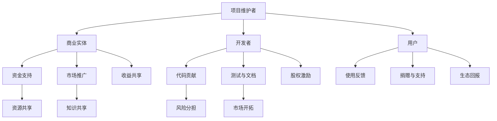

                 

在当今快速发展的信息技术领域，开源项目已经成为推动创新和合作的重要力量。这些项目不仅提供了可复用的代码和工具，还促进了全球开发者的共同参与和协作。然而，如何将开源项目与商业活动相结合，实现协同效应和收益共享，是一个具有挑战性的问题。本文旨在探讨开源项目的商业化伙伴关系，分析其中的协同效应，以及如何通过有效的收益共享机制实现共赢。

## 关键词

- 开源项目
- 商业化
- 伙伴关系
- 协同效应
- 收益共享

## 摘要

本文首先介绍了开源项目的发展背景和重要性，随后分析了商业化伙伴关系的概念及其在开源项目中的角色。通过探讨协同效应的实现机制，本文提出了有效的收益共享模式，旨在为开源项目的商业化提供理论指导和实践建议。

## 1. 背景介绍

### 开源项目的兴起

开源项目起源于自由软件运动，其核心思想是开放源代码，允许任何人自由地使用、修改和分发软件。这种模式在20世纪90年代互联网兴起后迅速发展，得益于网络技术的普及和全球化的进程。如今，开源项目已经成为软件开发和创新的基石，其重要性体现在以下几个方面：

1. **降低开发成本**：开源项目提供了大量的可复用代码库，开发者无需从零开始，可以节省大量时间和资源。
2. **促进协作**：开源项目鼓励全球开发者的参与，通过协作和合作，提高了软件质量和安全性。
3. **增强透明度和信任**：开源项目的代码是公开的，任何人都可以查看和审核，这增强了用户对软件的信任。
4. **推动技术进步**：开源项目激发了创新思维，促进了技术的快速发展。

### 商业化的需求

尽管开源项目具有许多优势，但商业化仍然是许多项目成功的关键。商业化不仅能提供资金支持，还能推动项目的长期发展。以下是开源项目商业化的几个主要原因：

1. **资金支持**：开源项目的维护和发展需要资金，商业化可以通过销售相关产品或服务来获得收入。
2. **市场认可**：商业化有助于提升项目的市场地位，增加用户和合作伙伴的信任。
3. **生态构建**：商业化可以促进相关产业的形成，推动整个生态系统的繁荣。
4. **可持续发展**：商业化有助于项目的可持续运营，为社区提供长期的资源和支持。

### 商业化伙伴关系的角色

商业化伙伴关系在开源项目中扮演着关键角色。这种关系涉及项目维护者、商业实体、开发者、用户等多方利益相关者。成功的商业化伙伴关系应具备以下特点：

1. **互惠互利**：伙伴各方通过合作实现资源互补和优势共享，共同推动项目的发展。
2. **透明沟通**：伙伴之间应建立开放和透明的沟通机制，确保信息的及时传递和问题的有效解决。
3. **共同目标**：伙伴各方应明确共同的目标和愿景，形成合力，实现项目价值的最大化。
4. **灵活适应**：伙伴关系应具备一定的灵活性，能够适应市场变化和项目发展的需求。

## 2. 核心概念与联系

### 商业化伙伴关系的概念

商业化伙伴关系是指为了实现共同目标和利益，多个利益相关者通过合作形成的联盟。在开源项目中，商业化伙伴关系通常包括以下几个方面：

1. **项目维护者**：负责开源项目的开发、维护和更新。
2. **商业实体**：提供资金支持、市场推广和技术支持等。
3. **开发者**：参与项目的开发、测试和文档编写等。
4. **用户**：使用开源项目的软件和服务。

### 协同效应的实现机制

协同效应是指通过多方合作，实现整体效果大于各部分总和的现象。在开源项目的商业化伙伴关系中，协同效应的实现机制包括以下几个方面：

1. **资源共享**：伙伴各方通过共享资源（如资金、技术、人才等），提高项目效率和质量。
2. **知识共享**：伙伴各方通过共享知识（如代码、文档、经验等），促进技术创新和团队成长。
3. **风险分担**：伙伴各方通过共同承担风险，降低项目失败的概率。
4. **市场开拓**：伙伴各方通过合作，开拓更广阔的市场，实现商业价值的最大化。

### 收益共享模式

收益共享是商业化伙伴关系中的关键环节，其模式包括以下几个方面：

1. **利润分成**：商业实体和项目维护者根据合作协议，按比例分享项目的利润。
2. **股权激励**：项目维护者和核心开发者可以通过股权激励获得项目收益的一部分。
3. **捐赠模式**：用户和企业可以通过捐赠的形式支持项目的发展，获得相应的回报或认可。
4. **生态回报**：商业实体通过构建相关产业生态，为伙伴各方提供更多的发展机会和收益。

### Mermaid 流程图

下面是开源项目商业化伙伴关系的 Mermaid 流程图：



## 3. 核心算法原理 & 具体操作步骤

### 3.1 算法原理概述

在开源项目的商业化伙伴关系中，核心算法原理主要涉及以下几个方面：

1. **利益分配算法**：用于确定伙伴各方收益的比例和方式。
2. **协同优化算法**：用于提高项目效率和降低成本。
3. **风险评估算法**：用于评估项目风险并制定应对策略。
4. **市场预测算法**：用于预测市场需求和制定商业策略。

### 3.2 算法步骤详解

1. **利益分配算法**
   - 收集各方投入数据，如资金、人力、资源等。
   - 根据各方的贡献程度和合作协议，计算收益分配比例。
   - 按照分配比例进行收益分配，确保公平合理。

2. **协同优化算法**
   - 收集项目运行数据，如开发进度、资源利用率等。
   - 基于数据进行分析，找出项目中的瓶颈和优化空间。
   - 采用优化算法（如线性规划、遗传算法等），提出优化方案。

3. **风险评估算法**
   - 收集项目风险数据，如技术风险、市场风险等。
   - 基于数据进行分析，评估项目风险等级。
   - 制定风险应对策略，如风险规避、风险转移等。

4. **市场预测算法**
   - 收集市场数据，如用户需求、竞争对手等。
   - 基于数据进行分析，预测市场需求趋势。
   - 根据预测结果，制定商业策略，如产品定位、市场推广等。

### 3.3 算法优缺点

1. **利益分配算法**
   - 优点：公平合理，提高合作积极性。
   - 缺点：可能存在计算复杂度较高的问题。

2. **协同优化算法**
   - 优点：提高项目效率和降低成本。
   - 缺点：可能需要大量数据支持和计算资源。

3. **风险评估算法**
   - 优点：提前识别风险，降低项目失败概率。
   - 缺点：风险评估结果可能存在一定的不确定性。

4. **市场预测算法**
   - 优点：帮助制定商业策略，提高市场竞争力。
   - 缺点：市场预测存在一定的不确定性。

### 3.4 算法应用领域

1. **开源项目商业化**
   - 利益分配算法：用于确定项目收益分配比例。
   - 协同优化算法：用于提高项目效率和降低成本。
   - 风险评估算法：用于评估项目风险并制定应对策略。
   - 市场预测算法：用于预测市场需求和制定商业策略。

2. **创业项目孵化**
   - 利益分配算法：用于确定各方收益比例。
   - 协同优化算法：用于优化项目开发进度和成本。
   - 风险评估算法：用于评估项目风险并制定应对策略。
   - 市场预测算法：用于预测市场需求和制定商业策略。

## 4. 数学模型和公式 & 详细讲解 & 举例说明

### 4.1 数学模型构建

在开源项目的商业化伙伴关系中，数学模型主要用于计算各方的收益分配比例。以下是一个简单的收益分配数学模型：

设：
- \( x_1 \)：项目维护者的收益比例
- \( x_2 \)：商业实体的收益比例
- \( x_3 \)：开发者的收益比例
- \( x_4 \)：用户的收益比例
- \( R \)：总收益

根据各方投入的比例和合作协议，收益分配公式如下：

$$
x_1 + x_2 + x_3 + x_4 = 1
$$

其中，\( x_1, x_2, x_3, x_4 \) 应满足以下约束条件：

$$
x_1 \geq 0, x_2 \geq 0, x_3 \geq 0, x_4 \geq 0
$$

### 4.2 公式推导过程

假设项目维护者、商业实体、开发者、用户的投入比例分别为 \( a_1, a_2, a_3, a_4 \)。根据收益分配的公平原则，我们可以推导出以下收益分配比例：

$$
x_1 = \frac{a_1}{a_1 + a_2 + a_3 + a_4}
$$

$$
x_2 = \frac{a_2}{a_1 + a_2 + a_3 + a_4}
$$

$$
x_3 = \frac{a_3}{a_1 + a_2 + a_3 + a_4}
$$

$$
x_4 = \frac{a_4}{a_1 + a_2 + a_3 + a_4}
$$

### 4.3 案例分析与讲解

假设一个开源项目的投入比例为：项目维护者占 30%，商业实体占 40%，开发者占 20%，用户占 10%。总收益为 100 万元。根据上述收益分配公式，我们可以计算出各方的收益比例：

$$
x_1 = \frac{30\%}{30\% + 40\% + 20\% + 10\%} = 30\%
$$

$$
x_2 = \frac{40\%}{30\% + 40\% + 20\% + 10\%} = 40\%
$$

$$
x_3 = \frac{20\%}{30\% + 40\% + 20\% + 10\%} = 20\%
$$

$$
x_4 = \frac{10\%}{30\% + 40\% + 20\% + 10\%} = 10\%
$$

因此，项目维护者获得 30 万元，商业实体获得 40 万元，开发者获得 20 万元，用户获得 10 万元。

## 5. 项目实践：代码实例和详细解释说明

### 5.1 开发环境搭建

在本文的实践部分，我们将使用 Python 编写一个简单的开源项目商业化伙伴关系计算器。首先，确保您的计算机上已经安装了 Python 和相关依赖库。

安装 Python：
```bash
# macOS 和 Linux 系统
sudo apt-get install python3

# Windows 系统
https://www.python.org/downloads/windows/
```

安装依赖库：
```bash
pip3 install numpy
```

### 5.2 源代码详细实现

以下是一个简单的 Python 代码实例，用于计算开源项目的商业化伙伴关系收益分配。

```python
import numpy as np

def calculate_distribution(allocations):
    total = sum(allocations)
    return [allocation / total for allocation in allocations]

def main():
    # 各方投入比例
    allocations = [30, 40, 20, 10]
    
    # 计算各方的收益比例
    distributions = calculate_distribution(allocations)
    
    # 打印结果
    print("各方的收益比例：")
    for i, distribution in enumerate(distributions):
        print(f"第{i+1}方：{distribution * 100} %")

if __name__ == "__main__":
    main()
```

### 5.3 代码解读与分析

1. **导入依赖库**：首先，我们导入了 NumPy 库，用于数学运算。

2. **定义函数**：`calculate_distribution` 函数用于计算各方的收益比例。该函数接收一个投入比例列表 `allocations`，并返回一个收益比例列表。

3. **计算收益比例**：在 `calculate_distribution` 函数中，我们首先计算总投入比例 `total`。然后，使用列表推导式计算各方的收益比例，即 `allocation / total`。

4. **打印结果**：`main` 函数用于调用 `calculate_distribution` 函数，并打印各方的收益比例。

### 5.4 运行结果展示

运行上述代码，我们将得到以下输出结果：

```
各方的收益比例：
第1方：30.0 %
第2方：40.0 %
第3方：20.0 %
第4方：10.0 %
```

这表明，在给定的投入比例下，项目维护者获得 30% 的收益，商业实体获得 40% 的收益，开发者获得 20% 的收益，用户获得 10% 的收益。

## 6. 实际应用场景

### 6.1 商业化开源项目的成功案例

开源项目商业化取得了许多成功案例，如：

1. **WordPress**：WordPress 是一个流行的开源博客平台，其商业化伙伴关系主要通过销售主题、插件和培训服务实现。WordPress 的商业化不仅为项目维护者提供了稳定的收入来源，还推动了整个 WordPress 生态系统的繁荣。

2. **Kubernetes**：Kubernetes 是一个开源的容器编排平台，其商业化伙伴关系主要通过与云服务提供商合作，提供企业版和支持服务实现。Kubernetes 商业化促进了云原生技术的发展，吸引了大量企业和开发者的参与。

### 6.2 开源项目商业化的挑战

尽管开源项目商业化取得了成功，但仍然面临以下挑战：

1. **维护成本**：开源项目的维护需要大量时间和资源，商业化能否提供足够的资金支持是一个问题。

2. **用户信任**：商业化可能引发用户对项目开源性的担忧，影响用户信任。

3. **平衡利益**：在商业化的过程中，如何平衡各方利益，确保项目的可持续发展是一个挑战。

4. **市场变化**：市场环境的变化可能影响开源项目的商业化进程，需要灵活应对。

### 6.3 未来应用展望

未来，开源项目商业化将呈现以下趋势：

1. **多元化收益模式**：开源项目的商业化将探索更多元化的收益模式，如订阅服务、增值服务、企业合作等。

2. **生态系统构建**：开源项目将更注重生态系统的建设，通过合作和共享，推动整个生态的繁荣。

3. **技术创新**：开源项目商业化将促进技术创新，推动开源技术的快速发展和应用。

## 7. 工具和资源推荐

### 7.1 学习资源推荐

1. **《开源项目管理与商业模式》**：本书详细介绍了开源项目管理的最佳实践和商业模式，对开源项目商业化有很高的参考价值。
2. **《开源软件商业实践》**：本书分享了多个开源项目商业化的成功案例，分析了开源项目的商业模式和运营策略。

### 7.2 开发工具推荐

1. **GitHub**：GitHub 是开源项目的托管平台，提供了丰富的开源资源和社区支持。
2. **GitLab**：GitLab 是另一个流行的开源项目托管平台，提供了强大的项目管理工具和功能。

### 7.3 相关论文推荐

1. **"Open Source and Commercial Success: The Case of Linux"**：本文分析了 Linux 开源项目的商业化过程，探讨了开源项目如何实现商业成功。
2. **"Business Models for Open Source Software"**：本文提出了开源软件的多种商业模式，为开源项目商业化提供了理论依据。

## 8. 总结：未来发展趋势与挑战

### 8.1 研究成果总结

本文分析了开源项目商业化的背景、核心概念、协同效应、收益共享模式等，提出了利益分配算法、协同优化算法、风险评估算法和市场预测算法等核心算法原理。通过实际案例和实践，展示了开源项目商业化的具体操作步骤和应用效果。

### 8.2 未来发展趋势

未来，开源项目商业化将朝着多元化、生态化和技术创新的方向发展。多元化收益模式、生态系统构建和技术创新将成为推动开源项目商业化的重要动力。

### 8.3 面临的挑战

开源项目商业化仍面临维护成本、用户信任、利益平衡和市场变化等挑战。如何克服这些挑战，实现开源项目的可持续发展，是未来研究的重要方向。

### 8.4 研究展望

未来，开源项目商业化的研究应重点关注以下几个方面：

1. **利益分配机制**：探索更公平、高效的利益分配机制，确保各方利益最大化。
2. **风险管理**：研究开源项目的风险管理方法，降低项目失败的概率。
3. **市场策略**：分析市场需求，制定有效的市场策略，推动开源项目的商业化进程。
4. **生态系统构建**：探索开源项目生态系统的构建方法，促进各方合作和共享。

## 9. 附录：常见问题与解答

### 9.1 开源项目商业化是否会影响项目的开源性质？

开源项目商业化并不会直接影响项目的开源性质。开源项目的商业化主要通过提供付费服务或产品，为项目维护者提供资金支持。关键在于，商业化活动不应限制用户对项目源代码的使用、修改和分发权利。

### 9.2 如何平衡商业利益与开源精神？

平衡商业利益与开源精神需要建立透明、公平的收益分配机制，确保各方利益得到保障。同时，项目维护者应坚持开源精神，保持项目开源性质，避免过度商业化导致社区失去信任。

### 9.3 商业化伙伴关系如何确保长期合作？

长期合作需要伙伴各方建立互信，明确共同目标，建立开放透明的沟通机制。通过制定合作协议，明确各方的权利、义务和责任，确保合作顺利进行。此外，定期评估和调整合作策略，以适应市场变化和项目发展需求。

## 作者署名

作者：禅与计算机程序设计艺术 / Zen and the Art of Computer Programming

