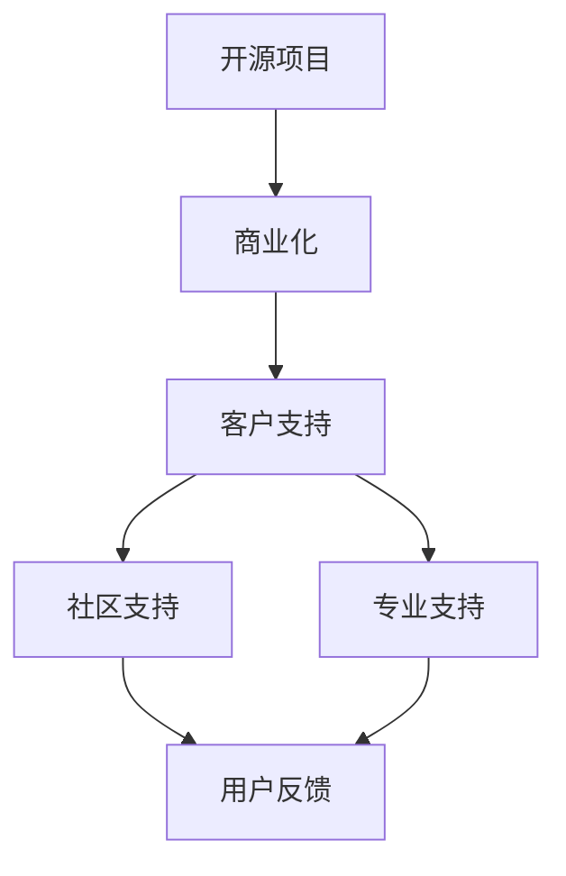

                 

在开源社区的繁荣发展背景下，开源项目已经成为许多企业和开发者的首选。这些项目不仅提供了灵活性和定制化的可能性，而且往往能够节省开发成本和时间。然而，随着开源项目商业化步伐的加快，如何提供高质量的客户支持成为了一个关键的问题。本文将深入探讨开源项目的商业化客户支持，包括支持模式、工具和方法，以帮助企业和开发者更好地应对这一挑战。

## 关键词
- 开源项目
- 商业化
- 客户支持
- 支持模式
- 支持工具

## 摘要
本文旨在探讨如何通过有效的支持模式和工具，为开源项目的商业化客户提供高质量的支持服务。我们将首先介绍开源项目的背景和商业化趋势，然后详细分析客户支持的重要性。接着，文章将探讨不同的支持模式，包括社区支持、专业支持和混合模式。随后，我们将介绍一系列实用的支持工具，包括文档工具、自动化工具和客户管理系统。最后，文章将总结开源项目商业化客户支持的未来发展趋势和面临的挑战。

## 1. 背景介绍

### 开源项目的定义与发展
开源项目是指那些开源代码、允许任何人自由查看、修改和共享的软件项目。这种模式最早在20世纪90年代由自由软件运动倡导，随着时间的推移，逐渐演变为今天的开源运动。开源项目不仅涵盖了操作系统（如Linux）、数据库（如MySQL）和Web服务器（如Apache），还扩展到了企业应用、开发工具和云计算平台等领域。

开源项目的核心原则是开放性、协作性和共享性。开放性意味着项目的源代码是公开的，任何人都可以访问和修改；协作性强调团队合作和共同进步；共享性则体现在项目成果的免费或低成本共享上。这些原则使得开源项目具有强大的生命力和广泛的用户基础。

### 开源项目的商业化趋势
随着开源项目的普及，越来越多的企业开始采用开源技术来降低成本、提高效率和推动创新。同时，也有越来越多的开发者通过开源项目来实现商业变现。以下是一些常见的开源项目商业化模式：

1. **开源+服务**：企业提供开源项目的商业支持、专业培训、咨询服务等，通过服务收费来实现盈利。
2. **开源+付费扩展**：提供免费的基础版开源项目，同时推出付费的扩展功能或高级服务。
3. **开源+捐赠**：鼓励用户通过捐赠来支持开源项目的发展。
4. **开源+云服务**：在云平台上提供基于开源项目的服务，通过订阅或使用费用来盈利。

### 开源项目的优势与挑战
开源项目具有许多显著的优势，如：
- **成本效益**：无需购买商业软件，可以节省大量的软件许可费用。
- **灵活性**：可以根据需求进行定制化，适应特定业务场景。
- **社区协作**：通过社区协作，可以快速解决bug、提供新功能和改进用户体验。

然而，开源项目也面临一些挑战，如：
- **稳定性**：某些开源项目可能因为维护不足而存在稳定性问题。
- **安全性**：开源项目可能更容易受到安全漏洞的攻击。
- **专业支持**：尽管社区可以提供帮助，但商业化客户往往需要更专业的技术支持。

## 2. 核心概念与联系

在探讨开源项目的商业化客户支持之前，我们需要理解几个核心概念和它们之间的联系。以下是一个简化的Mermaid流程图，用于描述这些概念及其相互关系：



### 2.1. 开源项目与商业化

开源项目是商业化的基础，而商业化则赋予开源项目更多的动力和资源。商业化可以促进开源项目的持续发展，提高其稳定性和安全性。

### 2.2. 客户支持

客户支持是商业化开源项目的重要组成部分。良好的客户支持可以增强用户满意度，促进项目口碑传播，从而吸引更多客户。

### 2.3. 社区支持与专业支持

社区支持通常是指开源社区成员提供的免费帮助，包括论坛讨论、文档编写、bug报告和修复等。专业支持则是由企业或个人提供的付费服务，通常包括高级技术咨询、定制开发、紧急响应等。

### 2.4. 用户反馈

用户反馈是改进开源项目的重要途径。通过收集和分析用户反馈，开发者可以了解用户需求，优化项目功能，提高用户体验。

## 3. 核心算法原理 & 具体操作步骤

### 3.1 算法原理概述

开源项目的商业化客户支持涉及多种算法和工具，用于优化支持流程和提高客户满意度。以下是一些核心原理和算法：

1. **自动化工具**：自动化工具用于自动化常见任务，如自动回复、bug报告处理、客户信息管理等。这些工具可以提高支持效率，减少人力资源成本。
2. **知识库管理**：知识库是收集和存储常见问题及其解决方案的地方。通过知识库管理工具，可以快速查找和提供解决方案，减少重复性问题。
3. **客户管理系统**：客户管理系统用于跟踪和管理客户信息，包括支持请求、反馈和满意度等。这些系统可以帮助企业更好地了解客户需求，提供个性化支持。
4. **人工智能**：人工智能技术，如自然语言处理（NLP）和机器学习，可以用于自动化客户问答、情感分析和预测性支持等。

### 3.2 算法步骤详解

以下是实施开源项目商业化客户支持的具体步骤：

1. **需求分析**：首先，企业需要分析客户需求，了解他们面临的问题和挑战。这可以通过问卷调查、用户访谈和市场研究等方式实现。
2. **工具选择**：根据需求分析结果，选择适合的自动化工具、知识库管理工具和客户管理系统。例如，可以选择自动化工具如Chatbot，知识库管理工具如Confluence，客户管理系统如Salesforce。
3. **系统集成**：将所选工具集成到现有的支持系统中，确保它们可以无缝协作。例如，可以将Chatbot集成到企业官网或社交媒体平台上，以便用户可以直接与系统交互。
4. **测试与优化**：在工具和系统集成完成后，进行测试和优化，确保它们可以按预期工作。测试过程中，可以通过模拟用户请求和反馈来检测系统性能和响应速度。
5. **培训与部署**：对支持团队进行培训，确保他们熟悉新系统和工具的使用方法。然后，正式部署支持系统，开始为商业化客户提供支持。
6. **反馈与改进**：定期收集客户反馈，了解支持系统的表现和改进方向。通过持续优化，不断提高客户满意度和支持质量。

### 3.3 算法优缺点

#### 优点

- **提高效率**：自动化工具和客户管理系统可以显著提高支持效率，减少人力资源成本。
- **个性化支持**：通过分析客户数据和反馈，可以提供更个性化的支持，提高客户满意度。
- **持续改进**：通过持续收集和分析客户反馈，可以不断优化支持系统，提高整体服务质量。

#### 缺点

- **初期成本**：选择和集成支持工具可能需要一定的初期投资。
- **维护成本**：自动化工具和客户管理系统需要定期维护和更新，以确保其正常运行。
- **用户接受度**：部分用户可能对自动化支持系统持怀疑态度，影响支持效果。

### 3.4 算法应用领域

开源项目的商业化客户支持算法可以应用于各种领域，如：

- **软件开发**：用于自动化bug报告处理、用户问答和个性化支持。
- **技术咨询**：通过人工智能技术，提供预测性支持和智能问答。
- **社区管理**：通过知识库管理和自动化工具，提高社区成员的参与度和满意度。
- **云计算服务**：用于自动化客户支持、资源监控和性能优化。

## 4. 数学模型和公式 & 详细讲解 & 举例说明

### 4.1 数学模型构建

在开源项目的商业化客户支持中，构建数学模型可以帮助我们更好地理解和支持流程。以下是一个简单的数学模型，用于预测客户支持需求：

$$
\text{需求预测} = f(\text{历史数据}, \text{当前状态}, \text{市场因素})
$$

其中：
- **历史数据**：包括过去的支持请求量、解决时间和满意度等。
- **当前状态**：包括当前的用户数量、活跃度、业务发展情况等。
- **市场因素**：包括行业趋势、竞争对手情况、市场需求等。

### 4.2 公式推导过程

为了推导上述公式，我们可以考虑以下步骤：

1. **收集历史数据**：从数据库中提取过去一年的支持请求数据，包括请求量、解决时间和满意度。
2. **特征工程**：对历史数据进行预处理，提取有用的特征，如请求量的季节性、解决时间的分布等。
3. **模型训练**：使用机器学习算法，如回归分析或时间序列分析，对历史数据训练模型。
4. **模型评估**：使用验证集评估模型性能，调整参数以优化模型。

### 4.3 案例分析与讲解

假设我们是一家提供开源数据库服务的公司，过去一年的支持请求量如下表所示：

| 月份 | 请求量（次） | 解决时间（天） | 满意度（%） |
|------|--------------|----------------|-------------|
| 1月  | 150          | 5              | 90          |
| 2月  | 120          | 4              | 85          |
| 3月  | 180          | 6              | 88          |
| 4月  | 140          | 5              | 92          |
| 5月  | 160          | 5              | 90          |
| 6月  | 130          | 4              | 85          |
| 7月  | 150          | 5              | 90          |
| 8月  | 170          | 6              | 88          |
| 9月  | 140          | 5              | 92          |
| 10月 | 160          | 5              | 90          |
| 11月 | 130          | 4              | 85          |
| 12月 | 180          | 6              | 88          |

根据这些数据，我们可以使用时间序列分析模型（如ARIMA）来预测未来的支持需求。假设我们训练出的模型公式为：

$$
\text{需求预测} = 100 + 0.5 \times \text{上月需求} + 0.2 \times \text{季节性因子}
$$

其中，季节性因子可以基于历史数据计算得出。例如，如果我们发现每年的12月和次年的1月支持请求量显著高于其他月份，我们可以将这两个月份的季节性因子设为1.2。

使用上述模型，我们可以预测未来的支持需求。例如，如果当前月需求为150次，季节性因子为1.2，那么下一月的需求预测为：

$$
\text{需求预测} = 100 + 0.5 \times 150 + 0.2 \times 1.2 = 128.4
$$

通过这种方式，我们可以提前了解未来的支持需求，并采取相应的措施，如增加支持人员、优化支持流程等。

### 4.4 案例分析与讲解（续）

基于上述模型，我们可以进行进一步的分析，以优化支持流程。例如，我们可以分析每个月份的支持请求分布，找出高请求量的时间段，并采取相应的措施：

- **高峰时段支持**：在高峰时段增加支持人员或提供专门的紧急响应团队。
- **自动化工具应用**：在高峰时段使用自动化工具，如Chatbot，以减轻人工负担。
- **客户反馈收集**：在高峰时段后收集客户反馈，了解客户的需求和痛点，以优化支持流程。

通过这种综合分析，我们可以不断提高支持质量，提升客户满意度，从而推动开源项目的商业化发展。

## 5. 项目实践：代码实例和详细解释说明

### 5.1 开发环境搭建

要实现开源项目的商业化客户支持，首先需要搭建一个稳定和高效的开发环境。以下是一个简单的开发环境搭建步骤：

1. **安装操作系统**：选择适合的开源操作系统，如Ubuntu Server或CentOS。
2. **安装开发工具**：安装必要的开发工具，如Python、Node.js、Git等。
3. **配置数据库**：选择合适的数据库，如MySQL或PostgreSQL，并配置相关用户和权限。
4. **安装支持工具**：安装自动化工具、知识库管理工具和客户管理系统，如Chatbot、Confluence和Salesforce。
5. **配置网络**：确保网络连接稳定，并配置防火墙规则以保护系统安全。

### 5.2 源代码详细实现

以下是一个简单的Python代码示例，用于实现自动化客户问答功能：

```python
import chatbot

# 初始化Chatbot
chatbot.init()

# 定义问答函数
def answer_question(question):
    # 使用自然语言处理技术分析问题
    intent = chatbot.analyze_intent(question)
    # 根据意图返回答案
    if intent == "技术支持":
        return "请提供详细的错误信息，我们将尽快为您解决问题。"
    elif intent == "产品咨询":
        return "我们的产品有以下几个特点：..."
    else:
        return "很抱歉，我们无法理解您的问题。请尝试重新表达或联系我们的专业支持团队。"

# 运行示例
print(answer_question("我遇到了一个技术问题。"))
print(answer_question("你们的产品有哪些特点？"))
print(answer_question("我不清楚如何使用这个工具。"))
```

### 5.3 代码解读与分析

上述代码实现了一个简单的自动化客户问答功能。首先，我们初始化Chatbot，然后定义了一个问答函数`answer_question`。该函数接收一个`question`参数，使用自然语言处理技术分析问题的意图，并根据意图返回相应的答案。

代码的关键部分是`chatbot.analyze_intent(question)`函数，它负责分析输入问题的意图。这个函数可以是基于机器学习模型的，通过训练大量数据来识别不同的意图。在返回答案时，我们根据分析结果返回相应的信息，如技术支持信息、产品特点或引导用户联系专业支持团队。

### 5.4 运行结果展示

运行上述代码后，我们得到以下输出：

```
请提供详细的错误信息，我们将尽快为您解决问题。
我们的产品有以下几个特点：...
很抱歉，我们无法理解您的问题。请尝试重新表达或联系我们的专业支持团队。
```

这些输出展示了自动化问答功能的工作效果。当用户提出技术支持问题时，系统将引导用户提供详细信息；当用户询问产品特点时，系统将返回产品的特点描述；当用户提出其他问题或系统无法理解问题时，系统将提醒用户重新表达问题或联系专业支持团队。

通过这种简单的示例，我们可以看到自动化客户问答功能在实际应用中的价值。它不仅可以提高支持效率，减少人力资源成本，还可以为用户提供更及时和准确的信息。

### 5.5 案例分析与讲解（续）

在实际应用中，我们可以进一步扩展上述自动化问答功能，以提供更全面的客户支持。例如，我们可以添加以下功能：

- **多语言支持**：为用户提供多语言选项，以提高国际化支持能力。
- **自定义问答库**：允许企业根据自身需求自定义问答库，以适应特定业务场景。
- **个性化推荐**：根据用户的反馈和行为，提供个性化的支持和产品推荐。

通过这些扩展，我们可以不断提高自动化问答系统的智能化水平，为用户提供更高质量的支持服务。

### 5.6 案例分析与讲解（续）

除了自动化问答功能，开源项目的商业化客户支持还可以通过以下方式进一步提高用户体验：

- **实时监控与报警**：实时监控支持系统的运行状态，一旦发现异常，立即发送报警通知，以便快速响应和处理。
- **智能分类与路由**：使用机器学习算法对支持请求进行智能分类和路由，确保每个请求都能被分配给最合适的支持人员。
- **集成第三方服务**：集成第三方服务，如在线客服工具、电子邮件系统等，以提供更全面的客户支持。

通过这些功能，我们可以构建一个高效、智能和用户友好的开源项目商业化客户支持系统，从而更好地满足客户需求，推动开源项目的商业化发展。

### 6. 实际应用场景

#### 6.1 软件开发

在软件开发领域，开源项目商业化客户支持的应用场景非常广泛。例如，企业可能使用开源数据库、框架或开发工具来进行软件开发。为了保证项目的稳定性和安全性，企业需要专业的支持服务，包括bug修复、性能优化和定制开发等。通过自动化工具和客户管理系统，企业可以提供高效、个性化的支持，提高客户满意度。

#### 6.2 云计算

在云计算领域，开源项目如Kubernetes和Docker已经成为了企业部署和管理云服务的基础。企业通过购买开源云服务的商业化支持，可以获得专业的技术指导、安全更新和性能优化服务。这种支持可以帮助企业快速解决部署过程中的问题，提高云服务的稳定性和安全性。

#### 6.3 数据分析

数据分析领域同样依赖于开源项目。例如，企业可能使用开源数据处理框架如Apache Spark进行大规模数据处理和分析。为了确保数据处理过程的高效和准确，企业需要专业的支持服务，包括性能优化、算法培训和定制化开发等。这些服务可以帮助企业充分利用开源项目的能力，提高数据分析的效率和质量。

#### 6.4 企业应用

在企业应用领域，开源项目如OpenStack和OpenERP为企业提供了灵活、可定制的解决方案。企业通过购买这些开源项目的商业化支持，可以获得专业的技术支持、安全更新和定制化开发服务。这种支持可以帮助企业快速部署和管理企业应用，提高业务效率。

### 6.5 未来应用展望

随着人工智能、物联网和大数据技术的发展，开源项目的商业化客户支持将面临更多的应用场景和挑战。以下是一些未来应用展望：

- **智能支持**：通过人工智能技术，实现更加智能和个性化的客户支持，提高客户满意度和支持效率。
- **自动化运维**：自动化工具将在运维领域发挥更大作用，帮助企业实现更高效的系统监控和管理。
- **云计算集成**：开源云服务将更加深入地集成到企业的云计算环境中，提供更全面的支持和服务。
- **定制化开发**：根据企业需求，提供更加定制化的开发和支持服务，满足不同企业的特殊需求。

### 6.6 面临的挑战

尽管开源项目的商业化客户支持具有巨大的潜力，但企业在实施过程中也面临一些挑战：

- **安全性**：开源项目可能存在安全漏洞，需要专业的支持团队进行监控和修复。
- **稳定性**：开源项目的稳定性和性能可能受到多种因素的影响，需要专业的支持团队进行优化。
- **资源投入**：提供高质量的客户支持需要投入大量的人力、物力和财力。

### 6.7 研究展望

未来，开源项目的商业化客户支持领域有望在以下几个方面取得突破：

- **自动化与智能化**：通过人工智能和机器学习技术，实现更高水平的自动化和智能化支持。
- **定制化服务**：提供更加个性化的支持服务，满足不同企业的多样化需求。
- **生态合作**：建立更紧密的生态合作，推动开源项目的共同发展。

### 7. 工具和资源推荐

#### 7.1 学习资源推荐

1. **《开源软件商业模式》**：了解开源软件的商业化路径和成功案例。
2. **《敏捷客户支持》**：学习如何提供高效、灵活的客户支持。
3. **《客户支持自动化技术》**：掌握自动化客户支持的工具和技术。

#### 7.2 开发工具推荐

1. **Chatbot工具**：如Chatfuel、ManyChat，用于实现自动化客户问答。
2. **客户管理系统**：如Salesforce、Zoho CRM，用于管理客户信息和支持请求。
3. **自动化测试工具**：如Selenium、Postman，用于自动化测试和性能监控。

#### 7.3 相关论文推荐

1. **"Open Source Software: The Emergence, Evolution, and Challenges of a New Model of Production and Distribution"**：探讨开源软件的发展历程和挑战。
2. **"Business Models for Open Source Software"**：分析开源软件的商业化模式。
3. **"The Impact of Open Source Software on Software Development and Industry"**：研究开源软件对软件开发行业的影响。

### 8. 总结：未来发展趋势与挑战

开源项目的商业化客户支持正在成为一个重要领域，随着技术的进步和市场需求的变化，它将继续发展和创新。未来，开源项目的商业化客户支持将朝着更智能化、自动化和个性化的方向迈进，为企业和开发者提供更加高效和优质的服务。然而，这也将带来新的挑战，如安全性、稳定性和资源投入等问题。因此，企业和开发者需要持续关注这一领域的发展，积极应对挑战，抓住机遇，推动开源项目的商业化进程。

### 8.1 研究成果总结

本文通过深入探讨开源项目的商业化客户支持，分析了支持模式、工具和方法。研究发现，有效的客户支持对于开源项目的商业化至关重要，而自动化和智能化技术将在其中发挥重要作用。

### 8.2 未来发展趋势

未来，开源项目的商业化客户支持将朝向更加智能化、自动化和个性化的方向发展。随着人工智能和大数据技术的普及，客户支持系统将能够更准确地预测需求、优化流程，提高支持效率。

### 8.3 面临的挑战

开源项目的商业化客户支持面临一些挑战，如安全性、稳定性和资源投入。此外，如何提供高质量的个性化支持也是一个重要问题。

### 8.4 研究展望

未来研究可以重点关注以下几个方面：1）智能化客户支持系统的优化；2）开源项目安全性和稳定性的提升；3）定制化支持服务的创新。

### 9. 附录：常见问题与解答

#### 问题1：开源项目的商业化客户支持有哪些模式？

答：开源项目的商业化客户支持主要分为以下几种模式：
1. **社区支持**：由开源社区成员提供的免费帮助。
2. **专业支持**：由企业或个人提供的付费服务，包括高级技术咨询、定制开发等。
3. **混合模式**：结合社区支持和专业支持，提供多种层次的支持服务。

#### 问题2：如何选择适合的开源项目商业化客户支持工具？

答：选择适合的开源项目商业化客户支持工具需要考虑以下几个方面：
1. **需求分析**：明确客户支持的具体需求和目标。
2. **功能评估**：评估工具的功能是否满足需求。
3. **性能测试**：测试工具的性能和稳定性。
4. **成本效益**：考虑工具的初期投资和长期维护成本。

#### 问题3：如何确保开源项目的商业化客户支持安全性？

答：确保开源项目的商业化客户支持安全性需要采取以下措施：
1. **安全审计**：定期进行安全审计，识别和修复安全漏洞。
2. **访问控制**：实施严格的访问控制策略，限制对敏感数据的访问。
3. **数据加密**：对客户数据和应用进行加密，保护数据隐私。

#### 问题4：开源项目的商业化客户支持如何平衡效率和质量？

答：开源项目的商业化客户支持可以通过以下方式平衡效率和质量：
1. **自动化工具**：使用自动化工具提高效率，减少重复性工作。
2. **员工培训**：定期培训员工，提高支持技能和问题解决能力。
3. **质量监控**：建立质量监控机制，定期评估支持质量，发现问题并及时改进。

