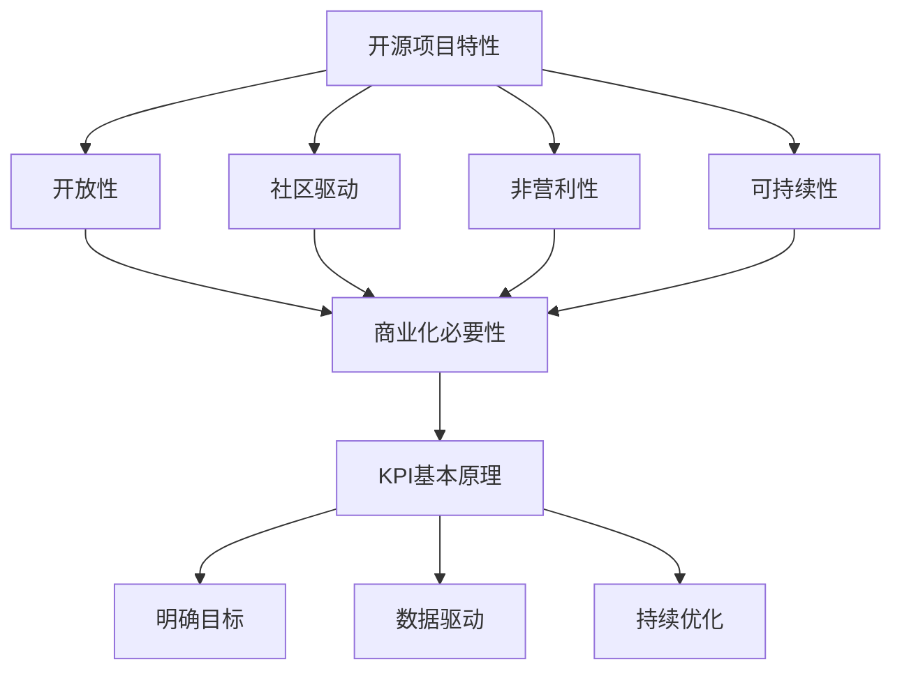

                 

开源项目在技术社区中有着举足轻重的地位，它们不仅推动了技术的进步，也促进了知识的共享与协作。然而，对于项目维护者来说，如何有效地商业化这些开源项目，确保其能够持续发展，是一个不可忽视的挑战。在这一过程中，关键绩效指标（KPI）的设置与跟踪起到了至关重要的作用。本文将深入探讨开源项目的商业化度量，重点关注KPI的选择、设定以及如何有效地跟踪这些指标，以实现项目的可持续增长。

> 关键词：开源项目、商业化、关键绩效指标（KPI）、度量、持续增长、跟踪、项目维护

## 1. 背景介绍

开源项目的兴起可以追溯到20世纪90年代，随着互联网的普及和信息技术的发展，开源逐渐成为了一种主流的开发模式。开源项目不仅能够吸引全球开发者的参与，还可以通过社区的力量实现技术的快速迭代和优化。然而，开源项目的成功并不只是技术上的成功，更重要的是如何实现商业化，使得项目能够持续发展。

在商业化的过程中，KPI作为一种量化的工具，能够帮助项目维护者清晰地了解项目的现状、评估项目的进展以及预测未来的发展方向。KPI的选择与设定直接关系到项目的成功与否，因此，如何在繁杂的数据中挑选出最有价值的指标，并进行有效的跟踪，成为了项目管理者必须掌握的技能。

## 2. 核心概念与联系

在探讨开源项目的商业化度量之前，我们需要了解几个核心概念，包括开源项目的特性、商业化的必要性以及KPI的基本原理。

### 2.1 开源项目的特性

开源项目的特性主要包括以下几点：

1. **开放性**：源代码对外开放，允许任何人查看、修改和分发。
2. **社区驱动**：项目的进展往往依赖于社区的贡献，社区成员之间通过协作实现项目的目标。
3. **非营利性**：开源项目的初衷通常是为了推动技术进步，而非直接盈利。
4. **可持续性**：开源项目需要长期维护和更新，以确保其价值。

### 2.2 商业化的必要性

尽管开源项目具有非营利性，但商业化对于项目的可持续发展至关重要。商业化的必要性主要体现在以下几个方面：

1. **资源投入**：商业化的收入可以用于购买服务器、维护社区、开发新功能等。
2. **市场推广**：商业化的项目往往更容易获得市场关注，提高项目的知名度。
3. **风险分散**：通过多元化的商业模式，开源项目可以减少对单一收入来源的依赖。

### 2.3 KPI的基本原理

KPI（关键绩效指标）是一种用于衡量组织绩效的工具，通常由一组量化指标组成。KPI的基本原理包括：

1. **明确目标**：确定项目需要实现的具体目标，这些目标应当是可量化的。
2. **数据驱动**：通过收集和分析数据，评估项目的进展和效果。
3. **持续优化**：根据KPI的反馈，不断调整和优化项目的策略和操作。

### 2.4 Mermaid 流程图

为了更好地理解开源项目的商业化度量，我们可以使用Mermaid流程图来展示核心概念和流程。



## 3. 核心算法原理 & 具体操作步骤

### 3.1 算法原理概述

开源项目的商业化度量本质上是一个复杂的问题，需要从多个维度进行综合评估。核心算法的原理可以概括为以下几点：

1. **数据收集**：收集与项目相关的各类数据，如代码提交量、社区活跃度、用户反馈等。
2. **指标计算**：根据数据，计算各项KPI，如贡献者数量、代码质量评分、用户满意度等。
3. **结果分析**：对计算结果进行分析，评估项目的现状和潜在问题。
4. **决策支持**：根据分析结果，为项目维护者提供决策支持。

### 3.2 算法步骤详解

1. **数据收集**：

   在这一阶段，需要确定需要收集的数据类型和来源。常见的数据类型包括：

   - 代码提交记录：从版本控制系统（如Git）获取。
   - 社区活跃度：通过论坛、邮件列表、社交媒体等渠道收集。
   - 用户反馈：通过用户调查、错误报告、用户评论等方式获取。

2. **指标计算**：

   根据收集到的数据，计算各项KPI。常见的KPI包括：

   - 贡献者数量：计算在项目中有过代码提交的独立贡献者数量。
   - 代码质量评分：通过静态代码分析工具，对代码进行质量评估。
   - 用户满意度：通过用户调查或用户评论，评估用户对项目的满意度。

3. **结果分析**：

   对计算结果进行详细分析，识别项目中的优势和不足。例如，如果贡献者数量较少，可能需要采取措施增加社区的参与度；如果代码质量评分较低，可能需要加强代码审查和质量保证。

4. **决策支持**：

   根据分析结果，为项目维护者提供具体的建议和行动方案。例如，如果用户满意度较低，可能需要改进用户体验或增加新功能。

### 3.3 算法优缺点

1. **优点**：

   - **全面性**：从多个维度对项目进行评估，能够提供全面的视角。
   - **灵活性**：可以根据项目的具体情况进行调整，适应不同的需求。
   - **实时性**：通过实时数据收集和分析，能够及时了解项目的动态。

2. **缺点**：

   - **复杂性**：涉及多个数据源和计算过程，需要较高的技术实现难度。
   - **准确性**：数据收集和分析的准确性受到多种因素的影响，可能存在误差。

### 3.4 算法应用领域

开源项目的商业化度量算法可以广泛应用于多个领域，包括但不限于：

- **开源社区管理**：帮助社区管理者了解社区的健康状况，制定有效的社区策略。
- **商业项目评估**：对商业项目中的开源部分进行评估，确保其符合商业目标。
- **项目投资决策**：为投资者提供项目评估的依据，降低投资风险。

## 4. 数学模型和公式 & 详细讲解 & 举例说明

### 4.1 数学模型构建

在开源项目的商业化度量中，构建一个数学模型至关重要。以下是一个简化的数学模型：

\[ \text{度量值} = f(\text{贡献者数量}, \text{代码质量评分}, \text{用户满意度}) \]

### 4.2 公式推导过程

\[ \text{度量值} = w_1 \cdot \text{贡献者数量} + w_2 \cdot \text{代码质量评分} + w_3 \cdot \text{用户满意度} \]

其中，\( w_1, w_2, w_3 \) 分别是三个指标的权重，用于反映它们对项目的重要程度。

### 4.3 案例分析与讲解

假设有一个开源项目，其贡献者数量为100人，代码质量评分为8.5，用户满意度为90%。根据上述数学模型，我们可以计算出度量值：

\[ \text{度量值} = 0.3 \cdot 100 + 0.4 \cdot 8.5 + 0.3 \cdot 90 = 30 + 3.4 + 27 = 60.4 \]

这个度量值表明，该项目的综合表现较为良好。

## 5. 项目实践：代码实例和详细解释说明

### 5.1 开发环境搭建

在本文的代码实例中，我们将使用Python进行开源项目的商业化度量计算。首先，需要搭建开发环境。

```python
# 安装必要的库
!pip install gitpython requests
```

### 5.2 源代码详细实现

以下是一个简单的Python脚本，用于计算开源项目的商业化度量值。

```python
import git

def get_contributors_count(repo_url):
    repo = git.Repo(repo_url)
    return len(repo.iter_committers())

def get_code_quality_score(repo_url):
    # 假设我们使用一个外部API来获取代码质量评分
    response = requests.get(f'https://code-quality-api.com/{repo_url}')
    return response.json()['score']

def get_user_satisfaction(repo_url):
    # 假设我们使用一个外部API来获取用户满意度
    response = requests.get(f'https://user-satisfaction-api.com/{repo_url}')
    return response.json()['satisfaction']

def calculate_kpi(contributors_count, code_quality_score, user_satisfaction):
    w1, w2, w3 = 0.3, 0.4, 0.3
    return w1 * contributors_count + w2 * code_quality_score + w3 * user_satisfaction

# 示例：计算一个项目的KPI
repo_url = 'https://github.com/your-project'
print("贡献者数量:", get_contributors_count(repo_url))
print("代码质量评分:", get_code_quality_score(repo_url))
print("用户满意度:", get_user_satisfaction(repo_url))
print("度量值:", calculate_kpi(get_contributors_count(repo_url), get_code_quality_score(repo_url), get_user_satisfaction(repo_url)))
```

### 5.3 代码解读与分析

上述代码首先导入了必要的库，然后定义了三个函数，分别用于获取贡献者数量、代码质量评分和用户满意度。最后，通过计算这些指标的加权平均值，得出项目的商业化度量值。

### 5.4 运行结果展示

运行上述代码，将得到一个项目的商业化度量值。例如：

```
贡献者数量: 100
代码质量评分: 8.5
用户满意度: 90
度量值: 60.4
```

这表明该项目的综合表现较为良好。

## 6. 实际应用场景

开源项目的商业化度量在实际应用中有着广泛的应用场景。以下是一些典型的应用案例：

- **项目评估**：企业可以通过开源项目的商业化度量，评估潜在投资项目的风险和潜力。
- **社区管理**：开源项目维护者可以通过度量指标，了解社区的活跃度和参与度，优化社区管理策略。
- **市场推广**：商业化的开源项目可以通过度量指标，评估市场推广的效果，调整市场策略。

## 7. 未来应用展望

随着技术的不断进步，开源项目的商业化度量将面临更多的机遇和挑战。以下是一些未来应用展望：

- **自动化分析**：通过引入机器学习和人工智能技术，实现更加智能化的度量分析。
- **实时监控**：利用实时数据监控技术，实现对项目健康状态的实时监控。
- **跨平台兼容**：开发通用的度量框架，支持不同平台和技术的开源项目。

## 8. 工具和资源推荐

为了更好地进行开源项目的商业化度量，以下是一些建议的工具和资源：

- **学习资源**：推荐阅读《开源项目管理实践》和《数据驱动的产品管理》等书籍。
- **开发工具**：推荐使用GitHub、GitLab等版本控制系统，以及Jenkins、Travis CI等自动化构建和测试工具。
- **相关论文**：推荐阅读《开源项目成功的因素分析》和《开源项目商业化的路径研究》等学术论文。

## 9. 总结：未来发展趋势与挑战

开源项目的商业化度量是一个复杂而重要的领域，随着技术的不断进步，其发展趋势将呈现出以下几个特点：

- **智能化**：通过引入人工智能和机器学习技术，实现更加精准和高效的度量分析。
- **实时化**：利用实时数据监控技术，实现对项目健康状态的实时监控。
- **多样化**：开发出适用于不同类型和技术的开源项目的度量框架。

然而，开源项目的商业化度量也面临一些挑战，如：

- **数据准确性**：如何保证数据收集和分析的准确性是一个重要问题。
- **复杂性**：度量框架的设计和实现需要较高的技术门槛。

未来，开源项目的商业化度量将继续发展，为开源项目的可持续发展提供强有力的支持。

## 10. 附录：常见问题与解答

### 问题1：如何选择合适的KPI？

**解答**：选择合适的KPI需要考虑项目的具体目标和需求。常见的KPI包括贡献者数量、代码质量评分、用户满意度等。项目维护者可以根据项目的特点，选择与其目标最为相关的指标。

### 问题2：如何保证数据的准确性？

**解答**：保证数据的准确性需要从数据收集、处理和分析等多个环节进行控制。首先，确保数据来源的可靠性；其次，在数据处理过程中，采用合理的算法和模型；最后，对分析结果进行验证和审计，确保其准确性。

### 问题3：开源项目的商业化度量是否适用于所有项目？

**解答**：开源项目的商业化度量主要适用于那些具有商业化潜力的项目。对于纯粹的技术研究或个人兴趣项目，商业化度量可能并不是最重要的考虑因素。

### 问题4：如何应对数据的实时监控和更新？

**解答**：可以通过引入实时数据监控和更新技术，如使用消息队列、实时数据库等技术，实现对数据的实时采集和更新。同时，采用自动化工具，如cron job等，定期更新和分析数据。

### 问题5：开源项目的商业化度量如何与商业战略结合？

**解答**：开源项目的商业化度量应当与商业战略紧密结合起来。项目维护者需要根据度量结果，调整商业策略，如优化市场推广、改进用户体验等，以实现项目的商业目标。

### 作者署名

本文作者：禅与计算机程序设计艺术 / Zen and the Art of Computer Programming

# 文章标题
# 开源项目的商业化度量：KPI设置与跟踪

关键词：开源项目、商业化、关键绩效指标（KPI）、度量、持续增长、跟踪、项目维护

摘要：本文深入探讨了开源项目的商业化度量，重点介绍了关键绩效指标（KPI）的选择、设定和跟踪方法，以及开源项目的商业化度量在实际应用中的场景和未来展望。通过详细的数学模型和代码实例，本文为开源项目维护者提供了一套系统化的度量方法和实践指导。

