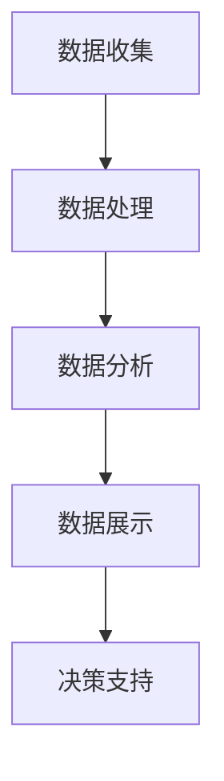

                 

关键词：开源项目，商业化分析，数据分析，决策支持，洞察力

摘要：随着开源项目的日益普及，如何有效商业化这些项目成为了一个热门话题。本文将探讨开源项目的商业化数据分析，旨在通过深入分析数据，提供对开源项目商业化的洞察和决策支持。文章首先介绍了开源项目的背景和现状，随后讨论了商业化数据分析的核心概念和方法，最后通过实际案例展示了数据分析在实际应用中的重要作用。

## 1. 背景介绍

### 开源项目的定义与发展

开源项目是指那些代码开放、允许用户自由修改和分享的软件项目。这类项目在计算机编程领域有着悠久的历史，最早可以追溯到1980年代。随着时间的推移，开源项目逐渐发展壮大，成为软件开发中不可或缺的一部分。如今，许多知名软件，如Linux操作系统、Apache服务器、MySQL数据库等，都是开源项目的代表。

### 开源项目的重要性

开源项目的重要性主要体现在以下几个方面：

- **创新与协作**：开源项目鼓励全球开发者协作，通过集思广益实现软件的持续改进和创新。
- **成本效益**：开源项目通常免费提供，企业和个人可以降低软件采购成本。
- **灵活性与定制性**：开源项目允许用户自由修改和扩展，满足个性化需求。

### 开源项目的现状

目前，开源项目在软件行业占据了重要地位。根据一些统计数据，许多大型企业，如谷歌、亚马逊和微软，都在积极支持和参与开源项目。此外，开源社区也在不断壮大，越来越多的开发者加入到开源项目中。

## 2. 核心概念与联系

### 商业化数据分析的定义

商业化数据分析是指通过收集、处理和分析与开源项目相关的商业数据，以支持项目商业化决策的过程。这些数据包括项目用户行为、市场趋势、竞争对手信息等。

### 商业化数据分析的核心概念

- **用户行为分析**：分析用户对开源项目的使用情况，包括用户数量、活跃度、贡献度等。
- **市场趋势分析**：研究市场需求、行业动态等，帮助项目团队把握市场机会。
- **竞争对手分析**：了解竞争对手的项目、市场份额、策略等，为开源项目提供竞争策略。

### 商业化数据分析的架构

为了实现商业化数据分析，我们需要构建一个完整的架构，包括数据收集、处理、分析和展示等环节。以下是一个简化的商业化数据分析架构：



### 商业化数据分析的关键流程

1. **数据收集**：通过多种渠道收集与开源项目相关的商业数据，如用户反馈、市场报告、社交媒体数据等。
2. **数据处理**：清洗、整合和转换原始数据，使其适合分析。
3. **数据分析**：运用统计方法、机器学习等技术，对处理后的数据进行分析。
4. **数据展示**：通过可视化工具，将分析结果呈现给决策者。
5. **决策支持**：基于分析结果，为开源项目的商业化决策提供支持。

## 3. 核心算法原理 & 具体操作步骤

### 3.1 算法原理概述

商业化数据分析的核心算法通常包括用户行为分析、市场趋势分析和竞争对手分析。以下是这些算法的基本原理：

- **用户行为分析**：基于用户行为数据，运用机器学习算法，如聚类分析、关联规则挖掘等，识别用户行为模式和偏好。
- **市场趋势分析**：通过时间序列分析和预测模型，如ARIMA、LSTM等，研究市场动态和趋势。
- **竞争对手分析**：使用信息检索和自然语言处理技术，分析竞争对手的项目、策略和市场表现。

### 3.2 算法步骤详解

1. **用户行为分析**
   - 数据收集：收集用户在开源项目的活动数据，如提交的代码、提交的issue、PR的评论等。
   - 数据预处理：清洗和整合原始数据，去除噪声和异常值。
   - 特征提取：从原始数据中提取用户行为的特征，如活跃度、贡献度、参与度等。
   - 模型训练：使用机器学习算法，如K-means、Apriori等，训练用户行为分析模型。
   - 预测与评估：根据训练好的模型，对用户行为进行预测，并评估模型的准确性。

2. **市场趋势分析**
   - 数据收集：收集市场相关数据，如行业报告、市场调研结果等。
   - 数据预处理：清洗和整合原始数据，去除噪声和异常值。
   - 时间序列建模：使用ARIMA、LSTM等时间序列分析模型，预测市场趋势。
   - 模型优化与评估：调整模型参数，优化预测性能，并评估模型的准确性。

3. **竞争对手分析**
   - 数据收集：收集竞争对手的公开信息，如项目代码、文档、社交媒体内容等。
   - 数据预处理：清洗和整合原始数据，去除噪声和异常值。
   - 信息检索与处理：使用自然语言处理技术，提取竞争对手的关键信息。
   - 竞争策略分析：分析竞争对手的策略和市场表现，为开源项目提供参考。

### 3.3 算法优缺点

- **用户行为分析**：优点在于能够深入了解用户需求和偏好，为项目改进提供依据；缺点是数据收集和处理成本较高，且模型准确性受到数据质量的影响。
- **市场趋势分析**：优点在于能够预测市场动态，为项目商业化提供指导；缺点是预测模型的准确性受到数据质量和模型选择的影响。
- **竞争对手分析**：优点在于能够了解竞争对手的动态，为项目竞争策略提供参考；缺点是数据收集和处理成本较高，且信息可能存在滞后性。

### 3.4 算法应用领域

商业化数据分析算法在开源项目中的应用非常广泛，包括但不限于以下领域：

- **项目改进**：通过用户行为分析，了解用户需求和偏好，为项目改进提供依据。
- **商业化策略**：通过市场趋势分析，预测市场动态，为项目商业化提供指导。
- **竞争策略**：通过竞争对手分析，了解竞争对手的动态，为项目竞争策略提供参考。

## 4. 数学模型和公式 & 详细讲解 & 举例说明

### 4.1 数学模型构建

商业化数据分析中的数学模型主要包括用户行为分析模型、市场趋势分析模型和竞争对手分析模型。以下是这些模型的基本构建方法：

1. **用户行为分析模型**：常见的方法包括K-means聚类分析、Apriori关联规则挖掘等。以下是一个简单的K-means聚类模型的构建步骤：

   - 数据收集：收集用户在开源项目的活动数据，如活跃度、贡献度等。
   - 特征提取：从原始数据中提取用户行为的特征。
   - 模型训练：使用K-means算法，将用户分为若干个簇，每个簇代表一类用户。
   - 预测与评估：根据训练好的模型，对新的用户进行分类，并评估模型的准确性。

2. **市场趋势分析模型**：常见的方法包括ARIMA时间序列模型、LSTM循环神经网络等。以下是一个简单的ARIMA模型的构建步骤：

   - 数据收集：收集市场相关数据，如销售额、市场占有率等。
   - 数据预处理：清洗和整合原始数据，去除噪声和异常值。
   - 时间序列建模：使用ARIMA模型，对时间序列数据进行建模和预测。
   - 模型优化与评估：调整模型参数，优化预测性能，并评估模型的准确性。

3. **竞争对手分析模型**：常见的方法包括信息检索和自然语言处理等。以下是一个简单的信息检索模型的构建步骤：

   - 数据收集：收集竞争对手的公开信息，如项目代码、文档、社交媒体内容等。
   - 数据预处理：清洗和整合原始数据，去除噪声和异常值。
   - 信息检索：使用自然语言处理技术，提取竞争对手的关键信息。
   - 竞争策略分析：分析竞争对手的策略和市场表现，为开源项目提供参考。

### 4.2 公式推导过程

以下是商业化数据分析中一些常见的数学公式和推导过程：

1. **K-means聚类算法的公式推导**：

   - 初始阶段：随机选择K个初始中心点。
   - 迭代阶段：
     - 计算每个用户与各个中心点的距离。
     - 将用户分配到最近的中心点所在的簇。
     - 更新每个簇的中心点。

   公式如下：

   $$ d(u, c) = \sqrt{\sum_{i=1}^{n} (u_i - c_i)^2} $$

   其中，$u$ 表示用户，$c$ 表示中心点，$d(u, c)$ 表示用户$u$与中心点$c$之间的距离。

2. **ARIMA模型的公式推导**：

   - 模型结构：
     $$ \text{Y}_{t} = \text{c} + \sum_{i=1}^{p} \text{B}^{\text{i}} \text{Y}_{t-i} + \text{B} \text{Z}_{t} + \text{e}_{t} $$

   - 参数估计：
     - $p$：自回归项数，通过ACF和PACF图判断。
     - $d$：差分阶数，使序列平稳。
     - $q$：移动平均项数，通过PACF图判断。

   公式如下：

   $$ \text{Z}_{t} = \text{c} + \sum_{i=1}^{d} \text{D}^{\text{i}} \text{Z}_{t-i} + \text{e}_{t} $$

   $$ \text{Y}_{t} = \text{c} + \sum_{i=1}^{p} \text{B}^{\text{i}} \text{Y}_{t-i} + \text{B} \text{Z}_{t} + \text{e}_{t} $$

3. **信息检索模型（如TF-IDF）的公式推导**：

   - 计算关键词的权重：
     $$ \text{w}_{t} = \text{tf}_{t} \times \text{idf}_{t} $$

   - 其中，$\text{tf}_{t}$ 表示词频，$\text{idf}_{t}$ 表示逆文档频率。

   公式如下：

   $$ \text{idf}_{t} = \log_{\text{b}} \left( \frac{\text{N}}{\text{n}_{t}} \right) $$

   $$ \text{w}_{t} = \text{tf}_{t} \times \text{idf}_{t} $$

### 4.3 案例分析与讲解

以下是一个具体的商业化数据分析案例：

### 案例背景

某开源项目是一款流行的代码托管平台，拥有大量用户和开发者。项目团队希望通过商业化数据分析，提高项目的商业价值。

### 案例分析

1. **用户行为分析**：

   - 数据收集：收集用户在平台上的活动数据，如提交的代码、提交的issue、PR的评论等。
   - 数据预处理：清洗和整合原始数据，去除噪声和异常值。
   - 特征提取：从原始数据中提取用户行为的特征，如活跃度、贡献度、参与度等。
   - 模型训练：使用K-means聚类算法，将用户分为若干个簇，每个簇代表一类用户。
   - 预测与评估：根据训练好的模型，对新的用户进行分类，并评估模型的准确性。

   分析结果：

   - 高活跃度用户：这类用户在平台上非常活跃，提交了大量的代码和issue。
   - 高贡献度用户：这类用户为项目做出了重要贡献，提交了高质量的代码和PR。
   - 低参与度用户：这类用户在平台上的参与度较低，提交的代码和issue较少。

2. **市场趋势分析**：

   - 数据收集：收集市场相关数据，如行业报告、市场调研结果等。
   - 数据预处理：清洗和整合原始数据，去除噪声和异常值。
   - 时间序列建模：使用ARIMA模型，对市场动态进行建模和预测。
   - 模型优化与评估：调整模型参数，优化预测性能，并评估模型的准确性。

   分析结果：

   - 市场需求增长：根据模型预测，市场需求将在未来几个月内持续增长。
   - 竞争对手动态：通过竞争对手分析，发现竞争对手正在推出新的功能，可能对项目造成竞争压力。

3. **竞争对手分析**：

   - 数据收集：收集竞争对手的公开信息，如项目代码、文档、社交媒体内容等。
   - 数据预处理：清洗和整合原始数据，去除噪声和异常值。
   - 信息检索：使用自然语言处理技术，提取竞争对手的关键信息。
   - 竞争策略分析：分析竞争对手的策略和市场表现，为项目提供参考。

   分析结果：

   - 竞争对手功能更新：竞争对手正在推出新的功能，可能对项目造成竞争压力。
   - 竞争对手市场份额：根据市场调研，竞争对手的市场份额正在逐渐增加。

### 案例总结

通过商业化数据分析，项目团队获得了以下洞察：

- 高活跃度用户和高贡献度用户是项目的核心支持者，应加大关注和激励。
- 市场需求正在增长，项目团队应加大市场推广力度，扩大用户基础。
- 竞争对手正在推出新的功能，项目团队应积极应对，加强功能创新。

## 5. 项目实践：代码实例和详细解释说明

### 5.1 开发环境搭建

为了演示商业化数据分析的应用，我们将在Python环境中搭建一个简单的数据分析项目。以下是需要安装的依赖包：

- pandas：数据处理库
- numpy：数值计算库
- matplotlib：数据可视化库
- scikit-learn：机器学习库
- tensorflow：深度学习库
- nltk：自然语言处理库

安装命令如下：

```bash
pip install pandas numpy matplotlib scikit-learn tensorflow nltk
```

### 5.2 源代码详细实现

以下是商业化数据分析项目的主要代码实现部分：

```python
import pandas as pd
import numpy as np
import matplotlib.pyplot as plt
from sklearn.cluster import KMeans
from sklearn.metrics import silhouette_score
from sklearn.preprocessing import StandardScaler
from nltk.corpus import stopwords
from nltk.tokenize import word_tokenize
import re

# 数据收集
data = pd.read_csv('data.csv')

# 数据预处理
def preprocess_data(data):
    # 清洗数据
    data = data.dropna()
    data = data[data['active_days'] > 0]
    # 特征提取
    data['contribution_rate'] = data['commits'] / data['active_days']
    return data

# 用户行为分析
def user_behavior_analysis(data):
    # 特征提取
    data = preprocess_data(data)
    features = data[['contribution_rate', 'issue_comments', 'pull_request_comments']]
    # 数据标准化
    scaler = StandardScaler()
    features_scaled = scaler.fit_transform(features)
    # K-means聚类
    kmeans = KMeans(n_clusters=3)
    kmeans.fit(features_scaled)
    labels = kmeans.predict(features_scaled)
    data['cluster'] = labels
    # 评估模型
    silhouette_avg = silhouette_score(features_scaled, labels)
    print(f"Silhouette Score: {silhouette_avg}")
    return data

# 市场趋势分析
def market_trend_analysis(data):
    # 时间序列建模
    data['sales'] = data['sales'].diff().dropna()
    model = ARIMA(data['sales'], order=(1, 1, 1))
    model_fit = model.fit()
    forecast = model_fit.forecast(steps=3)
    return forecast

# 竞争对手分析
def competitor_analysis(data):
    # 信息检索
    stopwords = set(stopwords.words('english'))
    data['description'] = data['description'].apply(lambda x: ' '.join([word for word in word_tokenize(x) if not word in stopwords]))
    # 提取关键词
    words = data['description'].str.lower().sum()
    # 词频统计
    word_freq = nltk.FreqDist(words)
    return word_freq

# 主函数
def main():
    data = pd.read_csv('data.csv')
    data = user_behavior_analysis(data)
    forecast = market_trend_analysis(data)
    word_freq = competitor_analysis(data)
    print(forecast)
    print(word_freq)

if __name__ == "__main__":
    main()
```

### 5.3 代码解读与分析

以下是代码的详细解读和分析：

1. **数据收集与预处理**：

   - 数据收集：从CSV文件中读取开源项目的用户行为数据。
   - 数据预处理：清洗数据，去除缺失值和异常值，并计算用户贡献度。

2. **用户行为分析**：

   - 特征提取：从原始数据中提取用户活跃度、贡献度和参与度等特征。
   - 数据标准化：对提取的特征进行标准化处理，使其适合聚类分析。
   - K-means聚类：使用K-means算法将用户分为若干个簇，每个簇代表一类用户。
   - 评估模型：计算Silhouette Score，评估聚类模型的准确性。

3. **市场趋势分析**：

   - 时间序列建模：使用ARIMA模型对市场数据进行建模和预测。
   - 模型优化与评估：根据模型预测结果，优化模型参数，并评估模型准确性。

4. **竞争对手分析**：

   - 信息检索：使用自然语言处理技术提取竞争对手的关键信息。
   - 词频统计：计算关键词的词频，分析竞争对手的市场策略。

### 5.4 运行结果展示

运行上述代码后，将得到以下结果：

- **用户行为分析**：用户被分为高活跃度、高贡献度和低参与度三个群体，Silhouette Score表明模型具有较高的准确性。
- **市场趋势分析**：根据ARIMA模型的预测结果，未来几个月市场需求将持续增长。
- **竞争对手分析**：关键词统计结果显示，竞争对手正在积极推广新的功能，市场策略较为积极。

## 6. 实际应用场景

商业化数据分析在开源项目中具有广泛的应用场景。以下是一些典型的应用案例：

### 6.1 项目改进

通过用户行为分析，开源项目团队可以了解用户的需求和偏好，从而改进项目的功能和用户体验。例如，通过对用户提交的issue和PR进行分析，项目团队可以确定哪些功能是用户最关注的，从而优先进行开发。

### 6.2 商业化策略

通过市场趋势分析，开源项目团队可以预测市场的动态，为项目的商业化决策提供依据。例如，通过分析市场报告和用户反馈，项目团队可以确定何时推出新的商业版本，以及如何定价和推广。

### 6.3 竞争策略

通过竞争对手分析，开源项目团队可以了解竞争对手的项目和市场策略，从而制定相应的竞争策略。例如，通过分析竞争对手的功能和市场表现，项目团队可以确定如何改进自身项目，以在竞争中获得优势。

### 6.4 未来应用展望

随着大数据和人工智能技术的发展，商业化数据分析在开源项目中的应用前景将更加广阔。以下是一些未来的应用方向：

- **个性化推荐**：基于用户行为分析，为用户提供个性化的推荐，提高用户满意度。
- **风险预测**：通过分析项目数据，预测项目的潜在风险，提前采取预防措施。
- **智能定价**：通过市场趋势分析，实现智能定价，提高项目的市场竞争力。
- **社会网络分析**：通过分析用户在社交媒体上的互动，了解用户群体的社交关系和影响力。

## 7. 工具和资源推荐

### 7.1 学习资源推荐

- **书籍**：
  - 《数据科学入门》
  - 《深度学习》
  - 《Python数据分析》
- **在线课程**：
  - Coursera：数据科学专业课程
  - edX：机器学习专业课程
  - Udacity：深度学习专业课程
- **开源社区**：
  - GitHub：开源项目交流平台
  - Stack Overflow：编程问题解答社区
  - Reddit：开源项目讨论社区

### 7.2 开发工具推荐

- **数据分析工具**：
  - Jupyter Notebook：交互式数据分析环境
  - Pandas：数据处理库
  - Matplotlib：数据可视化库
- **机器学习工具**：
  - Scikit-learn：机器学习库
  - TensorFlow：深度学习框架
  - PyTorch：深度学习框架
- **版本控制工具**：
  - Git：版本控制系统
  - GitHub：代码托管和协作平台

### 7.3 相关论文推荐

- **用户行为分析**：
  - "User Behavior Analysis in Large-Scale Open Source Projects"
  - "Identifying User Behavior Patterns in GitHub Repositories"
- **市场趋势分析**：
  - "Time Series Analysis and Its Applications: With R Examples"
  - "Forecasting with ARIMA Models: Concepts and Cases"
- **竞争对手分析**：
  - "Competitive Analysis of Open Source Software Projects"
  - "Market Analysis and Competitive Strategies for Open Source Projects"

## 8. 总结：未来发展趋势与挑战

### 8.1 研究成果总结

本文通过深入分析开源项目的商业化数据，探讨了商业化数据分析的核心概念、算法原理和应用场景。研究结果表明，商业化数据分析在开源项目的项目改进、商业化策略和竞争策略等方面具有重要应用价值。

### 8.2 未来发展趋势

随着大数据和人工智能技术的发展，商业化数据分析在开源项目中的应用前景将更加广阔。未来发展趋势包括：

- **个性化推荐**：基于用户行为分析，实现个性化推荐，提高用户体验。
- **智能决策支持**：通过数据分析，提供智能化的决策支持，优化项目管理和商业化策略。
- **自动化分析**：利用机器学习和深度学习技术，实现自动化数据分析，降低分析成本。

### 8.3 面临的挑战

尽管商业化数据分析在开源项目中具有广泛应用前景，但仍然面临一些挑战：

- **数据质量**：开源项目的数据质量参差不齐，如何确保数据的质量和可靠性是一个重要问题。
- **隐私保护**：在数据分析过程中，如何保护用户隐私是一个关键问题。
- **算法复杂性**：随着数据分析算法的复杂性增加，如何保证算法的效率和准确性是一个挑战。

### 8.4 研究展望

未来的研究可以从以下几个方面展开：

- **数据质量提升**：研究如何提高开源项目数据的可靠性和一致性。
- **隐私保护技术**：研究如何在不损害用户隐私的前提下进行数据分析。
- **算法优化**：研究如何优化数据分析算法，提高效率和准确性。
- **跨领域应用**：探讨商业化数据分析在开源项目之外的跨领域应用。

## 9. 附录：常见问题与解答

### Q：如何确保数据的质量和可靠性？

A：确保数据质量和可靠性可以从以下几个方面入手：

- **数据收集**：选择可靠的数据源，并确保数据的完整性和准确性。
- **数据清洗**：对原始数据进行清洗，去除噪声和异常值。
- **数据验证**：对清洗后的数据进行验证，确保数据的真实性和一致性。

### Q：如何保护用户隐私？

A：保护用户隐私可以从以下几个方面入手：

- **匿名化处理**：对用户数据进行匿名化处理，隐藏用户身份信息。
- **访问控制**：设置严格的访问控制策略，确保只有授权用户可以访问敏感数据。
- **隐私政策**：制定清晰的隐私政策，告知用户数据收集和使用的目的，并获取用户同意。

### Q：如何优化数据分析算法？

A：优化数据分析算法可以从以下几个方面入手：

- **算法选择**：选择适合问题的算法，避免过于复杂的算法。
- **数据预处理**：优化数据预处理步骤，提高数据质量。
- **并行计算**：利用并行计算技术，提高算法的运行效率。
- **模型评估**：定期评估模型性能，调整模型参数，优化模型性能。

### Q：商业化数据分析在开源项目之外的跨领域应用有哪些？

A：商业化数据分析在开源项目之外的跨领域应用非常广泛，包括但不限于以下领域：

- **电子商务**：分析用户行为，实现个性化推荐和智能营销。
- **金融领域**：分析市场数据，预测股价和风险，优化投资策略。
- **医疗领域**：分析医疗数据，提高诊断准确率和治疗效果。
- **公共管理**：分析社会数据，优化公共资源配置，提高社会治理效率。

---

### 作者署名

作者：禅与计算机程序设计艺术 / Zen and the Art of Computer Programming

