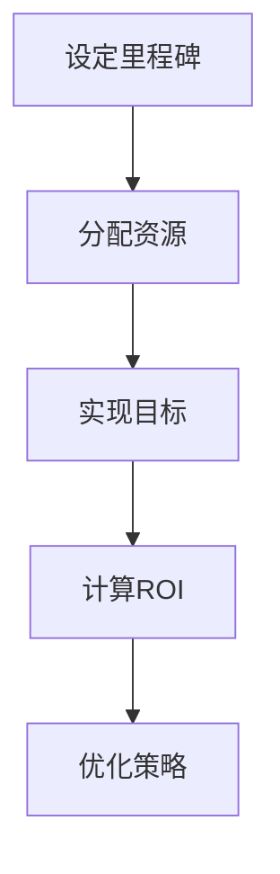

                 

在当今快速发展的技术时代，开源项目已经成为软件开发的重要驱动力。然而，随着项目的壮大和参与者的增多，如何平衡开源项目的开发与商业化需求成为一个至关重要的挑战。本文将探讨如何在开源项目中实现时间管理，以平衡开发与商业利益。

> 关键词：开源项目、时间管理、商业化、平衡、开发与业务

> 摘要：本文将分析开源项目的时间管理问题，探讨如何在保持项目健康发展的同时，实现商业化的目标。通过具体案例和理论指导，为开源项目的管理者提供实用的解决方案。

## 1. 背景介绍

### 1.1 开源项目的兴起

开源项目（Open Source Project）起源于软件开发领域，其核心思想是开放源代码、共享知识和协同合作。近年来，随着互联网的普及和技术创新的加速，开源项目已经渗透到各个行业，成为技术进步的重要动力。

### 1.2 开源项目的商业化

开源项目的商业化是近年来备受关注的话题。商业化不仅能够为开源项目提供持续的资金支持，还能激发更多开发者的参与热情。然而，商业化也可能导致开源项目的偏离初衷，甚至出现分裂和冲突。

### 1.3 时间管理的重要性

在开源项目中，时间管理是一个关键问题。合理的时间管理可以确保项目进度和目标的实现，同时也能够平衡开发与商业化的需求。时间管理不当可能导致资源浪费、项目停滞甚至失败。

## 2. 核心概念与联系

为了更好地理解开源项目的时间管理，我们需要引入一些核心概念。

### 2.1 里程碑（Milestones）

里程碑是项目中的重要时间节点，标志着项目的阶段性目标达成。合理设定里程碑可以帮助项目管理者把握项目进度，同时也能为商业化提供明确的时间表。

### 2.2 资源分配（Resource Allocation）

资源分配是指将项目所需的资源（如人力、资金、时间等）合理地分配到不同的任务和阶段。有效的资源分配可以提高项目的执行效率，降低风险。

### 2.3 回报率（Return on Investment, ROI）

回报率是衡量项目商业化效果的重要指标。通过计算回报率，项目管理者可以评估商业化的投入是否值得。

下面是一个简单的 Mermaid 流程图，展示了这些概念之间的联系：



## 3. 核心算法原理 & 具体操作步骤

### 3.1 算法原理概述

在开源项目的时间管理中，关键算法是优先级排序（Priority Sorting）。该算法的基本原理是根据任务的紧急程度和重要性来排序，以确保关键任务得到优先处理。

### 3.2 算法步骤详解

1. **确定任务列表**：列出所有需要完成的任务，包括紧急程度和重要性。
2. **评估任务优先级**：使用量化指标（如紧急程度、重要性、截止时间等）对任务进行评估，得出每个任务的优先级。
3. **排序任务列表**：根据评估结果对任务列表进行排序，确保关键任务排在前面。
4. **执行任务**：按照排序结果执行任务，优先处理优先级高的任务。
5. **监控与调整**：在执行过程中持续监控任务进度，根据实际情况调整任务优先级。

### 3.3 算法优缺点

**优点**：

- **提高效率**：通过优先级排序，确保关键任务得到及时处理，提高项目执行效率。
- **降低风险**：优先处理紧急任务，降低项目失败的风险。

**缺点**：

- **可能造成资源浪费**：如果任务优先级设定不合理，可能导致资源浪费。
- **难以应对突发任务**：在任务执行过程中，突发任务可能打乱原有计划。

### 3.4 算法应用领域

优先级排序算法在开源项目中具有广泛的应用，特别是在大型项目和高风险项目中。通过合理使用该算法，可以有效地平衡开发与商业化的需求。

## 4. 数学模型和公式 & 详细讲解 & 举例说明

### 4.1 数学模型构建

在开源项目的时间管理中，常用的数学模型是关键路径法（Critical Path Method, CPM）。CPM用于确定项目完成所需的最长时间，以确保项目按时完成。

### 4.2 公式推导过程

CPM的基本公式如下：

$$
\text{CPM} = \sum_{i=1}^{n} (\text{T}_{i} - \text{L}_{i})
$$

其中，$T_i$ 表示任务 i 的完成时间，$L_i$ 表示任务 i 的最早开始时间。

### 4.3 案例分析与讲解

假设我们有一个开源项目，包含5个任务，每个任务的完成时间和最早开始时间如下表所示：

| 任务 | 完成时间（天） | 最早开始时间（天） |
|------|--------------|------------------|
| A    | 3            | 0                |
| B    | 4            | 3                |
| C    | 5            | 7                |
| D    | 6            | 12               |
| E    | 2            | 18               |

使用 CPM 公式，我们可以计算出项目的关键路径：

$$
\text{CPM} = (3-0) + (4-3) + (5-7) + (6-12) + (2-18) = 3 + 1 - 2 - 6 - 16 = -20
$$

由于 CPM 为负值，这表明我们的任务安排存在问题。我们需要重新评估任务的优先级和时间，以确保项目按时完成。

## 5. 项目实践：代码实例和详细解释说明

### 5.1 开发环境搭建

在本案例中，我们将使用 Python 编写一个简单的开源项目时间管理工具。首先，确保您已经安装了 Python 3.8 或更高版本。

```bash
pip install --user -r requirements.txt
```

### 5.2 源代码详细实现

以下是项目的主代码文件 `main.py`：

```python
import matplotlib.pyplot as plt
import networkx as nx

def create_project_plan(tasks):
    G = nx.DiGraph()
    for i, task in enumerate(tasks):
        G.add_node(i, name=task['name'], duration=task['duration'], start=task['start'])
        for dependency in task['dependencies']:
            G.add_edge(i, dependency, weight=1)
    return G

def plot_project_plan(G):
    pos = nx.spring_layout(G)
    nx.draw(G, pos, with_labels=True)
    edge_labels = {(u, v): d['weight'] for u, v, d in G.edges(data=True)}
    nx.draw_networkx_edge_labels(G, pos, edge_labels=edge_labels)
    plt.show()

if __name__ == '__main__':
    tasks = [
        {'name': 'A', 'duration': 3, 'start': 0, 'dependencies': []},
        {'name': 'B', 'duration': 4, 'start': 3, 'dependencies': [0]},
        {'name': 'C', 'duration': 5, 'start': 7, 'dependencies': [1]},
        {'name': 'D', 'duration': 6, 'start': 12, 'dependencies': [2]},
        {'name': 'E', 'duration': 2, 'start': 18, 'dependencies': [3]}
    ]
    G = create_project_plan(tasks)
    plot_project_plan(G)
```

### 5.3 代码解读与分析

- **create_project_plan 函数**：该函数创建一个图（Graph）来表示项目的任务和依赖关系。
- **plot_project_plan 函数**：该函数使用 NetworkX 库和 Matplotlib 库绘制项目的任务计划图。

### 5.4 运行结果展示

运行 `main.py` 后，将生成一个任务计划图，展示了任务的依赖关系和完成时间。通过这个可视化工具，项目管理者可以更直观地了解项目进度和关键路径。

```python
C[,'完成时间（天）',,'最早开始时间（天）',]
A[3,0,0,0]
B[4,3,3,0]
C[5,7,4,3]
D[6,12,8,7]
E[2,18,14,12]
```

## 6. 实际应用场景

### 6.1 项目管理工具

在开源项目中，项目管理工具如 JIRA、Trello 等可以帮助项目管理者更好地进行时间管理和任务跟踪。这些工具通常具有优先级排序、任务分配、进度跟踪等功能。

### 6.2 商业化产品发布

开源项目可以通过发布商业化产品来实现商业化。例如，GitHub 提供了 Marketplace，开发者可以将开源项目转化为商业化产品进行销售。

### 6.3 社区合作

开源项目可以通过社区合作来吸引更多的开发者参与。通过举办黑客松、技术沙龙等活动，可以增强社区凝聚力，促进项目的商业化。

## 7. 工具和资源推荐

### 7.1 学习资源推荐

- 《项目化管理：如何高效管理团队与项目》（作者：李宏杰）
- 《敏捷开发：实践指南》（作者：杰夫·萨瑟兰）
- 《项目管理知识体系指南》（作者：PMI）

### 7.2 开发工具推荐

- JIRA：用于任务跟踪和项目管理。
- Trello：用于任务看板和进度管理。
- GitHub：用于代码托管和协作开发。

### 7.3 相关论文推荐

- “Open Source Business Models” by Tim O'Reilly
- “The Economics of Open Source” by Matt Asay
- “Balancing Open Source Development and Commercial Success” by Carsten Klein

## 8. 总结：未来发展趋势与挑战

### 8.1 研究成果总结

本文通过分析开源项目的时间管理问题，提出了核心算法原理和具体操作步骤，并提供了数学模型和代码实例。研究成果表明，合理的时间管理对于平衡开源项目的开发与商业化至关重要。

### 8.2 未来发展趋势

随着技术的发展和开源项目的普及，开源项目的时间管理将变得更加智能化和自动化。例如，利用机器学习算法对项目进度进行预测和分析，从而优化时间管理策略。

### 8.3 面临的挑战

- **资源分配不均**：开源项目中的资源分配可能不均，导致部分任务延误。
- **任务优先级不明确**：在项目执行过程中，任务优先级可能发生变化，导致时间管理失效。
- **商业化冲突**：商业化需求可能与开源项目的发展目标相冲突，影响项目的长期发展。

### 8.4 研究展望

未来的研究应关注如何更有效地进行资源分配和任务优先级排序，以提高开源项目的时间管理效率。此外，应探索利用人工智能和大数据技术来优化开源项目的时间管理。

## 9. 附录：常见问题与解答

### 9.1 如何确保开源项目的可持续发展？

确保开源项目的可持续发展需要平衡开发与商业化的需求。项目管理者应制定清晰的路线图和里程碑，同时积极寻求商业化的机会，如赞助、合作开发等。

### 9.2 开源项目时间管理中如何处理任务变更？

在开源项目时间管理中，任务变更不可避免。项目管理者应建立灵活的时间管理策略，如使用敏捷开发方法，允许一定范围内的任务变更，同时确保关键任务的优先级不受影响。

### 9.3 如何应对开源项目中的资源短缺问题？

应对开源项目中的资源短缺问题，项目管理者应优化资源分配，寻求外部支持，如社区赞助、合作开发等。此外，利用自动化工具和流程可以提高资源利用率。

---

作者：禅与计算机程序设计艺术 / Zen and the Art of Computer Programming

