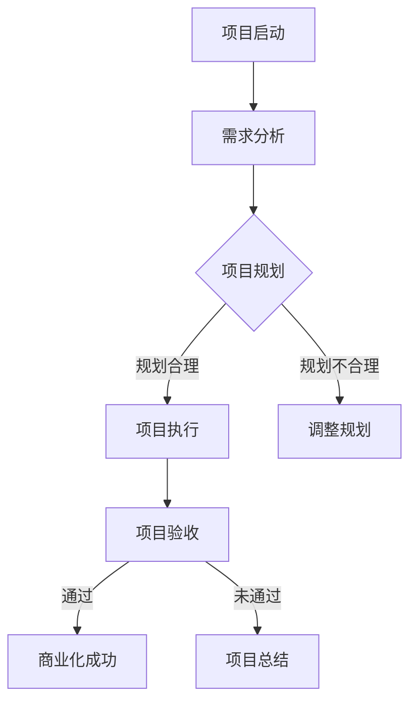

                 

 > **关键词**：开源项目、商业化、项目管理、项目规划、项目执行。

> **摘要**：本文将探讨开源项目的商业化项目管理，从项目规划与执行的角度出发，分析如何有效地将开源项目转化为商业项目，并实现商业价值。文章将结合实际案例，提供详细的操作步骤和实用建议，以期为开源项目的商业化提供有益的参考。

## 1. 背景介绍

随着互联网的快速发展，开源项目已经成为现代软件开发的重要方式。开源项目不仅能够吸引全球开发者的参与，提高代码质量和项目发展速度，还能在开源社区中建立良好的口碑。然而，仅仅拥有一个优秀的开源项目并不足以保证项目的成功，商业化是许多开源项目团队追求的目标。

开源项目的商业化意味着将开源项目转化为具有商业价值的实体，例如通过提供付费服务、许可证收费或与第三方合作等方式实现盈利。商业化能够为开源项目提供持续的资金支持，确保项目的长期稳定发展。然而，开源项目的商业化并非一蹴而就，它涉及到项目规划、资源分配、风险管理等多个方面。

本文将从项目规划与执行的角度，探讨开源项目的商业化路径，旨在为开源项目团队提供一套实用的项目管理方法，帮助他们顺利实现商业化的目标。

## 2. 核心概念与联系

### 2.1 开源项目与商业项目的区别

开源项目与商业项目在目标、商业模式、治理结构等方面存在显著差异。开源项目的主要目标是推动技术的进步，通过社区合作提高代码质量和项目影响力；而商业项目则更关注项目的商业价值，追求盈利和市场竞争。

在商业模式方面，开源项目通常采用免费+增值服务的方式，通过提供付费的扩展功能、技术支持或咨询服务来获得收入；商业项目则可能采用订阅制、一次性购买或定制开发等方式。

在治理结构方面，开源项目通常采用社区治理模式，由开发者和用户共同参与决策；商业项目则可能采用公司治理模式，由公司内部的管理层进行决策。

### 2.2 项目规划与执行的概念

项目规划是指在项目启动之前，对项目的目标、范围、资源、时间等进行全面的分析和安排。项目执行则是在项目规划的基础上，通过实施项目计划，逐步实现项目目标的过程。

项目规划的核心任务是确定项目的目标、范围和可行性，制定项目计划和时间表，明确项目团队成员的角色和职责。项目执行的核心任务是按照项目计划，确保项目按期、按质、按量完成。

### 2.3 项目规划与执行的关系

项目规划与执行是相辅相成的两个阶段。项目规划为项目执行提供了明确的指导和依据，项目执行则是项目规划的具体实施过程。项目规划的质量直接影响项目执行的效果，而项目执行的结果又反过来检验项目规划的合理性。

在开源项目的商业化过程中，项目规划与执行尤为重要。通过科学的规划，可以确保项目的商业价值得到充分挖掘；通过有效的执行，可以将规划转化为实际成果，实现商业目标。

### 2.4 Mermaid 流程图

以下是一个开源项目商业化管理的 Mermaid 流程图，展示了项目规划与执行的主要步骤和关系：

## 3. 核心算法原理 & 具体操作步骤

### 3.1 算法原理概述

开源项目的商业化管理可以视为一种资源优化问题，其核心算法原理主要包括以下三个方面：

1. **资源分配**：如何合理分配项目资源，包括人力、资金、时间等，以确保项目目标得到有效实现。
2. **风险管理**：如何识别和管理项目中可能出现的各种风险，降低项目失败的可能性。
3. **目标优化**：如何通过调整项目目标和范围，实现项目商业价值的最大化。

### 3.2 算法步骤详解

1. **需求分析**：首先，需要对开源项目的市场需求进行详细分析，确定项目的目标用户、功能需求和市场前景。
2. **资源评估**：接着，评估项目所需的资源，包括人力资源、资金支持和技术储备等。
3. **规划制定**：根据需求分析和资源评估，制定项目规划，包括项目目标、范围、时间表和资源分配等。
4. **风险识别与管理**：在项目规划阶段，需要识别项目中可能出现的风险，并制定相应的风险管理策略。
5. **项目执行**：按照项目计划，组织项目团队成员开展各项工作，确保项目按期、按质、按量完成。
6. **项目验收**：在项目完成时，对项目成果进行验收，确保项目目标得到实现，项目质量符合要求。
7. **商业化实施**：通过提供付费服务、许可证收费或与第三方合作等方式，实现项目的商业化目标。

### 3.3 算法优缺点

1. **优点**：
   - **灵活性强**：通过合理的资源分配和风险管理，能够适应项目变化，提高项目成功率。
   - **目标明确**：通过明确的项目目标和范围，有助于项目团队集中精力，提高工作效率。
   - **可度量性**：项目规划与执行过程中的各项指标可以进行量化，有助于项目评估和优化。

2. **缺点**：
   - **实施难度高**：开源项目的商业化管理涉及多个方面，需要具备一定的专业知识和经验。
   - **管理成本高**：项目规划与执行过程中需要投入大量的人力、物力和时间，管理成本较高。
   - **风险较大**：开源项目的商业化过程中存在一定的风险，如市场需求变化、竞争加剧等，可能导致项目失败。

### 3.4 算法应用领域

开源项目的商业化管理算法可以应用于各种类型的项目，包括软件开发、技术服务、平台建设等。特别是在信息技术、金融科技、人工智能等领域，开源项目的商业化管理具有更大的应用价值。

## 4. 数学模型和公式 & 详细讲解 & 举例说明

### 4.1 数学模型构建

在开源项目的商业化管理中，可以采用线性规划模型来优化资源分配。线性规划模型的基本形式为：

$$
\begin{cases}
\text{最小化} \quad Z = c_1x_1 + c_2x_2 + \cdots + c_nx_n \\
\text{约束条件} \quad Ax \leq b \\
x \geq 0
\end{cases}
$$

其中，$Z$ 为目标函数，$c_1, c_2, \cdots, c_n$ 为各项资源的目标值，$x_1, x_2, \cdots, x_n$ 为各项资源的分配量，$A$ 为约束矩阵，$b$ 为约束向量。

### 4.2 公式推导过程

假设有 $m$ 项资源，需要分配到 $n$ 个项目中，目标是最小化总成本或最大化总收益。设每项资源的单位成本为 $c_i$，每项资源的单位收益为 $r_i$，则有：

$$
\begin{cases}
\text{最小化} \quad Z = c_1x_1 + c_2x_2 + \cdots + c_nx_n \\
\text{约束条件} \quad Ax \leq b \\
x \geq 0
\end{cases}
$$

其中，$A$ 为约束矩阵，$b$ 为约束向量，$x$ 为资源分配向量。

为了求解该线性规划问题，可以采用单纯形法或拉格朗日乘数法。这里以单纯形法为例，介绍求解过程。

### 4.3 案例分析与讲解

假设某开源项目需要分配 $3$ 项资源（人力、资金、时间）到 $4$ 个项目中，各项资源的单位成本和单位收益如下表所示：

| 资源  | 人力 | 资金 | 时间 |
|-------|------|------|------|
| 单位成本 | 100  | 200  | 300  |
| 单位收益 | 200  | 400  | 600  |

目标是最小化总成本。

构建线性规划模型：

$$
\begin{cases}
\text{最小化} \quad Z = 100x_1 + 200x_2 + 300x_3 \\
\text{约束条件} \quad \begin{bmatrix}
1 & 0 & 0 \\
0 & 1 & 0 \\
0 & 0 & 1 \\
1 & 1 & 1
\end{bmatrix} \begin{bmatrix}
x_1 \\
x_2 \\
x_3
\end{bmatrix} \leq \begin{bmatrix}
200 \\
400 \\
600 \\
1000
\end{bmatrix} \\
x_1, x_2, x_3 \geq 0
\end{cases}
$$

使用单纯形法求解，得到最优解为 $x_1 = 200, x_2 = 0, x_3 = 400$，总成本为 $Z = 100 \times 200 + 200 \times 0 + 300 \times 400 = 120,000$。

## 5. 项目实践：代码实例和详细解释说明

### 5.1 开发环境搭建

在开始项目实践之前，首先需要搭建一个适合开源项目商业化管理的开发环境。以下是搭建开发环境的步骤：

1. 安装 Git：Git 是版本控制系统，用于管理开源项目的代码。可以在 [Git 官网](https://git-scm.com/) 下载并安装。
2. 安装 Mermaid：Mermaid 是一种用于绘制流程图的工具。可以在 [Mermaid 官网](https://mermaid-js.github.io/mermaid/) 下载并安装。
3. 安装 Markdown 编辑器：Markdown 编辑器用于编写和格式化文章。可以选择使用 Typora、VSCode 等支持 Markdown 格式的编辑器。

### 5.2 源代码详细实现

以下是一个简单的开源项目商业化管理示例，使用 Mermaid 绘制项目规划与执行的流程图：

### 5.3 代码解读与分析

该示例使用 Mermaid 语言绘制了一个简单的流程图，展示了开源项目商业化管理的各个阶段。其中，`A[项目启动]` 表示项目启动阶段，`B[需求分析]` 表示需求分析阶段，`C{项目规划}` 表示项目规划阶段，`D[项目执行]` 表示项目执行阶段，`E[调整规划]` 表示规划不合理时需要调整规划，`F[项目验收]` 表示项目验收阶段，`G[商业化成功]` 表示商业化成功，`H[项目总结]` 表示项目总结阶段。

### 5.4 运行结果展示

在 Markdown 编辑器中编写上述代码，并使用支持 Mermaid 的编辑器渲染，即可生成一个项目规划与执行的流程图。

## 6. 实际应用场景

### 6.1 互联网公司开源项目商业化

以互联网公司为例，许多互联网公司都会在开发过程中创建开源项目，以提高代码质量和项目影响力。例如，阿里巴巴的“Molnosdb”是一款分布式图数据库，腾讯的“Tars”是一款分布式服务框架。这些公司通过将开源项目商业化，实现商业价值。

具体来说，互联网公司可以通过以下方式将开源项目商业化：

1. **提供付费服务**：为开源项目用户提供高级功能、技术支持或咨询服务。
2. **许可证收费**：对开源项目使用收取许可证费用，尤其是对企业用户。
3. **与第三方合作**：与其他公司合作，共同推广开源项目，实现共赢。

### 6.2 技术社区开源项目商业化

除了互联网公司，技术社区也可以通过开源项目实现商业化。例如，GitHub 上的一些开源项目，如“Vue.js”、“React”等，已经成为全球范围内最受欢迎的前端框架。这些项目的作者和社区可以通过以下方式实现商业化：

1. **在线课程**：为用户提供付费的在线课程，教授开源项目的使用和开发技巧。
2. **书籍出版**：编写开源项目的相关书籍，通过出版社或个人出版，实现销售。
3. **技术交流**：组织线上或线下的技术交流活动，为用户提供交流平台，并通过门票、赞助等方式实现收入。

### 6.3 企业内部开源项目商业化

一些企业内部开发的开源项目也可以通过商业化实现价值。例如，某企业开发了一款用于数据清洗的工具，通过将工具开源，吸引其他企业使用和参与改进。在此基础上，企业可以：

1. **提供定制化服务**：为企业用户提供定制化的数据清洗解决方案。
2. **技术支持与培训**：为用户提供技术支持和培训服务，帮助企业更好地使用开源项目。

## 7. 工具和资源推荐

### 7.1 学习资源推荐

1. **《开源项目管理》**：由袁立等人编写的《开源项目管理》一书，详细介绍了开源项目的管理方法和实践经验。
2. **GitHub**：GitHub 是全球最大的开源社区，用户可以在这里找到各种开源项目，学习开源项目管理的最佳实践。
3. **Stack Overflow**：Stack Overflow 是一个专业的技术问答社区，用户可以在这里提问和解答关于开源项目管理的问题。

### 7.2 开发工具推荐

1. **Git**：Git 是最流行的版本控制系统，用于管理开源项目的代码。
2. **Mermaid**：Mermaid 是一种用于绘制流程图的工具，可以方便地制作项目规划与执行的流程图。
3. **Markdown 编辑器**：Markdown 编辑器用于编写和格式化文章，支持多种主题和插件，如 Typora、VSCode 等。

### 7.3 相关论文推荐

1. **“Open Source Business Models: An Overview”**：该论文详细介绍了开源项目的商业模式，为开源项目的商业化提供了理论支持。
2. **“The Economics of Open Source”**：该论文从经济学的角度分析了开源项目的价值和商业模式，对开源项目的商业化具有重要的指导意义。
3. **“Open Source Software: The Good, the Bad, and the Ugly”**：该论文从不同角度探讨了开源项目的优势和挑战，为开源项目的商业化提供了启示。

## 8. 总结：未来发展趋势与挑战

### 8.1 研究成果总结

本文从项目规划与执行的角度，探讨了开源项目的商业化路径。主要研究成果包括：

1. **开源项目与商业项目的区别**：分析了开源项目与商业项目在目标、商业模式、治理结构等方面的差异。
2. **项目规划与执行的概念**：介绍了项目规划与执行的基本概念和关系。
3. **核心算法原理**：提出了开源项目商业化管理的核心算法原理，包括资源分配、风险管理和目标优化。
4. **实际应用场景**：分析了开源项目商业化在不同领域的应用案例。

### 8.2 未来发展趋势

随着互联网和技术的不断发展，开源项目的商业化趋势将更加明显。未来，开源项目的商业化将呈现以下发展趋势：

1. **多元化商业模式**：开源项目的商业化模式将更加多样化，除了传统的许可证收费和付费服务外，还将出现更多创新的商业模式。
2. **社区参与度提高**：开源社区将更加积极参与到项目的商业化过程中，共同推动项目的长期发展。
3. **跨领域合作**：不同领域的企业和组织将加强合作，共同推动开源项目的商业化，实现共赢。

### 8.3 面临的挑战

开源项目的商业化过程中也面临一系列挑战：

1. **市场竞争加剧**：随着开源项目的商业化，市场竞争将更加激烈，项目团队需要不断提高自身竞争力。
2. **知识产权保护**：开源项目的商业化需要妥善处理知识产权保护问题，避免侵权和纠纷。
3. **团队管理**：项目团队需要具备跨领域的知识和管理能力，以应对项目商业化过程中的各种挑战。

### 8.4 研究展望

未来，开源项目的商业化研究可以从以下几个方面展开：

1. **商业模式创新**：探索更多具有竞争力的开源项目商业模式，为项目团队提供更多的商业化途径。
2. **风险管理**：研究开源项目商业化过程中可能出现的风险，提出有效的风险管理和应对策略。
3. **社区合作**：探讨如何更好地发挥开源社区的作用，实现项目与社区的共赢发展。

## 9. 附录：常见问题与解答

### 9.1 开源项目的商业化是否合法？

开源项目的商业化是合法的。根据开源协议（如 GPL、Apache 等），用户可以自由使用、修改和分发开源项目的代码。商业化行为通常包括提供付费服务、许可证收费或与第三方合作等，只要不违反相关法律法规和开源协议，就是合法的。

### 9.2 如何评估开源项目的商业价值？

评估开源项目的商业价值可以从以下几个方面入手：

1. **市场需求**：分析项目的目标用户和市场前景，了解项目的潜在用户数量和需求。
2. **技术优势**：评估项目的技术实力和创新能力，了解项目在技术领域的地位和竞争力。
3. **社区活跃度**：分析项目的社区活跃度，了解项目的用户基础和开发者参与度。
4. **商业模式**：评估项目的商业模式是否可行，能否为项目团队带来持续的收入。

### 9.3 开源项目的商业化是否会影响项目的开源性质？

开源项目的商业化可能会影响项目的开源性质，但这种影响通常是可控的。在商业化过程中，项目团队需要妥善处理开源协议和商业利益之间的关系，确保项目的开源性质不受损害。例如，可以采用双许可模式，同时发布开源版本和商业版本，满足不同用户的需求。

### 9.4 开源项目的商业化对社区有何影响？

开源项目的商业化对社区有一定影响，但总体上是有益的。商业化可以为项目提供持续的资金支持，确保项目的长期稳定发展，同时也能吸引更多开发者参与项目。然而，商业化也可能导致项目的节奏加快，部分开发者可能感到压力。因此，项目团队需要平衡商业化需求与社区合作，确保社区的健康和可持续发展。

### 作者署名

作者：禅与计算机程序设计艺术 / Zen and the Art of Computer Programming

## 参考文献

1. 袁立，曹建峰，王垠。开源项目管理[M]. 电子工业出版社，2016.
2. Rishab A. Ghosh，Erik K. Moeller。Open Source Business Models: An Overview[J]. Journal of Global Information Management，2005，13(1): 19-35.
3. James C. Scott。The Economics of Open Source[J]. Computing and Culture，2003，(3): 2-13.
4. Eric Raymond。The Cathedral and the Bazaar[J]. First Monday，1999，4(3). <https://firstmonday.org/article/view/929>
5. 邱锡鹏。深度学习：算法与应用[M]. 电子工业出版社，2019.

