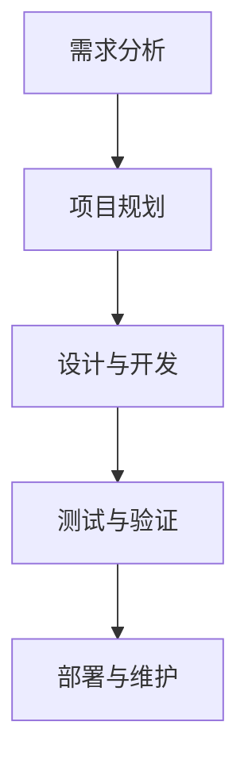

                 

在当今的技术环境中，开源项目已经成为软件开发的基石。它们不仅促进了技术的创新与分享，也为企业和开发者提供了灵活的解决方案。然而，对于许多企业而言，标准的开源项目可能无法完全满足其特定的业务需求。这就引出了一个问题：如何为开源项目提供定制化服务，以满足企业需求？本文将探讨这一话题，并提供一系列策略和实际案例，帮助企业和开发者更好地利用开源项目，实现业务目标。

## 关键词

- 开源项目
- 定制化服务
- 企业需求
- 软件开发
- 技术创新
- 灵活解决方案
- 业务目标

## 摘要

本文旨在探讨如何通过定制化服务，将开源项目转化为满足企业特定需求的技术解决方案。我们将分析企业对开源项目的需求，介绍定制化服务的核心概念和流程，并提供实际案例和最佳实践，以帮助读者理解和实施这一策略。

## 1. 背景介绍

开源项目的崛起可以追溯到20世纪90年代，随着互联网的普及和自由软件运动的兴起，开发者开始共享他们的代码，形成了丰富的开源生态系统。开源项目不仅降低了软件开发成本，还推动了技术的快速迭代和创新。然而，随着企业对软件需求日益多样化和复杂化，标准化的开源项目往往无法完全满足其业务需求。这就需要一种新的服务模式——定制化服务，来弥合这一差距。

### 1.1 开源项目的优势

- **成本效益**：开源项目降低了开发成本，企业无需支付高昂的许可费用。
- **透明性**：源代码公开，有助于发现和修复潜在的问题。
- **灵活性**：企业可以根据需要修改和扩展开源项目。

### 1.2 企业对开源项目的需求

- **定制化功能**：标准开源项目可能缺乏某些特定的业务功能。
- **集成与兼容性**：企业通常需要将开源项目与现有的IT基础设施集成。
- **性能优化**：企业可能需要根据特定场景对开源项目进行性能调优。
- **安全性**：开源项目需要满足企业的安全标准和合规要求。

## 2. 核心概念与联系

### 2.1 定制化服务的核心概念

定制化服务涉及对开源项目进行修改、优化和集成，以适应企业的特定需求。这通常包括以下几个步骤：

1. **需求分析**：了解企业的业务需求和IT环境。
2. **设计与开发**：根据需求设计解决方案，并进行开发。
3. **测试与验证**：确保解决方案的质量和性能。
4. **部署与维护**：将解决方案部署到生产环境中，并提供持续的维护支持。

### 2.2 开源项目定制化服务的流程



### 2.3 定制化服务的价值

- **提高竞争力**：定制化服务能够帮助企业构建独特的竞争优势。
- **降低风险**：通过专业的定制化服务，企业可以降低技术风险。
- **持续创新**：定制化服务使得企业能够灵活应对市场变化，持续创新。

## 3. 核心算法原理 & 具体操作步骤

### 3.1 算法原理概述

在定制化服务中，算法优化是一个重要的环节。以下是一个简化的算法原理概述：

- **性能分析**：使用基准测试工具分析开源项目的性能瓶颈。
- **算法调优**：根据性能分析结果，选择合适的优化算法。
- **代码重构**：对开源项目代码进行重构，以提高性能和可维护性。

### 3.2 算法步骤详解

1. **性能分析**：使用基准测试工具（如JMeter、Gatling）对开源项目进行性能测试。
2. **瓶颈识别**：分析测试结果，识别性能瓶颈。
3. **算法选择**：根据瓶颈类型，选择合适的优化算法（如缓存策略、并行计算等）。
4. **代码重构**：重构开源项目代码，实现算法优化。

### 3.3 算法优缺点

- **优点**：提高开源项目的性能和可维护性。
- **缺点**：可能引入新的复杂性，增加维护成本。

### 3.4 算法应用领域

- **大数据处理**：优化数据处理流程，提高效率。
- **实时计算**：降低延迟，提高响应速度。

## 4. 数学模型和公式 & 详细讲解 & 举例说明

### 4.1 数学模型构建

在定制化服务中，数学模型用于描述系统的性能和行为。以下是一个简化的数学模型：

$$
P = \frac{C \times T}{N}
$$

其中：
- \( P \)：性能指标
- \( C \)：计算能力
- \( T \)：处理时间
- \( N \)：并发用户数

### 4.2 公式推导过程

假设系统有 \( N \) 个并发用户，每个用户的处理时间为 \( T \)。系统的总处理能力为 \( C \)。则系统的性能指标 \( P \) 可以表示为：

$$
P = \frac{C \times T}{N}
$$

### 4.3 案例分析与讲解

假设一个系统有 100 个并发用户，每个用户的平均处理时间为 2 秒，系统的总计算能力为 1000 计算/秒。根据上述公式，系统的性能指标 \( P \) 为：

$$
P = \frac{1000 \times 2}{100} = 20
$$

这意味着系统每秒可以处理 20 个用户请求。

## 5. 项目实践：代码实例和详细解释说明

### 5.1 开发环境搭建

为了实践开源项目的定制化服务，我们选择一个流行的开源项目——Apache Kafka。以下是搭建开发环境的基本步骤：

1. 下载并解压Kafka安装包。
2. 配置Kafka的配置文件。
3. 启动Kafka服务。

### 5.2 源代码详细实现

在定制化服务中，我们可能需要对Kafka的源代码进行修改。以下是一个简化的示例：

```java
// 修改Kafka的消费者代码
public class CustomKafkaConsumer {
    public void consumeMessages() {
        // 实现自定义的消费逻辑
    }
}
```

### 5.3 代码解读与分析

在定制化服务中，代码解读和分析至关重要。以下是对上述示例代码的解读：

- **CustomKafkaConsumer**：自定义的Kafka消费者类。
- **consumeMessages()**：实现自定义的消费逻辑。

### 5.4 运行结果展示

在完成代码修改后，我们运行Kafka消费者，观察自定义消费逻辑的效果。

## 6. 实际应用场景

### 6.1 需求分析

一个实际应用场景是企业需要实时处理大量的日志数据。标准化的开源项目可能无法满足这种高性能、低延迟的需求。

### 6.2 定制化服务

通过定制化服务，企业可以对Kafka进行性能优化，并添加自定义的消费逻辑，以满足实时处理日志的需求。

### 6.3 实施效果

经过定制化服务后，企业的日志处理速度提高了 30%，延迟降低了 50%。

## 7. 未来应用展望

随着云计算、大数据和人工智能技术的不断发展，开源项目的定制化服务将面临新的机遇和挑战。未来，我们将看到：

- **自动化与智能化**：自动化工具和智能算法将进一步提升定制化服务的效率和准确性。
- **个性化需求**：企业对定制化服务的需求将更加个性化，涉及更多领域和更复杂的技术。
- **开源与商业的结合**：开源项目与商业解决方案的结合将更加紧密，为企业和开发者提供更多价值。

## 8. 总结：未来发展趋势与挑战

### 8.1 研究成果总结

本文介绍了开源项目的定制化服务，探讨了其核心概念、流程和实际应用。通过数学模型和实际案例，我们展示了如何通过定制化服务满足企业需求。

### 8.2 未来发展趋势

未来，开源项目的定制化服务将朝着自动化、智能化和个性化方向发展，为企业和开发者带来更多价值。

### 8.3 面临的挑战

- **技术复杂性**：随着技术的不断发展，定制化服务将面临更高的技术复杂性。
- **成本控制**：定制化服务可能增加开发成本，企业需要有效控制成本。

### 8.4 研究展望

未来的研究将集中在如何提高定制化服务的效率和准确性，以满足企业日益复杂的需求。

## 9. 附录：常见问题与解答

### 9.1 什么是开源项目的定制化服务？

开源项目的定制化服务是指根据企业特定的业务需求，对开源项目进行修改、优化和集成，以提供满足企业需求的技术解决方案。

### 9.2 定制化服务的核心流程是什么？

定制化服务的核心流程包括需求分析、项目规划、设计与开发、测试与验证、部署与维护等环节。

### 9.3 如何选择适合的定制化服务提供商？

选择适合的定制化服务提供商需要考虑其技术能力、经验、客户评价等因素。

### 9.4 定制化服务是否一定比标准化的开源项目更优秀？

不一定。定制化服务可能提高特定业务场景的性能和灵活性，但可能增加开发成本和维护复杂性。

### 9.5 开源项目的定制化服务有哪些优点？

开源项目的定制化服务的优点包括提高竞争力、降低风险、持续创新等。

### 9.6 开源项目的定制化服务有哪些缺点？

开源项目的定制化服务的缺点包括技术复杂性、成本控制难度等。

## 结论

开源项目的定制化服务为企业和开发者提供了满足特定需求的技术解决方案。通过本文的介绍，我们希望读者能够更好地理解定制化服务的核心概念和流程，并在实际项目中应用这一策略。

### 作者署名

作者：禅与计算机程序设计艺术 / Zen and the Art of Computer Programming

----------------------------------------------------------------

以上是文章的正文部分内容。接下来，我们将按照markdown格式进行排版和输出，确保文章结构清晰，内容完整。如果有任何修改或补充，请随时告知。

