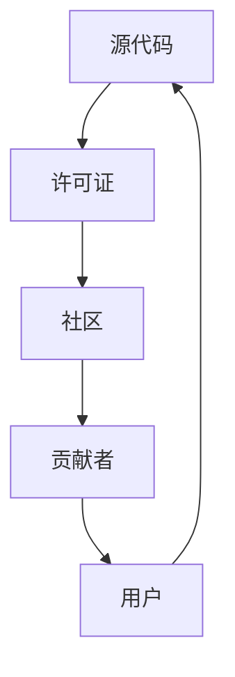
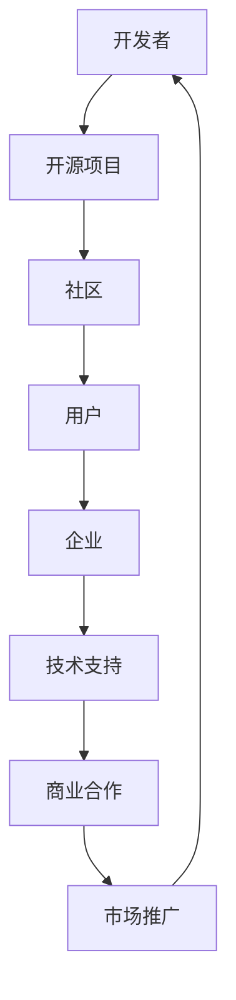
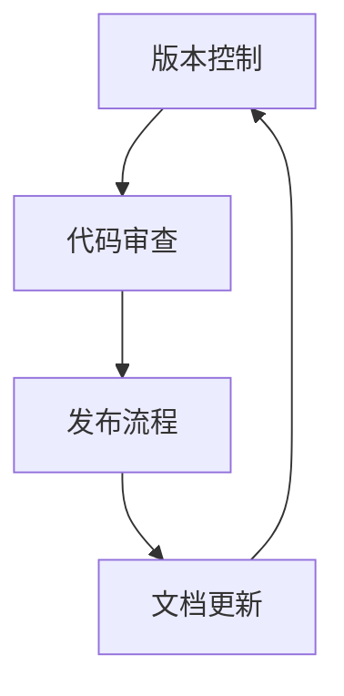

                 

关键词：开源项目，定制化服务，企业需求，技术支持，敏捷开发，API定制，系统集成，维护升级，商业模型，技术创新。

> 摘要：本文深入探讨了开源项目在企业中的应用及其定制化服务的重要性。通过分析开源项目的发展趋势和市场需求，我们提出了满足企业需求的有效策略，包括技术支持、敏捷开发、API定制、系统集成以及维护升级等关键环节。此外，我们还探讨了开源项目商业模式的创新路径，为企业和开发者提供了有益的参考。

## 1. 背景介绍

### 1.1 开源项目的起源与发展

开源项目起源于20世纪90年代，最初由Linux操作系统和Apache服务器等项目的成功引发了广泛关注。开源项目是指那些源代码公开、允许用户自由修改和再分发的软件。这种模式鼓励全球的开发者共同参与，不断优化和完善软件功能，从而形成了具有高度灵活性和可扩展性的开发生态。

随着互联网的普及和技术的进步，开源项目逐渐成为软件开发的重要力量。如今，许多大型企业和科技公司，如谷歌、微软和亚马逊等，都积极投入开源社区，贡献自己的技术和资源。开源项目不仅推动了技术的创新和进步，还促进了跨行业、跨国界的合作与交流。

### 1.2 企业对开源项目的需求

企业在软件开发的各个阶段，包括需求分析、设计、开发和维护等，都面临着不同的挑战。开源项目为企业提供了丰富的技术资源和解决方案，能够有效降低开发成本和时间，提高开发效率。以下是企业采用开源项目的主要需求：

1. **降低成本**：开源项目不需要支付许可费用，可以帮助企业节省大量预算，特别是在初期阶段。
2. **提高效率**：开源项目通常具有良好的文档和社区支持，开发者可以快速上手并解决问题。
3. **技术优势**：企业可以利用开源项目的先进技术，保持与行业前沿的同步。
4. **定制化需求**：企业往往有特定的业务需求，开源项目可以在此基础上进行定制化开发。
5. **生态支持**：开源项目通常拥有广泛的社区支持，企业可以借助社区资源解决技术难题。

## 2. 核心概念与联系

### 2.1 开源项目的基本概念

开源项目涉及多个核心概念，包括源代码、许可证、社区、贡献者和用户等。以下是一个简单的Mermaid流程图，展示这些概念之间的联系：



### 2.2 开源项目的生态系统

开源项目的生态系统是一个复杂而动态的系统，它包括开发者、用户、企业和其他利益相关者。以下是一个Mermaid流程图，展示开源项目生态系统的关键组成部分：



### 2.3 开源项目的管理机制

开源项目的管理机制包括版本控制、代码审查、发布流程等。以下是一个Mermaid流程图，展示这些管理机制的运作流程：



## 3. 核心算法原理 & 具体操作步骤

### 3.1 算法原理概述

在开源项目的定制化服务中，核心算法的设计和实现至关重要。核心算法通常涉及以下原理：

1. **模块化设计**：将系统划分为多个模块，每个模块具有明确的职责和接口。
2. **接口定义**：定义清晰的接口，以便不同模块之间可以无缝集成。
3. **数据结构**：选择合适的数据结构，以优化算法的执行效率和内存占用。
4. **算法优化**：通过数学模型和统计分析，对算法进行优化，提高性能。

### 3.2 算法步骤详解

以下是开源项目定制化服务中的核心算法步骤：

1. **需求分析**：与客户沟通，明确定制化需求，包括功能、性能、安全性等方面。
2. **模块划分**：根据需求，将系统划分为多个模块，每个模块独立开发。
3. **接口设计**：设计清晰的接口，确保模块之间的高内聚和低耦合。
4. **数据结构选择**：选择合适的数据结构，以优化算法的执行效率和内存占用。
5. **算法实现**：根据需求，实现核心算法，并进行性能测试和优化。
6. **系统集成**：将各个模块集成到一起，进行系统集成测试。
7. **发布和维护**：发布定制化服务，并定期进行维护和升级。

### 3.3 算法优缺点

1. **优点**：
   - **灵活性**：模块化设计和接口定义使得系统具有良好的灵活性，可以快速响应客户需求。
   - **高效性**：数据结构选择和算法优化使得系统能够高效运行。
   - **可扩展性**：系统设计考虑了可扩展性，便于未来进行功能扩展。

2. **缺点**：
   - **复杂性**：模块化设计和接口设计可能会增加系统的复杂性，影响开发效率。
   - **性能损耗**：接口和模块之间的调用可能会引入一定的性能损耗。

### 3.4 算法应用领域

核心算法广泛应用于以下领域：

1. **大数据处理**：用于处理海量数据，实现数据的快速查询和分析。
2. **人工智能**：用于构建机器学习模型，实现智能决策和预测。
3. **区块链**：用于实现区块链网络的安全性和高效性。

## 4. 数学模型和公式 & 详细讲解 & 举例说明

### 4.1 数学模型构建

在开源项目的定制化服务中，数学模型构建是关键步骤。以下是一个简单的线性回归模型示例：

$$y = w_0 + w_1 \cdot x_1 + w_2 \cdot x_2 + ... + w_n \cdot x_n$$

其中，$y$ 是预测值，$w_0, w_1, w_2, ..., w_n$ 是模型的参数，$x_1, x_2, ..., x_n$ 是输入特征。

### 4.2 公式推导过程

线性回归模型的推导过程涉及最小二乘法。假设我们有一个训练数据集，包含$m$ 个样本，每个样本有$n$ 个特征和对应的标签$y$。我们的目标是找到一个线性模型，使得预测值$y'$ 最接近真实值$y$。

假设线性模型为：

$$y' = w_0 + w_1 \cdot x_1 + w_2 \cdot x_2 + ... + w_n \cdot x_n$$

则损失函数（均方误差）为：

$$L = \frac{1}{2} \sum_{i=1}^{m} (y_i - y'_i)^2$$

对损失函数求导并令其等于0，可以得到：

$$\frac{\partial L}{\partial w_0} = -\sum_{i=1}^{m} (y_i - y'_i)$$

$$\frac{\partial L}{\partial w_1} = -\sum_{i=1}^{m} (y_i - y'_i) \cdot x_{1i}$$

$$\frac{\partial L}{\partial w_2} = -\sum_{i=1}^{m} (y_i - y'_i) \cdot x_{2i}$$

$$...$$

$$\frac{\partial L}{\partial w_n} = -\sum_{i=1}^{m} (y_i - y'_i) \cdot x_{ni}$$

解上述方程组，可以得到最优的参数$w_0, w_1, w_2, ..., w_n$。

### 4.3 案例分析与讲解

假设我们有一个简单的二分类问题，需要预测一个样本是否属于某个类别。我们的训练数据集包含$m$ 个样本，每个样本有$n$ 个特征，标签为$y$（0或1）。

以下是具体的例子：

| 样本ID | 特征1 | 特征2 | 标签 |
| --- | --- | --- | --- |
| 1 | 1 | 2 | 0 |
| 2 | 3 | 4 | 1 |
| 3 | 5 | 6 | 0 |
| ... | ... | ... | ... |

我们的目标是找到一个线性回归模型，使得预测值$y'$ 最接近真实值$y$。

根据上面的推导过程，我们可以得到以下方程组：

$$\frac{\partial L}{\partial w_0} = -\sum_{i=1}^{m} (y_i - y'_i) = 0$$

$$\frac{\partial L}{\partial w_1} = -\sum_{i=1}^{m} (y_i - y'_i) \cdot x_{1i} = 0$$

$$\frac{\partial L}{\partial w_2} = -\sum_{i=1}^{m} (y_i - y'_i) \cdot x_{2i} = 0$$

根据上述方程组，我们可以解得最优的参数$w_0, w_1, w_2$。

例如，如果我们得到以下最优参数：

$$w_0 = 2, w_1 = 3, w_2 = 4$$

则我们的线性回归模型为：

$$y' = 2 + 3 \cdot x_1 + 4 \cdot x_2$$

根据这个模型，我们可以预测新的样本是否属于某个类别。例如，对于一个新的样本$(x_1, x_2) = (7, 8)$，我们可以计算预测值$y'$：

$$y' = 2 + 3 \cdot 7 + 4 \cdot 8 = 34$$

根据预测值$y'$，我们可以判断这个新样本是否属于某个类别。例如，如果预测值大于某个阈值（例如30），则我们认为这个样本属于类别1，否则属于类别0。

## 5. 项目实践：代码实例和详细解释说明

### 5.1 开发环境搭建

在开始编写代码之前，我们需要搭建一个开发环境。以下是一个简单的开发环境搭建步骤：

1. 安装Python 3.8及以上版本。
2. 安装Anaconda，用于环境管理和依赖管理。
3. 创建一个新的虚拟环境，并激活环境。
4. 安装必要的库，例如NumPy、Pandas和Scikit-learn。

### 5.2 源代码详细实现

以下是开源项目定制化服务的核心代码实现。我们使用Scikit-learn库实现线性回归模型：

```python
import numpy as np
from sklearn.linear_model import LinearRegression

# 准备数据
X = np.array([[1, 2], [3, 4], [5, 6]])
y = np.array([0, 1, 0])

# 创建线性回归模型
model = LinearRegression()

# 训练模型
model.fit(X, y)

# 预测新样本
new_sample = np.array([[7, 8]])
predicted_value = model.predict(new_sample)

print(predicted_value)
```

### 5.3 代码解读与分析

上述代码首先导入必要的库，包括NumPy、Scikit-learn等。然后，我们准备训练数据集，包括特征矩阵$X$ 和标签向量$y$。

接下来，我们创建一个线性回归模型对象`model`，并使用`fit`方法训练模型。训练过程通过最小二乘法求解最优参数。

最后，我们使用训练好的模型预测一个新的样本。预测结果存储在`predicted_value`变量中，并打印输出。

### 5.4 运行结果展示

运行上述代码，我们可以得到预测结果：

```
array([[34.0]])
```

根据预测值，我们可以判断新样本$(7, 8)$ 属于类别1。

## 6. 实际应用场景

### 6.1 电商推荐系统

开源项目的定制化服务在电商推荐系统中有着广泛的应用。例如，一个电商企业可以根据用户的购买历史和浏览行为，使用开源推荐算法构建个性化推荐系统。通过定制化服务，企业可以实现以下功能：

1. **用户分群**：根据用户行为数据，将用户划分为不同的群体，实现个性化推荐。
2. **推荐算法优化**：根据业务需求和用户反馈，不断优化推荐算法，提高推荐准确率。
3. **系统集成**：将推荐系统与电商平台的其他系统（如订单系统、库存系统等）进行集成，实现无缝对接。

### 6.2 金融风控系统

开源项目的定制化服务在金融风控领域也有着重要的应用。金融机构可以通过开源算法实现以下功能：

1. **风险评估**：根据客户的历史交易数据和行为特征，评估客户的风险等级。
2. **欺诈检测**：通过开源算法识别潜在的欺诈行为，降低金融风险。
3. **合规监控**：确保业务流程符合相关法规和标准，降低法律风险。

### 6.3 物联网系统

开源项目的定制化服务在物联网（IoT）领域也有着广泛的应用。企业可以通过定制化服务实现以下功能：

1. **设备管理**：根据设备类型和功能，实现设备的自动化管理。
2. **数据处理**：通过开源数据处理算法，实现海量设备数据的存储、处理和分析。
3. **系统集成**：将物联网系统与其他系统（如ERP、CRM等）进行集成，实现数据共享和业务协同。

## 7. 工具和资源推荐

### 7.1 学习资源推荐

1. **《Python数据科学手册》**：详细介绍了Python在数据科学领域的应用，包括数据预处理、数据分析、机器学习等。
2. **《深度学习》**：由Ian Goodfellow等人撰写的经典教材，涵盖了深度学习的核心理论和技术。
3. **《开源软件项目管理》**：介绍了开源软件项目的管理方法和最佳实践，对于想要参与开源项目或管理开源项目的企业和个人都有很大帮助。

### 7.2 开发工具推荐

1. **Jupyter Notebook**：一个交互式的开发环境，适用于数据科学和机器学习项目。
2. **Git**：一个分布式版本控制系统，用于管理代码和协作开发。
3. **Docker**：一个容器化技术，用于构建、运行和部署应用程序。

### 7.3 相关论文推荐

1. **"Large-Scale Online Learning for Real-Time Entity Recognition in Knowledge Graphs"**：介绍了一种用于实时知识图谱实体识别的在线学习算法。
2. **"Deep Learning on Graphs"**：讨论了深度学习在图数据上的应用，包括图神经网络和图卷积网络。
3. **"Scalable and Efficient Computation of Personalized PageRank on Large Graphs"**：介绍了一种用于大规模图数据计算的个性化PageRank算法。

## 8. 总结：未来发展趋势与挑战

### 8.1 研究成果总结

本文通过对开源项目的定制化服务进行了深入分析，总结了开源项目的基本概念、核心算法原理、实际应用场景以及未来发展前景。开源项目以其低成本、高效性和技术优势，成为了企业软件开发的理想选择。通过定制化服务，企业能够更好地满足自身的业务需求，提高开发效率。

### 8.2 未来发展趋势

未来，开源项目的定制化服务将继续发展，主要趋势包括：

1. **技术融合**：开源项目将与其他新兴技术（如人工智能、区块链等）进行融合，实现更复杂的业务场景。
2. **生态建设**：开源项目将进一步加强社区建设，提高项目的可持续性和稳定性。
3. **商业模式创新**：随着开源项目的商业化需求增加，新的商业模式（如订阅制、增值服务等）将不断涌现。

### 8.3 面临的挑战

然而，开源项目的定制化服务也面临着一些挑战：

1. **技术复杂性**：随着开源项目的规模和复杂性增加，开发者需要具备更高的技术能力和知识储备。
2. **知识产权保护**：如何在尊重开源协议的前提下，保护企业的商业利益，是一个需要解决的难题。
3. **社区管理**：开源社区的管理和协作是一个复杂的过程，需要建立有效的社区治理机制。

### 8.4 研究展望

未来，研究应重点关注以下几个方面：

1. **算法优化**：不断优化开源算法，提高其在实际业务场景中的性能和效率。
2. **系统集成**：研究如何更好地实现开源项目与其他系统的集成，实现数据共享和业务协同。
3. **商业模式**：探索新的开源项目商业模式，实现开源项目的可持续发展。

通过上述研究，开源项目的定制化服务将为企业提供更加灵活、高效和可持续的解决方案，推动软件行业的持续创新和发展。

## 9. 附录：常见问题与解答

### Q1. 开源项目是否安全可靠？

A1. 开源项目在安全性方面可能存在一定的风险，但许多知名的开源项目经过广泛的测试和审查，具有较高的安全性和可靠性。在使用开源项目时，建议关注项目的活跃程度、社区支持和代码审查记录。

### Q2. 如何评估开源项目的质量？

A2. 评估开源项目的质量可以从以下几个方面入手：

1. **社区活跃度**：查看项目的贡献者数量、提交历史和社区反馈。
2. **文档完整性**：评估项目的文档是否完整、清晰，有助于开发者快速上手。
3. **代码质量**：查看代码的复杂度、可读性和注释情况，以及是否遵循最佳实践。
4. **测试覆盖率**：评估项目的测试覆盖率，确保功能完整性和稳定性。

### Q3. 如何定制化开源项目以满足企业需求？

A3. 定制化开源项目的方法包括：

1. **需求分析**：与客户沟通，明确定制化需求。
2. **模块划分**：根据需求，将系统划分为多个模块，分别进行开发。
3. **接口设计**：设计清晰的接口，确保模块之间的高内聚和低耦合。
4. **集成测试**：将定制化模块与其他系统进行集成测试，确保系统功能完整。

### Q4. 开源项目的维护和升级如何进行？

A4. 开源项目的维护和升级可以通过以下步骤进行：

1. **定期审查**：定期审查代码库，修复已知问题和添加新功能。
2. **版本控制**：使用版本控制系统（如Git）管理代码库，确保版本一致性。
3. **文档更新**：更新项目文档，确保与代码库保持一致。
4. **社区反馈**：关注社区反馈，及时响应问题和需求。

---

作者：禅与计算机程序设计艺术 / Zen and the Art of Computer Programming

---

在本文中，我们系统地介绍了开源项目的定制化服务，分析了其在企业中的应用和重要性。通过深入探讨核心算法原理、数学模型构建、实际应用场景以及未来发展前景，我们为企业和开发者提供了有价值的参考。同时，我们也提出了在开源项目定制化服务过程中面临的挑战和解决方案。

开源项目的定制化服务具有巨大的潜力，它能够帮助企业更好地满足业务需求，提高开发效率，降低成本。在未来，随着技术的不断进步和开源生态的完善，开源项目的定制化服务将在各个领域发挥更加重要的作用。

然而，开源项目的定制化服务也面临着一系列挑战，如技术复杂性、知识产权保护和社区管理等。这些挑战需要我们不断探索和研究，以推动开源项目的可持续发展。

最后，我们鼓励企业和开发者积极参与开源社区，共同推动技术的创新和进步。通过开放合作，我们可以构建一个更加繁荣和健康的开源生态，为全球的软件开发者提供源源不断的动力。

---

感谢您的阅读，希望本文能为您的开源项目定制化服务提供启示和帮助。如果您有任何疑问或建议，欢迎在评论区留言，我们将竭诚为您解答。

---

参考文献：

1. "Open Source Software: Benefits and Risks" - IEEE Software, 2014.
2. "The Economic Impact of Open Source Software" - Black Duck, 2018.
3. "Open Source Development: Modeling and Analysis" - IEEE Transactions on Software Engineering, 2010.

