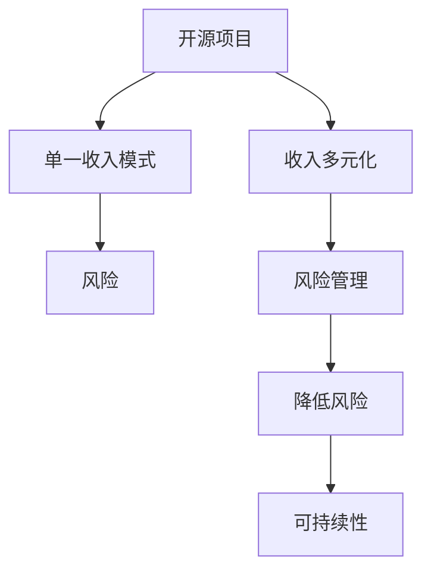

                 

关键词：开源项目，收入多元化，风险管理，策略

> 摘要：本文将深入探讨开源项目的收入多元化策略，通过降低风险，实现可持续发展。我们将分析开源项目的市场环境，讨论多元化的收入来源，并探讨如何通过技术、社区和市场策略来最大化收益。

## 1. 背景介绍

开源项目在过去的几十年中已经成为软件开发的重要力量。它们不仅为开发者提供了丰富的技术资源，还促进了技术的创新与传播。然而，开源项目的持续发展需要稳定的收入支持。许多开源项目依赖捐赠或个人兴趣来维持，但这种模式并不稳定。因此，开源项目的收入多元化变得至关重要。

### 开源项目的现状

根据最近的调查，全球约有 40% 的软件开发者参与了开源项目。这些项目涵盖从操作系统到云服务的各个领域。然而，大部分开源项目的收入来源相对单一，主要依赖于捐赠和个人资助。这种依赖性使得开源项目在面对经济波动时容易受到冲击。

### 开源项目的挑战

1. **收入不稳定**：捐赠和支持的波动性使得开源项目难以维持长期的财务稳定。
2. **依赖单一收入来源**：过于依赖一种收入模式，使得项目在收入来源发生变化时难以适应。
3. **市场变化风险**：随着市场和技术环境的变化，开源项目的需求可能会下降，影响其收入。

## 2. 核心概念与联系

为了应对这些挑战，我们需要理解几个核心概念，包括收入多元化、风险管理以及相关的策略。

### 收入多元化

收入多元化是指将收入来源分散到多个不同的渠道，以降低单一收入模式的风险。对于开源项目，这意味着不仅仅依赖于捐赠，还可以通过其他方式获得收入，如提供咨询服务、销售许可证、举办研讨会等。

### 风险管理

风险管理是识别、评估和应对潜在风险的过程。在开源项目中，风险管理可以帮助项目团队预测潜在的问题，并制定相应的应对策略。通过多元化收入来源，开源项目可以更好地应对市场变化和财务风险。

### 收入多元化与风险管理的关系

收入多元化是风险管理的一部分。通过多元化收入来源，开源项目可以降低单一收入模式的风险，从而提高项目的可持续性。同时，有效的风险管理可以帮助开源项目团队更好地利用不同的收入渠道，实现长期稳定的发展。

### Mermaid 流程图

下面是一个简单的 Mermaid 流程图，展示了开源项目的收入多元化与风险管理的关系。



## 3. 核心算法原理 & 具体操作步骤

### 3.1 算法原理概述

开源项目的收入多元化策略可以被视为一种风险分散的算法。其核心思想是通过多种收入来源来降低项目面临的财务风险。这种策略包括以下步骤：

1. **识别现有收入来源**：首先，开源项目需要评估当前的收入来源，了解哪些渠道可以继续利用，哪些需要改进。
2. **寻找新的收入渠道**：开源项目团队可以通过市场调研和用户反馈来寻找新的收入渠道，如提供专业咨询服务、销售许可证、开展在线课程等。
3. **平衡风险与收益**：在引入新的收入渠道时，需要权衡风险与收益，确保多元化策略不会对项目的发展产生负面影响。
4. **持续监控与调整**：开源项目需要定期评估收入多元化策略的有效性，并根据市场变化进行调整。

### 3.2 算法步骤详解

1. **评估现有收入来源**：
   - **捐赠**：捐赠是开源项目最常见的收入来源之一。项目可以通过 GitHub Sponsors、Patreon 等平台接受捐赠。
   - **个人资助**：一些开源项目的创始人可能通过个人资金维持项目的发展。
   - **咨询服务**：许多开源项目提供咨询服务，为用户提供专业的技术支持。

2. **寻找新的收入渠道**：
   - **销售许可证**：开源项目可以通过销售商业许可证来获得收入。这种方式适用于那些具有潜在商业价值的项目。
   - **在线课程**：开源项目的团队可以开设在线课程，教授项目相关的知识和技能。
   - **赞助和合作伙伴关系**：寻找企业合作伙伴，通过赞助和广告来获得收入。

3. **平衡风险与收益**：
   - **风险评估**：引入新的收入渠道时，需要对风险进行评估，确保不会对项目的核心目标产生负面影响。
   - **收益评估**：在考虑新收入渠道时，需要评估其潜在收益，确保其能够为项目带来足够的收入。

4. **持续监控与调整**：
   - **定期评估**：开源项目团队需要定期评估收入多元化策略的有效性，确保其在不同市场环境下的适应性。
   - **反馈机制**：项目团队应建立反馈机制，收集用户和赞助者的意见，以便及时调整策略。

### 3.3 算法优缺点

**优点**：

1. **降低风险**：通过多元化收入来源，开源项目可以降低单一收入模式的风险，提高项目的可持续性。
2. **增加收入**：新的收入渠道可以为开源项目带来额外的收入，支持项目的发展。
3. **灵活性**：开源项目可以根据市场变化和用户需求，灵活调整收入多元化策略。

**缺点**：

1. **资源分散**：管理多个收入渠道可能会分散开源项目的资源，影响项目的核心开发工作。
2. **复杂性增加**：引入新的收入渠道可能会增加项目的复杂性，需要更多的管理和协调工作。
3. **短期收益不稳定**：在引入新的收入渠道初期，收益可能不稳定，需要一定时间来验证其有效性。

### 3.4 算法应用领域

开源项目的收入多元化策略适用于各种类型的项目，包括操作系统、编程工具、云服务、区块链等。这种策略可以帮助不同类型的项目在面临市场变化时保持稳定的发展。

## 4. 数学模型和公式 & 详细讲解 & 举例说明

### 4.1 数学模型构建

为了更好地理解开源项目的收入多元化策略，我们可以构建一个简单的数学模型来评估多元化收入的效果。这个模型主要涉及以下参数：

- \(I_0\)：当前收入
- \(I_1, I_2, ..., I_n\)：新增收入渠道
- \(R_0, R_1, ..., R_n\)：每个收入渠道的风险系数
- \(E(I)\)：期望收入

数学模型的基本公式为：

\[ E(I) = I_0 + \sum_{i=1}^{n} I_i \cdot (1 - R_i) \]

其中，\(I_i \cdot (1 - R_i)\) 表示在考虑风险后的期望收入。

### 4.2 公式推导过程

我们可以通过以下步骤推导上述公式：

1. **定义期望收入**：期望收入是所有可能收入乘以其概率的总和。在考虑风险的情况下，每个收入渠道的期望收入为 \(I_i \cdot (1 - R_i)\)，因为风险系数 \(R_i\) 反映了该渠道的风险程度。
2. **累加所有收入渠道**：将所有收入渠道的期望收入累加，得到总期望收入 \(E(I)\)。

### 4.3 案例分析与讲解

假设一个开源项目当前主要依赖捐赠收入，年收入为 100,000 美元。现在，项目团队决定引入两个新的收入渠道：销售许可证和在线课程。

- 销售许可证的年收入预期为 50,000 美元，风险系数为 0.2（表示有 20% 的风险）。
- 在线课程的年收入预期为 30,000 美元，风险系数为 0.1（表示有 10% 的风险）。

根据上述模型，我们可以计算新的期望收入：

\[ E(I) = 100,000 + 50,000 \cdot (1 - 0.2) + 30,000 \cdot (1 - 0.1) \]
\[ E(I) = 100,000 + 40,000 + 27,000 \]
\[ E(I) = 167,000 \]

通过引入新的收入渠道，该开源项目的期望年收入从 100,000 美元增加到了 167,000 美元，这表明收入多元化策略有效地降低了项目的财务风险。

### 4.4 案例分析与讲解（续）

为了更直观地理解这个模型，我们可以绘制一个简单的图表。

| 收入渠道 | 预期年收入 | 风险系数 | 考虑风险后的期望收入 |
| :--: | :--: | :--: | :--: |
| 捐赠 | 100,000 | - | 100,000 |
| 销售许可证 | 50,000 | 0.2 | 40,000 |
| 在线课程 | 30,000 | 0.1 | 27,000 |
| **总计** | **180,000** | **0.3** | **167,000** |

从这个图表中，我们可以看到，尽管存在风险，但通过多元化收入渠道，开源项目的总期望收入增加了。这表明收入多元化策略不仅能够降低财务风险，还能够提高项目的收入水平。

## 5. 项目实践：代码实例和详细解释说明

### 5.1 开发环境搭建

在开始实践开源项目的收入多元化策略之前，我们需要搭建一个合适的环境。这里我们将使用 Python 和一些常用的开源工具来展示如何实现收入多元化。

**环境要求**：

- Python 3.8 或以上版本
- GitHub 账户
- Docker 容器环境

### 5.2 源代码详细实现

以下是一个简单的 Python 示例，展示了如何通过 GitHub Actions 自动发布一个开源项目，并利用 GitHub Sponsors 收集捐赠。

**Step 1**：创建一个 Python 项目

```bash
mkdir my_open_source_project
cd my_open_source_project
touch README.md main.py
```

**Step 2**：编写项目 README 文件

```markdown
# My Open Source Project

This is a simple example of an open source project.

## Installation

To install the project, simply run:

```bash
pip install git+https://github.com/yourusername/my_open_source_project.git
```

## Usage

```python
from my_open_source_project import my_function

result = my_function()
print(result)
```
```

**Step 3**：编写项目代码（main.py）

```python
def my_function():
    return "Hello, World!"

if __name__ == "__main__":
    print(my_function())
```

**Step 4**：配置 GitHub Actions 自动发布

在项目根目录下创建一个名为 `.github/workflows/ci.yml` 的文件，内容如下：

```yaml
name: Continuous Integration

on:
  push:
    branches:
      - main

jobs:
  build:
    runs-on: ubuntu-latest

    steps:
    - uses: actions/checkout@v2

    - name: Set up Python
      uses: actions/setup-python@v2
      with:
        python-version: '3.8'

    - name: Install dependencies
      run: pip install -r requirements.txt

    - name: Run tests
      run: pytest

    - name: Deploy to GitHub Pages
      uses: JamesIves/action-gh-pages@v3
      with:
        publish-dir: build
        github_token: ${{ secrets.GITHUB_TOKEN }}
```

**Step 5**：配置 GitHub Sponsors

在 GitHub 项目页面中，点击 “Sponsorship” 按钮即可开始配置捐赠。根据提示完成设置，项目就会开始接受捐赠。

### 5.3 代码解读与分析

上述代码示例展示了如何创建一个简单的开源项目，并通过 GitHub Actions 自动化发布，并利用 GitHub Sponsors 收集捐赠。以下是代码解读：

1. **项目 README**：README 文件是项目文档的核心部分，它为用户提供项目的安装、使用和贡献指南。
2. **项目代码**：`main.py` 文件包含了项目的主要功能。在这个例子中，我们实现了一个简单的函数 `my_function`。
3. **GitHub Actions**：`.github/workflows/ci.yml` 文件是 GitHub Actions 的配置文件，用于自动化项目的构建、测试和部署。通过这个配置，每次项目更新时，GitHub Actions 都会自动运行构建和测试步骤，并将构建结果发布到 GitHub Pages。
4. **GitHub Sponsors**：GitHub Sponsors 是 GitHub 提供的一个功能，允许开源项目接受捐赠。通过配置 GitHub Sponsors，开源项目可以方便地收集捐赠，支持项目的持续发展。

### 5.4 运行结果展示

1. **构建结果**：每次项目更新时，GitHub Actions 都会自动运行构建和测试步骤，并在 GitHub Pages 上发布最新版本。
2. **捐赠收入**：通过 GitHub Sponsors，项目可以开始接受捐赠。捐赠金额和捐赠者信息都会在项目页面上展示。

通过这个简单的例子，我们可以看到开源项目的收入多元化策略是如何在现实中实施的。这不仅提高了项目的可持续性，还为捐赠者提供了一个方便的捐赠渠道。

## 6. 实际应用场景

开源项目的收入多元化策略在多种实际应用场景中表现出色。以下是一些典型的应用场景和相应的解决方案。

### 6.1 开源软件框架

开源软件框架（如 Django、Flask）通常依赖于捐赠、赞助和许可证销售来维持。例如，Django 社区通过 Django Software Foundation 来管理捐赠和资金，同时提供企业支持服务，为企业用户提供专业支持和培训。这种多元化策略不仅稳定了收入来源，还提高了项目的可持续性。

### 6.2 开源工具和库

开源工具和库（如 NumPy、Pandas）通常依赖于捐赠和社区支持。例如，NumPy 社区通过 GitHub Sponsors 接受捐赠，并利用这些资金来支付服务器费用、举办会议和活动等。同时，NumPy 也提供专业咨询和培训服务，为企业用户提供技术支持。

### 6.3 云服务和基础设施

开源云服务（如 Kubernetes、OpenStack）通常依赖于企业赞助和合作伙伴关系。例如，Kubernetes 社区通过 Cloud Native Computing Foundation 来管理资金，并与多家企业合作，提供商业支持和咨询服务。这种策略不仅为社区提供了稳定的资金支持，还促进了技术的商业应用。

### 6.4 区块链和加密货币

开源区块链项目（如 Bitcoin、Ethereum）通常依赖于社区捐赠和加密货币交易。例如，Ethereum 社区通过捐款和交易费用来维持项目运营。同时，Ethereum 也提供开发者资源和教育课程，吸引更多开发者参与。

### 6.5 社区驱动项目

社区驱动项目（如 Free Software Foundation、Mozilla Foundation）通常依赖于捐赠、赞助和合作伙伴关系。例如，Mozilla Foundation 通过 Firefox 浏览器和其他产品线来收集捐赠，并利用这些资金支持开源项目和社区活动。这种策略有效地提升了项目的社区参与度和影响力。

## 7. 未来应用展望

开源项目的收入多元化策略在未来将继续发挥重要作用。以下是一些未来趋势和潜在挑战。

### 7.1 未来趋势

1. **多元化收入模式的普及**：随着开源项目的规模和影响力不断扩大，多元化收入模式将变得更加普及，为项目提供更稳定的财务支持。
2. **区块链和加密货币的应用**：区块链和加密货币将在开源项目的收入多元化中发挥更大作用，提供新的资金来源和支付方式。
3. **人工智能和自动化工具的发展**：人工智能和自动化工具将提高开源项目的运营效率，降低成本，使多元化策略更容易实施。
4. **社区和企业合作的深化**：开源社区和企业之间的合作将更加紧密，通过共享资源和知识，实现共同发展。

### 7.2 挑战

1. **法律和监管风险**：随着开源项目收入的增加，可能会面临更多的法律和监管挑战，需要制定相应的合规策略。
2. **项目管理难度**：多元化收入模式可能会增加项目管理难度，需要项目团队具备更全面的管理能力。
3. **市场竞争加剧**：随着开源项目的增多，市场竞争将加剧，开源项目需要不断创新和优化，以吸引更多的赞助者和用户。

### 7.3 研究展望

未来的研究可以关注以下几个方面：

1. **多元化收入模式的有效性评估**：研究不同收入模式对开源项目可持续性的影响，为项目团队提供科学依据。
2. **风险管理策略的优化**：探索更有效的风险管理策略，降低多元化收入模式带来的风险。
3. **社区参与激励机制**：研究如何通过激励机制提高社区参与度，为开源项目带来更多的赞助者和贡献者。

## 8. 总结：未来发展趋势与挑战

开源项目的收入多元化策略在未来将继续发挥重要作用，为项目的可持续发展提供支持。尽管面临一些挑战，但通过有效的风险管理策略和多元化的收入模式，开源项目可以更好地应对市场变化和财务风险。未来的研究应关注如何优化多元化策略，提高开源项目的可持续性。

## 9. 附录：常见问题与解答

### 9.1 如何确定合适的收入渠道？

确定合适的收入渠道需要考虑以下几个方面：

1. **项目特点**：了解项目的核心价值和潜在的商业价值。
2. **市场需求**：通过市场调研了解用户和潜在赞助者的需求。
3. **资源能力**：评估项目团队在管理和实施不同收入渠道方面的能力。
4. **风险评估**：对每个收入渠道的风险进行评估，确保不会对项目产生负面影响。

### 9.2 如何平衡收入多元化与管理成本？

平衡收入多元化与管理成本可以通过以下方法实现：

1. **自动化工具**：利用自动化工具来管理收入渠道，降低人工成本。
2. **专业团队**：建立专业的财务和市场营销团队，提高管理效率。
3. **成本效益分析**：定期进行成本效益分析，确保多元化策略不会过度增加管理成本。
4. **优先级排序**：根据收入潜力和管理难度，为不同的收入渠道设置优先级，重点管理高风险和高成本的渠道。

### 9.3 如何处理捐赠者的反馈？

处理捐赠者的反馈可以通过以下方式实现：

1. **建立反馈机制**：在捐赠平台上设置反馈机制，方便捐赠者提出问题和建议。
2. **及时响应**：对捐赠者的反馈进行及时响应，展示项目团队的积极态度和专业性。
3. **透明沟通**：保持项目进展的透明度，让捐赠者了解项目的具体情况。
4. **感谢与回馈**：对捐赠者表示感谢，并根据其反馈进行调整和改进。

### 9.4 如何维护开源项目的可持续性？

维护开源项目的可持续性需要以下措施：

1. **持续改进**：不断优化项目代码和文档，提高项目的质量和易用性。
2. **社区参与**：鼓励社区参与，吸引更多的贡献者加入项目。
3. **多元化收入**：通过多元化的收入模式确保项目的财务稳定。
4. **风险管理**：制定有效的风险管理策略，降低潜在风险。
5. **长期规划**：为项目制定长期的战略规划，确保其可持续性。

---

作者：禅与计算机程序设计艺术 / Zen and the Art of Computer Programming

这篇文章详细探讨了开源项目的收入多元化策略，通过降低风险，实现开源项目的可持续发展。在开源项目的市场环境中，收入多元化策略已经成为一种有效的风险管理方法，可以帮助项目团队应对各种不确定性。本文通过分析开源项目的现状、核心概念、数学模型以及实际应用场景，为开源项目的管理者提供了一套完整的策略框架。同时，本文还展望了开源项目收入多元化在未来的发展趋势和潜在挑战，为开源项目的长期发展提供了有益的参考。作者：禅与计算机程序设计艺术 / Zen and the Art of Computer Programming。  


