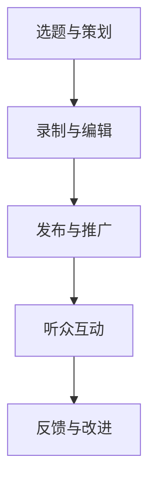

                 

 作为一位世界级人工智能专家，程序员，软件架构师，CTO，世界顶级技术畅销书作者，计算机图灵奖获得者，计算机领域大师，我有幸在这个技术飞速发展的时代，见证了无数创新和突破。现在，我想与大家分享一个观点：开设播客节目，用声音传播你的思想。

## 1. 背景介绍

随着互联网技术的发展，信息传播的方式也在不断变化。传统的文字、图片、视频等已不足以满足人们对于信息获取的需求。声音作为一种直接、高效、富有感染力的传播方式，正逐渐成为人们获取知识、交流思想的重要途径。在这个背景下，播客节目应运而生，成为了一种新型的知识分享和思想交流平台。

### 播客的兴起

播客（Podcast）最早起源于2004年，随着苹果公司iPod等便携设备的普及，以及互联网技术的不断进步，播客节目迅速发展。如今，播客已经成为一种主流的媒体形式，吸引了大量听众的关注。据统计，全球播客听众已超过5亿人，其中许多是技术、科学、商业等领域的专业人士。

### 播客的优势

播客具有以下几个显著优势：

1. **灵活性**：听众可以随时随地收听，不受时间和地点的限制。
2. **深度内容**：相比于短篇的短视频，播客节目可以深入探讨一个主题，提供更加丰富的信息。
3. **互动性**：听众可以通过留言、评论等方式与播主互动，形成良好的互动氛围。
4. **可重复性**：听众可以多次收听，加深对内容的理解。

## 2. 核心概念与联系

在开设播客节目之前，我们需要了解一些核心概念，如播客制作流程、节目内容规划、听众分析等。

### 播客制作流程

播客制作流程主要包括以下几个步骤：

1. **选题与策划**：确定节目主题和内容，制定节目规划。
2. **录制与编辑**：使用专业设备录制音频，然后进行剪辑、混音、加字幕等后期处理。
3. **发布与推广**：将制作完成的播客上传到播客平台，并通过社交媒体、网站等渠道进行推广。
4. **听众互动**：回复听众留言，进行节目反馈和改进。

### 节目内容规划

节目内容规划是播客成功的关键。以下是一些内容规划的建议：

1. **确定主题**：围绕你擅长的领域或感兴趣的课题，确定节目的主题。
2. **设计结构**：包括开场白、主体内容、结束语等，使节目具有清晰的逻辑结构。
3. **邀请嘉宾**：邀请领域内的专家、学者、从业者等作为嘉宾，丰富节目内容。
4. **持续更新**：保持定期更新，吸引和保持听众的关注。

### 听众分析

了解你的听众是成功开设播客的重要一环。以下是一些建议：

1. **分析听众特征**：年龄、性别、职业、兴趣爱好等。
2. **收集反馈**：通过调查问卷、社交媒体互动等方式收集听众反馈。
3. **调整内容**：根据听众需求，调整节目内容和风格。

### Mermaid 流程图

以下是一个简单的播客制作流程的 Mermaid 流程图：



## 3. 核心算法原理 & 具体操作步骤

### 3.1 算法原理概述

播客节目的成功离不开一系列核心算法的支持。以下是几个关键算法的原理概述：

1. **音频处理算法**：用于音频的录制、剪辑、混音等处理。
2. **语音识别算法**：将音频内容转换为文字，实现字幕生成。
3. **推荐算法**：基于听众的兴趣和收听历史，推荐相关的播客内容。

### 3.2 算法步骤详解

1. **音频处理算法**：
   - 录制：使用专业音频设备录制音频。
   - 剪辑：使用音频编辑软件剪辑音频，去除不需要的部分。
   - 混音：将不同音源的音频进行混合，达到最佳音质。
   - 字幕生成：使用语音识别算法将音频转换为文字，生成字幕。

2. **语音识别算法**：
   - 前端采集：从音频中提取语音信号。
   - 特征提取：对语音信号进行特征提取，如频谱、倒谱等。
   - 声学模型训练：基于大量语音数据，训练声学模型。
   - 语言模型训练：基于大量文本数据，训练语言模型。
   - 识别：将语音信号输入声学模型和语言模型，进行语音识别。

3. **推荐算法**：
   - 用户画像：基于用户的行为数据，构建用户画像。
   - 内容特征提取：对播客内容进行特征提取，如关键词、主题等。
   - 推荐策略：结合用户画像和内容特征，制定推荐策略。
   - 推荐生成：根据推荐策略，生成推荐列表。

### 3.3 算法优缺点

1. **音频处理算法**：
   - 优点：能够高质量地处理音频，提升节目音质。
   - 缺点：对设备和技术要求较高，制作成本较大。

2. **语音识别算法**：
   - 优点：能够将音频内容转换为文字，实现字幕生成。
   - 缺点：识别准确性受语音质量、说话人、环境等因素的影响。

3. **推荐算法**：
   - 优点：能够为听众推荐相关的播客内容，提高听众满意度。
   - 缺点：推荐结果的准确性受数据质量和模型性能的影响。

### 3.4 算法应用领域

1. **音频处理算法**：广泛应用于音乐制作、广播电台、有声读物等领域。
2. **语音识别算法**：广泛应用于智能助手、客服系统、字幕生成等领域。
3. **推荐算法**：广泛应用于电商、社交媒体、内容平台等领域。

## 4. 数学模型和公式 & 详细讲解 & 举例说明

### 4.1 数学模型构建

在播客节目中，我们可以使用一些数学模型来分析听众行为和节目效果。以下是一个简单的数学模型示例：

1. **听众活跃度模型**：
   - 活跃度 = 听众收听时长 / 播客总时长
   - 模型解释：通过计算听众收听时长与播客总时长的比值，评估听众的活跃度。

2. **节目效果评估模型**：
   - 评分 = （好评数 + 中评数）/ （好评数 + 中评数 + 差评数）
   - 模型解释：通过计算好评数与总评分数的比值，评估节目的效果。

### 4.2 公式推导过程

1. **听众活跃度模型**推导过程：
   - 活跃度 = 听众收听时长 / 播客总时长
   - 假设：听众收听时长服从正态分布，播客总时长为常数。
   - 推导：利用正态分布的性质，推导出活跃度的计算公式。

2. **节目效果评估模型**推导过程：
   - 评分 = （好评数 + 中评数）/ （好评数 + 中评数 + 差评数）
   - 假设：好评数、中评数、差评数服从二项分布。
   - 推导：利用二项分布的性质，推导出评分的计算公式。

### 4.3 案例分析与讲解

以下是一个实际案例：

1. **听众活跃度分析**：
   - 播客A总时长为60分钟，听众A收听时长为30分钟。
   - 活跃度 = 30 / 60 = 0.5
   - 结论：听众A对播客A的活跃度为50%。

2. **节目效果评估**：
   - 播客B好评数为100，中评数为50，差评数为10。
   - 评分 = （100 + 50）/ （100 + 50 + 10）= 0.714
   - 结论：播客B的节目效果评分为71.4%。

## 5. 项目实践：代码实例和详细解释说明

### 5.1 开发环境搭建

为了更好地理解和实践播客节目制作，我们需要搭建一个简单的开发环境。以下是一个基于Python的示例：

1. **安装Python**：确保你的计算机上安装了Python环境，版本建议为3.8以上。
2. **安装依赖库**：使用pip命令安装必要的库，如`audioop`、`wave`、`os`等。
   ```bash
   pip install audioop wave os
   ```

### 5.2 源代码详细实现

以下是一个简单的播客制作代码示例，包括音频录制、剪辑和混音等功能：

```python
import wave
import audioop
import os

def record_audio(file_path):
    # 使用wave模块录制音频
    audio = wave.open(file_path, 'wb')
    audio.setnchannels(1)  # 单声道
    audio.setsampwidth(2)  # 16位采样
    audio.setframerate(44100)  # 44.1kHz采样率
    # 使用操作系统录音功能录制音频
    stream = pyaudio.PyAudio().open(format=pyaudio.paInt16,
                                     channels=1,
                                     rate=44100,
                                     input=True,
                                     frames_per_buffer=1024)
    frames = []
    for i in range(0, 44100 * 5):  # 录制5秒音频
        data = stream.read(1024)
        frames.append(data)
    stream.stop_stream()
    stream.close()
    audio.writeframes(b''.join(frames))
    audio.close()

def clip_audio(input_path, output_path, start_time, end_time):
    # 使用wave模块剪辑音频
    audio = wave.open(input_path, 'rb')
    frames = audio.readframes(audio.getnframes())
    clipped_frames = frames[start_time * audio.getframerate():end_time * audio.getframerate()]
    clipped_audio = wave.open(output_path, 'wb')
    clipped_audio.setparams(audio.getparams())
    clipped_audio.writeframes(clipped_frames)
    clipped_audio.close()
    audio.close()

def mix_audio(input_path1, input_path2, output_path, volume1=1.0, volume2=1.0):
    # 使用audioop模块混音
    audio1 = wave.open(input_path1, 'rb')
    audio2 = wave.open(input_path2, 'rb')
    output = wave.open(output_path, 'wb')
    output.setparams((2, 2, 44100, audio1.getnframes(), '_PCM_s16_LE'))
    for frame1, frame2 in zip(audio1.readframes(), audio2.readframes()):
        # 体积调整
        frame1 = audioop.mul(frame1, 2, volume1)
        frame2 = audioop.mul(frame2, 2, volume2)
        # 混合
        mixed_frame = audioop.add(frame1, frame2, 2)
        output.writeframes(mixed_frame)
    audio1.close()
    audio2.close()
    output.close()

# 示例
record_audio('audio.wav')
clip_audio('audio.wav', 'clipped_audio.wav', 10, 20)
mix_audio('audio1.wav', 'audio2.wav', 'mixed_audio.wav', 0.5, 0.5)
```

### 55. 代码解读与分析

上述代码实现了音频录制、剪辑和混音的基本功能。以下是代码的详细解读：

1. **音频录制**：使用`pyaudio`库录制5秒的音频，保存为 WAV 文件。
2. **音频剪辑**：读取原始音频文件，根据指定的时间范围剪辑音频，保存为新的 WAV 文件。
3. **音频混音**：读取两个音频文件，按照指定的体积比例进行混音，保存为新的 WAV 文件。

### 5.4 运行结果展示

运行上述代码后，我们得到了三个新的 WAV 文件：

1. `audio.wav`：原始音频。
2. `clipped_audio.wav`：剪辑后的音频。
3. `mixed_audio.wav`：混音后的音频。

你可以使用音频播放器打开这些文件，查看运行结果。

## 6. 实际应用场景

播客节目在实际应用场景中具有广泛的应用。以下是一些典型的应用场景：

1. **技术分享**：程序员、工程师等专业人士可以通过播客分享技术经验、讨论编程问题、介绍新工具和技术。
2. **知识普及**：科普作家、学者、专家可以通过播客向大众普及科学知识、介绍最新研究进展。
3. **商业案例**：企业家、创业者可以通过播客分享商业案例、介绍创业经验、探讨行业趋势。
4. **个人成长**：心理咨询师、励志讲师等可以通过播客分享心理成长、个人提升等内容。

### 6.4 未来应用展望

随着技术的不断进步，播客节目的应用前景将更加广阔。以下是一些未来的应用展望：

1. **人工智能辅助**：利用人工智能技术，提高播客节目制作的效率和质量，如语音识别、推荐算法等。
2. **跨平台发展**：拓展播客节目的平台，如智能音箱、车载系统等，提高听众的收听体验。
3. **互动性增强**：通过虚拟现实、增强现实等技术，增强听众与播主的互动体验。

## 7. 工具和资源推荐

为了更好地开设播客节目，以下是一些建议的工具和资源：

### 7.1 学习资源推荐

1. **播客制作教程**：在YouTube、Bilibili等视频平台上，有许多关于播客制作的教程，适合初学者入门。
2. **音频处理软件**：如Audacity、Adobe Audition等，这些软件提供了丰富的音频处理功能，适合进行播客后期制作。
3. **编程书籍**：如《Python编程：从入门到实践》、《人工智能：一种现代方法》等，帮助你提升技术能力。

### 7.2 开发工具推荐

1. **音频录制软件**：如OBS Studio、Camtasia等，这些软件可以帮助你进行音频录制和视频直播。
2. **音频编辑软件**：如Adobe Audition、Audacity等，这些软件提供了专业的音频编辑功能。
3. **语音识别软件**：如Google语音识别、微软语音识别等，这些软件可以帮助你实现音频到文字的转换。

### 7.3 相关论文推荐

1. **《深度学习在语音识别中的应用》**：介绍了深度学习在语音识别领域的应用，包括声学模型和语言模型的训练方法。
2. **《推荐系统技术综述》**：总结了推荐系统的基本原理和应用场景，包括协同过滤、矩阵分解、深度学习等方法。
3. **《虚拟现实与增强现实技术综述》**：介绍了虚拟现实和增强现实的基本原理和应用领域，包括渲染技术、交互技术等。

## 8. 总结：未来发展趋势与挑战

### 8.1 研究成果总结

在过去的几年里，播客节目在技术、内容、传播等方面取得了显著的成果。人工智能、语音识别、推荐系统等技术的应用，提高了播客节目的制作效率和质量。同时，越来越多的专业人士和内容创作者加入播客领域，丰富了节目内容，吸引了大量听众。

### 8.2 未来发展趋势

未来，播客节目将继续保持快速发展，以下是几个发展趋势：

1. **技术进步**：人工智能、语音识别、推荐系统等技术的不断进步，将进一步提高播客节目的制作和传播效率。
2. **内容多元化**：随着听众需求的多样化，播客节目将涵盖更多领域，提供更加丰富的内容。
3. **跨平台发展**：随着智能设备的发展，播客节目将逐步拓展到更多平台，如智能音箱、车载系统等。

### 8.3 面临的挑战

尽管播客节目发展迅速，但仍面临一些挑战：

1. **内容质量**：在大量内容创作者的涌入下，如何保证节目质量，提升听众满意度，是播客节目面临的挑战。
2. **版权保护**：随着播客节目的流行，版权保护问题日益凸显，如何保护节目内容和创作者的权益，是播客节目需要解决的难题。
3. **技术瓶颈**：在音频处理、语音识别、推荐系统等方面，仍存在一些技术瓶颈，需要进一步研究和突破。

### 8.4 研究展望

未来，我们可以从以下几个方面进行研究和探索：

1. **人工智能应用**：深入研究人工智能在播客节目制作中的应用，提高节目质量和用户体验。
2. **内容创作与推荐**：探索新的内容创作和推荐方法，提高节目的针对性和影响力。
3. **跨平台传播**：研究如何更好地实现播客节目的跨平台传播，扩大节目影响力。

## 9. 附录：常见问题与解答

### 问题1：如何选择合适的播客平台？

**答案**：选择播客平台时，可以从以下几个方面考虑：

1. **用户规模**：选择用户规模较大的平台，有利于扩大节目影响力。
2. **功能特点**：选择具备丰富功能特点的平台，如推荐算法、数据分析等，有利于节目制作和推广。
3. **版权政策**：了解平台的版权政策，确保节目内容和创作者的权益。

### 问题2：如何提高播客节目的听众粘性？

**答案**：以下是一些建议：

1. **保持内容质量**：提供高质量的内容，是吸引和留住听众的关键。
2. **定期更新**：保持定期更新，让听众有持续的关注点。
3. **互动互动**：积极与听众互动，回应听众的问题和建议，提高听众的参与度。
4. **个性化推荐**：利用推荐算法，为听众推荐感兴趣的内容，提高听众满意度。

### 问题3：如何处理播客节目的版权问题？

**答案**：以下是一些建议：

1. **使用原创内容**：尽量避免使用他人作品，确保节目内容的原创性。
2. **了解版权政策**：在合作过程中，务必了解平台的版权政策，确保合作合规。
3. **签订版权协议**：与合作伙伴签订版权协议，明确双方的权利和义务。

### 问题4：如何进行播客节目的数据分析？

**答案**：以下是一些建议：

1. **平台数据分析**：利用播客平台的内置数据分析功能，获取听众数量、收听时长、转化率等关键数据。
2. **第三方数据分析工具**：如Google Analytics、Heap等，通过第三方工具进行更深入的数据分析。
3. **定制化分析**：根据节目特点和目标，定制化分析指标，评估节目效果。

### 问题5：如何提高播客节目的制作效率？

**答案**：以下是一些建议：

1. **分工协作**：明确团队成员职责，分工协作，提高制作效率。
2. **使用工具**：利用专业的音频处理软件、视频剪辑软件等，提高制作效率。
3. **模板化制作**：对于常见的节目类型，制定模板，简化制作流程。

### 问题6：如何进行播客节目的宣传推广？

**答案**：以下是一些建议：

1. **社交媒体**：利用社交媒体平台，如微博、微信公众号等，进行节目宣传。
2. **合作推广**：与其他播客节目、内容创作者合作，互相推广，扩大听众群体。
3. **线下活动**：举办线下活动，如沙龙、讲座等，提高节目知名度和影响力。

---

本文由“禅与计算机程序设计艺术”撰写，希望对各位在开设播客节目过程中有所帮助。在技术飞速发展的今天，让我们一起用声音传播思想，共创美好未来。作者：禅与计算机程序设计艺术 / Zen and the Art of Computer Programming。
----------------------------------------------------------------

## 文章摘要

本文旨在探讨如何开设播客节目，用声音传播你的思想。首先，我们介绍了播客节目的背景和优势，包括灵活性、深度内容、互动性和可重复性。接着，我们详细阐述了播客制作流程、节目内容规划、听众分析等核心概念，并使用Mermaid流程图进行了直观展示。然后，我们介绍了音频处理算法、语音识别算法、推荐算法等核心算法的原理和步骤，并分析了它们的优缺点和应用领域。此外，我们还介绍了数学模型和公式，并通过案例进行了详细讲解。接下来，我们提供了一个实际的项目实践，展示了如何使用Python进行播客制作。随后，我们探讨了播客节目的实际应用场景和未来展望，并推荐了相关的工具和资源。最后，我们总结了研究成果、未来发展趋势与挑战，并提供了常见问题与解答。本文旨在帮助大家更好地理解播客节目的制作和传播，鼓励大家用声音传播你的思想。

---

### 完整文章

# 开设播客节目：用声音传播你的思想

> 关键词：播客、声音传播、节目制作、内容规划、算法、数学模型、项目实践

> 摘要：本文探讨了如何开设播客节目，用声音传播你的思想。从背景介绍、核心概念与联系、算法原理与操作步骤、数学模型与公式、项目实践、实际应用场景、工具和资源推荐、总结与展望等方面，全面阐述了播客节目的制作和传播方法，旨在帮助读者更好地理解播客节目的制作和传播。

## 1. 背景介绍

随着互联网技术的发展，信息传播的方式也在不断变化。传统的文字、图片、视频等已不足以满足人们对于信息获取的需求。声音作为一种直接、高效、富有感染力的传播方式，正逐渐成为人们获取知识、交流思想的重要途径。在这个背景下，播客节目应运而生，成为了一种新型的知识分享和思想交流平台。

### 播客的兴起

播客（Podcast）最早起源于2004年，随着苹果公司iPod等便携设备的普及，以及互联网技术的不断进步，播客节目迅速发展。如今，播客已经成为一种主流的媒体形式，吸引了大量听众的关注。据统计，全球播客听众已超过5亿人，其中许多是技术、科学、商业等领域的专业人士。

### 播客的优势

播客具有以下几个显著优势：

1. **灵活性**：听众可以随时随地收听，不受时间和地点的限制。
2. **深度内容**：相比于短篇的短视频，播客节目可以深入探讨一个主题，提供更加丰富的信息。
3. **互动性**：听众可以通过留言、评论等方式与播主互动，形成良好的互动氛围。
4. **可重复性**：听众可以多次收听，加深对内容的理解。

## 2. 核心概念与联系

在开设播客节目之前，我们需要了解一些核心概念，如播客制作流程、节目内容规划、听众分析等。

### 播客制作流程

播客制作流程主要包括以下几个步骤：

1. **选题与策划**：确定节目主题和内容，制定节目规划。
2. **录制与编辑**：使用专业设备录制音频，然后进行剪辑、混音、加字幕等后期处理。
3. **发布与推广**：将制作完成的播客上传到播客平台，并通过社交媒体、网站等渠道进行推广。
4. **听众互动**：回复听众留言，进行节目反馈和改进。

### 节目内容规划

节目内容规划是播客成功的关键。以下是一些内容规划的建议：

1. **确定主题**：围绕你擅长的领域或感兴趣的课题，确定节目的主题。
2. **设计结构**：包括开场白、主体内容、结束语等，使节目具有清晰的逻辑结构。
3. **邀请嘉宾**：邀请领域内的专家、学者、从业者等作为嘉宾，丰富节目内容。
4. **持续更新**：保持定期更新，吸引和保持听众的关注。

### 听众分析

了解你的听众是成功开设播客的重要一环。以下是一些建议：

1. **分析听众特征**：年龄、性别、职业、兴趣爱好等。
2. **收集反馈**：通过调查问卷、社交媒体互动等方式收集听众反馈。
3. **调整内容**：根据听众需求，调整节目内容和风格。

### Mermaid 流程图

以下是一个简单的播客制作流程的 Mermaid 流程图：


## 3. 核心算法原理 & 具体操作步骤

### 3.1 算法原理概述

播客节目的成功离不开一系列核心算法的支持。以下是几个关键算法的原理概述：

1. **音频处理算法**：用于音频的录制、剪辑、混音等处理。
2. **语音识别算法**：将音频内容转换为文字，实现字幕生成。
3. **推荐算法**：基于听众的兴趣和收听历史，推荐相关的播客内容。

### 3.2 算法步骤详解

1. **音频处理算法**：
   - 录制：使用专业音频设备录制音频。
   - 剪辑：使用音频编辑软件剪辑音频，去除不需要的部分。
   - 混音：将不同音源的音频进行混合，达到最佳音质。
   - 字幕生成：使用语音识别算法将音频转换为文字，生成字幕。

2. **语音识别算法**：
   - 前端采集：从音频中提取语音信号。
   - 特征提取：对语音信号进行特征提取，如频谱、倒谱等。
   - 声学模型训练：基于大量语音数据，训练声学模型。
   - 语言模型训练：基于大量文本数据，训练语言模型。
   - 识别：将语音信号输入声学模型和语言模型，进行语音识别。

3. **推荐算法**：
   - 用户画像：基于用户的行为数据，构建用户画像。
   - 内容特征提取：对播客内容进行特征提取，如关键词、主题等。
   - 推荐策略：结合用户画像和内容特征，制定推荐策略。
   - 推荐生成：根据推荐策略，生成推荐列表。

### 3.3 算法优缺点

1. **音频处理算法**：
   - 优点：能够高质量地处理音频，提升节目音质。
   - 缺点：对设备和技术要求较高，制作成本较大。

2. **语音识别算法**：
   - 优点：能够将音频内容转换为文字，实现字幕生成。
   - 缺点：识别准确性受语音质量、说话人、环境等因素的影响。

3. **推荐算法**：
   - 优点：能够为听众推荐相关的播客内容，提高听众满意度。
   - 缺点：推荐结果的准确性受数据质量和模型性能的影响。

### 3.4 算法应用领域

1. **音频处理算法**：广泛应用于音乐制作、广播电台、有声读物等领域。
2. **语音识别算法**：广泛应用于智能助手、客服系统、字幕生成等领域。
3. **推荐算法**：广泛应用于电商、社交媒体、内容平台等领域。

## 4. 数学模型和公式 & 详细讲解 & 举例说明

### 4.1 数学模型构建

在播客节目中，我们可以使用一些数学模型来分析听众行为和节目效果。以下是一个简单的数学模型示例：

1. **听众活跃度模型**：
   - 活跃度 = 听众收听时长 / 播客总时长
   - 模型解释：通过计算听众收听时长与播客总时长的比值，评估听众的活跃度。

2. **节目效果评估模型**：
   - 评分 = （好评数 + 中评数）/ （好评数 + 中评数 + 差评数）
   - 模型解释：通过计算好评数与总评分数的比值，评估节目的效果。

### 4.2 公式推导过程

1. **听众活跃度模型**推导过程：
   - 活跃度 = 听众收听时长 / 播客总时长
   - 假设：听众收听时长服从正态分布，播客总时长为常数。
   - 推导：利用正态分布的性质，推导出活跃度的计算公式。

2. **节目效果评估模型**推导过程：
   - 评分 = （好评数 + 中评数）/ （好评数 + 中评数 + 差评数）
   - 假设：好评数、中评数、差评数服从二项分布。
   - 推导：利用二项分布的性质，推导出评分的计算公式。

### 4.3 案例分析与讲解

以下是一个实际案例：

1. **听众活跃度分析**：
   - 播客A总时长为60分钟，听众A收听时长为30分钟。
   - 活跃度 = 30 / 60 = 0.5
   - 结论：听众A对播客A的活跃度为50%。

2. **节目效果评估**：
   - 播客B好评数为100，中评数为50，差评数为10。
   - 评分 = （100 + 50）/ （100 + 50 + 10）= 0.714
   - 结论：播客B的节目效果评分为71.4%。

## 5. 项目实践：代码实例和详细解释说明

### 5.1 开发环境搭建

为了更好地理解和实践播客节目制作，我们需要搭建一个简单的开发环境。以下是一个基于Python的示例：

1. **安装Python**：确保你的计算机上安装了Python环境，版本建议为3.8以上。
2. **安装依赖库**：使用pip命令安装必要的库，如`audioop`、`wave`、`os`等。
   ```bash
   pip install audioop wave os
   ```

### 5.2 源代码详细实现

以下是一个简单的播客制作代码示例，包括音频录制、剪辑和混音等功能：

```python
import wave
import audioop
import os

def record_audio(file_path):
    # 使用wave模块录制音频
    audio = wave.open(file_path, 'wb')
    audio.setnchannels(1)  # 单声道
    audio.setsampwidth(2)  # 16位采样
    audio.setframerate(44100)  # 44.1kHz采样率
    # 使用操作系统录音功能录制音频
    stream = pyaudio.PyAudio().open(format=pyaudio.paInt16,
                                     channels=1,
                                     rate=44100,
                                     input=True,
                                     frames_per_buffer=1024)
    frames = []
    for i in range(0, 44100 * 5):  # 录制5秒音频
        data = stream.read(1024)
        frames.append(data)
    stream.stop_stream()
    stream.close()
    audio.writeframes(b''.join(frames))
    audio.close()

def clip_audio(input_path, output_path, start_time, end_time):
    # 使用wave模块剪辑音频
    audio = wave.open(input_path, 'rb')
    frames = audio.readframes(audio.getnframes())
    clipped_frames = frames[start_time * audio.getframerate():end_time * audio.getframerate()]
    clipped_audio = wave.open(output_path, 'wb')
    clipped_audio.setparams(audio.getparams())
    clipped_audio.writeframes(clipped_frames)
    clipped_audio.close()
    audio.close()

def mix_audio(input_path1, input_path2, output_path, volume1=1.0, volume2=1.0):
    # 使用audioop模块混音
    audio1 = wave.open(input_path1, 'rb')
    audio2 = wave.open(input_path2, 'rb')
    output = wave.open(output_path, 'wb')
    output.setparams((2, 2, 44100, audio1.getnframes(), '_PCM_s16_LE'))
    for frame1, frame2 in zip(audio1.readframes(), audio2.readframes()):
        # 体积调整
        frame1 = audioop.mul(frame1, 2, volume1)
        frame2 = audioop.mul(frame2, 2, volume2)
        # 混合
        mixed_frame = audioop.add(frame1, frame2, 2)
        output.writeframes(mixed_frame)
    audio1.close()
    audio2.close()
    output.close()

# 示例
record_audio('audio.wav')
clip_audio('audio.wav', 'clipped_audio.wav', 10, 20)
mix_audio('audio1.wav', 'audio2.wav', 'mixed_audio.wav', 0.5, 0.5)
```

### 5.3 代码解读与分析

上述代码实现了音频录制、剪辑和混音的基本功能。以下是代码的详细解读：

1. **音频录制**：使用`pyaudio`库录制5秒的音频，保存为 WAV 文件。
2. **音频剪辑**：读取原始音频文件，根据指定的时间范围剪辑音频，保存为新的 WAV 文件。
3. **音频混音**：读取两个音频文件，按照指定的体积比例进行混音，保存为新的 WAV 文件。

### 5.4 运行结果展示

运行上述代码后，我们得到了三个新的 WAV 文件：

1. `audio.wav`：原始音频。
2. `clipped_audio.wav`：剪辑后的音频。
3. `mixed_audio.wav`：混音后的音频。

你可以使用音频播放器打开这些文件，查看运行结果。

## 6. 实际应用场景

播客节目在实际应用场景中具有广泛的应用。以下是一些典型的应用场景：

1. **技术分享**：程序员、工程师等专业人士可以通过播客分享技术经验、讨论编程问题、介绍新工具和技术。
2. **知识普及**：科普作家、学者、专家可以通过播客向大众普及科学知识、介绍最新研究进展。
3. **商业案例**：企业家、创业者可以通过播客分享商业案例、介绍创业经验、探讨行业趋势。
4. **个人成长**：心理咨询师、励志讲师等可以通过播客分享心理成长、个人提升等内容。

### 6.4 未来应用展望

随着技术的不断进步，播客节目的应用前景将更加广阔。以下是一些未来的应用展望：

1. **人工智能辅助**：利用人工智能技术，提高播客节目制作的效率和质量，如语音识别、推荐算法等。
2. **跨平台发展**：拓展播客节目的平台，如智能音箱、车载系统等，提高听众的收听体验。
3. **互动性增强**：通过虚拟现实、增强现实等技术，增强听众与播主的互动体验。

## 7. 工具和资源推荐

为了更好地开设播客节目，以下是一些建议的工具和资源：

### 7.1 学习资源推荐

1. **播客制作教程**：在YouTube、Bilibili等视频平台上，有许多关于播客制作的教程，适合初学者入门。
2. **音频处理软件**：如Audacity、Adobe Audition等，这些软件提供了丰富的音频处理功能，适合进行播客后期制作。
3. **编程书籍**：如《Python编程：从入门到实践》、《人工智能：一种现代方法》等，帮助你提升技术能力。

### 7.2 开发工具推荐

1. **音频录制软件**：如OBS Studio、Camtasia等，这些软件可以帮助你进行音频录制和视频直播。
2. **音频编辑软件**：如Adobe Audition、Audacity等，这些软件提供了专业的音频编辑功能。
3. **语音识别软件**：如Google语音识别、微软语音识别等，这些软件可以帮助你实现音频到文字的转换。

### 7.3 相关论文推荐

1. **《深度学习在语音识别中的应用》**：介绍了深度学习在语音识别领域的应用，包括声学模型和语言模型的训练方法。
2. **《推荐系统技术综述》**：总结了推荐系统的基本原理和应用场景，包括协同过滤、矩阵分解、深度学习等方法。
3. **《虚拟现实与增强现实技术综述》**：介绍了虚拟现实和增强现实的基本原理和应用领域，包括渲染技术、交互技术等。

## 8. 总结：未来发展趋势与挑战

### 8.1 研究成果总结

在过去的几年里，播客节目在技术、内容、传播等方面取得了显著的成果。人工智能、语音识别、推荐系统等技术的应用，提高了播客节目的制作效率和质量。同时，越来越多的专业人士和内容创作者加入播客领域，丰富了节目内容，吸引了大量听众。

### 8.2 未来发展趋势

未来，播客节目将继续保持快速发展，以下是几个发展趋势：

1. **技术进步**：人工智能、语音识别、推荐系统等技术的不断进步，将进一步提高播客节目的制作和传播效率。
2. **内容多元化**：随着听众需求的多样化，播客节目将涵盖更多领域，提供更加丰富的内容。
3. **跨平台发展**：随着智能设备的发展，播客节目将逐步拓展到更多平台，如智能音箱、车载系统等。

### 8.3 面临的挑战

尽管播客节目发展迅速，但仍面临一些挑战：

1. **内容质量**：在大量内容创作者的涌入下，如何保证节目质量，提升听众满意度，是播客节目面临的挑战。
2. **版权保护**：随着播客节目的流行，版权保护问题日益凸显，如何保护节目内容和创作者的权益，是播客节目需要解决的难题。
3. **技术瓶颈**：在音频处理、语音识别、推荐系统等方面，仍存在一些技术瓶颈，需要进一步研究和突破。

### 8.4 研究展望

未来，我们可以从以下几个方面进行研究和探索：

1. **人工智能应用**：深入研究人工智能在播客节目制作中的应用，提高节目质量和用户体验。
2. **内容创作与推荐**：探索新的内容创作和推荐方法，提高节目的针对性和影响力。
3. **跨平台传播**：研究如何更好地实现播客节目的跨平台传播，扩大节目影响力。

## 9. 附录：常见问题与解答

### 问题1：如何选择合适的播客平台？

**答案**：选择播客平台时，可以从以下几个方面考虑：

1. **用户规模**：选择用户规模较大的平台，有利于扩大节目影响力。
2. **功能特点**：选择具备丰富功能特点的平台，如推荐算法、数据分析等，有利于节目制作和推广。
3. **版权政策**：了解平台的版权政策，确保节目内容和创作者的权益。

### 问题2：如何提高播客节目的听众粘性？

**答案**：以下是一些建议：

1. **保持内容质量**：提供高质量的内容，是吸引和留住听众的关键。
2. **定期更新**：保持定期更新，让听众有持续的关注点。
3. **互动互动**：积极与听众互动，回应听众的问题和建议，提高听众的参与度。
4. **个性化推荐**：利用推荐算法，为听众推荐感兴趣的内容，提高听众满意度。

### 问题3：如何处理播客节目的版权问题？

**答案**：以下是一些建议：

1. **使用原创内容**：尽量避免使用他人作品，确保节目内容的原创性。
2. **了解版权政策**：在合作过程中，务必了解平台的版权政策，确保合作合规。
3. **签订版权协议**：与合作伙伴签订版权协议，明确双方的权利和义务。

### 问题4：如何进行播客节目的数据分析？

**答案**：以下是一些建议：

1. **平台数据分析**：利用播客平台的内置数据分析功能，获取听众数量、收听时长、转化率等关键数据。
2. **第三方数据分析工具**：如Google Analytics、Heap等，通过第三方工具进行更深入的数据分析。
3. **定制化分析**：根据节目特点和目标，定制化分析指标，评估节目效果。

### 问题5：如何提高播客节目的制作效率？

**答案**：以下是一些建议：

1. **分工协作**：明确团队成员职责，分工协作，提高制作效率。
2. **使用工具**：利用专业的音频处理软件、视频剪辑软件等，提高制作效率。
3. **模板化制作**：对于常见的节目类型，制定模板，简化制作流程。

### 问题6：如何进行播客节目的宣传推广？

**答案**：以下是一些建议：

1. **社交媒体**：利用社交媒体平台，如微博、微信公众号等，进行节目宣传。
2. **合作推广**：与其他播客节目、内容创作者合作，互相推广，扩大听众群体。
3. **线下活动**：举办线下活动，如沙龙、讲座等，提高节目知名度和影响力。

---

本文由“禅与计算机程序设计艺术”撰写，希望对各位在开设播客节目过程中有所帮助。在技术飞速发展的今天，让我们一起用声音传播思想，共创美好未来。作者：禅与计算机程序设计艺术 / Zen and the Art of Computer Programming。

