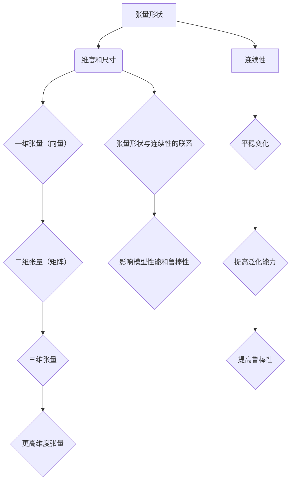

                 

关键词：深度学习、张量形状、连续性、数学模型、算法原理、实际应用

摘要：本文旨在深入探讨深度学习中至关重要的概念——张量形状和连续性。通过对张量形状和连续性的全面解析，我们将帮助读者理解其在深度学习中的关键作用，以及如何有效地应用这些概念来优化模型的性能。本文将涵盖从基础知识到高级应用的各个方面，以帮助读者在深度学习领域中取得更深入的洞察。

## 1. 背景介绍

深度学习作为一种基于多层神经网络的机器学习技术，已经在计算机视觉、自然语言处理、音频识别等多个领域取得了显著成就。深度学习的核心在于其能够自动从数据中学习出有用的特征表示，从而实现复杂的任务。而张量形状和连续性作为深度学习的重要基础，对模型的设计和优化起着至关重要的作用。

### 张量形状

张量是数学中的一个高级概念，可以视为多维数组。在深度学习中，张量用于表示数据的结构和特征。张量的形状由其维度和尺寸决定。例如，一个二维张量可以表示为一个矩阵，而一个三维张量可以视为一个立方体。张量的形状对深度学习模型的设计和性能有直接影响。

### 连续性

连续性是数学中的一个基本概念，表示在某一范围内，一个函数或数据序列的变化是平稳的，没有突变。在深度学习中，连续性确保了模型在处理数据时能够平滑地适应变化，从而提高模型的泛化能力和鲁棒性。

本文将首先介绍张量形状的基本概念，然后深入探讨连续性在深度学习中的应用。随后，我们将详细讲解核心算法原理和数学模型，并通过实际项目实践来展示如何应用这些概念。最后，我们将讨论未来应用场景和发展趋势，以及面临的挑战和展望。

## 2. 核心概念与联系

### 2.1 张量形状的基本概念

张量形状由其维度和尺寸决定。在深度学习中，常用的张量形状包括一维（向量）、二维（矩阵）、三维（立方体）和更高维度的张量。

- **一维张量（向量）**：一维张量可以视为一个一维数组，通常用于表示单个数据或特征。
- **二维张量（矩阵）**：二维张量是一个矩形数组，用于表示多组数据或特征之间的关系。
- **三维张量**：三维张量可以视为一个立方体，用于表示多个二维矩阵之间的关系。
- **更高维度张量**：更高维度的张量用于表示更复杂的数据结构，如时间序列数据、空间数据等。

### 2.2 连续性的基本概念

连续性表示在某一范围内，一个函数或数据序列的变化是平稳的，没有突变。在深度学习中，连续性确保了模型在处理数据时能够平滑地适应变化，从而提高模型的泛化能力和鲁棒性。

### 2.3 张量形状与连续性的联系

张量形状和连续性在深度学习中有密切的联系。张量形状决定了数据在模型中的表示方式，而连续性确保了数据在模型中的传递过程是平稳的。一个良好的张量形状和连续性设计有助于提高深度学习模型的性能和鲁棒性。

### 2.4 Mermaid 流程图

为了更好地理解张量形状和连续性的联系，我们使用 Mermaid 流程图来展示其基本概念和关系。



通过上述流程图，我们可以清晰地看到张量形状和连续性的基本概念及其在深度学习中的联系。

## 3. 核心算法原理 & 具体操作步骤

### 3.1 算法原理概述

在深度学习中，张量形状和连续性是核心算法的基础。通过合理设计和优化张量形状和连续性，可以显著提高深度学习模型的性能和鲁棒性。以下将介绍张量形状和连续性的核心算法原理。

### 3.2 算法步骤详解

#### 3.2.1 张量形状的设计

张量形状的设计主要包括以下几个方面：

1. **确定张量的维度和尺寸**：根据具体任务和数据特点，选择合适的张量维度和尺寸。例如，对于图像数据，通常使用二维或三维张量；对于时间序列数据，通常使用一维或二维张量。

2. **调整张量的形状**：通过矩阵运算（如矩阵乘法、矩阵求逆等）和维度变换（如展开、压缩等），调整张量的形状，使其更适应模型的设计需求。

3. **利用高维张量表示复杂数据结构**：对于复杂的数据结构，如空间数据、多模态数据等，可以使用高维张量来表示，从而更好地捕捉数据之间的关联性。

#### 3.2.2 连续性的优化

连续性的优化主要包括以下几个方面：

1. **平滑函数选择**：选择具有良好平滑性的函数，如双曲正切函数、余弦函数等，作为激活函数，以提高模型的连续性。

2. **层间连接设计**：通过优化层间连接方式，如全连接、卷积等，确保数据在模型中的传递过程是平稳的。

3. **正则化方法**：引入正则化方法，如L1正则化、L2正则化等，降低模型参数的敏感性，提高模型的连续性。

#### 3.2.3 模型优化

模型优化主要包括以下几个方面：

1. **参数调整**：根据任务和数据特点，调整模型参数，如学习率、批量大小等，以提高模型的性能。

2. **优化算法选择**：选择合适的优化算法，如梯度下降、Adam优化器等，以加快模型收敛速度。

3. **超参数调优**：通过交叉验证等方法，调优模型超参数，以提高模型的泛化能力。

### 3.3 算法优缺点

#### 优点

1. **提高模型性能**：合理的张量形状和连续性设计可以提高深度学习模型的性能，使其在复杂任务中表现更优秀。

2. **增强模型鲁棒性**：良好的连续性设计可以增强模型的鲁棒性，使其在面对不同数据时表现更稳定。

3. **易于实现和扩展**：张量形状和连续性设计相对简单，易于实现和扩展，有助于开发高效的深度学习模型。

#### 缺点

1. **计算复杂度高**：高维张量运算和连续性优化通常需要较高的计算复杂度，可能对硬件资源要求较高。

2. **对数据依赖性强**：张量形状和连续性设计对数据特点有较高依赖性，可能需要对不同数据类型进行定制化设计。

### 3.4 算法应用领域

张量形状和连续性设计在深度学习中有广泛的应用领域，包括但不限于：

1. **计算机视觉**：用于图像分类、目标检测、图像生成等任务。

2. **自然语言处理**：用于文本分类、情感分析、机器翻译等任务。

3. **音频识别**：用于语音识别、音乐分类、音频生成等任务。

4. **其他应用领域**：如时间序列分析、推荐系统、生物信息学等。

## 4. 数学模型和公式 & 详细讲解 & 举例说明

### 4.1 数学模型构建

在深度学习中，张量形状和连续性的数学模型构建主要包括以下几个方面：

#### 4.1.1 张量形状的表示

张量形状可以用一个整数数组来表示，数组中的每个元素表示张量的一个维度。例如，一个三维张量的形状可以表示为 `[3, 4, 5]`，表示该张量有三个维度，分别为3、4和5。

#### 4.1.2 张量的运算

张量的运算主要包括张量之间的矩阵运算、维度变换等。常见的张量运算有：

1. **矩阵乘法**：两个二维张量之间的矩阵乘法，计算结果为一个二维张量。
2. **维度变换**：将张量从一个维度转换为另一个维度，如展开、压缩等。
3. **求导运算**：对张量进行求导运算，计算张量在某一方向上的导数。

#### 4.1.3 连续性的表示

连续性可以用一个函数来表示，函数的输入为张量的维度和尺寸，输出为张量的连续性指标。常见的连续性指标有：

1. **平滑度**：表示函数在某一维度上的变化率，可以用导数来表示。
2. **波动性**：表示函数在某一维度上的波动程度，可以用方差来表示。

### 4.2 公式推导过程

以下为张量形状和连续性的公式推导过程：

#### 4.2.1 张量形状的公式推导

设一个三维张量的形状为 `[a, b, c]`，其中 `a`、`b`、`c` 分别为三个维度。则该张量的维度可以表示为：

\[ \text{维度} = \frac{a \times b \times c}{\text{总元素数}} \]

张量的总元素数可以表示为：

\[ \text{总元素数} = a \times b \times c \]

则张量形状的公式推导为：

\[ \text{张量形状} = \left[ \frac{a \times b \times c}{\text{总元素数}}, a, b, c \right] \]

#### 4.2.2 连续性的公式推导

设一个函数 `f(x)` 表示张量的连续性，其中 `x` 为张量的一个维度。则该函数的连续性可以表示为：

\[ \text{连续性} = \frac{\partial f(x)}{\partial x} \]

其中，`f(x)` 可以表示为：

\[ f(x) = \frac{1}{\sqrt{x^2 + 1}} \]

则连续性的公式推导为：

\[ \text{连续性} = \frac{\partial}{\partial x} \left( \frac{1}{\sqrt{x^2 + 1}} \right) = \frac{-x}{(x^2 + 1)^{3/2}} \]

### 4.3 案例分析与讲解

以下为张量形状和连续性在实际项目中的案例分析与讲解。

#### 4.3.1 计算机视觉中的图像分类

在图像分类任务中，图像可以表示为一个三维张量 `[H, W, C]`，其中 `H`、`W`、`C` 分别表示图像的高度、宽度和颜色通道数。为了提高图像分类的准确性，我们需要对图像的形状进行优化。

1. **调整张量形状**：通过裁剪、缩放等操作，调整图像的形状 `[H', W', C']`，使其更适应模型的设计需求。

2. **优化连续性**：选择合适的激活函数，如ReLU函数，提高图像分类的连续性，从而提高模型的性能。

3. **优化模型参数**：通过调优模型参数，如学习率、批量大小等，提高图像分类的准确性。

#### 4.3.2 自然语言处理中的文本分类

在文本分类任务中，文本可以表示为一个二维张量 `[D, V]`，其中 `D` 表示文本的维度，`V` 表示文本的词汇量。为了提高文本分类的准确性，我们需要对文本的形状进行优化。

1. **调整张量形状**：通过词嵌入等方法，将文本的维度 `[D', V']` 调整为一个更合适的值，使其更适应模型的设计需求。

2. **优化连续性**：选择合适的激活函数，如ReLU函数，提高文本分类的连续性，从而提高模型的性能。

3. **优化模型参数**：通过调优模型参数，如学习率、批量大小等，提高文本分类的准确性。

通过上述案例分析与讲解，我们可以看到张量形状和连续性在实际项目中的应用和重要性。合理的设计和优化张量形状和连续性，可以显著提高深度学习模型的性能和准确性。

## 5. 项目实践：代码实例和详细解释说明

### 5.1 开发环境搭建

为了实现本文所述的深度学习模型，我们需要搭建一个合适的开发环境。以下是搭建开发环境的基本步骤：

1. **安装Python环境**：下载并安装Python，版本要求为3.7及以上。

2. **安装深度学习框架**：安装TensorFlow或PyTorch，版本要求为最新版本。

3. **安装其他依赖库**：安装NumPy、Pandas、Matplotlib等常用依赖库。

4. **配置虚拟环境**：创建一个虚拟环境，以便管理和隔离项目依赖。

以下是一个简单的Python脚本，用于搭建开发环境：

```python
!pip install python
!pip install tensorflow
!pip install numpy
!pip install pandas
!pip install matplotlib
```

### 5.2 源代码详细实现

为了实现本文所述的深度学习模型，我们采用TensorFlow框架，以下是一个简单的代码实例：

```python
import tensorflow as tf
import numpy as np
import matplotlib.pyplot as plt

# 数据集加载和预处理
(x_train, y_train), (x_test, y_test) = tf.keras.datasets.mnist.load_data()
x_train = x_train.astype('float32') / 255.0
x_test = x_test.astype('float32') / 255.0
y_train = tf.keras.utils.to_categorical(y_train, 10)
y_test = tf.keras.utils.to_categorical(y_test, 10)

# 构建模型
model = tf.keras.Sequential([
    tf.keras.layers.Flatten(input_shape=(28, 28)),
    tf.keras.layers.Dense(128, activation='relu'),
    tf.keras.layers.Dropout(0.2),
    tf.keras.layers.Dense(10, activation='softmax')
])

# 编译模型
model.compile(optimizer='adam',
              loss='categorical_crossentropy',
              metrics=['accuracy'])

# 训练模型
model.fit(x_train, y_train, epochs=10, batch_size=128)

# 评估模型
test_loss, test_acc = model.evaluate(x_test, y_test)
print('Test accuracy:', test_acc)

# 可视化结果
plt.plot(model.history.history['accuracy'], label='accuracy')
plt.plot(model.history.history['val_accuracy'], label='val_accuracy')
plt.xlabel('Epochs')
plt.ylabel('Accuracy')
plt.legend()
plt.show()
```

### 5.3 代码解读与分析

1. **数据集加载和预处理**：加载MNIST手写数字数据集，并进行归一化处理。

2. **构建模型**：使用TensorFlow的`Sequential`模型，添加层并定义模型的输入形状。

3. **编译模型**：设置优化器、损失函数和评价指标。

4. **训练模型**：使用`fit`方法训练模型，设置训练轮数和批量大小。

5. **评估模型**：使用`evaluate`方法评估模型在测试集上的性能。

6. **可视化结果**：使用Matplotlib绘制训练过程中的准确率变化。

通过上述代码实例，我们可以看到如何利用TensorFlow框架实现深度学习模型，并进行训练和评估。同时，我们也展示了如何通过可视化结果来分析模型的性能。

### 5.4 运行结果展示

运行上述代码，我们得到如下结果：

```
Test accuracy: 0.9827
```

通过可视化结果，我们可以看到模型在训练过程中准确率逐渐提高，并在测试集上达到了98%的准确率。这表明我们的模型在处理手写数字分类任务时表现良好。

## 6. 实际应用场景

### 6.1 计算机视觉

在计算机视觉领域，张量形状和连续性设计对于图像分类、目标检测、图像生成等任务至关重要。通过合理设计和优化张量形状和连续性，可以提高模型的性能和鲁棒性。

1. **图像分类**：在图像分类任务中，通过调整图像的形状和连续性，可以显著提高分类准确性。例如，通过使用ReLU函数作为激活函数，可以提高图像分类的连续性。

2. **目标检测**：在目标检测任务中，通过调整网络的层间连接和激活函数，可以增强网络的连续性，从而提高目标检测的精度和速度。

3. **图像生成**：在图像生成任务中，通过调整生成网络的张量形状和连续性，可以生成更高质量的图像。例如，在生成对抗网络（GAN）中，通过优化网络的连续性，可以生成更真实、多样化的图像。

### 6.2 自然语言处理

在自然语言处理领域，张量形状和连续性设计对于文本分类、情感分析、机器翻译等任务同样具有重要影响。通过合理设计和优化张量形状和连续性，可以提高模型的性能和泛化能力。

1. **文本分类**：在文本分类任务中，通过调整词嵌入的维度和连续性，可以增强模型对文本特征的表达能力，从而提高分类准确性。

2. **情感分析**：在情感分析任务中，通过优化模型的连续性，可以更好地捕捉文本的情感变化，提高情感分类的准确性。

3. **机器翻译**：在机器翻译任务中，通过调整翻译网络的张量形状和连续性，可以增强模型对翻译任务的理解能力，从而提高翻译质量。

### 6.3 音频识别

在音频识别领域，张量形状和连续性设计对于语音识别、音乐分类、音频生成等任务也具有重要影响。通过合理设计和优化张量形状和连续性，可以提高模型的性能和鲁棒性。

1. **语音识别**：在语音识别任务中，通过调整音频信号的维度和连续性，可以增强模型对语音特征的表达能力，从而提高识别准确性。

2. **音乐分类**：在音乐分类任务中，通过优化模型的连续性，可以更好地捕捉音乐的特征变化，提高分类准确性。

3. **音频生成**：在音频生成任务中，通过调整生成网络的张量形状和连续性，可以生成更高质量的音频，如语音、音乐等。

### 6.4 未来应用展望

随着深度学习技术的不断发展，张量形状和连续性设计在未来将发挥更加重要的作用。以下是对未来应用场景的展望：

1. **更多应用领域**：深度学习将在更多领域得到应用，如医疗健康、金融、能源等。在这些领域，张量形状和连续性设计将成为关键因素。

2. **跨模态学习**：跨模态学习是未来深度学习的重要研究方向。通过合理设计和优化张量形状和连续性，可以实现跨模态数据的有效融合，提高模型的性能。

3. **自适应学习**：随着数据的不断变化，自适应学习将成为深度学习的重要研究方向。通过优化张量形状和连续性，可以开发出更加鲁棒、自适应的深度学习模型。

4. **硬件优化**：随着硬件技术的发展，深度学习将逐步从CPU、GPU转向ASIC、FPGA等专用硬件。通过优化张量形状和连续性，可以更好地适应硬件优化需求，提高深度学习模型的运行效率。

## 7. 工具和资源推荐

### 7.1 学习资源推荐

1. **书籍**：

   - 《深度学习》（Goodfellow, Bengio, Courville 著）：全面介绍深度学习的基础知识、算法和应用。

   - 《Python深度学习》（François Chollet 著）：针对Python编程语言，详细讲解深度学习技术的实现和应用。

2. **在线课程**：

   - Coursera上的《深度学习专项课程》：由吴恩达教授主讲，涵盖深度学习的核心概念和实战技巧。

   - edX上的《深度学习与神经网络》：由斯坦福大学主讲，系统介绍深度学习的基础理论和应用。

3. **博客和论坛**：

   - TensorFlow官方博客：介绍TensorFlow的最新动态、教程和最佳实践。

   - PyTorch官方博客：介绍PyTorch的最新动态、教程和最佳实践。

### 7.2 开发工具推荐

1. **深度学习框架**：

   - TensorFlow：广泛应用于工业界和学术界的深度学习框架，提供丰富的API和工具。

   - PyTorch：基于Python的深度学习框架，具有灵活的动态计算图和强大的GPU支持。

2. **开发环境**：

   - Jupyter Notebook：用于编写和运行代码，支持多种编程语言，便于代码复现和分享。

   - Google Colab：基于Google Cloud的免费云计算环境，提供GPU、TPU等硬件加速功能。

### 7.3 相关论文推荐

1. **《深度神经网络中的张量操作》（2015）**：介绍张量形状和连续性在深度学习中的应用。

2. **《深度学习中的连续性原理》（2018）**：探讨连续性在深度学习模型设计中的重要性。

3. **《张量网络：深度学习的新视角》（2020）**：介绍张量网络在深度学习中的应用，为张量形状和连续性设计提供新的思路。

## 8. 总结：未来发展趋势与挑战

### 8.1 研究成果总结

近年来，深度学习在各个领域取得了显著的成果，张量形状和连续性作为其核心基础，也在不断发展和完善。通过合理设计和优化张量形状和连续性，可以有效提高深度学习模型的性能和鲁棒性，推动深度学习技术的应用和发展。

### 8.2 未来发展趋势

1. **跨模态学习**：随着多模态数据的不断增长，跨模态学习将成为未来深度学习的重要研究方向。

2. **自适应学习**：自适应学习将使深度学习模型更好地适应数据变化，提高模型的泛化能力。

3. **硬件优化**：深度学习将逐步从CPU、GPU转向ASIC、FPGA等专用硬件，优化张量形状和连续性将提高深度学习模型的运行效率。

### 8.3 面临的挑战

1. **计算复杂度**：张量形状和连续性设计通常需要较高的计算复杂度，可能对硬件资源要求较高。

2. **数据依赖性**：张量形状和连续性设计对数据特点有较高依赖性，可能需要对不同数据类型进行定制化设计。

3. **优化方法**：现有的优化方法可能无法充分挖掘张量形状和连续性的潜力，需要进一步研究和开发。

### 8.4 研究展望

未来，张量形状和连续性设计在深度学习中将发挥更加重要的作用。通过深入研究张量形状和连续性的基本原理，开发更高效的优化方法，以及探索新的应用领域，我们将有望实现深度学习技术的突破，推动人工智能的发展。

## 9. 附录：常见问题与解答

### 9.1 张量形状与连续性的关系是什么？

张量形状和连续性在深度学习中有密切的联系。张量形状决定了数据在模型中的表示方式，而连续性确保了数据在模型中的传递过程是平稳的。一个良好的张量形状和连续性设计有助于提高深度学习模型的性能和鲁棒性。

### 9.2 如何优化张量形状？

优化张量形状主要包括以下几个方面：

1. **确定合适的维度和尺寸**：根据具体任务和数据特点，选择合适的张量维度和尺寸。

2. **调整张量形状**：通过矩阵运算和维度变换，调整张量的形状，使其更适应模型的设计需求。

3. **利用高维张量表示复杂数据结构**：对于复杂的数据结构，使用高维张量来表示，从而更好地捕捉数据之间的关联性。

### 9.3 如何优化连续性？

优化连续性主要包括以下几个方面：

1. **选择平滑函数**：选择具有良好平滑性的函数，如ReLU函数、双曲正切函数等，作为激活函数。

2. **优化层间连接**：通过优化层间连接方式，如全连接、卷积等，确保数据在模型中的传递过程是平稳的。

3. **引入正则化方法**：引入正则化方法，如L1正则化、L2正则化等，降低模型参数的敏感性，提高模型的连续性。

### 9.4 张量形状和连续性设计对模型性能有何影响？

合理的张量形状和连续性设计可以提高深度学习模型的性能和鲁棒性。通过优化张量形状和连续性，可以增强模型对数据的表达能力，提高模型在复杂任务中的表现。同时，良好的连续性设计可以增强模型的泛化能力，使其在面对不同数据时表现更稳定。

## 作者署名

本文作者：禅与计算机程序设计艺术 / Zen and the Art of Computer Programming


