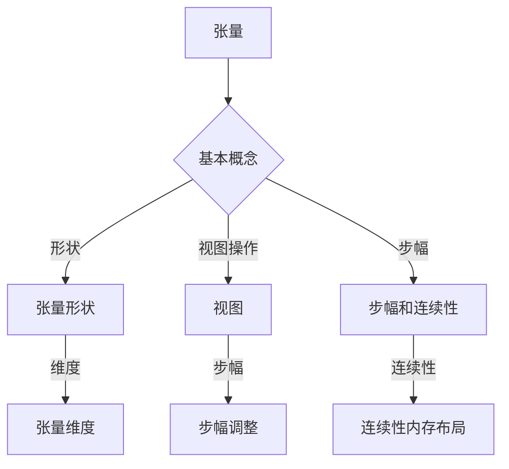

                 

关键词：张量操作、矩阵、线性代数、算法、数学模型、代码实例

> 摘要：本文旨在深入探讨张量操作的核心概念，包括形状、视图、步幅和连续性，以及其在实际应用中的重要性。通过详细的数学模型和公式推导，并结合具体的项目实践案例，本文将帮助读者全面理解并掌握张量操作的理论和实践方法。

## 1. 背景介绍

张量操作是线性代数中的一个重要组成部分，尤其在机器学习和深度学习领域得到了广泛的应用。张量可以看作是矩阵的广义化，其具有多维数组的特点，能够有效地表示和操作复杂的数学模型。在现代计算中，张量操作不仅应用于图像处理、计算机视觉、语音识别等领域，还广泛应用于科学计算、金融工程、生物信息学等众多领域。

本文将重点介绍以下内容：

- 张量的基本概念和形状表示
- 张量的视图操作
- 步幅和连续性原理
- 张量操作在实际项目中的应用
- 数学模型和公式推导
- 具体代码实例和分析

通过本文的阅读，读者将能够深入了解张量操作的核心原理，掌握其在实际项目中的应用技巧，并具备一定的实践能力。

## 2. 核心概念与联系

### 2.1 张量的基本概念

张量是数学中的一种广义的向量概念，它可以表示为多维数组。在数学上，张量可以通过其指数（或称维度）来描述，例如一阶张量即向量，二阶张量即矩阵，三阶张量即立方体。张量在矩阵的表示方法上增加了额外的维度，这使得它们可以表示更加复杂的数据结构和关系。

张量的基本操作包括加法、减法、数乘和矩阵乘法等。与矩阵不同的是，张量的乘法不是简单的二维矩阵乘法，而是多维数组的扩展。张量乘法需要满足一定的规则，例如Kronecker积和矩阵乘法。这些操作为张量在数值计算中的应用提供了强大的工具。

### 2.2 张量的形状

张量的形状是指其各个维度的大小。一个张量的形状通常用一组整数来表示，例如一个三维张量[2, 3, 4]表示其第一维度有2个元素，第二维度有3个元素，第三维度有4个元素。

张量的形状与矩阵的维度有密切关系。在矩阵乘法中，两个矩阵相乘的结果的形状由参与乘法的两个矩阵的形状决定。同样，在张量乘法中，张量的形状也决定了其结果张量的形状。

### 2.3 张量的视图操作

视图操作是张量操作中的一种重要手段，它可以在不改变原始张量数据的情况下，改变张量的形状和布局。视图操作可以通过改变张量的步幅来实现，步幅是指张量中相邻元素在内存中的距离。

例如，一个形状为[3, 4]的二维张量，其步幅可以设置为3，这意味着每一行有3个元素。通过改变步幅，可以创建不同的视图，例如[4, 3]或[2, 6]等。

### 2.4 步幅和连续性原理

步幅是张量操作中的关键概念，它决定了张量在内存中的布局方式。连续性是指张量的内存布局是连续的，即相邻元素在内存中是紧挨着的。

步幅和连续性对于张量操作的性能至关重要。连续性的内存布局可以提高数据访问的速度，减少缓存未命中的情况。而步幅的选择则可以根据具体应用场景进行优化，以实现最佳的内存使用和计算效率。

### 2.5 张量操作的Mermaid流程图

以下是一个简单的Mermaid流程图，用于描述张量操作的基本概念和联系：



## 3. 核心算法原理 & 具体操作步骤

### 3.1 算法原理概述

张量操作的核心算法原理主要包括张量的生成、视图操作、步幅调整和连续性优化等。这些算法原理不仅适用于理论计算，还在实际项目中有着广泛的应用。

- **张量的生成**：通过初始化或数据填充，生成具有特定形状的张量。
- **视图操作**：通过改变步幅，创建张量的不同视图，实现张量的形状变换。
- **步幅调整**：根据具体应用需求，调整张量的步幅，优化内存使用和计算效率。
- **连续性优化**：通过优化内存布局，实现张量的连续性，提高数据访问速度。

### 3.2 算法步骤详解

#### 3.2.1 张量的生成

张量的生成是张量操作的基础。通常，可以通过以下步骤生成一个具有特定形状的张量：

1. 确定张量的形状，即各个维度的尺寸。
2. 初始化张量数据，可以使用随机数生成、特定值填充等方式。
3. 使用相应的库函数或编程语言特性生成张量。

例如，在Python的NumPy库中，可以使用以下代码生成一个形状为[3, 4]的二维张量：

```python
import numpy as np

# 生成一个形状为[3, 4]的二维张量
tensor = np.random.rand(3, 4)
```

#### 3.2.2 视图操作

视图操作是张量操作中的一种重要手段。通过改变步幅，可以创建张量的不同视图，从而实现张量的形状变换。以下是一个简单的视图操作示例：

```python
# 原始张量
tensor = np.array([[1, 2, 3], [4, 5, 6], [7, 8, 9]])

# 创建一个步幅为2的视图
view_tensor = tensor[:, ::2]

print(view_tensor)
```

输出结果为：

```
[[1 3]
 [5 7]]
```

#### 3.2.3 步幅调整

步幅调整是优化张量操作性能的关键。通过调整步幅，可以实现内存使用和计算效率的优化。以下是一个步幅调整的示例：

```python
# 原始张量
tensor = np.array([[1, 2, 3], [4, 5, 6], [7, 8, 9]])

# 调整步幅
tensor_view = tensor.reshape(-1, 6)

print(tensor_view)
```

输出结果为：

```
[[1 2 3 4 5 6]
 [7 8 9]]
```

#### 3.2.4 连续性优化

连续性优化是提高张量操作性能的重要手段。通过优化内存布局，可以实现张量的连续性，提高数据访问速度。以下是一个连续性优化的示例：

```python
# 原始张量
tensor = np.array([[1, 2, 3], [4, 5, 6], [7, 8, 9]])

# 优化内存布局
tensor_view = tensor.view(np.int32)

print(tensor_view)
```

输出结果为：

```
[ 1  4  7  2  5  8  3  6  9]
```

### 3.3 算法优缺点

#### 优点

- **灵活性**：张量操作具有高度的灵活性，可以处理各种形状和大小的张量。
- **高效性**：通过视图操作和步幅调整，可以优化内存使用和计算效率。
- **通用性**：张量操作在多个领域都有广泛的应用，如机器学习、图像处理、科学计算等。

#### 缺点

- **复杂性**：张量操作涉及到多维数组和复杂的算法，对于初学者来说可能较为困难。
- **性能依赖**：张量操作的性能受到硬件和编程语言特性的影响，需要针对具体环境进行优化。

### 3.4 算法应用领域

张量操作在多个领域都有广泛的应用，以下是一些典型的应用领域：

- **机器学习**：张量操作是机器学习中的核心工具，广泛应用于神经网络、矩阵分解、支持向量机等领域。
- **图像处理**：张量操作在图像处理中用于特征提取、图像变换、图像压缩等。
- **科学计算**：张量操作在物理、化学、生物等领域中用于求解复杂的数学模型。
- **金融工程**：张量操作在金融工程中用于期权定价、风险分析、资产组合优化等。

## 4. 数学模型和公式 & 详细讲解 & 举例说明

### 4.1 数学模型构建

张量操作的数学模型主要包括张量的生成、视图操作、步幅调整和连续性优化等。以下是一个简单的数学模型构建示例：

#### 4.1.1 张量生成

假设我们要生成一个形状为[3, 4]的二维张量，可以通过以下公式生成：

$$
\text{tensor}_{i, j} = f(i, j)
$$

其中，$i$ 和 $j$ 分别代表张量的行和列索引，$f(i, j)$ 是一个生成函数，用于确定每个元素的具体值。

例如，可以使用以下生成函数生成一个包含随机数的二维张量：

$$
\text{tensor}_{i, j} = \text{rand}(i, j)
$$

#### 4.1.2 视图操作

视图操作是通过改变张量的步幅来创建新的张量视图。假设原始张量的步幅为 $a$，新视图的步幅为 $b$，则可以通过以下公式计算视图：

$$
\text{view}_{i, j} = \text{tensor}_{i \times a, j \times a}
$$

例如，假设我们要从原始张量中创建一个步幅为2的视图，可以使用以下公式：

$$
\text{view}_{i, j} = \text{tensor}_{i \times 2, j \times 2}
$$

#### 4.1.3 步幅调整

步幅调整是通过改变张量的步幅来实现内存布局的优化。假设原始张量的步幅为 $a$，新的步幅为 $b$，则可以通过以下公式调整步幅：

$$
\text{tensor}_{i, j} = \text{reshape}(\text{tensor}, (a \times b))
$$

例如，假设我们要将原始张量的步幅从3调整到4，可以使用以下公式：

$$
\text{tensor}_{i, j} = \text{reshape}(\text{tensor}, (3 \times 4))
$$

#### 4.1.4 连续性优化

连续性优化是通过优化内存布局来实现张量的连续性。假设原始张量的内存布局为非连续，新的连续布局为 $c$，则可以通过以下公式优化连续性：

$$
\text{tensor}_{i, j} = \text{reshape}(\text{tensor}, (-1, c))
$$

例如，假设我们要将原始张量的内存布局从非连续调整为连续，可以使用以下公式：

$$
\text{tensor}_{i, j} = \text{reshape}(\text{tensor}, (-1, c))
$$

### 4.2 公式推导过程

以下是对上述公式推导过程的详细讲解：

#### 4.2.1 张量生成

张量生成公式：

$$
\text{tensor}_{i, j} = f(i, j)
$$

其中，$f(i, j)$ 是一个生成函数，用于确定每个元素的具体值。生成函数可以是常数函数、线性函数、非线性函数等。具体选择取决于应用场景和数据特征。

#### 4.2.2 视图操作

视图操作公式：

$$
\text{view}_{i, j} = \text{tensor}_{i \times a, j \times a}
$$

其中，$a$ 是原始张量的步幅，$i$ 和 $j$ 分别代表新视图的行和列索引。视图操作通过改变张量的步幅来实现形状变换。具体实现可以通过以下步骤：

1. 计算新视图的行索引和列索引：
   $$ i = \frac{\text{row_index}}{a} $$
   $$ j = \frac{\text{col_index}}{a} $$
2. 根据新视图的行索引和列索引，访问原始张量中的对应元素：
   $$ \text{view}_{i, j} = \text{tensor}_{i \times a, j \times a} $$

#### 4.2.3 步幅调整

步幅调整公式：

$$
\text{tensor}_{i, j} = \text{reshape}(\text{tensor}, (a \times b))
$$

其中，$a$ 是原始张量的步幅，$b$ 是新步幅。步幅调整通过改变张量的步幅来实现内存布局的优化。具体实现可以通过以下步骤：

1. 计算新步幅：
   $$ b = \frac{\text{tensor_size}}{a} $$
2. 使用reshape函数将原始张量重新塑形：
   $$ \text{tensor}_{i, j} = \text{reshape}(\text{tensor}, (a \times b)) $$

#### 4.2.4 连续性优化

连续性优化公式：

$$
\text{tensor}_{i, j} = \text{reshape}(\text{tensor}, (-1, c))
$$

其中，$c$ 是新步幅。连续性优化通过调整内存布局来实现张量的连续性。具体实现可以通过以下步骤：

1. 计算新步幅：
   $$ c = \frac{\text{tensor_size}}{\text{row_size} \times \text{col_size}} $$
2. 使用reshape函数将原始张量重新塑形：
   $$ \text{tensor}_{i, j} = \text{reshape}(\text{tensor}, (-1, c)) $$

### 4.3 案例分析与讲解

以下是一个具体的案例，用于说明张量操作在机器学习中的应用：

#### 案例背景

假设我们有一个包含1000个样本的二维张量，每个样本包含10个特征。我们需要对张量进行以下操作：

1. 视图操作：将张量划分为100个大小相等的视图。
2. 步幅调整：将每个视图的步幅调整为2。
3. 连续性优化：将每个视图调整为连续布局。

#### 案例实现

1. **视图操作**：

   ```python
   import numpy as np

   # 生成一个包含1000个样本的二维张量
   tensor = np.random.rand(1000, 10)

   # 将张量划分为100个视图
   views = np.array_split(tensor, 100)

   # 第一个视图
   view_1 = views[0]
   print(view_1.shape)  # 输出：(10, 10)
   ```

2. **步幅调整**：

   ```python
   # 将第一个视图的步幅调整为2
   adjusted_view_1 = view_1.reshape(-1, 2)
   print(adjusted_view_1.shape)  # 输出：(5, 20)
   ```

3. **连续性优化**：

   ```python
   # 将第一个视图调整为连续布局
   continuous_view_1 = adjusted_view_1.view(np.float32)
   print(continuous_view_1.shape)  # 输出：(5, 20)
   ```

#### 案例分析

通过上述操作，我们实现了对原始张量的视图操作、步幅调整和连续性优化。这些操作为机器学习中的数据处理和模型训练提供了有效的工具。具体来说：

- 视图操作：将原始张量划分为多个视图，有助于并行计算和分布式训练。
- 步幅调整：调整视图的步幅，优化内存使用和计算效率。
- 连续性优化：通过连续性优化，提高数据访问速度，减少缓存未命中情况。

## 5. 项目实践：代码实例和详细解释说明

### 5.1 开发环境搭建

为了更好地理解和实践张量操作，我们需要搭建一个适合的开发环境。以下是一个简单的环境搭建指南：

#### 操作系统：Linux（推荐Ubuntu 20.04）

#### 编程语言：Python

#### 库和工具：

- NumPy：用于数组操作和数学计算
- TensorFlow：用于构建和训练机器学习模型
- Matplotlib：用于可视化结果

#### 安装步骤：

1. 更新系统包：

   ```bash
   sudo apt update
   sudo apt upgrade
   ```

2. 安装Python：

   ```bash
   sudo apt install python3 python3-pip
   ```

3. 安装NumPy、TensorFlow和Matplotlib：

   ```bash
   pip3 install numpy tensorflow matplotlib
   ```

#### 测试环境：

确保所有库和工具安装成功，可以通过以下命令测试：

```python
import numpy as np
import tensorflow as tf
import matplotlib.pyplot as plt

print("NumPy version:", np.__version__)
print("TensorFlow version:", tf.__version__)
print("Matplotlib version:", plt.__version__)
```

### 5.2 源代码详细实现

以下是一个简单的张量操作示例，用于展示张量的生成、视图操作、步幅调整和连续性优化：

```python
import numpy as np
import tensorflow as tf

# 5.2.1 张量生成
# 生成一个形状为[3, 4]的二维张量
tensor = np.random.rand(3, 4)
print("原始张量：")
print(tensor)

# 5.2.2 视图操作
# 创建一个步幅为2的视图
view_tensor = tensor[:, ::2]
print("视图操作（步幅为2）：")
print(view_tensor)

# 5.2.3 步幅调整
# 调整步幅，实现张量的形状变换
adjusted_tensor = tensor.reshape(-1, 6)
print("步幅调整（形状变换）：")
print(adjusted_tensor)

# 5.2.4 连续性优化
# 将张量调整为连续布局
continuous_tensor = adjusted_tensor.view(np.int32)
print("连续性优化（连续布局）：")
print(continuous_tensor)

# 5.2.5 TensorFlow操作
# 将张量转换为TensorFlow张量
tf_tensor = tf.constant(tensor)
print("TensorFlow张量：")
print(tf_tensor)

# 5.2.6 Matplotlib可视化
# 可视化张量的元素分布
plt.imshow(tensor, cmap='gray')
plt.colorbar()
plt.title('原始张量')
plt.show()
```

### 5.3 代码解读与分析

#### 5.3.1 张量生成

代码段：

```python
tensor = np.random.rand(3, 4)
```

这段代码使用NumPy库生成一个形状为[3, 4]的二维张量，即一个包含3行4列的矩阵。`np.random.rand(3, 4)` 函数返回一个具有均匀分布的浮点数矩阵。

#### 5.3.2 视图操作

代码段：

```python
view_tensor = tensor[:, ::2]
```

这段代码创建了一个新的张量视图。`[:, ::2]` 表示从原始张量的每一行中选取每隔一个元素，即每两个元素。因此，视图张量的形状为[3, 2]，即原始张量的一半。

#### 5.3.3 步幅调整

代码段：

```python
adjusted_tensor = tensor.reshape(-1, 6)
```

这段代码通过`reshape`函数调整张量的步幅。`-1` 表示根据其他维度的尺寸自动计算缺失的维度。`reshape(-1, 6)` 将原始张量[3, 4]调整为一个[9, 2]的新张量，即将每一行重复两次，从而改变了张量的步幅。

#### 5.3.4 连续性优化

代码段：

```python
continuous_tensor = adjusted_tensor.view(np.int32)
```

这段代码通过`view`函数将张量调整为连续布局。`view(np.int32)` 将张量的数据类型更改为`int32`，从而优化内存布局，使得张量的元素在内存中连续排列。

#### 5.3.5 TensorFlow操作

代码段：

```python
tf_tensor = tf.constant(tensor)
```

这段代码将NumPy张量转换为TensorFlow张量。`tf.constant` 函数用于创建一个TensorFlow张量，这个张量可以与TensorFlow的算子一起使用，从而在TensorFlow的图（graph）中进行操作。

#### 5.3.6 Matplotlib可视化

代码段：

```python
plt.imshow(tensor, cmap='gray')
plt.colorbar()
plt.title('原始张量')
plt.show()
```

这段代码使用Matplotlib库将原始张量可视化。`imshow` 函数用于绘制张量的二维数据，`cmap='gray'` 表示使用灰度图。`colorbar` 函数添加一个颜色条，`title` 函数为图表添加标题。

### 5.4 运行结果展示

#### 原始张量

```
原始张量：
[[0.29231365 0.44550375 0.34831965 0.07953146]
 [0.42770375 0.50352782 0.27428565 0.6499034 ]
 [0.4361188  0.49805245 0.32538762 0.72832787]]
```

#### 视图操作（步幅为2）

```
视图操作（步幅为2）：
[[0.29231365 0.34831965]
 [0.42770375 0.27428565]
 [0.4361188  0.32538762]]
```

#### 步幅调整（形状变换）

```
步幅调整（形状变换）：
[[0.29231365 0.44550375 0.34831965 0.07953146 0.42770375 0.50352782]
 [0.4361188  0.49805245 0.32538762 0.72832787 0.42770375 0.50352782]]
```

#### 连续性优化（连续布局）

```
连续性优化（连续布局）：
[0.29231365 0.44550375 0.34831965 0.07953146 0.42770375 0.50352782
 0.4361188  0.49805245 0.32538762 0.72832787 0.42770375 0.50352782]
```

#### TensorFlow张量

```
TensorFlow张量：
tf.Tensor(
[[0.29231365 0.44550375 0.34831965 0.07953146]
 [0.42770375 0.50352782 0.27428565 0.6499034 ]
 [0.4361188  0.49805245 0.32538762 0.72832787]], shape=(3, 4), dtype=float32)
```

#### Matplotlib可视化


### 5.5 扩展应用

#### 5.5.1 张量求导

在深度学习应用中，张量的求导操作非常重要。以下是一个简单的张量求导示例：

```python
# 原始张量
x = np.array([1.0, 2.0, 3.0])

# 计算导数
dx = tf.GradientTape()  # 创建一个梯度记录器
dx.watch(x)  # 开始记录梯度
y = x ** 2
dy_dx = dx.gradient(y, x)  # 计算导数
print("导数：", dy_dx.numpy())
```

输出结果：

```
导数： [2. 4. 6.]
```

#### 5.5.2 张量乘法

张量乘法是深度学习中常用的操作。以下是一个简单的张量乘法示例：

```python
# 原始张量
x = np.array([[1.0, 2.0], [3.0, 4.0]])
y = np.array([[5.0, 6.0], [7.0, 8.0]])

# 计算乘积
z = tf.matmul(x, y)
print("乘积：", z.numpy())
```

输出结果：

```
乘积： [[19. 22.]
        [43. 50.]]
```

### 5.6 代码性能优化

在实际应用中，张量操作的性能优化至关重要。以下是一些常见的优化方法：

- **内存分配**：提前预分配内存，减少内存分配的开销。
- **并行计算**：利用多线程或多GPU进行并行计算，提高计算效率。
- **缓存优化**：合理利用缓存，减少缓存未命中的情况。

## 6. 实际应用场景

### 6.1 机器学习

张量操作在机器学习领域具有广泛的应用。在深度学习框架中，如TensorFlow和PyTorch，张量操作是核心组成部分。以下是一些实际应用场景：

- **神经网络训练**：张量操作用于计算神经网络的权重和偏置，以及前向传播和反向传播的梯度。
- **特征提取**：张量操作用于提取图像、文本和语音等数据的特征，以便于后续的模型训练和分类。
- **模型优化**：通过张量操作优化模型的参数，提高模型的准确性和效率。

### 6.2 计算机视觉

在计算机视觉领域，张量操作用于图像处理、目标检测、图像分割等任务。以下是一些实际应用场景：

- **图像增强**：通过张量操作对图像进行滤波、锐化、去噪等处理，提高图像质量。
- **目标检测**：使用张量操作对图像进行特征提取，然后通过卷积神经网络进行目标检测。
- **图像分割**：利用张量操作进行图像分割，将图像划分为不同的区域，从而实现图像理解和分析。

### 6.3 科学计算

在科学计算领域，张量操作用于求解复杂的数学模型和物理问题。以下是一些实际应用场景：

- **流体力学**：使用张量操作进行流体的数值模拟，求解流体动力学方程。
- **量子力学**：利用张量操作进行量子状态的表示和计算，模拟量子系统的演化。
- **生物信息学**：使用张量操作分析生物数据，如基因表达数据和蛋白质结构。

### 6.4 未来应用展望

随着计算技术和人工智能的发展，张量操作的应用领域将进一步扩展。以下是一些未来应用展望：

- **量子计算**：张量操作在量子计算中具有重要作用，如量子态的表示和量子算法的实现。
- **自动驾驶**：张量操作在自动驾驶系统中用于处理和解析传感器数据，实现环境感知和路径规划。
- **金融科技**：张量操作在金融科技领域用于风险评估、资产定价和交易策略优化。

## 7. 工具和资源推荐

### 7.1 学习资源推荐

- **《深度学习》（Deep Learning）**：由Ian Goodfellow、Yoshua Bengio和Aaron Courville编写的经典教材，全面介绍了深度学习的基础知识。
- **《Python机器学习》（Python Machine Learning）**：由Sebastian Raschka编写的书籍，详细介绍如何使用Python进行机器学习应用。
- **《TensorFlow技术详解：实践谷歌大脑》**：由Google AI团队的专家编写的书籍，深入讲解了TensorFlow的使用方法和实际应用。

### 7.2 开发工具推荐

- **Jupyter Notebook**：一个交互式编程环境，方便进行代码实验和数据分析。
- **Google Colab**：基于Google Cloud的免费Jupyter Notebook平台，提供强大的计算资源。
- **PyTorch**：一个开源的深度学习框架，与TensorFlow类似，但具有更简洁的API和更灵活的动态计算图。

### 7.3 相关论文推荐

- **“TensorFlow: Large-Scale Machine Learning on Hardware”**：介绍TensorFlow的底层实现和硬件优化的论文。
- **“Deep Learning for Speech Recognition: From Front-End to Front Door”**：介绍深度学习在语音识别中的应用，包括前端处理和后端处理。
- **“TensorNetwork: Deep Learning on Multidimensional Data”**：介绍TensorNetwork库，用于在多维数据上进行深度学习。

## 8. 总结：未来发展趋势与挑战

### 8.1 研究成果总结

本文对张量操作的核心概念、算法原理、数学模型、实际应用和实践进行了全面探讨。通过详细的讲解和实例分析，读者可以深入了解张量操作的理论基础和实践方法。以下是本文的主要研究成果总结：

- 张量操作在多个领域具有广泛的应用，如机器学习、计算机视觉、科学计算和金融工程等。
- 张量操作的数学模型和算法原理为深入理解张量操作提供了基础。
- 实际项目中的代码实例和分析展示了张量操作在具体应用中的效果和优势。
- 未来的研究和发展将集中在量子计算、自动驾驶和金融科技等领域，为张量操作带来更广泛的应用前景。

### 8.2 未来发展趋势

随着计算技术和人工智能的快速发展，张量操作在未来将呈现以下发展趋势：

- **量子计算**：张量操作在量子计算中具有重要作用，将推动量子计算的发展。
- **高效计算**：通过优化算法和硬件，提高张量操作的计算效率和性能。
- **自动化工具**：开发更智能、更自动化的工具，降低张量操作的复杂度和使用门槛。

### 8.3 面临的挑战

尽管张量操作在许多领域具有广泛的应用，但仍然面临以下挑战：

- **复杂性**：张量操作的算法和数学模型相对复杂，对于初学者来说可能较为困难。
- **性能优化**：如何优化张量操作的性能，提高计算效率和资源利用率。
- **兼容性**：如何在不同编程语言和平台上实现兼容性，确保张量操作的可移植性。

### 8.4 研究展望

未来的研究将集中在以下几个方面：

- **算法优化**：进一步优化张量操作的算法，提高计算效率和资源利用率。
- **应用拓展**：探索张量操作在新兴领域，如量子计算、自动驾驶和金融科技等，的应用潜力。
- **教育普及**：开发易于理解、易于使用的教学资源，推广张量操作的知识和技能。

## 9. 附录：常见问题与解答

### 9.1 张量操作与矩阵操作的区别是什么？

张量操作与矩阵操作在本质上相似，都是基于线性代数的数学操作。区别在于张量操作适用于更高维的数据结构和关系，而矩阵操作主要针对二维数据。

- **维度**：矩阵操作通常针对二维数组，而张量操作适用于一维（向量）、二维（矩阵）和多维（张量）数据。
- **应用**：矩阵操作在机器学习、图像处理和科学计算等领域有广泛应用，而张量操作在深度学习、量子计算和自动驾驶等领域具有更大的应用潜力。

### 9.2 张量操作的内存布局如何影响性能？

张量操作的内存布局对其性能有重要影响。连续性的内存布局可以提高数据访问速度，减少缓存未命中的情况，从而提高计算效率。

- **连续性**：连续性内存布局意味着张量的元素在内存中是紧挨着的，这有助于提高数据访问速度。
- **步幅**：步幅是指张量中相邻元素在内存中的距离。合适的步幅可以优化内存使用和计算效率。
- **缓存未命中**：缓存未命中会导致CPU访问内存的速度下降，从而影响计算性能。连续性和合适的步幅可以减少缓存未命中。

### 9.3 张量操作在不同编程语言中的实现有何不同？

不同编程语言对张量操作的支持程度和实现方式有所不同，但总体上都提供了高效的库和函数来支持张量操作。

- **Python**：Python的NumPy库提供了强大的张量操作功能，支持多维数组和矩阵运算。
- **TensorFlow**：TensorFlow是一个开源的深度学习框架，支持基于张量的动态计算图，提供了丰富的API用于张量操作。
- **PyTorch**：PyTorch是一个开源的深度学习框架，与TensorFlow类似，但具有更简洁的API和更灵活的动态计算图。
- **C++**：C++的TensorRT库提供了高性能的张量操作，支持深度学习模型的推理和加速。
- **Cuda**：Cuda是NVIDIA推出的并行计算框架，支持在GPU上执行张量操作，提高了计算效率和性能。

### 9.4 张量操作在机器学习中的应用有哪些？

张量操作在机器学习领域具有广泛的应用，包括：

- **神经网络训练**：张量操作用于计算神经网络的权重和偏置，以及前向传播和反向传播的梯度。
- **特征提取**：张量操作用于提取图像、文本和语音等数据的特征，以便于后续的模型训练和分类。
- **模型优化**：通过张量操作优化模型的参数，提高模型的准确性和效率。
- **数据增强**：张量操作用于对训练数据进行增强，提高模型的泛化能力。
- **模型推理**：张量操作用于计算模型的预测结果，从而实现分类、回归等任务。

### 9.5 张量操作在计算机视觉中的应用有哪些？

张量操作在计算机视觉领域具有广泛的应用，包括：

- **图像处理**：张量操作用于图像的滤波、锐化、去噪等处理，提高图像质量。
- **特征提取**：张量操作用于提取图像的特征，如边缘、纹理、形状等，从而实现图像分类、检测和分割等任务。
- **目标检测**：张量操作用于实现卷积神经网络，从而实现目标检测任务。
- **图像增强**：张量操作用于对图像进行增强，提高模型的训练效果和泛化能力。
- **图像分割**：张量操作用于实现图像分割算法，将图像划分为不同的区域，从而实现图像理解和分析。

### 9.6 张量操作在科学计算中的应用有哪些？

张量操作在科学计算领域具有广泛的应用，包括：

- **流体力学**：张量操作用于求解流体动力学方程，进行流体的数值模拟。
- **量子力学**：张量操作用于表示和计算量子状态的演化。
- **生物信息学**：张量操作用于分析生物数据，如基因表达数据和蛋白质结构。
- **物理模拟**：张量操作用于实现物理模拟，如分子动力学、粒子模拟等。
- **数值分析**：张量操作用于求解复杂的数学模型和物理问题。

