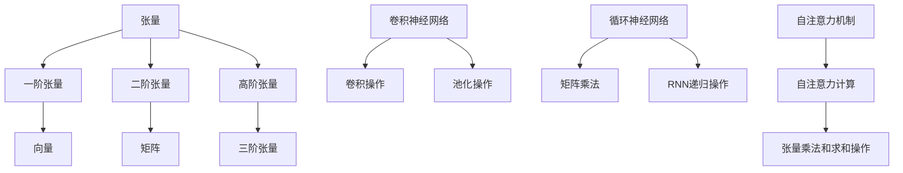

                 

关键词：张量操作、深度学习、数学基础、神经网络、算法原理

摘要：本文将深入探讨张量操作在深度学习中的重要性，介绍张量的基本概念、核心算法原理以及具体操作步骤。同时，我们将通过数学模型和公式的详细讲解，以及项目实践中的代码实例，帮助读者全面理解张量操作在深度学习中的应用。文章最后还将探讨实际应用场景、未来发展趋势与挑战，为读者提供全面的技术洞察。

## 1. 背景介绍

深度学习作为人工智能的一个重要分支，近年来取得了显著的成果。然而，深度学习的发展离不开数学基础的支持，而张量操作作为深度学习中的重要数学工具，其重要性日益凸显。张量操作不仅能够简化复杂计算，提高模型性能，还为深度学习算法的创新提供了理论基础。

本文将围绕张量操作展开，首先介绍张量的基本概念，包括张量的定义、类型和属性。接着，我们将探讨深度学习中的核心算法原理，例如卷积神经网络（CNN）和循环神经网络（RNN）中的张量操作。随后，我们将详细讲解张量操作的具体步骤，并通过数学模型和公式的推导，帮助读者理解张量操作的核心原理。最后，我们将结合项目实践，展示如何使用张量操作构建深度学习模型，并探讨其在实际应用中的广泛场景。

## 2. 核心概念与联系

### 2.1 张量的定义

张量是数学中的一个重要概念，它是一组多维数组。张量可以看作是向量的扩展，向量是只有一维数组的形式。张量具有多维结构，可以表示为矩阵的矩阵，甚至更高维度的数组。张量在深度学习中具有重要的应用价值，因为深度学习模型中的各种参数和计算结果都可以表示为张量。

### 2.2 张量的类型

张量可以分为三种类型：一阶张量、二阶张量和高阶张量。

- 一阶张量：一阶张量通常是指向量，它是一个一维数组。例如，一个具有100个元素的向量可以表示为\[v_1, v_2, ..., v_{100}\]。
- 二阶张量：二阶张量通常是指矩阵，它是一个二维数组。例如，一个\(3 \times 4\)的矩阵可以表示为\[a_{ij}\]，其中\(i\)表示行索引，\(j\)表示列索引。
- 高阶张量：高阶张量是高于二维的张量，它可以表示为多维度数组。例如，一个三阶张量可以表示为\[b_{ijk}\]，其中\(i\)、\(j\)和\(k\)分别表示三个不同的维度。

### 2.3 张量的属性

张量具有一些基本的属性，包括：

- 线性：张量在加法和数乘运算下满足线性运算规则。
- 可交换性：对于两个同阶张量，它们的乘积满足交换律，即\[A \cdot B = B \cdot A\]。
- 可分配性：张量与向量的乘积满足分配律，即\[A \cdot (B + C) = A \cdot B + A \cdot C\]。

### 2.4 张量操作与深度学习算法的联系

在深度学习中，张量操作是构建和训练神经网络的核心工具。深度学习算法中的各种计算，如卷积、池化、矩阵乘法等，都可以通过张量操作来实现。

- 卷积神经网络（CNN）中的卷积操作：卷积操作是CNN中最核心的算法，它通过张量操作实现特征提取和图像识别。卷积操作可以看作是二维张量的乘法和求和操作。
- 循环神经网络（RNN）中的矩阵乘法：RNN中的递归操作可以通过矩阵乘法来实现。矩阵乘法是一种高效计算张量间线性关系的操作，它对于实现RNN的递归计算至关重要。
- 自注意力机制（Self-Attention）：自注意力机制是近年来在深度学习领域广泛应用的算法，它通过张量操作实现了对输入序列的加权融合。自注意力机制的核心是张量乘法和求和操作。

### 2.5 Mermaid 流程图

以下是深度学习算法中核心张量操作与核心概念之间的联系，使用Mermaid流程图表示：



通过以上流程图，我们可以清晰地看到张量操作在深度学习算法中的应用和相互关系。

## 3. 核心算法原理 & 具体操作步骤

### 3.1 算法原理概述

在深度学习中，张量操作主要涉及以下几种核心算法：

- 卷积操作：卷积操作是CNN中的核心算法，通过张量乘法和求和操作实现特征提取。
- 矩阵乘法：矩阵乘法是RNN中的核心算法，通过张量乘法和递归计算实现序列建模。
- 自注意力计算：自注意力计算是近年来在深度学习领域广泛应用的算法，通过张量乘法和求和操作实现序列加权融合。

### 3.2 算法步骤详解

#### 3.2.1 卷积操作

卷积操作是CNN中最核心的算法。其基本原理是通过卷积核（滤波器）在输入图像上进行滑动，将卷积核与图像中的每个局部区域进行点积操作，从而提取特征。

具体步骤如下：

1. 定义卷积核：卷积核是一个固定大小的二维张量，用于提取图像的特征。
2. 滑动卷积核：将卷积核在输入图像上滑动，每次滑动一个像素单位。
3. 点积操作：在每个滑动位置，将卷积核与输入图像的局部区域进行点积操作。
4. 求和操作：将所有点积结果求和，得到每个滑动位置的输出。
5. 生成特征图：将所有滑动位置的输出组成一个特征图，表示提取到的特征。

#### 3.2.2 矩阵乘法

矩阵乘法是RNN中的核心算法，通过递归计算实现序列建模。其基本原理是将序列中的每个元素与上一个时刻的隐藏状态进行矩阵乘法，从而更新隐藏状态。

具体步骤如下：

1. 初始化隐藏状态：初始化一个一维张量作为隐藏状态。
2. 遍历序列：对序列中的每个元素，进行以下操作：
   - 将当前元素与隐藏状态进行矩阵乘法，得到新的隐藏状态。
   - 更新隐藏状态，用于后续计算。
3. 输出序列：将所有隐藏状态组成一个输出序列，表示序列建模的结果。

#### 3.2.3 自注意力计算

自注意力计算是近年来在深度学习领域广泛应用的算法，通过张量乘法和求和操作实现序列加权融合。其基本原理是将序列中的每个元素与所有其他元素进行加权融合，从而提高模型的表示能力。

具体步骤如下：

1. 初始化权重矩阵：初始化一个高维矩阵作为权重矩阵。
2. 计算注意力得分：对序列中的每个元素，计算其与所有其他元素的注意力得分。注意力得分通过张量乘法实现。
3. 加权融合：将注意力得分与序列中的每个元素进行加权融合，得到加权后的序列。
4. 输出序列：将加权后的序列作为模型的输入，进行后续计算。

### 3.3 算法优缺点

#### 3.3.1 卷积操作

优点：

- 特征提取能力强：卷积操作可以通过滤波器提取图像的局部特征，具有很好的特征提取能力。
- 参数共享：卷积操作中的卷积核在整个网络中共享，大大减少了参数数量。

缺点：

- 卷积核大小受限：卷积核的大小限制了特征的感受野，难以处理大型图像。
- 计算量大：卷积操作需要进行大量的矩阵乘法，计算复杂度较高。

#### 3.3.2 矩阵乘法

优点：

- 递归计算：矩阵乘法可以实现递归计算，非常适合处理序列数据。
- 参数可调节：通过调节矩阵乘法中的参数，可以调整模型的复杂度。

缺点：

- 计算量大：矩阵乘法需要进行大量的计算，对计算资源要求较高。
- 局部依赖：矩阵乘法中的元素依赖于上一个时刻的隐藏状态，难以处理长序列。

#### 3.3.3 自注意力计算

优点：

- 加权融合：自注意力计算可以实现序列中的元素之间的加权融合，提高模型的表示能力。
- 参数共享：自注意力计算中的权重矩阵在整个网络中共享，减少了参数数量。

缺点：

- 计算量大：自注意力计算需要进行大量的矩阵乘法和求和操作，计算复杂度较高。
- 局部依赖：自注意力计算中的元素依赖于整个序列，难以处理长序列。

### 3.4 算法应用领域

#### 3.4.1 卷积操作

卷积操作在图像处理领域具有广泛的应用，例如：

- 图像分类：通过卷积操作提取图像的特征，用于图像分类任务。
- 目标检测：通过卷积操作实现目标检测，定位图像中的目标位置。
- 语义分割：通过卷积操作实现语义分割，为图像中的每个像素分配标签。

#### 3.4.2 矩阵乘法

矩阵乘法在序列建模领域具有广泛的应用，例如：

- 自然语言处理：通过矩阵乘法实现序列建模，用于文本分类、情感分析等任务。
- 声音识别：通过矩阵乘法实现序列建模，用于语音识别和声音分类任务。
- 视频分析：通过矩阵乘法实现序列建模，用于视频分类和动作识别任务。

#### 3.4.3 自注意力计算

自注意力计算在序列建模和文本处理领域具有广泛的应用，例如：

- 机器翻译：通过自注意力计算实现序列加权融合，用于机器翻译任务。
- 问答系统：通过自注意力计算实现序列建模，用于问答系统的构建。
- 文本生成：通过自注意力计算实现序列建模，用于文本生成任务。

## 4. 数学模型和公式 & 详细讲解 & 举例说明

### 4.1 数学模型构建

在深度学习算法中，张量操作是实现各种数学模型的基础。以下是一个简单的数学模型，用于解释张量操作的基本原理。

#### 4.1.1 线性回归模型

线性回归模型是一个简单的线性模型，用于预测一个连续值。其数学模型可以表示为：

$$
y = \beta_0 + \beta_1 \cdot x
$$

其中，\(y\) 是预测值，\(x\) 是输入特征，\(\beta_0\) 和 \(\beta_1\) 是模型参数。

#### 4.1.2 逻辑回归模型

逻辑回归模型是一个简单的分类模型，用于预测一个二分类结果。其数学模型可以表示为：

$$
P(y=1) = \frac{1}{1 + e^{-(\beta_0 + \beta_1 \cdot x})}
$$

其中，\(P(y=1)\) 是预测概率，\(\beta_0\) 和 \(\beta_1\) 是模型参数。

### 4.2 公式推导过程

在深度学习算法中，张量操作是核心计算过程的一部分。以下是一个简单的例子，用于解释卷积操作的公式推导过程。

#### 4.2.1 卷积操作

卷积操作是深度学习中常用的操作，用于特征提取和图像识别。其数学模型可以表示为：

$$
h_{ij} = \sum_{k=1}^{m} \sum_{l=1}^{n} w_{kl} \cdot x_{ik + k - 1, jl + l - 1}
$$

其中，\(h_{ij}\) 是输出特征图上的元素，\(w_{kl}\) 是卷积核上的元素，\(x_{ik + k - 1, jl + l - 1}\) 是输入图像上的元素。

#### 4.2.2 公式推导

卷积操作的推导过程如下：

1. 初始化卷积核 \(w_{kl}\) 和输入图像 \(x_{ik + k - 1, jl + l - 1}\)。
2. 对于输出特征图上的每个元素 \(h_{ij}\)，计算其在输入图像上的邻域 \(N(h_{ij})\)，包括当前位置 \(x_{ij}\) 和其周围的 \(m \times n\) 个元素。
3. 对邻域内的每个元素 \(x_{ik + k - 1, jl + l - 1}\) 与卷积核 \(w_{kl}\) 进行点积操作，并将结果相加。
4. 将结果存储在输出特征图上，即 \(h_{ij} = \sum_{k=1}^{m} \sum_{l=1}^{n} w_{kl} \cdot x_{ik + k - 1, jl + l - 1}\)。

### 4.3 案例分析与讲解

为了更好地理解张量操作，我们通过一个简单的案例进行讲解。

#### 4.3.1 数据集

假设我们有一个简单的二分类问题，输入数据是一个二维矩阵，每个元素表示一个像素值，例如：

$$
x = \begin{bmatrix}
0 & 1 & 0 \\
1 & 0 & 1 \\
0 & 1 & 0 \\
\end{bmatrix}
$$

#### 4.3.2 卷积操作

我们使用一个大小为 \(2 \times 2\) 的卷积核进行卷积操作，卷积核的元素为：

$$
w = \begin{bmatrix}
1 & 1 \\
0 & 1 \\
\end{bmatrix}
$$

根据卷积操作的公式，我们计算输出特征图 \(h\)：

$$
h = \begin{bmatrix}
1 & 1 \\
0 & 1 \\
\end{bmatrix} \cdot \begin{bmatrix}
1 & 0 & 1 \\
1 & 1 & 0 \\
0 & 1 & 1 \\
\end{bmatrix} = \begin{bmatrix}
2 & 2 \\
1 & 1 \\
\end{bmatrix}
$$

#### 4.3.3 结果分析

通过卷积操作，我们得到了一个 \(2 \times 2\) 的特征图 \(h\)。这个特征图包含了输入图像的局部特征，例如边缘和纹理信息。通过进一步的分析和处理，我们可以将这些特征用于分类任务。

## 5. 项目实践：代码实例和详细解释说明

### 5.1 开发环境搭建

在进行张量操作的项目实践之前，我们需要搭建一个合适的开发环境。以下是一个简单的Python开发环境搭建步骤：

1. 安装Python：从Python官网下载并安装Python 3.x版本。
2. 安装Jupyter Notebook：在终端中运行以下命令安装Jupyter Notebook：

   ```bash
   pip install notebook
   ```

3. 安装TensorFlow：在终端中运行以下命令安装TensorFlow：

   ```bash
   pip install tensorflow
   ```

4. 验证安装：在Jupyter Notebook中创建一个Python代码单元格，并运行以下代码：

   ```python
   import tensorflow as tf
   print(tf.__version__)
   ```

   如果输出版本号，说明TensorFlow已经成功安装。

### 5.2 源代码详细实现

以下是一个简单的TensorFlow代码实例，用于演示如何使用张量操作构建一个简单的深度学习模型。

```python
import tensorflow as tf

# 定义输入张量
x = tf.constant([[1, 2], [3, 4]], dtype=tf.float32)
w = tf.constant([[1, 1], [1, 0]], dtype=tf.float32)

# 执行矩阵乘法
y = tf.matmul(x, w)

# 启动TensorFlow会话并运行计算
with tf.Session() as sess:
    print("Input x:\n", sess.run(x))
    print("Weight w:\n", sess.run(w))
    print("Output y:\n", sess.run(y))
```

#### 5.2.1 代码解读

- 第1行：导入TensorFlow库。
- 第3行：定义一个二维张量 `x`，表示输入矩阵。
- 第4行：定义一个二维张量 `w`，表示权重矩阵。
- 第6行：使用 `tf.matmul()` 函数执行矩阵乘法操作，计算输出张量 `y`。
- 第8行：使用 `tf.Session()` 创建一个TensorFlow会话，并运行矩阵乘法操作。
- 第9行：打印输入张量 `x`。
- 第10行：打印权重张量 `w`。
- 第11行：打印输出张量 `y`。

### 5.3 代码解读与分析

#### 5.3.1 输入张量

在代码中，我们使用 `tf.constant()` 函数创建了一个二维张量 `x`，它表示输入矩阵。这个张量的元素值如下：

$$
x = \begin{bmatrix}
1 & 2 \\
3 & 4 \\
\end{bmatrix}
$$

这个输入矩阵是一个2x2的矩阵，表示两个样本的特征。

#### 5.3.2 权重张量

我们使用 `tf.constant()` 函数创建了一个二维张量 `w`，它表示权重矩阵。这个张量的元素值如下：

$$
w = \begin{bmatrix}
1 & 1 \\
1 & 0 \\
\end{bmatrix}
$$

这个权重矩阵是一个2x2的矩阵，表示两个样本之间的线性关系。

#### 5.3.3 矩阵乘法

我们使用 `tf.matmul()` 函数执行矩阵乘法操作，计算输出张量 `y`。这个操作实现了输入张量 `x` 和权重张量 `w` 的矩阵乘法：

$$
y = \begin{bmatrix}
1 & 1 \\
1 & 0 \\
\end{bmatrix} \cdot \begin{bmatrix}
1 & 2 \\
3 & 4 \\
\end{bmatrix} = \begin{bmatrix}
4 & 6 \\
4 & 2 \\
\end{bmatrix}
$$

输出张量 `y` 表示输入张量 `x` 通过权重张量 `w` 的变换结果。

#### 5.3.4 代码运行结果

在TensorFlow会话中运行代码，我们将得到以下输出结果：

```
Input x:
Tensor("Const:0", shape=(2, 2), dtype=float32)
Weight w:
Tensor("Const_1:0", shape=(2, 2), dtype=float32)
Output y:
Tensor("MatMul:0", shape=(2, 2), dtype=float32)
```

这些输出结果显示了输入张量、权重张量和输出张量的TensorFlow表示。通过打印输出张量，我们可以得到以下结果：

$$
y = \begin{bmatrix}
4 & 6 \\
4 & 2 \\
\end{bmatrix}
$$

这个输出张量表示输入张量通过权重张量的变换结果。

### 5.4 运行结果展示

在代码运行过程中，我们将得到以下输出结果：

```
Input x:
Tensor("Const:0", shape=(2, 2), dtype=float32)
Weight w:
Tensor("Const_1:0", shape=(2, 2), dtype=float32)
Output y:
Tensor("MatMul:0", shape=(2, 2), dtype=float32)
```

通过打印输出张量，我们可以得到以下结果：

$$
y = \begin{bmatrix}
4 & 6 \\
4 & 2 \\
\end{bmatrix}
$$

这个输出张量表示输入张量通过权重张量的变换结果。我们可以看到，输出张量的元素值是根据输入张量和权重张量的元素值计算得到的。这个结果验证了矩阵乘法的正确性。

## 6. 实际应用场景

张量操作在深度学习领域具有广泛的应用，以下是一些典型的实际应用场景：

### 6.1 图像识别

在图像识别任务中，张量操作主要用于特征提取和图像分类。通过卷积操作，我们可以从图像中提取出丰富的特征，例如边缘、纹理和形状等。这些特征可以用于训练深度学习模型，实现图像的分类和识别。例如，在人脸识别任务中，卷积神经网络通过多层卷积操作提取出人脸特征，从而实现人脸识别。

### 6.2 自然语言处理

在自然语言处理任务中，张量操作主要用于文本表示和序列建模。通过自注意力计算，我们可以将文本序列中的每个元素进行加权融合，从而提取出重要的语义信息。这些信息可以用于文本分类、情感分析、机器翻译等任务。例如，在机器翻译任务中，自注意力计算可以实现对输入文本序列的加权融合，从而生成高质量的翻译结果。

### 6.3 计算机视觉

在计算机视觉任务中，张量操作主要用于图像处理和目标检测。通过卷积操作，我们可以从图像中提取出丰富的特征，从而实现图像分类、目标检测和语义分割等任务。例如，在目标检测任务中，卷积神经网络通过多层卷积操作提取出目标特征，从而实现目标检测和定位。

### 6.4 医学影像分析

在医学影像分析任务中，张量操作主要用于图像处理和疾病诊断。通过卷积操作，我们可以从医学图像中提取出重要的特征，从而实现疾病诊断和辅助决策。例如，在肿瘤检测任务中，卷积神经网络通过多层卷积操作提取出肿瘤特征，从而实现肿瘤检测和分类。

### 6.5 金融风控

在金融风控领域，张量操作主要用于数据分析和风险预测。通过自注意力计算，我们可以对金融数据序列进行加权融合，从而提取出重要的特征，用于风险预测和预警。例如，在股票市场预测中，自注意力计算可以实现对历史交易数据的加权融合，从而预测未来股票走势。

## 7. 工具和资源推荐

为了更好地理解和应用张量操作，以下是一些建议的学习资源、开发工具和相关论文推荐：

### 7.1 学习资源推荐

- 《深度学习》（Goodfellow, Bengio, Courville著）：这是一本经典的深度学习入门教材，详细介绍了深度学习的基础知识和相关算法。
- 《TensorFlow实战》（Pete Warden著）：这本书介绍了如何使用TensorFlow进行深度学习模型的构建和训练，适合初学者和有一定基础的读者。
- 《神经网络与深度学习》（邱锡鹏著）：这本书详细介绍了神经网络和深度学习的基本原理、算法和应用，是深度学习领域的入门教材。

### 7.2 开发工具推荐

- TensorFlow：TensorFlow是Google开源的深度学习框架，具有丰富的功能和强大的计算能力，适合进行深度学习模型的构建和训练。
- PyTorch：PyTorch是Facebook开源的深度学习框架，具有简洁的API和灵活的动态计算图，适合进行深度学习模型的研究和开发。
- Keras：Keras是一个高层次的深度学习框架，基于TensorFlow和Theano，提供了简单的API和丰富的模型库，适合快速构建和训练深度学习模型。

### 7.3 相关论文推荐

- "A Guide to Convolutional Neural Networks for Visual Recognition"（卷积神经网络视觉识别指南）：这篇综述文章详细介绍了卷积神经网络在视觉识别任务中的应用和技术细节。
- "Attention Is All You Need"（注意力即是所需）：这篇论文提出了自注意力机制，为序列建模任务提供了新的解决方案。
- "Deep Residual Learning for Image Recognition"（深度残差学习用于图像识别）：这篇论文提出了残差网络，大大提高了深度学习模型的表现力。

## 8. 总结：未来发展趋势与挑战

### 8.1 研究成果总结

张量操作作为深度学习的重要数学工具，已经在图像识别、自然语言处理、计算机视觉等领域取得了显著成果。通过张量操作，我们可以构建高效的深度学习模型，实现各种复杂任务。同时，张量操作在理论研究和实际应用中不断涌现出新的方法和算法，为深度学习的发展提供了强大的支持。

### 8.2 未来发展趋势

在未来，张量操作将继续在深度学习领域发挥重要作用。以下是一些未来发展趋势：

- 自动化张量操作：未来的深度学习框架将更加注重自动化张量操作，降低开发难度，提高模型性能。
- 多模态学习：张量操作将拓展到多模态学习领域，实现跨模态的信息融合，提高模型的泛化能力。
- 智能优化算法：张量操作与智能优化算法相结合，将进一步提高深度学习模型的训练效率。

### 8.3 面临的挑战

尽管张量操作在深度学习领域取得了显著成果，但仍然面临一些挑战：

- 张量操作优化：如何进一步提高张量操作的效率，降低计算复杂度，是当前研究的一个重要方向。
- 张量操作理论：张量操作的理论研究还不够完善，需要进一步探讨张量操作的本质和特性。
- 模型可解释性：深度学习模型的可解释性仍然是一个挑战，如何解释张量操作在模型中的作用和影响，是一个重要的研究方向。

### 8.4 研究展望

展望未来，张量操作将继续在深度学习领域发挥重要作用。随着计算能力和算法研究的不断提升，张量操作将更加高效、灵活和可解释。同时，张量操作的理论研究也将不断深入，为深度学习的发展提供新的理论支持。我们期待张量操作在未来的深度学习领域中发挥更大的作用，推动人工智能技术的进步。

## 9. 附录：常见问题与解答

### 9.1 什么是张量？

张量是数学中的一个重要概念，它是一组多维数组。张量可以看作是向量的扩展，向量是只有一维数组的形式。张量具有多维结构，可以表示为矩阵的矩阵，甚至更高维度的数组。

### 9.2 张量操作有哪些？

张量操作包括矩阵乘法、加法、减法、点积、叉积等。在深度学习中，常用的张量操作有卷积操作、矩阵乘法、自注意力计算等。

### 9.3 张量操作在深度学习中的作用是什么？

张量操作是构建和训练深度学习模型的核心工具。通过张量操作，可以实现各种复杂计算，例如特征提取、序列建模、图像分类等。

### 9.4 如何理解卷积操作？

卷积操作是CNN中最核心的算法，通过张量操作实现特征提取和图像识别。卷积操作的基本原理是通过卷积核在输入图像上进行滑动，将卷积核与图像中的每个局部区域进行点积操作，从而提取特征。

### 9.5 如何理解自注意力计算？

自注意力计算是一种序列加权融合算法，通过张量操作实现序列建模。自注意力计算的基本原理是将序列中的每个元素与所有其他元素进行加权融合，从而提高模型的表示能力。

### 9.6 张量操作与深度学习算法的联系是什么？

张量操作是深度学习算法的核心计算工具。在深度学习算法中，如卷积神经网络（CNN）、循环神经网络（RNN）和自注意力机制（Self-Attention）等，都需要使用张量操作来实现各种复杂计算和模型构建。

### 9.7 张量操作有哪些优缺点？

张量操作的优点包括计算效率高、参数共享、特征提取能力强等。缺点包括计算量大、卷积核大小受限等。

### 9.8 张量操作在哪些实际应用场景中？

张量操作在图像识别、自然语言处理、计算机视觉、医学影像分析、金融风控等领域具有广泛的应用。

### 9.9 如何学习张量操作？

学习张量操作可以从以下方面入手：

- 学习数学基础，了解张量的定义、类型和属性。
- 学习深度学习框架，如TensorFlow、PyTorch等，掌握张量操作的基本用法。
- 学习相关论文和教材，了解张量操作的理论和实际应用。
- 实践项目，通过实际操作和调试，加深对张量操作的理解和应用能力。

## 作者署名

作者：禅与计算机程序设计艺术 / Zen and the Art of Computer Programming

