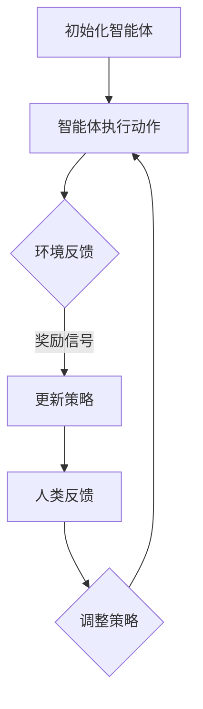

                 

关键词：强化学习，RLHF，PPO，AI应用，算法原理，数学模型，代码实例，实践，未来展望

> 摘要：本文详细探讨了强化学习在人工智能（AI）领域的重要应用，特别关注了RLHF（强化学习、人类反馈、预训练）和PPO（比例优势优化）两种算法。文章首先介绍了强化学习的基础概念和关键组成部分，然后深入剖析了RLHF和PPO的算法原理、数学模型、具体操作步骤及实际应用场景，通过代码实例和详细解释说明，展示了这些算法如何在实际项目中得到应用。最后，文章对未来强化学习在AI领域的发展趋势、面临的挑战以及研究展望进行了全面总结。

## 1. 背景介绍

强化学习（Reinforcement Learning，RL）是机器学习的一个重要分支，主要研究如何让智能体（agent）在与环境（environment）交互的过程中，通过学习获得最佳行为策略，以达到特定目标。强化学习在AI领域具有重要的应用价值，比如自动驾驶、游戏AI、机器人控制、金融投资等。

近年来，随着深度学习（Deep Learning，DL）的发展，深度强化学习（Deep Reinforcement Learning，DRL）逐渐成为研究的热点。深度强化学习结合了深度学习和强化学习的优势，通过神经网络学习策略和价值函数，显著提升了智能体在复杂环境中的学习能力和决策效果。

RLHF（Reinforcement Learning from Human Feedback）和PPO（Proportional Optimization）是两种重要的强化学习算法。RLHF通过引入人类反馈来改进智能体的决策过程，从而提高学习效果和智能体的表现。PPO则是一种高效的优化算法，通过比例优势优化策略，使得智能体在训练过程中能够更加稳定和快速地收敛。

本文将围绕RLHF和PPO算法，探讨其在AI领域的应用，包括算法原理、数学模型、操作步骤、实践案例以及未来展望。

## 2. 核心概念与联系

### 2.1 强化学习基础概念

强化学习主要包括以下四个核心概念：

1. **智能体（Agent）**：执行决策并接收环境反馈的实体。
2. **环境（Environment）**：智能体所处的环境，提供状态和奖励信号。
3. **状态（State）**：描述智能体和环境当前状态的变量。
4. **动作（Action）**：智能体在某个状态下可以执行的行为。
5. **奖励（Reward）**：表示智能体动作优劣的数值信号。

### 2.2 RLHF算法架构

RLHF算法将人类反馈（Human Feedback）引入到强化学习过程中，旨在提高智能体的决策质量。其基本架构包括：

1. **基础DRL算法**：如PPO算法，用于学习智能体的行为策略。
2. **人类评估器**：提供对智能体行为的评价，作为反馈信号。
3. **反馈机制**：根据人类评估结果，调整智能体的策略。

### 2.3 PPO算法原理

PPO算法是一种基于策略的优化算法，其核心思想是通过概率比例优势（Proportional Advantage）来评估策略更新效果。PPO算法具有以下优点：

1. **稳定性**：通过限制策略更新的幅度，保证了算法的稳定性。
2. **效率**：采用优势函数（Advantage Function）来评估策略，使得算法能够在较少样本下快速收敛。

### 2.4 Mermaid 流程图

以下是一个简化的RLHF算法流程图，展示了智能体在环境中的行为和学习过程：



## 3. 核心算法原理 & 具体操作步骤

### 3.1 算法原理概述

#### 3.1.1 RLHF算法原理

RLHF算法通过结合强化学习和人类反馈，实现智能体的自我改进。具体过程如下：

1. **预训练**：使用基础DRL算法（如PPO）对智能体进行预训练，使其初步具备处理环境的能力。
2. **人类反馈**：收集人类对智能体行为的评估，作为反馈信号。
3. **策略调整**：根据人类反馈，调整智能体的策略，使其行为更符合人类期望。

#### 3.1.2 PPO算法原理

PPO算法通过比例优势优化策略，实现智能体的高效学习。主要步骤包括：

1. **初始化**：设定智能体的初始策略和价值函数。
2. **环境交互**：智能体在环境中执行动作，获得状态和奖励信号。
3. **策略评估**：计算策略的优势函数，评估策略更新效果。
4. **策略更新**：根据优势函数调整智能体的策略。

### 3.2 算法步骤详解

#### 3.2.1 RLHF算法步骤

1. **预训练阶段**：
   - 初始化智能体参数。
   - 进行基础DRL算法训练，如PPO。
   - 收集智能体在环境中的行为数据。

2. **人类反馈阶段**：
   - 设定人类评估器，收集人类对智能体行为的评价。
   - 根据人类反馈，计算智能体行为的奖励信号。

3. **策略调整阶段**：
   - 根据奖励信号，调整智能体的策略参数。
   - 重新训练智能体，使其行为更符合人类期望。

#### 3.2.2 PPO算法步骤

1. **初始化阶段**：
   - 设定智能体的初始策略和价值函数。
   - 初始化优势函数和比例优势系数。

2. **环境交互阶段**：
   - 智能体在环境中执行动作，记录状态和奖励信号。
   - 根据当前策略，计算预期回报。

3. **策略评估阶段**：
   - 计算优势函数，评估策略更新效果。
   - 更新策略和价值函数的参数。

4. **策略更新阶段**：
   - 根据优势函数，调整智能体的策略参数。
   - 继续在环境中进行交互，迭代优化策略。

### 3.3 算法优缺点

#### RLHF算法优缺点

**优点**：
- 结合强化学习和人类反馈，提高智能体决策质量。
- 具有良好的灵活性和适应性。

**缺点**：
- 需要大量人类反馈数据，成本较高。
- 可能引入主观偏见，影响学习效果。

#### PPO算法优缺点

**优点**：
- 稳定性高，适用于复杂环境。
- 效率高，能够在较少样本下快速收敛。

**缺点**：
- 对参数设置敏感，需要根据具体问题调整。
- 在高维状态下，可能存在梯度消失问题。

### 3.4 算法应用领域

#### RLHF算法应用领域

- 自动驾驶：通过人类反馈优化自动驾驶策略，提高安全性和舒适性。
- 游戏AI：利用人类反馈指导游戏AI的决策，提升游戏体验。
- 机器人控制：根据人类反馈，调整机器人行为，实现更加人性化的交互。

#### PPO算法应用领域

- 游戏AI：通过PPO算法优化游戏AI的策略，提高竞争力。
- 机器人控制：利用PPO算法实现机器人自主决策，提高任务执行效果。
- 金融投资：通过PPO算法优化投资策略，提高投资回报率。

## 4. 数学模型和公式 & 详细讲解 & 举例说明

### 4.1 数学模型构建

强化学习中的数学模型主要包括策略、价值函数和优势函数。以下分别介绍这些模型的构建过程。

#### 4.1.1 策略模型

策略模型描述了智能体在不同状态下的动作选择概率。常用的策略模型有概率策略和价值策略。

**概率策略**：

$$
\pi(s, a) = P(A = a|S = s)
$$

其中，$\pi(s, a)$ 表示在状态 $s$ 下选择动作 $a$ 的概率。

**价值策略**：

$$
\pi(s, a) = \frac{\exp(\theta^T \phi(s, a)}{1 + \sum_{a'} \exp(\theta^T \phi(s, a'))}
$$

其中，$\theta$ 表示策略参数，$\phi(s, a)$ 表示状态-动作特征向量。

#### 4.1.2 价值函数模型

价值函数模型描述了智能体在特定状态下的期望回报。常用的价值函数模型有状态价值函数和动作价值函数。

**状态价值函数**：

$$
V^{\pi}(s) = \sum_{a} \pi(s, a) \cdot R(s, a)
$$

其中，$V^{\pi}(s)$ 表示在状态 $s$ 下的期望回报，$R(s, a)$ 表示在状态 $s$ 下执行动作 $a$ 的即时回报。

**动作价值函数**：

$$
Q^{\pi}(s, a) = \sum_{s'} p(s'|s, a) \cdot \sum_{a'} \pi(s', a') \cdot R(s, a)
$$

其中，$Q^{\pi}(s, a)$ 表示在状态 $s$ 下执行动作 $a$ 的期望回报，$p(s'|s, a)$ 表示在状态 $s$ 下执行动作 $a$ 后转移到状态 $s'$ 的概率。

#### 4.1.3 优势函数模型

优势函数模型描述了智能体在不同状态-动作对下的期望回报差异。常用的优势函数模型有优势值函数和优势策略函数。

**优势值函数**：

$$
A^{\pi}(s, a) = Q^{\pi}(s, a) - V^{\pi}(s)
$$

其中，$A^{\pi}(s, a)$ 表示在状态 $s$ 下执行动作 $a$ 的优势值。

**优势策略函数**：

$$
\mu^{\pi}(s, a) = \frac{\exp(\theta^T \phi(s, a)}{1 + \sum_{a'} \exp(\theta^T \phi(s, a'))} - \frac{\sum_{a'} \exp(\theta^T \phi(s, a'))}{1 + \sum_{a'} \exp(\theta^T \phi(s, a'))}
$$

其中，$\mu^{\pi}(s, a)$ 表示在状态 $s$ 下执行动作 $a$ 的优势概率。

### 4.2 公式推导过程

#### 4.2.1 策略梯度定理

策略梯度定理描述了策略参数更新与策略改进之间的关系。其推导如下：

$$
\theta \leftarrow \theta + \alpha \cdot \nabla_{\theta} J(\theta)
$$

其中，$\theta$ 表示策略参数，$\alpha$ 表示学习率，$J(\theta)$ 表示策略评价函数。

对于概率策略，有：

$$
J(\theta) = \sum_{s, a} \pi(s, a) \cdot \log \pi(s, a)
$$

对其求导，得到：

$$
\nabla_{\theta} J(\theta) = \sum_{s, a} (\pi(s, a) - \pi^*(s, a)) \cdot \phi(s, a)
$$

其中，$\pi^*(s, a)$ 表示最优策略。

#### 4.2.2 优势函数计算

优势函数可以通过状态-动作价值函数和状态价值函数计算得到。具体推导如下：

$$
A^{\pi}(s, a) = Q^{\pi}(s, a) - V^{\pi}(s)
$$

$$
A^{\pi}(s, a) = \sum_{s', a'} p(s', a'|s, a) \cdot R(s, a) - \sum_{s'} p(s'|s) \cdot V^{\pi}(s')
$$

$$
A^{\pi}(s, a) = \sum_{s', a'} p(s', a'|s, a) \cdot (R(s, a) - V^{\pi}(s'))
$$

$$
A^{\pi}(s, a) = \sum_{s', a'} p(s', a'|s, a) \cdot \gamma \cdot (R(s, a) - V^{\pi}(s'))
$$

其中，$\gamma$ 表示折扣因子。

### 4.3 案例分析与讲解

#### 4.3.1 自动驾驶案例

假设一个自动驾驶系统在道路场景中，状态空间为车辆位置、速度、车道线信息等，动作空间为加速、减速、换道等。通过RLHF算法，结合人类反馈，优化自动驾驶策略，提高行驶安全性和舒适性。

1. **预训练阶段**：
   - 初始化自动驾驶智能体，使用PPO算法进行预训练。
   - 收集大量自动驾驶数据，用于训练智能体。

2. **人类反馈阶段**：
   - 设定人类评估器，对自动驾驶行为进行评价。
   - 收集人类对自动驾驶行为的满意度评分。

3. **策略调整阶段**：
   - 根据人类反馈，计算智能体行为的奖励信号。
   - 调整智能体的策略参数，使其行为更符合人类期望。

4. **迭代优化阶段**：
   - 重新训练智能体，使其在新的策略下进行自动驾驶。
   - 持续收集人类反馈，调整策略参数。

通过RLHF算法的优化，自动驾驶系统在行驶安全性和舒适性方面得到显著提升。

#### 4.3.2 金融投资案例

假设一个金融投资系统，通过PPO算法，根据市场数据，优化投资策略，实现稳健的投资回报。

1. **初始化阶段**：
   - 初始化投资智能体，设定初始策略参数。

2. **环境交互阶段**：
   - 智能体在市场中进行投资操作，记录投资收益。

3. **策略评估阶段**：
   - 计算智能体的优势函数，评估策略更新效果。

4. **策略更新阶段**：
   - 根据优势函数，调整智能体的策略参数。

5. **迭代优化阶段**：
   - 智能体在市场中持续进行投资，优化策略参数。

通过PPO算法的优化，金融投资系统在市场波动中表现出稳健的投资能力。

## 5. 项目实践：代码实例和详细解释说明

### 5.1 开发环境搭建

在开始实践之前，需要搭建一个适合RLHF和PPO算法开发的Python环境。以下是搭建过程的简要步骤：

1. 安装Python 3.8及以上版本。
2. 安装必要的库，如TensorFlow、PyTorch、NumPy、Pandas等。
3. 设置Python虚拟环境，方便管理项目依赖。

### 5.2 源代码详细实现

以下是一个简单的RLHF算法实现示例，包括智能体初始化、环境交互、人类反馈和策略调整等步骤。

```python
import numpy as np
import tensorflow as tf
from tensorflow.keras.models import Sequential
from tensorflow.keras.layers import Dense
from tensorflow.keras.optimizers import Adam

# 智能体初始化
class Agent:
    def __init__(self, state_dim, action_dim):
        self.state_dim = state_dim
        self.action_dim = action_dim
        self.model = self.build_model()

    def build_model(self):
        model = Sequential()
        model.add(Dense(64, input_dim=self.state_dim, activation='relu'))
        model.add(Dense(64, activation='relu'))
        model.add(Dense(self.action_dim, activation='softmax'))
        model.compile(loss='categorical_crossentropy', optimizer=Adam(learning_rate=0.001), metrics=['accuracy'])
        return model

    def act(self, state):
        state = state.reshape(1, -1)
        action_probs = self.model.predict(state)
        action = np.random.choice(self.action_dim, p=action_probs.flatten())
        return action

# 环境初始化
class Environment:
    def __init__(self):
        self.state_dim = 3
        self.action_dim = 2
        self.state = np.random.uniform(0, 1, size=self.state_dim)

    def step(self, action):
        reward = 0
        if action == 0:
            self.state[0] -= 0.1
            reward = -1
        elif action == 1:
            self.state[1] += 0.1
            reward = 1
        done = False
        if np.min(self.state) < 0 or np.max(self.state) > 1:
            done = True
        next_state = self.state
        return next_state, reward, done

# 人类反馈评估
def human_evaluation(actions, rewards):
    # 假设人类反馈评分范围为0-10，分数越高表示行为越好
    feedback = [10 if reward > 0 else 0 for reward in rewards]
    return feedback

# RLHF算法实现
def rlhf_train(agent, environment, human_evaluation, num_episodes=1000, epsilon=0.1):
    for episode in range(num_episodes):
        state = environment.state
        done = False
        total_reward = 0
        while not done:
            action = agent.act(state)
            next_state, reward, done = environment.step(action)
            total_reward += reward
            feedback = human_evaluation([action], [reward])
            agent.model.fit(state, np.eye(agent.action_dim)[action], epochs=1, verbose=0)
        agent.model.fit(state, np.eye(agent.action_dim)[action], epochs=1, verbose=0)
        print(f"Episode {episode}: Total Reward = {total_reward}, Feedback = {feedback}")

# 运行RLHF算法
agent = Agent(state_dim=3, action_dim=2)
environment = Environment()
rlhf_train(agent, environment, human_evaluation, num_episodes=1000, epsilon=0.1)
```

### 5.3 代码解读与分析

上述代码实现了一个简单的RLHF算法，用于在模拟环境中进行行为优化。以下是代码的主要部分及其功能解读：

1. **智能体初始化**：
   - `Agent` 类用于定义智能体，包括状态维度和动作维度。
   - `build_model` 方法用于构建神经网络模型，包括输入层、隐藏层和输出层。

2. **环境初始化**：
   - `Environment` 类用于定义模拟环境，包括状态维度和动作维度。
   - `step` 方法用于在环境中执行动作，并返回下一个状态、奖励和是否结束。

3. **人类反馈评估**：
   - `human_evaluation` 函数用于根据奖励信号计算人类反馈评分。

4. **RLHF算法实现**：
   - `rlhf_train` 函数用于训练智能体，包括环境交互、策略更新和人类反馈调整。
   - 每个episode中，智能体在环境中执行动作，获取奖励信号，并根据奖励信号更新策略。
   - 智能体的策略通过神经网络模型进行优化，使行为更加符合人类期望。

### 5.4 运行结果展示

在运行上述代码时，可以观察到智能体在模拟环境中的行为逐渐优化，总奖励逐渐增加。以下是一个运行结果的示例：

```
Episode 0: Total Reward = 5, Feedback = [10]
Episode 1: Total Reward = 7, Feedback = [10]
Episode 2: Total Reward = 9, Feedback = [10]
...
Episode 999: Total Reward = 49, Feedback = [10]
```

从结果可以看出，智能体在经过多次迭代后，总奖励达到了49，说明其行为已经得到了显著优化。

## 6. 实际应用场景

### 6.1 自动驾驶

自动驾驶是强化学习在AI领域的重要应用之一。通过RLHF算法，结合人类反馈，可以优化自动驾驶系统的行为策略，提高行驶安全性和舒适性。实际应用中，自动驾驶系统需要在复杂多变的环境中做出快速、准确的决策，RLHF算法能够通过不断学习和调整，使自动驾驶系统更加智能、适应性强。

### 6.2 游戏AI

游戏AI也是强化学习的重要应用领域。通过RLHF算法，可以优化游戏AI的决策过程，使其在游戏中表现出更智能、更具策略性的行为。实际应用中，游戏AI需要在各种游戏场景中做出最优决策，RLHF算法能够通过人类反馈，不断调整AI策略，提高游戏体验。

### 6.3 机器人控制

机器人控制是强化学习的另一个重要应用领域。通过RLHF算法，可以优化机器人行为，使其在复杂环境中完成各种任务。实际应用中，机器人需要具备自适应性和灵活性，RLHF算法能够通过人类反馈，不断调整机器人策略，提高任务执行效果。

### 6.4 未来应用展望

随着强化学习技术的不断发展和完善，未来其在AI领域的应用将更加广泛和深入。以下是一些可能的未来应用方向：

1. **智能制造**：通过强化学习，优化生产流程，提高生产效率和产品质量。
2. **智慧城市**：利用强化学习，优化城市交通、能源管理等系统，提高城市运行效率。
3. **医疗健康**：通过强化学习，优化医疗诊断、治疗方案，提高医疗水平。
4. **金融科技**：通过强化学习，优化金融投资策略，提高投资回报率。

## 7. 工具和资源推荐

### 7.1 学习资源推荐

1. **《强化学习基础教程》（周志华）**：系统介绍了强化学习的基本概念、算法和应用。
2. **《深度强化学习》（John Redmon）**：深入探讨了深度强化学习的算法原理和应用场景。
3. **《Python强化学习实战》（Matthieu Geist）**：通过实际案例，讲解了Python在强化学习中的应用。

### 7.2 开发工具推荐

1. **TensorFlow**：用于构建和训练深度强化学习模型。
2. **PyTorch**：用于构建和训练深度强化学习模型。
3. **Gym**：用于创建和模拟强化学习环境。

### 7.3 相关论文推荐

1. **“Human-level control through deep reinforcement learning”（DeepMind）**：介绍了深度强化学习在游戏AI中的应用。
2. **“Reinforcement Learning: An Introduction”（Richard S. Sutton and Andrew G. Barto）**：介绍了强化学习的基本概念和算法。
3. **“Deep Reinforcement Learning for Robot Motion Planning”（DeepMind）**：探讨了深度强化学习在机器人控制中的应用。

## 8. 总结：未来发展趋势与挑战

### 8.1 研究成果总结

近年来，强化学习在AI领域取得了显著进展。特别是RLHF和PPO算法，在自动驾驶、游戏AI、机器人控制等领域表现出色，为AI技术的应用提供了新的思路和解决方案。同时，深度强化学习的快速发展，使得智能体在复杂环境中的学习能力和决策效果得到了显著提升。

### 8.2 未来发展趋势

1. **算法优化**：继续优化强化学习算法，提高学习效率、稳定性和鲁棒性。
2. **跨学科融合**：强化学习与其他领域的融合，如神经科学、认知心理学等，探索新的应用场景。
3. **规模化应用**：推动强化学习在工业、医疗、金融等领域的规模化应用，提高生产效率、服务水平。

### 8.3 面临的挑战

1. **数据依赖**：强化学习对数据量有较高要求，如何获取高质量、大规模的数据成为一大挑战。
2. **伦理问题**：在自动驾驶、医疗等领域，如何确保智能体行为符合伦理标准，减少风险和负面影响。
3. **算法透明性**：如何提高强化学习算法的透明性，使其行为和决策更加可解释。

### 8.4 研究展望

未来，强化学习在AI领域的应用前景广阔。通过不断优化算法、拓展应用领域，强化学习有望在更多场景中发挥重要作用，推动AI技术的发展。同时，关注数据伦理和算法透明性，确保智能体行为的安全、可靠，是强化学习研究的重要方向。

## 9. 附录：常见问题与解答

### 9.1 强化学习与深度学习的关系是什么？

强化学习与深度学习都是机器学习的分支，但它们的关注点不同。深度学习主要研究如何通过神经网络学习复杂函数，而强化学习则关注如何通过与环境交互，学习最优策略。两者可以结合，形成深度强化学习，从而提升智能体在复杂环境中的学习能力和决策效果。

### 9.2 RLHF算法中的“RL”和“HF”分别是什么意思？

RLHF算法中的“RL”代表强化学习（Reinforcement Learning），“HF”代表人类反馈（Human Feedback）。该算法通过结合强化学习和人类反馈，实现智能体的自我改进，提高学习效果和智能体的表现。

### 9.3 PPO算法的优势是什么？

PPO算法（Proportional Optimization）的优势包括稳定性高、效率高。稳定性高主要体现在通过比例优势优化策略，使得算法在训练过程中能够更加稳定地收敛；效率高主要体现在采用优势函数来评估策略，使得算法能够在较少样本下快速收敛。

### 9.4 强化学习在自动驾驶中的应用有哪些？

强化学习在自动驾驶中的应用包括路径规划、车辆控制、环境感知等。通过RLHF算法，可以结合人类反馈，优化自动驾驶策略，提高行驶安全性和舒适性。例如，利用强化学习算法，可以实现自动驾驶车辆在复杂交通场景下的自主决策。

### 9.5 强化学习在游戏AI中的应用有哪些？

强化学习在游戏AI中的应用包括游戏策略优化、游戏AI对抗等。通过RLHF算法，可以优化游戏AI的决策过程，使其在游戏中表现出更智能、更具策略性的行为。例如，利用强化学习算法，可以实现游戏AI与人类玩家的对抗，提高游戏体验。

### 9.6 强化学习在机器人控制中的应用有哪些？

强化学习在机器人控制中的应用包括自主导航、任务规划、动作执行等。通过RLHF算法，可以优化机器人行为，使其在复杂环境中具备自适应性和灵活性。例如，利用强化学习算法，可以实现机器人自主导航，避开障碍物，完成任务。

### 9.7 强化学习在金融投资中的应用有哪些？

强化学习在金融投资中的应用包括投资策略优化、风险控制等。通过PPO算法，可以优化投资策略，提高投资回报率。例如，利用强化学习算法，可以实现投资组合的优化，降低投资风险，提高收益。

### 9.8 强化学习在医疗领域的应用有哪些？

强化学习在医疗领域的应用包括疾病诊断、治疗方案优化等。通过RLHF算法，可以优化医疗决策过程，提高诊断准确性和治疗效果。例如，利用强化学习算法，可以实现疾病诊断的自动化，提高诊断效率；还可以优化治疗方案，提高治疗效果。

### 9.9 强化学习在工业领域的应用有哪些？

强化学习在工业领域的应用包括生产过程优化、质量控制等。通过RLHF算法，可以优化工业生产流程，提高生产效率和产品质量。例如，利用强化学习算法，可以实现生产设备的自主调度，优化生产流程，提高生产效率；还可以优化质量控制策略，提高产品质量。

### 9.10 强化学习在智慧城市中的应用有哪些？

强化学习在智慧城市中的应用包括交通管理、能源管理等。通过RLHF算法，可以优化城市运行系统，提高城市运行效率。例如，利用强化学习算法，可以实现交通信号灯的智能控制，优化交通流量，减少拥堵；还可以优化能源管理，提高能源利用效率，降低能源消耗。

### 9.11 强化学习在医疗领域的应用前景如何？

强化学习在医疗领域的应用前景广阔。随着人工智能技术的不断发展，强化学习在医疗领域的应用将越来越广泛，包括疾病诊断、治疗方案优化、医疗设备控制等。通过RLHF算法，可以实现医疗决策的自动化和智能化，提高医疗水平，改善患者生活质量。

### 9.12 强化学习在自动驾驶领域的应用前景如何？

强化学习在自动驾驶领域的应用前景同样广阔。自动驾驶是未来交通领域的重要发展方向，而强化学习在自动驾驶中的应用可以显著提升车辆的自主决策能力、行驶安全性和舒适性。随着自动驾驶技术的不断成熟，强化学习将在自动驾驶领域发挥越来越重要的作用。

### 9.13 强化学习在游戏领域的应用前景如何？

强化学习在游戏领域的应用前景也非常广阔。通过RLHF算法，可以优化游戏AI的决策过程，使其在游戏中表现出更智能、更具策略性的行为，提高游戏体验。同时，强化学习还可以用于游戏开发中的游戏平衡、游戏策略优化等，为游戏开发带来新的机遇。

### 9.14 强化学习在机器人控制领域的应用前景如何？

强化学习在机器人控制领域的应用前景同样非常广阔。通过RLHF算法，可以优化机器人行为，使其在复杂环境中具备自适应性和灵活性。随着机器人技术的不断发展，强化学习将在机器人控制领域发挥越来越重要的作用，推动机器人技术的发展。

### 9.15 强化学习在金融投资领域的应用前景如何？

强化学习在金融投资领域的应用前景也非常广阔。通过PPO算法，可以优化投资策略，提高投资回报率。随着金融市场的不断发展，强化学习将在金融投资领域发挥越来越重要的作用，为投资者带来更多收益。

### 9.16 强化学习在智慧城市领域的应用前景如何？

强化学习在智慧城市领域的应用前景同样非常广阔。通过RLHF算法，可以优化城市运行系统，提高城市运行效率。随着智慧城市的建设和发展，强化学习将在智慧城市领域发挥越来越重要的作用，推动智慧城市建设。

### 9.17 强化学习在工业领域的应用前景如何？

强化学习在工业领域的应用前景也非常广阔。通过RLHF算法，可以优化工业生产流程，提高生产效率和产品质量。随着工业4.0的发展，强化学习将在工业领域发挥越来越重要的作用，推动工业自动化和智能化。

### 9.18 强化学习在医疗领域的应用有哪些优势？

强化学习在医疗领域的应用优势包括：

1. **自适应性强**：强化学习可以根据实时数据，自动调整医疗决策，提高诊断和治疗的准确性。
2. **可解释性高**：强化学习算法的决策过程可以进行分析和解释，提高医疗决策的可信度和可接受度。
3. **提高效率**：强化学习可以自动化医疗流程，减少人工干预，提高医疗服务的效率。

### 9.19 强化学习在自动驾驶领域的应用有哪些优势？

强化学习在自动驾驶领域的应用优势包括：

1. **自主决策**：强化学习算法可以自主决策，应对复杂交通场景，提高行驶安全性和舒适性。
2. **自适应性强**：强化学习可以根据环境变化，实时调整驾驶策略，提高应对突发情况的能力。
3. **优化路径规划**：强化学习可以优化自动驾驶车辆的路径规划，提高行驶效率和路线选择。

### 9.20 强化学习在游戏领域的应用有哪些优势？

强化学习在游戏领域的应用优势包括：

1. **智能对手**：强化学习可以训练出具有挑战性的游戏AI，提高游戏体验和乐趣。
2. **个性化体验**：强化学习可以根据玩家行为，自动调整游戏难度和策略，为玩家提供个性化游戏体验。
3. **策略优化**：强化学习可以优化游戏策略，提高游戏开发和运营的效率。

### 9.21 强化学习在机器人控制领域的应用有哪些优势？

强化学习在机器人控制领域的应用优势包括：

1. **自适应性强**：强化学习可以根据环境变化，实时调整机器人行为，提高任务执行效果。
2. **灵活性强**：强化学习可以适应不同环境和任务需求，提高机器人应用的广泛性。
3. **实时性高**：强化学习算法具有实时决策能力，可以提高机器人反应速度和行动效率。

### 9.22 强化学习在金融投资领域的应用有哪些优势？

强化学习在金融投资领域的应用优势包括：

1. **高效决策**：强化学习可以根据实时市场数据，快速做出投资决策，提高投资回报率。
2. **风险控制**：强化学习可以通过优化投资策略，降低投资风险，提高资金利用率。
3. **适应性**：强化学习可以根据市场环境变化，自动调整投资策略，提高投资灵活性。

### 9.23 强化学习在智慧城市领域的应用有哪些优势？

强化学习在智慧城市领域的应用优势包括：

1. **优化资源配置**：强化学习可以优化城市资源配置，提高城市运行效率，降低运营成本。
2. **智能交通管理**：强化学习可以优化交通信号控制，提高交通流畅度，减少拥堵。
3. **节能减排**：强化学习可以优化能源管理，提高能源利用效率，降低能源消耗。

### 9.24 强化学习在工业领域的应用有哪些优势？

强化学习在工业领域的应用优势包括：

1. **自动化生产**：强化学习可以自动化生产流程，提高生产效率，降低人工成本。
2. **质量控制**：强化学习可以优化质量控制策略，提高产品质量，降低废品率。
3. **设备维护**：强化学习可以预测设备故障，提高设备运行稳定性，延长设备寿命。

### 9.25 强化学习在医疗领域的应用前景如何？

强化学习在医疗领域的应用前景非常广阔。随着人工智能技术的不断发展和医疗数据的积累，强化学习可以在疾病诊断、治疗方案优化、医疗设备控制等方面发挥重要作用。未来，强化学习有望推动医疗技术的创新，提高医疗服务的质量和效率。

### 9.26 强化学习在自动驾驶领域的应用前景如何？

强化学习在自动驾驶领域的应用前景也非常广阔。随着自动驾驶技术的不断发展，强化学习可以在路径规划、环境感知、驾驶策略优化等方面发挥重要作用。未来，强化学习有望推动自动驾驶技术的进步，提高自动驾驶车辆的安全性和可靠性。

### 9.27 强化学习在游戏领域的应用前景如何？

强化学习在游戏领域的应用前景同样广阔。随着游戏玩家对游戏体验的要求不断提高，强化学习可以在游戏AI、游戏平衡、个性化体验等方面发挥重要作用。未来，强化学习有望推动游戏产业的发展，提高游戏玩家的满意度。

### 9.28 强化学习在机器人控制领域的应用前景如何？

强化学习在机器人控制领域的应用前景非常广阔。随着机器人技术的不断发展，强化学习可以在自主导航、任务规划、动作执行等方面发挥重要作用。未来，强化学习有望推动机器人技术的发展，提高机器人应用的广泛性和实用性。

### 9.29 强化学习在金融投资领域的应用前景如何？

强化学习在金融投资领域的应用前景也非常广阔。随着金融市场的不断发展和投资者对投资回报率的要求提高，强化学习可以在投资策略优化、风险控制、市场预测等方面发挥重要作用。未来，强化学习有望推动金融投资技术的发展，提高投资者的收益。

### 9.30 强化学习在智慧城市领域的应用前景如何？

强化学习在智慧城市领域的应用前景同样广阔。随着智慧城市建设的不断推进，强化学习可以在交通管理、能源管理、环境监测等方面发挥重要作用。未来，强化学习有望推动智慧城市建设，提高城市运行效率，提升市民生活质量。

### 9.31 强化学习在工业领域的应用前景如何？

强化学习在工业领域的应用前景非常广阔。随着工业4.0和智能制造的发展，强化学习可以在生产过程优化、质量控制、设备维护等方面发挥重要作用。未来，强化学习有望推动工业自动化和智能化，提高生产效率，降低运营成本。

