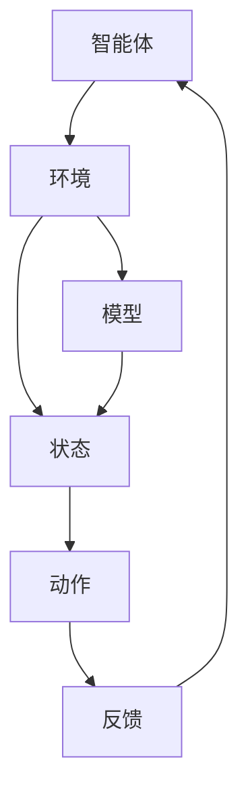

                 

强化学习（Reinforcement Learning，简称RL）是机器学习中的一种重要方法，它通过智能体（agent）与环境的交互，不断地调整策略以实现最优行为。在机器人控制领域，强化学习被广泛应用于路径规划、运动控制、人机交互等任务。本文将探讨强化学习在机器人控制中的实践，包括其核心概念、算法原理、数学模型、项目实践以及未来应用展望。

## 1. 背景介绍

机器人控制是人工智能（AI）领域的一个重要分支，其目标是使机器人能够自主地执行各种任务。传统的机器人控制方法主要依赖于预先编程的规则和模型，这些方法在处理简单、规则明确的问题时效果较好，但在面对复杂、动态的环境时，表现往往不佳。为了克服这些限制，研究者们开始将机器学习，特别是强化学习引入机器人控制领域。

强化学习通过奖励信号引导智能体学习最优策略，使得机器人能够在动态环境中自主地适应和优化其行为。与传统的机器人控制方法相比，强化学习具有更强的灵活性和适应性，因此在机器人控制领域具有广泛的应用前景。

## 2. 核心概念与联系

### 2.1 强化学习基础概念

- **智能体（Agent）**：执行任务的实体，可以是机器人、虚拟代理等。
- **环境（Environment）**：智能体所处的物理或虚拟环境，可以是真实世界或模拟环境。
- **状态（State）**：描述智能体和环境当前情况的属性集合。
- **动作（Action）**：智能体可以采取的行为。
- **策略（Policy）**：将状态映射到动作的函数。
- **价值函数（Value Function）**：评估策略优劣的指标。
- **模型（Model）**：描述环境和状态转移概率的数学模型。

### 2.2 强化学习架构

下面是一个简化的Mermaid流程图，展示了强化学习的基本架构：



## 3. 核心算法原理 & 具体操作步骤

### 3.1 算法原理概述

强化学习的基本原理是，智能体通过不断与环境交互，学习到一个最优策略。这个过程可以分为以下几个步骤：

1. **初始化**：智能体和环境初始化，设定初始状态。
2. **选择动作**：根据当前状态和策略，智能体选择一个动作。
3. **执行动作**：智能体执行所选动作，环境发生变化。
4. **接收反馈**：环境返回新的状态和即时奖励。
5. **更新策略**：根据即时奖励和历史经验，智能体更新策略。

### 3.2 算法步骤详解

1. **初始化**：设定智能体和环境的状态、动作空间、奖励函数等。
2. **选择动作**：使用策略π，根据当前状态s选择动作a。
3. **执行动作**：智能体执行动作a，环境发生变化，进入新状态s'。
4. **接收反馈**：环境返回新状态s'和即时奖励r。
5. **更新策略**：使用强化学习算法（如Q学习、SARSA等），根据即时奖励和历史经验，更新策略π。

### 3.3 算法优缺点

**优点**：
- **灵活性**：可以处理动态和不确定的环境。
- **适应性**：能够根据环境变化自适应地调整策略。
- **自主性**：智能体可以自主地学习最优策略。

**缺点**：
- **收敛速度慢**：在某些情况下，强化学习可能需要大量的交互来收敛到最优策略。
- **样本效率低**：强化学习通常需要大量样本来学习，这可能导致训练时间较长。

### 3.4 算法应用领域

强化学习在机器人控制领域有广泛的应用，包括：

- **路径规划**：机器人自主地在复杂环境中找到最优路径。
- **运动控制**：控制机器人执行复杂的动作，如翻滚、跳跃等。
- **人机交互**：辅助人类完成任务，如智能家居、虚拟助理等。

## 4. 数学模型和公式

### 4.1 数学模型构建

强化学习的核心数学模型包括状态值函数V(s)和动作值函数Q(s, a)。

- **状态值函数**：V(s) = E[R(t) | S(t) = s]
  - 其中，E表示期望值，R(t)表示未来所有奖励的累积和，S(t)表示智能体在时间t的状态。

- **动作值函数**：Q(s, a) = E[R(t) | S(t) = s, A(t) = a]
  - 其中，Q(s, a)表示在状态s下执行动作a得到的期望奖励。

### 4.2 公式推导过程

强化学习的核心目标是最小化期望回报的方差，即最大化期望回报。

- **期望回报**：J(π) = E[R(t) | π]
  - 其中，π是策略，J(π)是策略π的期望回报。

- **方差**：V(J(π)) = E[J(π)^2] - (E[J(π)])^2

### 4.3 案例分析与讲解

以Q学习算法为例，其核心公式为：

- **Q值更新**：Q(s, a) = Q(s, a) + α [r + γ max(Q(s', a')) - Q(s, a)]
  - 其中，α是学习率，γ是折扣因子，s'是执行动作a后智能体所处的状态。

## 5. 项目实践：代码实例

### 5.1 开发环境搭建

```bash
pip install gym
```

### 5.2 源代码详细实现

以下是一个简单的强化学习代码示例，使用Python实现Q学习算法：

```python
import numpy as np
import gym

# 初始化环境
env = gym.make('CartPole-v0')

# 初始化Q表
Q = np.zeros([env.observation_space.n, env.action_space.n])

# 设置参数
alpha = 0.1
gamma = 0.99
episodes = 1000

# 强化学习循环
for episode in range(episodes):
    state = env.reset()
    done = False
    total_reward = 0

    while not done:
        # 选择动作
        action = np.argmax(Q[state, :])

        # 执行动作
        next_state, reward, done, _ = env.step(action)

        # 更新Q值
        Q[state, action] = Q[state, action] + alpha * (reward + gamma * np.max(Q[next_state, :]) - Q[state, action])

        state = next_state
        total_reward += reward

    print(f"Episode {episode+1}: Total Reward = {total_reward}")

# 关闭环境
env.close()
```

### 5.3 代码解读与分析

- **环境初始化**：使用gym库创建CartPole环境。
- **Q表初始化**：创建一个大小为[状态数，动作数]的全零数组。
- **参数设置**：设置学习率α、折扣因子γ和训练轮数episodes。
- **强化学习循环**：在每个训练轮次中，智能体从初始状态开始，选择动作，执行动作，接收反馈，并更新Q值。
- **运行结果**：在每个训练轮次结束时，打印总奖励。

## 6. 实际应用场景

### 6.1 工业机器人控制

在工业生产中，机器人需要执行复杂的装配、焊接、搬运等任务。强化学习可以训练机器人适应不同的工作环境和工件，提高生产效率和灵活性。

### 6.2 服务机器人控制

服务机器人如家用机器人、餐厅服务员等，需要在复杂、动态的环境中与人交互。强化学习可以帮助机器人学习如何响应人类指令，提高服务质量和用户体验。

### 6.3 自动驾驶汽车

自动驾驶汽车需要在道路上实时决策，处理复杂的交通状况。强化学习可以训练自动驾驶系统在模拟环境中学习驾驶策略，提高自动驾驶的稳定性和安全性。

## 7. 未来应用展望

随着强化学习算法和硬件技术的发展，未来强化学习在机器人控制中的应用将会更加广泛和深入。以下是一些可能的发展方向：

### 7.1 算法优化

强化学习算法的收敛速度和样本效率是当前研究的重点。通过改进算法，如使用深度学习技术，可以提高强化学习的性能。

### 7.2 多智能体系统

在多智能体系统中，强化学习可以训练多个智能体协同工作，实现更复杂的任务。

### 7.3 强化学习与感知融合

将强化学习与感知技术结合，可以使得机器人更好地理解和适应动态环境。

### 7.4 安全性和鲁棒性

强化学习在应用过程中，需要保证系统的安全性和鲁棒性，以应对意外情况。

## 8. 总结：未来发展趋势与挑战

### 8.1 研究成果总结

本文介绍了强化学习在机器人控制中的实践，包括核心概念、算法原理、数学模型、项目实践和未来应用展望。强化学习在机器人控制领域展示了巨大的潜力和应用价值。

### 8.2 未来发展趋势

未来，强化学习在机器人控制中的应用将会更加广泛和深入，随着算法和硬件技术的发展，将推动机器人控制技术的进步。

### 8.3 面临的挑战

强化学习在应用过程中，需要解决收敛速度慢、样本效率低、安全性和鲁棒性等问题。

### 8.4 研究展望

通过持续的研究和技术创新，强化学习在机器人控制领域有望实现更大的突破。

## 9. 附录：常见问题与解答

### 9.1 什么是强化学习？

强化学习是一种机器学习方法，通过智能体与环境的交互，不断调整策略以实现最优行为。

### 9.2 强化学习有哪些算法？

强化学习的主要算法包括Q学习、SARSA、Deep Q Network（DQN）等。

### 9.3 强化学习在机器人控制中的应用有哪些？

强化学习在机器人控制中的应用包括路径规划、运动控制、人机交互等。

### 9.4 如何提高强化学习的效果？

可以通过改进算法、增加训练样本、使用感知技术等方式提高强化学习的效果。

作者：禅与计算机程序设计艺术 / Zen and the Art of Computer Programming
----------------------------------------------------------------
本文以《强化学习在机器人控制中的实践》为标题，详细介绍了强化学习在机器人控制领域的基本概念、算法原理、数学模型、项目实践以及未来应用展望。通过深入剖析强化学习在机器人控制中的应用，本文展示了其在提高机器人自主性和适应能力方面的巨大潜力。同时，本文也对强化学习在应用过程中面临的挑战提出了可能的解决方案，为未来的研究和发展提供了有益的启示。

