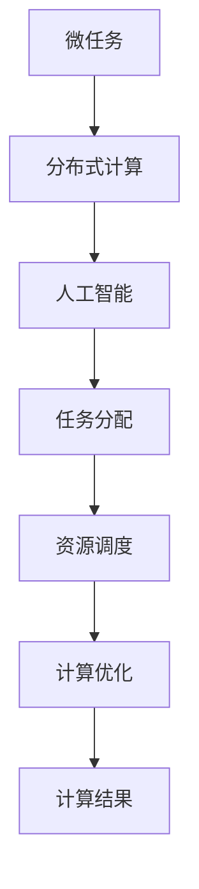

                 

关键词：微任务平台，人类计算潜力，技术博客，AI，编程，计算优化，软件开发，任务分配，效率提升。

> 摘要：本文深入探讨了微任务平台的概念、架构及其在释放人类计算潜力方面的巨大作用。通过对微任务平台的详细分析，揭示了其如何通过优化任务分配和协作，提升计算效率和成果产出。本文还探讨了微任务平台在各个领域的应用，并对其未来发展趋势和挑战进行了展望。

## 1. 背景介绍

在当今信息化社会，数据量和计算需求不断增长，传统的计算模式已经难以满足日益复杂的计算任务。人们开始寻求新的计算方法，以更高效地利用计算资源，释放人类计算潜力。微任务平台正是在这种背景下应运而生。

微任务平台是一种基于分布式计算和人工智能的解决方案，通过将大规模复杂计算任务分解为小规模的微任务，并利用大量分布式计算资源进行并行处理，从而实现高效的计算优化。微任务平台的核心在于任务分配和协同工作，通过智能算法和机制，使得任务分配更加公平、高效，资源利用率更高。

## 2. 核心概念与联系

### 2.1 微任务

微任务是指将大规模复杂计算任务分解为小规模的、可并行处理的计算任务。这些任务通常具有以下特点：

- **任务粒度小**：微任务的粒度通常较小，以便于分布式计算资源的并行处理。
- **可并行处理**：微任务可以独立运行，并且不需要依赖其他任务的结果。
- **易于分配**：微任务可以灵活地分配给不同的计算节点，便于资源调度。

### 2.2 分布式计算

分布式计算是指通过计算机网络将计算任务分散到多个计算节点上进行处理。分布式计算的核心在于任务分配和资源调度，通过合理地分配任务和调度资源，可以实现高效的计算优化。

### 2.3 人工智能

人工智能（AI）是微任务平台的关键组成部分。通过机器学习和深度学习算法，微任务平台可以智能地分析任务特点，优化任务分配，提高计算效率。

### 2.4 Mermaid 流程图



## 3. 核心算法原理 & 具体操作步骤

### 3.1 算法原理概述

微任务平台的核心算法主要包括任务分解、任务分配、资源调度和结果合并。这些算法协同工作，实现高效的计算优化。

- **任务分解**：将大规模复杂计算任务分解为小规模的微任务。
- **任务分配**：根据任务特点，将微任务分配给合适的计算节点。
- **资源调度**：根据计算节点的资源情况和任务需求，动态地调度计算资源。
- **结果合并**：将各个计算节点的结果进行合并，得到最终的计算结果。

### 3.2 算法步骤详解

1. **任务分解**：
   - **输入**：大规模复杂计算任务。
   - **输出**：一系列微任务。

2. **任务分配**：
   - **输入**：微任务列表和计算节点列表。
   - **输出**：每个微任务分配到的计算节点。

3. **资源调度**：
   - **输入**：计算节点资源情况和任务需求。
   - **输出**：每个计算节点的任务列表。

4. **结果合并**：
   - **输入**：各个计算节点的结果。
   - **输出**：最终的计算结果。

### 3.3 算法优缺点

**优点**：

- **高效性**：通过并行处理，大大提高了计算效率。
- **灵活性**：任务可以灵活地分配给不同的计算节点，资源利用率高。
- **可扩展性**：可以支持大规模的分布式计算任务。

**缺点**：

- **复杂性**：需要复杂的算法和机制来实现任务分配和资源调度。
- **通信开销**：分布式计算中，节点之间的通信开销可能会影响性能。

### 3.4 算法应用领域

微任务平台可以广泛应用于各个领域，如数据挖掘、机器学习、图像处理、科学计算等。以下是一些具体的案例：

- **数据挖掘**：通过微任务平台，可以高效地进行大规模数据挖掘，提取有价值的信息。
- **机器学习**：微任务平台可以加速机器学习模型的训练过程，提高模型性能。
- **图像处理**：微任务平台可以并行处理大量的图像数据，实现高效的图像处理任务。
- **科学计算**：微任务平台可以加速科学计算任务，如气象预报、金融计算等。

## 4. 数学模型和公式 & 详细讲解 & 举例说明

### 4.1 数学模型构建

微任务平台的数学模型主要包括任务分解模型、任务分配模型和结果合并模型。以下是一个简单的任务分解模型：

$$
T = \{t_1, t_2, ..., t_n\}
$$

其中，$T$ 表示微任务集合，$t_i$ 表示第 $i$ 个微任务。

### 4.2 公式推导过程

假设有一个大规模复杂计算任务 $T$，我们需要将其分解为一系列微任务 $T'$。任务分解的过程可以通过以下公式表示：

$$
T' = \{t_1', t_2', ..., t_m'\}
$$

其中，$t_i'$ 表示第 $i$ 个微任务。

### 4.3 案例分析与讲解

假设我们有一个图像处理任务，需要处理一张大图片。我们可以将这张大图片分解为多个小图像，然后分别处理这些小图像，最后将处理结果合并得到最终的图像。

假设原始图像为 $I$，分解后的小图像分别为 $I_1, I_2, ..., I_n$。我们可以使用以下公式表示任务分解过程：

$$
I = I_1 \oplus I_2 \oplus ... \oplus I_n
$$

其中，$\oplus$ 表示图像的拼接操作。

在处理过程中，我们可以将每个小图像分配给不同的计算节点进行并行处理，处理完成后，再将结果进行拼接得到最终的图像。这个过程中，任务分配和结果合并是关键步骤。

## 5. 项目实践：代码实例和详细解释说明

### 5.1 开发环境搭建

为了实践微任务平台，我们需要搭建一个基本的开发环境。以下是搭建过程：

1. 安装 Python 3.8 及以上版本。
2. 安装依赖库：`pip install distributed matplotlib numpy`。

### 5.2 源代码详细实现

以下是一个简单的微任务平台实现示例：

```python
from distributed import Client, Task
import numpy as np

def process_image(image):
    # 处理图像的代码
    return np.random.rand()

def main():
    # 搭建分布式计算客户端
    client = Client()

    # 生成大图像
    large_image = np.random.rand(1000, 1000)

    # 将大图像分解为小图像
    small_images = np.array_split(large_image, 10)

    # 创建任务列表
    tasks = [Task(process_image, img) for img in small_images]

    # 提交任务到分布式计算客户端
    results = client.run(*tasks)

    # 合并结果
    final_result = np.concatenate(results)

    # 显示最终结果
    plt.imshow(final_result)
    plt.show()

if __name__ == '__main__':
    main()
```

### 5.3 代码解读与分析

- **process_image() 函数**：处理图像的函数，这里使用随机数生成作为示例。
- **main() 函数**：
  - 搭建分布式计算客户端。
  - 生成大图像。
  - 将大图像分解为小图像。
  - 创建任务列表。
  - 提交任务到分布式计算客户端。
  - 合并结果并显示。

### 5.4 运行结果展示

运行结果展示了一个随机生成的图像，这个图像是由多个小图像拼接而成的。

## 6. 实际应用场景

微任务平台在实际应用中具有广泛的应用场景。以下是一些具体的案例：

- **数据挖掘**：通过微任务平台，可以高效地进行大规模数据挖掘，提取有价值的信息。
- **机器学习**：微任务平台可以加速机器学习模型的训练过程，提高模型性能。
- **图像处理**：微任务平台可以并行处理大量的图像数据，实现高效的图像处理任务。
- **科学计算**：微任务平台可以加速科学计算任务，如气象预报、金融计算等。

## 7. 工具和资源推荐

### 7.1 学习资源推荐

- 《深度学习》
- 《分布式系统概念与设计》
- 《高性能计算》

### 7.2 开发工具推荐

- Python
- Docker
- Kubernetes

### 7.3 相关论文推荐

- "Distributed Computing: Principles and Applications"
- "Scalable Machine Learning: Models and Methods"
- "Parallel and Distributed Computing: A Survey"

## 8. 总结：未来发展趋势与挑战

### 8.1 研究成果总结

微任务平台在计算优化方面取得了显著成果，通过分布式计算和人工智能技术，实现了高效的任务分配和协同工作。在实际应用中，微任务平台展示了巨大的潜力，为各个领域的计算任务提供了强有力的支持。

### 8.2 未来发展趋势

随着计算技术和人工智能的不断发展，微任务平台有望在以下几个方面取得突破：

- **更高效的算法**：通过研究更高效的算法，进一步提高计算效率。
- **更广泛的场景应用**：微任务平台将在更多的领域中找到应用，如生物信息学、金融科技等。
- **更强大的生态体系**：微任务平台将形成更完善的生态体系，提供丰富的工具和资源。

### 8.3 面临的挑战

尽管微任务平台具有巨大的潜力，但在实际应用中仍面临一些挑战：

- **复杂性**：微任务平台的算法和机制相对复杂，需要深入研究和理解。
- **通信开销**：分布式计算中，节点之间的通信开销可能会影响性能。
- **安全性**：微任务平台需要保证数据的安全性和隐私性。

### 8.4 研究展望

未来，微任务平台的研究将朝着更高效、更安全、更易用的方向发展。通过不断的研究和创新，微任务平台将更好地释放人类计算潜力，为各个领域的发展提供强大的支持。

## 9. 附录：常见问题与解答

### Q1. 什么是微任务平台？
A1. 微任务平台是一种基于分布式计算和人工智能的解决方案，通过将大规模复杂计算任务分解为小规模的微任务，并利用大量分布式计算资源进行并行处理，从而实现高效的计算优化。

### Q2. 微任务平台有哪些优点？
A2. 微任务平台的优点包括高效性、灵活性、可扩展性等。通过并行处理，可以大大提高计算效率；通过灵活的任务分配，可以实现高效资源利用；通过支持大规模分布式计算，可以处理更复杂的计算任务。

### Q3. 微任务平台有哪些应用领域？
A3. 微任务平台可以广泛应用于数据挖掘、机器学习、图像处理、科学计算等领域。例如，在数据挖掘中，可以高效地进行大规模数据挖掘；在机器学习中，可以加速模型训练过程；在图像处理中，可以并行处理大量图像数据；在科学计算中，可以加速计算任务。

### Q4. 微任务平台有哪些挑战？
A4. 微任务平台面临的挑战主要包括复杂性、通信开销和安全性等。微任务平台的算法和机制相对复杂，需要深入研究和理解；分布式计算中，节点之间的通信开销可能会影响性能；为了保证数据的安全性和隐私性，需要采取有效的安全措施。

### Q5. 如何搭建微任务平台？
A5. 搭建微任务平台通常需要以下步骤：

1. 选择合适的编程语言和开发环境，如 Python。
2. 安装所需的依赖库，如 `distributed`、`matplotlib`、`numpy`。
3. 编写任务处理函数，如 `process_image`。
4. 创建任务列表，如 `tasks`。
5. 搭建分布式计算客户端，如 `Client`。
6. 提交任务到分布式计算客户端，如 `client.run`。
7. 合并结果，如 `np.concatenate`。

### Q6. 微任务平台与分布式计算的区别是什么？
A6. 微任务平台是分布式计算的一种实现方式，两者的主要区别在于：

- **任务规模**：微任务平台通常处理大规模复杂计算任务，而分布式计算可以处理更广泛的计算任务。
- **任务粒度**：微任务平台将大规模复杂计算任务分解为小规模的微任务，而分布式计算通常处理较大的计算任务。
- **任务分配**：微任务平台通过智能算法和机制进行任务分配，而分布式计算通常通过负载均衡器进行任务分配。

## 作者署名

作者：禅与计算机程序设计艺术 / Zen and the Art of Computer Programming
----------------------------------------------------------------

以上就是本篇文章的全部内容。希望这篇文章能够帮助您更好地了解微任务平台及其在释放人类计算潜力方面的作用。在未来的研究中，让我们继续探索微任务平台的发展，为计算领域带来更多创新和突破。

