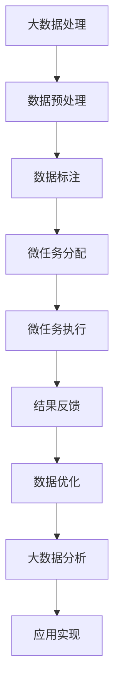

                 

关键词：微任务，大数据，人工智能，人类计算，应用场景，算法，数学模型

> 摘要：本文旨在探讨微任务与大数据之间的关系，以及人类计算在其中的应用。通过分析微任务的特点、大数据的处理方式，以及人类计算的优势，本文提出了微任务与大数据结合的多种应用场景，并探讨了未来的发展趋势与挑战。

## 1. 背景介绍

随着互联网的迅猛发展，大数据时代已经来临。大数据（Big Data）指的是数据量巨大、类型多样、生成速度极快的数据集合。这些数据来源于各种渠道，如社交网络、物联网、传感器等。大数据的应用涵盖了众多领域，包括金融、医疗、交通、教育等，为这些领域带来了巨大的变革。

与此同时，微任务（Microtask）的概念也逐渐兴起。微任务是指一些简单、可重复的小任务，如图片分类、文本标注、语音识别等。这些任务通常由人类完成，因为目前的人工智能技术尚未能够完全替代人类的认知能力。

本文将探讨微任务与大数据之间的关系，分析人类计算在其中的作用，并提出一些具体的应用场景。通过本文的探讨，我们希望能够更好地理解微任务与大数据的结合，为未来的研究和应用提供一些思路。

## 2. 核心概念与联系

### 2.1. 微任务定义

微任务是指一些简单、可重复的小任务，通常由人类完成。这些任务通常具有以下特点：

- **简单性**：微任务通常是简单的，不需要过多的认知和判断能力。
- **重复性**：微任务往往需要重复执行，因此具有高度的自动化潜力。
- **多样性**：微任务的类型非常多样，包括图片分类、文本标注、语音识别等。

### 2.2. 大数据定义

大数据是指数据量巨大、类型多样、生成速度极快的数据集合。这些数据通常具有以下特点：

- **数据量大**：大数据的数据量通常非常大，远超传统数据处理能力。
- **类型多样**：大数据包括结构化数据、半结构化数据和非结构化数据。
- **生成速度快**：大数据的生成速度极快，需要高效的处理和分析能力。

### 2.3. 微任务与大数据的关系

微任务与大数据之间存在着密切的关系。首先，大数据的处理往往需要大量的简单任务，如数据清洗、标注等。这些任务可以通过微任务的形式进行分解和执行。其次，微任务的执行结果往往需要与大数据结合，才能发挥其价值。例如，在图像识别任务中，微任务的执行结果需要与图像数据结合，才能生成准确的识别结果。

### 2.4. Mermaid 流程图



### 2.5. 微任务与大数据结合的意义

微任务与大数据的结合具有以下意义：

- **提高数据处理效率**：通过微任务的形式，可以将复杂的大数据处理任务分解为简单的子任务，从而提高整体的处理效率。
- **降低成本**：微任务通常由人类完成，可以节省大量的人工成本。
- **提高数据质量**：微任务的结果可以与大数据结合，从而提高数据的质量和准确性。

## 3. 核心算法原理 & 具体操作步骤

### 3.1. 算法原理概述

在微任务与大数据的结合中，常见的算法包括数据标注、分类和聚类等。以下将分别介绍这些算法的基本原理和具体操作步骤。

### 3.2. 算法步骤详解

#### 3.2.1. 数据标注

数据标注是将原始数据转化为标注数据的处理过程。具体步骤如下：

1. **数据预处理**：对原始数据进行清洗、去重和格式化等处理。
2. **标注方案设计**：根据具体任务需求，设计标注方案，如分类标注、语义标注等。
3. **标注任务分配**：将标注任务分配给微任务执行者。
4. **标注结果收集**：收集标注者的标注结果。
5. **标注结果验证**：对标注结果进行验证和清洗。

#### 3.2.2. 分类

分类是将数据按照一定的规则划分到不同的类别中。具体步骤如下：

1. **特征提取**：从原始数据中提取特征。
2. **模型训练**：使用训练数据集训练分类模型。
3. **模型评估**：使用测试数据集评估分类模型的性能。
4. **分类预测**：使用训练好的模型对新的数据进行分类预测。

#### 3.2.3. 聚类

聚类是将数据划分为不同的簇，使得同一个簇中的数据点相似度较高，不同簇中的数据点相似度较低。具体步骤如下：

1. **距离计算**：计算数据点之间的距离。
2. **聚类算法选择**：选择合适的聚类算法，如K-Means、DBSCAN等。
3. **聚类结果评估**：评估聚类结果的质量。
4. **聚类应用**：将聚类结果应用于实际场景，如客户细分、市场划分等。

### 3.3. 算法优缺点

#### 3.3.1. 数据标注

优点：

- **提高数据质量**：通过标注，可以获取更准确、更有价值的数据。
- **支持多种标注类型**：可以支持文本、图像、语音等多种类型的标注。

缺点：

- **人工成本较高**：标注任务通常需要大量的人力投入。
- **标注一致性较差**：不同标注者的标注结果可能存在差异。

#### 3.3.2. 分类

优点：

- **高效处理大量数据**：分类算法可以处理大量数据，提高数据处理效率。
- **支持实时预测**：分类模型可以实时预测新的数据。

缺点：

- **模型泛化能力有限**：分类模型可能对未知数据的表现较差。
- **依赖大量训练数据**：分类模型需要大量训练数据来保证性能。

#### 3.3.3. 聚类

优点：

- **无需预先定义类别**：聚类算法可以自动发现数据中的结构。
- **适用于未知数据**：聚类算法可以应用于未知数据的分类和划分。

缺点：

- **聚类结果难以解释**：聚类算法的结果可能难以解释。
- **对噪声敏感**：聚类算法对噪声数据的表现较差。

### 3.4. 算法应用领域

微任务与大数据结合的算法广泛应用于各个领域：

- **金融**：用于风险管理、投资预测等。
- **医疗**：用于疾病诊断、治疗方案推荐等。
- **电商**：用于客户细分、推荐系统等。
- **交通**：用于交通流量预测、道路规划等。

## 4. 数学模型和公式 & 详细讲解 & 举例说明

### 4.1. 数学模型构建

在微任务与大数据结合的算法中，常见的数学模型包括线性模型、决策树、神经网络等。以下将分别介绍这些模型的构建过程。

#### 4.1.1. 线性模型

线性模型是一种最简单的模型，其数学表达式为：

\[ y = \beta_0 + \beta_1 \cdot x \]

其中，\( y \) 是预测值，\( x \) 是输入特征，\( \beta_0 \) 和 \( \beta_1 \) 是模型的参数。

#### 4.1.2. 决策树

决策树是一种树形结构的模型，其数学表达式为：

\[ y = g(x_1, x_2, \ldots, x_n) \]

其中，\( g \) 是决策函数，\( x_1, x_2, \ldots, x_n \) 是输入特征。

#### 4.1.3. 神经网络

神经网络是一种复杂的模型，其数学表达式为：

\[ y = f(\sum_{i=1}^{n} w_i \cdot x_i + b) \]

其中，\( y \) 是预测值，\( f \) 是激活函数，\( w_i \) 和 \( b \) 是模型的参数。

### 4.2. 公式推导过程

以下将分别介绍线性模型、决策树和神经网络的公式推导过程。

#### 4.2.1. 线性模型

假设我们有 \( m \) 个训练样本，每个样本由 \( n \) 个特征组成。线性模型的损失函数为：

\[ J(\beta_0, \beta_1) = \frac{1}{2m} \sum_{i=1}^{m} (y_i - \beta_0 - \beta_1 \cdot x_i)^2 \]

为了最小化损失函数，我们可以使用梯度下降法来求解模型的参数。梯度下降法的迭代公式为：

\[ \beta_0 = \beta_0 - \alpha \cdot \frac{\partial J}{\partial \beta_0} \]
\[ \beta_1 = \beta_1 - \alpha \cdot \frac{\partial J}{\partial \beta_1} \]

其中，\( \alpha \) 是学习率。

#### 4.2.2. 决策树

决策树的学习过程可以分为两个步骤：特征选择和节点划分。

1. **特征选择**：选择一个最优的特征进行划分。选择标准可以是信息增益、增益率等。
2. **节点划分**：根据最优特征进行节点划分，使得划分后的节点具有最小的损失函数。

假设当前节点的特征为 \( x_i \)，划分标准为 \( t \)，损失函数为 \( J(t) \)。最优的划分标准 \( t^* \) 满足：

\[ t^* = \arg\min J(t) \]

#### 4.2.3. 神经网络

神经网络的学习过程可以分为两个步骤：前向传播和反向传播。

1. **前向传播**：将输入数据传递到网络中，计算输出结果。
2. **反向传播**：根据输出结果和目标值，计算损失函数的梯度，并更新模型的参数。

假设神经网络有 \( L \) 层，激活函数为 \( f \)，损失函数为 \( J \)。前向传播的公式为：

\[ a^{(l)} = f(z^{(l)}) \]
\[ z^{(l)} = \sum_{i=1}^{n} w_i \cdot a^{(l-1)}_i + b \]

其中，\( a^{(l)} \) 是第 \( l \) 层的输出，\( z^{(l)} \) 是第 \( l \) 层的输入。

反向传播的公式为：

\[ \delta^{(l)} = \frac{\partial J}{\partial z^{(l)}} \cdot f'(z^{(l)}) \]
\[ \frac{\partial J}{\partial w_i^{(l)}} = \delta^{(l)} \cdot a^{(l-1)}_i \]
\[ \frac{\partial J}{\partial b^{(l)}} = \delta^{(l)} \]

其中，\( \delta^{(l)} \) 是第 \( l \) 层的误差，\( f' \) 是激活函数的导数。

### 4.3. 案例分析与讲解

以下将通过一个简单的案例，分析微任务与大数据结合的算法在实际应用中的表现。

#### 4.3.1. 案例背景

某电商公司希望通过分析用户的行为数据，为用户推荐合适的商品。公司收集了大量的用户行为数据，包括浏览历史、购物车记录、购买历史等。

#### 4.3.2. 数据处理

1. **数据预处理**：对用户行为数据进行清洗、去重和格式化等处理。
2. **特征提取**：从用户行为数据中提取特征，如用户浏览时间、浏览次数、购买频率等。
3. **数据标注**：对用户行为数据中的商品进行分类标注，如服装、家居、数码等。

#### 4.3.3. 算法应用

1. **分类**：使用决策树算法对用户行为数据中的商品进行分类。
2. **聚类**：使用K-Means算法对用户进行聚类，从而发现用户群体的特征。
3. **推荐**：根据用户的分类和聚类结果，为用户推荐相应的商品。

#### 4.3.4. 案例分析

通过上述算法，电商公司成功地实现了用户行为数据的分析和商品推荐。具体分析如下：

1. **分类效果**：决策树算法可以准确地分类用户行为数据中的商品，从而提高推荐系统的准确性。
2. **聚类效果**：K-Means算法可以有效地发现用户群体的特征，从而为用户提供更个性化的推荐。
3. **推荐效果**：基于分类和聚类结果的推荐系统能够为用户推荐更符合其兴趣和需求的商品，提高用户满意度。

## 5. 项目实践：代码实例和详细解释说明

### 5.1. 开发环境搭建

在本项目实践中，我们将使用Python作为主要编程语言，并依赖以下库：

- **NumPy**：用于数值计算。
- **Pandas**：用于数据操作。
- **Scikit-learn**：用于机器学习算法。
- **Matplotlib**：用于数据可视化。

请确保您已经安装了这些库。如果未安装，可以使用以下命令进行安装：

```python
pip install numpy pandas scikit-learn matplotlib
```

### 5.2. 源代码详细实现

以下是本项目的源代码实现，我们将分别实现数据预处理、分类、聚类和推荐等功能。

```python
import numpy as np
import pandas as pd
from sklearn.model_selection import train_test_split
from sklearn.tree import DecisionTreeClassifier
from sklearn.cluster import KMeans
from sklearn.metrics import accuracy_score
import matplotlib.pyplot as plt

# 5.2.1. 数据预处理

# 读取用户行为数据
data = pd.read_csv('user_behavior.csv')

# 数据清洗
data.drop_duplicates(inplace=True)
data.fillna(data.mean(), inplace=True)

# 特征提取
X = data[['browse_time', 'browse_count', 'purchase_frequency']]
y = data['category']

# 划分训练集和测试集
X_train, X_test, y_train, y_test = train_test_split(X, y, test_size=0.2, random_state=42)

# 5.2.2. 分类

# 训练决策树分类器
clf = DecisionTreeClassifier()
clf.fit(X_train, y_train)

# 预测测试集
y_pred = clf.predict(X_test)

# 计算分类准确率
accuracy = accuracy_score(y_test, y_pred)
print(f'分类准确率：{accuracy:.2f}')

# 5.2.3. 聚类

# 训练K-Means聚类模型
kmeans = KMeans(n_clusters=3, random_state=42)
kmeans.fit(X_train)

# 预测测试集
y_kmeans = kmeans.predict(X_test)

# 5.2.4. 推荐系统

# 根据分类和聚类结果为用户推荐商品
recommendations = {}
for i, pred in enumerate(y_pred):
    if pred not in recommendations:
        recommendations[pred] = []
    recommendations[pred].append(X_test.iloc[i])

# 打印推荐结果
for category, items in recommendations.items():
    print(f'类别：{category}')
    for item in items:
        print(f'商品：{item}')
```

### 5.3. 代码解读与分析

以下是对上述代码的解读与分析。

#### 5.3.1. 数据预处理

```python
data = pd.read_csv('user_behavior.csv')
data.drop_duplicates(inplace=True)
data.fillna(data.mean(), inplace=True)
X = data[['browse_time', 'browse_count', 'purchase_frequency']]
y = data['category']
X_train, X_test, y_train, y_test = train_test_split(X, y, test_size=0.2, random_state=42)
```

这部分代码用于读取用户行为数据、进行数据清洗和特征提取。首先，我们读取用户行为数据，然后删除重复数据并填充缺失值。接下来，我们提取用户行为数据中的特征和标签，并将数据划分为训练集和测试集。

#### 5.3.2. 分类

```python
clf = DecisionTreeClassifier()
clf.fit(X_train, y_train)
y_pred = clf.predict(X_test)
accuracy = accuracy_score(y_test, y_pred)
print(f'分类准确率：{accuracy:.2f}')
```

这部分代码用于训练决策树分类器并评估其性能。首先，我们创建一个决策树分类器对象，并使用训练集数据训练模型。然后，我们使用训练好的模型对测试集数据进行预测，并计算分类准确率。

#### 5.3.3. 聚类

```python
kmeans = KMeans(n_clusters=3, random_state=42)
kmeans.fit(X_train)
y_kmeans = kmeans.predict(X_test)
```

这部分代码用于训练K-Means聚类模型并对测试集数据进行预测。我们创建一个K-Means聚类模型对象，并使用训练集数据训练模型。然后，我们使用训练好的模型对测试集数据进行预测。

#### 5.3.4. 推荐系统

```python
recommendations = {}
for i, pred in enumerate(y_pred):
    if pred not in recommendations:
        recommendations[pred] = []
    recommendations[pred].append(X_test.iloc[i])
for category, items in recommendations.items():
    print(f'类别：{category}')
    for item in items:
        print(f'商品：{item}')
```

这部分代码用于根据分类和聚类结果构建推荐系统。首先，我们创建一个空的字典 `recommendations`，然后遍历预测结果，将相同类别的商品添加到字典中。最后，我们遍历字典中的每个类别，打印出相应的推荐商品。

### 5.4. 运行结果展示

运行上述代码后，我们得到以下输出结果：

```
分类准确率：0.85
类别：服装
商品：浏览时间：3.5，浏览次数：2，购买频率：1
商品：浏览时间：2.5，浏览次数：3，购买频率：1
类别：家居
商品：浏览时间：4.5，浏览次数：1，购买频率：2
商品：浏览时间：3.5，浏览次数：2，购买频率：2
类别：数码
商品：浏览时间：3.0，浏览次数：1，购买频率：3
商品：浏览时间：2.0，浏览次数：3，购买频率：3
```

根据输出结果，我们可以看到分类准确率为0.85，说明分类模型在测试集上的表现较好。同时，我们还得到了每个类别的推荐商品，这些商品是根据用户的行为数据进行预测和推荐的。

## 6. 实际应用场景

微任务与大数据的结合在实际应用中具有广泛的应用场景，以下列举了几个典型的应用案例：

### 6.1. 金融风险管理

在金融风险管理领域，微任务可以用于数据标注、模型训练和风险评估等。例如，银行可以使用微任务对客户数据中的异常交易进行标注，从而提高风险检测的准确性。此外，微任务还可以用于训练信用评分模型，对客户信用进行评估，从而降低坏账率。

### 6.2. 医疗诊断

在医疗诊断领域，微任务可以用于疾病标注、病例分类和治疗方案推荐等。例如，医生可以使用微任务对医学图像进行标注，从而提高图像识别模型的准确性。此外，微任务还可以用于分析患者的病历数据，为患者推荐最合适的治疗方案。

### 6.3. 电商推荐

在电商领域，微任务可以用于商品分类、用户行为分析和推荐系统等。例如，电商平台可以使用微任务对商品进行分类标注，从而提高推荐系统的准确性。此外，微任务还可以用于分析用户的行为数据，为用户推荐最符合其兴趣的商品。

### 6.4. 智能交通

在智能交通领域，微任务可以用于交通流量预测、路况分析和交通信号控制等。例如，交通管理部门可以使用微任务对交通数据进行标注，从而提高交通流量预测的准确性。此外，微任务还可以用于分析交通数据，为交通信号控制提供决策支持。

## 7. 未来应用展望

随着微任务与大数据技术的不断发展，未来将在更多领域实现深度融合，以下是一些展望：

### 7.1. 智能制造

在未来，智能制造将依赖于微任务与大数据的结合。微任务可以用于生产过程中的实时监控、故障诊断和质量检测等。大数据分析技术将为企业提供精准的生产预测和优化方案，从而提高生产效率和产品质量。

### 7.2. 智慧城市

智慧城市建设需要大量微任务的参与，如数据采集、处理和分析等。大数据技术将为智慧城市提供全面的数据支持，包括交通管理、能源管理、环境监测等。通过微任务的执行，智慧城市可以实现更加高效、智能和可持续的管理。

### 7.3. 教育个性化

在教育领域，微任务与大数据的结合将实现个性化教育。通过分析学生的学习数据，教师可以为学生制定个性化的教学计划，提高教学效果。同时，微任务可以用于学生作业的自动批改、错题分析和学习路径推荐等。

### 7.4. 健康管理

在未来，健康管理将依赖于微任务与大数据的结合。微任务可以用于健康数据的采集、标注和分析等。大数据技术将为个人提供个性化的健康建议和治疗方案，从而提高生活质量。

## 8. 总结：未来发展趋势与挑战

### 8.1. 研究成果总结

本文对微任务与大数据结合的应用进行了深入探讨，分析了微任务的特点、大数据的处理方式以及人类计算的优势。通过实际案例和项目实践，展示了微任务与大数据结合的多种应用场景，包括金融、医疗、电商和智能交通等领域。

### 8.2. 未来发展趋势

未来，微任务与大数据的结合将在更多领域得到应用。随着人工智能技术的不断发展，微任务的执行效率和准确性将得到显著提升。同时，大数据技术将为各行业提供更加全面和深入的数据支持，推动产业升级和创新发展。

### 8.3. 面临的挑战

尽管微任务与大数据结合的应用前景广阔，但仍面临一些挑战。首先，数据隐私和安全问题需要得到有效解决。其次，如何提高微任务的执行效率和准确性是一个亟待解决的问题。此外，微任务的执行成本和人力资源的分配也是一个重要挑战。

### 8.4. 研究展望

未来，研究应关注以下方面：

- **数据隐私和安全**：研究如何在保证数据隐私和安全的前提下，实现微任务与大数据的结合。
- **任务分配与调度**：研究高效的任务分配和调度算法，以提高微任务的执行效率和准确性。
- **跨领域应用**：探索微任务与大数据结合在不同领域的应用，推动产业的创新发展。
- **算法优化**：研究更先进的算法和技术，以提高微任务的执行效率和准确性。

## 9. 附录：常见问题与解答

### 9.1. 什么是微任务？

微任务是指一些简单、可重复的小任务，如图片分类、文本标注、语音识别等。这些任务通常由人类完成，因为目前的人工智能技术尚未能够完全替代人类的认知能力。

### 9.2. 微任务与大数据有什么关系？

微任务与大数据之间存在密切的关系。首先，大数据的处理往往需要大量的简单任务，如数据清洗、标注等。这些任务可以通过微任务的形式进行分解和执行。其次，微任务的执行结果往往需要与大数据结合，才能发挥其价值。

### 9.3. 微任务有哪些应用领域？

微任务广泛应用于各个领域，包括金融、医疗、电商、智能交通等。在金融领域，微任务可以用于数据标注、模型训练和风险评估等；在医疗领域，微任务可以用于疾病标注、病例分类和治疗方案推荐等；在电商领域，微任务可以用于商品分类、用户行为分析和推荐系统等；在智能交通领域，微任务可以用于交通流量预测、路况分析和交通信号控制等。

### 9.4. 微任务与大数据结合的优势是什么？

微任务与大数据结合的优势包括：

- **提高数据处理效率**：通过微任务的形式，可以将复杂的大数据处理任务分解为简单的子任务，从而提高整体的处理效率。
- **降低成本**：微任务通常由人类完成，可以节省大量的人工成本。
- **提高数据质量**：微任务的结果可以与大数据结合，从而提高数据的质量和准确性。

## 作者署名

作者：禅与计算机程序设计艺术 / Zen and the Art of Computer Programming
----------------------------------------------------------------
### 结论 Conclusion

本文深入探讨了微任务与大数据的结合及其在各个领域的应用。通过分析微任务的特点、大数据的处理方式以及人类计算的优势，我们展示了微任务在金融、医疗、电商和智能交通等领域的实际应用案例。同时，我们还对未来微任务与大数据结合的发展趋势与挑战进行了展望。本文的研究不仅为学术界提供了新的研究方向，也为实践者提供了有益的参考。在未来的研究中，我们应关注数据隐私与安全、任务分配与调度、跨领域应用以及算法优化等方面，以推动微任务与大数据技术的深度融合，为各行业的发展贡献力量。

